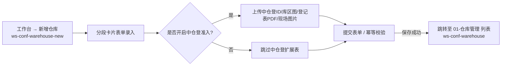

# 新增仓库

> **文档状态**：已根据 6.1 迭代及最新基准版完成 H5 端 PRD / 字段清单更新  
> **moduleId**：`ws-conf-warehouse-new`  
> **菜单路径**：工作台 → 配置管理 → 新增仓库  
> **原型路由**：`/m/module/ws-conf-warehouse-new`  
> **PC 对照**：[10-仓库管理-仓库管理（新增仓库抽屉/弹窗）](../../../../B端PC/08-配置管理/10-仓库管理-仓库管理/)  
> **功能清单唯一定义来源**：`03-前端原型demo/B端H5/src/data/mobileMenuData.ts`  
> **基准路径**：`B端H5/02-工作台/06-配置管理/02-新增仓库`  
> **导航索引**：[00-菜单地图.md](../../../00-菜单地图.md) · [01-功能清单与原型路由.md](../../../01-功能清单与原型路由.md)  
> **历史设计与架构定位**：由于 H5 移动端历史功能菜单规划，新增仓库作为**独立二级菜单入口**进行暴露（与 [01-仓库管理](../01-仓库管理/) 并列）。业务上，本模块是仓库主档、管理方信息与中仓登准入资质录入的表单主流程，提交成功后数据写入主档并在 [01-仓库管理](../01-仓库管理/) 中查看和维护。

---

## 模块文档清单

| 文档名称 | 类型 | 说明 | 链接 |
| :--- | :--- | :--- | :--- |
| **新增仓库主PRD.md** | 主规格 PRD | H5 端新增仓库全流程规格说明书（表单录入、联动校验、中仓登资质、提交控制） | [新增仓库主PRD.md](./新增仓库主PRD.md) |
| **新增仓库字段清单.md** | 字段规格 | H5 端新增仓库表单字段组件、校验规则与提示语唯一定义 | [新增仓库字段清单.md](./新增仓库字段清单.md) |

---

## 功能说明

录入新入驻仓库资质、地理坐标/详细地址、管理方权属证明、仓库类型、监管人员及中仓登准入配套资质。

### 核心能力覆盖

1. **基础信息录入**：
   - 仓库名称输入与租户内唯一性校验；
   - 仓库地址（省/市/区 级联选择器 + 详细地址文本域）；
   - 仓库面积（正数，最多 2 位小数，单位 ㎡）；
   - 仓库类型多选（`储罐` 与 `筒仓` 互斥控制；勾选 `其他` 时展开填写其他类型名称）；
   - 仓库监管员 / 片区经理多选下拉（自动过滤已停用账号及无权限人员）。
2. **管理方主体录入**：
   - 管理方类型单选（企业 / 个人）；
   - 企业名称 / 个人姓名录入；
   - 统一社会信用代码（18位格式校验）/ 身份证号（18位格式校验）；
   - 联系电话录入与格式校验；
   - 仓库权属关系单选（自有 / 租赁 / 其他）。
3. **中仓登准入资质联动（核心风控）**：
   - 管理方为企业时可选“是”，个人管理方强制为“否”且禁用；
   - 选择“是”时，动态展开并强制必填 4 项资料（中仓登ID、库区图、信息登记表盖章PDF、现场图片墙）；
   - 严格呈现 3 条标准重要提示语；
   - 由“是”切为“否”时同事务清空 4 项资料。
4. **提交与流程控制**：
   - 客户端即时校验 + 服务端强校验；
   - 防重复提交机制（按钮 Loading 遮罩 + Request-ID 幂等控制）；
   - 提交成功后 Toast 提示“创建仓库成功”并自动跳转至 [01-仓库管理](../01-仓库管理/) 列表。

---

## 菜单协同链路

---

## 修订记录

| 日期 | 版本 | 变更说明 | 变更人 |
| :--- | :---: | :--- | :--- |
| 2026-08-28 | V1.0 | 目录结构初始化（占位） | 系统架构组 |
| 2026-09-02 | V2.0 | 根据 6.1 迭代及最新基准版全量落地 H5 新增仓库主 PRD 及字段清单；梳理独立入口协同机制与业务规则 | AI PM / 森云科技 |
