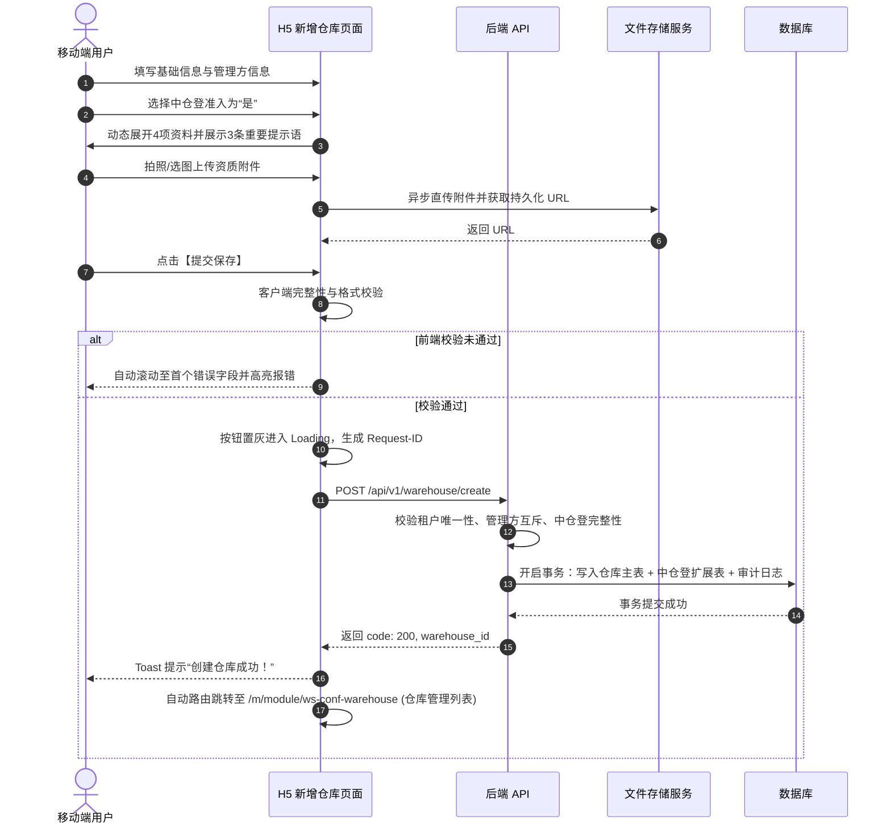

# 新增仓库主PRD（B端H5）

> **端**：B端H5（移动机构端）  
> **moduleId**：`ws-conf-warehouse-new`  
> **菜单路径**：工作台 → 配置管理 → 新增仓库  
> **原型路由**：`/m/module/ws-conf-warehouse-new`  
> **PC 对照**：[B端PC 10-仓库管理-仓库管理（新增仓库抽屉/弹窗）](../../../../B端PC/08-配置管理/10-仓库管理-仓库管理/仓库管理主PRD.md)  
> **编写依据**：[新增仓库字段清单.md](./新增仓库字段清单.md) · [PC 仓库管理主PRD](../../../../B端PC/08-配置管理/10-仓库管理-仓库管理/仓库管理主PRD.md)  
> **业务规则基准**：本模块所有字段校验、主体互斥、中仓登联动规则与数据持久化逻辑均以 [PC 仓库管理主PRD](../../../../B端PC/08-配置管理/10-仓库管理-仓库管理/仓库管理主PRD.md) 为单一真实数据源。  
> **下游查看模块**：提交成功后数据写入主档，可在 [01-仓库管理](../01-仓库管理/)（`/m/module/ws-conf-warehouse`）中查看与维护。

---

## 1. 业务背景与定位

在供应链金融存货监管场景下，新仓入驻是业务落地的首要前提。现场监管人员或机构配置维护人员需要使用移动设备在仓库现场快速录入仓库基础物理属性、管理方主体资质及中仓登准入备案资料。

在 H5 端历史设计中，**新增仓库**作为独立二级菜单入口（`ws-conf-warehouse-new`）呈现，提供更聚焦、沉浸且符合移动端手势的表单填写体验。

---

## 2. 功能范围

### 本期范围
- **仓库基础信息录入**：仓库名称（租户内唯一）、省市区级联地址+详细地址、仓库面积、仓库类型多选（储罐与筒仓互斥、勾选其他展开说明）、监管员/片区经理多选；
- **管理方主体信息录入**：主体类型（企业/个人）、企业名称/个人姓名、统一社会信用代码/身份证号校验、联系电话、权属关系（自有/租赁/其他）；
- **中仓登准入资质联动**：
  - 管理方为企业时可选“是”，个人管理方强制禁用选“是”；
  - 选“是”时展开 4 项条件必填资料（中仓登ID、库区图、信息登记表盖章PDF、现场图片）并展示 3 条标准提示语；
  - 切为“否”时自动清空 4 项中仓登数据；
- **表单校验与防重提交**：前端即时校验、服务端强校验、Request-ID 幂等防重；
- **页面流转与反馈**：提交成功后 Toast 提示“创建仓库成功”并自动跳转至 [01-仓库管理](../01-仓库管理/) 列表页。

### 不在本期范围
- 仓库下辖库房与分区的初始批量创建（仓库创建完成后进入仓库详情页维护）；
- 中仓登官方 API 线上自动联调（本期为线下准入信息留痕）。

---

## 3. 页面与移动端交互设计

### 3.1 页面整体架构

页面采用移动端经典的**分段卡片式长表单**，底部固定操作栏：

```
+------------------------------------------+
| < 新增仓库                               |
+------------------------------------------+
| ┌─ 1. 仓库基础信息 ───────────────────┐ |
| │ * 仓库名称: [请输入仓库名称...       ] │ |
| │ * 仓库地址: [请选择省/市/区        >] │ |
| │   详细地址: [请输入详细地址...       ] │ |
| │ * 仓库面积: [        ] ㎡           │ |
| │ * 仓库类型: [储罐][筒仓][常温][冷库].. │ |
| │   仓库监管员: [请选择监管员        >] │ |
| │   片区经理: [请选择片区经理        >] │ |
| └──────────────────────────────────────┘ |
| ┌─ 2. 管理方信息 ─────────────────────┐ |
| │ * 管理方类型: (o) 企业   ( ) 个人   │ |
| │ * 管理方名称: [请输入企业名称/姓名  ] │ |
| │ * 证件号码: [统一社会信用代码/身份证] │ |
| │   联系电话: [请输入手机号/电话       ] │ |
| │ * 权属关系: (o)自有 ( )租赁 ( )其他 │ |
| └──────────────────────────────────────┘ |
| ┌─ 3. 中仓登准入资质 ─────────────────┐ |
| │ * 是否中仓登准入: ( ) 是   (o) 否   │ |
| │   (选“是”展开4项必填资料与3条提示语) │ |
| └──────────────────────────────────────┘ |
|                                          |
| [               提交保存               ] |
+------------------------------------------+
```

---

### 3.2 分段表单交互细节

#### 3.2.1 仓库基础信息卡片
1. **仓库名称**：
   - 必填，单行输入框，限制最大 50 字符；
   - 失焦（Blur）时触发租户内重名预检，已存在则红色高亮提示“该仓库名称已存在”。
2. **仓库地址**：
   - 省/市/区：点击唤起移动端省市区三级级联 Picker 选择器；
   - 详细地址：多行文本域（最大 100 字符）。
3. **仓库面积**：
   - 必填，数值输入框（调起数字键盘带小数点），单位后缀固定 `㎡`；
   - 限制大于 0 且最多保留 2 位小数。
4. **仓库类型**：
   - 必填，多选标签组：`储罐`、`筒仓`、`通用/常温库`、`堆场`、`冷库`、`其他`、`危化品仓库`；
   - **互斥联动**：点击 `储罐` 自动取消勾选 `筒仓`；点击 `筒仓` 自动取消勾选 `储罐`；
   - **其他类型展开**：勾选 `其他` 时下方平滑展开单行输入框“其他仓库类型名称（必填，最大50字）”；取消勾选时自动收起并清空。
5. **仓库监管员 / 片区经理**：
   - 选填，点击唤起人员多选弹窗，支持搜索姓名，自动过滤停用人员。

---

#### 3.2.2 管理方信息卡片
1. **管理方类型**：
   - 必填，单选框【企业 / 个人】，默认选中“企业”。
2. **管理企业名称 / 姓名**：
   - 必填，单行输入框，最大 50 字符。
3. **统一社会信用代码 / 身份证号**：
   - 必填，占位符根据管理方类型动态切换：
     - 企业：占位符“请输入 18 位统一社会信用代码”，按标准统一代码规则校验；
     - 个人：占位符“请输入 18 位身份证号码”，按 18 位身份证算法（含校验码）校验。
4. **管理方联系电话**：
   - 选填，手机号或固定电话格式校验。
5. **仓库与管理方的权属关系**：
   - 必填，单选标签【自有 / 租赁 / 其他】，默认选中“自有”。

---

#### 3.2.3 中仓登准入资质卡片（核心风控）

1. **是否中仓登准入仓**：
   - 选填单选【是 / 否】，默认“否”。
   - **主体类型联动约束**：
     - 当管理方类型为 `2个人` 时，选项“是”置灰禁用，并附提示“个人管理方不可开启中仓登准入”；
     - 当管理方类型为 `1企业` 时，允许自由选择“是”或“否”。
2. **选择“是”时的动态展开内容**：
   - **强制提示语 1**（黄色警示卡片呈现）：
     > *重要提示：为避免线下准入中仓登填写的仓库信息与此处不一致，请确保您此处填写的仓库信息与提交给中仓登的信息一致，以及确保填写的中仓登仓库ID正确。中仓登仓库ID错误将会导致系统报错。*
   - **中仓登仓库ID号**：
     - 必填，单行文本输入框；
     - 附属提示语 2：*重要提示：中仓登仓库ID为您方线下通过与中仓登签订合同并提交仓库资料后，由中仓登提供。*
   - **仓库库区图或库位图**：
     - 必填，移动端图片上传组件（支持调起相机拍摄或相册选择），支持格式 `jpg/png/jpeg`，单张 `≤5MB`，最多 1 张。
   - **仓库信息登记表**：
     - 必填，移动端文件选择组件，限制 `PDF` 格式，最多 1 个；
     - 附属提示语 3：*重要提示：中仓登要求必须上传该表格，表格内需要完成仓储管理方和平台运营方盖章，表格模板在仓库列表页面下载。*
   - **仓库图片**：
     - 必填，九宫格多图上传，支持格式 `jpg/png/jpeg`，单张 `≤5MB`，建议比例 `690×390`，最少 1 张，最多 8 张。
3. **切换为“否”时的清空行为**：
   - 当用户将中仓登准入从“是”改选为“否”时，前端弹窗确认：“*切换为‘否’将清空已填写的 4 项中仓登资质资料，是否继续？*”；确认后收起展开区并彻底清空数据。

---

### 3.3 底部固定操作栏

- 固定吸附于屏幕底部安全区；
- 包含两个按钮：
  - 【取消】（次要按钮，点击若有已填内容弹出二次确认框“*确定放弃本次录入？*”，确认后返回工作台）；
  - 【提交保存】（主操作按钮，高亮展示，带防重复点击与 Loading 动画）。

---

## 4. 核心业务规则（对齐 PC 基准）

| 规则ID | 规则名称 | 规则内容 |
| :--- | :--- | :--- |
| **R01** | 租户隔离 | 提交数据必须附带当前登录账号的 `tenant_id`，隔离不同租户仓储数据。 |
| **R03** | 仓库名称唯一 | 同一租户内仓库名称全局唯一，数据库唯一索引约束。 |
| **R11** | 个人管理方限制 | 管理方为“个人”时，绝对禁止开启中仓登准入。 |
| **R12** | 中仓登资料完整性 | 选“是”时，中仓登ID、库区图、盖章PDF登记表、现场图片 4 项资料缺一不可。 |
| **R13** | 状态清空一致性 | 准入选“否”时，后端同事务清空扩展表中 4 项中仓登数据。 |
| **R31** | 空间持久化 ID | 仓库创建成功后生成全局持久化 UUID（`warehouse_id`），状态默认为“启用”（`status = 1`）。 |

---

## 5. 操作时序与提交链路



---

## 6. 异常流与移动端边界处理

1. **未保存离开拦截**：用户在表单填写过程中点击返回键或切换菜单，弹出确认提示：“*表单尚未保存，确定离开吗？*”，防止误触导致数据丢失。
2. **大图压缩上传**：移动端拍照原图较大时，前端自动进行轻量压缩后再上传，防止弱网环境下网络超时。
3. **防重并发提交**：点击提交后立即锁定按钮并展示遮罩，服务端通过分布式锁与 `Request-ID` 阻断重复请求。
4. **重名冲突拦截**：若多人并发提交同名仓库，后端唯一索引抛出异常，前端精准提示：“*仓库名称已存在，请修改后重试*”。

---

## 7. 验收要点

| 编号 | 验收项 | 操作与测试步骤 | 预期结果 |
| :---: | :--- | :--- | :--- |
| **V01** | 仓库名称唯一校验 | 录入已存在的仓库名称提交 | 阻断提交，高亮提示“该仓库名称已存在” |
| **V02** | 面积数值校验 | 录入负数、0 或 3 位小数的面积 | 阻断提交，提示“请输入大于0且最多保留2位小数的面积” |
| **V03** | 仓库类型互斥 | 在仓库类型中同时勾选“储罐”与“筒仓” | 自动取消前一个勾选，保持二者互斥 |
| **V04** | 个人管理方禁用中仓登 | 管理方选“个人”，查看中仓登单选框 | “是”选项置灰禁用，无法勾选 |
| **V05** | 中仓登必填项校验 | 中仓登选“是”，不上传登记表 PDF 提交 | 阻断提交，高亮提示“请上传仓库信息登记表” |
| **V06** | 中仓登 3 条提示语 | 中仓登选“是”展开表单 | 3 条标准重要提示语完整呈现无遗漏 |
| **V07** | 提交成功跳转 | 填写完整合法数据并提交保存 | Toast 提示“创建仓库成功”并跳转至仓库管理列表 |

---

## 修订记录

| 日期 | 版本 | 变更摘要 | 变更人 |
| :---: | :---: | :--- | :--- |
| 2026-09-02 | V1.0 | 依据 6.1 迭代规范全新构建 H5 独立新增仓库模块 PRD；梳理表单交互、校验规则与跳转闭环 | AI PM / 森云科技 |
