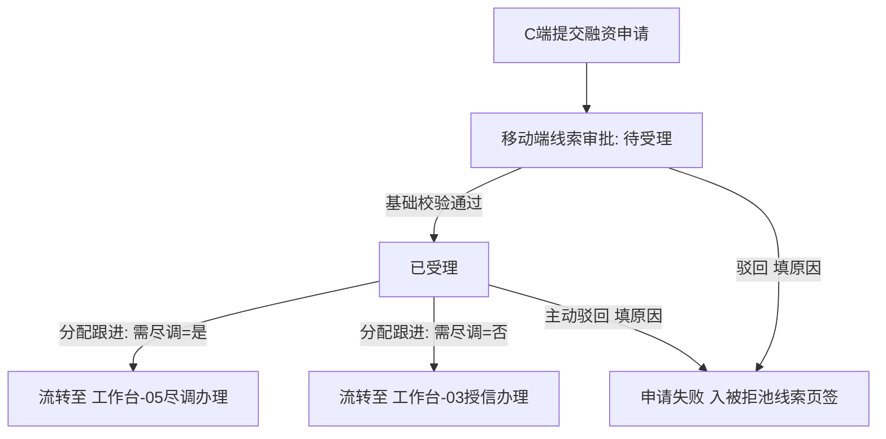

# 客户融资需求线索（移动端客户需求审批）

> **文档状态**：已梳理 — 对齐 6.1/6.2 标杆架构基准版
> **moduleId**：`biz-approve-customer-finance-leads`
> **菜单路径**：业务办理 → 客户需求审批 → 客户融资需求线索
> **原型路由**：`/m/module/biz-approve-customer-finance-leads`
> **PC 原路径**：项目监管-审批-客户融资需求
> **功能清单唯一定义来源**：`03-前端原型demo/B端H5/src/data/mobileMenuData.ts`
> **基准路径**：`B端H5/03-业务办理/03-客户需求审批/03-客户融资需求线索`
> **导航索引**：[00-菜单地图.md](../../../00-菜单地图.md) · [01-功能清单与原型路由.md](../../../01-功能清单与原型路由.md)
>
> **业务规则与字段唯一定义来源（PC 基准）**：
> - [01-融资管理-客户融资需求线索/客户融资需求线索主PRD](../../../../B端PC/03-融资监管/01-融资管理-客户融资需求线索/客户融资需求线索主PRD.md)
> - [01-融资管理-客户融资需求线索/客户融资需求线索业务规则规格](../../../../B端PC/03-融资监管/01-融资管理-客户融资需求线索/客户融资需求线索业务规则规格.md)
> - [01-融资管理-客户融资需求线索/客户融资需求线索字段清单](../../../../B端PC/03-融资监管/01-融资管理-客户融资需求线索/客户融资需求线索字段清单.md)

---

## 一、功能说明

客户融资需求线索是移动端「客户需求审批」板块的核心接入与审批节点。用于平台运营人员及风控主管在移动端实时查看外部 C 端提交的意向融资线索、查看申请人资质与底层质押货物/仓单明细、执行移动端基础校验受理（或录入驳回原因退回至被拒池）、并根据“需要尽调”快照进行移动端分流指派（指派尽调人员或分配资方机构）。

---

## 二、移动端主要页面与交互规范

### 1. 线索审批列表页 (`/m/module/biz-approve-customer-finance-leads`)
- **顶部搜索与筛选**：
  - 支持申请人名称、产品名称模糊搜索；
  - 状态快捷页签 / 筛选：`全部`、`待受理`、`已受理`、`申请失败`；
  - 支持按申请时间区间、需要尽调（是/否）进行组合筛选。
- **卡片式列表展现**：
  - 每条线索以卡片呈现：产品名称、申请人名称（企业名称/脱敏个人姓名）、申请人类型徽标；
  - 意向融资金额（大字高亮显示，元）、意向融资期数（期）、抵/质押物类型标签（存货/仓单）；
  - 是否需要尽调标签（`需尽调`-橙色 / `免尽调`-蓝色）；
  - 申请时间、最近处理人与处理时间；
  - 底部操作按钮区域（根据状态动态展示：`查看详情`、`校验受理`、`分配跟进`、`驳回`）。

### 2. 线索详情与审批弹窗
- **申请主体信息**：申请人类型、企业统一社会信用代码/个人身份证（脱敏）、联系人电话（脱敏）、营业执照/身份资质附件预览；
- **意向融资要素**：意向融资金额、融资期数、抵/质押物类型；
- **底层资产明细折叠面板**：
  - 存货明细（大类/品类/规格/数量/存放仓库）；
  - 关联仓单编号（支持点击跳转仓单详情）；
- **基础校验与受理操作**：
  - 点击【校验受理】：确认申请资料无误，状态更新为“已受理”，开放分配跟进；
  - 点击【驳回】：弹出驳回原因录入弹窗（必填原因分类及说明），提交后状态更新为“申请失败”，自动写入被拒退回池【线索被拒页签】。

### 3. 路由分配跟进操作（仅「已受理」状态）
- 点击【分配跟进】，系统根据线索中固化的“需要尽调”快照自动切换模式：
  - **需要尽调=是**：弹出尽调人员指派弹窗，选择同机构启用状态的尽调专员，提交后流转至【客户融资尽调办理】生成待尽调任务；
  - **需要尽调=否**：弹出资方机构分配弹窗，选择已建立合作关系的资方机构，提交后流转至【客户融资授信办理】直接生成授信已受理任务。

---

## 三、移动端动作与权限矩阵

| 操作动作 | 待受理 | 已受理 | 申请失败 | 适用角色 | 关键控制与规则 |
| :--- | :---: | :---: | :---: | :--- | :--- |
| **查看线索详情** | ✅ | ✅ | ✅ | 平台运营 / 风控主管 / 业务员 | 敏感信息按角色脱敏 |
| **基础校验受理** | ✅ | ❌ | ❌ | 平台运营专员 / 风控主管 | 校验资料无误后置为“已受理” |
| **分配跟进（路由分流）**| ❌ | ✅ | ❌ | 平台运营专员 / 风控主管 | 强校验需尽调快照（转尽调专员或转资方机构） |
| **主动驳回录入** | ✅ | ✅ | ❌ | 平台运营专员 / 风控主管 | 必须录入驳回原因，通过可靠投递入被拒池 |

---

## 四、业务流转链路

