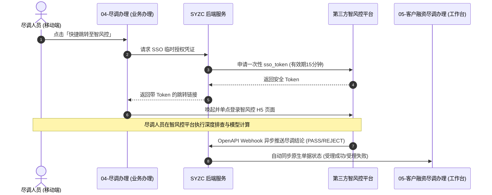

# 尽调办理（第三方智风控联登跳转入口）

> **文档状态**：已梳理 — 对齐 6.1/6.2 标杆架构基准版
> **moduleId**：`biz-approve-due-diligence-sso`
> **菜单路径**：业务办理 → 客户需求审批 → 尽调办理
> **原型路由**：`/m/module/biz-approve-due-diligence-sso`
> **PC 原路径**：联登智风控
> **原型标签**：`联登智风控`（外部 SSO 跳转）
> **功能清单唯一定义来源**：`03-前端原型demo/B端H5/src/data/mobileMenuData.ts`
> **基准路径**：`B端H5/03-业务办理/03-客户需求审批/04-尽调办理`
> **导航索引**：[00-菜单地图.md](../../../00-菜单地图.md) · [01-功能清单与原型路由.md](../../../01-功能清单与原型路由.md)
>
> **内部原生尽调单据对照**：
> - [工作台 → 融资/监管 → 05-客户融资尽调办理](../../../02-工作台/02-融资监管/05-客户融资尽调办理/README.md)（`ws-due-diligence-process`：系统原生双 Tab 办理、报告上传与资方分配）

---

## 一、模块定位与核心区别

| 模块对比维度 | 【业务办理】04-尽调办理 (`biz-approve-due-diligence-sso`) | 【工作台】05-客户融资尽调办理 (`ws-due-diligence-process`) |
| :--- | :--- | :--- |
| **所属板块** | 业务办理 → 客户需求审批 | 工作台 → 融资/监管 |
| **核心定位** | **第三方专业风控平台（智风控）单点登录（SSO）跳转入口** | **系统原生尽调任务台账与流转管理中心** |
| **页面形态** | 中转联登加载页 $\to$ 唤起/跳转第三方智风控 H5/WebApp | 系统原生双 Tab 列表（待尽调 / 尽调完成）与详情弹窗 |
| **主要操作** | • 快捷单点登录跳转智风控平台 • 查看联登授权与 Token 状态 • 手动触发智风控结论异步同步与刷新 | • 现场核验拍照上传、尽调报告录入 • 同机构同事任务转交 • 现场重大异常手动拒绝（入被拒池） • 尽调成功分配资方机构 |
| **数据源** | 第三方智风控系统独立维护，通过 OpenAPI 报文回调对接 | SYZC 供应链金融系统本地数据库与资产表 |

---

## 二、移动端联登跳转流程与交互规范

### 1. 联登中转引导页
- 尽调人员在移动端点击「业务办理 → 客户需求审批 → 尽调办理」：
  - 系统展示智风控平台联登服务卡片，呈现：当前登录账号、所属机构、第三方风控系统联通状态（`已连接` / `授权中`）；
  - 提供核心操作按钮：【🚀 快捷跳转至智风控】、【🔄 同步最新尽调结论】。

### 2. 安全 SSO 握手与跳转机制
1. **生成临时授权票据**：移动端发起跳转请求，SYZC 后端校验当前用户身份与机构权限，调用智风控 OpenAPI 换取一次性、时效为 15 分钟的加密 `sso_token`；
2. **安全跳转**：移动端通过 WebView 或系统外部浏览器唤起智风控平台移动端页面（URL 带签名票据）：
   $$\text{URL} = \text{https://risk.senyun-ai.com/h5/tasks?sso\_token=\{JWT\}...}$$
3. **免密进入**：尽调人员直接进入智风控平台对应的尽职调查任务列表，进行现场多维度大数据风控查验、司法排查与模型跑分；
4. **结果异步回调**：智风控完成评级后，通过 Webhook 异步回调将结论（`PASS` / `REJECT` / `REVIEW`）及报告 PDF 推送回 SYZC 系统，自动更新【工作台-05客户融资尽调办理】原生单据。

---

## 三、移动端动作与权限矩阵

| 操作动作 | 说明 | 适用角色 | 安全与风控控制 |
| :--- | :--- | :--- | :--- |
| **快捷跳转至智风控** | 生成安全签名并唤起第三方风控平台 | 拥有尽调权限的尽调专员、风控人员 | 必须通过后端动态签发 Token，禁止前端硬编码密钥 |
| **查看联登状态** | 查看当前用户在智风控的绑定授权状态 | 尽调人员 / 风控主管 | 账号未绑定时提示联系管理员开通 |
| **同步尽调结论** | 手动触发拉取智风控最新完成的报告数据 | 平台运营 / 风控专员 | 针对网络抖动未收到 Webhook 回调时的补偿机制 |

---

## 四、业务协同架构图

