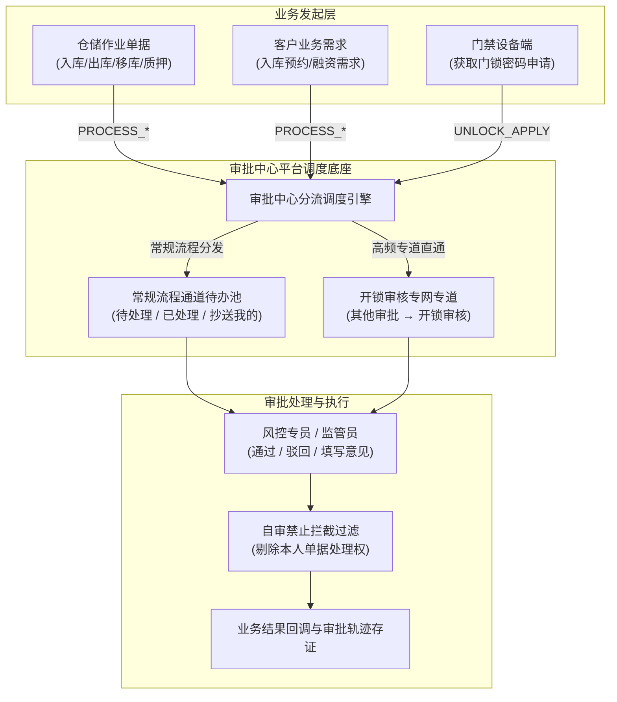

# 审批中心主PRD

> **模块定位**：全系统业务审批与风险核准的平台级调度中枢。基于无侧边栏（No Sidebar）单行三列卡片聚合首页架构，集成“业务管理审批、客户需求审批、其他审批”三大区块；提供通用待办分发、状态机流转、自审禁止、双通道架构分流（常规流程通道与开锁审核专网专道）以及全流程轨迹留痕。  
> **版本**：V2.0 基准版 | 更新时间：2026-09-16 | 责任人：森云科技（Senyun Technology）  
> **编写依据**：[审批中心字段清单.md](./审批中心字段清单.md) 是本模块所有业务字段、任务字段与交互控件的唯一定义真源；[02-审批中心业务规则规格.md](./02-审批中心业务规则规格.md) 是本模块状态机模型、双通道分流、自审禁止与并发控制的唯一定义来源。

---

## 1. 业务背景

SYZC 供应链金融存货监管系统涵盖仓储入库、出库、移库、动产质押、解押、现场开锁等多重高风险操作。审批中心作为风控核准与作业授权的核心调度平台：
- **消除效率孤岛**：将分散在仓储、交易、融资、物联等各模块的审批申请，统一汇总归集并按用户权属精准分发；
- **保障现场响应时效**：针对门禁开锁等毫秒级高频现场操作，设立专网专道，避免被传统冗长流引擎阻塞；
- **防范道德风险与合规漏洞**：强行推行自审禁止规则，确保资金方、监管方与借款企业之间的审批流程具备司法存证效力。

---

## 2. 功能范围

| 包含功能 (In Scope) | 不包含功能 (Out of Scope) |
| :--- | :--- |
| - 审批中心首页单行三列卡片聚合导航与各子类型待办角标汇总； - 子类型卡片选中联动与最多 5 条数据实时预览面板； - 【查看更多 >】深层跳转各子类型完整业务台账与过滤检索； - 审批任务通用动作处理：审批通过、审批驳回（必填原因）、申请人撤回； - 双通道分流调度：常规流程待办池与开锁审核专网专道； - 自审禁止强控制：申请人名下本人单据禁止自审； - 全路径审批历史轨迹、审批意见与时间戳审计存证。 | - 具体业务单据的数据录入与初始表单校验（由各业务模块发起）； - 底层流程引擎节点图形化设计器； - 审批通过后的物理硬件动作执行（如蓝牙下发、道闸抬杆）； - 跨租户跨机构审批单据合并审批。 |

---

## 3. 模块定位与系统链路

---

## 4. 业务场景

| 场景序号与编码 | 场景名称 | 场景类型 | 核心业务流程与约束说明 | 关联规则索引 |
| :--- | :--- | :--- | :--- | :--- |
| **场景 1 (APV-S01)** | 【审批中心首页聚合与子类型切换】 | 主流程 | 用户进入审批中心，页面呈现无侧边栏单行三列卡片导航；点击任一子类型，下方展示最多 5 条待办预览，点击右上角【查看更多 >】跳转完整列表。 | 【审批中心卡片聚合无侧边栏导航规则】(APV-TASK-F01) |
| **场景 2 (APV-S02)** | 【通用待办审批通过与状态流转】 | 主流程 | 审批人在待办详情中审查单据并点击【通过】，录入审批意见（选填）；任一人通过时关闭本节点其他并行待办，终审节点通过则回调业务主单生效。 | 【审批任务有效性与生命周期规则】(APV-TASK-F04) 【全路径审批轨迹与审计留痕规则】(APV-TASK-F08) |
| **场景 3 (APV-S03)** | 【通用审批驳回与必填拦截】 | 异常/阻断流程 | 审批人点击【驳回】，唤起模态弹窗；录入驳回原因（1~200 字，必填），保存后业务主单流转为已驳回，全链关闭在途任务并推送驳回通知。 | 【审批驳回原因强制必填规则】(APV-TASK-F06) |
| **场景 4 (APV-S04)** | 【申请人本人申请自审禁止拦截】 | 风控/阻断流程 | 审批人查看待办列表时，系统根据角色动态展开结果强制剔除本人单据的处理权限，行操作列仅保留【详情】，禁止呈现【去处理】或【去审批】。 | 【自审禁止与本人单据过滤规则】(APV-TASK-F03) |
| **场景 5 (APV-S05)** | 【开锁审批专网专道独立流转】 | 特殊通道主流程 | 门禁端发起的开锁申请直通「其他审批 → 开锁审核」，不接入通用待处理池；专道列表支持毫秒级响应并即时回调生成临时开锁密码。 | 【双通道分流与开锁专网专道规则】(APV-TASK-F02) |

---

## 5. 状态机与动作能力矩阵

> 状态流转详细规则、前置校验与阻断提示详见 [02-审批中心业务规则规格.md §二 审批任务状态与流转模型](./02-审批中心业务规则规格.md#二审批任务状态与流转模型)。

| 动作名称 | 待处理 (`PENDING`) | 已通过 (`APPROVED`) | 已驳回 (`REJECTED`) | 已关闭 (`CLOSED`) |
| :--- | :---: | :---: | :---: | :---: |
| **查看单据详情** | ✅ | ✅ | ✅ | ✅ |
| **执行审批通过** | ✅（非本人单据） | ❌ | ❌ | ❌ |
| **执行审批驳回** | ✅（非本人单据，必填原因） | ❌ | ❌ | ❌ |
| **申请人撤回单据** | ✅（仅本人且未进入终审） | ❌ | ❌ | ❌ |
| **导出审批轨迹** | ✅ | ✅ | ✅ | ✅ |

---

## 6. 页面功能与交互说明

### 6.1 审批中心首页布局规格（无 Sidebar）
1. **无左侧树形导航（No Sidebar）**：工作中心路由下完全隐藏侧边栏，页面以 100% 全宽通栏展示；
2. **顶部导航区（单行三列并排）**：
   - **业务管理审批**（包含待处理、已处理、抄送我的、我的申请管理、业务申请管理、监管委托受理）；
   - **客户需求审批**（包含客户入库预约、客户出库预约、客户融资需求、融资尽调、客户销售需求、客户采购需求）；
   - **其他审批**（包含政策资讯审核、贷中风控处理、开锁审核）；
   - 组内子类型在分组标题下方横向均分（Grid 排布），子项采用图标加文案，文案按每行 4 个汉字逻辑断行；右上角带未读待办红点徽章；
3. **下方预览区**：
   - 默认展示选中子类型下**最多 5 条**最新待办数据卡片；
   - 卡片呈现业务单号、申请人、所属仓库、申请时间及核心摘要；
   - 右上角提供【查看更多 >】按钮，点击跳转对应子类型完整数据台账。

---

## 7. 核心业务规则索引与追溯表

| 规则编码 | 规则业务名称 | 核心业务口径与约束 | 唯一定义来源 |
| :--- | :--- | :--- | :--- |
| **APV-TASK-F01** | 【审批中心卡片聚合无侧边栏导航规则】 | 页面全宽通栏；无侧边栏；单行三列；子项均分排布；最多 5 条预览 | [业务规则规格 APV-TASK-F01](./02-审批中心业务规则规格.md#审批中心卡片聚合无侧边栏导航规则apv-task-f01) |
| **APV-TASK-F02** | 【双通道分流与开锁专网专道规则】 | 常规业务入通用池；开锁审批专网专道挂载其他审批，不进常规待处理池 | [业务规则规格 APV-TASK-F02](./02-审批中心业务规则规格.md#双通道分流与开锁专网专道规则apv-task-f02) |
| **APV-TASK-F03** | 【自审禁止与本人单据过滤规则】 | 严禁本人审批自己发起的申请；展开审批人时剔除本人；本人单据仅限看详情 | [业务规则规格 APV-TASK-F03](./02-审批中心业务规则规格.md#自审禁止与本人单据过滤规则apv-task-f03) |
| **APV-TASK-F04** | 【审批任务有效性与生命周期规则】 | 仅 `PENDING` 任务允许操作；单据撤回或他人已通过后任务自动关闭 | [业务规则规格 APV-TASK-F04](./02-审批中心业务规则规格.md#审批任务有效性与生命周期规则apv-task-f04) |
| **APV-TASK-F05** | 【按顺序审批前序节点全部通过规则】 | 顺序审批模式下，前序所有节点均达成通过后方可激活当前节点待办 | [业务规则规格 APV-TASK-F05](./02-审批中心业务规则规格.md#按顺序审批前序节点全部通过规则apv-task-f05) |
| **APV-TASK-F06** | 【审批驳回原因强制必填规则】 | 驳回时强制录入驳回原因（1~200 字符），未填时提交按钮置灰禁用 | [业务规则规格 APV-TASK-F06](./02-审批中心业务规则规格.md#审批驳回原因强制必填规则apv-task-f06) |
| **APV-TASK-F07** | 【多审批人并发状态机原子更新规则】 | 采用状态条件更新乐观锁机制，防多人并发写入冲突产生状态裂痕 | [业务规则规格 APV-TASK-F07](./02-审批中心业务规则规格.md#多审批人并发状态机原子更新规则apv-task-f07) |
| **APV-TASK-F08** | 【全路径审批轨迹与审计留痕规则】 | 全节点操作留痕（操作人、时间戳、IP、前后状态快照与意见文本） | [业务规则规格 APV-TASK-F08](./02-审批中心业务规则规格.md#全路径审批轨迹与审计留痕规则apv-task-f08) |
| **APV-TASK-P01** | 【数据权限仓库隔离与角色准入规则】 | 严格基于租户与管辖仓库数据范围隔离；普通业务员仅见本人单据 | [业务规则规格 APV-TASK-P01](./02-审批中心业务规则规格.md#数据权限仓库隔离与角色准入规则apv-task-p01) |

---

## 8. 权限与风控约束

- **数据隔离**：基于 `tenant_id` 与仓库数据权限强隔离；
- **自审拦截**：系统底层动态鉴权拦截，即便通过脚本模拟调用接口，服务端检测到 `approver_id == applicant_id` 时立即抛出安全异常拦截。

---

## 9. 异常边界处理

- **任务状态已变更拦截**：两名审批人同时打开待办，一人点击驳回后另一人点击通过，后提交者浮窗提示「任务已关闭或已被他人处理」；
- **空理由驳回拦截**：录入全空格驳回原因，前端校验标红提示「驳回原因不能为空」；
- **超时自动结案**：定时任务扫描超过 `timeout_hours` 未处理任务，批量关闭并生成系统日志。

---

## 10. 验收用例与测试标准

| 验收用例编码 | 验收项业务名称 | 前置条件与测试步骤 | 预期结果与阻断交互 |
| :--- | :--- | :--- | :--- |
| **APV-V01** | 【无侧边栏与三列导航测试】 | 登录系统，点击顶栏导航进入「工作中心 → 审批中心」 | 侧边栏自动隐藏，单行三列卡片导航完整展现，子项均分排列 |
| **APV-V02** | 【子类型卡片预览联动测试】 | 在导航区依次点击「待处理」、「开锁审核」等子项 | 下方预览区实时切换展示对应子项的最新待办数据（最多 5 条） |
| **APV-V03** | 【自审禁止界面操作拦截测试】 | 审批人发起一笔申请，随后进入待办列表查看该单据 | 列表行操作列仅展示【详情】，不提供【去处理】或【去审批】入口 |
| **APV-V04** | 【自审禁止接口强校验拦截测试】 | 尝试直接向后端提交对本人申请的通过请求 | 服务端返回安全拦截错误码，浮窗提示「禁止审批本人发起的单据」 |
| **APV-V05** | 【驳回原因必填拦截测试】 | 打开待办处理模态弹窗，选择驳回并不填写原因尝试保存 | 提交按钮置灰禁用，输入框下方标红提示「请填写驳回原因」 |
| **APV-V06** | 【多人并发审批冲突测试】 | 两人同时打开同一待处理任务，分别提交通过与驳回 | 首个请求成功流转；后提交者浮窗提示「任务已关闭或已被他人处理」 |
| **APV-V07** | 【申请人撤回与待办关闭测试】 | 申请人在业务主单终审前点击【撤回】并在模态弹窗中确认 | 申请主单变为已撤回，审批人待办列表中该任务自动移除流转为已关闭 |
| **APV-V08** | 【开锁审核专网专道分流测试】 | 门禁端发起一笔开锁申请，核对审批待办归属池 | 申请直通「其他审批 → 开锁审核」，常规「待处理」池中完全无记录 |

---

## 修订记录

| 日期 | 版本 | 变更摘要 | 变更人 |
| :--- | :---: | :--- | :--- |
| 2026-08-31 | V1.4 | 初版审批中心平台层需求文档。 | 产品团队 |
| 2026-08-31 | V2.0 | 对齐三大区块 taxonomy 目录架构。 | 产品团队 |
| **2026-09-16** | **V2.0 规范化升级** | 1. 编号语义自解释：场景命名为 `场景 N【业务场景名称】(APV-S01~S05)`，用例命名为 `【用例业务名称】(APV-V01~V08)`； 2. 交互术语全面汉化：Toast/Modal/Sidebar 全面汉化为浮窗提示、模态弹窗、侧边栏； 3. 强化无侧边栏首页聚合卡片布局与双通道分流闭环。 | 森云科技规范化升级工作组 |
