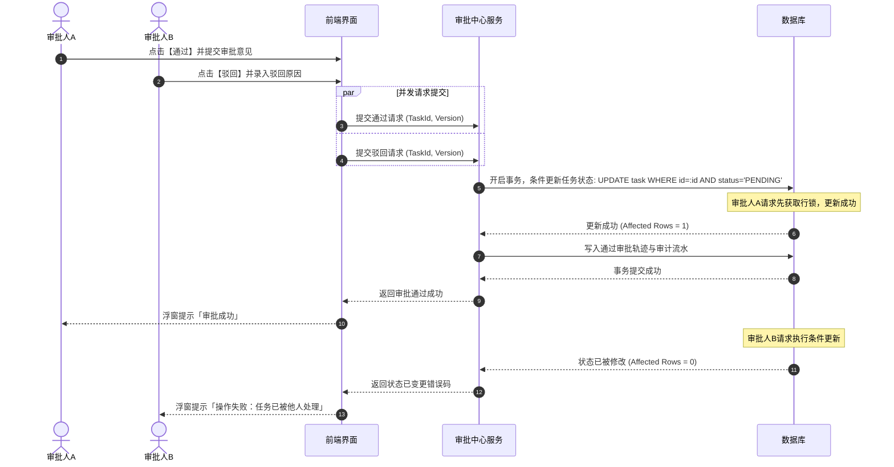

# 审批中心业务规则规格

> **文档定位**：全系统审批中心**平台层**状态机模型、任务分流机制、审批方式计算、自审禁止、数据隔离与并发审计控制的唯一定义真源（SSOT）。  
> **参考文档**：[01-审批中心主PRD.md](./01-审批中心主PRD.md)、[审批中心字段清单.md](./审批中心字段清单.md)、[审批中心总索引.md](./审批中心总索引.md)  
> **版本**：V2.0 基准版 | 更新时间：2026-09-16 | 责任人：森云科技（Senyun Technology）

---

## 一、能力与架构定位

| 项目 | 内容 |
| :--- | :--- |
| **模块层级** | 全系统审批平台底座层（面向业务审批、客户需求审批、其他审批提供统一调度） |
| **入口布局** | 顶栏进入「工作中心 → 审批中心」；**全宽卡片聚合页，无左侧树形导航栏（No Sidebar）** |
| **核心职责** | 统一承接各业务子类型的审批申请单据；依据配置快照动态装配审批任务流与待办池；执行通过、驳回、撤回通用动作；维护审批全流程轨迹存证 |
| **双通道分流** | ① **常规流程通道 (`PROCESS_*`)**：进入待处理、已处理、抄送我的待办任务池； ② **开锁专网专道 (`UNLOCK_APPLY`)**：挂载于「其他审批 → 开锁审核」，不进常规待处理池，专道保障高频实时响应 |

---

## 二、审批任务状态与流转模型

### 2.1 任务状态定义

| 状态名称 | 枚举值 (`task_status`) | 是否终态 | 业务含义说明 | 影响范围 |
| :--- | :--- | :---: | :--- | :--- |
| **待处理** | `PENDING` | 否 | 审批任务已生成并分发，等待当前指定审批人处理 | 展示在审批人待办列表；支持执行通过或驳回。 |
| **已通过** | `APPROVED` | **是** | 当前审批人/节点已审查确认同意 | 触发后续审批节点激活，若为终审节点则将业务申请主单置为已通过。 |
| **已驳回** | `REJECTED` | **是** | 当前审批人审查不同意，终止该审批流 | 业务申请主单直接流转为已驳回，并强制关闭所有关联待办。 |
| **已关闭** | `CLOSED` | **是** | 任务因申请人撤回、审批超时或同节点他人已通过而失效 | 界面不再允许操作，自动从待办列表中移出。 |

### 2.2 状态流转矩阵

| 当前状态 | 触发动作 | 前置校验条件 | 目标状态 | 二次确认与交互组件 | 后置级联影响 | 失败与阻断提示 |
| :--- | :--- | :--- | :--- | :--- | :--- | :--- |
| **未生成** | 业务申请提交 | 申请单提交成功，匹配生效审批配置 | `PENDING` | 业务提交模态弹窗 | ① 生成各节点审批任务；② 写入待办池并推送站内通知 | 浮窗提示（Toast）： 「生成审批任务失败」 |
| **待处理** | 审批通过 | ① 任务处于 `PENDING`； ② 审批人符合权限； ③ **非本人申请（自审禁止）** | `APPROVED` | 审批处理模态弹窗（输入审批意见） | ① 若为任一人通过，关闭本节点其他人的并行待办； ② 若为顺序审批且有下一节点，激活下一节点待办； ③ 若为最后节点，回调业务主单为已通过 | 浮窗提示（Toast）阻断： 「操作失败：任务状态已变更」 |
| **待处理** | 审批驳回 | ① 任务处于 `PENDING`； ② 驳回原因必填（$\le 200$ 字）； ③ 非本人申请 | `REJECTED` | 驳回确认模态弹窗（必填驳回原因） | ① 将关联业务申请主单直接标记为已驳回； ② 关闭该申请名下所有其他在途审批任务； ③ 触发驳回通知触达申请人 | 浮窗提示（Toast）阻断： 「请填写驳回原因」 |
| **待处理** | 申请人撤回 | 申请人本人操作且申请处于待审批中 | `CLOSED` | 撤回二次确认模态弹窗 | ① 申请主单流转为已撤回； ② 将该申请下所有待办任务置为已关闭 | 浮窗提示（Toast）阻断： 「该申请已在审批中或已结案，无法撤回」 |
| **待处理** | 审批超时 | 超过配置的 `timeout_hours` 时限 | `CLOSED` | 系统定时任务自动触发 | ① 申请单置为超时关闭； ② 任务置为已关闭； ③ 记录超时关闭审计流水 | 系统后台自动处理 |

---

## 三、核心业务规则

### 【审批中心卡片聚合无侧边栏导航规则】(APV-TASK-F01)
- 审批中心在系统架构中为顶级功能入口，页面布局**严禁呈现左侧 Sidebar 树形导航菜单**（全宽通栏展示）；
- 顶部导航区划分为三大区块并排单行展示：**业务管理审批**、**客户需求审批**、**其他审批**；
- 各区块子类型在分组标题下方横向均分（Grid 布局），采用 `图标 + 文案` 呈现，文案按每行 4 个汉字逻辑断行；角标实时呈现个人未读/待办红点数量；
- 选中任一子类型后，下方联动展示最多 5 条数据卡片预览，超出 5 条提供【查看更多 >】入口跳转完整台账。

### 【双通道分流与开锁专网专道规则】(APV-TASK-F02)
- 平台对审批业务实行双通道架构分流：
  1. **常规流程通道 (`PROCESS_*`)**：包含仓储入库、出库、移库、盘点、质押申请等接入流程引擎的业务，统一汇总分发至「待处理」、「已处理」、「抄送我的」通用池；
  2. **开锁专网专道 (`UNLOCK_APPLY`)**：针对智能门锁与人脸门禁的高频开锁申请，**严禁接入常规待处理池**，必须直接分流至「其他审批 → 开锁审核」专网专道，保障毫秒级现场快速响应。

### 【自审禁止与本人单据过滤规则】(APV-TASK-F03)
- **绝对自审禁止**：审批人严禁审批自己发起的任何审批单据；
- 当审批节点配置为“指定角色”且该角色包含申请人本人时，系统在运行时动态展开审批人员池时，**强制剔除申请人本人**，申请人不得作为合规处理人；
- 在待办列表中若包含本人单据，列表行操作列仅保留【详情】入口，**严禁提供【去处理】或【去审批】操作按钮**。

### 【审批任务有效性与生命周期规则】(APV-TASK-F04)
- 执行审批动作前，服务端强校验任务当前状态是否为 `PENDING`，且业务主单未进入终态；
- 若申请单已被其他审批人处理完成或被申请人提前撤回，后提交者的请求被直接拒绝并以浮窗提示（Toast）告知：「任务已关闭或已被他人处理」。

### 【按顺序审批前序节点全部通过规则】(APV-TASK-F05)
- 若审批流程配置为“按顺序审批”，当前层级审批任务必须在所有前序节点全部达成 `APPROVED` 状态后方可激活为待处理状态；
- 未激活的前序后续节点在界面上标记为“待激活”，禁止提前审批。

### 【审批驳回原因强制必填规则】(APV-TASK-F06)
- 任何角色执行【驳回】操作时，必须在模态弹窗中录入驳回原因（1~200 字符，去除首尾空格）；
- 驳回原因未填或仅包含空格时，前端提交按钮置灰禁用，服务端强校验拦截；驳回原因持久化保存在审批轨迹中供申请人查看。

### 【多审批人并发状态机原子更新规则】(APV-TASK-F07)
- 审批动作必须采用基于申请主单状态与任务状态的数据库条件更新（CAS 乐观锁机制）；
- 当两名审批人几乎同时对同一任务提交“通过”与“驳回”相反动作时，本地事务严格保障仅首个请求成功，后提交者请求回滚并提示并发冲突。

### 【全路径审批轨迹与审计留痕规则】(APV-TASK-F08)
- 审批流的每一个动作（发起、激活、通过、驳回、撤回、转派、关闭、超时）必须在统一审批轨迹表中生成不可变流水；
- 审计字段包含：操作人账号、真实姓名、操作时间戳（毫秒级）、客户端网络地址（IP）、请求标识、处理前状态、处理后状态及审批意见文本。

---

## 四、权限与数据安全规范

### 【数据权限仓库隔离与角色准入规则】(APV-TASK-P01)

| 角色代码 | 角色名称 | 待处理/已办处理 | 审批通过/驳回操作 | 我的申请撤回 | 跨仓库审批数据可见性 |
| :--- | :--- | :---: | :---: | :---: | :--- |
| `R-SYS-ADMIN` | 系统管理员 | ✅ | ✅（非本人发起） | ✅（本人单据） | 当前租户全量数据 |
| `R-RISK-MGR` | 风控管理人员 | ✅ | ✅（非本人发起） | ✅（本人单据） | 管辖机构及下辖仓库业务 |
| `R-WH-SUPER` | 仓库监管员 | ✅ | ✅（非本人发起） | ✅（本人单据） | 个人授权分配管辖仓库 |
| `R-BUSI-OPER` | 普通业务人员 | ❌ | ❌ | ✅（本人单据） | 仅限本人发起的申请记录 |

- **SQL 自动注入过滤**：普通审批人查询待办任务时，系统底层强制注入 `tenant_id = :tenantId AND warehouse_id IN (:assignedWarehouses) AND approver_id = :userId` 条件，严禁越权越库处理。

---

## 五、核心业务时序图

### 1. 通用审批动作（通过/驳回）并发控制时序

---

## 六、修订记录

| 日期 | 版本 | 变更摘要 | 变更人 |
| :--- | :---: | :--- | :--- |
| 2026-08-28 | V1.0 | 初版审批中心平台层业务规则规格。 | 产品团队 |
| 2026-08-31 | V1.4 | 明确开锁审批专网专道，对齐三区架构 taxonomy。 | 产品团队 |
| **2026-09-16** | **V2.0 规范化升级** | 1. 编号语义自解释：全量升级为 `【规则业务名称】(APV-TASK-F01~08/P01)` 格式； 2. 交互术语全面汉化：Toast/Modal/Sidebar 全面汉化为浮窗提示、模态弹窗、侧边栏； 3. 强化无侧边栏首页聚合卡片布局与双通道分流闭环。 | 森云科技规范化升级工作组 |
