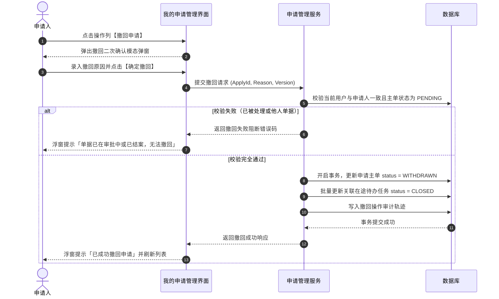

# 我的申请管理业务规则规格

> **文档定位**：我的申请管理（01-工作中心/01-审批中心/03-业务审批/04-我的申请管理）申请人工作台状态机模型、三标签页分流架构、单据撤回机制、开锁临时凭证查验及数据权限隔离的唯一定义真源（SSOT）。配套文档：[我的申请管理主PRD.md](./我的申请管理主PRD.md)、[我的申请管理字段清单.md](./我的申请管理字段清单.md)。ASCII/Demo 为衍生，只引用本文件规则编号，不重复定义规则本体。  
> **模块类型**：申请人工作台（双端对齐：PC 完整页 + H5 我的申请记录）。  
> **版本**：V2.0 基准版 | 更新时间：2026-09-16 | 责任人：森云科技（Senyun Technology）

---

## 一、能力与架构定位

| 项目 | 内容 |
| :--- | :--- |
| **模块层级** | 申请人交互层（统一汇聚个人发起的全品类审批申请） |
| **菜单/入口** | PC：工作中心 → 审批中心 → 业务管理审批 → **我的申请管理**； H5：业务办理 → 内部审批 → **我的申请记录** |
| **核心职责** | 提供三标签页结构，汇集本人发起的流程申请、政策资讯申请与开锁申请；提供全流程审批节点流跟踪；允许在终审前撤回申请；在审批通过后查验开锁临时凭证与密码 |
| **三标签页架构** | ① **我的流程申请 (`process`)**：汇集仓储作业、动产质押等常规流程审批； ② **我的政策资讯申请 (`policy`)**：汇集企业端发布的政策资讯审批单； ③ **我的开锁申请 (`unlock-applies`)**：汇集现场门锁与门禁开锁申请（含免审记录与已核准凭证） |

---

## 二、申请单状态与撤回流转模型

### 2.1 申请单主状态定义

| 状态名称 | 枚举值 (`apply_status`) | 是否终态 | 业务含义说明 | 申请人操作权限 |
| :--- | :--- | :---: | :--- | :--- |
| **待审批** | `PENDING` | 否 | 申请已提交，等待各级审批人审查核准 | 支持【查看详情】、【撤回申请】。 |
| **已通过** | `APPROVED` | **是** | 流程终审通过；若为开锁申请则自动生成临时开锁密码凭证 | 支持【查看详情】、【查看开锁密码】。 |
| **已驳回** | `REJECTED` | **是** | 审批人在某一节点审查不通过，全单终止 | 支持【查看详情】、【查看驳回原因】。 |
| **已撤回** | `WITHDRAWN` | **是** | 申请人在终审前主动取消申请 | 支持【查看详情】（置灰标记）。 |
| **已关闭** | `CLOSED` | **是** | 超过审批时限未处理，系统自动超时结案 | 支持【查看详情】。 |

### 2.2 状态流转矩阵

| 当前状态 | 触发动作 | 前置校验条件 | 目标状态 | 二次确认与交互组件 | 后置级联影响 | 失败与阻断提示 |
| :--- | :--- | :--- | :--- | :--- | :--- | :--- |
| **未提交** | 发起申请 | 各业务表单校验通过，提交保存 | `PENDING` | 业务提交模态弹窗 | 写入申请主表；分发审批待办任务；写入审计日志 | 浮窗提示（Toast）： 「提交申请失败」 |
| **待审批** | 申请人撤回 | ① 当前登录人与申请人一致； ② 申请单处于 `PENDING`； ③ 未产生终审结论 | `WITHDRAWN` | 撤回二次确认模态弹窗（输入撤回原因，选填） | ① 申请主单流转为已撤回； ② 级联关闭关联的所有在途审批待办任务； ③ 记录撤回审计轨迹 | 浮窗提示（Toast）阻断： 「单据已在审批中或已结案，无法撤回」 |
| **待审批** | 审批通过 | 终审审批人执行通过 | `APPROVED` | 审批人侧触发 | ① 主单流转为已通过； ② 若为开锁申请，触发密码机生成凭证； ③ 申请人端点亮【查看密码】入口 | 系统通知推送 |
| **待审批** | 审批驳回 | 任一审批人执行驳回 | `REJECTED` | 审批人侧触发 | ① 主单流转为已驳回； ② 申请人详情中展示驳回原因高亮卡片； ③ 永久关闭申请流 | 系统通知推送 |
| **待审批** | 超时结案 | 超过配置的 `timeout_hours` 时限 | `CLOSED` | 定时任务触发 | 主单流转为已关闭，记录超时时间戳 | 状态置灰 |

---

## 三、核心业务规则

### 【三标签页分流与跨端统一规则】(MYAPP-F01)
- 我的申请管理页面固定划分为三个独立标签页（Tab）：
  - `我的流程申请`（URL 参数：`tab=process`）；
  - `我的政策资讯申请`（URL 参数：`tab=policy`）；
  - `我的开锁申请`（URL 参数：`tab=unlock-applies`，兼容参数 `unlock`）；
- PC 端与移动端 H5 在相同 URL 参数下保持业务视图强对齐（H5 对应标签名为“开锁审核”，展示口径与权限完全一致）。

### 【申请人单据仅限本人可见规则】(MYAPP-F02)
- 我的申请管理中各标签页所展示的申请单据列表，底层必须严格强制过滤：`applicant_id = :currentUserId`；
- 严禁向普通业务人员展示非本人发起的任何申请流水，彻底阻断水平越权查看风险。

### 【在途申请主动撤回与待办级联关闭规则】(MYAPP-F03)
- 仅当申请单处于 `PENDING`（待审批）状态时，申请人方可在列表操作列或详情页中执行【撤回申请】；
- 执行撤回时唤起模态确认弹窗，确认后系统在数据库本地事务内原子将申请单置为 `WITHDRAWN`，并在同一事务内将所有已分发的在途审批任务状态置为 `CLOSED`（已关闭）；
- 撤回成功后，审批人待办列表中该单据实时移除，禁止审批人继续操作。

### 【开锁临时密码查验与安全展示规则】(MYAPP-F04)
- 针对开锁申请单，当且仅当申请状态为 `APPROVED`（已通过）或免审直发记录时，申请人详情页展示【开锁密码】信息卡片；
- **密码安全交互**：
  - 临时密码默认采用圆点掩码（如 `••••••`）遮蔽，右侧提供【显示密码】眼睛切换图标与【复制密码】快捷按钮；
  - 卡片中同时标明临时密码的有效截止时间（如“有效期至：2026-09-16 18:00:00”），逾期后密码自动失效并标记为“已过期”；
  - 密码被现场门禁核销后，状态实时回写为“已核销”。

### 【免审开锁记录审计与归集规则】(MYAPP-F05)
- 当用户在门禁设备处点击获取密码，且未命中任何有效审批配置时，系统生成 `approval_required = false` 的免审直发记录；
- 免审开锁记录同步归集写入「我的开锁申请」标签页中，列表中通过“是否需要审核：否”清晰标识，全生命周期留痕备查。

### 【深层链接跳转与单号精准定位规则】(MYAPP-F06)
- 外部模块（如审批中心首页预览区、站内信通知、门禁设备页面）可通过带有参数的深层链接（Deep Link）直接跳转至本页面：
  - 格式：`/工作中心/审批中心/我的申请管理?tab=unlock-applies&applyNo={单号}`；
  - 页面加载时自动切换至对应标签页，并在列表中高亮定位对应的申请单据，自动唤起详情抽屉。

### 【全流程审批节点轨迹与时间轴展示规则】(MYAPP-F07)
- 申请详情页右侧以垂直时间轴（Timeline）形式完整呈现审批流全节点：
  - 展示内容：节点名称、处理人姓名、处理动作（待处理/已通过/已驳回/已撤回）、处理时间戳（精确至秒）、审批意见文本；
  - 若为驳回单据，在详情顶部以红色警示横幅高亮呈现驳回原因。

---

## 四、权限与安全规范

### 【申请人操作与数据权限规则】(MYAPP-P01)

| 角色代码 | 角色名称 | 查看本人申请列表/详情 | 撤回本人申请 | 查看开锁临时密码 | 查看他人申请 |
| :--- | :--- | :---: | :---: | :---: | :---: |
| `R-BUSI-OPER` | 普通业务人员 | ✅ | ✅（限待审批） | ✅（限已通过） | ❌（严格禁止） |
| `R-WH-SUPER` | 仓库监管员 | ✅ | ✅（限待审批） | ✅（限已通过） | ❌（工作台仅见本人申请） |
| `R-RISK-MGR` | 风控管理人员 | ✅ | ✅（限待审批） | ✅（限已通过） | ❌（工作台仅见本人申请） |
| `R-SYS-ADMIN` | 系统管理员 | ✅ | ✅（限待审批） | ✅（限已通过） | ❌（工作台仅见本人申请） |

- **防篡改与审计**：申请人发起的单据在提交后不可更改任何业务字段，撤回操作记录客户端网络地址（IP）与时间戳。

---

## 五、核心操作时序图

### 1. 申请人主动撤回申请时序

---

## 六、修订记录

| 日期 | 版本 | 变更摘要 | 变更人 |
| :--- | :---: | :--- | :--- |
| 2026-08-31 | V1.0 | 初版我的申请管理基准设计。 | 产品团队 |
| 2026-09-01 | V1.2 | 规范三标签页壳层与开锁申请凭证流。 | 产品团队 |
| **2026-09-16** | **V2.0 规范化升级** | 1. 核心三件套真源确立：本规则规格作为基准版唯一真源； 2. 编号语义自解释：全量升级为 `【规则业务名称】(MYAPP-F01~07/P01)` 格式； 3. 交互术语全面汉化：Toast/Modal/Tab 全面汉化为浮窗提示、模态弹窗、标签页； 4. 强化撤回事务闭环与开锁密码安全遮蔽。 | 森云科技规范化升级工作组 |
