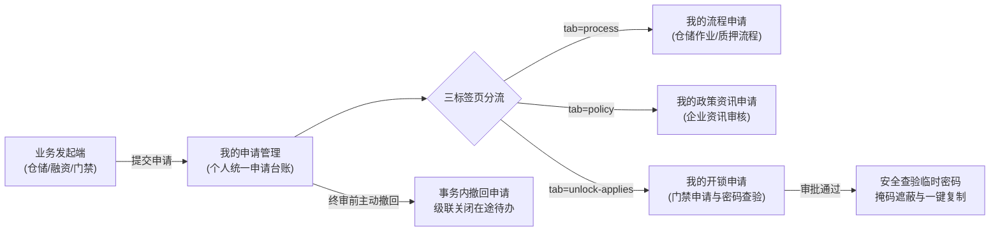

# 我的申请管理主PRD

> **模块定位**：工作中心业务管理审批板块中申请人个人工作台核心入口。通过统一的三标签页架构（我的流程申请、我的政策资讯申请、我的开锁申请），实现申请人对自己发起的全品类审批业务进行全生命周期跟踪、在途单据主动撤回、开锁临时密码安全查验与多端状态同步。  
> **版本**：V2.0 基准版 | 更新时间：2026-09-16 | 责任人：森云科技（Senyun Technology）  
> **编写依据**：[我的申请管理字段清单.md](./我的申请管理字段清单.md) 是本模块所有业务字段、任务字段与交互控件的唯一定义真源；[我的申请管理业务规则规格.md](./我的申请管理业务规则规格.md) 是本模块三标签页分流模型、撤回原子事务、密码安全展示与深层链接跳转的唯一定义来源。

---

## 1. 业务背景

在存货质押监管业务中，仓储作业人员、业务经办人经常需要提交各类申请（如货物入库审批、动产解押审批、现场门禁开锁申请）。如果申请人无法清晰获知当前单据的审核状态，会导致：
- **审批进度不透明**：经办人反复通过电话催促风控人员，沟通成本极高；
- **误提单据无法修正**：经办人填错仓位或货品信息后无法及时撤销，导致错误数据进入审批链条；
- **凭证传递链条脱节**：门禁开锁核准后，现场人员无法即时、安全地查验有效开锁密码，影响现场作业。

本模块通过建立个人维度的统一申请台账，提供清晰透明的时间轴节点追踪、一键撤回机制及安全受控的凭证查验能力。

---

## 2. 功能范围

| 包含功能 (In Scope) | 不包含功能 (Out of Scope) |
| :--- | :--- |
| - 三标签页（我的流程申请、我的政策资讯申请、我的开锁申请）多维切换； - 申请单号、业务类型、申请时间及审批状态组合筛选； - 个人在途单据主动【撤回申请】及关联在途任务自动级联关闭； - 申请详情只读查验（业务内容、现场附件及审批节点垂直时间轴）； - 开锁临时密码安全查验（掩码遮蔽、一键复制、有效倒计时及核销状态）； - 免审开锁直发记录完整归集与查验； - 外部通知深层链接（Deep Link）精准跳转与高亮定位。 | - 业务单据初始数据的创建填报（由各业务模块前置发起）； - 审批人的通过与驳回处理（由审批中心与开锁审核工作台承载）； - 查验非本人发起的任何他人申请单据； - 超过有效期的开锁密码延期与重置。 |

---

## 3. 模块定位与系统链路

---

## 4. 业务场景

| 场景序号与编码 | 场景名称 | 场景类型 | 核心业务流程与约束说明 | 关联规则索引 |
| :--- | :--- | :--- | :--- | :--- |
| **场景 1 (MYAPP-S01)** | 【三标签页切换与个人单据查询】 | 主流程 | 申请人进入页面，系统底层强制注入本人账号过滤；支持切换三个标签页查看个人发起的流程单据，按提交时间倒序排列。 | 【三标签页分流与跨端统一规则】(MYAPP-F01) 【申请人单据仅限本人可见规则】(MYAPP-F02) |
| **场景 2 (MYAPP-S02)** | 【在途申请主动撤回与任务关闭】 | 主流程/逆向流程 | 申请人发现填报错误，在单据终审前点击【撤回申请】并在模态弹窗中确认；主单变更为已撤回，关联的在途审批待办全量自动关闭。 | 【在途申请主动撤回与待办级联关闭规则】(MYAPP-F03) |
| **场景 3 (MYAPP-S03)** | 【开锁审批通过与密码安全查验】 | 主流程 | 门禁开锁申请经风控核准后，申请人打开详情页；卡片中呈现已遮蔽的临时密码，点击眼睛图标展示明文并支持一键复制，提示有效截止时间。 | 【开锁临时密码查验与安全展示规则】(MYAPP-F04) |
| **场景 4 (MYAPP-S04)** | 【免审开锁流水归集与留痕查验】 | 主流程 | 现场未命中审批配置免审直发的开锁记录，自动归集至「我的开锁申请」列表中，标识为“免审”，全生命周期只读留痕。 | 【免审开锁记录审计与归集规则】(MYAPP-F05) |
| **场景 5 (MYAPP-S05)** | 【深层链接定位与审批进度查看】 | 交互与追踪 | 用户点击站内信或审批首页预览区的跳转链接，自动定位至指定标签页并高亮呼出详情抽屉，右侧呈现垂直时间轴审批轨迹。 | 【深层链接跳转与单号精准定位规则】(MYAPP-F06) 【全流程审批节点轨迹与时间轴展示规则】(MYAPP-F07) |

---

## 5. 状态机与动作能力矩阵

> 状态流转详细规则、前置校验与阻断提示详见 [我的申请管理业务规则规格.md §二 申请单状态与撤回流转模型](./我的申请管理业务规则规格.md#二申请单状态与撤回流转模型)。

| 动作名称 | 待审批 (`PENDING`) | 已通过 (`APPROVED`) | 已驳回 (`REJECTED`) | 已撤回 (`WITHDRAWN`) | 已关闭 (`CLOSED`) |
| :--- | :---: | :---: | :---: | :---: | :---: |
| **查看申请详情** | ✅ | ✅ | ✅ | ✅ | ✅ |
| **撤回本人申请** | ✅ | ❌ | ❌ | ❌ | ❌ |
| **查看开锁密码** | ❌ | ✅（仅限开锁） | ❌ | ❌ | ❌ |
| **查看驳回原因** | ❌ | ❌ | ✅（高亮横幅） | ❌ | ❌ |
| **查看审批轨迹** | ✅ | ✅ | ✅ | ✅ | ✅ |

---

## 6. 页面功能与交互说明

### 6.1 页面布局与骨架
1. **顶部面包屑与标题**：`工作中心 / 审批中心 / 业务管理审批 / 我的申请管理`；
2. **标签页导航（Tab）**：
   - `我的流程申请`（展示仓储作业与质押流程）；
   - `我的政策资讯申请`（展示资讯审核单）；
   - `我的开锁申请`（展示门禁开锁申请、免审记录与开锁密码）；
3. **筛选查询区**：
   - 申请单号：单行文本输入框，精确匹配；
   - 申请时间：日期区间选择器；
   - 审批状态：下拉单选框，选项：全部 / 待审批 / 已通过 / 已驳回 / 已撤回 / 已关闭；
   - 是否需要审核（仅开锁标签页）：下拉单选框，选项：全部 / 是 / 否；
   - 操作按钮：【查询】与【重置】；
4. **数据表格展示区**：
   - 包含序号、申请单号、业务类型/设备名称、申请事由、申请时间、当前处理节点、状态徽章、操作列；
5. **详情展示抽屉与凭证交互**：
   - 详情左侧展示申请基本信息与现场附件；
   - 详情右侧展示审批流垂直时间轴（节点、处理人、处理时间、意见）；
   - 顶部若为驳回状态，高亮展示红色警告横幅与驳回原因；
   - 开锁已通过单据展示独立密码卡片（圆点遮蔽、眼睛切换明文、一键复制、倒计时标签）。

---

## 7. 核心业务规则索引与追溯表

| 规则编码 | 规则业务名称 | 核心业务口径与约束 | 唯一定义来源 |
| :--- | :--- | :--- | :--- |
| **MYAPP-F01** | 【三标签页分流与跨端统一规则】 | 固定三大标签页；URL参数对齐；PC与H5展示口径一致 | [业务规则规格 MYAPP-F01](./我的申请管理业务规则规格.md#三标签页分流与跨端统一规则myapp-f01) |
| **MYAPP-F02** | 【申请人单据仅限本人可见规则】 | 强制过滤当前登录用户ID，严禁查看他人申请流水 | [业务规则规格 MYAPP-F02](./我的申请管理业务规则规格.md#申请人单据仅限本人可见规则myapp-f02) |
| **MYAPP-F03** | 【在途申请主动撤回与待办级联关闭规则】 | 仅 `PENDING` 单据允许撤回；同事务关闭所有在途待办任务 | [业务规则规格 MYAPP-F03](./我的申请管理业务规则规格.md#在途申请主动撤回与待办级联关闭规则myapp-f03) |
| **MYAPP-F04** | 【开锁临时密码查验与安全展示规则】 | 仅 `APPROVED` 呈现密码；掩码遮蔽；复制功能；时效倒计时 | [业务规则规格 MYAPP-F04](./我的申请管理业务规则规格.md#开锁临时密码查验与安全展示规则myapp-f04) |
| **MYAPP-F05** | 【免审开锁记录审计与归集规则】 | 免审直发记录自动落账归集，标注审核否，全生命周期存证 | [业务规则规格 MYAPP-F05](./我的申请管理业务规则规格.md#免审开锁记录审计与归集规则myapp-f05) |
| **MYAPP-F06** | 【深层链接跳转与单号精准定位规则】 | 支持带参 URL 直达标签页并高亮呼出详情抽屉 | [业务规则规格 MYAPP-F06](./我的申请管理业务规则规格.md#深层链接跳转与单号精准定位规则myapp-f06) |
| **MYAPP-F07** | 【全流程审批节点轨迹与时间轴展示规则】 | 垂直时间轴全量呈现节点审批人、处理时间与审批意见文本 | [业务规则规格 MYAPP-F07](./我的申请管理业务规则规格.md#全流程审批节点轨迹与时间轴展示规则myapp-f07) |
| **MYAPP-P01** | 【申请人操作与数据权限规则】 | 申请人仅具备本人单据查看、撤回及查验密码权限 | [业务规则规格 MYAPP-P01](./我的申请管理业务规则规格.md#申请人操作与数据权限规则myapp-p01) |

---

## 8. 权限与风控约束

- **行级数据隔离**：服务端强校验 `applicant_id == currentUserId`，任何非本人单据请求直接拦截并记录越权日志；
- **防重复撤回**：撤回接口受乐观锁版本号保护，防止网络重发导致重复流转。

---

## 9. 异常边界处理

- **撤回时单据已被审批**：申请人点击撤回时若审批人已在后台通过，系统拦截并浮窗提示「单据已在审批中或已结案，无法撤回」；
- **密码已过期**：开锁密码超过有效截止时间，前端标记为“已过期”，禁用复制按钮；
- **无权限查看他人单据**：手动修改 URL 申请单号尝试跨越权查验，系统阻断并提示「单据不存在或无权访问」。

---

## 10. 验收用例与测试标准

| 验收用例编码 | 验收项业务名称 | 前置条件与测试步骤 | 预期结果与阻断交互 |
| :--- | :--- | :--- | :--- |
| **MYAPP-V01** | 【个人单据隔离查询测试】 | 登录普通业务员账号，进入我的申请管理各标签页 | 列表中仅展示当前用户发起的申请单据，绝对无他人记录 |
| **MYAPP-V02** | 【三标签页切换联动测试】 | 依次点击切换三个标签页 | 页面平滑切换对应台账，URL 同步更新 `tab` 参数且不刷新全页 |
| **MYAPP-V03** | 【在途申请撤回成功测试】 | 对处于待审批状态的申请单，点击行操作【撤回申请】并确认 | 申请单流转为已撤回，审批人待办池中该任务实时消失移出 |
| **MYAPP-V04** | 【已结案单据撤回阻断测试】 | 尝试对已通过或已驳回的单据发起撤回 | 操作列无撤回入口；接口直接调用返回错误阻断「无法撤回」 |
| **MYAPP-V05** | 【开锁密码掩码切换与复制测试】 | 打开一笔已通过的开锁申请详情查看密码卡片 | 密码默认以圆点掩码遮蔽，点击眼睛图标展示明文，点击复制提示成功 |
| **MYAPP-V06** | 【驳回原因高亮展示测试】 | 打开一笔已驳回的申请单详情 | 顶部以红色警示横幅高亮展示驳回原因与审批人姓名 |
| **MYAPP-V07** | 【免审开锁记录查验测试】 | 门禁端免审直发开锁后，进入「我的开锁申请」标签页 | 列表中成功呈现免审流水，标识“是否需要审核：否”，支持查密码 |
| **MYAPP-V08** | 【深层链接带参直达测试】 | 访问带有 `?tab=unlock-applies&applyNo=UL-001` 的链接 | 自动激活开锁标签页，列表中高亮选中 UL-001 并唤起详情抽屉 |

---

## 修订记录

| 日期 | 版本 | 变更摘要 | 变更人 |
| :--- | :---: | :--- | :--- |
| 2026-08-31 | V1.0 | 初版我的申请管理主 PRD | 产品团队 |
| 2026-09-01 | V1.2 | 规范三标签页壳层与开锁凭证查验流 | 产品团队 |
| **2026-09-16** | **V2.0 规范化升级** | 1. 编号语义自解释：场景命名为 `场景 N【业务场景名称】(MYAPP-S01~S05)`，用例命名为 `【用例业务名称】(MYAPP-V01~V08)`； 2. 交互术语全面汉化：Toast/Modal/Tab 全面汉化为浮窗提示、模态弹窗、标签页； 3. 强化密码安全查验与在途撤回闭环。 | 森云科技规范化升级工作组 |
