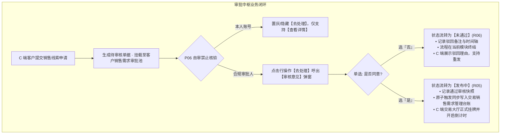
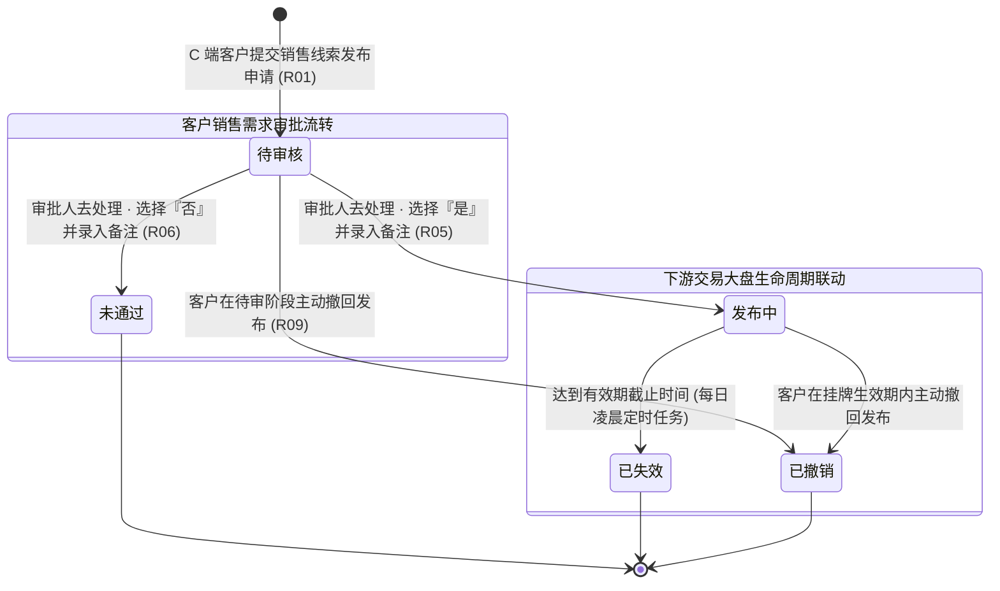
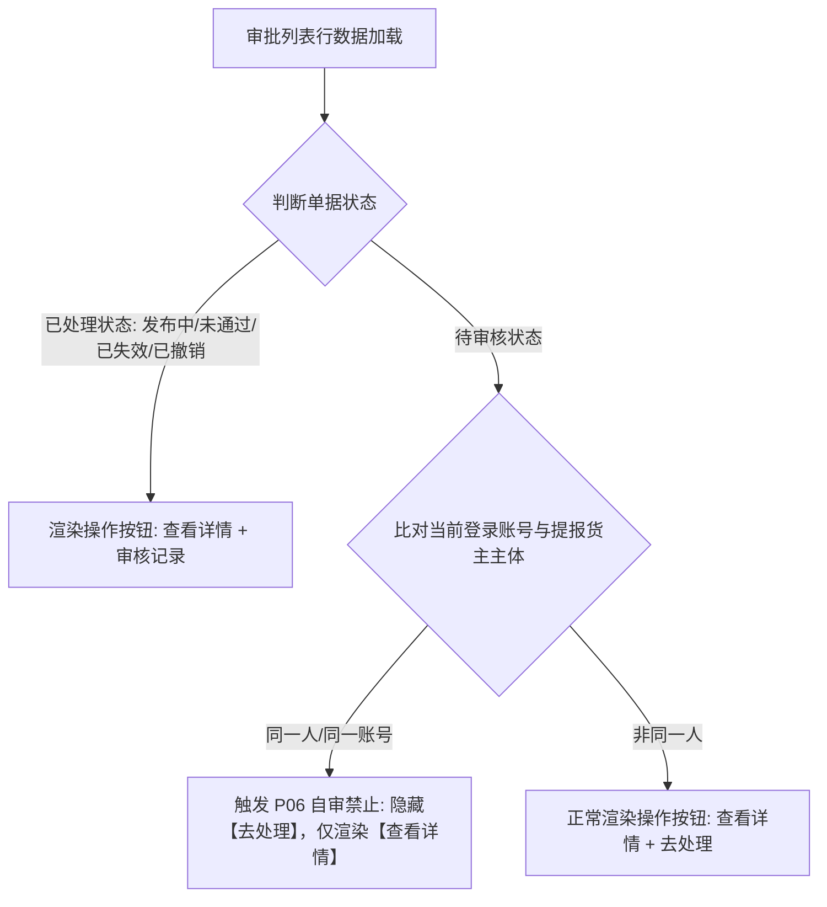
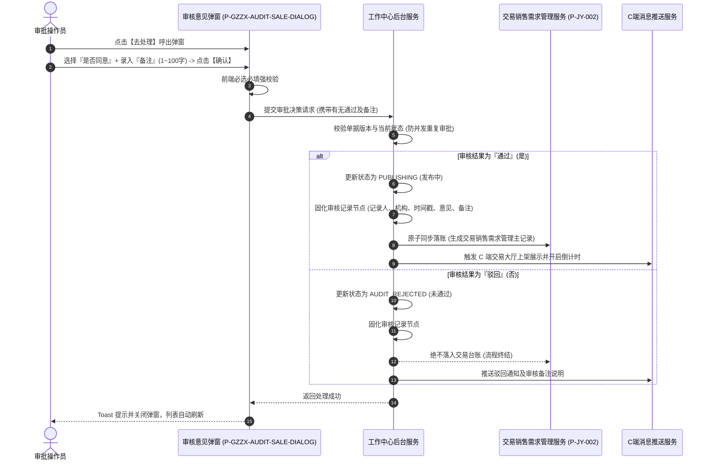
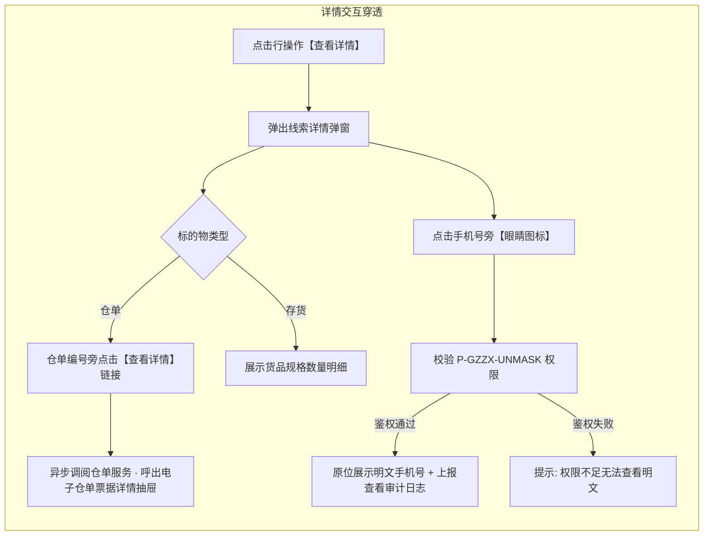

# 客户销售需求业务规则规格

> **文档定位**：工作中心 / 审批中心 / 客户需求审批 / 客户销售需求模块状态机生命周期、审批裁决权限矩阵、前置校验拦截、跨端协同驱动机制及司法审计规范的**唯一定义真源**。主 PRD、字段清单及端侧原型仅引用本文件规则名称与编号（如 `【规则业务名称】(Rxx)`、`【异常业务名称】(Cxx)`、`【权限业务名称】(Pxx)`），不重复定义规则本体。  
> **模块类型**：审批中心业务流转类（承接 C 端提报待审流水、平台专业风控与合规审查、驱动交易台账生成与驳回通知闭环）。  
> **参考文档**：[《客户销售需求主PRD》](./客户销售需求主PRD.md)、[《客户销售需求字段清单》](./客户销售需求字段清单.md)、[《销售需求管理业务规则规格》](../../../../04-交易/02-销售需求管理/销售需求管理业务规则规格.md)。  
> **版本**：V2.0 | **更新时间**：2026-09-22 | **责任人**：森云科技（Senyun Technology）

---

## 一、单据与能力定位

| 项目 | 内容 |
| :--- | :--- |
| **单据层级** | **【第2层-业务审批与合规风控层】**（客户销售意向合规审查专道） |
| **核心职责** | 集中收录 C 端实名个人/企业认证货主提交的真实销售线索发布申请；严格核实货主资质真实性、底层在库存货（WMS）或电子仓单的权利完备性；由平台审核人员通过【审核意见】弹窗执行裁决并留痕，审核通过驱动单据流入交易大盘对外公开挂牌，驳回单据引导客户修正重发。 |
| **单据来源** | **C 端线索发布事件驱动**：C 端实名客户完成存货/仓单勾选、表单录入并提交申请后，系统自动初始化为【待审核】单据并派发至本模块待办池。 |
| **上游依赖** | **实名与企业认证中心**：提供货主身份与信用代码合规状态； **仓储监管系统（WMS）**：核实关联存货是否处于 `已入库` 或 `部分出库` 状态； **电子仓单管理系统**：核实关联仓单持有人归属及状态是否为 `正常`。 |
| **下游影响** | **交易 / 销售需求管理台账**：审批通过后实时同步写入大盘台账，触发对外正式挂牌与运营跟进； **C 端交易撮合大厅与我的线索**：实时通知货主审核结论，通过则上架大厅开启倒计时，驳回则展示驳回原因； **司法审计中心**：完整固化审批人账号、机构全称、审批时间戳与意见备注，防篡改存证。 |
| **入口路径** | PC 审批入口：`工作中心 → 审批中心 → 客户需求审批 → 客户销售需求`（`P-GZZX-005`）。 |

---

## 二、数量与计算口径隔离表

| 口径名称 | 存在位置 | 业务含义与计算公式 | 约束与边界条件 |
| :--- | :--- | :--- | :--- |
| **审核备注字数** | 【审核意见】弹窗 / 审核记录时间轴 | 审批人员填写的审查核实说明或驳回指引字符长度 $L_{\text{remark}}$ | 整数范围：$1 \le L_{\text{remark}} \le 100$ 字符；必填，禁止纯空格 |
| **线索有效期档位** | 列表展示 / 详情弹窗 | 货主自主选择的挂牌天数 $D_{\text{valid}}$ | 严格单选枚举：$D_{\text{valid}} \in \{7, 15, 30\}$ 天；审批人员仅核对，不可篡改天数 |
| **挂牌截止时间戳** | 审批通过驱动计算 | 审核通过后线索公开展示的最晚截止时刻： $$T_{\text{expire}} = T_{\text{pass}} + D_{\text{valid}} \times 86400\text{秒}$$ | 以审批人点击确认提交通过的时刻 $T_{\text{pass}}$ 为绝对基准起算，精确到秒 |
| **仓单编号长度** | 列表货物名称 / 详情仓单 | 系统电子仓单标准唯一标识字符长度 | 19~20 位大写字母与数字组合，格式如 `CD1981651101066788865` |

---

## 三、单据状态机与流转定义

### 3.1 状态定义

| 状态名称 | 状态编码 | 业务含义 | 是否终态 | 列表呈现文字 | 操作列呈现按钮 |
| :--- | :--- | :--- | :---: | :---: | :--- |
| **待审核** | `PENDING_AUDIT` | 客户提报成功，等待平台审批员审核 | 否 | **审核中** | **【查看详情】 【去处理】** |
| **发布中** | `PUBLISHING` | 审批通过，已正式对全网公开挂牌 | 否 | **发布中** | **【查看详情】 【审核记录】** |
| **未通过** | `AUDIT_REJECTED` | 审批驳回，资质或信息不合规，单据终止 | **是** | **未通过** | **【查看详情】 【审核记录】** |
| **已失效** | `EXPIRED` | 挂牌运行达到有效期天数，每日凌晨定时自动下架 | **是** | **已失效** | **【查看详情】 【审核记录】** |
| **已撤销** | `REVOKED` | 客户在待审期或发布期内主动撤回发布申请 | **是** | **已撤销** | **【查看详情】 【审核记录】** |

### 3.2 状态流转时序图

---

## 四、动作能力与流转控制矩阵

| 触发动作 | 操作入口 | 适用角色 | 前置业务校验条件 | 结果状态 | 联动后置影响 | 失败阻断提示 |
| :--- | :--- | :--- | :--- | :--- | :--- | :--- |
| **进入审批池** | 审批中心卡片导航进入 | 审批操作员 / 风控岗 | 具备客户销售需求菜单查询权限（`P-GZZX-005`） | 维持原状态 | 呈现审批列表，默认按创建时间倒序排布。 | - |
| **返回聚合页** | 页面右上角【返回】按钮 | 审批操作员 | - | 维持原状态 | 快速跳回工作中心审批中心大盘页面。 | - |
| **去处理** | 列表操作列【去处理】文字链接 | 平台审核人员 | ① 单据处于【待审核】状态； ② 遵循自审禁止约束（P06/R03）； ③ 具备审批权限。 | 维持原状态 | 居中弹出【审核意见】模态表单。 | 「操作失败：单据已被他人处理或状态已变更」 「您不可审批本人提交的线索申请」 |
| **提交审核通过** | 【审核意见】弹窗【确认】按钮 | 平台审核人员 | ① 勾选“是否同意”为【是】； ② 录入备注（必填，$\le 100$ 字）； ③ 底层存货库存可用或仓单正常（R05）。 | 发布中 | ① **同步写入交易销售需求管理台账**； ② C 端交易大厅上架展示并开启倒计时； ③ 记录审核通过人账号、机构全称及时间； ④ 列表操作列【去处理】变更为【审核记录】。 | 「请选择审核意见」 「请输入备注，长度不超过100个字符」 「底层资产已被冻结或出库，无法通过」 |
| **提交审核驳回** | 【审核意见】弹窗【确认】按钮 | 平台审核人员 | ① 勾选“是否同意”为【否】； ② 录入备注（必填，$\le 100$ 字说明驳回原因）。 | 未通过 | ① 单据终结，**绝不流入交易台账**； ② C 端展示未通过原因，支持修改重发； ③ 列表操作列变更为【审核记录】。 | 「请选择审核意见」 「请输入备注，长度不超过100个字符」 |
| **查看详情** | 列表操作列【查看详情】链接 | 平台审核人员 / 访客 | 具备查询权限 | 维持原状态 | 弹出居中【线索详情】模态弹窗，展示线索全要素、存货/仓单明细及下半区【审核记录】。 | - |
| **查看审核记录** | 列表操作列【审核记录】链接 | 平台审核人员 / 访客 | 单据处于已处理状态 | 维持原状态 | 呼出【线索详情】模态弹窗并直接定位到下半区【审核记录】时间轴。 | - |
| **穿透查看仓单详情** | 详情弹窗仓单编号旁【查看详情】 | 具备仓单查阅权限人员 | 线索类型为 `仓单` | 维持原状态 | 弹出对应电子仓单标准化凭单抽屉或新窗口查阅该仓单全要素。 | 「暂无该仓单查阅权限」 |
| **切换查看明文电话** | 详情弹窗货主电话旁【👁️ 眼睛图标】 | 具备脱敏查看权限人员 | 具备脱敏查看权限（`P-GZZX-UNMASK`） | 维持原状态 | 切换显示 11 位明文手机号，再次点击恢复掩码，后台记录脱敏查阅审计日志。 | 「权限不足，无法查看明文联系方式」 |

---

## 五、核心业务规则规格与时序流图

### 5.1 待办池动态操作列与自审禁止渲染流

#### 5.1.1 【线索待办接收与跨端同步】(R01)
- **规则编号**：`R01`
- **详细要求**：C 端提报成功后，系统原子生成全局唯一流水编号，挂载至本审批池，初始状态为 `PENDING_AUDIT`，列表显示为“审核中”。

#### 5.1.2 【行操作按钮动态渲染规则】(R02)
- **规则编号**：`R02`
- **详细要求**：待审核状态渲染为【查看详情】【去处理】；已处理状态渲染为【查看详情】【审核记录】。

#### 5.1.3 【P06 自审禁止与风控隔离】(R03)
- **规则编号**：`R03`
- **详细要求**：审批人严禁审批自己账号发起的线索申请，前端隐藏操作并实施服务端拦截阻断。

---

### 5.2 审批意见提交与落账决策时序流

#### 5.2.1 【审核意见录入强校验】(R04)
- **规则编号**：`R04`
- **详细要求**：“是否同意”必选；“备注”必填且限制 1~100 字符纯文本。

#### 5.2.2 【审核通过联动交易大盘与倒计时起算】(R05)
- **规则编号**：`R05`
- **详细要求**：通过后单据变迁为【发布中】，**实时原子写入交易台账**，锁定截止时间戳 $T_{\text{expire}}$，C 端撮合大厅正式公开挂牌。

#### 5.2.3 【审核驳回单据终结与修改重发】(R06)
- **规则编号**：`R06`
- **详细要求**：驳回后单据变迁为【未通过】，**绝不流入交易大盘**，C 端展示驳回理由并支持修改重新提报。

---

### 5.3 仓单穿透与脱敏显隐数据交互流

#### 5.3.1 【仓单凭单深度穿透查验】(R07)
- **规则编号**：`R07`
- **详细要求**：仓单类型提供【查看详情】链接，直接穿透弹出该仓单的标准化票据详情。

#### 5.3.2 【货主隐私脱敏与明文显隐审计】(R08)
- **规则编号**：`R08`
- **详细要求**：默认中间 4 位脱敏；具备权限人员点击【眼睛图标】原位切换明文，后台记录查看审计流水。

#### 5.3.3 【不可变审核快照存证】(R09)
- **规则编号**：`R09`
- **详细要求**：审核记录一旦提交永久固化，禁止任何前台撤销与篡改。

---

## 六、异常场景与防御性规则

| 异常编号 | 异常场景与触发条件 | 潜在风险 | 系统防御与闭环处理逻辑 | 错误提示或响应 |
| :--- | :--- | :--- | :--- | :--- |
| **C01** | 审批人员点击确认通过时，底层关联存货已被 WMS 出库完毕或冻结 | 导致挂牌虚假货物，引发买卖纠纷 | 提交通过时，服务端二次执行原子性库存/仓单可用性校验，若不可用则强校验拦截 | 弹窗阻断提示：“标的资产当前状态不可用或已被出库，审批无法通过” |
| **C02** | 两位审批员同时打开同一条【待审核】单据并点击提交 | 并发重复审批与状态脏写 | 服务端使用 `status=PENDING_AUDIT` 乐观锁版本比对；后提交者更新受影响行数为 0 | 提示：“单据已被其他人员处理，请刷新列表” |
| **C03** | 审批员未勾选“是否同意”或备注超过 100 字直接提交 | 违背审核完整性规范 | 前端从上至下强校验拦截；输入域严格限制输入上限 | 提示：“请选择审核意见” / “请输入备注，长度不超过100个字符” |
| **C04** | 用户在审批期间在 C 端主动撤销了发布申请 | 导致审批了已撤回的单据 | 提交审批意见前检测单据最新状态，若已变为 `REVOKED`，立即阻断操作并刷新列表 | 提示：“该线索已被货主主动撤销，无法继续审批” |

---

## 七、权限控制规则

| 权限编码 | 权限名称 | 对应页面/操作 | 授权角色 | 业务说明 |
| :--- | :--- | :--- | :--- | :--- |
| **P-GZZX-005** | 客户销售需求列表访问 | 访问页面、执行多维筛选检索、点击返回 | 平台审核岗、风控专员、业务主管 | 顶级机构数据权限隔离 |
| **P-GZZX-AUDIT-SALE** | 客户销售需求审批处理 | 点击【去处理】呼出弹窗并提交审核意见 | 平台审核专员、风控主管 | 遵循自审禁止约束 |
| **P-GZZX-UNMASK** | 货主手机号明文查看 | 点击详情弹窗中的【👁️ 眼睛图标】 | 业务主管、风控主管 | 记录查阅审计流水 |
| **P-GZZX-WR-VIEW** | 仓单穿透查阅 | 点击详情弹窗仓单【查看详情】链接 | 具备仓单系统查阅权限人员 | 调阅底层电子仓单凭单 |

---

## 八、修订记录

| 版本号 | 修订日期 | 修订人 | 修订内容概述 |
| :--- | :--- | :--- | :--- |
| **V1.0** | 2026-09-22 | 森云科技 PM 团队 | 首次初始化《客户销售需求业务规则规格》。 |
| **V2.0** | 2026-09-22 | 森云科技 PM 团队 | **流程与时序图深度升级**：补全自审禁止判断流、审批落账时序流、仓单穿透与脱敏显隐交互流；全面对齐标杆排版规范。 |
