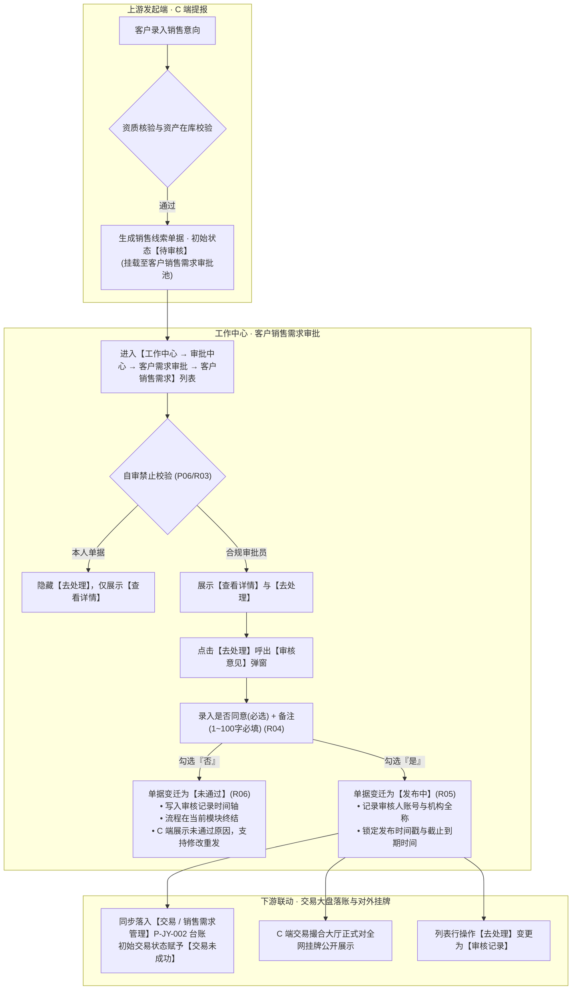
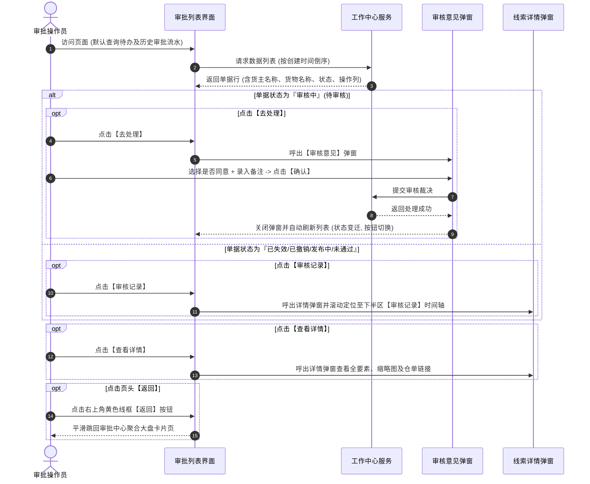
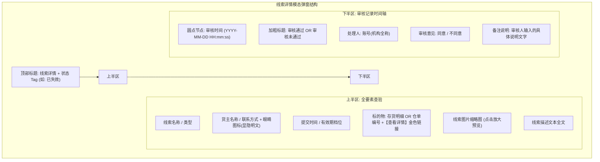

# 客户销售需求主PRD

> **模块定位**：工作中心 / 审批中心 / 客户需求审批 / 客户销售需求是平台风控合规团队把控大宗商品销售意向“真实性、合规性与资产权利完备性”的前置审批中枢。本模块承接来自 C 端个人实名或企业认证货主提报的现货存货或电子仓单销售意向申请，通过专业的平台审核裁决，确保只有真实在库物资或有效合规仓单方可正式对全网公开挂牌展示，从源头切断虚假贸易与空气单风险。  
> **端侧协同与链路说明**：
> - **上游发起（C 端）**：客户在客户端发起销售线索录入，经资质校验（企业认证阻断）与在库资产校验（已入库/部分出库存货或正常仓单）后提交，系统生成【待审核】单据并派发至本审批池；
> - **审批裁决（工作中心·本模块）**：审批人员通过行操作【去处理】弹出【审核意见】弹窗，勾选“是否同意”并强制录入 100 字内备注说明；严格遵循 P06 自审禁止规范；
> - **下游交易大盘联动（B 端 PC 交易台账）**：审核通过后单据状态流转为【发布中】，系统**实时同步写入【交易 → 销售需求管理】台账**，同时全网撮合大厅正式对外挂牌展示并开启倒计时；审核驳回（选择“否”）则单据终结，仅 C 端展示未通过原因并支持修改重发；
> - **数据权限**：挂靠平台顶级机构，按审批人员所属机构数据权限实现物理隔离。  
> **版本**：V2.0 | **更新时间**：2026-09-22 | **责任人**：森云科技（Senyun Technology）  
> **编写依据**：[客户销售需求字段清单.md](./客户销售需求字段清单.md) 是本模块所有字段定义、枚举与页面展示的唯一基准；[客户销售需求业务规则规格.md](./客户销售需求业务规则规格.md) 是本模块状态机、审批流转控制、自审禁止及数据安全的唯一定义来源；下游承接台账为 [销售需求管理主PRD.md](../../../../04-交易/02-销售需求管理/销售需求管理主PRD.md)。

---

## 1. 业务背景与业务痛点

### 1.1 业务背景
在动产质押与大宗现货贸易领域，贸易背景真实性是供应链金融的核心生命线。若允许货主未经验证即随意在大盘挂牌销售商品，极易出现虚假现货、一货多挂、已被查封资产二次变现等严重风险。

因此，平台在业务链条前端设立了强制性的前置合规审批关口：
1. **资质与资产双重准入把控**：平台审核岗对货主提报的标的物进行深度核验，对存货校验 WMS 真实入库库存，对仓单核查数字化凭单权属与司法状态；
2. **专业化审批留痕**：审批人员必须对每一笔销售意向出具合规意见，填写审查依据，全程不可变留痕；
3. **驱动交易大盘与供需对接**：通过审核的销售意向方可正式流入交易销售需求管理台账，保障大盘挂牌商品的权威性与公信力。

### 1.2 核心业务痛点
1. **虚构货物挂牌，引发虚假贸易与诈骗风险**：传统撮合缺乏前置资产核验，买家对接后发现无实物资产或货权受限；
2. **缺乏流程隔离，审批权责不清晰**：审批若混入通用大杂烩池，缺乏针对客户销售需求的专属通道与自审禁止机制，极易滋生道德风险；
3. **前后台状态脱节，审核通过未及时上架**：审核结论若未能原子性联动交易大盘与 C 端挂牌，会导致市场信息滞后与商机流失；
4. **客户敏感信息缺乏保护**：货主联系方式如果明文暴露给所有后台操作员，存在客户资源被恶意泄露的合规隐患。

---

## 2. 功能范围

| 包含功能范围 | 不包含功能范围 |
| :--- | :--- |
| - **审批列表多维检索**：支持按货主名称（模糊搜索）、类型（全部/存货/仓单）、状态（全部/待审核/发布中/未通过/已失效/已撤销）进行多维过滤； - **页头常驻导航**：右上角提供金黄色线框【返回】按钮，支持一键退回审批中心卡片聚合大盘； - **动态行操作控制**：   • 【待审核】单据展示 **【查看详情】 【去处理】**；   • 已处理单据（发布中/未通过/已失效/已撤销）展示 **【查看详情】 【审核记录】**； - **审核意见模态表单（`P-GZZX-AUDIT-SALE-DIALOG`）**：支持单选“是否同意”（是/否，必选）与录入审查备注（1~100字符，必填）； - **自审禁止硬性拦截（P06）**：审批人不可对本人账号提报的线索执行“去处理”； - **线索详情穿透弹窗（`P-GZZX-DETAIL-SALE-DIALOG`）**：全方位调阅线索全要素镜像、物证图片、存货规格明细或仓单凭单穿透（【查看详情】文字链接）； - **货主联系方式脱敏与明文显隐**：默认中间 4 位掩码脱敏，点击【👁️ 眼睛图标】切换明文展示，系统记录审计日志； - **不可变审核记录时间轴**：固化审核通过/驳回节点、处理人账号及机构全称、意见与说明； - **驱动下游交易台账生成**：审核通过原子性同步写入【交易/销售需求管理】台账。 | - **前台人工物理新增销售线索**：审批中心唯一定位为受理与裁决池，不提供直接代客新增线索功能； - **审批人员直接篡改客户提报数据**：审批人仅能裁决“通过”或“驳回”，禁止直接在后台修改客户填写的数量、描述或替换货物； - **物理删除审批流水**：所有审批历史与过程数据永久逻辑归档，禁止物理删除； - **越权审批与跨机构穿透**：严格遵循机构数据权限隔离与自审禁止。 |

---

## 3. 模块定位与系统链路

---

## 4. 页面功能说明

### 4.1 PC 端审批主列表页（`P-GZZX-005`）

> 对应审批列表最新截图图 1，路径：`工作中心 → 审批中心 → 客户需求审批 → 客户销售需求`。

#### 4.1.1 审批列表交互时序流

#### 4.1.2 页面目标与布局骨架
- **页面目标**：供平台审核岗人员全面集中监控、检索并快速处理待审的客户销售线索，查验存量线索的审核结论与生命周期变迁。
- **页面骨架**：
  - **顶栏标题与导航**：左侧展示标题 `客户销售需求`；右侧常驻黄色线框按钮 **【返回】**，点击返回上一级审批中心卡片聚合页；
  - **顶部筛选区**：横向单行排列 3 个筛选条件与 1 个【查询】按钮；
  - **表格数据区**：横向铺满展示审批流水，表头固定，支持 10 项标准列清晰呈现；
  - **底部分页区**：左侧展示数据总条数（如 `共 9 条`）与每页条数选择器（如 `10条/页`），右侧展示页码分页器与前往指定页跳转。

#### 4.1.3 筛选查询区规格
1. **货主名称**：单行文本输入框，占位文字“请输入货主名称”，支持输入货主姓名或企业名称关键词模糊过滤；
2. **类型**：下拉单选框，选项包含 `全部`、`存货`、`仓单`，默认选中 `全部`；
3. **状态**：下拉单选框，选项包含 `全部`、`待审核`、`发布中`、`未通过`、`已失效`、`已撤销`，默认选中 `全部`；
4. **【查询】按钮**：金黄色实心按钮，点击立即以所选条件刷新表格数据，当前页码自动重置为第 1 页。

#### 4.1.4 表格数据列规格与交互逻辑
1. **序号**：正整数序列号（如 1、2、3），分页动态计算；
2. **线索名称**：展示销售标题（如 `苹果`、`23423`、`啦啦啦线索`），单行展示超长截断；
3. **货主名称**：双行居左展示，第一行为货主认证姓名/企业全称，第二行为脱敏联系方式（如 `原原李` `185****7112`）；
4. **货物名称**：
   - 存货类：展示格式为 `{大类}-{品类}-{规格}-{数量}{单位}`（如 `水果-苹果-新疆-特级-23,422,818.11箱`、`饮料-碳酸-可口可乐-50%-33瓶`）；
   - 仓单类：展示电子仓单全称编号（如 `CD1981651101066788865`）；
5. **线索描述**：单行展示用户录入的描述说明（如 `大量特级苹果`、`24323234`）；
6. **线索有效期**：居中展示有效期天数档位（如 `7天`、`15天`、`30天`）；
7. **状态**：展示当前单据状态。待审核单据展示为 **审核中**（橙黄字体）；已失效、已撤销展示为浅灰文字；
8. **创建时间**：展示时间戳，格式为 `YYYY-MM-DD HH:mm:ss`（如 `2026-05-08 09:39:02`），列表默认按创建时间倒序排布；
9. **操作**：金黄色文字链接组合，**随状态动态切换**：
   - **待审核状态**：展示 **【查看详情】** 与 **【去处理】**；
   - **非待审核状态（发布中/未通过/已失效/已撤销）**：展示 **【查看详情】** 与 **【审核记录】**。

---

### 4.2 PC 端【审核意见】模态弹窗（`P-GZZX-AUDIT-SALE-DIALOG`）

> 对应审核意见弹窗最新截图图 3，在待审核单据上点击【去处理】呼出。

#### 4.2.1 表单字段与交互行为
- **弹窗标题**：居中弹出，标题为 `审核意见`，背景半透明遮罩，右上角带“×”关闭图标；
- **是否同意（* 必选）**：单选框组（Radio Group），选项为 `是` 或 `否`；必须选择其中一项，未勾选点击确认提示红字 `请选择审核意见`；
- **备注（必填）**：多行文本输入框（Textarea），占位提示“请输入备注”，右下角实时统计字数 `0/100`；限制输入 1~100 个纯文本字符，未录入点击确认提示红字 `请输入备注，长度不超过100个字符`；
- **底部按钮**：
  - **【取 消】**：左侧白底线框按钮，点击直接关闭弹窗，清空录入，不变更单据状态；
  - **【确 认】**：右侧金黄色高亮实心按钮，点击自上而下强校验必填项，通过后发起提交，服务端处理完毕后提示“审核成功”并关闭弹窗，列表自动刷新。

---

### 4.3 PC 端【线索详情】模态弹窗（`P-GZZX-DETAIL-SALE-DIALOG`）

> 对应线索详情弹窗最新截图图 2，点击操作列【查看详情】或【审核记录】呼出。

#### 4.3.1 弹窗结构与视觉
- **弹窗规格**：居中模态弹窗，顶部居左标题为 `线索详情`，右上角有关闭图标，标题右侧配有单据当前状态弱色 Tag（如截图所示浅黄色 Tag【已失效】）；
- **上半区：线索全要素只读视图**：
  - **线索名称**：展示意向标题（如 `啦啦啦线索`）；
  - **线索类型**：展示标的资产类型（如 `仓单` 或 `存货`）；
  - **货主名称**：展示货主真实姓名或企业名称（如 `原原李`）；
  - **货主联系方式**：默认脱敏展示（如 `185****7112`），右侧带【👁️ 眼睛图标】，点击原位切换为 11 位明文手机号；
  - **提交时间**：展示客户端提报时间（如 `2025-11-14 14:04:41`）；
  - **线索有效期**：展示所选天数档位（如 `15天`）；
  - **存货 / 仓单**：
    - 若为存货：展示 `存货: {规格明细及数量}`；
    - 若为仓单：展示 `仓单: CD1981651101066788865`，**右侧附带金色【查看详情】文字链接**。点击该链接可穿透弹出该电子仓单的标准票据详情；
  - **线索图片**：横向平铺展示货物实物或凭证缩略图，鼠标点击唤起大图全屏预览轮播；
  - **线索描述**：展示货主录入的线索详细补充文本（如 `如果滴答滴答...`）；
- **下半区：【审核记录】时间轴**：
  - 上下半区以横向浅灰线分割，标题为 `审核记录`；
  - 时间轴节点展示：黄色圆点节点、审核时间、处理结果卡片（加粗审核通过/未通过）、处理人账号及机构全称、审核意见及备注说明。

---

## 5. 核心业务场景

### 场景一：审批通过合规线索并联动上架大盘
1. **受理待审线索**：审核员登录系统进入 `工作中心 → 审批中心 → 客户需求审批 → 客户销售需求`，查阅列表首行待审核单据（线索名称“苹果”，状态“审核中”）；
2. **核验明细**：点击【查看详情】，核验标的物资苹果的规格数量（`水果-苹果-新疆-特级-23,422,818.11箱`）及货样图片，核对 WMS 在库真实库存充足；
3. **出具意见**：关闭详情，点击该行操作【去处理】，弹出【审核意见】弹窗；勾选“是否同意”为【是】，录入备注“货物资质与仓储实物核对无误，同意挂牌”，点击【确认】；
4. **系统自动闭环**：
   - 当前单据状态由“审核中”变迁为“发布中”，操作列自动切换为【查看详情】与【审核记录】；
   - 系统将该线索全要素同步推送到【交易 → 销售需求管理】台账；
   - C 端交易大厅正式对外挂牌，买家可查阅并关注该线索。

### 场景二：驳回信息不全或异常线索
1. **发现瑕疵**：审核员查阅某条仓单销售线索，点击【查看详情】并在仓单编号旁点击【查看详情】链接穿透查验仓单详情，发现该仓单已被货主质押给第三方金融机构且状态处于冻结期；
2. **执行驳回**：审核员点击【去处理】弹出【审核意见】弹窗，勾选“是否同意”为【否】，录入备注“该仓单当前处于质押冻结状态，权利受限，无法用于公开销售”；
3. **闭环结果**：单据状态变迁为【未通过】，审批流水在此终结归档，不流入交易大盘；C 端货主客户端收到驳回通知及具体理由。

### 场景三：审计溯源与查阅历史审核记录
1. **调阅归档单据**：风控合规人员在列表中筛选状态为【已失效】的单据，点击某条线索行操作列的【审核记录】；
2. **时间轴定位**：系统居中呼出线索详情弹窗，并自动滚动定位至下半区【审核记录】；
3. **存证核验**：风控人员清晰查阅当时审核通过的时间、处理人账号（`lxy`）及归属机构（`四川享宇科技有限公司`）与意见，作为司法存证与防篡改审计核验。

---

## 6. 核心业务规则与流转控制摘要

本模块业务动作受 [客户销售需求业务规则规格.md](./客户销售需求业务规则规格.md) 唯一定义约束，关键要点摘要如下：

1. **动态行操作逻辑 (R02)**：
   - 待审核单据渲染为 **【查看详情】 【去处理】**；
   - 已处理单据（发布中/未通过/已失效/已撤销）渲染为 **【查看详情】 【审核记录】**；
2. **P06 自审禁止硬性隔离 (R03)**：审批人员严禁审批本人提报的线索申请，本人提报单据【去处理】隐藏并后端拦截；
3. **审核意见录入双强校验 (R04)**：“是否同意”必选，“备注”必填且限制 1~100 字符纯文本；
4. **审核通过驱动交易台账生成 (R05)**：选择“是”并提交后，状态变迁为【发布中】，锁定绝对截止时间戳，实时同步落入【交易/销售需求管理】台账；
5. **审核驳回终态归档 (R06)**：选择“否”并提交后，状态变迁为【未通过】，单据终结，绝不流入交易大盘，通知 C 端支持重新修改发布；
6. **仓单凭单深度穿透 (R07)**：仓单类型线索提供【查看详情】金黄色链接，一键穿透查阅电子仓单全要素；
7. **手机号脱敏与明文显隐审计 (R08)**：默认掩码保护，点击眼睛图标原位切换明文，后台记录查阅审计日志；
8. **不可变存证快照 (R09)**：审核记录一旦提交永久固化，禁止任何前台撤销与篡改。

---

## 7. 权限与数据隔离

### 7.1 RBAC 角色权限矩阵
- **平台审核岗**：负责列表查询、查看详情、点击【去处理】提交审核意见（`P-GZZX-005`、`P-GZZX-AUDIT-SALE`）；
- **风控合规主管**：拥有全量审批流水查阅、查看审核记录、明文手机号查阅权限（`P-GZZX-UNMASK`）；
- **仓单业务人员**：拥有点击【查看详情】穿透查阅底层电子仓单凭单权限（`P-GZZX-WR-VIEW`）。

### 7.2 顶级机构数据隔离
- 所有客户销售需求审批单据均严格挂靠平台顶级机构；
- 审批人员仅可查看和处理所属顶级机构管辖范围内的销售线索，防止跨租户越权。

---

## 8. 验收标准与测试要点

| 序号 | 测试维度 | 核心验收标准与测试步骤 | 预期结果 |
| :---: | :--- | :--- | :--- |
| **TC01** | 列表动态操作列呈现 | 查看处于【待审核】与处于【已失效】/【发布中】单据的操作列 | 待审核单据显示【查看详情】【去处理】；非待审核单据显示【查看详情】【审核记录】 |
| **TC02** | 自审禁止校验 | 使用与线索提报人相同的账号登录系统并访问本模块 | 该单据操作列隐藏【去处理】，仅展示【查看详情】；接口调用阻断 |
| **TC03** | 审核意见必填强校验 | 点击【去处理】，不选“是否同意”点击确认；选择“是”但不填备注点击确认；备注输入超过 100 字 | 分别提示“请选择审核意见”与“请输入备注，长度不超过100个字符”；超长截断 |
| **TC04** | 审核通过落账联动 | 勾选“是”，录入 50 字备注，点击确认提交 | 当前列表单据状态更新为【发布中】，操作列切换为【审核记录】；【交易/销售需求管理】台账实时新增一条【发布中】记录 |
| **TC05** | 审核驳回处理 | 勾选“否”，录入驳回理由，点击确认提交 | 单据状态变迁为【未通过】；交易台账未增加该记录；C 端收到未通过驳回理由 |
| **TC06** | 仓单穿透详情查看 | 打开一条仓单类型的线索详情，点击仓单编号旁的【查看详情】 | 正确弹出该电子仓单的标准化凭据详情 |
| **TC07** | 手机号脱敏显隐切换 | 在线索详情弹窗中点击货主联系方式旁的【👁️ 眼睛图标】 | 原位切换为 11 位明文手机号；再次点击恢复掩码；后台生成脱敏查看审计流水 |
| **TC08** | 页头返回按钮跳转 | 点击页面右上角黄色线框【返回】按钮 | 页面平滑返回审批中心卡片导航聚合页 |

---

## 9. 修订记录

| 版本号 | 修订日期 | 修订人 | 修订内容概述 |
| :--- | :--- | :--- | :--- |
| **V1.0** | 2026-09-22 | 森云科技 PM 团队 | 首次初始化《客户销售需求主PRD》。 |
| **V2.0** | 2026-09-22 | 森云科技 PM 团队 | **流程与交互图全量补全**：全面补全审批列表交互时序流与详情模态弹窗交互架构 Mermaid 图；强化仓单穿透与双向互链。 |
