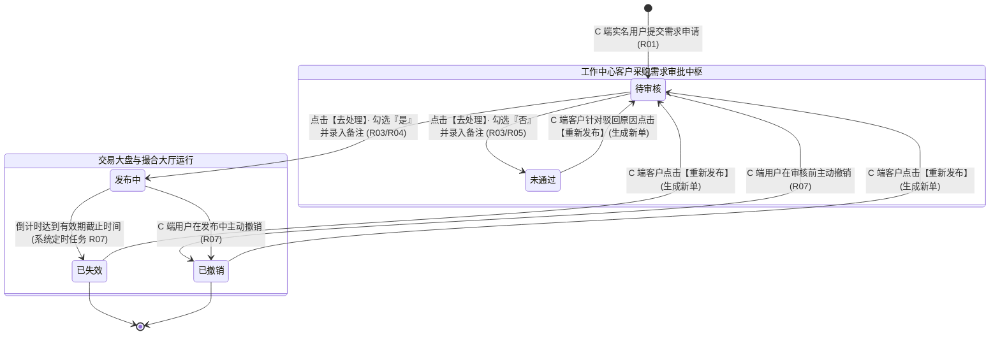
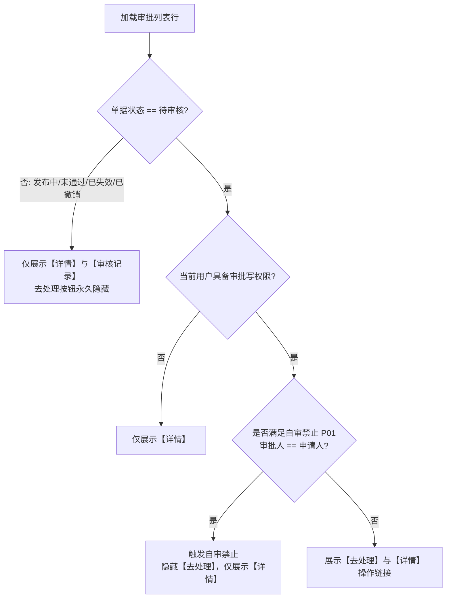
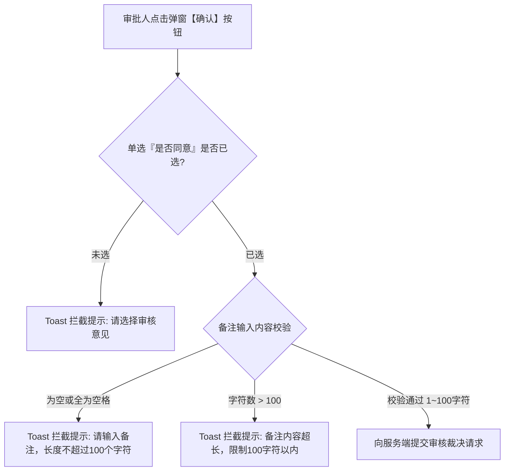

# 客户采购需求业务规则规格

> **文档定位**：工作中心 / 审批中心 / 客户需求审批 / 客户采购需求模块状态机生命周期、审批裁决权限、前置校验规则、跨模块触发驱动机制以及责任审计逻辑的**唯一定义真源**。主 PRD、字段清单及端侧原型仅引用本文件规则名称与编号（如 `【规则业务名称】(Rxx)`、`【异常业务名称】(Cxx)`、`【权限业务名称】(Pxx)`），不重复定义规则本体。  
> **模块类型**：工作中心前置业务审批与准入控制类（承接 C 端个人实名认证用户提报、结构化审核意见裁决、记录带归属机构的审核日志、审核通过后驱动交易大盘生效）。  
> **参考文档**：[《客户采购需求主PRD》](./客户采购需求主PRD.md)、[《客户采购需求字段清单》](./客户采购需求字段清单.md)、[《00-功能与数据权限清单》](../../00-功能与数据权限/功能与数据权限清单.csv)。  
> **版本**：V1.1 | **更新时间**：2026-09-22 | **责任人**：森云科技（Senyun Technology）

---

## 一、单据与能力定位

| 项目 | 内容 |
| :--- | :--- |
| **单据层级** | **【第2层-审批控制与准入流转层】**（全网采购需求真实性把关与前置审批中枢） |
| **核心职责** | 集中收录并受理 C 端个人实名认证用户提报的采购需求；为运营和风控审批人员提供全要素核查视图；通过【审核意见】弹窗实现是否同意的结构化裁决；记录带处理人真实账号与归属机构全称的【审核记录】；通过则自动驱动交易大盘与撮合大厅上架，未通过则退回驳回意见。 |
| **单据来源** | **C 端用户提报驱动发起**： 1. C 端个人已实名用户在前端录入采购意向并提交； 2. 提交成功后系统自动生成一笔采购需求单据，初始状态为【待审核】； 3. 单据全量自动汇入本审批池列表。 |
| **上游依赖** | **个人实名认证中心**：提供发布人真实姓名与实名状态； **货品主档管理**：提供品类、货品、规格及计量单位主档； **用户与组织中心**：提供审批人登录账号名及其所属机构法定全称。 |
| **下游影响** | **交易/采购需求管理台账**：审核通过后自动落入 B 端生产台账（状态为发布中）； **C 端交易撮合大厅**：审核通过后正式公开上架对外展示； **C 端我的需求**：实时回写审批结果（发布中/未通过）及审批人填写的备注说明。 |
| **归档台账边界** | **【待审核活跃流转与历史单据追溯】**：本列表不仅展示待审核单据，同时保留已处理（发布中、未通过、已失效、已撤销）的全量单据以供倒查审计；处理完成的单据【去处理】按钮自动消失。 |
| **入口路径** | PC 列表：`工作中心 → 审批中心 → 客户需求审批 → 客户采购需求`（`P-GZZX-006`）；顶部右侧常驻【返回】按钮直达审批中心总览。 |

---

## 二、数量与计算口径隔离表

| 口径名称 | 存在位置 | 业务含义与计算公式 | 约束与边界条件 |
| :--- | :--- | :--- | :--- |
| **需求数量** | 审批列表展示 / 详情弹窗 | 客户申请采购该规格货品的计划物理总量 $Q_{\text{demand}}$ | 数值必须 $> 0$，最大支持保留 3 位小数；列表千分位逗号分割展示并拼接货品基础计量单位（如 `1,000.000公斤`、`3,434,344,434.000桶`） |
| **需求有效期天数** | 审批列表展示 / 详情弹窗 | 客户发布时指定的挂牌生效总自然日历天数 $D_{\text{valid}}$ | 严格单选枚举：$D_{\text{valid}} \in \{7, 15, 30\}$ 天；审批过程只读展示，不可由审批人修改 |
| **倒计时绝对截止时间** | 系统服务端计算 / 记录落库 | 需求对外公开展示的最晚截止时刻： $$T_{\text{expire}} = T_{\text{pass}} + D_{\text{valid}} \times 86400\text{秒}$$ | 以审批人员点击【确认】审核通过时刻 $T_{\text{pass}}$ 为绝对起算点，精确到秒；自然日历时间届满触发自动失效 |
| **审核备注字符数** | 【审核意见】弹窗 | 审批人在弹窗内填写的合规核验意见或驳回原因文字长度 $L_{\text{remark}}$ | 整数范围：$1 \le L_{\text{remark}} \le 100$ 字符；红星必填，禁止全空格 |
| **待处理待办数** | 审批中心导航角标 | 工作中心审批总览中“客户采购需求”展示的未处理单据数量 | 统计公式：$$N_{\text{todo}} = \text{Count}(\text{status} == \text{'PENDING\_AUDIT'})$$；红色圆点角标动态更新 |

---

## 三、单据状态机与流转定义

### 3.1 状态定义

| 状态名称 | 状态编码 | 业务含义 | 是否终态 | 审批列表可见性 | 去处理按钮可见性 |
| :--- | :--- | :--- | :---: | :---: | :---: |
| **待审核** | `PENDING_AUDIT` | C 端用户首次提交或重新发布提交成功，等待后台审核 | 否 | **可见** | **可见（具备权限展示）** |
| **发布中** | `PUBLISHING` | 审批人审核通过，需求正式在全网大厅展示生效 | 否 | **可见** | **不可见（已处理隐藏）** |
| **未通过** | `AUDIT_REJECTED` | 平台审批人审核驳回，单据不合规或信息有误 | **是** | **可见** | **不可见（已处理隐藏）** |
| **已失效** | `EXPIRED` | 需求运行达到所选有效期天数，系统自动到期下架 | **是** | **可见** | **不可见（终态归档）** |
| **已撤销** | `REVOKED` | C 端用户在待审核或发布中主动点击撤销发布 | **是** | **可见** | **不可见（终态归档）** |

### 3.2 状态流转图

---

## 四、动作能力与流转控制矩阵

| 触发动作 | 操作入口 | 适用角色 | 前置业务校验条件 | 结果状态 | 联动后置影响 | 失败阻断提示 |
| :--- | :--- | :--- | :--- | :--- | :--- | :--- |
| **查看单据列表** | 工作中心导航菜单 | 具备本页面菜单权限的账号 | 登录账号具备对应机构数据权限 | 维持原状态 | 进入列表，默认按需求创建时间倒序呈现全量单据。 | - |
| **去处理（呼出弹窗）** | 列表行操作【去处理】链接 | 具备审批权限的操作员 | ① 单据处于【待审核】； ② 账号具备审核操作权限； ③ 遵循【发起人自审禁止】(P01)。 | 维持原状态 | 居中呼出【审核意见】模态弹窗；若状态已被他人更改则阻断。 | 「操作失败：单据已被他人处理或状态已发生变更」 「操作失败：自审禁止（不可审批本人发起的单据）」 |
| **提交审核通过** | 【审核意见】弹窗【确认】按钮 | 具备审批权限的操作员 | ① 勾选“是否同意”为【是】； ② 录入备注（必填，1~100 字符）； ③ 单据仍处于【待审核】。 | 发布中 | ① 单据状态更新为发布中； ② 落账一条审核通过记录（记录人员账号与所属机构全称）； ③ 同步写入交易管理台账并上架撮合大厅； ④ 列表【去处理】按钮即刻消失。 | 「请选择审核意见」 「请输入备注，长度不超过100个字符」 |
| **提交审核驳回** | 【审核意见】弹窗【确认】按钮 | 具备审批权限的操作员 | ① 勾选“是否同意”为【否】； ② 录入驳回理由备注（必填，1~100 字符）； ③ 单据仍处于【待审核】。 | 未通过 | ① 单据状态更新为未通过； ② 落账一条审核未通过记录； ③ 向 C 端推送审核驳回通知，允许客户重新发布； ④ 列表【去处理】按钮即刻消失。 | 「请选择审核意见」 「请输入备注，长度不超过100个字符」 |
| **查看详情** | 列表行操作【查看详情/详情】 | 具备本页面查看权限的操作员 | 具备该单据查看权限 | 维持原状态 | 居中呼出详情模态弹窗，上半区展示物料要素，下半区展示【审核记录】时间轴。 | - |
| **返回审批中心** | 页头右上角【返回】按钮 | 任意操作员 | 无特殊前置条件 | - | 路由跳转回工作中心审批卡片总览大页。 | - |

---

## 五、核心业务规则清单 (R01 ~ R10)

### 5.1 审批受理与准入规则

#### 5.1.1 【审批单据自动收口与隔离】(R01)
- **规则编号**：`R01`
- **规则名称**：审批单据自动收口与隔离
- **详细要求**：
  1. C 端个人实名认证用户提交的采购需求，系统服务端唯一推送到 B 端【工作中心 → 审批中心 → 客户需求审批 → 客户采购需求】；
  2. 初始状态统一标记为【待审核】（`PENDING_AUDIT`）；
  3. 未经审批通过前，单据绝对禁止流入 B 端 `交易 / 采购需求管理` 正式台账，亦不得在公共撮合大厅公开展示，实现风险前置阻断。

#### 5.1.2 【去处理按钮显隐与状态权限强绑定】(R02)
- **规则编号**：`R02`
- **规则名称**：去处理按钮显隐与状态权限强绑定
- **详细要求**：
  1. **状态前置卡口**：列表操作列中，【去处理】按钮**仅当单据处于【待审核】状态时呈现**；
  2. **权限前置卡口**：当前登录账号必须具备该单据的审批操作权限；若仅有查看权限，操作列只展示【查看详情】；
  3. **自审禁止拦截**：如果当前审批人账号与单据提报人为同一主体，强行隐藏【去处理】按钮（见 P01）；
  4. **处理后即刻消失**：无论是选择“是”（通过）还是选择“否”（驳回），单据处理完成提交后，该行【去处理】按钮**即刻永久消失**，严禁对已处理单据进行二次审批。

---

### 5.2 审核意见弹窗与裁决规则

#### 5.2.1 【审核意见弹窗字段校验与拦截】(R03)
- **规则编号**：`R03`
- **规则名称**：审核意见弹窗字段校验与拦截
- **详细要求**：
  1. 点击【去处理】呼出居中模态弹窗【审核意见】；
  2. **是否同意校验**：单选选项（`是` / `否`），红星强制必选；未选点击确认直接拦截提示：“*请选择审核意见*”；
  3. **备注校验**：多行文本输入框，红星强制必填，长度限制 1 ~ 100 字符；若为空或输入全空格拦截提示：“*请输入备注，长度不超过100个字符*”；超过 100 字符禁止输入并提示超长；
  4. 点击【取消】或右上角关闭按钮退出弹窗，不保存任何数据变更。

#### 5.2.2 【审核通过驱动交易台账入账与大盘上架】(R04)
- **规则编号**：`R04`
- **规则名称**：审核通过驱动交易台账入账与大盘上架
- **详细要求**：
  1. 在【审核意见】弹窗中勾选“是否同意”为【是】并录入备注，点击确认；
  2. 系统在单一事务内执行以下原子操作：
     - 单据状态流转为【发布中】（`PUBLISHING`）；
     - 自动同步落账至 B 端生产台账 `交易 / 采购需求管理`（`P-JY-001`）；
     - C 端公共交易撮合大厅正式上架公开该采购意向；
     - 以审核通过时间 $T_{\text{pass}}$ 起算，锁定倒计时截止时间 $T_{\text{expire}}$；
     - 写入一条审核通过流水至【审核记录】。

#### 5.2.3 【审核未通过驳回处理与重发流转】(R05)
- **规则编号**：`R05`
- **规则名称**：审核未通过驳回处理与重发流转
- **详细要求**：
  1. 在【审核意见】弹窗中勾选“是否同意”为【否】并录入驳回理由备注，点击确认；
  2. 系统更新单据状态为【未通过】（`AUDIT_REJECTED`）；
  3. 单据终止流转，不流入交易管理台账，公共大厅不展示；
  4. C 端客户“我的需求”中接收到驳回通知并回显审核人填写的备注说明，单据激活【重新发布】按钮，客户可在此基础上修正并重新提报。

---

### 5.3 审核记录与全链路追溯

#### 5.3.1 【审核记录时间轴与机构全称原子沉淀】(R06)
- **规则编号**：`R06`
- **规则名称**：审核记录时间轴与机构全称原子沉淀
- **详细要求**：
  1. 任何审核操作提交成功时，系统强制生成一条不可变审计记录，写入审核记录表；
  2. **机构全称强留痕**：处理人字段必须由系统后端自动组装为：`{处理人登录账号名称}({账号归属机构法定全称})`（例如：`lxy(四川享宇科技有限公司)`）；严禁使用未绑机构的匿名工号或简写；
  3. **详情弹窗展现**：在需求详情弹窗下半区以纵向时间轴渲染，展示：节点时间（精确到秒）、处理结果标签（审核通过/审核未通过）、处理人账号及机构、审核意见（同意/不同意）及说明备注；按处理时间倒序排列。

#### 5.3.2 【倒计时截止时间推算与自动到期同步】(R07)
- **规则编号**：`R07`
- **规则名称**：倒计时截止时间推算与自动到期同步
- **详细要求**：
  1. 审核通过后，系统服务根据所选有效期 $D_{\text{valid}} \in \{7, 15, 30\}$ 天，锁定截止时间：
     $$T_{\text{expire}} = T_{\text{pass}} + D_{\text{valid}} \times 86400\text{秒}$$
  2. 系统后台定时巡检任务若检测到系统当前时间 $\ge T_{\text{expire}}$，自动将状态更新为【已失效】（`EXPIRED`），下架 C 端大厅展示；
  3. C 端用户在前端主动点击撤销发布，单据状态变更为【已撤销】（`REVOKED`），大厅下架；本审批列表状态实时同步变迁并支持历史倒查。

---

### 5.4 隐私安全与台账检索

#### 5.4.1 【审批列表组合查询与时间倒序】(R08)
- **规则编号**：`R08`
- **规则名称**：审批列表组合查询与时间倒序
- **详细要求**：
  1. **发布人名称检索**：单行文本输入框，前后去空格后在数据库执行模糊匹配（`LIKE %name%`）；
  2. **状态筛选**：下拉单选框，支持筛选全部、待审核、发布中、未通过、已失效、已撤销 6 项枚举；
  3. **排序规则**：列表严格按【需求创建时间】（`demand_created_at`）**倒序排列**，最新进入审批池的单据置顶展示；
  4. **分页机制**：支持 10/20/50 条每页切换，触发查询自动重置为第 1 页。

#### 5.4.2 【需求详情全要素只读穿透】(R09)
- **规则编号**：`R09`
- **规则名称**：需求详情全要素只读穿透
- **详细要求**：
  1. 点击操作列【查看详情/详情】呼出居中模态弹窗；
  2. 弹窗内所有字段（物料、数量、产地、送货地、频率、采购要求、关于我们）均为只读排版；
  3. 图片资料展示为正方形缩略图（最多 10 张），点击唤起全屏无损预览器，支持放大查验货物与资质真伪。

#### 5.4.3 【敏感数据中间掩码脱敏保护】(R10)
- **规则编号**：`R10`
- **规则名称**：敏感数据中间掩码脱敏保护
- **详细要求**：
  1. 严格遵循《个人信息保护法》；
  2. 列表页【发布人】列与详情弹窗【发布人】字段中展示的联系电话，服务端统一对中间 4 位执行掩码转换（如 `185****7112`）；
  3. 接口严禁下发未脱敏明文手机号，杜绝客户商业隐私泄露。

---

## 六、边界与异常处理规格 (C01 ~ C03)

| 异常编号 | 异常场景 | 系统判定逻辑与并发控制 | 交互表现与阻断提示 |
| :--- | :--- | :--- | :--- |
| **C01** | **并发去处理审批防冲突锁** | 两名审批人员同时打开待办列表，针对同一笔【待审核】单据先后点击【去处理】并提交审核意见 | 服务端采用分布式排他锁（`lock:demand_audit:{demand_id}`）。先提交的请求成功更新状态并释放锁；后提交的请求检测到当前单据状态已非 `PENDING_AUDIT`，事务直接回滚，向后提交人员返回友好提示：“*操作失败：该单据已被其他审核人员处理完毕*”，并自动刷新当前列表数据。 |
| **C02** | **货品规格停用后的审批处理策略** | 客户提交需求时所选货品规格有效，但在审批员审核前，后台管理员停用了该规格 | 审批员点击【去处理】呼出弹窗提交审核通过时，系统重新校验货品规格状态；若已停用，拦截通过操作，提示：“*当前货品规格已被系统停用，无法通过发布，请予以驳回*”；审批员应选择“否”进行驳回，指引客户重新提报。 |
| **C03** | **图片附件 OSS 私有化安全预览** | 外部恶意请求尝试直接抓取采购需求物证图片 | 图片全量存储于私有对象存储（OSS），不开放公网匿名读取；弹窗加载图片时，服务端动态生成带时效签名的临时 URL（有效期设定为 15 分钟），超时自动失效。 |

---

## 七、权限与安全控制规格 (P01 ~ P02)

### 7.1 【发起人自审禁止约束】(P01)
- **规则编号**：`P01`
- **规则名称**：发起人自审禁止约束
- **详细要求**：
  1. 严格落实金融级审批合规隔离规范；
  2. 若当前登录审批人员的个人账号 ID 与需求提报人账号 ID 一致（如内部员工以个人认证测试提报），系统对该单据**禁止提供【去处理】按钮**；
  3. 操作列仅呈现【查看详情】，防止自提自审、监守自盗风险。

### 7.2 【顶级机构数据挂靠与租户隔离】(P02)
- **规则编号**：`P02`
- **规则名称**：顶级机构数据挂靠与租户隔离
- **详细要求**：
  1. 依据系统统一 RBAC 规范，客户采购需求数据统一挂靠顶级机构；
  2. 登录账号必须拥有 `工作中心 / 审批中心 / 客户需求审批 / 客户采购需求` 菜单权限及所辖机构数据权限；
  3. 系统底层按机构 ID 强制进行 SQL 数据过滤，严禁跨租户或越权查看管辖范围外的申请记录。

---

## 修订记录

| 日期 | 版本 | 变更内容说明 | 影响范围 | 修订人 |
| :--- | :--- | :--- | :--- | :--- |
| 2026-09-22 | V1.0 | 初稿发布工作中心客户采购需求业务规则规格。 | 全文 | AI PM / 森云科技 |
| 2026-09-22 | **V1.1** | **全面对齐仓储基准排版与 Mermaid 流程图补全**： 1. 规范单据与能力定位、计算口径隔离、状态机及动作能力控制矩阵； 2. 新增【去处理】按钮显隐自审禁止流程图、审核意见弹窗表单校验流程图； 3. 完善 R01~R10 规则、C01~C03 异常边界控制及 P01/P02 权限规范； 4. 结构排版与仓储标杆完全对齐。 | 全文规则深化、Mermaid 流程与排版对齐 | AI PM / 森云科技 |
