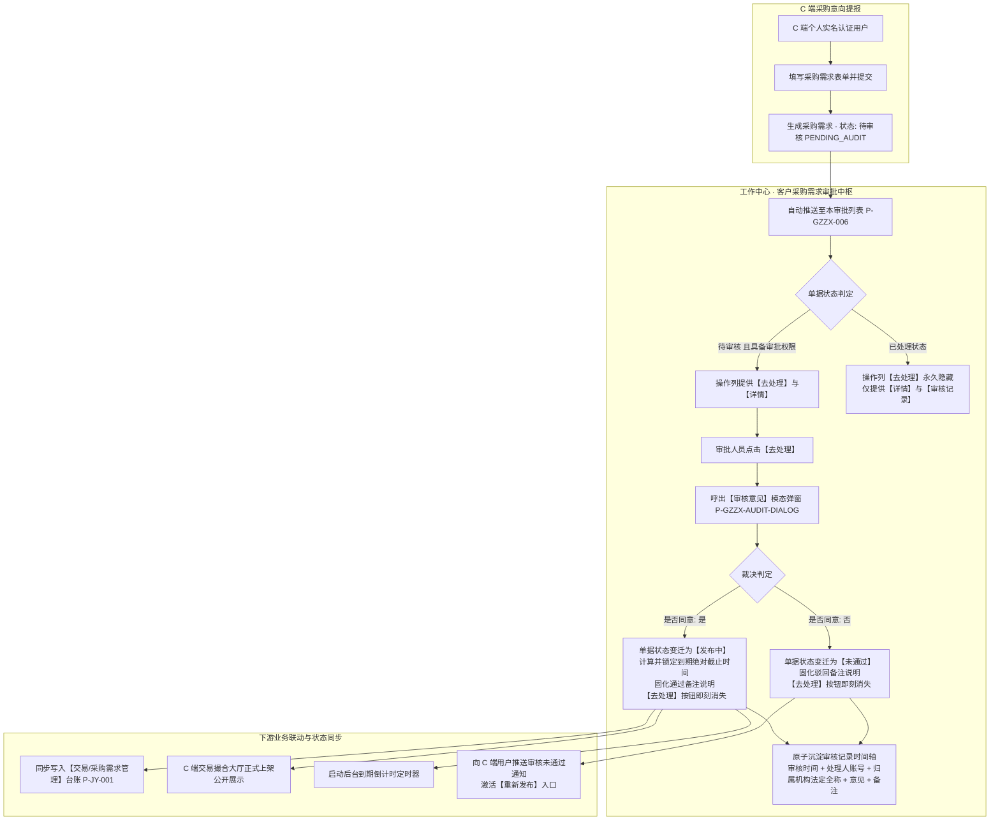
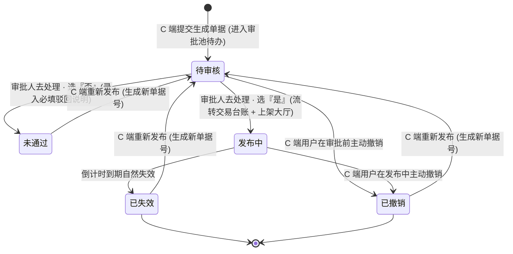
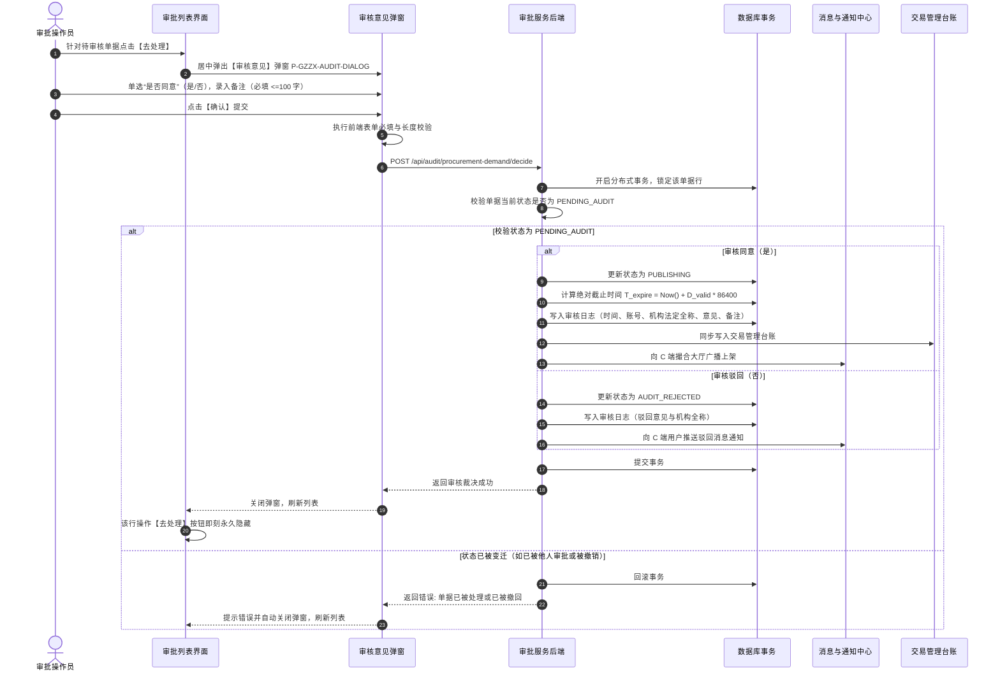
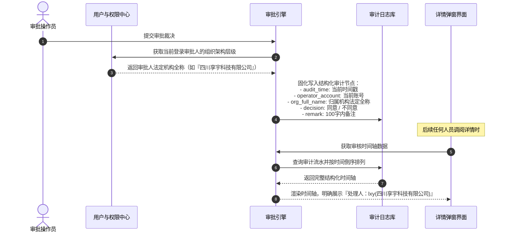
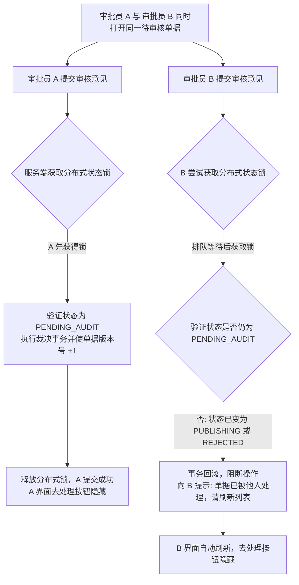

# 客户采购需求主PRD

> **模块定位**：工作中心 / 审批中心 / 客户需求审批 / 客户采购需求是供应链金融存货监管与大宗贸易业务中，平台运营与风控团队审核 C 端客户采购意向的前置业务审批中枢。本模块集中受理来自 C 端个人实名认证用户提交的各类大宗物资与商品采购需求，通过结构化审核意见裁决（是否同意、必填备注）、审核记录追溯及机构名称留痕，把关全网采购意向真实性与合规性；审批通过后驱动需求正式向公共撮合大厅上架并流入交易管理台账，审批未通过则沉淀驳回理由并支持客户重新发起。  
> **端侧协同与链路说明**：
> - **审批入口**：位于 PC 端【工作中心 → 审批中心 → 客户需求审批 → 客户采购需求】（右上角提供【返回】按钮直达审批中心总览）；
> - **上游提报（C 端）**：个人实名认证用户在前端提交采购意向，初始生成【待审核】单据进入本审批池；
> - **下游流转（B 端交易）**：审核通过后状态变更为【发布中】，自动同步落入【交易 → 采购需求管理】生产台账并在 C 端大厅对外公示；
> - **权限与去处理控制**：有菜单权限的账号可查看管辖范围内的采购需求申请；【去处理】操作权限受账号权限约束，且仅对【待审核】单据展示，处理完成后该按钮即刻消失不可再次处理。  
> **版本**：V1.1 | **更新时间**：2026-09-22 | **责任人**：森云科技（Senyun Technology）  
> **编写依据**：[客户采购需求字段清单.md](./客户采购需求字段清单.md) 是本模块所有字段定义、枚举与页面展示的唯一基准；[客户采购需求业务规则规格.md](./客户采购需求业务规则规格.md) 是本模块状态机、审批校验算法、审核意见弹窗、审核记录机构留痕及自审禁止的唯一定义来源。

---

## 1. 业务背景与业务痛点

### 1.1 业务背景
在供应链金融动产质押与大宗商贸场景下，下游真实的采购需求不仅是撮合促成贸易交易的前提，更是评估借款企业与贸易各方经营真实性、资金流向合规性的核心抓手。未经严格审核的虚假采购信息，容易滋生黑产刷单、违禁物资发布、甚至配合虚假仓单进行套利融资。

平台将采购需求的审核前置收口于【工作中心 → 审批中心】：
1. **统一审批池受理**：所有前端提报的采购意向全量自动汇集入池，集中呈现在待办列表中；
2. **结构化审核把关**：通过统一的【审核意见】弹窗，要求审核员明确表态“是否同意”，并强制填写 100 字以内的合规审查理由；
3. **全要素镜像核验**：审批人可在【需求详情】弹窗中一站式穿透核验物料、规格、数量、产地、送货地、长文本要求及图片资质物证；
4. **全链路责任穿透**：审核结果连同处理人登录账号、所属机构法定全称沉淀至【审核记录】时间轴，实现“谁审批、谁负责”的金融级审计追踪。

### 1.2 核心业务痛点
1. **口头审核无痕迹，责任难以倒查**：传统模式下缺少结构化审核流程，审核人身份与审核意见未固化机构快照，发生风险无法追溯；
2. **重复处理与并发冲突**：多名审核员同时在线时，若无严格的按钮显隐控制与状态锁，极易发生多人重复审批同一笔单据；
3. **审批驳回缺乏明确理由**：前端用户在需求未通过时无法得知具体原因，导致反复无效提报；
4. **审批与下游台账脱节**：审核结论若未能原子驱动交易大盘与前端公示，会导致无效信息流入撮合市场。

---

## 2. 功能范围

| 包含功能范围 | 不包含功能范围 |
| :--- | :--- |
| - **客户采购需求多维组合检索**：支持按发布人名称（模糊检索）、审批流转状态（全部/待审核/发布中/未通过/已失效/已撤销）快速查询； - **审批列表核心列呈现（11 列）**：序号、需求创建时间、需求名称、需求产品、需求数量、发布人（姓名+脱敏手机号）、产品产地、采购频率、需求有效期、状态、操作； - **单据审核裁决（【去处理】）**：针对待审核单据呼出【审核意见】模态弹窗，单选“是否同意”（是/否），录入 100 字符内必填备注，提交后原子流转状态，处理后【去处理】按钮即刻永久隐藏； - **需求全要素详情与审核记录穿透**：点击【查看详情/详情】居中弹出模态框，上半区呈现物料全要素与图片，下半区展示按处理时间倒序排列的【审核记录】时间轴（时间、处理人账号及归属机构全称、意见、备注）； - **快速返回审批中心**：页面右上角提供【返回】按钮，支持一键退回工作中心审批卡片聚合大页。 | - **页面直接新增采购需求**：本模块为审批与受理中枢，不提供人工制单新增入口（发布入口唯一设于 C 端）； - **审批后直接修改原需求数据**：审核员不可篡改客户提交的品名、数量、产地等原始意向数据；若有瑕疵应选择“否”并说明驳回理由； - **已处理单据反悔重审**：单据一旦提交审核意见，状态即进入已处理终态，不可线上逆向撤回重置为待审核； - **物理删除审核记录**：所有审核历史、意见与时间戳永久物理归档，严禁任何角色删除审计数据。 |

---

## 3. 模块定位与系统链路

### 3.1 端到端审批裁决与多端分发泳道图

---

### 3.2 跨模块与跨端数据交互边界

| 协同板块 | 接收事件与触发时机 | 具体数据更新行为与业务效力 |
| :--- | :--- | :--- |
| **【审批中心总览】** | 待审核单据产生 / 审批处理完成 | 动态刷新工作中心“客户需求审批”分组下“客户采购需求”子项的未处理待办红点角标数字。 |
| **【C 端我的需求】** | 审核人员提交审核意见 | 实时同步状态变更（变为发布中或未通过）；用户在详情中可查阅审批人填写的备注说明；若未通过可激活【重新发布】。 |
| **【C 端撮合大厅】** | 审核意见选择“是”通过 | 采购需求即刻公开上架，向全网展示品类规格、数量、期望产地与采购频次。 |
| **【交易/采购需求管理】** | 审核意见选择“是”通过 | 首次同步落账至交易管理主台账，作为平台运营大盘监控对象，锁定原始发布物证快照。 |
| **【合同与合规中心】** | 审核全要素固化 | 固化审核人姓名、工号、归属法人机构全称及审查意见，作为后续生成贸易合同的法律背景佐证。 |

---

## 4. 业务场景与用户故事

| 场景编号与名称 | 触发角色 | 核心交互与风控约束 | 业务价值 |
| :--- | :--- | :--- | :--- |
| **场景 1【待审需求受理与全要素核验】(S01)** | 平台风控/运营审核岗 | 审核员进入列表，按时间倒序查阅待审核需求；点击【查看详情】呼出弹窗，逐项核验需求产品、数量、产地、长文本及图片资料，确认无违禁或虚假成分。 | 规范意向准入，杜绝虚构贸易与垃圾信息。 |
| **场景 2【去处理裁决与审核通过】(S02)** | 平台风控/运营审核岗 | 针对核验无误的待审核单据，点击行操作【去处理】，弹出【审核意见】弹窗，单选勾选“是否同意”为【是】，输入合规审查结论备注（如“资质核实无误，同意发布”），点击【确认】。系统将状态置为【发布中】，记录处理人账号与所属机构全称，触发下游交易大盘上架，列表【去处理】按钮即刻消失。 | 结构化确认通过，自动触发下游大盘并固化审批人机构责任。 |
| **场景 3【去处理裁决与审核驳回】(S03)** | 平台风控/运营审核岗 | 若发现需求描述不清或图片缺失，审核员点击【去处理】，在弹窗中勾选“是否同意”为【否】，并在备注中详细录入驳回原因（如“请补充产品质量检验报告图片”），点击【确认】。系统将状态更新为【未通过】，下半区记录驳回意见，C 端客户可针对性补充资料后重新发布。 | 指引客户纠错，防止违规单据流入公开大盘。 |
| **场景 4【全生命周期台账追溯查验】(S04)** | 业务主管 / 审计人员 | 运营主管进入列表，按发布人名称模糊检索或筛选已失效、未通过、已撤销单据；点击【详情】查阅完整物料信息及底部【审核记录】时间轴，查看历史上每一次处理的具体人员与机构。 | 穿透全流程历史痕迹，满足金融与司法审计要求。 |
| **场景 5【快速退回审批中心导航】(S05)** | 审批操作员 | 在列表页右上角点击【返回】按钮，系统直接跳转回审批中心聚合首页，方便操作员切换处理其他审批子类型。 | 提高多单据审批流转效率，优化交互体验。 |

---

## 5. 状态机与动作能力矩阵

### 5.1 审批流转状态全集

---

### 5.2 动作能力与流转控制矩阵

| 动作名称 | 待审核 (`PENDING_AUDIT`) | 发布中 (`PUBLISHING`) | 未通过 (`AUDIT_REJECTED`) | 已失效 (`EXPIRED`) | 已撤销 (`REVOKED`) |
| :--- | :---: | :---: | :---: | :---: | :---: |
| **列表展示** | **✅ 待处理** | **✅ 已处理展示** | **✅ 已处理展示** | **✅ 归档展示** | **✅ 归档展示** |
| **行操作【去处理】** | **✅ (具备权限展示)** | ❌ (永久隐藏) | ❌ (永久隐藏) | ❌ (永久隐藏) | ❌ (永久隐藏) |
| **行操作【详情】** | **✅ (展示全要素)** | **✅ (展示全要素)** | **✅ (展示全要素)** | **✅ (展示全要素)** | **✅ (展示全要素)** |
| **行操作【审核记录】** | ❌ (待审核尚无记录) | **✅ (直达时间轴)** | **✅ (直达时间轴)** | **✅ (直达时间轴)** | **✅ (直达时间轴)** |
| **右上角【返回】** | **✅ (一键退回审批中心)** | **✅** | **✅** | **✅** | **✅** |

---

## 6. 核心流程 Mermaid 详述

### 6.1 【去处理】审核意见裁决与原子事务时序图

---

### 6.2 审核记录沉淀与机构全称穿透时序图

---

### 6.3 审批并发冲突与防重机制流程图

---

## 7. 页面交互规格索引

### 7.1 审批主列表页交互规格（`P-GZZX-006`）
- **路径**：`工作中心 → 审批中心 → 客户需求审批 → 客户采购需求`
- **页面顶栏**：
  - 左侧标题：`客户采购需求`；
  - 右侧主操作：【返回】按钮（白色线框按钮），点击退回审批中心卡片聚合页。
- **筛选区**：
  - `发布人名称`：单行文本输入框，支持输入发布人真实姓名模糊匹配；
  - `状态`：下拉单选框，选项：`全部`、`待审核`、`发布中`、`未通过`、`已失效`、`已撤销`，默认选中全部；
  - `【查询】按钮`：点击触发筛选，重置当前页码为 1；不设重置按钮。
- **表格区（11 列）**：
  - 严格展示：序号、需求创建时间、需求名称、需求产品、需求数量、发布人（双行：姓名+脱敏手机号）、产品产地、采购频率、需求有效期、状态、操作。
  - 排序：默认按【需求创建时间】倒序排列（审批待办置顶）。
- **行操作控制**：
  - **待审核状态**：展示【去处理】（蓝色文字链接）与【详情】（文字链接）；
  - **已处理状态**：【去处理】永久隐藏，展示【详情】与【审核记录】（文字链接）；点击【审核记录】直达详情弹窗下半区时间轴。

---

### 7.2 审核意见模态弹窗交互规格（`P-GZZX-AUDIT-DIALOG`）
- **触发**：点击列表行操作【去处理】。
- **尺寸与排布**：居中模态弹窗，宽度 520px。
- **表单控件**：
  - 标题：`审核意见`；
  - `是否同意`：单选框组（Radio Group），选项：`是`、`否`，默认不选中，必选；
  - `备注`：多行文本输入框（Textarea），占位提示文案：“请输入备注，长度不超过100个字符”，右下角显示计数器 `0/100`；必填校验；
  - 底部操作栏：【取消】按钮（关闭弹窗）与【确认】按钮（蓝色实心，提交表单）。
- **提交校验**：
  - 未勾选“是否同意”：Toast 提示：“请选择审核意见”；
  - 备注为空或全空格：Toast 提示：“请输入备注，长度不超过100个字符”；
  - 校验通过：提交后台并执行状态变迁，处理后【去处理】按钮即刻消失。

---

## 8. 核心规则索引

| 规则编号 | 规则名称 | 约束类别 | 影响页面 | 规则摘要 |
| :--- | :--- | :--- | :--- | :--- |
| **R01** | 待审核单据自动入池与优先排布规则 | 流程受理 | 审批列表 | C 端提交成功后自动生成待审核单据推送到本池；列表默认按需求创建时间倒序排布。 |
| **R02** | 去处理按钮显隐与操作权限控制 | 权限控制 | 审批列表行操作 | 仅对待审核单据展示【去处理】；已处理状态下永久隐藏；非待审核状态不可重复处理。 |
| **R03** | 审核意见结构化裁决与事务分支规则 | 业务裁决 | 审核意见弹窗 | 必选是否同意，必填 100 字备注；选“是”流转发布中并入账交易台账；选“否”流转未通过。 |
| **R04** | 审核记录沉淀与审批人机构全称强留痕 | 合规审计 | 详情弹窗下半区 | 原子固化审核时间戳、处理人账号、归属法人机构法定全称、裁决意见与备注说明。 |
| **R05** | 自审禁止与权限越权隔离控制 | 风险防范 | 审批列表行操作 | 审批人若为该采购需求发起人本人，系统强行隐藏【去处理】按钮，禁止自审。 |
| **R06** | 审批并发冲突与分布式状态锁机制 | 系统安全 | 服务端接口 | 采用分布式锁与版本号机制，防止多名审核员同时处理同一单据产生并发脏写。 |
| **R07** | 快速返回审批中心导航规范 | 界面交互 | 列表页右上角 | 页面右上角设【返回】按钮，点击一键退回工作中心审批中心首页卡片聚合视图。 |

---

## 9. 非功能性需求

1. **审批实时响应性能**：点击【去处理】呼出弹窗响应时间 $\le 200\text{ms}$；提交审核裁决事务处理与多端分发耗时 $\le 800\text{ms}$。
2. **审计日志不可篡改**：审核记录表设防篡改数字签名与逻辑外键关联，严禁物理修改与物理删除。
3. **高并发状态幂等**：接口级别支持幂等性 Token 校验，连续双击【确认】按钮自动去重防抖。

---

## 修订记录

| 日期 | 版本 | 变更内容说明 | 影响范围 | 修订人 |
| :--- | :--- | :--- | :--- | :--- |
| 2026-09-22 | V1.0 | 初稿发布工作中心客户采购需求主PRD。 | 全文 | AI PM / 森云科技 |
| 2026-09-22 | **V1.1** | **全面对齐仓储基准排版与 Mermaid 流程图补全**： 1. 规范包含/不包含功能范围、业务场景及状态机动作矩阵； 2. 新增端到端审批裁决泳道图、【去处理】弹窗裁决时序图、机构全称穿透时序图、并发防重控制流程图； 3. 结构排版与仓储标杆完全对齐。 | 全流程 Mermaid、排版规范与体系对齐 | AI PM / 森云科技 |
