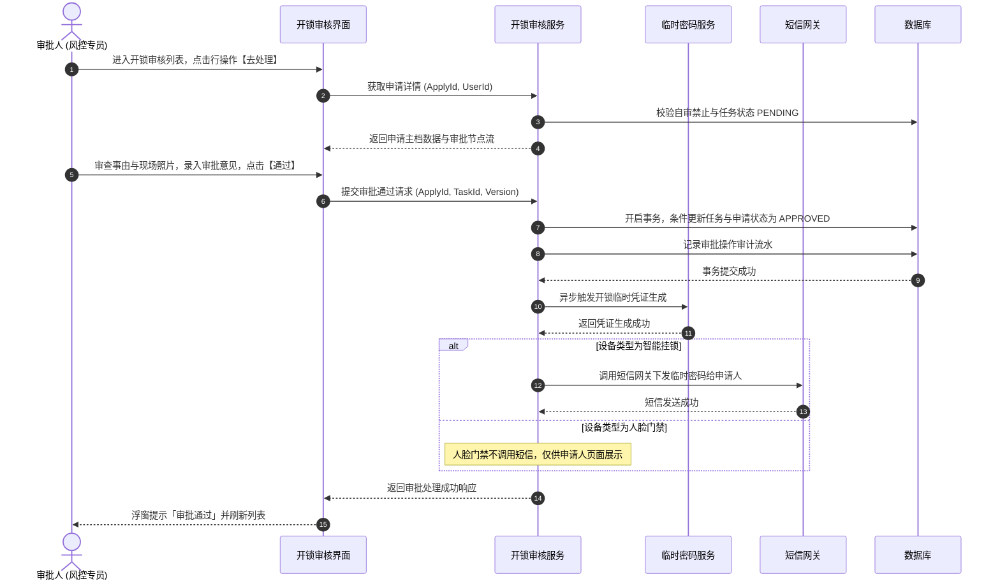

# 开锁审核业务规则规格

> **文档定位**：门禁开锁审核（05-其他审批/03-开锁审核）审批人工作台状态机模型、专网专道分流机制、自审禁止、详情密码隔离、审批通过/驳回执行及操作审计控制的唯一定义真源（SSOT）。配套文档：[开锁审核主PRD.md](./开锁审核主PRD.md)、[开锁审核字段清单.md](./开锁审核字段清单.md)。ASCII/Demo 为衍生，只引用本文件规则编号，不重复定义规则本体。  
> **模块类型**：审批人工作台（非申请单据层、非审批平台底座层）。  
> **版本**：V2.0 基准版 | 更新时间：2026-09-16 | 责任人：森云科技（Senyun Technology）

---

## 0. 统一执行模型核心约束

- **消费模型定位**：本模块为 **审批人交互层**，消费门禁设备模块已提交的开锁申请单与审批任务，**不**在审批人工作台创建申请，**不**定义开锁临时密码生成算法；
- **专网专道入口**：审批动作入口严格挂载于「工作中心 → 审批中心 → 其他审批 → 开锁审核」，**绝不接入常规待处理池**；
- **列表数据范围**：
  - **待审批视图**：申请状态处于 `PENDING` **且** 当前登录用户为配置快照展开的有效（Eligible）处理人 **且** 对应任务处于待处理；
  - **已处理视图**：当前用户曾作为处理人完成通过/驳回，或申请单已进入终态且该用户曾为历史合规处理人；
- **自审禁止底线**：申请人本人绝不可审批自己发起的开锁申请，即便其具备风控主管角色，本人单据在操作区也绝对隐藏审批动作。

---

## 一、能力与单据定位

| 项目 | 内容 |
| :--- | :--- |
| **模块层级** | 审批人交互层（专网专道独立入口） |
| **菜单/入口** | PC：工作中心 → 审批中心（首页）→ 其他审批 → **开锁审核** 卡片； H5：业务办理 → 其他审批 → **开锁审批** |
| **核心职责** | 按数据权限与自审禁止展示待办/已办申请；提供全量只读详情（临时密码严格隔离）与通过/驳回操作区 |
| **上游依赖** | 门禁设备开锁申请单据；开锁审批配置快照（指定设备一机一配、超时时间）；角色与人员主数据 |
| **下游影响** | 审批通过触发临时密码生成服务与短信下发（仅挂锁支持短信）；审批驳回更新主单状态并推送驳回原因通知 |

---

## 二、审批流状态流转矩阵

| 当前申请状态 | 触发动作 | 前置校验条件 | 结果状态 | 二次确认与交互组件 | 后置级联影响 | 失败与阻断提示 |
| :--- | :--- | :--- | :--- | :--- | :--- | :--- |
| **待审批** (`PENDING`) | 审批通过 | ① 申请处于 `PENDING`； ② 当前用户符合审批权限； ③ **非申请人本人（自审禁止）** | `APPROVED` | 审批通过模态弹窗（录入审批意见，选填） | ① 触发临时凭证算法服务生成动态密码； ② 挂锁设备自动触发短信下发（人脸设备不下发短信）； ③ 关闭其他未处理并行待办 | 浮窗提示（Toast）阻断： 「审批失败：申请状态已变更或已结案」 |
| **待审批** (`PENDING`) | 审批驳回 | ① 申请处于 `PENDING`； ② **驳回原因必填（1~200 字）**； ③ 非申请人本人 | `REJECTED` | 驳回确认模态弹窗（录入驳回原因） | ① 申请主单置为已驳回； ② 全网关闭在途任务； ③ 推送驳回短信与站内信触达申请人 | 浮窗提示（Toast）阻断： 「请录入驳回原因」 |
| **待审批** (`PENDING`) | 申请人撤回 | 申请人本人在门禁端撤回 | `CLOSED` | 门禁端发起 | 本工作台待办任务自动移出并流转为已关闭 | 界面刷新移出 |
| **待审批** (`PENDING`) | 审批超时 | 超过配置的 `timeout_hours` 时限 | `CLOSED` | 定时任务触发 | 申请单自动超时结案，任务流转为已关闭并记录超时审计 | 界面自动置灰标记 |

---

## 三、核心业务规则

### 【开锁审核列表视图与待办过滤规则】(UNLOCK-AUDIT-F01)
- 列表分为三个核心视图：
  - **待审批 (`TAB_PENDING`)**：申请状态=`PENDING` $\land$ 当前用户为有效处理人 $\land$ 任务状态=`PENDING`，默认按申请提交时间升序排列（先到先审）；
  - **已处理 (`TAB_DONE`)**：当前用户已处理过 $\lor$ 申请已结案且用户曾为合规处理人，按处理时间降序排列；
  - **全部 (`TAB_ALL`)**：当前用户管辖数据权限范围内的全部开锁申请单据；
- 列表筛选支持申请单号精确检索、设备名称/申请人模糊匹配，时间范围跨度最大支持 90 天。

### 【审批人侧详情数据只读与密码隔离规则】(UNLOCK-AUDIT-F02)
- 审批人查看开锁申请详情时，所有业务数据（单号、设备、库区、申请人、申请事由、现场照片）全量只读，严禁行内编辑；
- **凭证安全隔离规则**：审批人工作台**严禁展示临时开锁密码明文、凭证状态或短信内容**；审批通过后仅在后台触发凭证下发，临时密码仅在申请人端呈现或直接发送至申请人手机，保障物理开锁凭证链路隔离。

### 【自审禁止与操作区隐藏规则】(UNLOCK-AUDIT-F03)
- 审批人严禁审批自己发起的开锁申请；
- 当审批人打开本人发起的开锁申请单时，详情页底部操作区**严禁展示【通过】与【驳回】按钮**，仅保留【返回】与【查看详情】按钮；
- 列表待审批视图中自动过滤隐藏本人单据，防范自审自批违规。

### 【审批可见性与全员留痕规则】(UNLOCK-AUDIT-F04)
- 凡参与过该开锁申请审批流转的所有人员（包含已通过、已驳回或因他人通过而被关闭的待办处理人），均具备全生命周期查看完整审批轨迹、审批意见与最终处理人信息的权限。

### 【审批通过执行与凭证触发规则】(UNLOCK-AUDIT-F05)
- 审批人点击【通过】后，系统在数据库本地事务内原子更新任务状态为 `APPROVED`；
- 立即异步调用密码机服务生成动态临时开锁凭证，并在门禁台账中生成待核销开锁记录；
- 短信下发边界：若绑定设备为智能挂锁，调用运营商短信接口发送密码；若为智能人脸门禁，**绝对不调用短信接口**，仅在申请人前端展示。

### 【审批驳回强制必填与全链阻断规则】(UNLOCK-AUDIT-F06)
- 点击【驳回】按钮必须弹出模态确认弹窗，驳回原因单行/多行文本输入框强制必填（1~200 字符）；
- 驳回提交成功后，业务单据不可逆转，在途所有关联待办全量强制关闭。

### 【专网专道卡片入口与预览规则】(UNLOCK-AUDIT-F07)
- 审批中心首页「其他审批」区块提供独立的「开锁审核」卡片入口；
- 卡片右上角角标实时呈现当前用户待审批条数；
- 选中卡片后，下方预览区实时加载当前用户最新的最多 5 条开锁待办卡片，提供快捷【查看详情】与【去处理】入口。

### 【审批轨迹与脱敏审计规则】(UNLOCK-AUDIT-F08)
- 审批全过程记录不可变操作审计日志（操作人账号、姓名、时间戳、IP、前后状态快照、意见/驳回原因）；
- 审计日志中严禁记录临时开锁密码明文，保障司法存证合规。

---

## 四、权限与安全规范

### 【数据隔离与仓库管辖权限规则】(UNLOCK-AUDIT-P01)

| 角色代码 | 角色名称 | 待审批列表可见 | 审批通过/驳回执行 | 查看已处理记录 | 数据管辖范围 |
| :--- | :--- | :---: | :---: | :---: | :--- |
| `R-SYS-ADMIN` | 系统管理员 | ✅ | ✅（非本人发起） | ✅ | 当前所属租户全量开锁单据 |
| `R-RISK-MGR` | 风控管理人员 | ✅ | ✅（非本人发起） | ✅ | 管辖机构及下辖仓库门锁设备 |
| `R-WH-SUPER` | 仓库监管员 | ✅ | ✅（非本人发起） | ✅ | 个人授权分配管辖仓库门锁设备 |
| `R-BUSI-OPER` | 普通业务人员 | ❌ | ❌ | ❌ | 无审核权限（仅限在申请人端看本人单据） |

- **手机号脱敏保护**：详情页申请人手机号统一按前 3 后 4 格式脱敏展示（如 `138****5678`）。

---

## 五、核心操作时序图

---

## 六、修订记录

| 日期 | 版本 | 变更摘要 | 变更人 |
| :--- | :---: | :--- | :--- |
| 2026-08-28 | V1.0 | 初版开锁审核审批人工作台业务规则规格。 | 产品团队 |
| 2026-09-01 | V1.2 | 明确专网专道与审批可见性。 | 产品团队 |
| **2026-09-16** | **V2.0 规范化升级** | 1. 核心三件套真源确立：本规则规格作为基准版唯一真源； 2. 编号语义自解释：全量升级为 `【规则业务名称】(UNLOCK-AUDIT-F01~08/P01)` 格式； 3. 交互术语全面汉化：Toast/Modal 全面汉化为浮窗提示、模态弹窗； 4. 强化凭证密码隔离与挂锁/人脸短信边界规则。 | 森云科技规范化升级工作组 |
