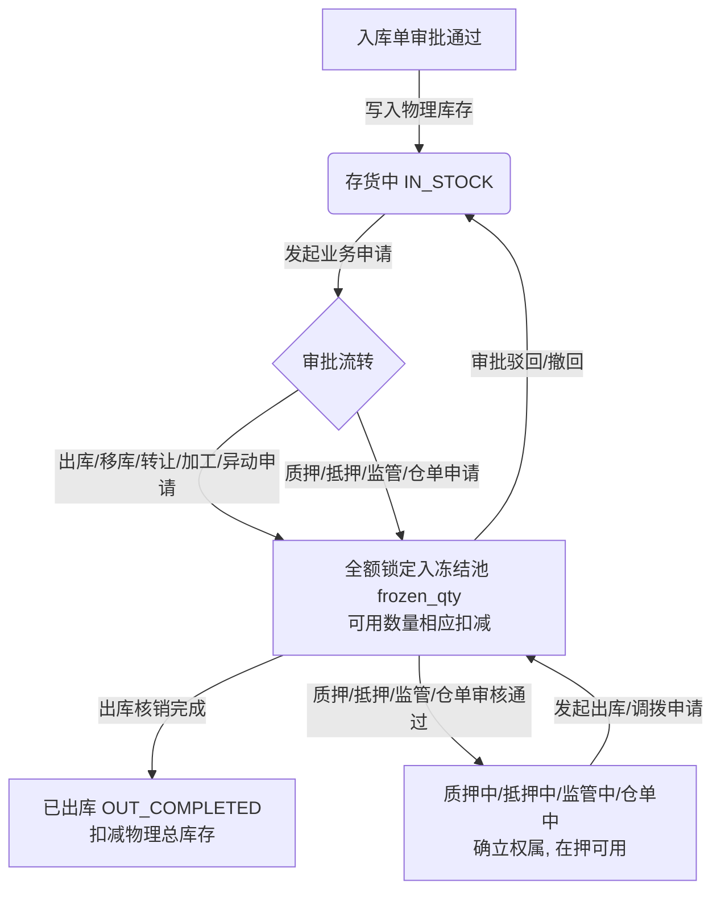

# 存货管理 业务规则规格

> **文档定位**：仓储 / 库存查询 / 存货管理模块核算恒等式、三重视图联动逻辑、状态机与冻结划分机制、业务时间统计口径、穿透锁定上下文规则、异步导出任务引擎及权限隔离的**唯一定义来源**。主 PRD、字段清单及端侧 ASCII 线框只引用本文件规则名称与编号，不重复定义规则本体。
>
> **模块类型**：业务中枢 / 实物资产监控与统计分析（多维看板、动态指标加权试算、跨模块穿透锁定及异步报表下载）
>
> **参考文档**：[《存货管理主PRD》](./存货管理主PRD.md)、[《存货管理字段清单》](./存货管理字段清单.md)、[《存货管理_ASCII_列表页》](./存货管理_ASCII_列表页.md)、[《00-功能与数据权限清单》](../../00-功能与数据权限/功能与数据权限清单.csv)
>
> **版本**：V1.2 | **更新时间**：2026-09-16 | **责任人**：森云科技（Senyun Technology）

---

## 一、单据与能力定位

| 项目 | 内容 |
| :--- | :--- |
| **单据层级** | **【第3层-台账与中枢监控层】**（仓储资产全局管控中枢 —— 存货与资产核算中枢） |
| **核心职责** | 1. 汇总监管仓库在库实物资产，支持【仓库】、【货物】、【货主】三重视图切换； 2. 维护库存守恒：`库存总数 = 可用数量 + 冻结数量`； 3. 动态识别未定价货物并点亮黄色叹号预警； 4. 支持下钻穿透至库存明细与库存流水，并自动锁定筛选上下文； 5. 支持报表异步批量生成与历史记录安全下载。 |
| **数据来源** | **底层单据全生命周期业务事件驱动**： 1. **入库驱动**：入库单审核归档后，写入实物总库存与可用数量； 2. **出库驱动**：出库申请发起时全额冻结，出场核销后扣减实物总库存与冻结数量； 3. **业务流转驱动**：质押、抵押、监管、仓单、转让、加工、异动单据在审批中计入冻结数量，审核通过后流转对应权属。 |
| **上游依赖** | **仓库档案**：实体仓库、库房、管理方、类型及地址等物理主档； **货品主档**：货品名称（大类-品类-规格）、法定单位及基准核算单价； **货主档案**：企业统一社会信用代码、个人姓名、身份证号及脱敏联系方式； **业务单据流**：入库单、出库单、移库单、质押单、抵押单、仓单、加工单、转让单。 |
| **下游影响** | **库存明细 (P-CKG-003)**：通过行操作【库存分布】携带主体参数只读锁定穿透； **库存流水 (P-CKG-004)**：通过行操作【库存流水】携带主体参数穿透查看出入库记录； **风控与监管中心**：为贷前评估、贷中跌价预警、质押率试算及合规审计提供数据基准。 |
| **业务边界** | **【只读监控与分析】**：纯只读聚合看板与异步导出，前台不提供新增、编辑或作废操作；数据由各单据审批流驱动。 |

---

## 二、数量与金额核算口径隔离表

| 口径名称 | 存在位置 | 业务含义与计算公式 | 约束与边界条件 |
| :--- | :--- | :--- | :--- |
| **库存总数** | 三重视图列表主列 | 监管库区内的实际物理存货总量： $$Q_{\text{total}} = Q_{\text{available}} + Q_{\text{frozen}}$$ | 数值 $\ge 0$，保留 4 位小数；纯数字呈现，不带单位。表头带 `?` 释义图标：`库内所有库存，包含可用库存+业务冻结库存，不包含已出库待提货的` |
| **可用数量** | 三重视图列表主列 | 未处于任何申请审批流程中、可自由调拨的存货： $$Q_{\text{available}} = Q_{\text{total}} - Q_{\text{frozen}}$$ | 数值 $\ge 0$，保留 4 位小数；不带单位。严禁出现负数（超卖/超抵） |
| **冻结数量** | 三重视图列表主列 | 处于出库、移库、质押、抵押、仓单、转让、异动、加工等流转审批中被锁定的存货数量： $$Q_{\text{frozen}} = \sum Q_{\text{applying}}$$ | 数值 $\ge 0$，保留 4 位小数；为 0 时正常显示，大于 0 时前台采用橙黄色高亮展示 |
| **单价** | 货物视图列表列 | 货品基准核算价格（万元/法定单位） | 仅在【货物】视图独立呈现；未定价商品展示占位符 `--` |
| **总价(万)** | 顶部卡片 / 列表对应列 | 基于货品单价与数量加权求和的货值估值： $$\text{总价} = \sum (\text{单价}_i \times Q_i)$$ | 满足平衡：$\text{库存总价} = \text{可用总价} + \text{冻结总价}$；无单价商品展示 `--` 且不计入总价；存在未定价货物时，顶部卡片点亮黄色感叹号 `(!)` 提示“当前存在未定价货物” |
| **本期入库总量** | 三重视图列表列 | 所选业务时间区间内已完成生效的入库单总量累计： $$Q_{\text{in}} = \sum Q_{\text{in\_approved}}$$ | 仅统计单据填写的实际业务发生时间，排除系统制单时间；仅统计终态为【已通过】的入库单 |
| **本期出库总量** | 三重视图列表列 | 所选业务时间区间内已完成出场核销的出库单总量累计： $$Q_{\text{out}} = \sum Q_{\text{out\_verified}}$$ | 仅统计单据填写的实际业务发生时间；仅统计终态为【已核销】出库单，排除审批中单据 |

---

## 三、存货状态机与冻结映射矩阵

### 3.1 状态定义与数量归属矩阵
系统基于 18 项底层状态驱动资产流向，各状态与可用/冻结池的归属划分如下：

| 状态名称 | 状态编码 | 状态类别 | 可用数量归属 | 冻结数量归属 | 计入库存总数 | 业务触发与流转说明 |
| :--- | :--- | :--- | :---: | :---: | :---: | :--- |
| **存货中** | `IN_STOCK` | 基准在库态 | ✅ 是 | ⚠️ 锁定转出 | ✅ 计入 | 货物已入库生效；日常存放为可用，发起流转申请时锁定入冻结池 |
| **质押申请中** | `PLEDGE_APPLY` | 审批流转态 | ❌ 0 | ✅ **100% 计入** | ✅ 计入 | 质押业务审批中，标的货品全额锁定为冻结 |
| **质押中** | `PLEDGING` | 质押生效态 | ✅ 在押可用 | ⚠️ 锁定转出 | ✅ 计入 | 质押合同生效；若发起质押出库申请，申请部分计入冻结数量 |
| **抵押申请中** | `MORT_APPLY` | 审批流转态 | ❌ 0 | ✅ **100% 计入** | ✅ 计入 | 抵押业务审批中，标的货品全额锁定为冻结 |
| **抵押中** | `MORTGAGING` | 抵押生效态 | ✅ 在押可用 | ⚠️ 锁定转出 | ✅ 计入 | 抵押合同生效；抵押出库申请时产生冻结数量 |
| **监管申请中** | `SUPERV_APPLY` | 审批流转态 | ❌ 0 | ✅ **100% 计入** | ✅ 计入 | 第三方委托监管审批中，全额锁定为冻结 |
| **监管中** | `SUPERVISING` | 监管生效态 | ✅ 在管可用 | ⚠️ 锁定转出 | ✅ 计入 | 监管协议生效；发起出库/调拨申请时产生冻结 |
| **移库申请中** | `TRANSFER_APPLY` | 审批流转态 | ❌ 0 | ✅ **100% 计入** | ✅ 计入 | 移库单审核中，移出方待调拨数量全额锁定为冻结 |
| **出库申请中** | `OUT_APPLY` | 审批流转态 | ❌ 0 | ✅ **100% 计入** | ✅ 计入 | 出库单审核中，申报出库数量全额锁定为冻结 |
| **仓单申请中** | `RECEIPT_APPLY` | 审批流转态 | ❌ 0 | ✅ **100% 计入** | ✅ 计入 | 签发电子仓单流转中，标的存货全额锁定为冻结 |
| **仓单中** | `RECEIPT_ACTIVE` | 仓单生效态 | ✅ 仓单可用 | ⚠️ 锁定转出 | ✅ 计入 | 电子仓单生效中；发起仓单质押或出库审批时产生冻结 |
| **平仓申请中** | `LIQ_APPLY` | 风控清收态 | ❌ 0 | ✅ **100% 计入** | ✅ 计入 | 触及平仓线风控处置流转中，全额锁定为冻结 |
| **平仓中** | `LIQUIDATING` | 风控清收态 | ✅ 清收可用 | ⚠️ 锁定转出 | ✅ 计入 | 平仓处置中；进入处置出库等流转环节产生冻结 |
| **转让申请中** | `ASSIGN_APPLY` | 审批流转态 | ❌ 0 | ✅ **100% 计入** | ✅ 计入 | 货物转让审批中，标的货物全额锁定为冻结 |
| **异动申请中** | `ANOMALY_APPLY` | 异常调整态 | ❌ 0 | ✅ **100% 计入** | ✅ 计入 | 存货损益、盘亏、破损等异动单据审批中，全额锁定为冻结 |
| **加工申请中** | `PROCESS_APPLY` | 生产加工态 | ❌ 0 | ✅ **100% 计入** | ✅ 计入 | 深加工单据申请审批中，待领料原料全额锁定为冻结 |
| **加工中** | `PROCESSING` | 生产加工态 | ✅ 在制可用 | ⚠️ 锁定转出 | ✅ 计入 | 加工单执行中；产出核销结算流转时产生冻结 |
| **已出库** | `OUT_COMPLETED` | 历史完结态 | ❌ 0 | ❌ 0 | ❌ **不计入** | 货物已出场核销完成，不再计入在库实物库存 |
| **出库待核销** | `OUT_TO_VERIFY` | 废弃废止态 | - | - | ❌ **已废除** | 历史废弃状态，系统不再产生该状态数据 |

### 3.2 资产流动与状态变迁图

---

## 四、动作能力与流转控制矩阵

| 触发动作 | 操作入口 | 适用角色 | 前置业务校验条件 | 结果状态 / 跳转目标 | 联动后置影响 | 失败阻断提示 |
| :--- | :--- | :--- | :--- | :--- | :--- | :--- |
| **切换视图** | 顶部标签页（仓库/货物/货主） | 具备查看权限角色 | 无 | 切换激活视图 | 重置除业务时间外的筛选项；重新拉取对应维度的统计指标与列表数据 | - |
| **条件查询** | 筛选区【查询】按钮 | 具备查看权限角色 | 业务时间范围合法（开始 $\le$ 结束） | 刷新当前视图列表与顶部指标 | 服务端基于数据权限与筛选条件执行实时聚合试算 | 轻提示：`开始时间不得晚于结束时间` |
| **重置筛选** | 筛选区【重置】按钮 | 具备查看权限角色 | 无 | 恢复默认筛选项 | 清空自定义输入，恢复默认时间与全量管辖仓库范围 | - |
| **穿透库存分布** | 行操作【库存分布】链接 | 具备明细查看权限 | 点击行数据处于有效存续状态 | 新标签页打开库存明细 (P-CKG-003) | 自动锁定当前行主体（仓库/货物/货主），对应输入项置灰只读 | 轻提示：`跳转失败：当前主体已无有效存货数据` |
| **穿透库存流水** | 行操作【库存流水】链接 | 具备流水查看权限 | 点击行主体存在业务流水 | 新标签页打开库存流水 (P-CKG-004) | 自动锁定当前行主体，聚焦呈现出入库单据记录 | 轻提示：`跳转失败：当前主体暂无历史出入库流水` |
| **批量导出** | 右上角【批量导出】按钮 | 具备导出权限角色 | 当前列表数据行数 $>0$ | 提交后台异步导出任务 | 后台生成 Excel 文件，并在【导出记录】中生成任务流水 | 警告提示：`导出失败：当前无数据可导出` |
| **查看导出记录** | 右上角【导出记录】按钮 | 具备导出权限角色 | 无 | 居中弹出任务列表模态窗 | 实时拉取当前用户的历史导出任务清单及状态 | - |
| **下载导出文件** | 导出记录弹窗【下载】链接 | 任务创建人本人 | 任务状态为【已完成】 | 浏览器直接下载 `.xlsx` 文件 | 生成安全防盗链下载链接，留存审计日志 | 轻提示：`下载失败：文件已过期或已清理，请重新导出` |

---

## 五、业务规则明细 (R01 ~ R20)

### 5.1 数据守恒与未定价规则

* **【数量平衡恒等式】(R01)**：各视图下每行数据必须满足：`库存总数 = 可用数量 + 冻结数量`。
* **【货值平衡恒等式】(R02)**：各视图下每行数据必须满足：`库存总价 = 可用总价 + 冻结总价`。
* **【未定价商品占位】(R03)**：货品若未维护单价，单价列与对应总价列统一展示占位符 `--`，不计入总价合计，严禁以 0 元干扰均价试算。
* **【未定价感叹号预警】(R04)**：当筛选范围内存在至少 1 笔未定价存货时，顶部总价卡片右侧点亮黄色感叹号 `(!)`，鼠标悬停提示：`当前存在未定价货物`。
* **【总价表头防歧义绑定】(R05)**：列表中 3 列同名的 `总价(万)` 依次与前一列强绑定：
  - 第 1 个 `总价(万)`：对应【库存总数】；
  - 第 2 个 `总价(万)`：对应【可用数量】；
  - 第 3 个 `总价(万)`：对应【冻结数量】。

### 5.2 视图自适应与指标联动规则

* **【标签页切换隔离】(R06)**：默认激活【仓库】视图；切换标签页时，自适应调整首个筛选项、表头列及指标卡片。
* **【仓库视图指标卡片】(R07)**：展示 3 张卡片：`总价 (¥ 水印+感叹号)` $\rightarrow$ `货品种类(个)` $\rightarrow$ `仓库数量(个)`。
* **【货物视图指标卡片】(R08)**：展示 4 张卡片：`总价` $\rightarrow$ `货品种类(个)` $\rightarrow$ `仓库数量(个)` $\rightarrow$ `货主数量(位)`。
* **【货主视图指标卡片】(R09)**：展示 4 张卡片，**权属前置**：`总价` $\rightarrow$ `货主数量(位) ⭐` $\rightarrow$ `货品种类(个)` $\rightarrow$ `仓库数量(个)`。
* **【指标实时联动重算】(R10)**：调整筛选项或业务时间并点击【查询】后，顶部指标卡片同步重新拉取计算。
* **【仓库名称悬停画像】(R11)**：在仓库视图中鼠标悬停仓库名称，弹出深色气泡提示，展示 `仓库类型`、`管理方` 及 `位置`；若位置未维护，统一展示 `--`。
* **【货主二元标识与脱敏】(R12)**：企业货主标识展示统一社会信用代码；个人货主标识展示脱敏手机号；所有联系方式统一采用中间 4 位星号脱敏（如 `138****0000`）。

### 5.3 业务时间与单据准入规则

* **【业务时间核算基准】(R13)**：出入库统计严格对齐单据填写的**实际业务发生时间（`business_date`）**，严禁使用系统制单时间（`created_at`）。
* **【终态单据统计闭环】(R14)**：【本期入库总量】仅统计终态为【已通过】的入库单；【本期出库总量】仅统计终态为【已核销】的出库单；审批流转中的单据不计入。

### 5.4 穿透追溯与上下文锁定规则

* **【库存分布穿透锁定】(R15)**：点击行操作【库存分布】在新标签页打开库存明细（`P-CKG-003`）：
  - 仓库视图来源：锁定当前仓库（下拉框置灰只读），仅可切换库房与分区；
  - 货物视图来源：锁定当前货物（下拉框置灰只读）；
  - 货主视图来源：锁定当前货主（输入框置灰只读）。
* **【库存流水穿透锁定】(R16)**：点击行操作【库存流水】在新标签页打开库存流水（`P-CKG-004`），按触发来源分别锁定对应仓库、货物或货主主体。

### 5.5 异步导出与系统权限规则

* **【批量导出异步任务】(R17)**：点击【批量导出】，读取当前视图与筛选条件提交后台任务，文件命名为：`库存统计-{视图维度}-{YYYYMMDDHHmmss}.xlsx`。
* **【导出记录历史弹窗】(R18)**：点击【导出记录】，居中弹出模态窗展示任务列表（序号、文件名、操作人、时间、状态、操作）；已完成任务支持安全下载。
* **【角色权限控制】(R19)**：严格按角色控制查看、穿透、导出及历史记录下载权限。
* **【租户与仓库数据隔离】(R20)**：数据严格按登录人员所属机构及被授权监管仓库隔离，严禁越权查看未授权数据。

---

## 六、异常与边界处理 (C01 ~ C05)

| 异常规则 | 异常场景 | 系统判定与控制动作 | 前端反馈与提示 |
| :--- | :--- | :--- | :--- |
| **【业务时间起止倒置】(C01)** | 业务时间选择有误 | 用户在选择器中选择 `开始日期 > 结束日期` | 失去焦点时自动将结束日期修正为开始日期，轻提示：`开始时间不得晚于结束时间` |
| **【检索结果为空】(C02)** | 无匹配存货 | 当前筛选条件下无符合记录的存货分布 | 列表展示标准空态插画，文案提示：`暂无存货数据`，保留筛选区与分页器 |
| **【穿透明细无数据】(C03)** | 下钻主体无记录 | 点击某行【库存分布/流水】后，目标主体无活跃记录 | 目标页面展示空态，提示：`当前主体暂无对应的库存明细/流水记录` |
| **【导出任务排队超时】(C04)** | 任务处理超时 | 任务处于【处理中】超过 5 分钟 | 弹窗内状态显示【超时可重试】，操作列提供【重新生成】按钮 |
| **【高频重复点击】(C05)** | 连续快速点击查询 | 1 秒内连续点击【查询】按钮 | 前端防抖拦截，按钮置入加载中（Loading）状态，防止重复请求 |

---

## 七、修订记录

| 日期 | 版本 | 变更内容说明 | 影响范围 | 修订人 |
| :--- | :--- | :--- | :--- | :--- |
| 2026-09-07 | V1.0 | 建立基准版业务规则规格。 | 全模块 | AI PM / 森云科技 |
| 2026-09-08 | V1.1 | 补齐操作级前置校验与失败阻断规格。 | 规则完整度 | AI PM / 森云科技 |
| 2026-09-16 | **V1.2** | **全量实施规范化重构**： 1. 规则与异常编号重构为【规则名称】(编号)语义自解释模式； 2. 全面替换 Tab、Hover、Tooltip、Toast 等英文为规范中文； 3. 精炼业务定位与核心职责，消除冗余长难句。 | 业务规则全章节与引用 | AI PM / 森云科技 |

