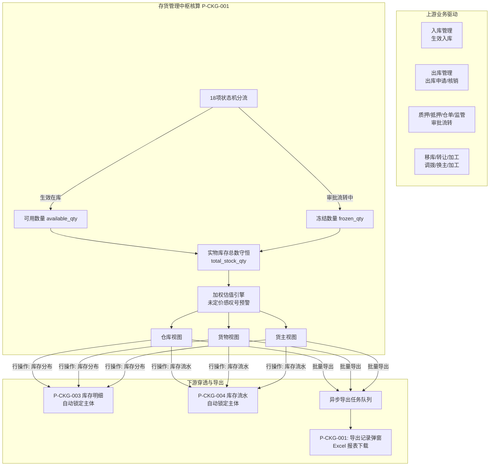

# 存货管理主PRD

> **模块定位**：仓储资产实时监控与核算中枢，汇总全平台物理库存、可用数量与冻结资产。提供“仓库-货物-货主”三重视图，把控可用与审批冻结库存平衡，联动下钻至库存明细与流水，打通实物与风控数据闭环。  
> **版本**：V1.2 | **更新时间**：2026-09-16 | **责任人**：森云科技（Senyun Technology）  
> **编写依据**：[存货管理字段清单.md](./存货管理字段清单.md) 是所有字段定义、枚举与页面展示的唯一基准；[存货管理业务规则规格.md](./存货管理业务规则规格.md) 是状态机、核算恒等式、穿透锁定机制及异步导出的唯一定义来源；[存货管理_ASCII_列表页.md](./存货管理_ASCII_列表页.md) 是界面交互与布局的基准来源。

---

## 1. 业务背景与业务痛点

### 1.1 业务背景
在存货质押与第三方监管业务中，库存在押状态高频变动（入库、质押、调拨、加工、出库等）。银行、保理商、监管企业及核心企业需要准实时、穿透式的资产看板，随时掌握全仓货值、库容饱和度、重点商品分布及融资主体在押余量。

### 1.2 核心业务痛点
1. **可用与流转混淆，易引发超卖与超质押风险**：传统系统仅体现账面物理库存。若货物处于质押或出库审批中未及时冻结，容易造成“一货两抵”或“已锁货被误出库”；
2. **多方视角割裂，协同成本高**：仓库主管关注物理库容与出入库；风控交易员关注货品规格与价格估值；客户经理与资方关注融资客户（货主）资产与履约能力。单一报表无法满足多角色协同；
3. **未定价大宗商品引发货值失真**：现货贸易中存在暂定价或待点价货品，若粗暴按 0 元或盲目估值，会导致资产总值失真；
4. **统计区间与制单时差脱节**：仓管员填单与系统录入存在时差，若按系统制单时间统计，将扭曲特定业务周期内的真实进出存；
5. **上下游分析链条割裂**：用户在宏观表发现异常后，需手动在明细表中二次输入主体信息，缺乏带入上下文的直接穿透能力。

---

## 2. 功能范围

| 包含范围 | 不包含范围 |
| :--- | :--- |
| - **三重视图切换**：支持【仓库视图】、【货物视图】、【货主视图】独立切换，自适应渲染专属表头与筛选项； - **顶部指标动态重算**：总价（含浅蓝 ¥ 水印）、货品种类数、仓库数量、货主数量，随筛选条件与业务时间动态重算； - **未定价商品预警**：未定价商品展示 `--`，顶部总价点亮黄色感叹号 `(!)` 并提示“当前存在未定价货物”； - **数量守恒与冻结划分**：执行 `库存总数 = 可用数量 + 冻结数量`，审批中单据全额锁定入冻结池并高亮展示； - **业务时间基准统计**：按填报的实际业务发生时间统计本期入库与出库总量，仅纳入终态有效单据； - **穿透追溯与上下文锁定**：   1. 行操作【库存分布】：跳转至库存明细 (P-CKG-003)，自动只读锁定对应仓库、货物或货主；   2. 行操作【库存流水】：跳转至库存流水 (P-CKG-004)，自动只读锁定对应主体； - **仓库画像悬停展示**：鼠标悬停仓库名称展示仓库类型、管理方及详细地理位置； - **货主标识与隐私脱敏**：企业货主展示社会信用代码，个人货主展示脱敏手机号，联系电话统一中间 4 位星号脱敏； - **双轨导出**：支持【批量导出】异步生成报表与【导出记录】历史弹窗安全下载。 | - **前台直接录入或修改**：本模块为纯只读分析平台，不提供新增、编辑或作废操作（数据由入库、出库等单据驱动）； - **草稿与暂存机制**：不支持草稿状态； - **负库存支持**：严禁出现可用数量或库存总数小于 0 的数据； - **跨租户越权查询**：严禁突破当前机构的数据安全边界。 |

---

## 3. 模块定位与系统链路

---

## 4. 业务场景与用户故事

| 业务场景 | 触发角色 | 核心交互与控制 | 业务价值 |
| :--- | :--- | :--- | :--- |
| **场景 1【仓管全仓巡检与饱和度核对】(S01)** | 仓库主管 / 监管员 | 进入【仓库视图】，查看各仓库物理分布。鼠标悬停查看仓库“管理方”与位置画像；核对库存总数、冻结数量与可用数量。点击【库存分布】跳转到库存明细并自动锁定该仓库，进一步核查库房垛位。 | 实时掌控仓位占用与审批占用，防止现场错发。 |
| **场景 2【交易员重点商品估值与盘点】(S02)** | 交易员 / 风控分析师 | 切换至【货物视图】，筛选目标货品。核对单价、库存总数及总价。若发现未定价商品展示 `--` 且顶部感叹号预警，及时通知物价组补录基准价。点击【库存流水】锁定该货品查看近期进出记录。 | 跟踪特定货品资产敞口，保障定价完整性。 |
| **场景 3【客户经理审查在押资产与授信】(S03)** | 客户经理 / 审核岗 | 切换至【货主视图】，输入企业名称或税号。核对该客户的名下总数、可用量、冻结量与总货值。点击【库存分布】锁定该货主，核实其资产具体存放在哪些合作仓库。 | 为贷前评估、贷中监控及解押审批提供客观数据。 |
| **场景 4【财务周期统计报表批量导出】(S04)** | 财务人员 / 审计专员 | 选定业务时间范围，点击【查询】核对当期出入库总量。点击【批量导出】在后台异步生成报表；点击【导出记录】呼出弹窗查看历史并下载 Excel 文件。 | 避免前端大文件卡死，提供合规可溯的审计快照。 |

---

## 5. 状态机与动作能力矩阵

> 存货看板为只读聚合中枢，数据由底层业务单据驱动。各视图下的前台动作矩阵如下：

| 动作名称 | 仓库视图 | 货物视图 | 货主视图 | 导出记录弹窗 | 说明与约束 |
| :--- | :---: | :---: | :---: | :---: | :--- |
| **视图切换** | ✅ 默认激活 | ✅ 支持切换 | ✅ 支持切换 | ❌ | 切换时自适应重置筛选项与表头列 |
| **多维条件查询** | ✅ (仓库/时间) | ✅ (货物/时间) | ✅ (货主/时间) | ❌ | 触发服务端聚合计算与指标卡片重算 |
| **重置筛选条件** | ✅ | ✅ | ✅ | ❌ | 清空输入项，恢复默认时间与全量管辖仓库 |
| **穿透【库存分布】** | ✅ (锁定仓库) | ✅ (锁定货物) | ✅ (锁定货主) | ❌ | 新标签页打开库存明细，只读锁定当前主体 |
| **穿透【库存流水】** | ✅ (锁定仓库) | ✅ (锁定货物) | ✅ (锁定货主) | ❌ | 新标签页打开库存流水，只读锁定当前主体 |
| **异步【批量导出】** | ✅ (生成报表) | ✅ (生成报表) | ✅ (生成报表) | ❌ | 提交后台导出任务，异步生成 `.xlsx` 报表 |
| **查看【导出记录】** | ✅ | ✅ | ✅ | ❌ | 居中呼出任务列表模态弹窗 |
| **下载报表文件** | ❌ | ❌ | ❌ | ✅ (任务成功) | 调取对象存储（OSS）安全签名链接下载 |

---

## 6. 页面交互规格索引

本模块在 PC 端包含三大标准视图与一个异步导出弹窗，高保真界面线框已在独立专页维护：

### 6.1 存货管理 — 仓库视图
- **对应文档**：[存货管理_ASCII_列表页.md §一](./存货管理_ASCII_列表页.md#一仓库视图ascii线框图tab-1)
- **核心规格**：
  - 顶部指标卡片：总价（含感叹号预警）、货品种类(个)、仓库数量(个)；
  - 筛选区：仓库名称（下拉单选）、业务时间（日期区间选择器，默认当月至今）；
  - 内容表格（11 列）：`序号`、`仓库名称`（鼠标悬停浮窗展现画像）、`库存总数`（带 `?` 释义图标）、`总价(万)`、`可用数量`、`总价(万)`、`冻结数量`（高亮警示）、`总价(万)`、`本期入库总量`、`本期出库总量`、`操作`；
  - 行操作列：【库存分布】、【库存流水】（新标签页打开并锁定当前仓库）。

### 6.2 存货管理 — 货物视图
- **对应文档**：[存货管理_ASCII_列表页.md §二](./存货管理_ASCII_列表页.md#二货物视图ascii线框图tab-2)
- **核心规格**：
  - 顶部指标卡片：扩充为 4 张卡片，增加【货主数量(位)】；
  - 筛选区：货品名称（树形级联多选）、业务时间；
  - 内容表格：`序号`、`货物名称`、`规格`、`单价(万/单位)`、`库存总数`、`总价(万)`、`可用数量`、`总价(万)`、`冻结数量`、`总价(万)`、`本期入库总量`、`本期出库总量`、`操作`；未定价货物展示 `--`；
  - 行操作列：【库存分布】、【库存流水】（新标签页打开并锁定当前货品）。

### 6.3 存货管理 — 货主视图
- **对应文档**：[存货管理_ASCII_列表页.md §三](./存货管理_ASCII_列表页.md#三货主视图ascii线框图tab-3)
- **核心规格**：
  - 顶部指标卡片：4 张卡片，【货主数量(位)】前置至第 2 位突出货权视角；
  - 筛选区：货主名称/标识（综合文本框，支持企业全称、代码、个人姓名或手机模糊输入）、业务时间；
  - 内容表格：`序号`、`货主`、`货主标识`（企业信用代码/个人脱敏手机号）、`联系方式`（脱敏）、`库存总数`、`总价(万)`、`可用数量`、`总价(万)`、`冻结数量`、`总价(万)`、`本期入库总量`、`本期出库总量`、`操作`；
  - 行操作列：【库存分布】、【库存流水】（新标签页打开并锁定当前货主）。

### 6.4 导出记录 — 异步任务弹窗
- **对应文档**：[存货管理_ASCII_列表页.md §四](./存货管理_ASCII_列表页.md#四导出记录弹窗ascii线框图modal)
- **核心规格**：
  - 居中模态弹窗：标题 `导出记录`，右上角带 `[X]` 关闭；
  - 内容表格：`序号`、`文件名`（格式：`库存统计-{视图维度}-{时间戳}.xlsx`）、`操作人`、`时间`、`状态`（成功/处理中/失败）、`操作`；
  - 成功行操作提供【下载】链接，直接拉取文件下载；支持分页 10 条/页。

---

## 7. 核心业务规则索引

| 规则名称与编号 | 核心逻辑摘要 | 唯一定义章节 |
| :--- | :--- | :--- |
| **【数量平衡恒等式】(R01)** | 各视图每行满足：`库存总数 = 可用数量 + 冻结数量` | [业务规则规格 §5.1](./存货管理业务规则规格.md#51-数据守恒与未定价规则) |
| **【货值平衡恒等式】(R02)** | 各视图每行满足：`库存总价 = 可用总价 + 冻结总价` | [业务规则规格 §5.1](./存货管理业务规则规格.md#51-数据守恒与未定价规则) |
| **【未定价商品占位】(R03)** | 未维护单价时单价与总价展示 `--`，不计入总价，严禁以 0 元干扰均价 | [业务规则规格 §5.1](./存货管理业务规则规格.md#51-数据守恒与未定价规则) |
| **【未定价感叹号预警】(R04)** | 存在 $\ge 1$ 笔未定价存货时，顶部卡片点亮黄色感叹号 `(!)` 悬停预警 | [业务规则规格 §5.1](./存货管理业务规则规格.md#51-数据守恒与未定价规则) |
| **【总价表头防歧义绑定】(R05)** | 列表中 3 列同名的 `总价(万)` 依次与库存总数、可用数量、冻结数量绑定 | [业务规则规格 §5.1](./存货管理业务规则规格.md#51-数据守恒与未定价规则) |
| **【视图自适应与布局】(R06~R09)** | 默认仓库视图；切换自适应刷新卡片与表头；货主视图权属卡片前置 | [业务规则规格 §5.2](./存货管理业务规则规格.md#52-视图自适应与指标联动规则) |
| **【指标实时联动重算】(R10)** | 筛选条件变更点击【查询】后，顶部指标卡片同步重新拉取计算 | [业务规则规格 §5.2](./存货管理业务规则规格.md#52-视图自适应与指标联动规则) |
| **【仓库名称悬停画像】(R11)** | 鼠标悬停仓库名称弹出浮窗，展现仓库类型、管理方与位置（未维护展示 `--`） | [业务规则规格 §5.2](./存货管理业务规则规格.md#52-视图自适应与指标联动规则) |
| **【货主二元标识与脱敏】(R12)** | 企业展示信用代码，个人展示脱敏手机号，手机号统一脱敏中间 4 位 | [业务规则规格 §5.2](./存货管理业务规则规格.md#52-视图自适应与指标联动规则) |
| **【业务时间与终态统计闭环】(R13~R14)** | 对齐单据实际业务时间（排除制单时间）；入库仅计已通过，出库仅计已核销 | [业务规则规格 §5.3](./存货管理业务规则规格.md#53-业务时间与单据准入规则) |
| **【穿透追溯与上下文锁定】(R15~R16)** | 点击【库存分布】或【库存流水】跳转对应模块，并只读锁定触发主体参数 | [业务规则规格 §5.4](./存货管理业务规则规格.md#54-穿透追溯与上下文锁定规则) |
| **【异步导出与历史弹窗】(R17~R18)** | 批量导出投递后台生成 `.xlsx` 文件，在【导出记录】弹窗中提供安全下载 | [业务规则规格 §5.5](./存货管理业务规则规格.md#55-异步导出与系统权限规则) |
| **【权限控制与数据隔离】(R19~R20)** | 严格按管辖仓库隔离数据，严禁越权返回未经授权仓库的存货与货值 | [业务规则规格 §5.5](./存货管理业务规则规格.md#55-异步导出与系统权限规则) |

---

## 8. 非功能性需求

### 8.1 性能要求
- **查询响应时间**：常规三重视图切换及查询响应时间 $\le 1.0\text{s}$；
- **异步报表生成吞吐**：大体量报表异步生成耗时 $\le 30\text{s}$，导出任务队列支持并发削峰；
- **穿透参数锁定无白屏**：跳转至明细或流水页时，携带参数即时渲染，页面无二次闪烁。

### 8.2 安全性与合规性
- **金融级数据脱敏**：货主联系电话强制脱敏（如 `138****0000`），身份证号严禁明文呈现；
- **下载链接安全**：导出文件保存在对象存储（OSS），下载提供 10 分钟临时安全有效签名，防止暴力遍历；
- **审计追溯与留痕**：用户导出报表、查看详情等行为记录操作人、IP、时间戳及查询条件，日志保留 5 年以上。

---

## 修订记录

| 日期 | 版本 | 变更内容说明 | 影响范围 | 修订人 |
| :--- | :--- | :--- | :--- | :--- |
| 2026-09-07 | V1.0 | 建立基准版存货管理主 PRD。 | 全模块 | AI PM / 森云科技 |
| 2026-09-08 | V1.1 | 对齐标杆主 PRD 章节架构，细化交互规格索引与规则矩阵。 | 主 PRD 结构完整性 | AI PM / 森云科技 |
| 2026-09-16 | **V1.2** | **全量实施规范化重构**： 1. 业务场景改造为场景 1【业务名称】(编号)直观格式； 2. 规则索引全面升级为【规则名称】(编号)； 3. 替换 Tab、Hover、Tooltip、Scope、Modal 等非必要英文为规范中文； 4. 精炼背景、痛点与功能范围，去除冗余大词。 | 全文档章节与体验 | AI PM / 森云科技 |

