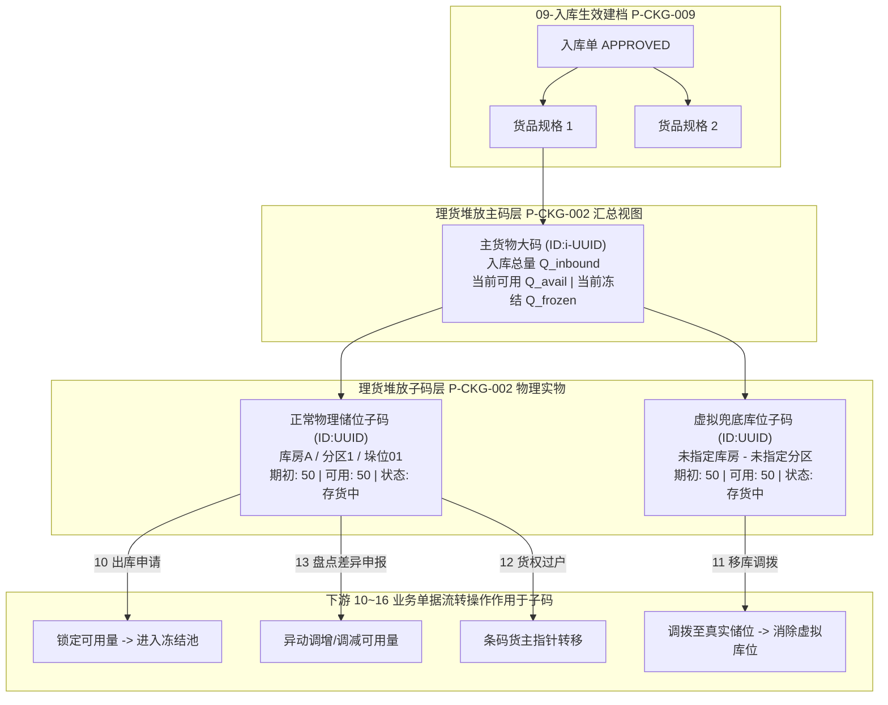
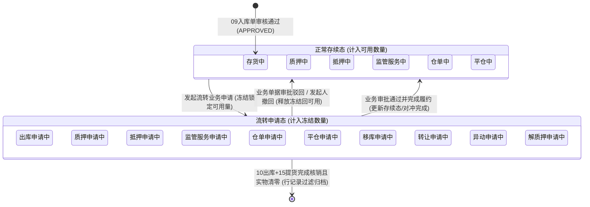

# 理货堆放业务规则规格

> **文档定位**：仓储 / 库存查询 / 理货堆放模块（`P-CKG-002`）状态机、主子码架构、数量核算口径、核算恒等式、虚拟库位兜底、跨模块协同联动及数据权限隔离的**唯一定义真源**。主 PRD、字段清单及端侧原型只引用本文件规则编号（R01~R16、C01~C04），不重复定义规则本体。
>
> **模块类型**：仓储资产物理空间堆放与库位核算台账（【第1层-数据核算与物理台账层】），向上汇总并精细化承接【第2层-订单/执行控制层】（09入库、10出库、11移库、12转让、13异动、14加工、15提货单、16盘点）的业务执行。
>
> **参考协同文档**：
> - 字段字典：[《理货堆放字段清单》](./理货堆放字段清单.md)（`P-CKG-002`）
> - 主需求规格：[《理货堆放主PRD》](./理货堆放主PRD.md)（`P-CKG-002`）
> - 存货中枢：[《存货管理业务规则规格》](../01-库存查询-存货管理/存货管理业务规则规格.md)（`P-CKG-001`）
> - 入库管理：[《入库记录业务规则规格》](../09-入库管理-入库记录/入库记录业务规则规格.md)（`P-CKG-009`）
> - 出库管理：[《出库记录业务规则规格》](../10-出库管理-出库记录/出库记录业务规则规格.md)（`P-CKG-010`）
> - 移库管理：[《移库记录业务规则规格》](../11-移库管理-移库记录/移库记录业务规则规格.md)（`P-CKG-011`）
> - 货物转让：[《转让记录业务规则规格》](../12-货物转让-转让记录/转让记录业务规则规格.md)（`P-CKG-012`）
> - 货物异动：[《货物异动_异动记录业务规则规格》](../13-货物异动-异动记录/货物异动_异动记录业务规则规格.md)（`P-CKG-013`）
> - 加工管理：[《加工管理业务规则规格》](../14-加工管理-加工记录/加工管理业务规则规格.md)（`P-CKG-014`）
> - 提货单：[《提货单业务规则规格》](../15-提货单/提货单业务规则规格.md)（`P-CKG-015`）
> - 货物盘点：[《货物盘点业务规则规格》](../16-货物盘点/货物盘点业务规则规格.md)（`P-CKG-016`）
>
> **版本**：V1.2 | **更新时间**：2026-09-22 | **责任人**：森云科技（Senyun Technology）

---

## 一、单据与能力定位

| 项目 | 内容说明 |
| :--- | :--- |
| **单据层级** | **【第1层-数据核算与物理台账层】**（理货堆放中枢台账 —— `P-CKG-002`） |
| **核心职责** | 记录入库货物的实际物理堆放仓位、分配明细、流转状态跟踪，建立“主码-子码”层级结构，实现实物库存全生命周期动态核算与主子二维码防伪追溯。 |
| **单据来源 (上游)** | **唯一正式源头**：由 [09-入库记录](../09-入库管理-入库记录/) 审核全节点通过（`APPROVED`）后原子写入本台账；包含普通入库、监管服务入库、抵押加工产出入库、质押入库等。 |
| **业务承接 (下游)** | **10 出库记录 / 15 提货单**：选货扣减特定子码库存，提货完成实物核销； **11 移库记录**：同一仓库内储位调拨，特别是将虚拟兜底库位调拨至真实物理储位； **12 货物转让**：自有存货货权转让，存货条码所有权人原子变更； **13 货物异动**：盘盈/盘亏/损耗现场申报，直接调增/核减特定库位可用存量； **14 加工管理**：原料库存锁定领用消耗，产成品二次入库建码； **16 货物盘点**：以本模块物理库位与条码为基准实施现场盘点巡检。 |
| **台账归档边界** | **【仅展示已生效在库实物】**：数据源自生效入库，默认仅呈现当前在库总量 $>0$ 的有效存货；完全出库且无流转占用的库位自动过滤隐藏。 |
| **入口分流** | PC 端导航路径：`仓储管理 → 库存查询 → 理货堆放`。 |

---

## 二、数量核算口径隔离表

> 本节严格对齐 [09-入库记录](../09-入库管理-入库记录/)、[10-出库记录](../10-出库管理-出库记录/) 与 [13-货物异动](../13-货物异动-异动记录/) 数量核算标准。

| 口径名称 | 存在位置 | 业务含义与计算公式 | 约束与边界条件 |
| :--- | :--- | :--- | :--- |
| **入库数量 (主码)** | 列表页【入库数量】列 | 入库单审批通过时固化的单项货品计量总数 $Q_{\text{inbound}}$ | 正数值；4 位小数；**终身不可篡改历史快照**；等于下属所有物理子码期初堆放数量之和 |
| **期初堆放数量 (子码)** | 详情页存货信息表格列 | 入库单初次分配至该特定垛位时填写的原始实物数量 $Q_{\text{init}}$ | 正数值；4 位小数；严格大于 0；**终身不可篡改历史快照**；出库、移库、转让与异动均严禁修改此值 |
| **可用数量 (子码)** | 详情页存货信息表格列 | 当前在该物理库位上处于非冻结状态的可用实物量 $Q_{\text{avail},j}$ | 正数值；4 位小数；$\ge 0$；随业务流转扣减/恢复；为 0 但冻结 $>0$ 时行不消失且沉底 |
| **冻结数量 (子码)** | 详情页存货信息表格列 | 当前在该物理库位上因业务审批流转锁定的数量 $Q_{\text{frozen},j}$ | 正数值；4 位小数；$\ge 0$；在 10出库、11移库、12转让、13异动、质押等审批中产生 |
| **在库实物总量 (子码)** | 系统底层实时计算 | 某一库位当前的真实物理在库数量：$$Q_{\text{stock},j} = Q_{\text{avail},j} + Q_{\text{frozen},j}$$ | 守恒关系；当 $Q_{\text{stock},j} = 0$（可用与冻结双清零）时，该子码行在详情页自动过滤隐藏 |
| **可用数量 (主码)** | 列表页【可用数量】列 | 该货品在全仓范围内各物理库位可用数量代数累加和：$$Q_{\text{avail},\text{主}} = \sum Q_{\text{avail},j}$$ | 实时聚合；支持 10出库、11移库、12转让等下游业务选货校验基准 |
| **冻结数量 (主码)** | 列表页【冻结数量】列 | 该货品在全仓范围内各物理库位冻结数量代数累加和：$$Q_{\text{frozen},\text{主}} = \sum Q_{\text{frozen},j}$$ | 实时聚合；反映该货品处于流转中的全部受控锁定存量 |

---

## 三、单据状态机与流转定义

### 3.1 主码与子码联动架构模型

### 3.2 存货状态机双态划分与流转矩阵

理货堆放子码层严格划分为：**正常存续态（计入可用数量）** 与 **流转申请态（计入冻结数量）**。

### 3.3 跨业务单据状态流转规则

| 触发前状态 | 关联单据与操作 | 触发后状态 | 可用数量变动 | 冻结数量变动 | 关联单据编号 | 规则说明 |
| :--- | :--- | :--- | :---: | :---: | :---: | :--- |
| **入库建档** | 09-入库记录审核通过 | `存货中` | $+Q_{\text{期初}}$ | 0 | `P-CKG-009` | 初始建档，按期初分配数量全额计入可用数量 |
| `存货中` | 10-出库管理发起出库申请 | `出库申请中` | $-Q_{\text{申}}$ | $+Q_{\text{申}}$ | `P-CKG-010` | 锁定拟出库数量，防止超卖与重复流转 |
| `出库申请中` | 15-提货单核销提货完成 | `存货中` / 消失 | 0 | $-Q_{\text{申}}$ | `P-CKG-015` | 实物消账；若子码在库总量归零则详情行自动过滤隐藏 |
| `出库申请中` | 10-出库单驳回或撤销 | `存货中` | $+Q_{\text{申}}$ | $-Q_{\text{申}}$ | `P-CKG-010` | 释放冻结数量，全额恢复原库位可用 |
| `存货中` | 11-移库管理发起移库申请 | `移库申请中` | $-Q_{\text{申}}$ | $+Q_{\text{申}}$ | `P-CKG-011` | 锁定原储位存货，禁止并发其他业务 |
| `移库申请中` | 11-移库单审核通过生效 | `存货中` | 0 | $-Q_{\text{申}}$ | `P-CKG-011` | 原储位扣减，目标储位增加，条码储位信息同步更新 |
| `存货中` | 12-货物转让发起转让申请 | `转让申请中` | $-Q_{\text{申}}$ | $+Q_{\text{申}}$ | `P-CKG-012` | 仅限普通存货；锁定原货主存货 |
| `转让申请中` | 12-转让单审核通过生效 | `存货中` | 0 | $-Q_{\text{申}}$ | `P-CKG-012` | 跨模块对冲；存货条码所有权人原子变更为受让人 |
| `存货中` | 13-货物异动发起差异申报 | `异动申请中` | $-Q_{\text{申}}$ | $+Q_{\text{申}}$ | `P-CKG-013` | 锁定申报差异的存货基数 |
| `异动申请中` | 13-异动单审核通过生效 | `存货中` | $\pm \Delta Q$ | $-Q_{\text{申}}$ | `P-CKG-013` | 盘盈调增可用，盘亏调减可用；**期初堆放数量保持不变** |
| `存货中` | 14-加工管理发起投入申请 | `加工申请中` | $-Q_{\text{申}}$ | $+Q_{\text{申}}$ | `P-CKG-014` | 锁定原料库存 |
| `加工申请中` | 14-完成加工并办理入库 | 终态 / 新建档 | 0 | $-Q_{\text{申}}$ | `P-CKG-014` | 原料扣减实际消耗并释放余量；产成品生成新理货主子码 |
| `存货中` | 抵质押业务发起质押申请 | `质押申请中` | $-Q_{\text{申}}$ | $+Q_{\text{申}}$ | 融资监管域 | 锁定拟质押标的存货 |
| `质押申请中` | 质押审批通过放款生效 | `质押中` | $+Q_{\text{申}}$ | $-Q_{\text{申}}$ | 融资监管域 | 冻结释放转为在押受控可用 |
| `质押中` | 抵质押业务发起解押申请 | `解质押申请中` | $-Q_{\text{申}}$ | $+Q_{\text{申}}$ | 融资监管域 | 锁定拟解押标的存货 |
| `解质押申请中`| 解押审批通过 | `存货中` | $+Q_{\text{申}}$ | $-Q_{\text{申}}$ | 融资监管域 | 恢复普通存货自由流转态 |

---

## 四、核心动作与能力矩阵

| 动作名称 | 列表页主码层 | 详情页基础信息 | 详情页存货信息表格 | 主二维码弹窗 | 子二维码弹窗 | 约束与说明 |
| :--- | :---: | :---: | :---: | :---: | :---: | :--- |
| **多维组合查询** | ✅ (单按钮触发) | ❌ | ❌ | ❌ | ❌ | 点击【查询】触发服务端联合检索，重置为第 1 页 |
| **仅查看有库存过滤** | ✅ (默认勾选) | ❌ | ❌ | ❌ | ❌ | 勾选时过滤 `available_qty + frozen_qty > 0` |
| **列升降排序** | ✅ (入库/可用/冻结) | ❌ | ❌ | ❌ | ❌ | 点击表头箭头切换升序、降序或默认入库时间倒序 |
| **下钻【详情】** | ✅ (行操作) | ❌ | ❌ | ❌ | ❌ | 跳转至理货堆放详情页 |
| **点击【返回】** | ❌ | ✅ (右上角) | ❌ | ❌ | ❌ | 返回列表页并保留之前的筛选条件与分页状态 |
| **穿透查看关联单号** | ❌ | ✅ (橙色链接) | ❌ | ❌ | ❌ | 新标签页打开入库记录或入库类型关联业务单据 |
| **查看附件大图/PDF** | ❌ | ✅ (缩略图/文件) | ❌ | ❌ | ❌ | 点击现场照片/设备抓拍图弹窗放大；点击文件在线预览或下载 |
| **点击【存货条码】** | ✅ (弹出主二维码) | ❌ | ✅ (弹出子二维码) | ❌ | ❌ | 列表弹出主二维码（含Tab）；详情表格弹出子二维码（含主码回溯） |
| **前台操作列** | ❌ | ❌ | ➖ (固定展示 `--`) | ❌ | ❌ | 当前版本为只读占位，不提供移库、调整等前台操作 |

---

## 五、详细业务规则 (Business Rules)

### 5.1 数据模型与台账颗粒度

#### 【列表颗粒度为入库单货品项】(R01)
* 理货堆放列表每条数据记录的物理主键为 **【入库单号 + 货品 ID】（主码）**；
* 一张入库单若包含 $K$ 种不同规格货品，列表中展示为 $K$ 条独立数据记录，不进行单据级别的折叠。

#### 【多库房与多分区聚合展示】(R02)
* 当单一主货品被分散堆放在多个物理库房时，列表页【库房】列以逗号拼接全部库房名称（如 `低温冷冻,水果库房2`）；
* 分区列以逗号拼接展示（如 `分区冷冻,分区冷冻2`）；超过展示区域自动省略截断，支持鼠标悬停 Tooltip 完整查看。

---

### 5.2 虚拟库位与未分配兜底机制

#### 【未指定库房与未指定分区虚拟兜底】(R03)
为了防止仓管在入库时未精确分配库位导致实物漏记，系统提供两级虚拟兜底机制：
1. **多库房未分配（未指定库房）**：
   * 入库填单时，若单据选定了一个仓库及多个库房，但部分货品未分配具体库房，系统默认分配至【`未指定库房 - 未指定分区`】；
2. **单库房未分配（未指定分区）**：
   * 入库填单时，若单据仅指定了单一库房，但货品未选择具体分区，系统默认分配至【`X库房 - 未指定分区`】；
3. **虚拟库位协同与移库纠偏闭环**：
   * 虚拟库位作为一条正常子码存在，期初堆放数量即为未分配量，状态为 `存货中`；
   * 仓管后续可在 **[11-移库管理](../11-移库管理-移库记录/)** 中，选择该虚拟库位存货，调拨至正规的物理库房与具体货架，系统原子更新储位属性，实现虚拟库位向真实储位的纠偏闭环。

---

### 5.3 详情页存货行动态过滤与排序规则

#### 【可用为零不消失且沉底排序】(R04)
* 在详情页【存货信息】表格中，当某库位的可用数量消耗至 0，但其冻结数量仍 $> 0$（存在流转中的 10出库、11移库、质押等单据）时，**该行数据不得消失**；
* **沉底排序**：系统自动将所有可用数量为 0 的库位行降序排列在表格末尾。

#### 【完全出库清零行过滤消失】(R05)
* 当某库位的 **`可用数量 == 0` 且 `冻结数量 == 0`**（实物已完全提货出库核销）时，**系统在前台自动过滤隐藏该行数据**；
* 数据库保留完整子码与历史出入库流水，供 04库存流水与审计追踪。

---

### 5.4 筛选与查询规则

#### 【仅查看有库存的默认过滤】(R06)
* 筛选区【仅查看有库存的】复选框**默认处于勾选状态**；
* **勾选时过滤逻辑**：服务端强制附加过滤条件：`available_qty + frozen_qty > 0`（即在库实物总量大于 0）；
* **取消勾选时**：查询全量历史理货记录，包含历史已完全出库结案的主货物数据。

#### 【单按钮检索与无重置规范】(R07)
* 遵循最新线上界面基准，筛选区仅提供【查询】按钮，点击后立即组装条件发起检索并重置分页为第 1 页；
* 不设独立【重置】按钮，用户通过手动清空输入项或刷新页面还原默认条件。

---

### 5.5 主子二维码双轨防伪体系

#### 【二维码不可变生成与格式】(R08)
* 09入库单审核通过时，系统同步生成主码与各子码：
  * **主二维码唯一标识**：`ID:i-{32位小写UUID}`（前缀 `i-` 代表入库主货物）；
  * **子二维码唯一标识**：`ID:{32位小写UUID}`（物理垛位追溯码）；
* 二维码内容包含：存货唯一编码、防伪数字签名、货主哈希、货品规格与入库批次。

#### 【列表页【主二维码信息】弹窗交互】(R09)
* 用户在列表页点击【存货条码】图标，弹出【主二维码信息】弹窗；
* **上部结构**：展示品类大标题、规格副标题、货主全称/脱敏手机号、入库日期、入库单号、仓库名称、主二维码矢量图、主二维码唯一编码（`ID:i-...`）及生成时间；
* **下部结构（子码Tab联动）**：
  * 提供 `位置1`、`位置2` ... 选项卡（Tabs）；
  * 点击对应位置 Tab，卡片即时展示该位置的库位路径、当前存货状态、期初/可用/冻结数量三列指标栏、子二维码矢量图、子码唯一编码（`ID:...`）及生成时间。

#### 【详情页【子二维码信息】弹窗交互】(R10)
* 用户在详情页存货明细点击任一库位行的【存货条码】图标，弹出【子二维码信息】弹窗；
* **上部结构（当前子码）**：展示当前库位的品类规格、当前业务状态、三列数量指标、库房分区路径、子二维码矢量图、子码唯一编码及生成时间；
* **下部结构（主货物回溯卡片）**：展示【入库主货物信息】灰底卡片，反向穿透展示所属货主、入库日期、入库单号、主货物仓位以及上级主二维码图形与主码 ID。

---

### 5.6 权限隔离与安全合规

#### 【货主隐私脱敏标准】(R11)
* **企业货主**：展示公司法定全称 + 18 位统一社会信用代码；
* **个人货主**：展示真实姓名 + 中间 4 位星号脱敏手机号（如 `188****2345`、`133****0003`），严禁明文暴露。

#### 【仓库数据权限物理隔离】(R12)
* 严格遵循 RBAC 组织架构与仓库数据权限模型；
* 用户仅可见已授权管辖仓库的理货堆放数据，未授权仓库数据在底层 SQL 查询时强制剔除。

#### 【单据穿透跳转与详情只读占位】(R13)
* 详情页中：
  * 点击 `入库单号` 后的【查看】：新标签页跳转至 [09-入库记录](../09-入库管理-入库记录/) 对应单据详情；
  * 点击 `入库类型` 后的 `关联单号 XXXXXXXXX 【查看】`：根据类型新标签页打开对应监管协议、质押申请单或加工单；
* 存货信息表格中最后一列【操作】固定展示灰度占位横杠 `--`，当前版本为纯只读台账，不在此页面直接提供编辑、移库或核销前台操作。

---

## 六、 核心核算算法与恒等式 (Calculation Constraints)

### 【核算恒等式一：单库位子码实物守恒】(C01)
对任一物理库位子码 $j$，在全生命周期内任何时点均严格满足：
$$\text{期初堆放数量}_j = \text{当前可用数量}_j + \text{当前冻结数量}_j + \sum \text{累计已核销出库数量}_j \pm \sum \Delta Q_{\text{已生效异动}}$$
* **在库实物总量**：$\text{在库实物总量}_j = \text{当前可用数量}_j + \text{当前冻结数量}_j$；
* 当 $\text{在库实物总量}_j = 0$ 时，该库位实物全部离库结案。

### 【核算恒等式二：期初堆放数量终身不可变快照】(C02)
* 严格遵循 `13-货物异动` 与 `09-入库记录` 基准规范：**【期初堆放数量】由入库单初次分配至该垛位时填写的实物数量固化生成，终身不可变快照**；
* 后续的出库、移库、转让、异动调账，均仅作用于【可用数量】与【冻结数量】，**严禁反向修改历史期初堆放数量**。

### 【核算恒等式三：主码与子码聚合恒等式】(C03)
主货物大码的各项汇总数量，严格等于其归属的所有有效子码代数和：
$$\text{入库数量}_{\text{主}} = \sum_{j=1}^{n} \text{期初堆放数量}_j$$
$$\text{可用数量}_{\text{主}} = \sum_{j=1}^{n} \text{当前可用数量}_j$$
$$\text{冻结数量}_{\text{主}} = \sum_{j=1}^{n} \text{当前冻结数量}_j$$

### 【非负约束与并发超卖阻断】(C04)
* 任何层级的可用、冻结与期初数量**严禁为负数**（$\text{Qty} \ge 0$）；
* 任何下游单据（10出库、11移库、12转让、13异动等）发起锁定时，申请数量不得超过当前子码实时可用数量（$Q_{\text{申}} \le \text{可用数量}_j$），否则服务端数据库行锁事务强行阻断。

---

## 七、 异常与边界处理 (Exception & Edge Cases)

| 异常编号 | 异常场景 | 系统判定与处理机制 | 前端表现与提示 |
| :---: | :--- | :--- | :--- |
| **E01** | 穿透关联单据已被作废或删除 | 用户点击入库单号或关联单号后的【查看】时，目标单据不存在或已被归档作废 | 弹出居中轻量 Toast 提示：「关联单据不存在或已作废」，不发生白屏错误 |
| **E02** | 跨仓库越权访问 | 用户通过篡改 URL 参数或直接请求未授权仓库的理货堆放详情 | 服务端接口拦截并返回 HTTP 403，页面渲染统一 403 无权访问占位组件 |
| **E03** | 附件/图片 OSS 签名过期 | 页面加载现场照片或补充资料 PDF 时，OSS 临时安全签名失效 | 自动发起异步静默刷新签名请求；若文件已删除，展示「资源加载失败」占位图 |
| **E04** | 虚拟库位存货全额移库纠偏 | 仓管在 11 移库模块将虚拟库位的货物全额移库至真实物理库房 | 虚拟库位子码的可用与冻结均归 0，触发 R05 规则，虚拟库位行自动在详情页过滤消失 |
| **E05** | 盘点锁定期间尝试并发调拨 | 16 货物盘点正在对该库位存货执行盘点锁定，此时尝试发起移库或出库 | 接口检测到存货处于盘点业务锁状态，拦截并提示：「该货物正在盘点中，暂无法发起流转业务」 |
| **E06** | 二维码生成异常容错 | 09 入库审核通过时若二维码生成服务超时 | 系统记录失败日志并进入异步重试队列；前台若未就绪，条码区域展示骨架屏加载态 |

---

## 八、 修订记录

| 日期 | 版本 | 变更内容说明 | 影响范围 | 修订人 |
| :--- | :--- | :--- | :--- | :--- |
| 2026-09-22 | V1.0 | 建立理货堆放最新基准版业务规则规格初始稿 | 全模块 | AI PM / 森云科技 |
| 2026-09-22 | V1.1 | 深度对接 09-入库至 16-货物盘点 全仓储执行单据协同映射，补全入库类型与状态流转矩阵 | 跨单据协同与状态矩阵 | AI PM / 森云科技 |
| 2026-09-22 | **V1.2** | **全面重构对齐 SYZC 标准业务规则规格规范**： 1. 规范章节层级为 一~八 章节，补充《二、数量核算口径隔离表》与《四、核心动作与能力矩阵》； 2. 强化规则编号语义化与引用标准； 3. 明确单据层级定位与入口分流。 | 业务规则结构规范性与完整度提升 | AI PM / 森云科技 |
