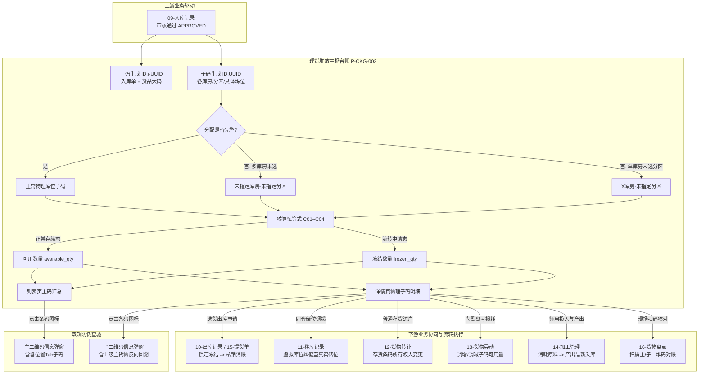

# 理货堆放主PRD

> **模块定位**：仓储资产物理空间堆放与库位精细化核算中枢（【第1层-数据核算与物理台账层】），建立在入库货物实物落位基础之上。以“入库单 × 货品”主码为核算汇总，以“库房-分区-具体位置”子码为实际物理承载，全面承接并支撑第 2 层执行单据（09入库、10出库、11移库、12转让、13异动、14加工、15提货单、16盘点）。提供实物堆放分布、在库可用与审批冻结追踪、虚拟未指定库位兜底、主子二维码双轨穿透与全生命周期台账查询。  
> **版本**：V1.1 | **更新时间**：2026-09-22 | **责任人**：森云科技（Senyun Technology）  
> **编写依据**：[理货堆放字段清单.md](./理货堆放字段清单.md) 是所有字段定义、枚举、控件规格与页面展示的唯一基准；[理货堆放业务规则规格.md](./理货堆放业务规则规格.md) 是状态机模型、主子码联动机制、核算恒等式及动态过滤规则的唯一真源。

---

## 1. 业务背景与业务痛点

### 1.1 业务背景
在大宗商品仓储与供应链金融存货质押监管业务中，货物入库后往往分散堆放在不同库房、分区及垛位。
资方（银行/保理）、监管方及仓储企业需要穿透到货物的**物理堆放明细**，实时掌握物理位置、入库期初量、当前可用量及审批流转冻结量，并通过物联网条码实现扫码验货与现场追溯。作为【第1层-数据核算与物理台账层】的关键纽带，理货堆放台账承接着上游入库建档，并为后续的出库、移库、转让、异动、加工及盘点提供底层储位与条码支撑。

### 1.2 核心业务痛点
1. **入库单与物理堆放割裂**：传统系统仅记录入库总数，缺乏分散到各垛位的二级明细，现场盘点与巡检时无法快速定位货物；
2. **未精确理货导致账实脱节**：入库填单时若未及时指定具体货架分区，容易导致货品遗失或无账可查；必须建立“未指定库房/分区”的虚拟库位兜底机制，保障实物总量严格守恒；
3. **主码与子码权属混淆**：宏观质押监管看批次主码，现场操作与出库调拨看位置子码；二者若缺乏严密的代数和守恒与并发互斥锁，极易发生超卖或重复质押；
4. **多业务流转下的冻结与追溯盲区**：出库、移库、转让、异动、质押等业务在审批流转中缺乏细粒度的储位锁定，导致“已锁货被误挪动或误出库”；
5. **条码验真手段单一**：现场缺乏多层级二维码追溯体系，无法在移动端扫码时同时识别批次主货品信息与当前库位的物理子状态。

---

## 2. 功能范围

| 包含范围 | 不包含范围 |
| :--- | :--- |
| - **货品主码台账检索**：以【入库单 × 货品】为主码维度展示列表，支持入库单号、入库日期、货主、仓库、货品、制单人、制单时间多维筛选； - **仅查看有库存的快捷过滤**：默认勾选，仅检索实物在库总量 `(可用数量 + 冻结数量) > 0` 的在库货品； - **多库位智能聚合展示**：同一货品分散堆放于多库房或多分区的，在列表页以逗号分隔全部展示，支持悬停 Tooltip； - **详情页三层结构下钻**：包含基础信息、影像附件（现场照片、补充资料、设备抓拍图）及二级存货信息表格； - **动态库位过滤与沉底**：存货信息表中可用为 0 但冻结 > 0 的库位行沉底展示；在库总量归 0（完全出库）的库位行自动过滤隐藏； - **未指定库房/分区虚拟兜底与移库纠偏**：自动承接未分配具体库位的货物，保障实物总量绝对守恒，并支持后续在 [11-移库管理](../11-移库管理-移库记录/) 中调拨至真实储位； - **双轨二维码弹窗穿透**：   1. 列表点击【存货条码】：弹出【主二维码信息】弹窗，含主码与位置 Tab 切换子码；   2. 详情点击【存货条码】：弹出【子二维码信息】弹窗，含当前子码并反向回溯上级主货物； - **单据穿透跳转**：支持从详情页一键查看对应入库单详情及入库类型关联单据。 | - **前台直接新增或编辑**：本模块为只读物理台账，数据由 09 入库单审核通过后自动生成，不提供前台手工新增或修改； - **草稿或暂存机制**：不支持草稿状态，仅展示已生效终态数据； - **前台直接移库或出库操作**：存货信息表格操作列固定展示占位横杠 `--`，移库与出库由专门业务模块（10出库、11移库）发起； - **跨仓库越权查询**：严格基于用户管辖仓库进行数据隔离，禁止跨租户或越权查看未授权仓库数据； - **数据导出功能**：根据线上最新基准设计，本模块不提供导出功能。 |

---

## 3. 模块定位与全仓储系统链路

---

## 4. 业务场景与用户故事

| 业务场景 | 触发角色 | 核心交互与控制 | 业务价值 |
| :--- | :--- | :--- | :--- |
| **场景 1【仓管现场查验与垛位定位】(S01)** | 仓库主管 / 监管员 | 进入【理货堆放】列表，输入入库单号或筛选仓库，查看目标货物。点击【详情】进入详情页，在【存货信息】表格中精确定位该批货物分别堆放在哪几个库房、分区及具体垛位（如 `低温冷冻 - A分区 - 梵蒂冈`）。 | 快速指引现场取样、巡检或理货，提升仓储作业效率。 |
| **场景 2【移动端扫码与防伪验真】(S02)** | 现场监管员 / 资方巡检员 | 在列表页点击【存货条码】图标打开【主二维码信息】弹窗，或在详情页点击库位子条码打开【子二维码信息】弹窗。使用手持 PDA 扫描条码，系统核验数字签名，展示防伪编号、货物批次及实时在库状态。 | 打通“货-仓-金”物联防伪闭环，杜绝假冒伪劣与空单挂账。 |
| **场景 3【风控核实货物在库与流转冻结】(S03)** | 风控经理 / 审核岗 | 查询某货主名下的存货堆放记录，核对【入库数量】、【可用数量】与【冻结数量】。若发现某库位处于 `监管服务申请中` 或 `质押申请中`，且可用数量为 0、冻结数量被全额锁定，确认该部分存货正在履约流转，防止重复授信。 | 穿透掌握底层资产流转动态，精准把控在押资产风险。 |
| **场景 4【虚拟库位移库纠偏与账实闭环】(S04)** | 仓管调度员 | 筛选查看包含【未指定库房】或【未指定分区】的理货记录。下钻详情发现存在未分配数量，随后在 [11-移库记录](../11-移库管理-移库记录/) 中选择该虚拟库位货物，发起移库调拨至真实物理储位。审批通过后虚拟储位扣减归零并自动过滤消失，实现纠偏闭环。 | 兜底防范漏配货位导致的账实脱节，确保实物资产 100% 可管可溯。 |
| **场景 5【加工产出品建码入库与质押继承】(S05)** | 监管操作员 | 货物在 [14-加工管理](../14-加工管理-加工记录/) 完成切割组装后，联动生成加工入库记录并在本台账中生成产成品主码与各垛位子码；详情页基础信息中展示 `抵押加工入库 关联单号... 【查看】`，支持一键穿透追溯原料与原抵押单。 | 支撑大宗商品增值加工，保障质押货权无缝继承。 |

---

## 5. 状态机与动作能力矩阵

理货堆放模块为**纯只读物理台账**，各层级动作能力矩阵如下：

| 动作名称 | 列表页主码层 | 详情页基础信息 | 详情页存货信息表格 | 主/子二维码弹窗 | 约束与说明 |
| :--- | :---: | :---: | :---: | :---: | :--- |
| **多维组合查询** | ✅ (单按钮触发) | ❌ | ❌ | ❌ | 点击【查询】触发服务端联合检索，重置为第 1 页 |
| **仅查看有库存过滤** | ✅ (默认勾选) | ❌ | ❌ | ❌ | 勾选时过滤 `available_qty + frozen_qty > 0` |
| **列升降排序** | ✅ (入库/可用/冻结) | ❌ | ❌ | ❌ | 点击表头箭头切换升序、降序或默认入库时间倒序 |
| **下钻【详情】** | ✅ (行操作) | ❌ | ❌ | ❌ | 跳转至理货堆放详情页 |
| **点击【返回】** | ❌ | ✅ (右上角) | ❌ | ❌ | 返回列表页并保留之前的筛选条件与分页状态 |
| **穿透查看关联单号** | ❌ | ✅ (橙色链接) | ❌ | ❌ | 新标签页打开入库记录或入库类型关联业务单据 |
| **查看附件大图/PDF** | ❌ | ✅ (缩略图/文件) | ❌ | ❌ | 点击现场照片/设备抓拍图弹窗放大；点击文件在线预览或下载 |
| **点击【存货条码】** | ✅ (弹出主二维码) | ❌ | ✅ (弹出子二维码) | ❌ | 列表弹出主二维码（含Tab）；详情表格弹出子二维码（含主码回溯） |
| **前台操作列** | ❌ | ❌ | ➖ (固定展示 `--`) | ❌ | 当前版本为只读占位，不提供移库、调整等前台操作 |

---

## 6. 页面功能说明 (Page Functional Specifications)

### 6.1 理货堆放列表页

#### 6.1.1 页面目标与路径
* **页面目标**：汇总展示当前管辖仓库内所有已生效入库货品的主码台账，呈现入库总数、可用与冻结分布及涉及库房分区，提供主二维码弹窗及详情下钻入口。
* **访问路径**：`仓储管理 → 库存查询 → 理货堆放`。

#### 6.1.2 页面骨架与分区
1. **顶部面包屑与标题**：展示主标题 `理货堆放`；
2. **筛选查询区（双行紧凑布局）**：
   * 第一行：`入库单号`（文本输入）、`入库日期`（日期区间）、`货主名称/标识`（文本输入）、`仓库名称`（下拉单选）、`货品名称`（下拉单选）；
   * 第二行：`制单人`（下拉单选）、`制单时间`（日期区间）、`仅查看有库存的`（复选框，默认选中）、`【查询】` 按钮（主色高亮）；
   * 交互约束：无独立重置按钮；点击【查询】发起检索，字段规格见 [理货堆放字段清单.md §一](./理货堆放字段清单.md#一-筛选与查询区字段清单-search--filter)；
3. **主数据表格区**：
   * 数据行按入库时间默认倒序；
   * 表头列包含：`序号`、`货主`、`货物名称`、`入库时间`、`入库数量`、`可用数量`、`冻结数量`、`其他信息`、`仓库`、`库房`、`分区`、`存货条码`、`操作`；
   * 数量列排序：入库数量、可用数量、冻结数量表头提供升降序排列切换图标；
   * 库位合并规则：当同一货品分配至多个库房或分区时，以逗号分隔全部展示（如 `低温冷冻,水果库房2`），超出列宽时截断并支持悬停 Tooltip 完整查看；
   * 字段规范详见 [理货堆放字段清单.md §二](./理货堆放字段清单.md#二-列表页字段清单-table-view---主货物大码维度)；
4. **分页控制底栏**：
   * 包含总记录数（如 `共 287 条`）、每页条数下拉选择（默认 `10条/页`）、页码切换组件及跳页输入框（`前往 X 页`）。

---

### 6.2 理货堆放详情页

#### 6.2.1 页面目标与路径
* **页面目标**：展现单一入库货品的完整物理画像，包括主单基础信息、现场存证影像附件，以及拆分到各个具体物理库位（子码）的期初、可用、冻结数量与存货状态。
* **访问路径**：在理货堆放列表页点击任一行操作【`详情`】进入。

#### 6.2.2 页面骨架与分区
1. **页面顶部栏**：
   * 左上角大标题：格式为 `货物名称 — 入库总数量`（如 `海鲜-带鱼-深海 — 100千克`）；
   * 右上角操作：幽灵线框【`返回`】按钮，点击安全返回列表页；
2. **第一区块：基础信息 (Basic Info)**：
   * 采用双列响应式键值对布局；
   * 包含字段：`货主`、`制单人`、`制单时间`、`入库类型`（含关联单号【查看】）、`货物信息`、`入库日期`、`入库单号`（含【查看】链接）、`备注信息`、`仓库`、`库房`、`分区`、`其他信息`（动态扩展属性）；
   * 链接跳转交互：点击入库单号后的【查看】新标签页打开入库记录；点击入库类型的关联单号【查看】新标签页打开业务源单；
   * 字段规格详见 [理货堆放字段清单.md §3.1](./理货堆放字段清单.md#31-页面头部与基础信息-basic-info)；
3. **第二区块：附件信息 (Attachments)**：
   * 横向分为三个独立子卡片：
     * `现场照片`：展示入库实物拍摄缩略图，点击弹窗放大预览大图；无照片展示 `无现场照片`；
     * `补充资料`：展示上传的 PDF/文档附件图标及文件名，点击可在线预览或下载；无资料展示 `无补充资料`；
     * `设备抓拍图`：展示物联网监控摄像头在入库完成时自动抓拍的照片，点击弹窗放大；无抓拍展示 `无设备抓拍图`；
   * 字段规格详见 [理货堆放字段清单.md §3.2](./理货堆放字段清单.md#32-附件信息-attachments)；
4. **第三区块：存货信息 (Stock Sub-table)**：
   * 二级子明细表格，以实际物理存放库位为行颗粒度；
   * 列头包含：`序号`、`库房`、`分区`、`具体位置`（垛位/架位，如 `梵蒂冈`、`大发`，未分配展示 `--`）、`期初堆放数量`、`可用数量`、`冻结数量`、`存货条码`（二维码图标）、`状态`、`操作`（固定展示 `--`）；
   * 动态过滤与沉底：
     * 若某库位可用数量为 0 但冻结数量 > 0，该行数据不消失，自动沉底排列在表格末尾；
     * 若某库位 `可用数量 == 0 且 冻结数量 == 0`，系统在前台自动过滤隐藏该行数据；
   * 字段规格详见 [理货堆放字段清单.md §3.3](./理货堆放字段清单.md#33-存货信息表格-stock-sub-table---子码维度)。

---

### 6.3 二维码双轨弹窗交互规格

#### 6.3.1 【主二维码信息】弹窗（列表页触发）
1. **触发方式**：在理货堆放列表页点击任一行的【存货条码】图标；
2. **弹窗结构**：
   * **顶部与主信息**：标题 `主二维码信息`，右上角关闭按钮 `×`；居中展示品类大标题（如 `蔬菜`）、规格副标题（如 `辣椒-印度-无机`）、货主全称/脱敏手机号、入库日期、入库单号、仓库名称；
   * **主二维码卡片**：标准 QR 码矢量图形、主码唯一 ID（格式 `ID:i-{UUID}`）、生成时间戳；
   * **下部位置 Tab 栏**：对应该货品分配的多个库位分签（`位置1`、`位置2` ...）；
   * **子位置联动卡片**：点击位置 Tab，卡片即时展示该位置的库位路径（如 `生鲜仓库-蔬菜库房审核-绿叶分区`）、当前存货状态（如 `存货中`）、三列指标（`期初堆放数量`、`可用数量`、`冻结数量`）、子二维码矢量图形、子码唯一 ID（格式 `ID:{UUID}`）及生成时间；
3. **字段规格**：详见 [理货堆放字段清单.md §5.1](./理货堆放字段清单.md#51-主二维码信息弹窗列表页点击存货条码图标弹出)。

#### 6.3.2 【子二维码信息】弹窗（详情页触发）
1. **触发方式**：在详情页【存货信息】表格中点击任一特定库位行的【存货条码】图标；
2. **弹窗结构**：
   * **顶部与当前子码信息**：标题 `子二维码信息`，右上角关闭按钮 `×`；居中展示货品品类与规格、右上角状态标签（如 `监管服务申请中`）、三列指标（期初、可用、冻结）、当前精确库位路径、子二维码矢量图形、子码唯一 ID 及生成时间；
   * **下部【入库主货物信息】回溯卡片**：灰色背景卡片，向上反向穿透展示所属货主、入库日期、入库单号、主货物位置信息、上级主二维码矢量图形、主码唯一 ID 及生成时间；
3. **字段规格**：详见 [理货堆放字段清单.md §5.2](./理货堆放字段清单.md#52-子二维码信息弹窗详情页存货明细点击二维码图标弹出)。

---

## 7. 核心业务规则摘要

> 本节摘录核心约束，完整流转与计算模型见 [理货堆放业务规则规格.md](./理货堆放业务规则规格.md)。

* **主子码数量聚合恒等式 (C03)**：主货物入库数量、可用数量与冻结数量，严格等于其归属的所有物理子码代数和，严禁出现负数（C04）；
* **期初堆放数量终身不可变 (C02)**：继承自 09 入库单初次分配快照，后续出库、移库、转让与异动均不反向修改期初数量；
* **未指定库房/分区虚拟兜底 (R03)**：入库未分配具体库位的货物挂入虚拟储位，支持后续在 11 移库模块调拨纠偏；
* **可用为零沉底与清零过滤 (R04/R05)**：详情页存货行可用为 0 时沉底；可用与冻结双清零时前台自动过滤隐藏；
* **仅查看有库存默认生效 (R06)**：筛选区默认勾选，强制检索 `available_qty + frozen_qty > 0`；
* **双轨二维码防伪闭环 (R08~R10)**：主码前缀 `ID:i-`，子码前缀 `ID:`，支持主子互通穿透查验。

---

## 8. 权限与安全控制 (RBAC)

1. **功能权限**：
   * 具备 `R-STORAGE-VIEW`（仓储查询权限）的用户可访问本模块；
2. **数据权限隔离 (R12)**：
   * 严格基于用户所属组织架构与管辖仓库进行数据隔离，仅展示已授权仓库的理货堆放数据，未授权数据在接口底层直接剔除；
3. **隐私脱敏安全 (R11)**：
   * 货主联系电话严格实行中间 4 位星号脱敏（如 `188****2345`），保障客户商业隐私。

---

## 9. 验收标准与测试要点

| 序号 | 验收场景 | 预期结果 |
| :---: | :--- | :--- |
| 1 | **多货品入库单列表展开验证** | 一张入库单包含 3 种不同货品时，在理货堆放列表中成功展示为 3 条独立记录。 |
| 2 | **仅查看有库存过滤验证** | 默认进入页面仅展示在库总量 $>0$ 的记录；取消勾选后，历史已完全出库的记录正常呈现。 |
| 3 | **多库位聚合展示与悬停验证** | 某货品分散在 2 个库房、3 个分区时，列表页库房与分区列以逗号分隔完整展示，鼠标悬停弹出 Tooltip。 |
| 4 | **未指定库房虚拟兜底验证** | 入库未分配库位的货物，详情页存货表格中展示为【未指定库房-未指定分区】，数量与未分配数量一致。 |
| 5 | **存货表格动态过滤验证** | 某库位可用为 0 但处于冻结状态时，该行沉底排列；当冻结归 0 且可用归 0 时，该行自动在表格中消失。 |
| 6 | **主二维码弹窗及Tab联动验证** | 列表点击二维码图标，弹出【主二维码信息】；点击位置 Tab，下方子卡片即时切换对应位置的指标与子码。 |
| 7 | **子二维码弹窗反向回溯验证** | 详情表格点击二维码图标，弹出【子二维码信息】，上部展示当前库位子码，下部准确展示上级主码信息。 |
| 8 | **跨单据穿透跳转验证** | 点击入库单号成功跳转至 [09-入库记录](../09-入库管理-入库记录/) 对应单据详情；点击关联单号成功打开源单。 |

---

## 10. 修订记录

| 日期 | 版本 | 变更内容说明 | 影响范围 | 修订人 |
| :--- | :--- | :--- | :--- | :--- |
| 2026-09-22 | V1.0 | 建立理货堆放最新基准版主 PRD 初始稿 | 全模块 | AI PM / 森云科技 |
| 2026-09-22 | V1.1 | 深度融入 09 入库至 16 货物盘点全仓储业务协同，明确【第1层-数据核算与物理台账层】定位与链路架构 | 业务协同与全链路 | AI PM / 森云科技 |
| 2026-09-22 | **V1.2** | **全文档走查与三件套结构对齐**： 1. 对齐字段清单 11 列标准大宽表与业务规则规格口径； 2. 规范章节层级与修订记录标准； 3. 完善验收测试与跨模块穿透标准。 | 全文规范性与协同对齐 | AI PM / 森云科技 |

