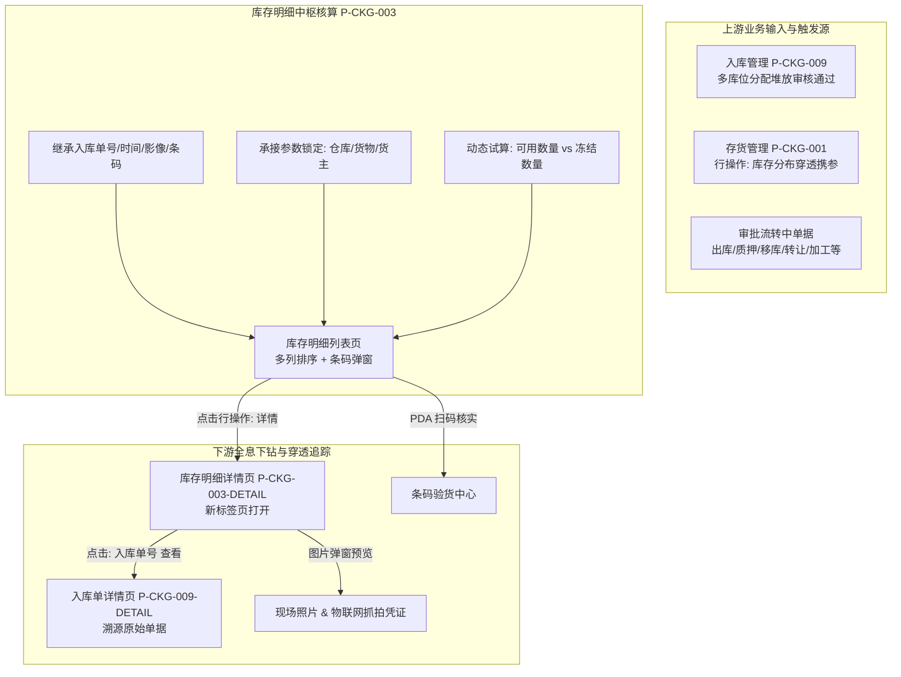

# 库存明细主PRD

> **模块定位**：仓储资产最细粒度物理货位查询与批次全生命周期追溯中枢。建立“仓库-库房-分区-具体垛位”四级空间拓扑，以全局唯一存货条码为数字锚点，实时解耦“可用库存（未在流程中）”与“冻结库存（流转审批中）”，打通从宏观存货管理向下钻取、向源头入库单据与实物证据链（照片/物联网设备自动抓拍）反向穿透的完整闭环。  
> **版本**：V1.2 | **更新时间**：2026-09-16 | **责任人**：森云科技（Senyun Technology）  
> **编写依据**：[库存明细字段清单.md](./库存明细字段清单.md) 是本模块所有字段定义、枚举与展示的唯一基准；[库存明细业务规则规格.md](./库存明细业务规则规格.md) 是状态机、数量核算口径、多维排序及穿透锁定的唯一定义来源；[库存明细_ASCII_列表页.md](./库存明细_ASCII_列表页.md) 与 [库存明细_ASCII_详情页.md](./库存明细_ASCII_详情页.md) 是界面交互与布局的基准来源。

---

## 1. 业务背景与业务痛点

### 1.1 业务背景
在供应链金融存货质押与第三方监管体系中，单纯依靠总账维度的库存数字无法满足现场监管、动碰复核、司法举证及解押出库的高精度风控要求。资方审计、现场理货员与仓储调度人员必须能够下钻到“具体某个仓库的哪个库房、哪个分区、哪个垛位堆放了哪批货、初始堆了多少、当前还剩多少可用、多少正被审批占用”，并能随时调用该货位的唯一二维码与现场实物照片，实现物联级信任穿透。

### 1.2 核心业务痛点
1. **垛位与账面脱节**：传统仓储管理只记总账，缺少细化到垛位维度的期初堆放与动态余量记录，导致现场找货困难、盘点效率低下；
2. **在途审批状态不透明**：当货主发起部分质押或出库时，缺乏微观批次层面的冻结隔离机制，容易发生重复质押或违规出库；
3. **查证取证成本高**：质押存货发生争议或跌价时，缺乏从库存批次向源头入库单、验货照片及物联网（IoT）安防抓拍凭证的一键穿透链路；
4. **宏观与微观割裂**：从宏观存货分析跳转至明细查询时，若不能自动锁定仓库、货物或货主上下文，用户需要反复重新输入筛选条件，操作体验割裂。

---

## 2. 功能范围

| 包含功能范围 | 不包含功能范围 |
| :--- | :--- |
| - **最细粒度物理定位查询**：精准追溯至仓库、库房（含审核标签）、分区、具体位置； - **三态数量核算与排序**：精准展现期初堆放数量、可用数量（未在流程中）、冻结数量（申请流转中），支持三列独立的升降序排序 `▲▼`； - **多维组合筛选引擎**：支持入库单号精准匹配、入库日期范围、货主模糊匹配、入库类型下拉单选、仓库三级级联多选、货品目录级联多选、最新 18 项状态机筛选、制单人及制单时间过滤； - **快速过滤开关**：提供【仅查看有库存的】复选框（默认勾选），一键屏蔽已出库货位； - **存货管理穿透锁定接收**：承接来自存货管理的跳转参数，强一致只读锁定仓库（仅可选库房/分区）、货物或货主（R01~R03）； - **存货条码与二维码模态弹窗**：列表支持点击二维码图标呼出高清条码模态弹窗，用于现场掌上终端（PDA）扫码核验； - **全息档案详情新页（P-CKG-003-DETAIL）**：在浏览器新标签页打开详情，呈现基础信息、入库单号一键穿透【查看】、现场照片/补充资料/物联网自动抓拍影像以及存货微观表格； - **多租户与仓库权限严格隔离**：基于登录用户的组织架构和仓库授权范围实时过滤数据。 | - **明细直接手工修改/删除**：本台账为存货实物与审批流驱动的只读镜像，不提供前台编辑或删除按钮； - **手工调仓/移垛**：物理位置调整必须通过合规的【移库管理】单据审批驱动，严禁在本页面手工篡改位置； - **负库存出现**：系统强约束可用数量与冻结数量必须大于等于 0； - **越权跨仓查询**：严禁突破当前登录账号的仓库数据权限范围。 |

---

## 3. 模块定位与系统链路

---

## 4. 业务场景与用户故事

| 场景编号 | 业务场景 | 触发角色 | 核心交互与风控约束 | 业务价值 |
| :--- | :--- | :--- | :--- | :--- |
| **场景 1【现场货位精准巡检与扫码验真】(S01)** | 监管员现场货位精准巡检与扫码验真 | 现场监管员 / 仓管员 | 登录系统进入库存明细，筛选“海霸王仓库”，系统展现该仓各批次存货。监管员携带掌上终端（PDA）巡检到“分区冷冻-曼头墩”垛位，核对实物与系统中“期初堆放 63.9584 斤、可用 44.9584 斤”一致；点击行内二维码图标呼出条码模态弹窗，PDA 扫码比对无误。 | 实现账面存货与库区物理垛位的 1:1 精确核验。 |
| **场景 2【存货看板下钻排查特定货品占用】(S02)** | 从存货看板下钻排查特定货品占用情况 | 业务经理 / 风险主管 | 在存货管理中发现某货品存在大量冻结，点击【库存分布】跳转本页。系统自动锁定该货品，筛选区展示该货品在各仓批次。主管点击【冻结数量 ▲▼】降序排列，发现最大一笔冻结在生鲜仓库正处于“质押申请中”，查明占用原因。 | 闭环宏观资产与微观批次的分析链路，提高决策效率。 |
| **场景 3【调阅存货全息档案与入库证据链】(S03)** | 调阅存货全息档案与入库影像证据链 | 资方银行审核岗 / 审计人员 | 针对某笔在押存货点击操作列【详情】，系统在新标签页打开详情页。审核员审阅基础信息、现场实物照片（放大预览码放标签）、补充质检单及物联网（IoT）摄像头自动抓拍图，并点击入库单号旁的【查看】穿透回溯入库审批全流程。 | 打造不可抵赖的金融级司法存证与履约追溯闭环。 |

---

## 5. 状态机与动作能力矩阵

> 本页面状态严格继承最新 18 项状态机，各状态对应的数量归属与业务动作能力矩阵如下：

| 状态类别 | 货品状态名称 | 可用数量 | 冻结数量 | 允许发起出库 | 允许发起质押 | 允许发起移库 | 行操作: 详情 | 条码查看 |
| :--- | :--- | :---: | :---: | :---: | :---: | :---: | :---: | :---: |
| **生效基准态** | `存货中` | ✅ 净额可用 | ⚠️ 锁定部分转出 | ✅ 允许 | ✅ 允许 | ✅ 允许 | ✅ 可查看 | ✅ 可查看 |
| **质押生效态** | `质押中` / `抵押中` | ✅ 在押可用 | ⚠️ 出库申请转出 | ⚠️ 需走解押/质押出库 | ❌ 禁止重复质押 | ⚠️ 需质押移库审批 | ✅ 可查看 | ✅ 可查看 |
| **流转冻结态** | `出库申请中` / `移库申请中` | ❌ 0 | ✅ **100% 冻结** | ❌ 审批中禁止再次操作 | ❌ 禁止操作 | ❌ 禁止操作 | ✅ 可查看 | ✅ 可查看 |
| **流转冻结态** | `质押申请中` / `抵押申请中` | ❌ 0 | ✅ **100% 冻结** | ❌ 禁止操作 | ❌ 禁止操作 | ❌ 禁止操作 | ✅ 可查看 | ✅ 可查看 |
| **流转冻结态** | `仓单申请中` / `转让申请中` | ❌ 0 | ✅ **100% 冻结** | ❌ 禁止操作 | ❌ 禁止操作 | ❌ 禁止操作 | ✅ 可查看 | ✅ 可查看 |
| **生产加工态** | `加工申请中` $\rightarrow$ `加工中` | 在制可用 | 原料锁定冻结 | ❌ 领料流转中 | ❌ 禁止操作 | ❌ 禁止操作 | ✅ 可查看 | ✅ 可查看 |
| **风控清收态** | `平仓申请中` $\rightarrow$ `平仓中` | 清收可用 | 处置锁定冻结 | ⚠️ 走平仓处置出库 | ❌ 禁止操作 | ❌ 禁止操作 | ✅ 可查看 | ✅ 可查看 |
| **终态完结态** | `已出库` | 0 | 0 | ❌ 已出库不可操作 | ❌ 已出库不可操作 | ❌ 已出库不可操作 | ✅ 可查看 | ✅ 可查看 |

---

## 6. 页面交互规格索引

本模块在 PC 端包含一个列表台账、一个条码二维码模态弹窗及一个独立详情页，高保真 ASCII 界面线框与微观交互规范已拆分为独立专页维护：

### 6.1 库存明细 — 列表页（`P-CKG-003`）
- **对应文档**：[库存明细_ASCII_列表页.md](./库存明细_ASCII_列表页.md)
- **核心规格**：
  - 两排筛选区：入库时间（日期范围）、货主名称/标识（单行文本输入框）、仓库名称（仓库-库房-分区三级级联多选）、货品名称（货品大类-品类-规格树形目录级联多选）、货品状态（18项状态多选下拉框）、【仅查看有库存的】快捷复选框（默认勾选）、【查询】与【重置】按钮；
  - 内容表格（11 列）：`序号`、`货主`（双元标识）、`货物`（规格全称）、`入库时间`、`期初堆放数量`（排序 `▲▼`）、`可用数量`（排序 `▲▼`）、`冻结数量`（排序 `▲▼`）、`仓库库房`（含具体位置）、`存货条码`（二维码图标）、`状态`（状态标签）、`操作`；
  - 行操作列：【详情】（文字链接采用系统主题色，强制在浏览器新标签页打开）。

### 6.2 存货条码 — 现场扫码模态弹窗
- **对应文档**：[库存明细_ASCII_列表页.md §1.2](./库存明细_ASCII_列表页.md#12-存货条码弹窗ascii线框图)
- **核心规格**：
  - 列表点击二维码图标居中呼出；
  - 模态弹窗居中展示全局唯一条码编号（如 `SN20260703008`，带一键复制图标）；
  - 下方渲染大图高清二维码，底部提供【关闭】按钮，满足现场监管员掌上终端（PDA）快速识读。

### 6.3 库存明细详情页（`P-CKG-003-DETAIL`）
- **对应文档**：[库存明细_ASCII_详情页.md](./库存明细_ASCII_详情页.md)
- **核心规格**：
  - 顶栏：大标题 `货物名称 — 总数量 + 单位`，右上角白底【返回】按钮；
  - 基础信息区（双列排布）：货主、制单人、制单时间、入库类型、货物信息、入库日期、入库单号（高亮附带主题色【查看】链接，在新标签页跳转 `P-CKG-009-DETAIL`）、备注、仓库、库房、分区、其他信息；
  - 附件信息区：并列展示【现场照片】（缩略图点击放大预览）、【补充资料】（PDF 在线预览）、【设备抓拍图】（物联网安防摄像头自动抓拍凭据）；
  - 存货信息表格：展示库房、分区、具体位置、期初堆放数量、可用数量、冻结数量、条码、状态。

---

## 7. 核心业务规则索引

| 规则编码 | 规则业务名称 | 规则核心逻辑摘要 | 规则规格唯一定义章节 |
| :--- | :--- | :--- | :--- |
| **R01** | 【仓库穿透锁定】 | 从存货管理仓库标签页跳转进入时，强制锁定该仓库为只读选中；仓库下拉单选框置灰禁用，仅允许在锁定仓库内筛选库房与分区；重置不解除锁定 | [业务规则规格 §4.1](./库存明细业务规则规格.md#41-存货管理穿透联动与参数锁定规则-r01--r03) |
| **R02** | 【货物穿透锁定】 | 从存货管理货物标签页跳转进入时，强制锁定货物大类/品类/规格为只读选中；重置不解除锁定 | [业务规则规格 §4.1](./库存明细业务规则规格.md#41-存货管理穿透联动与参数锁定规则-r01--r03) |
| **R03** | 【货主穿透锁定】 | 从存货管理货主标签页跳转进入时，强制锁定货主为当前货主且输入框置灰只读；重置不解除锁定 | [业务规则规格 §4.1](./库存明细业务规则规格.md#41-存货管理穿透联动与参数锁定规则-r01--r03) |
| **R04** | 【默认与单列自定义排序】 | 默认按入库时间倒序排列；支持对期初堆放、可用、冻结数量三列分别点击单列升降序排序，三列排序互斥 | [业务规则规格 §4.2](./库存明细业务规则规格.md#42-筛选与排序交互规则-r04--r07) |
| **R05** | 【仅查看有库存快速过滤】 | 默认勾选，过滤 `available_qty > 0 OR frozen_qty > 0`；取消勾选呈现历史已出库货位（数量均为 0） | [业务规则规格 §4.2](./库存明细业务规则规格.md#42-筛选与排序交互规则-r04--r07) |
| **R06** | 【仓库库房分区层级联动】 | 仓库-库房-分区三级物理空间拓扑严格联动，清空上级联动重置下级选项 | [业务规则规格 §4.2](./库存明细业务规则规格.md#42-筛选与排序交互规则-r04--r07) |
| **R07** | 【货品树形目录级联筛选】 | 货品目录按大类-品类-规格树形层级展示，支持任意层级单选或多选精确匹配 | [业务规则规格 §4.2](./库存明细业务规则规格.md#42-筛选与排序交互规则-r04--r07) |
| **R08** | 【货主与货物双元截断展示】 | 企业货主展示名称+统一社会信用代码，个人展示姓名+脱敏手机号；货物三段式超长截断并悬停（Hover）展开气泡浮层 | [业务规则规格 §4.3](./库存明细业务规则规格.md#43-列表呈现与微观交互规则-r08--r11) |
| **R09** | 【存货条码弹窗与二维码生成】 | 点击二维码图标居中呼出模态弹窗，呈现条码文本（可一键复制）与大图高清二维码供掌上终端（PDA）扫码 | [业务规则规格 §4.3](./库存明细业务规则规格.md#43-列表呈现与微观交互规则-r08--r11) |
| **R10** | 【空值占位统一标识】 | 货位具体垛位、备注或附件等非必填项为空时，界面统一回显中划线占位符 `--` | [业务规则规格 §4.3](./库存明细业务规则规格.md#43-列表呈现与微观交互规则-r08--r11) |
| **R11** | 【库房审核属性明确标签】 | 库房名称后明确回显“需要审核/不需要审核”属性徽标，明确该库位出入库管控级别 | [业务规则规格 §4.3](./库存明细业务规则规格.md#43-列表呈现与微观交互规则-r08--r11) |
| **R12** | 【详情新标签页强制打开】 | 点击行操作【详情】强制在浏览器新标签页打开详情页，保留原列表筛选与翻页上下文 | [业务规则规格 §4.4](./库存明细业务规则规格.md#44-详情页跳转与全息追溯规则-r12--r15) |
| **R13** | 【入库单号穿透查看联动】 | 详情页入库单号旁提供【查看】链接，在新标签页跳转至对应入库记录详情页（`P-CKG-009-DETAIL`） | [业务规则规格 §4.4](./库存明细业务规则规格.md#44-详情页跳转与全息追溯规则-r12--r15) |
| **R14** | 【影像证据链三要素全息呈现】 | 详情页完整呈现现场实物照片、补充资料（PDF/图片）及物联网（IoT）监控自动抓拍影像三要素 | [业务规则规格 §4.4](./库存明细业务规则规格.md#44-详情页跳转与全息追溯规则-r12--r15) |
| **R15** | 【详情存货信息表格一致性】 | 详情页底部存货信息表格数据必须与当前明细货位保持 100% 强一致镜像 | [业务规则规格 §4.4](./库存明细业务规则规格.md#44-详情页跳转与全息追溯规则-r12--r15) |
| **R16** | 【页面与操作权限控制】 | 基于角色权限控制（RBAC）管控查看列表与进入详情权限，无权限人员不展示菜单入口或操作按钮 | [业务规则规格 §4.5](./库存明细业务规则规格.md#45-权限隔离与安全规范-r16--r18) |
| **R17** | 【仓库管辖权数据隔离】 | 列表与筛选仅呈现当前登录用户管辖仓库范围内的存货明细数据，严禁越权查看 | [业务规则规格 §4.5](./库存明细业务规则规格.md#45-权限隔离与安全规范-r16--r18) |
| **R18** | 【操作防抖与幂等性防护】 | 【查询】与【重置】操作设置 1000ms 防抖限制，避免频繁连续点击对后端造成负载压力 | [业务规则规格 §4.5](./库存明细业务规则规格.md#45-权限隔离与安全规范-r16--r18) |

---

## 8. 非功能性需求

### 8.1 性能要求
- **千万级明细检索响应**：在千万级历史在库垛位数据下，组合筛选与排序列查询响应时间 $\le 1.0\text{s}$；
- **条码模态弹窗毫秒级呼出**：点击二维码图标弹窗渲染时间 $\le 200\text{ms}$，满足现场高频连续扫码验货；
- **详情页高清大图预览**：现场实物大图采用内容分发网络（CDN）边缘节点加速，图片加载时间 $\le 1.5\text{s}$。

### 8.2 安全性与合规性
- **金融级脱敏保护**：个人货主手机号（中间 4 位）、身份证号（中间 8 位）脱敏展示；
- **影像防篡改凭证**：现场照片与安防抓拍图上传后固化 MD5 与安全时间戳，私有对象存储（OSS）动态申请临时防盗链签名访问；
- **审计追踪留痕**：用户查看详情、扫码验货及检索明细行为全路径记录审计日志，保留 5 年以上备查。

---

## 修订记录

| 日期 | 版本 | 变更内容说明 | 影响范围 | 修订人 |
| :--- | :--- | :--- | :--- | :--- |
| 2026-09-08 | V1.0 | **建立最新基准版库存明细主 PRD**： 1. 规范微观物理货位查询定位与业务痛点； 2. 规范功能范围边界（包含/不包含范围）与系统链路 Mermaid 架构图； 3. 明确三大典型业务场景与用户故事（S01~S03）； 4. 索引列表页与微观详情页的高保真 ASCII 界面线框； 5. 确立 R01~R18 核心业务规则矩阵与四维一体验收标准。 | 库存明细全模块（列表、条码模态弹窗及详情页） | AI PM / 森云科技 |
| 2026-09-08 | V1.1 | **全面对齐入库记录标杆主 PRD 章节架构**： 1. 规范第 5 节《状态机与动作能力矩阵》； 2. 深度展开第 6 节页面交互规格索引（6.1 列表页、6.2 条码模态弹窗、6.3 详情页三维架构）； 3. 新增第 7 节《核心业务规则索引》（规则编码、名称、摘要与唯一定义章节链接）； 4. 补齐第 8 节《非功能性需求》（性能、安全合规与存证）及《修订记录》。 | 主 PRD 结构完整性与标杆对齐 | AI PM / 森云科技 |
| 2026-09-16 | **V1.2** | **编号语义自解释与中英文表述规范化重构**： 1. 全面落实场景自解释命名：`场景 N【业务场景名称】(Sxx)`； 2. 全面落实规则自解释索引：单条独立展开 `【规则名称】(Rxx)`，与最新业务规则规格 1:1 对齐； 3. 汉化所有交互术语（Modal $\rightarrow$ 模态弹窗、Scope $\rightarrow$ 功能范围、Tab $\rightarrow$ 标签页、Hover $\rightarrow$ 悬停等），规范技术英文专业词保留 `中文（English）`。 | 全文表述与规则映射规范性提升 | AI PM / 森云科技 |
