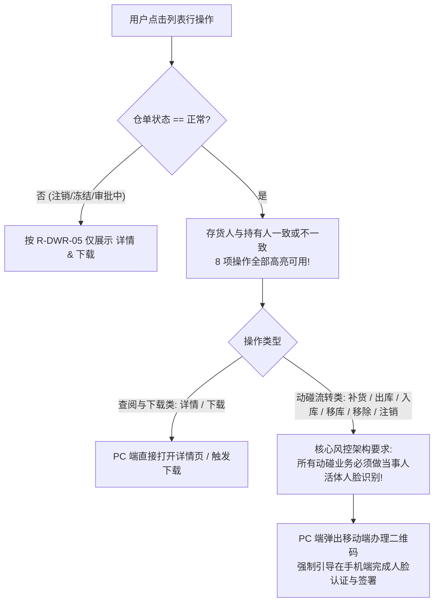
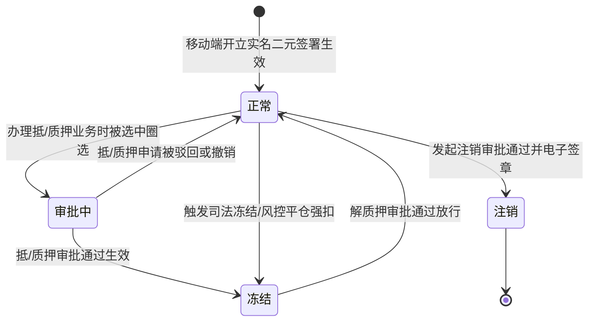

# 仓单管理业务规则规格

> **文档定位**：仓单管理模块（全生命周期流转、移动端人脸识别强绑定、单流程并发互斥锁、出库提货保底拦截、同仓移库约束、资产补货与移除解绑、关联单号入库、注销多重确认与三方登记认证）业务规则规格的唯一基准。本文件定义的规则在代码实现、自动化测试及需求变更中具有最高业务效力。  
> **版本**：V1.2 | **更新时间**：2026-09-16 | **责任人**：森云科技（Senyun Technology）  
> **关联文档**：[仓单管理主PRD.md](./仓单管理主PRD.md) · [仓单管理字段清单.md](./仓单管理字段清单.md) · [操作字段清单索引.md](./操作字段清单/操作字段清单索引.md) · [仓单管理_ASCII_列表页.md](./仓单管理_ASCII_列表页.md)

---

## 1. 规则规格总览矩阵

| 规则编号 | 规则业务名称 | 核心机制摘要 | 触发场景 / 界面入口 | 校验级别 |
| :--- | :--- | :--- | :--- | :---: |
| **`R-DWR-01`** | 【数据权限与仓库隔离】 | 基于用户分配的角色仓库权限过滤，严禁越权访问未经授权仓库的仓单 | 列表查询、详情打开、选货加载 | **P0 强阻断** |
| **`R-DWR-02`** | 【仓单编码与存证规范】 | 统一编码规则 `CD` + 19位数字串，签署完成时固化防伪哈希与司法存证 | 移动端开立签署时生成 | **P0 核心契约** |
| **`R-DWR-03`** | 【全量操作可用与人脸绑定】 | 正常状态下存货人与持有人无论一致与否，8 项操作全部可用；所有动碰业务强制在手机端完成人脸活体识别 | PC 列表操作渲染、各操作点击 | **P0 核心架构** |
| **`R-DWR-04`** | 【单仓单单流程互斥并发锁】 | 同一仓单下，【补货/出库/移库/注销】流程在途仅限 1 个；冲突时浮窗提示阻断 | 发起补货/出库/移库/注销申请时 | **P0 强阻断** |
| **`R-DWR-05`** | 【四态操作能力矩阵】 | 严格控制：**注销、冻结、审批中仅允许【下载】与【查看详情】**；正常态 8 项全量可用 | 列表操作列渲染、详情操作控制 | **P0 核心契约** |
| **`R-DWR-06`** | 【移动端开立实名双因子认证】 | 个人货主法定代表人必须通过公安底库人脸活体检测 + 绑定手机 6 位短信验证码 | 移动端开立步骤四（电子签章） | **P0 强阻断** |
| **`R-DWR-07`** | 【仓单出库提货保底拦截】 | 仓单出库**严禁全部提货**，必须至少剩下一组货物；全选强阻断弹窗并引导走仓单注销流程 | 移动端仓单出库选货第一步 | **P0 强阻断** |
| **`R-DWR-08`** | 【仓单移库同仓物理转移】 | 仓单货物移库**严禁跨仓库**；必须在同一实体仓库内下钻选择库房、分区及具体位置（垛位） | 移动端仓单移库表单 | **P0 强阻断** |
| **`R-DWR-09`** | 【仓单补货与移除解绑机制】 | 补货：追加同仓未占用普通库存；移除：将货物解绑并还原为普通可用库存，**不发生实体出库** | 仓单补货/仓单移除表单 | **P1 业务流转** |
| **`R-DWR-10`** | 【仓单入库关联单号自动化锁定】 | 发起入库时，系统自动将入库类型锁定为 `仓单入库`，关联单号锁定为当前仓单编号（`CD...`） | 点击【仓单入库】跳转入库发起 | **P1 流程联动** |
| **`R-DWR-11`** | 【仓单注销多重确认与效力终止】 | 重要提醒 $\rightarrow$ 二次确认弹窗 $\rightarrow$ 电子签章人脸认证 $\rightarrow$ 审批流；通过后仓单彻底作废不可用 | 仓单注销全流程 | **P0 强阻断** |
| **`R-DWR-12`** | 【中仓登三方认证与悬停展示】 | 三方登记依据仓库准入资质判定；列表货物默认折叠展示前 2 条，悬停（Hover）【更多...】弹出气泡浮层全景 | PC 列表渲染与交互 | **P2 交互规范** |

---

## 2. 规则详细规格

### 【数据权限与仓库隔离】(R-DWR-01)
1. **数据范围判定**：
   * 用户登录系统后，后端根据其账号所分配的组织机构与实体监管仓库白名单，强制向仓单查询注入仓库 ID 过滤条件：`warehouse_id IN (UserAuthorizedWarehouseIds)`；
   * 严禁用户突破其权限范围访问未经授权仓库的仓单数据；
2. **多仓库仓单合并约束**：
   * 一笔数字仓单必须归属于单一实体监管仓库，严禁跨仓库打包存货开具同一张仓单。

---

### 【仓单编码与存证规范】(R-DWR-02)
1. **编码格式**：
   * 前缀：固定大写字母 `CD`（代表数字仓单）；
   * 后缀：19 位系统全局自增雪花算法或高精度时间戳数字串（如 `CD2096789249539219456`）；
   * 在移动端开立表单进入步骤三/四时由系统预生成，与本次开立协议强绑定；若开立失败或撤回，该预绑编码作废回收；
2. **不可篡改存证**：
   * 仓单正式开立生效后，系统将仓单编码、货主法定主体、货物批次明细、入库过磅影像及电子签署时间戳打包计算 SHA-256 哈希值并上链/归档存证。

---

### 【全量操作可用与人脸绑定】(R-DWR-03)



1. **业务操作全量可用性**：
   * 无论存货人与持有人一致或不一致，在【正常】状态下，系统均提供完整的 8 项业务操作入口：
     * **【详情】**、**【仓单补货】**、**【仓单出库】**、**【仓单入库】**、**【仓单移库】**、**【仓单移除】**、**【注销】**、**【下载】** 全部处于高亮可用状态；
2. **移动端人脸识别强绑定架构原理与入口路径**：
   * **为什么仓单关联业务必须在手机端完成**：由于仓单开立、补货、出库、移库、注销等所有业务均涉及实质性货权处置与金融资产变更，系统整体顶层设计要求**所有敏感业务必须进行法定代表人人脸活体识别比对**；
   * **移动端双入口规范**：
     * **仓单开立发起入口**：位于移动端 **`业务办理 → 业务发起 → 仓单开立`**（`biz-init-receipt-issue`）；
     * **查看仓单列表与动碰流转入口**：位于移动端 **`工作台 → 仓单管理`**（`ws-receipt-mgr`），现场仓管员/监管员可在此直接查看仓单列表、全息详情并唤起人脸活体核验发起动碰流转；
   * **PC 端联动协同方式**：因 PC 浏览器通常缺少合规受控的公安级活体检测摄像头环境，用户在 PC 端点击上述动碰流转按钮时，系统不直接在 PC 完成业务终审，而是弹出专用办理二维码或业务指引，引导用户使用手机扫码在移动端完成人脸识别与最终提交；
3. **流程并发防护**：
   * 依然受 `R-DWR-04` 单流程互斥锁约束，若该仓单下已有未完结的流转审批，拦截发起并弹出浮窗提示。

---

### 【单仓单单流程互斥并发锁】(R-DWR-04)
1. **互斥流程范围**：
   * 本仓单下发起的以下四大高危流转流程彼此互斥：
     1. `仓单补货`
     2. `仓单出库`
     3. `仓单移库`
     4. `仓单注销`
2. **互斥检测时机**：
   * 用户在 PC/移动端点击上述四个按钮之一时，系统前端与后端均进行即时互斥锁探测：
     ```sql
     SELECT COUNT(1) FROM sys_flow_instance 
     WHERE target_biz_no = #{receipt_no} 
       AND flow_type IN ('REPLENISH', 'OUTBOUND', 'RELOCATE', 'CANCEL')
       AND flow_status IN ('PENDING_ASSIGN', 'PENDING_PROCESS', 'PROCESSING');
     ```
3. **拦截提示反馈**：
   * 若查询到存在任何一笔在途未办结的审批任务，系统立即中断操作发起，并弹出全局警告浮窗提示：
     > **“您还有【${在途流程名称}】正在审批中，暂无法发起新的流程！”**
   * 同时在操作日志中记录一次并发冲突拦截记录。

---

### 【四态操作能力矩阵】(R-DWR-05)

#### 1. 状态流转模型


#### 2. 各状态精准定义与操作按钮能力约束
| 仓单状态 | 状态语义与业务触发源 | 允许操作按钮列表 | 禁止操作及系统响应 |
| :--- | :--- | :--- | :--- |
| **`注销`** | 终态单据。仓单经注销流程审批通过归档作废，在系统中不可再被任何金融或监管业务选中。 | **【详情】**、**【下载】** | 彻底屏蔽出库、入库、移库、补货、移除等任何物理动碰操作入口。 |
| **`冻结`** | 质押管控态。仓单已用于抵质押融资并正式生效、或被法院/资方司法查封冻结。 | **【详情】**、**【下载】** | 强锁定底层库存。严禁发起出库、移库、补货、移除与注销。 |
| **`审批中`** | 预锁定态。**本系统核心业务规约**——专指仓单已被抵/质押业务发起人选中作为质押标的，正在审批流转中尚未生效。 | **【详情】**、**【下载】** | 资产处于抵质押流转审批保护期，禁止发起重复开单、出库、移库、补货与注销。 |
| **`正常`** | 有效基准态。仓单已合法成立，权属明晰，无在押占用与冻结。 | 存货人与持有人一致或不一致全部可用：<br/>• **详情、仓单补货、仓单出库、仓单入库、仓单移库、仓单移除、注销、下载** | 1. 受 `R-DWR-04` 单流程互斥锁约束；<br/>2. 动碰类业务均须按 `R-DWR-03` 引导至移动端进行当事人人脸识别。 |

---

### 【移动端开立实名双因子认证】(R-DWR-06)
1. **适用主体**：
   * 个人货主本人开立；或企业货主的法定代表人/被授权签署人开立；
2. **步骤四核验流程**：
   * **因子一：人脸活体识别**：
     * 用户点击人脸识别图标，调用移动端摄像头执行权威第三方或公安底库活体检测（动作比对/光线检测）；
     * 检测通过后，界面更新状态为 `人脸识别已完成` 并展示带有绿色/黄色对勾徽标；
   * **因子二：短信动态验证码**：
     * 人脸通过后，系统方可激活并展示【发送验证码】行；
     * 用户点击【获取验证码】，系统向货主标识手机号下发 6 位动态验证码，限制 60 秒倒计时防刷防频繁调用；
     * 验证码有效期为 5 分钟，错误输入超过 5 次则锁定本次开单任务 30 分钟；
   * **协议签署前置**：
     * 必须显式勾选 `已阅读并同意 《CDxxxxxxxxxxxxxxxxxxx》` 电子仓单法律协议；
     * 只有上述三要素全部就绪，底部的【提交申请】按钮才允许提交。

---

### 【仓单出库提货保底拦截】(R-DWR-07)
1. **部分提取保护与保底规则**：
   * 仓单出库意为从仓单中减少货物的绑定；
   * **保底强拦截**：**仓单出库严禁全部提货**，仓单内**必须至少保留一组货物**；
2. **拦截交互与引导机制**：
   * 用户在仓单出库第一步勾选全部货物时，系统强行阻断操作，弹出模态提示弹窗：
     > **“仓单提货仅支持部分提取，若您需要提取仓单内所有货物，请发起仓单注销流程！”**
   * 弹窗内仅提供一个 **【我知道了】** 按钮，点击后关闭弹窗并停留在当前选货页面；
3. **出库信息录入与提货单联动**：
   * 勾选货物后点击【下一步】，进入第二步录入提货信息与出库信息：
     * `提货人类型`（个人/企业）、`提货人姓名`、`提货人身份证号`、`提货人电话`、`车牌号`；
     * `出库日期`（日期时间选择器）、`备注`（最多140字）、`现场照片`（最多10张图片）；
   * 点击【提交】后生成出库审批流程，审批通过后联动生成提货单，底层物理库存核减。

---

### 【仓单移库同仓物理转移】(R-DWR-08)
1. **同仓强约束**：
   * 仓单移库意为将仓单中的货物所存放位置转移；
   * **严禁跨仓库移库**：仓单货物的移库仅允许在当前仓单所属的**同一实体监管仓库内**进行空间调整，严禁将货物转移至其他仓库；
2. **层级级联选择**：
   * 选定拟移库货物批次后，目标位置选择控件必须联动展示：
     * `目标库房`：当前仓库下的有效库房；
     * `目标分区`：目标库房下的分区；
     * `目标具体位置`：分区下的具体垛位编号。

---

### 【仓单补货与移除解绑机制】(R-DWR-09)
1. **仓单补货（资产追加）**：
   * 意为向现有仓单追加绑定新的物理库存货物；
   * **准入前置条件**：追加选取的货物必须同时满足：
     1. 所属货主为当前仓单存货人；
     2. 存放于当前仓单同一实体仓库内；
     3. 处于【存货中】且 `可用数量 > 0` 的未占用普通库存；
   * 提交后将该普通库存状态转为【仓单中】，追加纳入该仓单资产包；
2. **仓单移除（解绑还原）**：
   * 意为将仓单中选定的货物批次从仓单中移出；
   * **业务本质**：解绑后的货物**恢复为普通物理库存**（状态由【仓单中】还原为【存货中】），在系统中恢复为可用数量，**不发生实体物理出库提货**。

---

### 【仓单入库关联单号自动化锁定】(R-DWR-10)
1. **业务流转定位**：
   * 用户在仓单操作列点击【仓单入库】，系统跳转至标准【入库发起】表单页；
2. **自动化锁定**：
   * `入库类型`：自动锁定为 **`仓单入库`**（置灰只读，不可修改）；
   * `关联单号`：自动带出并锁定为 **当前仓单编号（`CD...`）**（置灰只读，不可修改）；
   * 仓单入库单据审批通过后，新增的货物批次自动入账至该仓单名下。

---

### 【仓单注销多重确认与效力终止】(R-DWR-11)
1. **法律效力彻底终止**：
   * 仓单注销意为将仓单状态置为【注销】；
   * 注销申请终审通过后，该仓单彻底作废，**不可在系统中被抵/质押、监管、融资申请、线索等所有业务发起时选中**；
2. **注销四步流转规格**：
   * **步骤一（重要提醒告知）**：
     * 点击【仓单注销】按钮，进入【重要提醒】页面（展示固定法律警示文本）；
   * **步骤二（二次确认强弹窗）**：
     * 点击【下一步】，弹出居中模态提示弹窗：
       > **“您是否仔细阅读重要提醒，且已知晓仓单注销后果！若您已确认并仍需注销仓单，请点击继续！”**
     * 点击 **【继续】** $\rightarrow$ 跳转下一步进行电子签章；
     * 点击 **【取消】** $\rightarrow$ 中止操作，直接返回仓单管理列表页面；
   * **步骤三（电子签章与人脸认证）**：
     * 必须通过当事人活体人脸识别比对，完成仓单注销电子合同签署；
   * **步骤四（审批流转）**：
     * 提交申请后生成【仓单注销申请】审核单据，进入系统【仓单注销】审批流程，审批通过后置为注销终态。

---

### 【中仓登三方认证与悬停展示】(R-DWR-12)
1. **认定基准**：
   * 列表【三方登记】字段严格继承其所属 **实体监管仓库** 在平台仓库档案中的官方准入资质（具备有效编号即为 `是`，否则为 `否`）；
2. **列表货品悬停浮层**：
   * 货品行数 $> 2$ 时，默认仅展示前 2 种货品，并在第二行末尾展示 **`更多...`**；
   * 鼠标光标悬停（Hover）在【更多...】上方 300ms 后，呼出气泡浮层卡片，完整呈现全量货品行（序号、规格全称、开立数量及单位）。

---

## 3. 异常与边界处理

| 异常编号 | 异常场景 | 系统判定与控制动作 | 前端反馈与提示 |
| :--- | :--- | :--- | :--- |
| **【在途流程并发冲突】(C-DWR-01)** | 发起动碰流转时存在未完结在途审批 | 探测到当前仓单有审批中的补货/出库/移库/注销单据 | 强阻断，浮窗提示：`您还有【xxx】正在审批中，暂无法发起新的流程！` |
| **【出库全选保底拦截】(C-DWR-02)** | 仓单出库第一步勾选了全部货物 | 校验出库货物组合覆盖全部在库货物且无剩余货位 | 强阻断，模态弹窗提示：`仓单提货仅支持部分提取，若您需要提取仓单内所有货物，请发起仓单注销流程！` |
| **【跨仓移库违规拦截】(C-DWR-03)** | 仓单移库选择跨实体监管仓库 | 目标仓库 ID 与当前仓单归属仓库 ID 不一致 | 下拉框强制置灰过滤仅允许本仓，或阻断提示：`仓单货物严禁跨仓库移库，仅支持同仓调整库位` |
| **【人脸识别未通过】(C-DWR-04)** | 活体检测不符或人脸库比对失败 | 公安底库或第三方算法比对得分未达阈值 | 阻断提交，提示：`人脸识别未通过，请调整光线或端正坐姿后重新核验` |

---

## 4. 修订记录

| 日期 | 版本 | 变更内容说明 | 影响范围 | 修订人 |
| :--- | :--- | :--- | :--- | :--- |
| 2026-09-09 | V1.0 | 建立基准版业务规则规格：仓单生命周期、人脸识别绑定及单流程互斥锁。 | 全模块 | AI PM / 森云科技 |
| 2026-09-09 | V1.1 | 纠偏四态操作能力矩阵，明确非正常态仅开放详情与下载，全面梳理出库保底与移库约束。 | 全模块 | AI PM / 森云科技 |
| 2026-09-16 | **V1.2** | **编号语义自解释与中英文表述规范化重构**：<br/>1. 规则编号全量采用 `【规则业务名称】(R-DWR-xx)`，异常采用 `【异常名称】(C-DWR-xx)`；<br/>2. 汉化交互与控件术语（Toast $\rightarrow$ 浮窗提示、Modal $\rightarrow$ 模态弹窗、Popover $\rightarrow$ 气泡浮层、Hover $\rightarrow$ 悬停等），专业技术词汇规范保留 `中文（English）`。 | 全文表述规范性与测试追溯力提升 | AI PM / 森云科技 |
