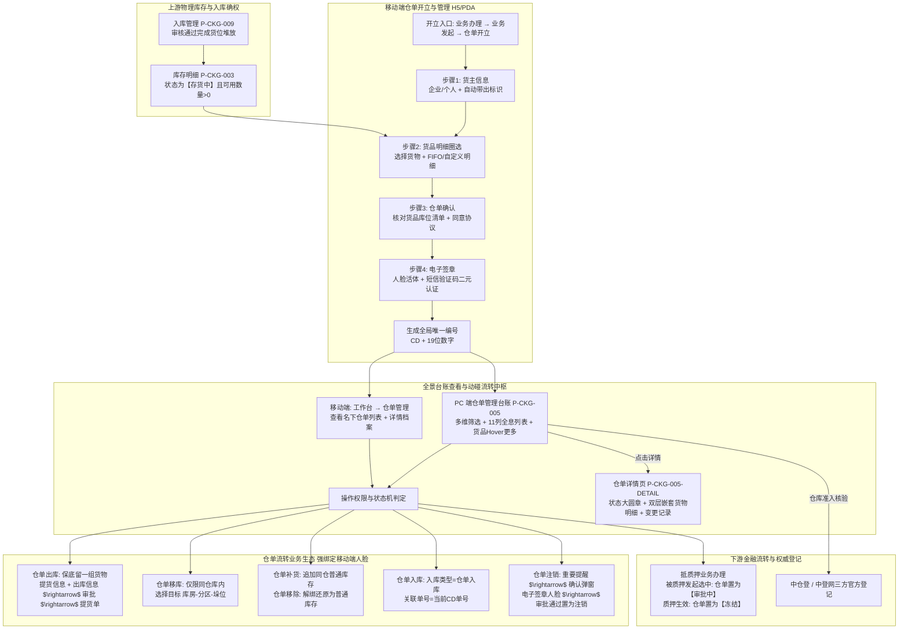

# 仓单管理主PRD

> **模块定位**：供应链金融数字资产确权、流转与全生命周期监控中枢。承接移动端实名双因子（人脸活体+短信验证码）签发开立的合规数字仓单，建立实物物理货位与法定数字货权的 1:1 防篡改映射。打通仓单出库、移库、补货、移除、入库、注销与中仓登三方登记全链路，实现仓单在抵质押融资、流转审批过程中的全流程动态追溯与强一致性风控拦截。  
> **版本**：V1.1 | **更新时间**：2026-09-09 | **责任人**：森云科技（Senyun Technology）  
> **编写依据**：[仓单管理字段清单.md](./仓单管理字段清单.md) 与 [仓单管理操作字段清单索引.md](./操作字段清单/操作字段清单索引.md) 是本模块所有字段定义、枚举、操作入参与展示的唯一基准；[仓单管理业务规则规格.md](./仓单管理业务规则规格.md) 是状态机、权属可用性、移动端人脸绑定、出库保底及流程互斥并发锁的唯一定义来源；[仓单管理_ASCII_列表页.md](./仓单管理_ASCII_列表页.md) 与 [仓单管理_ASCII_详情页.md](./仓单管理_ASCII_详情页.md) 是界面交互与布局的基准来源。

---

## 1. 业务背景与业务痛点

### 1.1 业务背景
在传统仓储与大宗商品供应链金融业务中，纸质仓单或简单的台账记录极易滋生虚假仓单、重复质押、货权脱节及“一货多押”等重大金融风险。
SYZC 系统建立“货-仓-金-单”四位一体穿透式风控底座：
1. **移动端合规开单**：现场仓管员/货主在移动端 **`业务办理 → 业务发起 → 仓单开立`**（`biz-init-receipt-issue`）基于真实在库未占用合规物理库存圈选货物，完成法定代表人/货主的人脸活体检测与手机短信动态码二元双因子强认证，在线签署防伪数字仓单协议（自动赋予 `CD + 19位` 全局唯一数字编码）；
2. **移动端工作台列表与 PC 端全景监管**：
   - 移动端现场用户在 **`工作台 → 仓单管理`**（`ws-receipt-mgr`）集中查看名下数字仓单列表、资产详情与状态变迁；
   - PC 端在 `02-仓储/05-仓单管理` 形成不可篡改的全量资产台账，支持中仓登三方准入认证核验；
3. **闭环流转与移动端人脸识别强绑定**：仓单进入后续抵质押、出库、移库、补货、移除、入库及注销时，系统强实时核验权属与流程互斥并发锁；所有涉及资产动碰与权属变更的操作，顶层架构强制要求通过移动端进行活体人脸识别比对核验，筑牢司法证据链。

### 1.2 核心业务痛点
1. **虚假开单与冒名签约风险**：传统模式缺乏开单当事人的线上法定实名意愿核验，容易出现越权冒名开具空头仓单；
2. **物理库存与仓单权属割裂**：开立仓单时若无法精确锁定底层库房、分区乃至具体垛位批次，容易导致已被其他业务占用的库存被重复打包开单；
3. **全部出库与仓单注销边界混淆**：仓单出库若允许全部提取，将导致“空壳仓单”在系统中空转，必须建立提货保底拦截与注销引导机制；
4. **多任务并发审批冲突**：缺乏单仓单流转流程的原子互斥机制，若同时发起出库与移库审批，极易导致底层物理库存超扣或状态撕裂。

---

## 2. 功能范围 (Scope)

| 包含功能 (In Scope) | 不包含功能 (Out of Scope) |
| :--- | :--- |
| - **移动端双入口闭环架构**：   1. **仓单开立入口**：移动端位于 **`业务办理 → 业务发起 → 仓单开立`**（`biz-init-receipt-issue`），分步录入货主、按 FIFO 或自定义精细圈选可用货位批次、人脸活体+短信二元强认证后生成 `CD` 仓单；PC 端右上角提供扫码直达二维码；   2. **查看仓单列表入口**：移动端位于 **`工作台 → 仓单管理`**（`ws-receipt-mgr`），现场仓管员/监管员/货主在此查看名下仓单列表、全息档案并直接发起出库、移库、补货、移除、注销等动碰业务； - **移动端全业务人脸闭环架构**：设计的所有仓单动碰与流转业务（开立、补货、出库、移库、移除、注销）均涉及法律物权事实，强制要求当事人活体人脸识别，因此所有动碰流转必须在移动端（手机/PDA）完成，PC 端提供指引或扫码联动； - **PC 端多维组合检索**：支持仓单编号精确/模糊、开立时间范围、存货人/持有人/货品综合搜索、仓库权限单选、货品大类单选+品类多选模糊搜索、三方登记单选、状态多选、制单人与制单时间过滤； - **资产全息列表（11 列）**：涵盖仓单编码、存货人(货主名称及标识)、持有人(名称及标识)、仓库名称、货物名称（前 2 条折叠展示，Hover【更多...】弹窗展现全量）、开立时间、仓单状态、三方登记、制单人与制单时间、操作列； - **操作能力矩阵（最新基准）**：   1. `注销`、`冻结`、`审批中`：严格仅允许 **【查看详情】**、**【下载】**；   2. `正常` 状态（存货人与持有人一致或不一致）：**【详情】**、**【仓单补货】**、**【仓单出库】**、**【仓单入库】**、**【仓单移库】**、**【仓单移除】**、**【注销】**、**【下载】** 全部 8 项操作均可用； - **仓单出库保底与出库单联动（R-DWR-07）**：出库时必须至少保留一组货物，若全选则强拦截弹窗引导走注销流程；录入提货人与出库信息后提交，审批通过联动生成提货单； - **仓单移库同仓物理转移（R-DWR-08）**：勾选货物后选择同仓库的目标【库房-分区-垛位】，严禁跨仓库移库； - **仓单补货与仓单移除（R-DWR-09）**：补货用于向该仓单追加同仓未占用普通库存；移除用于将仓单内货物解绑还原为普通库存（不发生实体出库）； - **仓单入库（R-DWR-10）**：点击后发起入库流程，入库类型自动锁定为 `仓单入库`，关联单号自动锁定为当前仓单编号； - **仓单注销全流程（R-DWR-11）**：重要提醒 $\rightarrow$ 二次确认弹窗 $\rightarrow$ 电子签章人脸认证 $\rightarrow$ 生成审批流，通过后仓单彻底作废不可用； - **流程并发互斥锁（R-DWR-04）**：同一仓单下，【补货/出库/移库/注销】流程在途仅限 1 个，并发发起时强拦截并弹出 Toast 提示； - **仓单全息档案详情页（P-CKG-005-DETAIL）**：顶部复制单号、四大状态实心大圆章、四行结构化基础信息、下半区【货物明细】双层嵌套折叠展开表格与【变更记录】审计流水； - **多租户与仓库权限严格隔离**：严格按当前登录人员数据权限过滤可见仓单。 | - **PC 端脱离人脸直接生效动碰单据**：严禁在 PC 端绕过移动端人脸识别强认证直接审批生效仓单流转； - **出库提取全部仓单货物**：严禁通过仓单出库清空仓单，全部提取必须走仓单注销流程； - **跨仓库移库**：严禁跨越实体监管仓库进行仓单移库； - **物理货位脱节开单**：严禁脱离底层库房、分区及批次进行无实物虚构开单； - **篡改存货条码**：批次关联的存货条码由入库时固化生成，仓单生命周期内只读引用，不可手工篡改； - **突破流程互斥并发提交**：严禁在已有审批在途时强行绕过拦截并发提交另一流转单据。 |

---

## 3. 模块定位与系统链路

---

## 4. 业务场景与用户故事

| 场景编号 | 业务场景 | 触发角色 | 核心交互与风控约束 | 业务价值 |
| :--- | :--- | :--- | :--- | :--- |
| **S01** | 移动端现场实名开具电子仓单 | 货主 / 现场仓管员 | 登录移动端进入 `业务发起 → 仓单开立`，选择个人货主“原原李”；在选择货物中圈选生鲜仓库“西瓜5公斤、辣椒10斤”；核对无误后进行活体人脸识别，输入收到的短信动态验证码，签署电子仓单。系统生成 `CD20967...` 仓单并同步至 PC 端台账。 | 确保开立意愿真实合法，从源头杜绝虚假与空头仓单。 |
| **S02** | 仓单部分提货出库与全部提货强拦截 | 仓管员 / 提货经办人 | 仓管员在移动端进入【仓单出库】，平铺展示仓单下 5 组香蕉货物。仓管员若尝试勾选全部 5 组货物，系统强弹出弹窗提示：“仓单提货仅支持部分提取，若您需要提取仓单内所有货物，请发起仓单注销流程！”点击【我知道了】停留在当前页；仓管员改为勾选其中 2 组，点击【下一步】录入提货人信息（个人/企业、姓名、身份证号、电话、车牌号）及出库信息（出库日期、备注、现场照片），提交发起出库审批。 | 保护仓单资产底线，防止非注销流程导致的空头仓单空转。 |
| **S03** | 仓单同仓移库与跨仓违规拦截 | 仓储调度员 | 仓管员因库区整理需转移仓单下货位，点击【仓单移库】。系统列出仓单货物，仓管员勾选拟移动的批次后，目标位置选择联动控件仅列出当前实体仓库内的库房、分区及具体垛位。系统严禁跨仓库移库，提交后进入移库审批流。 | 保证物理存货移位合规受控，严防私自调仓脱管。 |
| **S04** | 仓单资产补货追加与解绑移除 | 资产管理岗 / 货主 | 货主为提升仓单资产估值，点击【仓单补货】，系统展示其在同仓名下未占用的合规普通库存，勾选后打包追加进仓单；若货主需取回部分货物自由流转，点击【仓单移除】，选定货物解绑后恢复为【存货中】可用库存，不发生物理实体出库。 | 灵活满足供应链金融存货动态资产包管理诉求。 |
| **S05** | 仓单注销严谨签署与不可逆作废 | 监管经理 / 资方代表 | 仓单履约完毕或需全部提货，点击【仓单注销】。系统展示【重要提醒】页面，点击下一步弹出二次确认弹窗：“您是否仔细阅读重要提醒，且已知晓仓单注销后果！若您已确认并仍需注销仓单，请点击继续！”，经办人点击【继续】进入电子签章进行人脸活体认证，提交后进入审批流。审批通过后仓单彻底作废，系统内所有质押、融资业务均不可再选中该仓单。 | 打造司法级严密的资产注销与终审防篡改闭环。 |

---

## 5. 状态机与动作能力矩阵

### 5.1 仓单四态生命周期定义
* **`审批中`**：**核心业务规约**——特指仓单已被抵/质押业务申请在前端圈选并占用，正在抵质押审批流程中尚未正式生效。此时仓单处于质押预锁定保护状态；
* **`正常`**：仓单已合法生效开立，资产权属明晰，底层货物未被冻结或质押占用；
* **`冻结`**：抵质押审批通过后正式生效质押、或受司法查封冻结。此时资产限制流转；
* **`注销`**：仓单所载货物已全额提货出库完毕、或由监管方/货主经多重确认与电子签章审批注销作废。

### 5.2 操作按钮能力矩阵（严格执行最新基准规则）

| 仓单状态 | 存货人与持有人关系 | 实际展示的操作按钮（列表行操作） | 按钮视觉呈现 | 互斥与前置风控拦截 |
| :--- | :--- | :--- | :--- | :--- |
| **正常** | **一致或不一致** （全部适用） | **详情、仓单补货、仓单出库、仓单入库、仓单移库、仓单移除、注销、下载** | 8 个按钮全量黄色文字链接高亮可用（分三排展示） | **1. 单流程在途互斥锁**：受 `R-DWR-04` 约束，同一仓单在途流程仅限 1 个； **2. 移动端人脸识别强绑定**：涉及资产动碰的业务（开立/补货/出库/移库/移除/注销）必须进行活体人脸识别，故实际业务发起与签约必须在手机端完成，PC 端提供指引或扫码联动 |
| **审批中** | — | **详情、下载** | 严格仅展示两个黄色高亮文字链接 | 被抵质押申请预锁定中，禁止任何物理动碰操作 |
| **冻结** | — | **详情、下载** | 严格仅展示两个黄色高亮文字链接 | 质押生效中，禁止发起出库、移库、补货、移除与注销 |
| **注销** | — | **详情、下载** | 严格仅展示两个黄色高亮文字链接 | 终态归档凭证，仅供穿透查阅与打印下载 |

---

## 6. 页面交互规格索引

本模块包含 PC 端列表台账、移动端扫码开立引导弹窗及 PC 端独立详情页：

### 6.1 仓单管理 — 列表页（`P-CKG-005`）
- **对应文档**：[仓单管理_ASCII_列表页.md](./仓单管理_ASCII_列表页.md)
- **核心规格**：
  - 两排筛选区：仓单编号、开立时间范围、存货人/持有人/货品综合模糊搜索、仓库下拉（权限隔离）、货品名称（大类单选+品类多选）、三方登记单选、状态多选（含审批中）、制单人与制单时间；
  - 核心表格（11 列）：序号、仓单编码、存货人(货主名称及标识)、持有人、仓库名称、货物名称（折叠前 2 条，Hover【更多...】呼出 Popover）、开立时间、仓单状态、三方登记、制单人、操作；
  - 右上角【仓单开立】按钮：点击弹出移动端扫码开单引导弹窗。

### 6.2 仓单管理 — 详情页（`P-CKG-005-DETAIL`）
- **对应文档**：[仓单管理_ASCII_详情页.md](./仓单管理_ASCII_详情页.md)
- **核心规格**：
  - 顶部 Header：仓单编号 + 一键复制图标，右上角【返回】按钮；
  - 状态大圆章：审批中（金黄）、正常（绿）、冻结（深灰）、注销（深灰）；
  - 基础信息卡片：制单人/时间、存货人及标识/开立时间、持有人及标识、仓库名称/注销时间；
  - 双 Tab 切换：
    - **货物明细 Tab**：一级货品汇总行展开二级批次明细表格（位置、具体位置、入库时间、其他收集信息、存货条码二维码弹窗、状态【仓单中】、开立数量）；
    - **变更记录 Tab**：时间轴/流水表格，记录开立、补货、出库、移库、移除、注销等流转历史与凭证下载。
