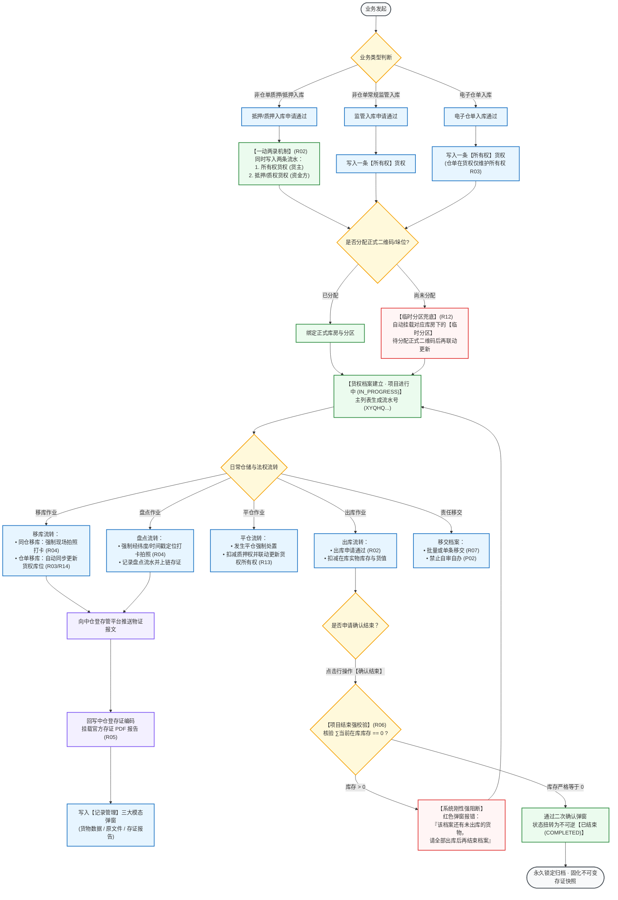
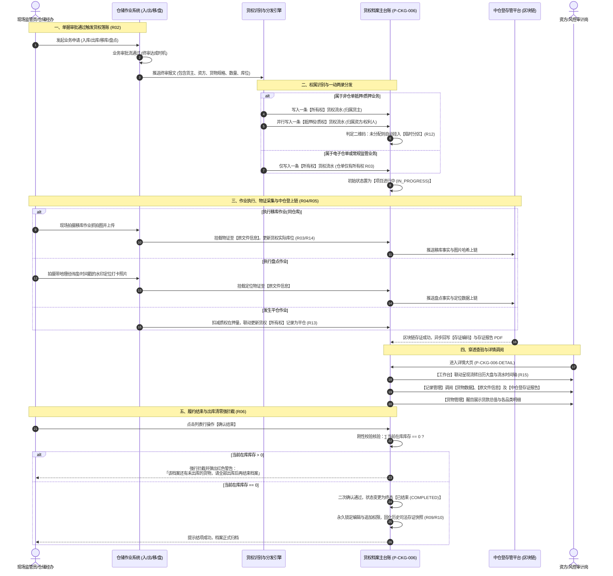
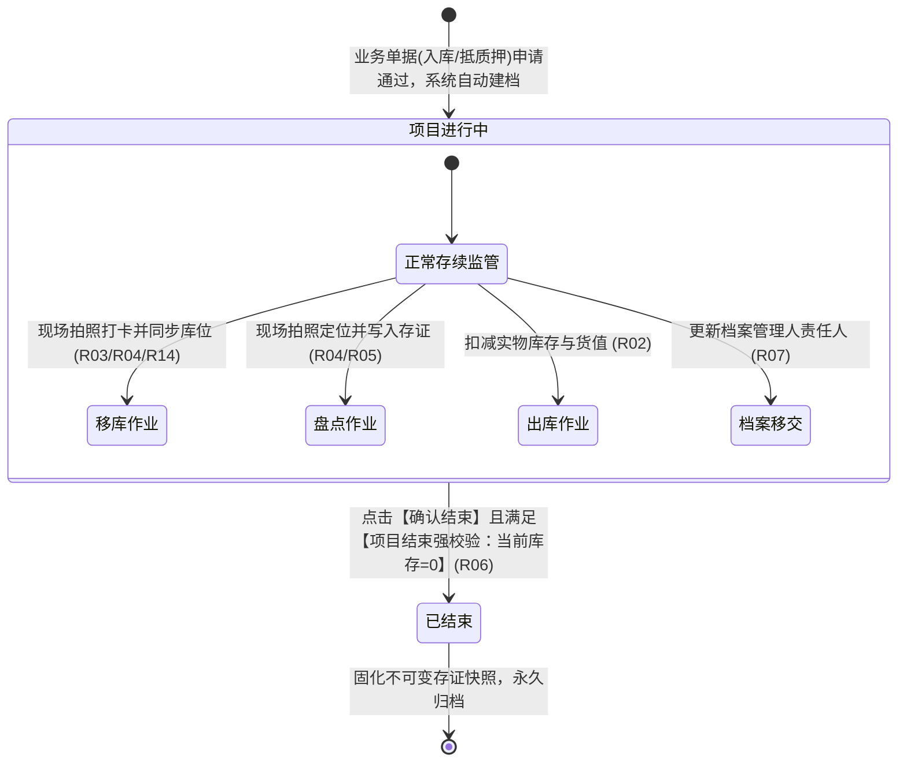

# 货权档案业务规则规格

> **文档定位**：仓储 / 货权管理 / 货权档案模块状态机生命周期、业务动作权限矩阵、前置校验规则、跨模块触发驱动机制以及数据核算逻辑的**唯一定义真源**。主 PRD、字段清单及端侧原型仅引用本文件规则编号（R01~R15, C01~C03, P01~P03），不重复定义规则本体。  
> **模块类型**：基础档案与法权监管中枢台账类（包含权属建立、一动两录流水分发、现场物证抓拍挂载、中仓登上链存证闭环、档案移交及确认结束清零强校验归档）  
> **参考文档**：[《货权档案主PRD》](./货权档案主PRD.md)、[《货权档案字段清单》](./货权档案字段清单.md)、[《出库记录业务规则规格》](../10-出库管理-出库记录/出库记录业务规则规格.md)、[《货物盘点业务规则规格》](../16-货物盘点/货物盘点业务规则规格.md)  
> **版本**：V1.2 | **更新时间**：2026-09-16 | **责任人**：森云科技（Senyun Technology）

---

## 一、单据与能力定位

| 项目 | 规格内容 |
| :--- | :--- |
| **单据层级** | **【第2层-权属控制与法权台账层】**（全平台存货抵质押与仓储监管法权主干档案） |
| **核心职责** | 统筹存货在监管周期内的法定物权归属，实现“三权分立”（所有权、抵押权、质权）；贯穿记录出入库、移库、盘点全流程作业流水；挂载现场拍照打卡物证与中仓登区块链存证报告；保障档案终结前实物库存必须归零出库。 |
| **单据来源** | **系统事件驱动生成**： 1. **非仓单抵质押业务**：在抵押申请或质押申请终审通过时，系统自动创建对应的抵押权/质权档案，并同步建立所有权档案； 2. **非仓单监管业务**：在监管申请通过时，自动建立所有权档案； 3. **电子仓单业务**：仓单入库申请通过时，自动生成所有权档案（仓单不设抵质押档案）。 |
| **上游依赖** | **客户主体档案**：提供出质人、质权人企业统一社会信用代码或个人身份证号； **仓库基础档案**：提供监管仓库、库房及分区实体信息； **仓储作业单据**：入库单、出库单、移库单、盘点单审批通过事件。 |
| **下游影响** | **中仓登存证平台**：推送作业单据与抓拍图片，生成区块链存证编码与 PDF 报告； **风控预警引擎**：实时监控抵质押货物的在库价值、货位异动与预警流转； **司法审计中心**：提供全生命周期不可篡改的时间轴存证凭据。 |
| **归档台账边界** | **【进行中活跃监管与已结束终态归档】**：主列表展示所有已创建的货权档案；通过【确认结束】将实物已结清的档案永久归档为只读终态。 |
| **入口分流** | PC 列表查询：工作台 → 仓储 → 货权管理 → 货权档案；PC 详情查看：列表行操作【查看】。 |

---

## 二、数量与库存计算口径隔离表

| 口径名称 | 存在位置 | 业务含义与计算公式 | 约束与边界条件 |
| :--- | :--- | :--- | :--- |
| **当前库存** | 货物管理明细行 / 列表核验 | 某规格货品当前实际物理在库的有效净额数量 | 计算公式：$\text{当前库存} = \sum \text{入库数量} - \sum \text{出库数量}$；必须 $\ge 0$ |
| **单价** | 货物管理明细行 | 该货品在系统中核算的公允结算基准单价 | 金额数值；表头附带信息提示（ℹ️）；未定价时展示为空或 `--` |
| **当前货值** | 货物管理明细行 | 单规格货品当前在库的评估总金额 | 计算公式：$\text{当前货值} = \text{当前库存} \times \text{单价}$；保留两位小数 |
| **货款总值** | 货物管理顶部指标 | 档案项下所有已定价在库存货的估值总和 | 计算公式：$\text{货款总值} = \sum_{i=1}^{n} \text{当前货值}_i$；红色加粗大字展示 |
| **现有货物种类** | 货物管理顶部指标 | 档案项下当前在库实物库存 $>0$ 的独立货品规格去重总数 | 整数；实物库存全部出库结清后种类数归零 |
| **涉及入库次数** | 货物管理明细行 | 首次建档以来该货品累计执行已生效入库的总单据数 | 仅统计状态为已通过的终态入库单据 |
| **涉及出库次数** | 货物管理明细行 | 首次建档以来该货品累计执行已生效出库的总单据数 | 仅统计状态为已核销的终态出库单据 |
| **变更数量** | 记录管理【货物数据】弹窗 | 该单据作业实际引起该库位货品变动的实物数量 | 带物理计量单位，如 `7(箱)`；入库为正向增加，出库为反向扣减 |

---

## 三、全景业务时序与流转架构

### 3.1 货权全生命周期端到端流转全景图

### 3.2 货权全生命周期端到端时序交互图

---

## 四、全业务作业与货权三板块（档案/公示/证据）数据互通映射总表

本章确立系统在面对各类业务单据与操作事件时，底层同时向**【06-货权档案】**、**【07-货权公示】**与**【08-证据管理】**分发报文与更新数据的标准规范：

| 业务作业动作 | 触发时机与前置条件 | 【06-货权档案】更新行为 (物权/库存/货值) | 【07-货权公示】更新行为 (确权牌/公示状态) | 【08-证据管理】更新行为 (存证类型/数量符号/物证) |
| :--- | :--- | :--- | :--- | :--- |
| **普通入库** | 入库单终审通过 | 写入一条【所有权】流水；增加货品当前库存与货值；未分配二维码入【临时分区】 | 同步初始化一条记录，公示状态置为【未公示】，公示登记编号为空 | 生成一条存证类型=【入库】流水；变更数量为**正数**（如 `+500(吨)`）；关联单据快照 |
| **质押/抵押入库** | 抵质押入库单终审通过 | **【一动两录】(R02)**：同时写入一条【所有权】流水（货主）和一条【质权/抵押权】流水（资方）；增加在库库存与货值 | 同步初始化一条记录，公示状态置为【未公示】，支持后续生成货权牌与中登网文案 | 生成一条存证类型=【入库】或【质押/抵押】流水；变更数量为**正数**；挂载质押合同单号 |
| **转让入库** | 货物转让单终审通过 | 受让方在原储位确立新【所有权】货权档案；初始化受让方库存与货值 | 为新货主档案同步初始化一条【未公示】记录 | 生成一条存证类型=【入库】（转让来源）流水；数量为**正数**；关联转让单号 |
| **加工产出入库** | 加工记录点击【完成加工】 | 产出货品入库；若为质押/抵押加工，新条码**无缝继承原抵押/质权档案**与估值 | 若原质押单已公示则继承公示关联；未公示保持未公示 | 生成一条存证类型=【入库】（加工产出）流水；数量为**正数**；关联加工单号 |
| **普通出库 / 仓单出库** | 出库单终审通过 (已核销) | 扣减对应货品在库库存与货值；流水记录出库事实 | 暂不变更公示台账状态；当档案在库库存归零时允许后续闭环 | 生成一条存证类型=【存货出库】流水；**变更数量强制带负号 『-』**（如 `-1(斤)`） |
| **质押/抵押出库** | 满足解押条件且出库通过 | 双向扣减：扣减抵质押权在押明细并同步扣减所有权实物库存与货值 | 保持当前公示状态不变；待全部结清后随主档案归档 | 生成一条存证类型=【存货出库】流水；**变更数量强制带负号 『-』**（如 `-50(箱)`） |
| **同仓移库** | 移库单终审通过且作业完成 | 即时更新该货品物理存放库位（仓库-库房-分区）；仓单移库同步更新货权位置 | 货权牌制作表单中的【存放地点】自动更新最新库位路径 | 生成一条存证类型=【移库】流水；**强制挂载现场抓拍移库作业照片原文件**；推送中仓登上链 |
| **跨仓移库** | 移库单终审通过且完成调拨 | 扣减原仓库档案库存，移入新仓库并为新仓建立对应货权档案 | 新仓库档案同步生成新的对应公示记录行 | 分别生成移出库（负数）与移入库（正数）存证流水 |
| **货物盘点** | 盘点单审核通过 | 正常平盘不改变库存；若盘盈/盘亏，按盘点结果调整在库库存与货值 | 保持当前公示状态不变 | 生成一条存证类型=【盘点】流水；**强制挂载现场定位打卡水印照片原文件**；推送中仓登上链 |
| **货物在仓转让** | 货物转让单终审通过 | 原货主【所有权】扣减核销（生成转让出库流水）；不改变物理储位 | 原货主公示记录标记转让流转；新受让方建立新公示记录 | 生成一条存证类型=【其他】（转让事实）存证，固化双方二元核验证据 |
| **质押/抵押开立** | 抵质押业务办理终审生单 | 在档案中建立法定【抵押权】或【质权】台账，锁定在押资产 | 同步进入公示台账，激活【生成系统货权牌】与【中登网登记】 | 生成一条存证类型=【质押】或【抵押】存证；固化初始授信与质押明细 |
| **加仓 / 补仓** | 质押履约补仓审核通过 | 增加质权在押清单货品与货值，提升质押率安全边际 | 可重新生成货权牌，版本号 Version 递增 | 生成一条存证类型=【加/补仓】流水；数量为**正数** |
| **风控强制平仓** | 触发风控平仓处置并通过 | **【非仓单平仓更新货权所有权】(R13)**：扣减质权在押量，并同步更新所有权记录为平仓，扣减库存 | 保持公示历史快照不可变，记录处置事实 | 生成一条存证类型=【平仓】流水；**变更数量强制带负号 『-』** |
| **解押 / 解监管** | 借款还清，解押审核通过 | 释放抵押权/质权担保物权锁定，恢复为普通所有权存货 | 公示记录标记解押，终止质押公示效力 | 生成一条存证类型=【解质押】、【解抵押】或【解监管】流水；变动量为 0 |
| **生成/更新货权牌** | 用户在公示页点击确认生成 | 在工作台日历记录【货权牌记录】事件；记录管理增加一条流水 | 固化系统货权牌或中仓登货权牌牌面快照，版本递增 | 生成一条存证类型=【货权牌记录】流水；**挂载生成的货权牌告示牌高清图片原文件** |
| **中仓登公示回调** | 中仓登存管接口审核通过 | 记录管理回写中仓登存证编码并挂载官方存证 PDF 报告 | **状态流转为【已公示】**；回写公示登记编号；操作列激活中仓登货权牌与第三方查验直连 | 存证报告弹窗挂载官方 PDF 证书；固化区块链存证编码 |
| **档案确认结束** | 点击【确认结束】且库存=0 | **【项目结束强校验】(R06)**：$\sum \text{库存}=0$ 方可流转为终态【已结束】；永久锁定只读 | 随主档案归档为历史记录，禁止再编辑生成货权牌 | 生成一条存证类型=【结束货权】流水；**货物列统一展示为空** |

---

## 五、档案状态机与流转定义

### 5.1 状态定义

| 状态名称 | 状态编码 (`Enum`) | 业务含义 | 是否终态 | 允许执行的操作 | 出现与流转说明 |
| :--- | :--- | :--- | :---: | :--- | :--- |
| **项目进行中** | `IN_PROGRESS` | 档案处于正常监管期，在库货物存续并允许发生作业流转 | 否 | 查看详情、单条移交档案、批量移交、增量落账作业流水、发起确认结束 | 业务单据申请通过时系统自动创建并赋予此初始状态 |
| **已结束** | `COMPLETED` | 档案项下所有货物已完全出库结清，经人工核实后完结归档 | **是** | 查看详情、调阅历史原文件、调阅存证报告（全只读） | **【不可逆终态】**。强校验库存为 0 后流转达成，禁止再变更 |

### 5.2 状态流转图

---

## 六、动作能力与流转控制矩阵

| 触发动作 | 操作入口 | 适用角色 | 前置业务校验条件 | 目标状态 | 联动后置影响 | 失败阻断提示 (浮窗提示 / 警告弹窗) |
| :--- | :--- | :--- | :--- | :---: | :--- | :--- |
| **系统自动建档** | 业务单据终审通过 | 系统底层引擎 | 入库单或抵质押业务申请终审通过 | **项目进行中** | 初始化货权档案，生成流水号，首笔流水落账 | — |
| **批量移交** | 列表右上角按钮 | 仓储主管/管理员 | 至少勾选 1 行数据；目标人员状态启用 | 项目进行中 | 批量更新档案管理人字段，写入审计日志 | 「请至少选择一条需要移交的档案」 「请选择接收档案操作员」 |
| **单条移交档案** | 列表行操作【移交档案】 | 仓储主管/经办人 | 目标档案操作员状态为“启用” | 项目进行中 | 更新该行档案管理人字段，写入审计日志 | 「请选择接收档案操作员」 |
| **确认结束** | 列表行操作【确认结束】 | 仓储操作员/主管 | **核心强校验**：档案项下所有货品当前在库库存合计严格等于 0（R06） | **已结束** | 状态变更为已结束，锁定档案全部权限，不可撤销 | **「该档案还有未出库的货物，请全部出库后再结束档案」** |
| **查看详情** | 列表行操作【查看】 | 全具备查看权限角色 | 档案记录有效存在 | 当前状态保持 | 进入详情大页，默认高亮【工作台】标签页 | — |
| **调阅货物数据** | 记录管理行【详情】 | 具备详情查看权限角色 | 单据流水包含受影响货品明细 | 当前状态保持 | 居中呼出【货物数据】模态弹窗，列示变更数量 | — |
| **调阅现场原文件** | 记录管理【查看源文件】 | 具备物证查看权限角色 | 该流水包含现场抓拍或打卡照片 | 当前状态保持 | 居中呼出【原文件信息】模态弹窗，支持防盗链安全预览与下载 | 「暂无相关原文件凭据」 |
| **查验中仓登报告** | 记录管理【存证报告】 | 资方/风控/经办人员 | 中仓登存证已上链且生成 PDF 证书 | 当前状态保持 | 呼出【存证报告】模态弹窗，调阅区块链电子存证报告 | 「存证报告生成中，请稍后查看」 |

---

## 七、核心业务规则清单 (R01 ~ R15)

### 1. 权属类型与单据驱动规则

### 【三权分立与权属类型划分】(R01)
* 针对同一笔抵质押业务，系统严格区分法定权属类型：
  1. **所有权（`OWNERSHIP`）**：标的物法定所有权主体，适用于货主自营、常规监管、仓单入库及抵质押业务中的货主权益端；
  2. **抵押权（`MORTGAGE`）**：债权人享有的抵押担保物权，适用于非仓单货物抵押贷款订单审核通过时建立；
  3. **质权（`PLEDGE`）**：债权人移交监管占有形成的法定质押担保物权，适用于非仓单货物质押融资业务审核通过时建立。

### 【申请通过触发时机与一动两录机制】(R02)
* **触发时机规范**：所有仓储作业对货权档案的增量写入与扣减，其触发节点**严格以业务单据「申请通过」为准**，彻底废止原“分配二维码”或“核销成功”时机；
* **抵质押一动两录**：非仓单类型的抵质押货物，用户在前端发起入库申请通过时，货权管理系统底层必须**同时并行增加两条记录**：
  1. 一条所有权货权记录（货主资产维度）；
  2. 一条抵质押权货权记录（资方优先受偿维度）。出库申请通过时同样执行双向权益联动扣减。

### 【仓单权属单一性与移库库位同步机制】(R03)
* **仓单权属单一性**：电子仓单在货权档案中**仅维护「所有权」记录**，不单独设立抵质押权档案；
* **移库位置同步联动**：当仓单发生监管移库或抵质押移库时（即使是在同一个仓库内的不同库房/分区之间调拨），仓单系统必须向货权系统推送移库事件，将货权档案中的对应货品存放位置同步更新为移库后的最新库位，杜绝“仓单位置已变更而货权档案仍停留在原分区”的数据脱节。

### 2. 现场物证采集与区块链存证闭环

### 【现场抓拍与打卡物证挂载规则】(R04)
* 仅以下两类特定现场作业环节，系统强制要求采集现场照片与定位凭证，并自动归档至详情页【记录管理】的【原文件信息】中：
  1. 非仓单货物抵押/质押的**「移库（同仓库）」**：必须上传现场移库作业抓拍图片；
  2. 非仓单货物抵押/质押的**「货物盘点」**：必须上传带有地理经纬度与时间戳水印的现场定位打卡照片。
* 其余补仓、置换、提货环节若无现场物证，原文件信息列表保持为空，不阻断正常流水记录。

### 【中仓登区块链上链存证规则】(R05)
* 凡符合中仓登登记要求的大宗动产质押业务，现场凭证上传并审核通过后，系统异步向中仓登区块链存证平台发送上链存证请求；
* 上链成功后，系统自动向货权记录回写**中仓登存证编码**，并在行操作【存证报告】中挂载权威认证的电子存证 PDF 报告，支持在线调阅与核验。

### 3. 生命周期闭环与责任人移交

### 【项目结束强校验与未出库清零阻断】(R06)
* **二次确认与风险告知**：当操作人员在主列表点击【确认结束】时，居中弹出【提示】二次确认模态弹窗：
  - **提示文案**：*「您正在进行项目结束操作，项目结束成果该档案状态更新为已结束，状态将不可恢复，请确认是否继续？」*
  - **交互按钮**：【取消】与【确定】；
* **前置刚性完整性强校验**：点击【确定】时，系统在前台交互与后台接口同时执行核心强校验：
  $$\text{核验公式}：\sum \text{当前在库实物库存} = 0$$
* **校验阻断分支**：若 $\sum \text{当前在库实物库存} > 0$（即档案项下仍有货物未全部出库结清），系统强行终止提交流程，界面居中弹出红色错误提示：
  > **「该档案还有未出库的货物，请全部出库后再结束档案」**
* 只有全部货物均已出库结清（库存严格为 0），才允许通过校验，将项目状态正式扭转为不可逆终态【已结束】。

### 【档案移交与责任人继承规则】(R07)
* 列表支持单行点击【移交档案】与多选勾选后点击右上角【批量移交】；
* 移交弹窗中，【当前档案操作员】展示当前记录的档案管理人姓名（置灰只读）；
* 【将档案移交至】为强制必填项，下拉框仅列出系统中状态为启用的档案操作员账号；
* 提交成功后，所有被选档案的【档案管理人】字段同步更新，并向系统审计流水写入移交前后的操作人与时间戳。

### 【多货品品名拼接规则】(R08)
* 当同一档案项下包含多个规格或品类的货物时，列表页【货物品名】列采用纯文本拼接展示，多个品名之间使用半角逗号分隔（如：`冻货-烤翅,冻货-牛肉丸`）；
* 详情页【货物管理】中则分行独立列示各货品的明细数据与库存值。

### 【不可逆终态保护规则】(R09)
* 货权档案一旦通过确认结束流转为【已结束】状态，即进入永久归档终态；
* 系统禁止任何角色对已结束的档案发起移交、编辑、追加流水或撤销操作，历史数据永久固化。

### 【历史字段不可变快照规则】(R10)
* 业务记录审批通过时所固化的货主主体、货品单价、入库库位及经办人账号，均为当时业务时点的不可变快照，后续基础主档更名或单价调整不回写已归档的业务记录。

### 【外部接口多货品合集与数量求和规则】(R11)
* 针对对接外部大宗商品或仓储监管系统（如鲁浪接口）时，系统支持多货品数据报文传输与自动解析；
* **品名拼接**：多货品品名采用标准化半角逗号拼接；
* **合集数量规则**：在监管档案的合集展示或报文汇总中，**多货品的数量不管计量单位异同，只进行数值合集求和**（如 500箱与20吨在合集项下汇总为 520），明细行中仍保留原规格和各自物理计量单位。

### 【未分配二维码库房临时分区兜底规则】(R12)
* 若货物入库或移库时尚未分配具体货垛或二维码，系统自动在对应库房下启用【临时分区】：
  - **分区名称**：`临时分区`；
  - **所属库房**：`{{上级库房}}`；
  - **状态**：`启用`；
  - **备注信息**：`系统创建`；
* 作为资产过渡库位，待分配正式垛位二维码后再联动更新对应分区，防止数据悬空。

### 【非仓单平仓更新货权所有权规则】(R13)
* 当非仓单货物进行抵押或质押监管时，若发生风控强制平仓行为，系统不仅在抵质押权侧扣减在押明细，还必须**同步向货权档案分发事件，更新对应的货权所有权记录**，事项分类记录为【平仓】，实现法权与实物双向扣减。

### 【仓单移库联动更新货权存放位置规则】(R14)
* 当仓单进行监管、抵质押时，若发生移库行为（包括同仓库不同分区调拨或跨仓调拨），系统必须向货权档案推送移库更新报文，将货权档案所有权对应的货物存放位置即时更新为移库后的最新库位，杜绝“仓单已移而货权未动”导致的位置脱节风险。

### 【工作台日历大盘与流水时间轴联动规则】(R15)
* 详情大页标签页 1【工作台】中心日历按天汇总当月作业事实，以红色文字气泡形式展示（如“档案建立”、“盘点记录(1)”、“质押记录(1)”、“提货记录(1)”）；
* 点击日历中的特定日期，右侧流水时间轴联动过滤并倒序展示该日期的全量作业卡片（含作业时间、流水号、货物、库房及分区）。

---

## 八、计算公式与核算恒等式 (C01 ~ C03)

### 【货款总值核算恒等式】(C01)
* 单品当前货值计算：
  $$\text{单品当前货值} = \text{当前库存数量} \times \text{基准单价}$$
* 货款总值（详情页货物管理看板）：
  $$\text{货款总值} = \sum_{i=1}^{n} \text{单品当前货值}_i$$
  *注：金额单位为元，默认保留两位小数，四舍五入。若单品未定价，则单品货值展示为空或 `--`，不计入货款总值。*

### 【现有货物种类去重统计】(C02)
$$\text{现有货物种类} = \text{Count}(\text{Distinct}(\text{货品规格ID})) \quad \text{其中当前库存} > 0$$

### 【出入库频次累计计算】(C03)
* **涉及入库次数**：$\text{入库次数} = \sum \text{已通过入库单据数}$；
* **涉及出库次数**：$\text{出库次数} = \sum \text{已核销出库单据数}$。

---

## 九、数据权限与风控控制规则 (P01 ~ P03)

### 【租户与仓库数据物理隔离】(P01)
* 用户进入货权档案页面时，系统严格根据当前登录账号所属的租户及所授权管辖的监管实体仓库，进行底层数据过滤；
* 严禁越权查看或操作非授权仓库与非管辖机构的货权档案。

### 【自审自办风险防范】(P02)
* 经办档案移交的人员不能将档案移交给自己（当且仅当接收人与当前档案操作员不一致时允许提交）。

### 【司法存证完整性防护】(P03)
* 记录管理中的【查看源文件】与【存证报告】，采用私有对象存储（OSS）临时安全签名技术，防范外部非法爬取与外链盗链；
* 中仓登存证编码与存证报告哈希值强校验，保障在司法举证场景下的法律有效性。

---

## 十、修订记录

| 日期 | 版本 | 变更内容说明 | 影响范围 | 修订人 |
| :--- | :--- | :--- | :--- | :--- |
| 2026-09-16 | V1.0 | **建立货权档案最新基准版业务规则规格**：规范三权分立、申请通过触发、一动两录、仓单单一性、R01~R12 核心业务规则矩阵及清零强阻断 R06。 | 货权档案全模块 | AI PM / 森云科技 |
| 2026-09-16 | V1.1 | **全业务作业与货权三板块数据互通总表确立**： 1. 新增【第四章】全业务作业与货权三板块（档案/公示/证据）数据互通映射总表（17 种业务事件更新行为）； 2. 规范入库正数出库强制带负号 『-』、平盘/解押为 0； 3. 明确同仓移库与盘点经纬度水印打卡照片挂载至原文件信息。 | 货权三板块及仓储全业务联动 | AI PM / 森云科技 |
| 2026-09-16 | **V1.2** | **编号语义自解释与中英文表述规范化重构**： 1. 规则、公式与权限编号全量改造为 `【规则名称】(Rxx/Cxx/Pxx)` 格式； 2. 全面汉化交互术语（Modal $\rightarrow$ 模态弹窗、Tab $\rightarrow$ 标签页、Toast/Alert $\rightarrow$ 浮窗提示/警告弹窗等），专业技术词汇规范保留 `中文（English）`。 | 全文表述规范性与测试追溯力提升 | AI PM / 森云科技 |
