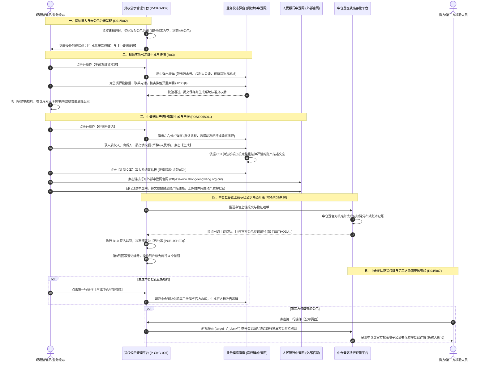
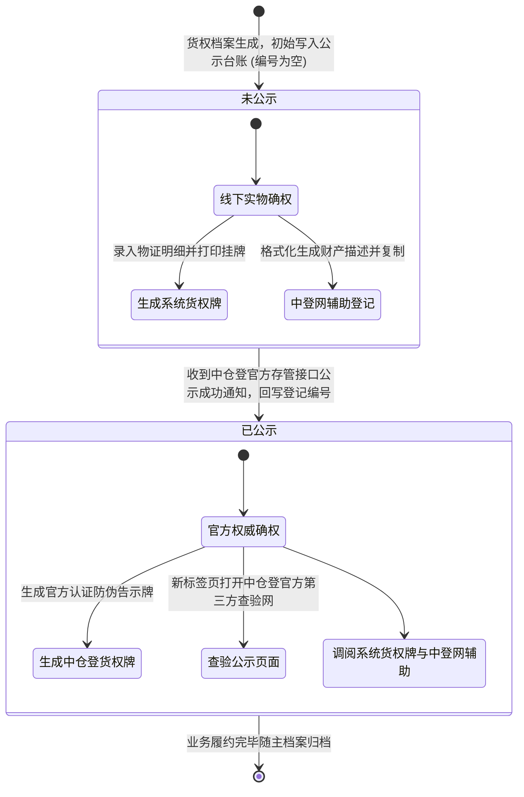

# 货权公示业务规则规格

> **文档定位**：仓储 / 货权管理 / 货权公示模块状态机生命周期、两态动作控制矩阵、前置校验规则、货权牌生成规范、中登网文本拼接算法以及第三方跳转的**唯一定义真源**。主 PRD、字段清单及端侧原型仅引用本文件规则编号（R01~R10, C01~C03, P01~P03），不重复定义规则本体。  
> **模块类型**：动产确权与法定法权对外公示台账类（包含未公示与已公示两态分流、系统货权牌生成、中登网财产描述辅助生成、中仓登认证货权牌生成及第三方查验直连）  
> **参考文档**：[《货权公示主PRD》](./货权公示主PRD.md)、[《货权公示字段清单》](./货权公示字段清单.md)、[《货权档案业务规则规格》](../06-货权管理-货权档案/货权档案业务规则规格.md)  
> **版本**：V1.2 | **更新时间**：2026-09-16 | **责任人**：森云科技（Senyun Technology）

---

## 一、单据与能力定位

| 项目 | 规格内容 |
| :--- | :--- |
| **单据层级** | **【第2层-法权公示与确权执行层】**（连接动产监管现场物理占有与法定登记公示的关键枢纽） |
| **核心职责** | 规范动产质押标的的对外公示行为；为仓库现场提供标准化、带法律郑重声明的实体/电子货权公示牌；为资方在中登网申报动产融资登记提供财产描述格式化拼接工具；实现中仓登区块链存管平台公示登记编号自动回写与官方查验网页无缝跳转。 |
| **单据来源** | **双重数据源驱动**：<br/>1. **本系统货权档案**：前序入库与抵质押业务办理审批通过后，由货权档案引擎自动同步沉淀至本公示台账；<br/>2. **中仓登接口同步**：通过中仓登存管平台接口反向接入与同步的货权记录。 |
| **上游依赖** | **货权档案台账（P-CKG-006）**：提供货权档案流水号、权利人、权属类型及在库货品规格；<br/>**仓库基础档案**：提供仓库法定注册详细地址与存放位置；<br/>**中仓登接口通知**：提供官方公示核准状态与公示登记编号。 |
| **下游影响** | **仓库现场管理**：打印或下发实体/电子系统货权牌或中仓登官方货权牌；<br/>**人行征信中登网**：为资方提供精准、标准、合规的财产描述文案，防止登记瑕疵；<br/>**司法核验中心**：点击直接跳转至中仓登官方第三方公示查验网页，取得具备公信力的法律证据。 |
| **两态分流边界** | **【未公示与已公示双态清晰分流】**：以中仓登公示状态为基准，未公示状态仅开放基础系统货权牌与中登网辅助生成；已公示状态回写登记编号并全面激活中仓登官方货权牌及第三方查验链接。 |
| **入口分流** | PC 列表查询：工作台 → 仓储 → 货权管理 → 货权公示；各行操作分别呼出专属模态弹窗或外部新开页面。 |

---

## 二、公示要素与文本生成口径隔离表

| 口径名称 | 存在位置 | 业务含义与数据规则 | 约束与边界条件 |
| :--- | :--- | :--- | :--- |
| **质押物名称** | 货权牌弹窗 / 文本生成 | 质押标的物的品名规格摘要 | 默认带出当前档案项下多品名拼接文本，允许人工按现场实际情况微调补充 |
| **质押物数量** | 货权牌弹窗 / 文本生成 | 实体货权牌公开宣告占有的实物总数量 | 文本格式，包含数值与计量单位（如 `500吨`、`1200箱`）；红星强制必填 |
| **存放地点** | 货权牌弹窗 / 文本生成 | 标的物实际物理堆放的仓库详细法定注册地址 | 默认自动带出实体仓库注册地址，支持补充到具体库房与分区 |
| **最高债权额** | 中登网登记弹窗 | 主债权担保合同中约定的最高本金担保额度 | 正数金额数值 + 币种选择器（默认人民币）；红星强制必填 |
| **质押方式** | 中登网登记弹窗 | 合同约定的质押资产核定流转（动态）或固定锁定（静态）形式 | 单选枚举：`动态质押`、`静态质押`；直接影响财产描述算法模板生成 |
| **公示登记编号** | 主列表第8列 | 中仓登存管系统官方审核通过后颁发的唯一公示流水号 | 格式如 `TESTHQDJ0T9GUE8FWA3W`；未公示状态下必须保持为空 |
| **货权牌郑重声明** | 货权牌弹窗 | 系统预设的标准法律排他占有警告声明文案 | 多行文本输入框，最大限制 200 字符；向社会公众明示优先受偿权与禁动警告 |

---

## 三、全景业务时序与流转架构

### 3.1 货权公示端到端全业务流程图

```mermaid
flowchart TD
    classDef startEnd fill:#f8f9fa,stroke:#495057,stroke-width:2px;
    classDef bizNode fill:#e7f5ff,stroke:#1971c2,stroke-width:2px;
    classDef forkNode fill:#fff9db,stroke:#f59f00,stroke-width:2px;
    classDef coreNode fill:#ebfbee,stroke:#2b8a3e,stroke-width:2px;
    classDef warnNode fill:#fff5f5,stroke:#e03131,stroke-width:2px;
    classDef extNode fill:#f3f0ff,stroke:#7950f2,stroke-width:2px;

    Start([货权建档通过]):::startEnd --> InitState["【初始写入公示台账】<br/>中仓登公示状态：未公示 (UNPUBLISHED)<br/>公示登记编号列：展示为空"]:::bizNode

    InitState --> CheckPublish{中仓登是否已公示?}:::forkNode

    %% 未公示分支
    CheckPublish -->|状态 = 未公示| StateUnpub["【未公示记录行】<br/>操作列仅渲染 2 个按钮：<br/>1. 生成系统货权牌<br/>2. 中登网登记"]:::warnNode

    StateUnpub --> ActionSysSign["【点击：生成系统货权牌】<br/>呼出制作表单：<br/>• 权利人/流水号只读锁定<br/>• 录入数量、地点、电话<br/>• 确认法定郑重声明 (≤200字 R03)"]:::bizNode
    ActionSysSign --> PrintSign["现场打印/下发系统货权牌<br/>在库区垛位现场醒目悬挂公示"]:::coreNode

    StateUnpub --> ActionZDW["【点击：中登网登记】<br/>呼出左右分栏辅助弹窗：<br/>• 左侧：权属类型/质押方式(动态/静态)<br/>• 录入：质权人、出质人、最高债权额<br/>• 点击【生成】：执行 C01 算法拼接文案<br/>• 点击【复制文案】：写入剪贴板"]:::bizNode
    ActionZDW --> ExtZDW["用户自主登录外部中登网官网<br/>(https://www.zhongdengwang.org.cn/)<br/>黏贴财产描述文案完成法定质押登记申报"]:::extNode

    %% 中仓登官方存管交互
    InitState -.->|系统异步推送存管上链报文| ZCDChain["中仓登区块链存管平台<br/>(官方审核与数字存管)"]:::extNode
    ZCDChain -->|官方审核通过，异步回调验签 R10| CallbackSucc["【中仓登异步回调通知】<br/>带回唯一公示登记编号 (如 TESTHQDJ...)"]:::extNode

    CallbackSucc --> StatePub["【状态流转达成：已公示 (PUBLISHED)】<br/>1. 列表第8列回写中仓登登记编号<br/>2. 操作列动态升级渲染 4 个按钮 (分两行排布 R02)"]:::coreNode

    %% 已公示分支
    StatePub --> PubRow1["【第一行操作】"]:::bizNode
    PubRow1 --> ActionSysSign2["生成系统货权牌"]:::bizNode
    PubRow1 --> ActionZCDSign["【生成中仓登货权牌】<br/>调取中仓登官方权威认证数据<br/>生成带中仓登防伪验真二维码的标准告示牌 (R04)"]:::coreNode

    StatePub --> PubRow2["【第二行操作】"]:::bizNode
    PubRow2 --> ActionZDW2["中登网登记 (辅助文案生成)"]:::bizNode
    PubRow2 --> ActionThirdParty["【公示页面 (官方直通)】<br/>点击以 target=\"_blank\" 调起新标签页<br/>携带登记编号直连中仓登官方查验网 (R07)"]:::extNode

    ActionThirdParty --> VerifyPage([中仓登第三方公开权威验真页面]):::startEnd
```

### 3.2 货权公示与中仓登/中登网全流程时序交互图



---

## 四、中登网登记：动态质押 vs 静态质押描述文本算法对比

为确保资方在中登网登记时法律文书严谨无瑕疵，系统根据用户在模态弹窗中选择的【质押方式】，采用不同的财产描述拼接模板：

| 质押方式 | 核心业务特征 | 自动拼接生成财产描述文本模板（C01） |
| :--- | :--- | :--- |
| **动态质押** (`DYNAMIC`) | 约定最低在库货值线，在满足货值要求下允许货主正常置换流转 | “*根据出质人【出质人名称】与质权人【质权人名称】签署的编号为【货权流水号】的动产质押融资合同，出质人自愿将其合法拥有的存放于【仓库名称】（地址：【存放地点】）的【质押物名称】质押给质权人。**本次质押采取动态质押方式，双方约定在库质押财产总价值不得低于【最高债权额】【币种】。在维持质押存货价值不低于上述约定限额的前提下，允许出质人开展货物质押置换与进出库流转。**跌破限额时出质人须即刻补足。未经质权人书面许可，任何第三方不得擅自动用或设立权利负担。*” |
| **静态质押** (`STATIC`) | 特定批次与特定数量存货全封闭锁定，未经解押绝对禁止出库 | “*根据出质人【出质人名称】与质权人【质权人名称】签署的编号为【货权流水号】的动产质押融资合同，出质人自愿将其合法拥有的存放于【仓库名称】（地址：【存放地点】）的特定批次货物（名称：【质押物名称】，**数量：【质押物数量】**）质押给质权人，为限额为【最高债权额】【币种】的主债权提供担保。**本次质押采取静态封闭质押方式，该批存货已被质权人全额监管锁定，未经质权人正式书面解押通知，出质人及包括出租方在内的任何第三方严禁调拨、转移、出库或设立其他权利负担。**特此声明。*” |

---

## 五、公示状态机与流转定义

### 5.1 状态定义表

| 状态名称 | 状态编码 (`Enum`) | 业务含义 | 公示登记编号展示 | 操作列按钮能力 | 出现与流转说明 |
| :--- | :--- | :--- | :---: | :--- | :--- |
| **未公示** | `UNPUBLISHED` | 档案尚未在中仓登存管平台完成官方登记公示 | **展示为空** | 包含 2 个操作：<br/>1. `生成系统货权牌`<br/>2. `中登网登记` | 初始接入时的默认状态 |
| **已公示** | `PUBLISHED` | 已在中仓登存管平台完成官方公示并取得正式编码 | **回写官方编号**（如 `TESTHQDJ...`） | 包含 4 个操作（两行）：<br/>• `生成系统货权牌`<br/>• `生成中仓登货权牌`<br/>• `中登网登记`<br/>• `公示页面` | 收到中仓登官方异步接口成功通知后流转达成 |

### 5.2 状态流转图



---

## 六、动作能力与流转控制矩阵

| 触发动作 | 操作入口 | 适用角色 | 前置业务校验条件 | 结果状态 | 联动后置影响 | 失败阻断提示 (浮窗提示 / 警告弹窗) |
| :--- | :--- | :--- | :--- | :---: | :--- | :--- |
| **多条件查询** | 列表顶部【查询】按钮 | 全员 | 输入参数格式合法 | 当前状态保持 | 刷新表格展示匹配的结果集 | — |
| **生成系统货权牌** | 行操作【生成系统货权牌】 | 现场监管员/仓储操作岗 | 必填项（质押物名称、数量、地点、质权人、出质人、电话）完整 | 当前状态保持 | 生成实体/电子货权告示牌快照，支持下载预览 | 「请填写所有必填字段（标红星项）」<br/>「郑重声明不得超过200字」 |
| **中登网登记辅助** | 行操作【中登网登记】 | 风控专员/业务经理 | 满足准入范围（已公示质权、已设担保物权所有权或抵押权） | 当前状态保持 | 呼出辅助弹窗，输入参数后生成财产描述并支持复制 | 「当前档案权属类型暂不支持中登网辅助生成」 |
| **生成中仓登货权牌** | 行操作【生成中仓登货权牌】 | 仓储主管/管理员 | **前置条件**：中仓登公示状态必须为【已公示】 | 当前状态保持 | 调用中仓登官方认证接口，生成官方标准版防伪货权牌 | 「非已公示状态无法生成中仓登货权牌」 |
| **查验第三方公示** | 行操作【公示页面】 | 全员 | **前置条件**：中仓登公示状态必须为【已公示】且登记编号非空 | 当前状态保持 | **新标签页（`_blank`）**打开中仓登官方权威公开查验网址 | 「未获取到有效的中仓登公示登记编号」 |

---

## 七、核心业务规则清单 (R01 ~ R10)

### 1. 状态流转与编号回写规则

### 【中仓登公示状态两态划分与编号回写规则】(R01)
* 货权公示台账设立两态闭环机制：
  1. **未公示（`UNPUBLISHED`）**：单据初始状态，该状态下【公示登记编号】列必须且只能展示为空；
  2. **已公示（`PUBLISHED`）**：当中仓登存管平台完成法定公示审核并通过异步接口回传数据时，系统自动将状态扭转为【已公示】，并**强制将中仓登颁发的正式登记流水号回写写入【公示登记编号】列**（如 `TESTHQDJ0T9GUE8FWA3W`）。

### 【操作列按钮按状态分流规则】(R02)
* 系统严格根据该数据行的【中仓登公示状态】动态渲染行操作按钮：
  1. **未公示行**：仅渲染展示 2 项操作：【生成系统货权牌】、【中登网登记】；
  2. **已公示行**：必须完整渲染展示 4 项操作（分两行排布）：
     - 第一行：【生成系统货权牌】、【生成中仓登货权牌】；
     - 第二行：【中登网登记】、【公示页面】。

### 2. 货权牌生成与法律声明规则

### 【系统货权牌生成与实物占有宣告规则】(R03)
* 点击【生成系统货权牌】呼出表单：
  1. **只读保护**：`权利人` 与 `货权档案流水号` 由当前数据行严格带出，置灰只读，禁止篡改；
  2. **必填强校验**：质押物名称、质押物数量、存放地点、质权人、出质人、监督电话 6 项为强制必填项，未填写时前端阻断提交并标红提示；
  3. **排他性郑重声明限制**：多行文本输入框系统预设标准的排他占有警告模板，字符上限严格控制在 **200 字符以内**；输入超过 200 字时截断并阻断提交。

### 【中仓登认证货权牌生成规则】(R04)
* 仅针对中仓登公示状态为【已公示】的记录行开放；
* 系统调取中仓登权威存管平台的电子备案数据与数字防伪水印，生成符合仓储监管行业公认标准的中仓登版本货权公示牌，牌面上清晰展示中仓登官方认证标识、公示登记编号与专属验真二维码。

### 3. 中登网登记辅助生成与文本拼接算法

### 【中登网登记业务准入与参数规则】(R05)
* **准入范围边界**：仅支持“已公示的质权”、“已设置担保物权的所有权”以及“抵押权”的货权记录发起中登网登记辅助；
* **必选与必填项校验**：
  - 权属类型：必须单选选择 `质权` 或 `抵押权`；
  - 质押方式：必须单选选择 `动态质押` 或 `静态质押`；
  - 质权人、出质人：必须录入有效主体文本；
  - 最高债权额：必须录入大于 0 的数值金额，并明确币种（默认人民币）。

### 【中登网财产描述格式化自动拼接规则】(R06)
* 点击【生成】按钮后，系统根据用户选定的质押方式（动态 vs 静态），自动调用第四章定义的标准算法模板拼接生成完整的规范文案；
* 文本输出至右侧文本域后，支持用户在文本域内人工微调；点击【复制文案】调用剪贴板 API 完整复制并弹出操作成功提示。

### 4. 外部查验跳转与快照存证保护

### 【第三方中仓登官方页面外链直连规则】(R07)
* 点击【公示页面】文字链接时，系统强制以 **`target="_blank"`（新标签页）** 方式调起浏览器新窗口，禁止在当前工作台内嵌或覆盖原页面；
* 请求链接必须自动携带当前行的中仓登公示登记编号，直连跳转至中仓登官方权威公开验真页面（如 `https://.../verify?code=TESTHQDJ...`），实现免输入、一键可穿透的第三方公开核验。

### 【不可变司法存证快照规则】(R08)
* 货权牌一旦点击确认生成，系统自动将当时的质押物规格、数量、各方主体及郑重声明固化为业务不可变快照，后续实物出库或合同更迭不篡改该次公示历史证据；
* 中仓登返回的登记编号一经写入，除司法撤销指令外，永久锁定不可更改。

### 【防误触与防重复生成保护】(R09)
* 生成货权牌操作支持多次重新生成覆盖最新牌面，系统自动递增货权牌版本号（Version），并保留历史货权牌存档以备司法核验。

### 【中仓登异步回调防伪验签规则】(R10)
* 接收中仓登官方接口关于公示状态及登记编号的回调报文时，系统执行非对称加密签名验签；验签通过后方可回写更新数据库，防范伪造公示。

---

## 八、计算与格式化公式 (C01 ~ C03)

### 【中登网动态/静态财产描述文本拼接算法】(C01)
$$\text{文案} = \begin{cases} 
\text{Template}_{\text{Dynamic}}(\text{主体}, \text{流水号}, \text{库位}, \text{质物}, \text{最高债权额}), & \text{质押方式} = \text{动态质押} \\
\text{Template}_{\text{Static}}(\text{主体}, \text{流水号}, \text{库位}, \text{质物数量}, \text{最高债权额}), & \text{质押方式} = \text{静态质押}
\end{cases}$$

### 【债权金额千分位与大写换算】(C02)
* 最高债权额录入时支持标准阿拉伯数字，在生成描述文案时系统自动执行金额格式化，提供标准货币大写与千分位展现，防范数字篡改与金额争议。

### 【货权牌郑重声明字数强校验】(C03)
$$\text{Length}(\text{郑重声明文本}) \le 200 \quad (\text{超出时阻断提交})$$

---

## 九、数据权限与风控控制规则 (P01 ~ P03)

### 【租户与数据范围物理隔离】(P01)
* 用户登录系统后，货权公示列表仅展示当前登录租户及其所管辖实体监管仓库下的货权公示记录，跨租户数据强校验拦截。

### 【中登网登记防假冒与自填原则】(P02)
* 系统仅提供描述文本的“辅助生成”与“一键复制”，**严禁在系统后台直接存储用户的中登网法人/机构登录秘钥**，防止越权代理引发的金融法律合规风险。

### 【外链安全防护与防劫持】(P03)
* 【公示页面】跳转至中仓登官方查验网时，添加 `rel="noopener noreferrer"` 安全属性，防止恶意反向脚本控制当前系统上下文，确保主控台安全。

---

## 十、修订记录

| 日期 | 版本 | 变更内容说明 | 影响范围 | 修订人 |
| :--- | :--- | :--- | :--- | :--- |
| 2026-09-16 | V1.0 | **建立货权公示最新基准版业务规则规格**：规范两态公示状态机、系统货权牌生成、中登网描述一键复制、中仓登第三方查验跳转及 R01~R12 规则矩阵。 | 货权公示全模块 | AI PM / 森云科技 |
| 2026-09-16 | V1.1 | **全业务作业数据互通与公示状态联动规格对齐**：明确各业务单据（入库/转让/移库/加工/平仓）对公示记录的初始化、库位同步、流转标记与历史快照规则。 | 货权公示联动 | AI PM / 森云科技 |
| 2026-09-16 | **V1.2** | **编号语义自解释与交互术语汉化重构**：<br/>1. 规则、公式与权限编号全量改造为 `【规则名称】(Rxx/Cxx/Pxx)` 格式；<br/>2. 全面汉化交互术语（Modal $\rightarrow$ 模态弹窗、Toast/Alert $\rightarrow$ 浮窗提示/警告弹窗、Textarea $\rightarrow$ 多行文本输入框等），专业技术词汇规范保留 `中文（English）`；<br/>3. 纠正章节编号结构。 | 全文表述规范性与测试追溯力提升 | AI PM / 森云科技 |
