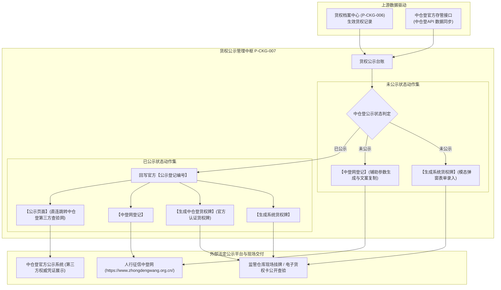

# 货权公示主PRD

> **模块定位**：仓储 / 货权管理 / 货权公示模块是供应链金融动产质押与仓储监管业务中面向行业、资方及社会的法定法权对外公示与公开核验中枢。本模块与前序“货权档案”紧密联动，支持为在库质押标的生成具有排他性法律效力的实体与数字化“系统货权牌”，辅助生成中国人民银行征信中心动产融资统一登记公示系统（中登网）标准财产描述文本，并深度对接中仓登（仓单登记中介平台）区块链公示系统，实现“线上登记公示、线下挂牌存证、官方直连查验”的三位一体物权排他公示闭环。  
> **版本**：V1.2 | **更新时间**：2026-09-16 | **责任人**：森云科技（Senyun Technology）  
> **编写依据**：[《货权公示字段清单》](./货权公示字段清单.md) 是本模块所有字段定义、枚举与页面展示的唯一数据真源；[《货权公示业务规则规格》](./货权公示业务规则规格.md) 是本模块公示状态机、两态操作权限分流、货权牌生成及第三方跳转的唯一定义来源。

---

## 1. 业务背景与核心痛点

### 1.1 业务背景
动产与在库质押物因不具备不动产天然的物理固定性与产权登记强约束，极易引发多头质押、虚假质押或未经质权人同意擅自调拨转移等法律纠纷。依据《中华人民共和国民法典》关于担保物权竞存与公示公信原则，抵质押权人对动产担保物权的设立与排他保护，高度依赖于“公示”行为（包括现场挂牌占有宣告、中登网统一登记公示及全国性仓储中介存管平台公示）。

系统建设**货权公示**中枢，向上承接存货监管与授信抵质押事实，向下打通**现场实体公示（系统货权牌/中仓登货权牌）**与**国家级公信平台公示（中登网财产描述辅助生成、中仓登第三方页面跳转查验）**，切实保障商业银行与资金方的第一顺位质权安全。

### 1.2 核心业务痛点
1. **现场公示不规范，缺乏法定排他证据**：传统仓库现场仅贴白纸手写标签，缺少唯一追溯码、监管电话及标准法律严正声明，在发生司法查封纠纷时难以认定质权人已依法实际占有与排他公示；
2. **中登网登记填报繁琐且易失误**：经办人员在中登网填报质押财产描述时，往往需要手动翻找合同、质物规格与仓库地址，手工整理费时且极易遗漏关键排他要素，导致登记描述存在法律瑕疵；
3. **第三方公信平台联动断链**：动产抵质押信息在中仓登等平台公示后，内部系统无法实时呈现官方登记编号，监管人员核验时无法一键跳转中仓登官方网址查验官方公示结果。

---

## 2. 功能范围 (Scope)

| 包含功能（已纳入范围） | 不包含功能（超出范围） |
| :--- | :--- |
| - **多维公示列表查询**：支持按货权档案流水号、仓库名称、权利人、档案来源、中仓登公示状态 5 大核心条件组合检索； - **系统货权牌在线生成**：支持为任意状态下的货权档案生成系统货权牌，自动带出权利人、流水号、货物名称与存放地点，支持自定义录入质押物数量、各方主体、质押期限及监督电话，附带 200 字预设法定郑重声明； - **中登网登记财产描述辅助生成**：支持针对符合准入条件的货权档案，配置权属类型、质押方式（动态/静态）、最高债权额等参数，一键生成符合中登网官方标准格式的财产描述文本，并提供一键复制文案； - **中仓登已公示全景联动**： &nbsp;&nbsp;1. 针对已公示记录，回写并展示官方颁发的【公示登记编号】； &nbsp;&nbsp;2. 动态激活**【生成中仓登货权牌】**，生成中仓登官方认证版告示牌； &nbsp;&nbsp;3. 动态激活**【公示页面】**，点击新标签页直连跳转至中仓登第三方官方查验网址。 | - **页面直接手工新增公示档案**：公示数据源自系统货权档案与中仓登应用程序编程接口（API）同步，本页面不提供手工添加空白行的入口； - **直接修改中仓登官方公示结果**：中仓登公示编号与状态由中仓登官方系统权威认证与异步回调驱动，内部系统不支持直接篡改编号； - **中登网后台直接代扣或自动提交**：中登网登记系由用户复制规范文本后自行登录中国人民银行征信中心中登网官方平台操作，本系统不越权截留或伪造中登网用户口令。 |

---

## 3. 模块架构与系统链路

---

## 4. 业务场景与用户故事

| 场景编号 | 业务场景 | 触发角色 | 核心交互与风控约束 | 业务价值 |
| :--- | :--- | :--- | :--- | :--- |
| **场景 1【监管仓现场实物货权告示牌制作与悬挂】(S01)** | 监管仓现场实物货权告示牌制作与悬挂 | 现场监管员 / 仓储操作岗 | 在货权公示列表检索对应货权流水号，点击【生成系统货权牌】。系统自动带出权利人、冻货品名及仓库详细地址；录入质押物数量“500吨”、监督电话“400-XXX-XXXX”，确认无误后点击提交，生成标准化实体/电子货权告示牌。监管员打印并在垛位现场显眼位置悬挂。符合【系统货权牌生成与实物占有宣告规则】(R03)。 | 落实实物占有宣告，建立排他性物理隔离与现场风控威慑。 |
| **场景 2【资方动产融资统一登记文案智能准备】(S02)** | 资方动产融资统一登记文案智能准备 | 银行风控专员 / 客户经理 | 质押业务放款前，风控专员需在中登网录入财产描述。在列表点击【中登网登记】，选择权属类型“质权”、质押方式“动态质押”，录入最高债权额“1000万元”。点击【生成】，右侧自动呈现规范的质物与库位描述文本。点击【复制文案】，直接黏贴至中登网系统质押财产描述处。符合【中登网登记业务准入与参数规则】(R05) 与【中登网财产描述格式化自动拼接规则】(R06)。 | 大幅提升登记填报效率与合规精度，消除文字歧义引发的法律风险。 |
| **场景 3【中仓登官方公示结果直连核验与溯源】(S03)** | 中仓登官方公示结果直连核验与溯源 | 业务主管 / 外部审计员 | 在列表筛选中仓登公示状态为“已公示”的数据，核验列表呈现的公示登记编号（如 `TESTHQDJ0T9GUE8FWA3W`）。点击操作列【公示页面】，浏览器在新标签页即刻打开中仓登第三方权威查验网页，直观核实该笔质权在中仓登平台的法律存证备案与有效性。符合【第三方中仓登官方页面外链直连规则】(R07)。 | 穿透至国家级权威平台验真，提供无可争辩的客观公示证据。 |
| **场景 4【生成官方认证版中仓登标准货权牌】(S04)** | 生成官方认证版中仓登标准货权牌 | 仓储主管 / 运营负责人 | 针对中仓登已公示的质押存货，点击操作列【生成中仓登货权牌】。系统根据中仓登权威认证数据生成带有中仓登标识和认证防伪编码的标准官方货权牌，供多方联合监管备查。符合【中仓登认证货权牌生成规则】(R04)。 | 提升现场挂牌的官方公信力，统一仓储监管行业标准。 |

---

## 5. 状态机与动作能力矩阵

| 动作名称 | 未公示状态 (`UNPUBLISHED`) | 已公示状态 (`PUBLISHED`) | 操作入口与界面呈现 | 业务约束与执行说明 |
| :--- | :---: | :---: | :--- | :--- |
| **多条件查询** | ✅ | ✅ | 顶部筛选区【查询】按钮 | 5 项条件组合过滤（支持精确与模糊），遵循【租户与数据范围物理隔离】(P01) |
| **生成系统货权牌** | ✅ | ✅ | 列表行操作文字链接 | 呼出模态弹窗，录入必要字段后生成标准货权牌，遵循【系统货权牌生成与实物占有宣告规则】(R03) |
| **中登网登记** | ✅ | ✅ | 列表行操作文字链接 | 呼出左右分栏模态弹窗，辅助生成描述文案并支持复制，遵循【中登网登记业务准入与参数规则】(R05) |
| **生成中仓登货权牌** | ❌ (不展示) | ✅ (激活展示) | 列表行操作第一行文字链接 | **仅已公示状态下展示**，生成中仓登认证版货权牌，遵循【中仓登认证货权牌生成规则】(R04) |
| **跳转第三方公示页面** | ❌ (不展示) | ✅ (激活展示) | 列表行操作第二行文字链接 | **仅已公示状态下展示**，新标签页打开中仓登官方网页，遵循【第三方中仓登官方页面外链直连规则】(R07) |

---

## 6. 页面交互规格说明

### 6.1 货权公示主列表页（`P-CKG-007`）
* **顶部区域**：标题展示为 `货权公示`，无独立页面级新增或批量按钮；
* **筛选查询区排布**：
  - 横向排布 5 项筛选控件：
    1. 货权档案流水号（单行文本输入框，提示“请输入货权档案流水号”）；
    2. 仓库名称（单行文本输入框，提示“请输入仓库名称”）；
    3. 权利人（单行文本输入框，提示“请输入权利人”）；
    4. 档案来源（下拉单选框，默认“全部”，枚举：`本系统`、`中仓登API`）；
    5. 中仓登公示状态（下拉单选框，默认“全部”，枚举：`已公示`、`未公示`）；
  - 右侧配置橙黄色实心【查询】按钮，点击执行数据检索。
* **数据表格呈现（9 列）**：
  - 序号、货权档案流水号、权利人、权属类型、仓库名称、档案来源、中仓登公示状态、公示登记编号、操作；
  - 表格不提供行复选框；
  - 当中仓登公示状态为【已公示】时，公示登记编号列展示正式识别码（如 `TESTHQDJ0T9GUE8FWA3W`）；为【未公示】时展示为空（遵循【中仓登公示状态两态划分与编号回写规则】(R01)）；
  - 操作列严格根据公示状态执行动态排布：未公示行展示 2 个按钮，已公示行展示 4 个按钮（分两行排布，遵循【操作列按钮按状态分流规则】(R02)）。

---

### 6.2 【生成系统货权牌】模态弹窗交互规格
* **触发方式**：点击任意行的【生成系统货权牌】链接呼出居中模态弹窗，右上角带关闭图标；
* **表单控件布局**：
  - **只读带出区**：权利人、货权档案流水号置灰只读展示，不允许修改；
  - **必填信息区（红星标注）**：
    - `* 质押物名称`：自动带出货物名称（如 `冻货-牛肉丸,冻货-奥尔良,水果-苹果`），支持二次修改；
    - `* 质押物数量`：单行文本输入框，占位符“请输入质押物数量”；
    - `* 存放地点`：自动带出物理仓库注册地址，支持二次补充；
    - `* 质权人`：带出或手动输入；
    - `* 出质人`：带出或手动输入；
    - `* 监督电话`：单行文本输入框，占位符“请输入监督电话”；
  - **选填补充区**：
    - `贷款人`（单行文本输入框）；
    - `监管方`（单行文本输入框）；
    - `质押期限`（日期范围选择器，精确到年月日）；
  - **郑重声明文本域**：
    - 系统预设 200 字严正法律声明模板，右下角带有实时字数统计计数器（如 `98/200`），支持用户酌情微调，遵循【货权牌郑重声明字数强校验】(C03)；
* **操作与提交**：
  - 底部配置【取消】与橙黄色【确认】主按钮；
  - 点击【确认】执行前端强校验，若必填项为空则红字定位报错；校验通过后保存货权牌快照并提供下载与预览，遵循【系统货权牌生成与实物占有宣告规则】(R03) 与【不可变司法存证快照规则】(R08)。

---

### 6.3 【中登网登记】辅助生成弹窗交互规格
* **触发方式**：点击操作列【中登网登记】呼出模态弹窗；
* **顶部说明条**：展示准入范围提示文案（支持已公示质权、已设担保物权所有权及抵押权）；
* **左右分栏布局**：
  - **左侧参数配置区**：
    - `* 权属类型`：单选框组，选项包含：`质权`（默认选中）、`抵押权`；
    - `* 质押方式`：单选框组，选项包含：`动态质押`、`静态质押`；
    - `* 质权人`：单行文本输入框；
    - `* 出质人`：单行文本输入框；
    - `* 最高债权额`：金额输入框 + 币种下拉单选框（默认 `人民币`）；
    - `货权流水号`：只读带出当前行数据；
    - `仓库名称`：只读带出当前行数据；
    - 底部操作：部署橙黄色【生成】按钮；
  - **右侧结果预览与复制区**：
    - 顶部呈现操作指引及中登网官方网址超链接（`https://www.zhongdengwang.org.cn/`）；
    - 中部部署大尺寸多行文本输入框，点击【生成】后，系统根据左侧输入参数自动格式化拼接规范描述文案并填入多行文本输入框，遵循【中登网动态/静态财产描述文本拼接算法】(C01) 与【债权金额千分位与大写换算】(C02)，用户可直接在文本域内进行补充或微调；
    - 底部部署【复制文案】按钮，点击后将文本域内容自动复制至用户操作系统剪贴板，并弹出绿色成功浮窗提示：“*文案已复制至剪贴板*”。

---

### 6.4 【公示页面】第三方直连跳转交互规格
* **触发方式**：针对中仓登公示状态为【已公示】的记录行，点击操作列的【公示页面】文字链接；
* **跳转行为**：
  - 浏览器自动在**新标签页（`_blank`）**打开中仓登第三方官方公开查验地址；
  - 携带当前行的公示登记编号作为检索入参，用户无需二次手动输入即可直接查验该笔质权在中仓登平台的存管备案明细，遵循【第三方中仓登官方页面外链直连规则】(R07) 与【外链安全防护与防劫持】(P03)。

---

## 7. 核心业务规则索引

| 规则大类 | 规则编码与自解释名称 | 核心逻辑摘要 | 详细真源指向 |
| :--- | :--- | :--- | :--- |
| **状态与流转** | 【中仓登公示状态两态划分与编号回写规则】(R01) | 未公示编号为空；已公示回写中仓登官方登记编号 | [业务规则规格 §7.1](./货权公示业务规则规格.md#1-状态流转与编号回写规则) |
| **界面控制** | 【操作列按钮按状态分流规则】(R02) | 未公示行渲染 2 个操作；已公示行渲染两行 4 个操作 | [业务规则规格 §7.1](./货权公示业务规则规格.md#1-状态流转与编号回写规则) |
| **货权牌制作** | 【系统货权牌生成与实物占有宣告规则】(R03) | 权利人/流水号只读；6 项红星必填；郑重声明限制 ≤200 字 | [业务规则规格 §7.2](./货权公示业务规则规格.md#2-货权牌生成与法律声明规则) |
| **货权牌制作** | 【中仓登认证货权牌生成规则】(R04) | 仅已公示行开放；调取官方存管数据与防伪水印生成标准告示牌 | [业务规则规格 §7.2](./货权公示业务规则规格.md#2-货权牌生成与法律声明规则) |
| **中登网辅助** | 【中登网登记业务准入与参数规则】(R05) | 限定质权/所有权担保/抵押权准入；校验动态/静态及债权额 | [业务规则规格 §7.3](./货权公示业务规则规格.md#3-中登网登记辅助生成与文本拼接算法) |
| **中登网辅助** | 【中登网财产描述格式化自动拼接规则】(R06) | 根据动态/静态模板自动拼接财产描述，支持微调与一键复制 | [业务规则规格 §7.3](./货权公示业务规则规格.md#3-中登网登记辅助生成与文本拼接算法) |
| **外链跳转** | 【第三方中仓登官方页面外链直连规则】(R07) | 强制新标签页（`_blank`）打开并携带编号，免密直达核验 | [业务规则规格 §7.4](./货权公示业务规则规格.md#4-外部查验跳转与快照存证保护) |
| **存证与安全** | 【不可变司法存证快照规则】(R08) | 货权牌生成后固化历史快照，后续单据更迭不篡改公示证据 | [业务规则规格 §7.4](./货权公示业务规则规格.md#4-外部查验跳转与快照存证保护) |
| **存证与安全** | 【防误触与防重复生成保护】(R09) | 支持重新生成并递增版本号（Version），保留历史存档 | [业务规则规格 §7.4](./货权公示业务规则规格.md#4-外部查验跳转与快照存证保护) |
| **接口安全** | 【中仓登异步回调防伪验签规则】(R10) | 接收中仓登回调报文执行非对称加密验签，防止伪造公示 | [业务规则规格 §7.4](./货权公示业务规则规格.md#4-外部查验跳转与快照存证保护) |
| **计算算法** | 【中登网动态/静态财产描述文本拼接算法】(C01) | 依据动态与静态质押方式分流拼接法定严谨财产描述 | [业务规则规格 §8](./货权公示业务规则规格.md#八计算与格式化公式-c01--c03) |
| **计算算法** | 【债权金额千分位与大写换算】(C02) | 阿拉伯数字金额格式化转货币大写与千分位展现 | [业务规则规格 §8](./货权公示业务规则规格.md#八计算与格式化公式-c01--c03) |
| **计算算法** | 【货权牌郑重声明字数强校验】(C03) | 郑重声明字符数限制 ≤200 字，超出前端阻断提交 | [业务规则规格 §8](./货权公示业务规则规格.md#八计算与格式化公式-c01--c03) |
| **权限控制** | 【租户与数据范围物理隔离】(P01) | 严格按登录租户与管辖仓库隔离数据，跨租户强校验拦截 | [业务规则规格 §9](./货权公示业务规则规格.md#九数据权限与风控控制规则-p01--p03) |
| **风控原则** | 【中登网登记防假冒与自填原则】(P02) | 仅提供文案生成与复制，不代填代扣，不保存外部登录密码 | [业务规则规格 §9](./货权公示业务规则规格.md#九数据权限与风控控制规则-p01--p03) |
| **安全防护** | 【外链安全防护与防劫持】(P03) | 跳转添加 `rel="noopener noreferrer"` 防范反向脚本劫持 | [业务规则规格 §9](./货权公示业务规则规格.md#九数据权限与风控控制规则-p01--p03) |

---

## 8. 权限矩阵（RBAC）

| 角色类型 | 查看主列表 | 生成系统货权牌 | 使用中登网辅助生成 | 生成中仓登货权牌 | 查验第三方公示页面 |
| :--- | :---: | :---: | :---: | :---: | :---: |
| **系统超级管理员** | ✅ | ✅ | ✅ | ✅ | ✅ |
| **仓储主管 / 监管负责人** | ✅ | ✅ | ✅ | ✅ | ✅ |
| **现场监管员 / 档案操作员** | ✅ | ✅ | ✅ | ✅ | ✅ |
| **资方客户经理 / 风控审查员** | ✅ | 仅预览 | ✅ (复制文案) | 仅预览 | ✅ |

---

## 9. 非功能性需求 (NFR)

1. **响应性能**：
   - 货权公示主列表查询与筛选响应时间 $\le 1.0$ 秒（千万级数据分库分表索引覆盖）；
   - 中登网财产描述生成与剪贴板复制响应时间 $\le 100$ 毫秒；
   - 货权牌高清渲染与 PDF/图片导出生成耗时 $\le 2.0$ 秒。
2. **高并发与防抖控制**：
   - 货权牌生成提交与复制文案按钮提供防重抖动（Debounce）控制，2 秒内重复点击自动忽略；
   - 支持并发异步接收中仓登上链回调通知，接口吞吐量 $\ge 200\text{ TPS}$。
3. **安全合规与数据留痕**：
   - 所有生成货权牌、复制中登网文案及跳转第三方查验的操作均全路径记录审计日志（操作人、角色、IP、时间戳、操作前后快照）；
   - 跳转中仓登外部链接强制加入 `rel="noopener noreferrer"`，防范钓鱼及反向脚本劫持。

---

## 10. 验收标准与交付清单

1. **多条件筛选与状态展示**：
   - 筛选区 5 项条件均能正常与服务端接口联动，未公示与已公示筛选准确分流；
   - 未公示行【公示登记编号】必须展示为空；已公示行必须准确回写并展示官方登记编号；
2. **两态操作按钮动态切换**：
   - 未公示状态行，操作列必须且仅展示【生成系统货权牌】、【中登网登记】2 项操作；
   - 已公示状态行，操作列必须展示【生成系统货权牌】、【生成中仓登货权牌】、【中登网登记】、【公示页面】4 项操作；
3. **两大弹窗交互闭环**：
   - 【生成系统货权牌】必填项校验完整，200 字限制正常生效，点击确认后正确保存货权牌数据；
   - 【中登网登记】参数输入后点击【生成】，能准确输出格式化描述文本，点击【复制文案】能成功写入系统剪贴板；
4. **外部跳转合规性**：
   - 点击【公示页面】必须以独立新窗口/新标签页打开中仓登第三方页面，原系统页面状态保持不变。

---

## 11. 修订记录

| 日期 | 版本 | 变更内容说明 | 影响范围 | 修订人 |
| :--- | :--- | :--- | :--- | :--- |
| 2026-09-16 | V1.0 | 建立货权公示最新基准版主 PRD 功能规格说明书：规范单据定位、实体/电子双货权牌、中登网登记指引、中仓登已公示状态与第三方免密查验。 | 货权公示全模块 | AI PM / 森云科技 |
| 2026-09-16 | V1.1 | **全业务作业公示联动与数据互通规格对齐**：明确仓储业务与公示台账数据互通。 | 跨模块协同 | AI PM / 森云科技 |
| 2026-09-16 | **V1.2** | **编号语义自解释与交互术语汉化重构**： 1. 业务场景统一重构为 `场景 N【业务场景名称】(Sxx)` 格式； 2. 新增第 7 节核心业务规则索引与第 9 节非功能性需求，全量对齐自解释编号（R01~R10, C01~C03, P01~P03）； 3. 全面汉化交互术语（单选框组、单行文本输入框、多行文本输入框、浮窗提示等），英文专有名词规范标注 `中文（English）`。 | 主PRD规范性与研发测试对齐 | AI PM / 森云科技 |
