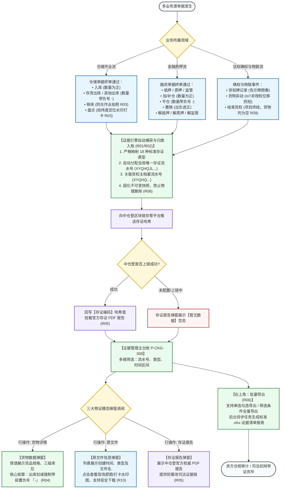
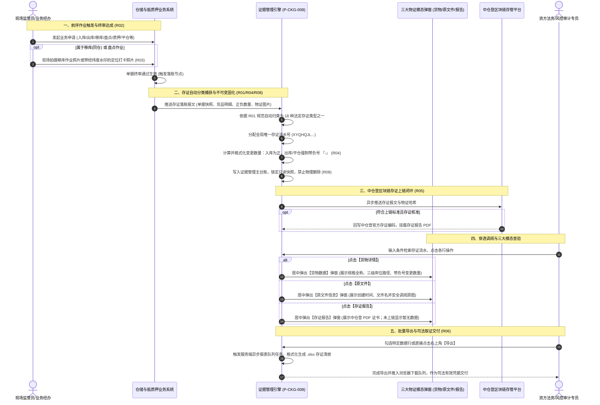

# 证据管理业务规则规格

> **文档定位**：仓储 / 货权管理 / 证据管理模块存证生命周期、18 种存证类型驱动映射、三大物证模态弹窗调阅逻辑、批量导出任务调度以及不可变快照防篡改的**唯一定义真源**。主 PRD、字段清单及端侧原型仅引用本文件规则编号（R01~R10, C01~C02, P01~P03），不重复定义规则本体。  
> **模块类型**：全流程客观物证与司法区块链存证总台账类（包含原子作业事件自动捕获、多品类物证关联挂载、中仓登存证回写、大批量异步导出）  
> **参考文档**：[《证据管理主PRD》](./证据管理主PRD.md)、[《证据管理字段清单》](./证据管理字段清单.md)、[《货权档案业务规则规格》](../06-货权管理-货权档案/货权档案业务规则规格.md)、[《货权公示业务规则规格》](../07-货权管理-货权公示/货权公示业务规则规格.md)  
> **版本**：V1.2 | **更新时间**：2026-09-16 | **责任人**：森云科技（Senyun Technology）

---

## 一、单据与能力定位

| 项目 | 规格内容 |
| :--- | :--- |
| **单据层级** | **【第3层-现场执行与物证存证层】**（连接仓储物理实物作业与法权司法存证的最底层客观底座） |
| **核心职责** | 集中收拢仓储作业流（入库、出库、移库、盘点）、金融风控流（质押、抵押、解押、补仓、平仓、置换）与法权公示流中产生的全量物证、现场相片及区块链证书；提供防篡改的司法级证据检索、查看与导出服务。 |
| **单据来源** | **全业务单据底层自动捕获驱动**：无需人工制单，当上游业务单据终审通过或现场作业完成时，由存证引擎自动抽取单据快照、货品明细、时间戳、操作人及现场照片，自动落入本台账。 |
| **上游依赖** | **仓储作业中心**：入库单、出库单、移库单、盘点单、异动单； **融资质押中心**：抵质押申请单、解押单、补仓单、平仓单、置换单； **货权公示中心**：货权牌生成记录； **移动监管终端 / IoT 物联设备**：现场抓拍照片、定位打卡水印图片； **中仓登存管平台**：区块链存证哈希编码与官方存证证书。 |
| **下游影响** | **金融审计中心**：提供符合金融监管要求的动产存货监管合规抽检底稿； **司法诉讼代理**：在发生违约处置或财产查封时，向人民法院出具具备完整时间戳和公信力的排他占有证据链； **风控合规报表**：支持全量批量导出 Excel 格式标准化存证清单。 |
| **存证台账边界** | **【只读客观流水，不可物理删除】**：本台账记录为历史客观事实，一经生成即锁定为不可变快照，不设人工编辑、作废或物理删除入口。 |
| **入口分流** | PC 列表查询：工作台 → 仓储 → 货权管理 → 证据管理；三大操作分别呼出居中模态弹窗；右上角【导出】触发后台报表任务。 |

---

## 二、数量与变动核算口径隔离表

| 口径名称 | 存在位置 | 业务含义与符号规范 | 约束与边界条件 |
| :--- | :--- | :--- | :--- |
| **变更数量** | 【货物数据】弹窗明细 | 单次存证作业实际引起特定库位货品变动的净额数量 | **正负符号强制规范**： 1. 引起库存增加（入库、补仓）展示为正数（如 `500(公斤)`）； 2. 引起库存扣减（出库、平仓、提货）**必须带有明确负号 `-`**（如 `-1(斤)`）；附带物理计量单位 |
| **货物规格全称** | 主列表第6列 | 存证所指向标的物的大类-品类-规格全称路径 | 格式：`大类-品类-规格`（如 `干果-水果-香蕉片`）；不涉及货物的系统事件（如结束货权）此列为空 |
| **库位路径** | 【货物数据】弹窗明细 | 货物发生物理变动的精准库房与库区分区 | 完整三级路径：`仓库名称 - 库房名称 - 分区名称`（如 `水果库房2-常见水果分区`） |
| **存证时间** | 主列表第3列 | 存证业务在系统内审批通过并落账生效的时间戳 | 格式：`YYYY-MM-DD HH:mm:ss`，精确到秒；列表默认按此时间戳倒序排列 |
| **存证流水号** | 主列表第8列 | 系统为该笔存证业务分配的全局唯一代码 | 统一采用 `XYQHQJL` 前缀 + 年月日 + 流水号编制规则 |
| **货权流水号** | 主列表第9列 | 该笔存证所属归管的货权主档案流水号 | 统一采用 `XYQHQ` 前缀，用于主档案与作业流水的向上穿透关联 |

---

## 三、全景业务时序与流转架构

### 3.1 证据链自动化捕获与司法取证全景流程图

---

### 3.2 证据管理端到端时序交互图

---

## 四、18 种存证类型属性与物证映射全景表

为保障系统在面对任何业务事件时均能精确分类与落账，系统建立以下 18 种存证类型的规范映射矩阵：

| 序号 | 存证类型名称 | 所属业务领域 | 触发单据节点 | 变更数量方向 | 是否必须现场照片 | 涉及货物展示 |
| :---: | :--- | :--- | :--- | :---: | :---: | :---: |
| 1 | **盘点** | 仓储巡检 | 盘点单审核通过 | 正常为0/差异增减 | **是（定位打卡照片）** | 展示规格全称 |
| 2 | **入库** | 仓储作业 | 入库单审核通过 | **正数（增加）** | 可选（随单附件） | 展示规格全称 |
| 3 | **存货出库** | 仓储作业 | 销售/还款出库单审核通过 | **负数（扣减 `-`）** | 可选（出库拍照） | 展示规格全称 |
| 4 | **解监管** | 监管风控 | 解除监管申请通过 | 不变（0） | 否 | 展示规格全称 |
| 5 | **货权牌记录** | 货权确权 | 货权牌生成/更新确认 | 不变（0） | **是（货权牌告示图）** | 展示规格全称 |
| 6 | **抵押** | 融资确权 | 抵押贷款申请通过 | 不变（0） | 否 | 展示规格全称 |
| 7 | **质押** | 融资确权 | 质押融资申请通过 | 不变（0） | 否 | 展示规格全称 |
| 8 | **监管** | 监管委托 | 监管委托单据生效 | 不变（0） | 否 | 展示规格全称 |
| 9 | **移库** | 仓储作业 | 移库单终审通过 | 调出负/调入正 | **是（移库作业照片）** | 展示规格全称 |
| 10 | **加/补仓** | 质押履约 | 补仓单据审核通过 | **正数（增加）** | 可选（验货照片） | 展示规格全称 |
| 11 | **平仓** | 风控处置 | 强制平仓处置核销 | **负数（扣减 `-`）** | 可选（处置记录） | 展示规格全称 |
| 12 | **置换** | 质押履约 | 货物置换单终审通过 | 换出负/换入正 | 可选（换入照片） | 展示规格全称 |
| 13 | **其他出库** | 仓储作业 | 损耗/抽检单据核销 | **负数（扣减 `-`）** | 否 | 展示规格全称 |
| 14 | **解质押** | 融资结项 | 解除质押申请通过 | 不变（0） | 否 | 展示规格全称 |
| 15 | **解抵押** | 融资结项 | 解除抵押申请通过 | 不变（0） | 否 | 展示规格全称 |
| 16 | **结束货权** | 法权终结 | 档案确认结束通过 | 不变（0） | 否 | **为空（非货品事件）** |
| 17 | **货物异动** | 物联安防 | IoT 非法位移告警 | 不变（0） | **是（监控抓拍图片）** | 展示规格全称 |
| 18 | **其他** | 系统维护 | 底层特定法权调整 | 视具体业务定 | 否 | 视情况展示 |

---

## 五、动作能力与流转控制矩阵

| 触发动作 | 操作入口 | 适用角色 | 前置业务校验条件 | 后置影响与反馈 | 失败阻断提示 (浮窗提示 / 警告弹窗) |
| :--- | :--- | :--- | :--- | :--- | :--- |
| **多条件查询** | 列表顶部【查询】按钮 | 全员 | 输入参数格式合法 | 刷新表格展示匹配的存证流水 | — |
| **调阅存证报告** | 列表行操作【存证报告】 | 全员 | 存证流水有效存在 | 弹出【存证报告】弹窗；有报告展示 PDF 预览/下载，无报告展示“暂无数据” | — |
| **调阅现场原文件** | 列表行操作【原文件】 | 全员 | 存证流水有效存在 | 弹出【原文件信息】弹窗；点击文件名调出大图查看器进行缩放与下载 | 「暂无相关原文件凭据」 |
| **调阅货物数据** | 列表行操作【货物详情】 | 全员 | 存证流水包含货品变动 | 弹出【货物数据】弹窗；穿透展示规格、库位与带符号变更数量 | — |
| **批量导出台账** | 列表右上角【导出】按钮 | 仓储主管/风控审计岗 | 至少有 1 条筛选结果或已勾选行 | 提交后台异步导出任务，生成 `.xlsx` 报表推入下载队列 | 「暂无可导出的存证数据」 「系统繁忙，请稍后重试」 |

---

## 六、核心业务规则清单 (R01 ~ R10)

### 1. 业务分类与触发落账规则

### 【18种存证类型自动分类映射规则】(R01)
* 系统根据前序单据类型，严格自动归类映射入账第四章所定义的 18 种法定存证类型；严禁人为串用或随意新增未定义类型。

### 【业务单据审核通过驱动落账时机规则】(R02)
* 所有存证记录的生成节点，**严格以业务单据「申请通过」作为判定时机**；
* 处于草稿、审批中、已驳回或已撤回状态的单据，严禁提前写入证据管理台账，确保入账数据的严肃性与确定性。

### 2. 现场物证采集与数量规范

### 【现场拍照与定位打卡物证挂载规则】(R03)
* 针对「移库」与「盘点」业务，移动端监管人员拍摄的现场作业照片、垛位标签照片及带有经纬度/时间戳的水印打卡图片，自动归入【原文件信息】；
* 原文件列表展示创建时间、扩展名及文件名称，采用安全临时防盗链机制，支持用户点击在线查阅与下载。

### 【货物变更数量正负号显示规范】(R04)
* 在点击【货物详情】弹出的【货物数据】表格中，【变更数量】列必须严格执行正负符号区分：
  1. **入库类增量**：展示为正数（如 `500(公斤)`、`10(吨)`）；
  2. **出库类扣减**：**强制显示前置负号 `-`**（如 `-1(斤)`、`-50(箱)`）；
  3. 盘点正常无差异时展示为 `0`；盘盈为正数，盘亏带负号。

### 3. 区块链存证与导出调度

### 【中仓登存证上链与报告空态规则】(R05)
* 符合上链标准的业务，系统异步向中仓登平台推送存证报文；
* 收到上链成功确认后，系统自动回写【存证编码】（哈希识别码），并在【存证报告】中挂载权威认证 PDF；
* 若接口尚未返回或该类业务未配置上链，弹窗居中展示浅灰色空态提示“*暂无数据*”，严禁抛出技术异常代码。

### 【批量多选与异步导出任务调度规则】(R06)
* 列表支持行复选与表头全选操作：
  1. 用户勾选特定记录行后，点击右上角【导出】，系统导出当前被选中的记录清册；
  2. 若用户未勾选任何行直接点击【导出】，系统弹出二次确认：“*是否导出当前筛选条件下的全部存证记录？*”，确认后导出全量匹配数据；
* 导出任务采用服务端异步队列调度，生成规范的 Excel 文件（`.xlsx`），防止海量数据导出导致前台页面卡死。

### 【双流水号穿透追溯规则】(R07)
* 系统统一维护两组数字化流水标号：
  1. **存证流水号**（`XYQHQJL...`）：代表单次作业事实，用于精准检索单次作业物证；
  2. **货权流水号**（`XYQHQ...`）：代表标的物主档案，输入该号可聚合检索该主档案自建档以来的全量历史存证记录。

### 【不可变司法存证快照规则】(R08)
* 存证记录一旦生成入库，其关联的存证时间、物证文件哈希、库位路径及变更数量立即进入**不可变只读锁定**；
* 任何用户角色均不可篡改历史记录，保障司法举证的真实性与合法性。

### 【非货品存证事件展示保护规则】(R09)
* 针对“结束货权”等不直接包含货品物理实物的存证事件，列表【货物】列统一展示为空（不显示乱码或空占位符），货物数据弹窗中展示为空明细。

### 【原文件大图防盗链与防篡改验证规则】(R10)
* 用户调阅原文件大图时，系统自动核验文件哈希值，确保文件未被底层物理存储篡改；
* 下载文件统一以“业务类型_原文件名_时间戳.jpg”规范命名。

---

## 七、计算与格式化公式 (C01 ~ C02)

### 【存证时间戳与排序规则】(C01)
$$\text{列表默认排序} = \text{OrderBy}(\text{存证时间 DESC}, \text{存证流水号 DESC})$$

### 【库位全路径格式化算法】(C02)
$$\text{库位路径} = \text{Concat}(\text{仓库名称}, \text{“-”}, \text{库房名称}, \text{“-”}, \text{分区名称})$$

---

## 八、数据权限与司法安全防护 (P01 ~ P03)

### 【租户与实体仓库物理隔离】(P01)
* 用户登录系统后，证据管理列表仅加载当前登录账号所属租户及授权管辖的实体监管仓库下的存证记录，跨租户数据绝对隔离。

### 【OSS对象存储防盗链安全访问】(P02)
* 【原文件】与【存证报告】中存储于云端对象存储（OSS）的文件直链，采用动态生成 30 分钟临时有效访问签名机制，过期自动失效，防范外部非法越权爬取。

### 【区块链数据防篡改一致性核验】(P03)
* 系统定期对存证记录本地数据库数据哈希值与中仓登区块链链上哈希值进行校验比对，若发现数据被异常篡改，即时触发安全审计告警。

---

## 九、修订记录

| 日期 | 版本 | 变更内容说明 | 影响范围 | 修订人 |
| :--- | :--- | :--- | :--- | :--- |
| 2026-09-16 | V1.0 | **建立证据管理最新基准版业务规则规格**：规范 18 种法定存证类型、出库强制负号、同仓移库/盘点水印照片原文件挂载、中仓登存证哈希与不可变快照。 | 证据管理全模块 | AI PM / 森云科技 |
| 2026-09-16 | V1.1 | **全业务作业存证报文分发与数量符号铁律确立**：明确入库/加工为正数、出库/平仓为负数、平盘/解押为 0，与全业务单据 100% 强一致互通。 | 证据管理存证闭环 | AI PM / 森云科技 |
| 2026-09-16 | **V1.2** | **编号语义自解释与交互术语汉化重构**： 1. 规则、公式与权限编号全量改造为 `【规则名称】(Rxx/Cxx/Pxx)` 格式； 2. 全面汉化交互术语（模态弹窗、浮窗提示/警告弹窗），专业技术词汇规范保留 `中文（English）`； 3. 纠正章节编号结构。 | 证据管理规格标准化 | AI PM / 森云科技 |
