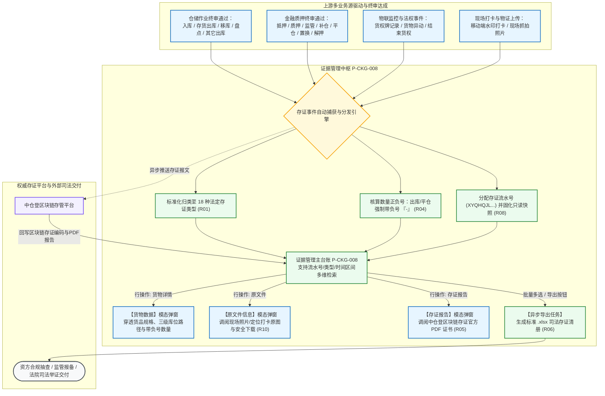

# 证据管理主PRD

> **模块定位**：仓储 / 货权管理 / 证据管理模块是供应链金融存货质押与第三方监管业务中全流程物证链、操作流水与区块链存证的总账中枢。本模块自动汇集入库、出库、移库调拨、动态盘点、抵质押权属设立与结项等 18 种作业场景下沉淀的实物物证、现场抓拍打卡相片、作业单据快照及中仓登（仓单登记中介平台）区块链存证证书，为资方（银行/商业保理）、司法仲裁机构、监管方及核心企业提供高公信力、不可篡改、全要素穿透的法定司法存证检索与批量取证平台。  
> **双入口与移动端说明**：本模块在系统中同时挂载于 PC 端【仓储 → 货权管理】（P-CKG-008）与【融资/监管 → 货权管理】（P-RZ-009），两处为完全一致的同构复用页面；移动端对应【工作台 → 仓储 → 证据管理】（`ws-evidence-mgr`）。唯一定义真源均归属于本目录。  
> **版本**：V1.2 | **更新时间**：2026-09-16 | **责任人**：森云科技（Senyun Technology）  
> **编写依据**：[《证据管理字段清单》](./证据管理字段清单.md) 是本模块所有字段定义、枚举与页面展示的唯一数据真源；[《证据管理业务规则规格》](./证据管理业务规则规格.md) 是本模块存证类型流转、三大物证弹窗调阅、批量导出与区块链哈希防篡改校验的唯一定义来源。

---

## 1. 业务背景与核心痛点

### 1.1 业务背景
在动产与存货质押融资实践中，“物权确认难、现场监管难、司法举证难”被称为动产融资领域的三大顽疾。一旦借款企业发生违约或破产重组，由于大宗商品实物不断发生入库、出库、移库及深加工，商业银行若无法拿出贯穿全生命周期、带有时间戳和地理位置水印的现场作业物证，或者无法调阅经第三方公信力机构（如中仓登）认证的区块链存证文件，极易被其他普通债权人或法院质疑质权的排他占有真实性，甚至面临质押权落空丧失优先受偿权的巨大合规法律风险。

系统通过建设**证据管理**中枢，将仓储端所有的原子作业行为自动映射为带有唯一编号的法定“存证事件”，对现场作业照片、定位打卡原文件、出入库数量增减及区块链哈希证书进行统一落账归档，形成“一事一存证、一证一流水、全链可追溯”的司法级证据库。

### 1.2 核心业务痛点
1. **物证散落割裂，调证取证成本高**：过去现场抓拍照片存在移动端本地，出入库单据存在仓储系统，质押合同存在信贷系统，发生纠纷时需数天甚至数周人工跨系统翻找拼凑，效率极其低下；
2. **缺乏防篡改技术背书，公信力不足**：系统自存的图片与日志易被当事人质疑后台人为篡改；必须引入中仓登国家级中介平台或区块链哈希存证证书，形成法官与仲裁员认可的证据形式；
3. **缺少与实物库位、数量变动的强穿透**：单纯的文件记录无法清晰解释本次作业究竟对哪一个库区、哪一批货物、造成了多少数量的增减，缺乏物理维度的资产穿透力；
4. **批量司法审计导出能力弱**：金融机构审计与风控定期核查时，难以针对特定时间段或特定货权流水号批量导出完整的物证清单与存证报告。

---

## 2. 功能范围 (Scope)

| 包含功能（已纳入范围） | 不包含功能（超出范围） |
| :--- | :--- |
| - **多维存证全息组合查询**：支持按存证流水号（`XYQHQJL...`）、货权流水号（`XYQHQ...`）、存证类型（完整 18 种业务枚举）、存证时间（自然日期范围）精准或模糊检索； - **证据管理总台账展现**：10 列标准结构，清晰展示存证时间戳、存证类型、涉及货物规格大类、存证流水号、货权流水号及区块链存证编码； - **三大模态弹窗深度穿透**： &nbsp;&nbsp;1. **【存证报告】**：调阅中仓登或区块链存证机构出具的官方电子存证证书（PDF格式，支持在线查验）；未上链时友好展示“暂无数据”空态； &nbsp;&nbsp;2. **【原文件】**：调阅监管员现场拍照、移库打卡原图（JPG格式，支持防盗链安全预览与下载）； &nbsp;&nbsp;3. **【货物详情】**：调阅受本次存证影响的具体货物品名、规格、精准库房分区及变更数量（入库为正、出库扣减明确显示负号并带物理单位）； - **多选与全量批量导出**：支持表头全选与单行复选，点击右上角【导出】按钮，异步生成格式化 Excel 存证台账。 | - **页面直接手工上传或篡改存证**：本模块为只读存证总账，所有存证数据与物证文件均由底层业务单据（入库、出库、移库、盘点）审核通过或现场打卡时自动落账，严禁前台手工物理新增或直接修改数据； - **物理删除已沉淀的存证物证**：存证记录具备司法不可变性，系统彻底禁止任何角色物理删除历史存证文件； - **私有区块链节点后台物理配置**：区块链节点底层运维与智能合约由基础架构层托管，本页面不提供技术链码管理。 |

---

## 3. 模块架构与系统链路

### 3.1 跨模块数据驱动与落账时机
1. **仓储与风控单据驱动**：
   - 严格在业务单据（如入库单、出库单、盘点单、转让单）**「申请通过」**的瞬间，系统自动抽取单据快照、货品明细、时间戳及操作人，生成一条对应的存证流水，遵循【业务单据审核通过驱动落账时机规则】(R02)；
2. **现场拍照与定位打卡物证挂载**：
   - 非仓单抵质押货物的「同仓移库」与「货物盘点」，监管员在移动端拍摄的带时间、经纬度水印的打卡照片，实时推送到对象存储服务（OSS），并自动关联至该笔流水的【原文件信息】中，遵循【现场拍照与定位打卡物证挂载规则】(R03)；
3. **中仓登存证闭环**：
   - 系统将结构化存证数据与原文件摘要打包推送至中仓登区块链存管平台，完成上链后，将官方存证证书回挂至【存证报告】中，遵循【中仓登存证上链与报告空态规则】(R05)。

---

## 4. 业务场景与用户故事

| 场景编号 | 业务场景 | 触发角色 | 核心交互与风控约束 | 业务价值 |
| :--- | :--- | :--- | :--- | :--- |
| **场景 1【涉诉动产质押排他占有现场物证调阅】(S01)** | 涉诉动产质押排他占有现场物证调阅 | 资方法务 / 诉讼代理律师 | 借款人发生债务违约，律师需向法院出具出库与移库排他监管证据。在证据管理列表输入特定货权流水号，筛选存证类型“移库”。点击【原文件】，调阅出库调拨时的现场作业抓拍照片；点击【货物详情】，清晰举证该笔调拨将 1 斤水果从常见水果分区移出扣减。遵循【现场拍照与定位打卡物证挂载规则】(R03) 与【货物变更数量正负号显示规范】(R04)。 | 形成无可辩驳的现场实际占有物证链，有效对抗第三人查封。 |
| **场景 2【周期性金融存货监管司法存证报告抽检】(S02)** | 周期性金融存货监管司法存证报告抽检 | 商业银行风控经理 / 稽核专员 | 对某重点授信客户在特定月份的监管流水进行例行合规抽查。选定存证时间范围，筛选“加/补仓”与“置换”。在列表核验存证流水号，点击【存证报告】，在线查验由中仓登官方出具的区块链电子存证证书。遵循【中仓登存证上链与报告空态规则】(R05)。 | 确保银行抵质押资产符合银保监监管合规要求与公信力存管标准。 |
| **场景 3【仓库异常异动与盘点事实溯源核查】(S03)** | 仓库异常异动与盘点事实溯源核查 | 仓储总监 / 运营督导 | 系统收到库位异常报警，需追查最近一次盘点记录。筛选存证类型“盘点”与货物品名“冻货-鸡翅”。点击【原文件】，核验现场监管员拍摄的货垛标签打卡照片与环境全景；点击【货物详情】，核对盘点核验数量。遵循【双流水号穿透追溯规则】(R07)。 | 秒级锁定现场作业第一责任人与物证照片，迅速排查风险隐患。 |
| **场景 4【年度监管档案全量存证台账批量导出】(S04)** | 年度监管档案全量存证台账批量导出 | 档案管理员 / 外部审计师 | 年终外部审计需要调阅全年在库货物的流转审计底稿。在列表表头勾选全选复选框，点击右上角【导出】。系统在后台异步生成格式化的 Excel 存证台账清单，涵盖存证时间、存证类型、流水号及存证编码，供审计归档留存。遵循【批量多选与异步导出任务调度规则】(R06)。 | 避免页面卡死，高效交付符合审计规范的大批量标准化证据清册。 |

---

## 5. 状态机与动作能力矩阵

> 证据管理定位为全生命周期**客观存证流水台账**，数据行本身不存在人工流转状态，随作业事件发生即时落账。列表行操作能力与弹窗呈现矩阵如下：

| 动作名称 | 主列表页 (P-CKG-008) | 存证报告弹窗 | 原文件信息弹窗 | 货物数据弹窗 | 规则与约束说明 |
| :--- | :---: | :---: | :---: | :---: | :--- |
| **组合条件查询** | ✅ (4项条件) | ❌ | ❌ | ❌ | 支持流水号模糊/精确检索与时间区间查询，遵循【租户与实体仓库物理隔离】(P01) |
| **行复选勾选** | ✅ (表头全选/行选) | ❌ | ❌ | ❌ | 用于批量导出控制 |
| **批量导出** | ✅ (右上角主按钮) | ❌ | ❌ | ❌ | 异步导出选中的或当前筛选条件下的存证台账，遵循【批量多选与异步导出任务调度规则】(R06) |
| **行操作：存证报告** | ✅ | 呼出模态展示 | ❌ | ❌ | 调阅中仓登区块链存证 PDF，无数据展示“暂无数据”，遵循【中仓登存证上链与报告空态规则】(R05) |
| **行操作：原文件** | ✅ | ❌ | 呼出模态展示 | ❌ | 调阅现场照片，支持安全防盗链预览与下载，遵循【原文件大图防盗链与防篡改验证规则】(R10) |
| **行操作：货物详情** | ✅ | ❌ | ❌ | 呼出模态展示 | 穿透展示货品品名、规格、库位与变更数量，遵循【货物变更数量正负号显示规范】(R04) |

---

## 6. 页面交互规格说明

### 6.1 证据管理主列表页（`P-CKG-008`）
* **页面路径**：`工作台 → 仓储 → 货权管理 → 证据管理`
* **顶部区域**：
  - 左侧标题展示为 `证据管理`；
  - 右上角配置橙黄色实心**【导出】**主操作按钮；
* **筛选查询区**：
  - 横向排布 4 项筛选条件：
    1. 存证流水号（单行文本输入框，提示“请输入存证流水号”）；
    2. 货权流水号（单行文本输入框，提示“请输入货权流水号”）；
    3. 存证类型（下拉单选框，提示“请选择存证类型”，支持 18 种业务枚举单选）；
    4. 存证时间（日期范围选择器，精确到年月日，开始日期 至 结束日期）；
  - 右侧部署橙黄色实心【查询】按钮，点击执行条件过滤；
* **数据表格呈现（10 列 + 多选复选框）**：
  - 复选框、序号、存证时间、存证类型、证据名称、货物、记录地点、存证流水号、货权流水号、存证编码、操作；
  - 存证时间精确到秒级展示；货物列展示标准化品名规格全称；不涉及具体货物的系统事件（如“结束货权”）货物列展示为空，遵循【非货品存证事件展示保护规则】(R09)；
  - 操作列陈列 3 个文字操作链接：【存证报告】、【原文件】、【货物详情】。

---

### 6.2 【存证报告】模态弹窗交互规格
* **触发方式**：点击任意行的【存证报告】链接，居中呼出模态弹窗；
* **弹窗布局**：
  - 顶部标题为 `存证报告`，右上角带关闭图标；
  - 表头列：`序号`、`文件名称`；
  - **空态交互**：若当前记录尚未完成中仓登上链或尚未生成报告，表格中间展示浅灰色空态提示：“*暂无数据*”，遵循【中仓登存证上链与报告空态规则】(R05)；
  - **有数据交互**：展示中仓登官方存证报告文件名，点击文件名在新窗口调起 PDF 安全阅读器进行在线验真与下载。

---

### 6.3 【原文件信息】模态弹窗交互规格
* **触发方式**：点击任意行的【原文件】链接，居中呼出模态弹窗；
* **弹窗布局**：
  - 顶部标题为 `原文件信息`，右上角带关闭图标；
  - 表头列：`序号`、`创建时间`、`文件类型`、`文件名称`；
  - **展示示例**：`1`、`2026-09-10 16:53:23`、`jpg`、`出库_现场照片_20260910165322512.jpg`；
  - 文件名称采用橙黄色链接展示，点击调出大图查看器进行缩放、旋转或下载留存，遵循【原文件大图防盗链与防篡改验证规则】(R10)。

---

### 6.4 【货物数据】模态弹窗交互规格
* **触发方式**：点击任意行的【货物详情】链接，居中呼出模态弹窗；
* **弹窗布局**：
  - 顶部标题为 `货物数据`，右上角带关闭图标；
  - 表头列：`序号`、`货物品名`、`货物规格/等级`、`库位`、`变更数量`；
  - **数量呈现规范**：
    - 增加库存（如入库、补仓）展示为正数并附带单位（如 `500(公斤)`）；
    - 扣减库存（如出库、提货）展示为醒目负数并附带单位（如 `-1(斤)`）；
    - 库位精确到三级（仓库-库房-分区），遵循【货物变更数量正负号显示规范】(R04) 与【库位全路径格式化算法】(C02)。

---

## 7. 核心业务规则索引

| 规则大类 | 规则编码与自解释名称 | 核心逻辑摘要 | 详细真源指向 |
| :--- | :--- | :--- | :--- |
| **存证分类** | 【18种存证类型自动分类映射规则】(R01) | 依据前序单据类型，严格自动归类映射 18 种法定存证类型 | [业务规则规格 §6.1](./证据管理业务规则规格.md#1-业务分类与触发落账规则) |
| **落账时机** | 【业务单据审核通过驱动落账时机规则】(R02) | 严格以单据「申请通过」作为落账时机，未生效单据严禁提前写入 | [业务规则规格 §6.1](./证据管理业务规则规格.md#1-业务分类与触发落账规则) |
| **现场物证** | 【现场拍照与定位打卡物证挂载规则】(R03) | 移库与盘点作业照片与带经纬度时间戳水印打卡图自动归入原文件 | [业务规则规格 §6.2](./证据管理业务规则规格.md#2-现场物证采集与数量规范) |
| **数量核算** | 【货物变更数量正负号显示规范】(R04) | 入库为正，出库/平仓强制带负号 `-`，盘盈为正、盘亏带负号 | [业务规则规格 §6.2](./证据管理业务规则规格.md#2-现场物证采集与数量规范) |
| **区块链存证** | 【中仓登存证上链与报告空态规则】(R05) | 异步推送中仓登存证，回写哈希；未上链居中展示“暂无数据”空态 | [业务规则规格 §6.3](./证据管理业务规则规格.md#3-区块链存证与导出调度) |
| **异步导出** | 【批量多选与异步导出任务调度规则】(R06) | 支持行复选与全选，后端异步生成规范 `.xlsx` 报表 | [业务规则规格 §6.3](./证据管理业务规则规格.md#3-区块链存证与导出调度) |
| **穿透追溯** | 【双流水号穿透追溯规则】(R07) | 存证流水号（`XYQHQJL...`）定位单笔；货权流水号（`XYQHQ...`）聚合主档 | [业务规则规格 §6.3](./证据管理业务规则规格.md#3-区块链存证与导出调度) |
| **存证安全** | 【不可变司法存证快照规则】(R08) | 存证生成后即刻锁定为不可变只读，严禁任何角色物理删除或篡改 | [业务规则规格 §6.3](./证据管理业务规则规格.md#3-区块链存证与导出调度) |
| **数据保护** | 【非货品存证事件展示保护规则】(R09) | “结束货权”等非货品存证事件货物列展示为空，不展示乱码 | [业务规则规格 §6.3](./证据管理业务规则规格.md#3-区块链存证与导出调度) |
| **安全查验** | 【原文件大图防盗链与防篡改验证规则】(R10) | 调阅核验文件哈希防篡改，下载按标准命名，防范越权盗链 | [业务规则规格 §6.3](./证据管理业务规则规格.md#3-区块链存证与导出调度) |
| **计算公式** | 【存证时间戳与排序规则】(C01) | 默认按存证时间倒序排列，时间相同按存证流水号倒序 | [业务规则规格 §7](./证据管理业务规则规格.md#七计算与格式化公式-c01--c02) |
| **计算公式** | 【库位全路径格式化算法】(C02) | 仓库-库房-分区三级路径拼接 | [业务规则规格 §7](./证据管理业务规则规格.md#七计算与格式化公式-c01--c02) |
| **数据隔离** | 【租户与实体仓库物理隔离】(P01) | 严格按登录租户与管辖仓库隔离数据，跨租户强校验拦截 | [业务规则规格 §8](./证据管理业务规则规格.md#八数据权限与司法安全防护-p01--p03) |
| **安全防护** | 【OSS对象存储防盗链安全访问】(P02) | 云端对象存储直链采用 30 分钟动态签名临时授权 | [业务规则规格 §8](./证据管理业务规则规格.md#八数据权限与司法安全防护-p01--p03) |
| **合规防篡改** | 【区块链数据防篡改一致性核验】(P03) | 本地数据库哈希与中仓登链上哈希定期核验，异常触发审计告警 | [业务规则规格 §8](./证据管理业务规则规格.md#八数据权限与司法安全防护-p01--p03) |

---

## 8. 权限矩阵（RBAC）

| 角色类型 | 查看证据列表 | 调阅货物数据 | 调阅现场原文件 | 调阅存证报告 | 执行批量导出 |
| :--- | :---: | :---: | :---: | :---: | :---: |
| **系统超级管理员** | ✅ | ✅ | ✅ | ✅ | ✅ |
| **仓储主管 / 运营负责人** | ✅ | ✅ | ✅ | ✅ | ✅ |
| **现场监管员 / 档案操作员** | ✅ | ✅ | ✅ | ✅ | 仅限本仓库数据 |
| **资方风控专员 / 审计审查员** | ✅ (只读) | ✅ | ✅ | ✅ | ✅ |

---

## 9. 非功能性需求 (NFR)

1. **并发与响应性能**：
   - 存证主列表多维组合查询响应时间 $\le 1.0$ 秒（覆盖百万级流水索引）；
   - 调阅三大模态弹窗（货物数据、原文件、存证报告）前端首次渲染时间 $\le 500$ 毫秒；
   - 批量异步导出 10,000 条存证流水并生成 `.xlsx` 报表时间 $\le 15$ 秒。
2. **数据可靠性与防篡改**：
   - 存证记录一旦生成即执行只读快照写入，严禁前台或接口层提供物理删除或更新接口；
   - 对象存储（OSS）原文件采用只读防删除策略，并在数据库中固化 SHA-256 哈希指纹；
   - 支持中仓登存管接口高吞吐异步上链，报文超时自动重试（上限 3 次）。
3. **安全与合规审计**：
   - 用户调阅原文件与存证报告的每一次行为均记录访问审计日志（操作人、时间戳、IP、客户端环境）；
   - OSS 文件访问直链必须附带 30 分钟动态时效签名，防范非授权外发与非法盗链。

---

## 10. 验收标准与交付清单

1. **组合检索与 18 种类型覆盖**：
   - 筛选区 4 项条件均能正常联动查询，完整覆盖 18 种存证类型枚举；
   - 货权流水号模糊或精准搜索能准确穿透展示该货权项下的所有历史作业物证；
2. **三大模态弹窗交互完整**：
   - 点击【存证报告】在未上链时友好展示“暂无数据”，上链成功后展示可预览的 PDF 报告；
   - 点击【原文件】能调出清晰的现场拍照与打卡物证；
   - 点击【货物详情】能准确反映货品、库位及带负号的变更数量；
3. **批量导出能力**：
   - 勾选多行点击【导出】，后台能在规定时限内生成标准 Excel 台账，无乱码与错列。

---

## 11. 修订记录

| 日期 | 版本 | 变更内容说明 | 影响范围 | 修订人 |
| :--- | :--- | :--- | :--- | :--- |
| 2026-09-16 | V1.0 | 建立证据管理最新基准版主 PRD 功能规格说明书：规范 18 种存证类型枚举、11 列宽表结构、原文件安全调阅与区块链存证报告查验。 | 证据管理全模块 | AI PM / 森云科技 |
| 2026-09-16 | V1.1 | **全业务作业存证分发与数量正负号规格对齐**：明确仓储各单据自动分发生成司法存证流水标准。 | 跨模块协同 | AI PM / 森云科技 |
| 2026-09-16 | **V1.2** | **编号语义自解释与交互术语汉化重构**： 1. 业务场景统一重构为 `场景 N【业务场景名称】(Sxx)` 格式； 2. 新增第 7 节核心业务规则索引与第 9 节非功能性需求，全量对齐自解释编号（R01~R10, C01~C02, P01~P03）； 3. 全面汉化交互术语（单行文本输入框、下拉单选框、日期范围选择器、模态弹窗等），英文专有名词规范标注 `中文（English）`。 | 主PRD规范性与研发测试对齐 | AI PM / 森云科技 |
