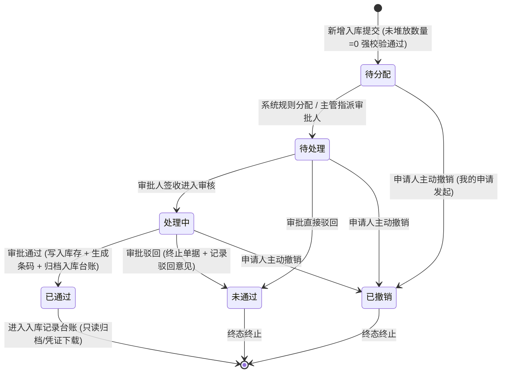

# 入库记录 业务规则规格

> **文档定位**：仓储 / 入库管理 / 入库记录模块状态机、动作约束、前置校验规则、未堆放数量计算公式、库房同属性约束、影像与存货条码闭环、审批流转与特权修改审计的**唯一定义来源**。主 PRD、字段清单及端侧 ASCII 线框只引用本文件规则名称与编号，不重复定义规则本体。
>
> **模块类型**：业务单据 / 流转执行与归档台账（新增申请、多级理货堆放、审批流转及已生效归档查询）
>
> **参考文档**：[《入库记录主PRD》](./入库记录主PRD.md)、[《入库记录字段清单》](./入库记录字段清单.md)、[《入库记录_ASCII_列表页》](./入库记录_ASCII_列表页.md)、[《入库记录_ASCII_详情页》](./入库记录_ASCII_详情页.md)、[《入库记录_ASCII_新增页》](./入库记录_ASCII_新增页.md)、[《00-功能与数据权限清单》](../../00-功能与数据权限/功能与数据权限清单.csv)
>
> **版本**：V1.5 | **更新时间**：2026-09-16 | **责任人**：森云科技（Senyun Technology）

---

## 一、单据与能力定位

| 项目 | 内容 |
| :--- | :--- |
| **单据层级** | **【第2层-订单/执行控制层】**（仓储业务核心单据 —— 入库管理控制单据） |
| **核心职责** | 规范存货进入监管仓库的登记、货权确立、多货品规格计量、实物多库位堆放定位、实物照片与物联网（IoT）影像存证、存货二维码生成，以及入库成功后的归档台账追溯。 |
| **单据来源** | **双重来源机制**： 1. **主动发起**：业务或监管人员在 PC 端发起新增入库申请（支持普通入库、质押入库、抵押入库、仓单入库）；或通过移动端仓单入库生成； 2. **系统跨模块联动生成**： - **退货入库**：提货单【取消提货】确认后，直达跳转本模块新增页，锁定为【退货入库】，现场分配库位堆放并提交审批； - **移库入库**：移库单审核通过后，系统在移出方生成移库出库流水，同时在移入方自动联动生成【移库入库】记录； - **转让入库**：货物转让单生效完成时，受让方自动联动生成【转让入库】记录； - **加工产出入库**：加工单在现场登记实际产出并【完成加工】时，系统原子事务生成对应加工入库记录（存货加工入库、质押加工入库、抵押加工入库）。 |
| **上游依赖** | **货主档案**：企业/个人货主统一社会信用代码、姓名、手机号及身份证号； **货品主档**：货品大类、品类、规格主档及动态属性配置； **仓库档案**：仓库、库房（含“需要审核/不需要审核”标签）及分区空间层级； **业务关联单据**：质押单、抵押单、仓单、出库单/提货单（退货入库逆向链）、移库单、转让单、加工单（`PRO...`）。 |
| **下游影响** | **库存中心**：入库生效后向仓储系统（WMS）写入批次在库库存，确立货权； **条码中心**：生成全局唯一存货条形码与二维码，并绑定各具体堆放位置； **货权与风控**：抵质押/抵质押加工入库实时联动更新质押清单，激活物联网穿透监控； **后续业务**：作为出库、移库、加工、盘点与货权公示的实物数据源头。 |
| **归档台账边界** | **【台账唯一展示已通过】**：入库记录主列表唯一定位为“已生效/已通过的入库单归档与查询台账”，审批中及已作废单据不在本列表呈现，本列表不设状态筛选和状态列。 |

---

## 二、数量与堆放计算口径隔离表

| 口径名称 | 存在位置 | 业务含义与计算公式 | 约束与边界条件 |
| :--- | :--- | :--- | :--- |
| **计量参数（总数量）** | 一级货品卡片/明细行 | 该货品在本次入库中的申报入库物理总量 $Q_{\text{total}}$ | 数值 $> 0$，最多 4 位小数；单位继承货品主档配置 |
| **堆放数量** | 二级堆放位置行 | 存放在某具体库房-分区-垛位的实物数量 $q_i$ | 数值 $> 0$，最多 4 位小数；严禁输入负数或 0 |
| **未堆放数量** | 一级货品卡片标题 | 当前货品尚未分配具体堆放位置的剩余差额数量： $$Q_{\text{unstacked}} = Q_{\text{total}} - \sum_{i=1}^{m} q_i$$ | **强阻断红线**：新增提交时必须严格满足：$$Q_{\text{unstacked}} = 0$$ 遵循【未堆放数量清零强阻断】(R13)，未清零时卡片标题以大红色告警并强阻断提交 |
| **货品总数量** | 统计汇总底栏 / 列表入库数量 | 单据内所有货品申报总量之和：$$\text{总数量} = \sum_{k=1}^{n} Q_{\text{total}, k}$$ | 列表【入库数量】主列千分位展示，物理绝对数值累加 |
| **堆放总数量** | 统计汇总底栏 | 单据内所有货品已分配的堆放数量绝对累加和：$$\text{堆放总数量} = \sum_{k=1}^{n} \sum_{i=1}^{m} q_{k, i}$$ | 新增页底栏展示；提交时必须严格等于货品总数量 |
| **货品品类数** | 统计汇总底栏 | 单据内添加的货品按 `大类 - 品类 - 规格` 去重统计后的种类总数 | 整数 $\ge 1$；新增页底栏展示 |
| **无需堆放总数量** | 统计汇总底栏 | 标记为免理货堆放（如大宗散装液体管道直入）的货物数量 | 默认为 0.0000 |

---

## 三、单据状态机与流转定义

### 3.1 状态定义

| 状态名称 | 状态编码 | 业务含义 | 是否终态 | 入库记录列表可见性 | 出现与流转说明 |
| :--- | :--- | :--- | :---: | :---: | :--- |
| **待分配** | `PENDING_ASSIGNMENT` | 单据已提交审核，等待系统分配或主管指派审批责任人 | 否 | 不可见 | 仅存在于工作中心/审批中心池 |
| **待处理** | `PENDING_PROCESS` | 已指派审批人，等待特定审批人审阅核验 | 否 | 不可见 | 仅在审批人待办列表展示 |
| **处理中** | `PROCESSING` | 审批人已打开单据，正在进行实物核验或补充调查 | 否 | 不可见 | 审批人审阅中状态 |
| **已通过** | `APPROVED` | 审批流程全节点核准通过，入库事务完成，库存生成条码 | **是** | **唯一定位可见** | **【核心定位】入库记录列表展示且仅展示此状态单据** |
| **未通过** | `REJECTED` | 审批节点被驳回，入库单作废终止 | **是** | 不可见 | 终态留痕；仅在我的申请中追溯 |
| **已撤销** | `WITHDRAWN` | 申请人在审批流转结束前主动撤销单据 | **是** | 不可见 | 终态留痕；由制单人在我的申请中发起 |

### 3.2 状态流转图

---

## 四、动作能力与流转控制矩阵

| 触发动作 | 操作入口 | 适用角色 | 前置业务校验条件 | 结果状态 | 联动后置影响 | 失败阻断提示 |
| :--- | :--- | :--- | :--- | :--- | :--- | :--- |
| **提交入库申请** | 新增页【提交审核】按钮 | 仓库操作员/制单人 (`R-WH-IN-ADD`) | ① 入库日期 $\le$ 当前时间； ② 货主与仓库必填； ③ 遵循【库房同审核属性强校验】(R06)； ④ 遵循【未堆放数量清零强阻断】(R13)； ⑤ 遵循【现场实物照片强制存证】(R16)。 | 待分配 / 待处理 | ① 生成 19 位全局唯一入库单号； ② 异步调用摄像头触发设备影像抓拍； ③ 发起对应入库审批流。 | 「提交失败：存在未分配堆放位置的货物（未堆放数量必须为0）」 「提交失败：所选库房属性不一致」 |
| **审批分配** | 审批中心分配界面 | 库管主管 / 系统自动 | 具备分配权限；单据处于待分配 | 待处理 | 指派具体审批人并推送待办消息通知 | 「分配失败：单据已被分配或撤回」 |
| **审批通过** | 审批详情【通过】按钮 | 审批节点处理人 | 具备审批权限；遵循【发起人自审禁止】(R23) | 已通过 | ① 单据置为已通过，进入入库记录归档台账； ② 生成唯一存货二维码条码（遵循 R19）； ③ 更新仓储系统（WMS）批次库存与在库货权。 | 「审批失败：自审禁止（不可审批本人发起的单据）」 「审批失败：单据状态已发生变迁」 |
| **审批驳回** | 审批详情【驳回】按钮 | 审批节点处理人 | 具备审批权限；填写驳回意见（必填 $\le 200$ 字） | 未通过 | ① 单据终止，记录驳回原因； ② 向申请人发送驳回通知。 | 「驳回失败：请填写驳回原因」 |
| **特权信息修改** | 审批中【编辑单据】入口 | 授权审批角色 (`R-WH-IN-EDIT`) | 处于审批中状态；具备特权修改权限；仅允许修正堆放垛位、数量或备注 | 状态不变 | 将修改人、修改时间、原值与新值写入【入库信息修改记录】（遵循 R22）。 | 「修改失败：审批流程已终结，禁止修改数据」 |
| **申请人撤销** | 我的申请记录【撤回】 | 单据申请制单人本人 | 单据处于待分配、待处理或处理中；审批未终结 | 已撤销 | 终止审批流；单据标记为已撤销并全流程归档留痕。 | 「撤回失败：单据已审批完成，无法撤回」 |
| **查看详情** | 列表行操作【查看详情】 | 具备查看权限 (`R-WH-IN-VIEW`) | 单据处于已通过状态 | 已通过 | 进入单据详情页，展示基础信息、双层货品明细、存货二维码、审核记录与修改记录 | — |
| **下载记录** | 列表行操作【下载记录】 | 具备下载权限 (`R-WH-IN-DOWN-REC`)| 单据处于已通过状态 | 已通过 | 异步导出当前单据货品与位置堆放流水 Excel 报表；记录审计日志 | 「导出失败：系统繁忙，请稍后重试」 |
| **单据下载** | 列表行操作【单据下载】 | 具备下载权限 (`R-WH-IN-DOWN-DOC`)| 单据处于已通过状态 | 已通过 | 导出正式入库凭据 PDF 文档（带印章与二维码）；记录审计日志 | 「下载失败：凭证生成中，请稍后重试」 |

---

## 五、核心业务规则清单 (R01 ~ R31)

### 5.1 基础信息与主体校验规则

#### 【业务时间真实性】(R01)
* 入库日期精确到秒（`YYYY-MM-DD HH:mm:ss`），默认系统当前时刻。只能选择不晚于当前时间的日期时间，**严禁选择未来时间**；超前提交时系统前置阻断。

#### 【货主类型与字段隔离】(R02)
* 支持 `企业货主` 与 `个人货主` 两大主体类型；
* 选择企业货主时，货主名称对应营业执照全称，货主标识为 18 位统一社会信用代码，身份证号控件强制隐藏；
* 选择个人货主时，货主名称对应真实姓名，货主标识为脱敏手机号，右侧强制唤起并校验 `* 身份证号` 必填项；
* 切换货主类型时，系统清空已填写的货主名称及关联字段，防止主体数据交叉污染。

#### 【新货主二元认证与建档沉淀】(R03)
* **模糊联想与存量判定**：
  - 货主名称输入支持拼音、中文或统一社会信用代码的模糊搜索联想；
  - 若用户选取的为系统中已建档注册的存量货主，自动反显货主标识并跳过二元核验流程；
  - 若制单人录入的新货主在系统底层【货主档案】中不存在，系统将当前单据标记为 `is_new_owner = true`。
* **【二元认证拦截时机】(R03a)**：
  - 点击底栏【提交审核】时，系统首先校验【未堆放数量清零强阻断】(R13)；
  - 校验通过后，针对 `is_new_owner = true` 的单据执行**前置强阻断拦截**，弹出【货主信息确认】二元认证弹窗，绝不直接将未核验主体提交进入审批流。
* **【个人货主核验要素】(R03b)**：
  - 弹窗展示核心四要素：【货主类型：个人】、【货主名称：真实姓名】、【货主标识：手机号（脱敏）】、【货主身份证号：公民身份证号码（脱敏中间8位）】；
  - 系统自动向【货主标识】（手机号）发送 6 位动态验证码。
* **【企业货主核验要素】(R03c)**：
  - 弹窗展示核心四要素：【货主类型：企业】、【货主名称：企业全称】、【货主标识：统一社会信用代码】、【联系电话：经办人手机号（脱敏）】；
  - 系统自动向【联系电话】（手机号）发送 6 位动态验证码。
* **【动态验证码与防刷机制】(R03d)**：
  - 唤起弹窗瞬间触发短信验证码下发，右侧开启 **60 秒倒计时**；
  - 倒计时期间禁用重新发送；倒计时归零后激活【重新获取】按钮；单个手机号每日限制发送 10 次，防止短信接口被恶意盗刷。
* **【双向流转与建档事务闭环】(R03e)**：
  - **【返回修改】**：允许随时关闭弹窗返回编辑页，保留已录入的全部基础信息、货品堆放位置及附件，支持纠偏主体信息；
  - **【提交核验与原子沉淀】**：验证码输入正确并提交后，系统在单一事务内完成两项操作：
    1. **新货主建档沉淀**：将该新货主资质与主体信息写入底层【货主档案】，赋予唯一货主编号，支持后续入库直接检索复用；
    2. **入库单正式落库**：入库单正式生成 19 位唯一业务单号，状态流转至【待分配/待处理】，进入入库审批专网。

#### 【入库类型来源与单号映射】(R04)
* **入库类型完整枚举（共 10 种）**：单张单据内严禁混合多种入库类型；系统根据业务流转划分为“手工发起类”与“跨模块联动生成类”两大通道：

| 序号 | 入库类型 | 业务来源入口 | 触发与生成时机 | 允许手工制单 | 关联单号属性 | 关联单号说明 | 货权属性与后续监控 |
| :---: | :--- | :--- | :--- | :---: | :---: | :--- | :--- |
| 1 | **普通入库** | PC 端新增入库申请 | 审批流全节点通过后生成生效入库单 | **是** | 无（展示“—”） | 不关联任何单号 | 货主自有普通存货，确立物理库存 |
| 2 | **质押入库** | 新增入库（选质押单）或【质押单】内发起入库 | 质押审核及入库审核全流程生效后归档 | **是** | **强制必填** | 关联质押单号（`ZY...`） | 确立金融质押货权，纳入跌价/质押率物联网风控监控 |
| 3 | **抵押入库** | 新增入库（选抵押单）或【抵押单】内发起入库 | 抵押审核及入库审核全流程生效后归档 | **是** | **强制必填** | 关联抵押单号（`DY...`） | 确立抵押货权，纳入抵押订单物联网风控监控 |
| 4 | **仓单入库** | 新增入库（选仓单）或【仓单管理】生成 | 仓单核验及入库审批生效后归档 | **是** | **强制必填** | 关联仓单编号（`CD...`） | 确立标准电子仓单货权，锁定质押/融资状态 |
| 5 | **退货入库** | 【提货单】取消提货联动 | 提货单【取消提货】确认后，直达跳转本模块新增页；现场分配库位堆放（$\le$ 提货单数量）并提交审批 | 否 | **系统自动带出** | 关联原出库单号（19 位） | 出库扣减但未提货的库存逆向回滚，审批通过后恢复可用库存 |
| 6 | **移库入库** | 【移库管理】移库单流转 | 移库单审核通过且移库执行成功时系统自动生成 | 否 | **系统自动带出** | 关联移库单号（`YK...`） | 移出方生成出库记录，移入方自动生成入库记录，货权物理平移 |
| 7 | **转让入库** | 【货物转让】转让单流转 | 转让单完成双方确认及审批生效时系统自动生成 | 否 | **系统自动带出** | 关联转让单号（`ZR...`） | 货权主体变更完成，受让方确立新库存与货权档案 |
| 8 | **存货加工入库** | 【加工管理】（普通存货加工单） | 现场监管员登记实际产出并【完成加工】时原子事务生成 | 否 | **系统自动带出** | 关联加工单号（`PRO...`） | 普通货物深加工产出，扣减消耗库存并建立新存货条码 |
| 9 | **质押加工入库** | 【加工管理】（质押货物加工单） | 现场监管员登记实际产出并【完成加工】时原子事务生成 | 否 | **系统自动带出** | 关联加工单号（`PRO...`） | 质押物加工产出，新条码继承原质押单货权与风控穿透 |
| 10 | **抵押加工入库** | 【加工管理】（抵押货物加工单） | 现场监管员登记实际产出并【完成加工】时原子事务生成 | 否 | **系统自动带出** | 关联加工单号（`PRO...`） | 抵押物加工产出，新条码继承原抵押单货权与风控穿透 |

* **【手工制单类型白名单】(R04a)**：新增表单中，【入库类型】下拉单选项**仅开放展示：`普通入库`、`质押入库`、`抵押入库`、`仓单入库` 4 种类型**；其余 6 种联动类型严禁手工选择。
* **【非普通入库关联单号强校验】(R04b)**：选择 `质押入库`、`抵押入库`、`仓单入库` 时，动态唤起必填项 `* 关联单号`，选择后自动反显带出对应仓库与库房集合，并锁定货主主体。
* **【移库出入库对冲双核销】(R04c)**：移库单生效时，原子生成移出方【移库出库】与移入方【移库入库】，关联同一移库单号对冲核销。
* **【加工产出入库原子触发】(R04d)**：加工单在【完成加工】登记实际产出时原子生成入库记录与新二维码，质押/抵押加工新条码平滑继承原抵质押权属。
* **【取消提货联动退货入库逆向闭环】(R04e)**：退货入库仅由【提货单】在【未提货】状态下执行【取消提货】直达跳转触发，自动锁定入库类型为 `退货入库` 与原单据信息，审批终审后恢复可用库存。

#### 【仓库权限范围隔离】(R05)
* 入库仓库仅展示当前登录操作员根据角色权限控制（RBAC）授权管辖的实体监管仓库，严禁越权选择。

#### 【库房同审核属性强校验】(R06)
* 仓库管理中配置的各库房分别带有【需要审核】或【不需要审核】的标签；
* 入库单主表【入库库房】多选时，**强制校验所选的所有库房必须具备相同的审核属性**（即必须全部为“需要审核”，或全部为“不需要审核”）；混选时在失焦及点击提交时强阻断提示：「所选库房属性不一致，同一入库单所选库房必须全部为免审库房或全部为需审核库房」。

---

### 5.2 货品规格与理货堆放约束

#### 【货品规格三级联动】(R11)
* 货品大类、品类、规格必须来自系统已启用的标准货品主档；大类变更时联动重置品类与规格，规格确定后动态加载计量参数与属性。

#### 【堆放库房范围限制】(R12)
* 货品卡片内添加的每一个【堆放位置】，其【入库库房】下拉选项**严格受限于单据主表【基础信息】中已选定的库房集合**。

#### 【未堆放数量清零强阻断】(R13)
* 系统针对每个货品卡片动态计算：$$\text{未堆放数量} = \text{申报计量总数量} - \sum \text{各位置堆放数量}$$
* **视觉告警**：未堆放数量大于 0 时，以大红色告警突出展示；
* **绝对拦截提交**：点击【提交审核】时，**只要存在任何货品卡片的未堆放数量不等于 0，系统强制禁止提交**，并提示：「货品尚未完全分配堆放位置，未堆放数量必须为 0 才能提交审核」。

#### 【堆放位置正数与删除联动】(R14)
* 堆放数量必须为严格大于 0 的正数；删除堆放位置行时，系统即时将该行扣除的堆放量返还至未堆放数量，并同步刷新底栏堆放总数量。

#### 【多货品合并展示与悬停清单】(R15)
* 详情页一级表格合并展示货品规格（`大类 - 品类 - 规格`）；
* 列表页针对包含多个货品规格的单据，在【货物名称】列展示首个货品规格及省略号，鼠标悬停弹出气泡提示完整展示单据全部货品清单。

---

### 5.3 影像存证与存货条码闭环

#### 【现场实物照片强制存证】(R16)
* 每个货品卡片必须至少上传 1 张入库现场照片，最多上传 10 张（单张 $\le 10\text{MB}$）；未上传实物照片强阻断单据提交。

#### 【补充凭证与PDF上传】(R17)
* 支持上传磅单、质检单、随车清单等证明文件；支持图片与 PDF 格式，合计最多上传 10 个文件。

#### 【物联网摄像头自动抓拍与容错】(R18)
* 提交审核成功后，服务端自动识别堆放库房并下发监控摄像头抓拍指令；
* 若库房未安装摄像头或设备接口超时/失败，系统写入抓拍异常审计日志，**不阻断入库单据落库与审核流转**；详情页查看大图使用带时效的临时安全签名直链。

#### 【存货二维码生成与位置绑定】(R19)
* 入库单审核通过（`APPROVED`）时，系统自动生成全局唯一存货条码与二维码图形；
* 存货条码与单据一级货品及二级具体堆放位置强绑定，固化为存证快照，任何角色无权手动篡改。

---

### 5.4 审批专网、特权修改与自审禁止

#### 【入库审批专网流转】(R21)
* 入库申请提交后进入专网审批流；审批操作仅在工作中心/审批中心或单据流转弹窗中完成，列表页不提供审核按钮。

#### 【特权信息修改与留痕审计】(R22)
* 审批流转中，具备特权修改权限的审批人可对堆放具体位置、微调数量或备注进行纠偏；
* 一旦发生特权修改，系统在事务内记录修改节点、操作人、时间、字段名称、修改前原值、修改后新值及原因，固化至【入库信息修改记录】并在详情页【修改记录】标签页永久公示展示。

#### 【发起人自审禁止】(R23)
* **安全防护**：入库单制单人不可审批自己发起的入库申请；本人名下单据在审批中心仅展示「详情」，不提供「通过」或「去处理」按钮。

---

### 5.5 台账查询、敏感脱敏与防并发审计

#### 【已通过台账硬编码过滤】(R26)
* 入库记录菜单底层数据查询接口强制硬编码 `status = 'APPROVED'` 过滤条件；草稿、未通过或审核中的单据严禁在入库记录列表展示。

#### 【敏感隐私数据脱敏】(R27)
* 货主联系电话与个人货主标识在列表、详情及导出时，统一隐藏中间 4 位（展示如 `138****0001`）；
* 身份证号在列表不展示，在详情页仅按授权角色脱敏展示（隐藏中间 8 位），严禁明文暴露。

#### 【客户端防重与排他并发锁】(R28)
* 提交入库单采用客户端唯一 Token 防重复提交；
* 审批通过写入库存时采用行级排他锁，防止并发脏写；下载操作采用防抖保护。

#### 【全生命周期操作审计留痕】(R29)
* 单据创建、修改、审批、驳回、下载凭证及查看影像均记录操作人账号、角色、时间戳、IP 及流水号，永久留痕备查。

#### 【货权公示与存证跨模块互通】(R31)
* **触发时机**：入库单终审通过（`APPROVED`）落库生效时，系统原子触发货权三板块的数据分发与同步更新；
* **【货权档案】互通**：
  1. **普通入库**：写入一条【所有权】流水，增加在库库存与货值，条码纳入货品明细；
  2. **质押/抵押入库**：执行【一动两录】，同时写入【所有权】与【质权/抵押权】流水，锁定在押资产；
  3. **移库/转让/加工入库**：受让方/新产出货品在货权档案中确立权益，新条码继承原抵质押权属。
* **【货权公示】互通**：
  1. 同步初始化一条货权公示台账，公示状态为【未公示】；
  2. 激活后续【生成系统货权牌】与【中登网登记】入口。
* **【证据管理】互通**：
  1. 生成一条存证类型=【入库】流水；
  2. **变更数量强制为正数**（例如 `+500(吨)` 或 `+100(件)`），严禁出现负号；
  3. 自动挂载单据信息快照、现场照片（遵循 R16）、摄像头抓拍（遵循 R18）及补充凭证（遵循 R17）。

---

## 六、修订记录

| 日期 | 版本 | 变更内容说明 | 影响范围 | 修订人 |
| :--- | :--- | :--- | :--- | :--- |
| 2026-09-04 | V1.0 | 建立基准版业务规则规格。 | 入库全模块 | AI PM / 森云科技 |
| 2026-09-04 | V1.1 | 补全 10 种入库类型完整矩阵与联动核销机制。 | 入库类型映射 | AI PM / 森云科技 |
| 2026-09-04 | V1.2 | 确立新货主二元身份核验与自动建档闭环。 | 新增入库货主准入 | AI PM / 森云科技 |
| 2026-09-04 | V1.3 | 规范退货入库逆向链路，明确由提货单取消提货直达触发。 | 退货入库 | AI PM / 森云科技 |
| 2026-09-16 | V1.4 | 确立货权档案、货权公示与证据管理跨模块数据互通规则。 | 跨模块互通 | AI PM / 森云科技 |
| 2026-09-16 | **V1.5** | **全量实施规范化重构**： 1. 将 R01~R31 全部升级为【规则名称】(编号)自解释语义格式； 2. 替换 Deep Link、WMS、IoT、Toast、Tab 等英文为规范中文； 3. 精炼长句，去除公文式修饰词。 | 规则规格全章节 | AI PM / 森云科技 |

