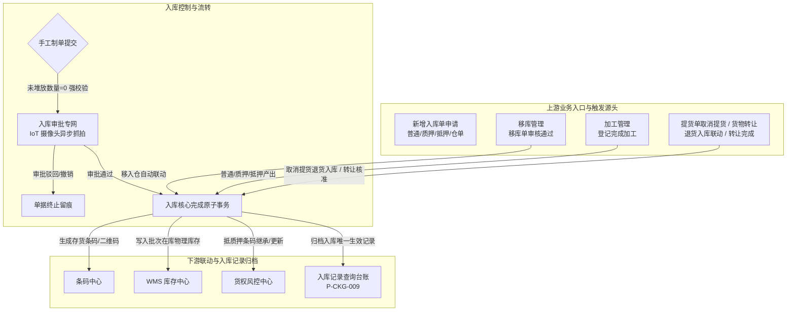

# 入库记录主PRD

> **模块定位**：仓储业务层核心流转单据与生效归档台账，把控实物进入监管体系的第一道关卡。规范存货入库登记、货权确立、多货品计量、多库位理货堆放、现场照片与设备抓拍存证、存货二维码生成及全生命周期台账追溯，打通“货-仓-金”全链路闭环。  
> **版本**：V1.5 | **更新时间**：2026-09-16 | **责任人**：森云科技（Senyun Technology）  
> **编写依据**：[入库记录字段清单.md](./入库记录字段清单.md) 是本模块所有字段定义、枚举与页面展示的唯一基准；[入库记录业务规则规格.md](./入库记录业务规则规格.md) 是本模块状态机、校验算法、库房约束、影像闭环及并发控制的唯一定义来源；[入库记录_ASCII_列表页.md](./入库记录_ASCII_列表页.md)、[入库记录_ASCII_详情页.md](./入库记录_ASCII_详情页.md) 与 [入库记录_ASCII_新增页.md](./入库记录_ASCII_新增页.md) 是界面交互与布局的基准来源。

---

## 1. 业务背景与业务痛点

### 1.1 业务背景
在供应链金融存货监管系统中，质押品或监管存货的物理入库是整个风控链条的源头事实。从货物运抵监管仓库、验收入库、分配库房垛位、生成数字标识，到最终在系统中沉淀为具备法律凭据效力的存货档案，入库全流程数据的准确性、完整性与防篡改能力，直接决定了银行、保理商及核心企业对底层资产的信任度。

### 1.2 核心业务痛点
1. **账实脱节**：传统仓储入库往往只记录货品总量，缺乏细分库房、分区、具体垛位的精准理货分配机制，导致“账面有货，库区难找”；
2. **游离库存风险**：录入总数量后未在库位上全部安排完毕即提交，造成库区存在未定位的“游离库存”，容易引发错发、漏盘、偷运挪用风险；
3. **缺乏防篡改存证闭环**：传统入库纸质单据易篡改，缺乏卸货现场照片存证与物联网（IoT）摄像头自动抓拍证据链，发生纠纷时举证困难；
4. **纠偏缺乏审计留痕**：审批流转过程中，现场库位微调或信息纠偏常通过口头沟通或线下涂改，系统缺乏可追溯的前后版本镜像记录；
5. **台账混杂干扰审计**：审批中、未通过或已作废的半成品单据若混入历史记录台账，容易对仓库统计、货权查验及资金方审计造成极大干扰。

---

## 2. 功能范围

| 包含功能范围 | 不包含功能范围 |
| :--- | :--- |
| - **入库类型全生命周期纳管（10 种）**：   1. **手工发起类**：普通入库（自有货）、质押入库（关联质押单）、抵押入库（关联抵押单）、仓单入库（关联仓单编号）；   2. **跨模块联动类**：退货入库（提货单取消提货联动，现场分配库位后提交审批）、移库入库（移库审核成功联动移入）、转让入库（货物转让完成联动）、存货加工入库（普通加工产出）、质押加工入库（质押加工产出继承质押货权）、抵押加工入库（抵押加工产出继承抵押货权）； - **货主主体联动与二元核验**：支持企业货主与个人货主，动态联动统一社会信用代码、脱敏手机号与身份证号；新货主在提交时强制呼出【货主信息确认】弹窗完成短信二元核验并自动沉淀建档（见【新货主二元身份核验与建档沉淀】(R03)）； - **同属性库房约束**：主表多选库房强制校验“需审核/免审”标签一致性（见【入库库房同审核属性强校验】(R06)）； - **双层明细结构**：一级货品规格（大类/品类/规格/计量）与二级多库位堆放灵活分配； - **未堆放数量强阻断**：实时动态计算未堆放数量，未清零绝对阻断提交审核（见【未堆放数量清零强阻断】(R13)）； - **双重影像存证**：现场货物照片必传（最多10张）与物联网（IoT）摄像头自动抓拍影像闭环； - **审批专网与特权修改留痕**：审批流中特权人员调整信息全量写入【入库信息修改记录】并在详情页标签页 3 公示； - **存货二维码凭据**：终态自动生成唯一存货条形码与二维码图形，位置级绑定； - **已生效归档台账检索**：列表仅展示已通过单据，提供单号、日期、货主、类型、仓库、货品、制单人等多维检索； - **双重凭证导出**：支持【下载记录】（堆放明细清单 Excel）与【单据下载】（正式入库单据 PDF）。 | - **草稿与暂存**：系统设计不支持草稿箱机制； - **列表直接编辑/删除**：本台账不提供修改、编辑或物理删除按钮； - **单据内混合类型**：严禁一张入库单混合多种入库类型（如普通与质押混合）； - **手工伪造跨模块单据**：移库、转让、退货及加工类入库严禁在新增页面手工选择提交，必须由上游业务单据流转触发； - **审批中直接覆盖**：审批修改不得无留痕直接覆盖原值； - **跨权限仓库制单**：严禁越权选择操作员管辖范围外的实体仓库； - **已归档单据反悔作废**：已通过归档的单据为法律凭据，不支持线上反审批或冲正（需走后续出库/异动等逆向流程）。 |

---

## 3. 模块定位与系统链路

---

### 3.1 货权档案、货权公示与证据管理跨模块数据互通

依据全系统数据互通规范，入库单审批通过生效（`APPROVED`）时，系统底层原子向货权三板块分发数据，彻底消除数据孤岛：

| 协同板块 | 接收事件与触发时机 | 具体数据更新行为与业务效力 |
| :--- | :--- | :--- |
| **【06-货权档案】** | 入库单审批终审通过 | 1. **普通入库**：写入一条【所有权】流水，增加货品在库库存与货值； 2. **抵押/质押入库**：执行**【一动两录】**，同时写入货主【所有权】与资方【质权/抵押权】流水，锁定在押明细； 3. **条码绑定**：生成的存货条码/二维码绑定至货权明细中。 |
| **【07-货权公示】** | 入库单审批终审通过 | 同步初始化一条货权公示台账记录，公示状态置为【未公示】，公示登记编号为空；激活后续制作系统货权牌与中登网登记文案生成能力。 |
| **【08-证据管理】** | 入库单审批终审通过 | 1. 自动生成一条存证类型=【入库】流水； 2. **变更数量强制为正数**（如 `+500(吨)`）； 3. 自动挂载入库现场照片、物联网（IoT）设备抓拍大图及随车单据原文件。 |

---

## 4. 业务场景与用户故事

| 场景编号与名称 | 触发角色 | 核心交互与风控约束 | 业务价值 |
| :--- | :--- | :--- | :--- |
| **场景 1【普通存货自主入库与新货主核验】(S01)** | 仓库操作员 / 货主代理 | 录入入库日期，选择货主（企业/个人），选择普通入库；添加多规格货品与计量重量；现场拍摄实物照片上传；逐一分配库房垛位至未堆放数量为 0 后提交审核。**若为系统中未建档的新货主，提交时系统强制弹出【货主信息确认】弹窗，向货主手机号发送短信验证码完成二元身份核验并自动建档沉淀**。 | 规范自有存货理货堆放，严把新货主准入身份风控。 |
| **场景 2【抵押/质押/仓单关联入库】(S02)** | 风控操作员 / 业务经理 | 选择抵押/质押/仓单入库，强制选择关联单号并自动带出仓库；系统校验货物货权准入，入库成功后自动更新抵质押清单。 | 确保金融质押标的实物与质押合同强绑定。 |
| **场景 3【移库审核联动移入入库】(S03)** | 仓库主管 / 调度员 | 移库单审核通过并执行生效时，系统自动在移出方生成【移库出库】单，同时在移入方生成【移库入库】单，关联同一移库单号。 | 保障移库业务账实对冲与跨仓调拨全闭环追溯。 |
| **场景 4【加工单完成产出入库】(S04)** | 现场监管员 / 仓库操作员 | 现场监管员在加工记录中点击【完成加工】，录入实际消耗量与产出量；系统在单一原子事务内扣减消耗、释放余量，并自动生成【存货加工入库】、【质押加工入库】或【抵押加工入库】记录，质押/抵押加工无缝继承原货权。 | 确保深加工产出与原货权无缝衔接，杜绝监管真空。 |
| **场景 5【取消提货退货与转让联动入库】(S05)** | 仓库监管员 / 业务经理 | 提货单【取消提货】后页面直达跳转退货入库新增页，类型自动锁定，现场分配库位（数量 ≤ 提货单数量）并提交审批；货物转让完成时受让人侧自动生成【转让入库】，关联原转让单号。 | 规范出库未提货逆向回滚与货权变更的账实同步。 |
| **场景 6【大宗商品一货多堆（拆垛）】(S06)** | 理货员 / 仓库监管员 | 针对单笔大吨位到货（如 500 吨电解铜），在卡片内点击【+ 添加位置】分配至多个库房、分区与垛位，系统动态试算差额，杜绝超分或漏分。 | 杜绝游离库存，实现货位账实 100% 精准对应。 |
| **场景 7【审批流裁决与特权微调】(S07)** | 库管主管 / 质检风控 | 审批人审阅现场照片与申报数据；若发现具体垛位描述偏差，通过特权修改进行纠偏，系统强制留痕记入【入库信息修改记录】；审核通过后系统自动生成存货二维码。 | 既保障现场业务灵活性，又满足金融级不可篡改审计要求。 |
| **场景 8【已通过台账检索与凭证下载】(S08)** | 货主 / 资金方 / 审计人员 | 进入「入库记录」页面，通过单号、日期、货主、类型、仓库等多维检索已生效台账；点击【查看详情】查阅完整展开明细；点击【单据下载】导出标准带章 PDF 凭证。 | 为多方协同提供公开、透明、不可抵赖的履约台账。 |

---

## 5. 状态机与动作能力矩阵

> 状态变迁严格由系统业务动作与审批驱动，禁止任何前台下拉直接改动状态。详细定义见 [入库记录业务规则规格.md §三/§四](./入库记录业务规则规格.md)。

| 动作名称 | 待分配 (`PENDING_ASSIGNMENT`) | 待处理 (`PENDING_PROCESS`) | 处理中 (`PROCESSING`) | 已通过 (`APPROVED`) ⭐台账唯一状态 | 未通过 (`REJECTED`) | 已撤销 (`WITHDRAWN`) |
| :--- | :---: | :---: | :---: | :---: | :---: | :---: |
| **新增入库提交** | ❌ (仅制单页发起) | ❌ | ❌ | ❌ | ❌ | ❌ |
| **入库记录列表展示** | ❌ | ❌ | ❌ | **✅ 唯一定位展示** | ❌ | ❌ |
| **查看详情** | ✅ (审批中心/申请中心) | ✅ | ✅ | **✅ (本菜单行操作)** | ✅ | ✅ |
| **审批分配** | ✅ (库管主管) | ❌ | ❌ | ❌ | ❌ | ❌ |
| **审批通过/驳回** | ❌ | ✅ (审批人) | ✅ (审批人) | ❌ | ❌ | ❌ |
| **特权信息修改** | ❌ | ✅ (授权特权角色) | ✅ (授权特权角色) | ❌ (终态不可改) | ❌ | ❌ |
| **申请人撤销** | ✅ (申请人本人) | ✅ (申请人本人) | ✅ (申请人本人) | ❌ (终态不可撤) | ❌ | ❌ |
| **下载记录 (Excel)** | ❌ | ❌ | ❌ | **✅ (本菜单行操作)** | ❌ | ❌ |
| **单据下载 (PDF)** | ❌ | ❌ | ❌ | **✅ (本菜单行操作)** | ❌ | ❌ |

---

## 6. 页面交互规格索引

本模块在 PC 端包含三个标准页面，高保真界面线框与微观交互规范已拆分为独立专页维护：

### 6.1 入库记录 — 列表页（`P-CKG-009`）
- **对应文档**：[入库记录_ASCII_列表页.md](./入库记录_ASCII_列表页.md)
- **核心规格**：
  - 两行筛选区：单号、日期范围、货主名称/标识（综合搜索）、入库类型、仓库名称、货品名称、制单人、制单时间、黄色【查询】与【重置】；
  - 内容表格（11 列）：`序号`、`入库单号`、`货主名称/标识`（双行）、`入库类型`、`入库日期`、`仓库名称`、`关联单号`、`货物名称`（气泡浮窗展示多货品）、`入库数量`（千分位）、`制单人`（双行）、`操作`；
  - 行操作列：【查看详情】、【下载记录】、【单据下载】；
  - 页面右上角提供【+ 新增入库】入口。

### 6.2 入库单详情页（`P-CKG-009-DETAIL`）
- **对应文档**：[入库记录_ASCII_详情页.md](./入库记录_ASCII_详情页.md)
- **核心规格**：
  - 顶部单据信息网格：入库单号（带一键复制）、右上角【返回】按钮、绿色圆形状态印章【已通过】；
  - 四行两列基础信息：制单人、制单时间、货主名称、货主标识（脱敏）、入库日期、入库类型、仓库名称（含库房）、备注信息；
  - 底部三标签页联动：
    - **标签页 1【入库明细】**：一级表格展示货品规格、其他信息、总数量、备注、存货二维码图标及「查看附件」链接；点击首列展开图标 `v` 展开二级表格，清晰呈现各具体库房、分区、垛位及堆放数量；
    - **标签页 2【审核记录】**：以时间轴形式展示全流程审批节点、处理人、处理结果、时间与审批意见；
    - **标签页 3【入库信息修改记录】**：表格化呈现审批过程中特权人员调整字段的原值、新值、修改人、时间与事由。

### 6.3 新增入库页（`P-CKG-009-ADD`）
- **对应文档**：[入库记录_ASCII_新增页.md](./入库记录_ASCII_新增页.md)
- **核心规格**：
  - 页头动作：【取消】与黄色主按钮【提交审核】；
  - 折叠面板 1【基础信息】：录入入库日期、选择货主类型（企业/个人，个人展示身份证号）、选择货主名称自动带出标识、选择入库类型、选择仓库与多选库房（同属性标签校验）、填写备注（140字）；
  - 折叠面板 2【货品明细】：支持点击【+ 添加货品】添加多规格货品；
    - 卡片标题展示红色未堆放数量动态试算；
    - 规格选择（大类/品类/规格三级联动）、计量参数（数值+单位下拉）、其他动态信息；
    - 堆放位置添加（1:N），选择库房、分区、具体位置与堆放数量；
    - 现场照片上传（必传，最多10张）与补充资料上传（支持图片与 PDF，最多10个）；
  - 固定底栏统计栏：实时汇总展示货品品类数、货品总数量、堆放总数量、无需堆放总数量。

---

## 7. 核心业务规则索引

| 规则编码与名称 | 规则核心逻辑摘要 | 规则规格唯一定义章节 |
| :--- | :--- | :--- |
| **【业务时间合规性】(R01)** | 精确到秒；默认当前时刻；严禁选择未来时间 | [业务规则规格 §五.1](./入库记录业务规则规格.md#r01业务时间合规性) |
| **【货主类型与字段隔离】(R02)** | 支持企业/个人货主；个人货主强制联动展示脱敏身份证号；切换类型清空明细 | [业务规则规格 §五.1](./入库记录业务规则规格.md#r02货主类型与字段隔离) |
| **【新货主二元身份核验与建档沉淀】(R03)** | 未堆放清零后拦截；区分个人/企业呼出【货主信息确认】弹窗，短信验证码二元核验通过后原子建档 | [业务规则规格 §五.1](./入库记录业务规则规格.md#r03新货主二元身份核验与建档沉淀机制核心准入风控规则) |
| **【入库类型来源与关联映射】(R04)** | 10 种入库类型完整矩阵；手工制单白名单限制；移库联动对冲核销；加工产出原子入库与货权继承；取消提货联动退货入库（R04e） | [业务规则规格 §五.1](./入库记录业务规则规格.md#r04入库类型全生命周期来源与关联单号映射矩阵) |
| **【仓库数据权限隔离】(R05)** | 单选操作员管辖范围内的仓库；越权数据物理隔离 | [业务规则规格 §五.1](./入库记录业务规则规格.md#r05仓库数据权限隔离) |
| **【入库库房同审核属性强校验】(R06)** | 所选库房必须全部带有“需审核”标签或全部带有“免审”标签，混选强阻断提交 | [业务规则规格 §五.1](./入库记录业务规则规格.md#r06入库库房同审核属性强校验核心防呆规则) |
| **【货品规格三级有效联动】(R11)** | 大类-品类-规格三级有效联动；规格切换自动刷新预置属性 | [业务规则规格 §五.2](./入库记录业务规则规格.md#r11货品规格三级联动) |
| **【堆放库房受限主表已选范围】(R12)** | 二级明细各位置所选库房，必须包含在主表已选库房集合内 | [业务规则规格 §五.2](./入库记录业务规则规格.md#r12堆放库房受限主表已选库房范围) |
| **【未堆放数量清零强阻断】(R13)** | 实时动态试算未堆放量；只要任一货品未堆放量 $\ne 0$，绝对拦截提交申请 | [业务规则规格 §五.2](./入库记录业务规则规格.md#r13未堆放数量清零与提交强阻断核心风控规则) |
| **【堆放位置有效性与删除返还】(R14)** | 堆放量 $>0$；删除行自动返还未堆放量 | [业务规则规格 §五.2](./入库记录业务规则规格.md#r14堆放位置有效性与删除联动) |
| **【列表多货品气泡聚合展示】(R15)** | 多货品列表行展示首项+浮窗气泡展示完整货品列表 | [业务规则规格 §五.2](./入库记录业务规则规格.md#r15列表多货品tooltip气泡展示) |
| **【现场实物照片强制存证】(R16)** | 现场照片必传 1~10 张；单张 $\le 10\text{MB}$ | [业务规则规格 §五.3](./入库记录业务规则规格.md#r16现场实物照片强制存证) |
| **【入库补充资料支持多格式上传】(R17)** | 补充资料支持图片+PDF 组合上传最多 10 个 | [业务规则规格 §五.3](./入库记录业务规则规格.md#r17入库补充资料上传规格) |
| **【物联网摄像头抓拍与降级容错】(R18)** | 提交成功异步抓拍关联库区画面；设备离线或无监控记日志不阻断单据 | [业务规则规格 §五.3](./入库记录业务规则规格.md#r18iot-摄像头入库影像自动抓拍与降级容错) |
| **【存货二维码唯一生成与位置绑定】(R19)** | 审核通过自动生成全局唯一二维码与编码，强绑定各具体位置，不可篡改 | [业务规则规格 §五.3](./入库记录业务规则规格.md#r19存货二维码生成与位置绑定) |
| **【入库审批专网独立流转】(R21)** | 专网专道审批；多级审批流转；自审禁止约束 | [业务规则规格 §五.4](./入库记录业务规则规格.md#r21入库审批专网流转) |
| **【特权信息修改镜像审计】(R22)** | 特权修改字段前后镜像全量记入修改记录标签页 3 | [业务规则规格 §五.4](./入库记录业务规则规格.md#r22审批中特权信息修改与审计镜像留痕) |
| **【已通过台账专网过滤】(R26)** | 入库记录列表接口强制硬编码仅查 `APPROVED` 单据 | [业务规则规格 §五.5](./入库记录业务规则规格.md#r26已通过台账专网过滤) |
| **【敏感数据脱敏展示】(R27)** | 手机号脱敏中间 4 位，身份证号脱敏中间 8 位 | [业务规则规格 §五.5](./入库记录业务规则规格.md#r27敏感数据脱敏展示) |
| **【并发控制与幂等防重】(R28)** | Token 令牌防重提交；数据库行锁防并发 | [业务规则规格 §五.5](./入库记录业务规则规格.md#r28并发控制与幂等防重) |
| **【全生命周期不可篡改审计】(R29)** | 全流程操作日志留痕审计，归档单据禁止修改删除 | [业务规则规格 §五.5](./入库记录业务规则规格.md#r29全生命周期不可篡改审计留痕) |

---

## 8. 非功能性需求

### 8.1 性能要求
- 列表检索响应时间：常规筛选（单号、日期、货主、仓库）在 10 万级单据数据量下，查询响应时间 $\le 1.0\text{s}$；
- 详情展开子表格：前端本地数据即时展开渲染，无白屏或二次卡顿；
- 凭证导出：单据 PDF 生成并下载响应时间 $\le 3.0\text{s}$。

### 8.2 安全性与合规性
- 敏感数据脱敏：个人手机号与统一信用代码展示脱敏中间 4 位，身份证号展示脱敏中间 8 位；
- 影像安全：私有对象存储（OSS），详情页查看大图及 PDF 采用带有效期的动态防盗链临时签名链接（有效时长 10 分钟）；
- 审计追溯：严格落实金融监管数据留痕标准，单据创建、修改、下载及审批日志保留 5 年以上不可更改。

---

## 修订记录

| 日期 | 版本 | 变更内容说明 | 影响范围 | 修订人 |
| :--- | :--- | :--- | :--- | :--- |
| 2026-09-04 | V1.0 | **发布最新基准版入库记录主 PRD**： 1. 规范业务背景、业务痛点与功能范围边界； 2. 绘制完整“货-仓-金”入库流转链路 Mermaid 架构图； 3. 明确五大业务场景与用户故事； 4. 确立已通过归档台账定位，规范六状态机与动作能力矩阵； 5. 索引配套的 3 份高保真界面线框与微观交互规范； 6. 全面对齐核心规则矩阵与非功能性安全审计要求。 | 入库记录全模块（列表、详情、新增、审核及库存联动） | AI PM / 森云科技 |
| 2026-09-04 | V1.1 | **完善 10 种入库类型与跨模块协同机制**： 1. 更新功能范围，纳入普通/质押/抵押/仓单/退货/移库/转让及加工（普通/质押/抵押）10 类入库； 2. 重构 Mermaid 数据流链路图，展现移库核销、加工完成及货权继承链路； 3. 补充移库联动入库、加工完成产出入库、退货与转让入库等完整业务场景； 4. 对齐更新核心规则引用。 | 入库类型、跨模块联动与场景故事 | AI PM / 森云科技 |
| 2026-09-04 | V1.2 | **确立新货主二元核验与建档沉淀业务场景**： 1. 功能范围中纳入新货主二元核验机制； 2. 完善自主入库场景中的新货主二元核验弹窗交互； 3. 索引新增页线框的两类【货主信息确认】弹窗； 4. 更新核心规则引用。 | 新货主准入、弹窗交互与建档闭环 | AI PM / 森云科技 |
| 2026-09-04 | V1.3 | **退货入库逆向链路口径统一**： 1. 修正退货入库来源为【提货单】取消提货页面直达联动； 2. 更新系统链路 Mermaid 与业务场景； 3. 索引取消提货联动退货入库规则。 | 退货入库来源与逆向闭环 | AI PM / 森云科技 |
| 2026-09-16 | V1.4 | **补充货权档案、货权公示与证据管理跨模块数据互通说明**： 新增 §3.1 跨模块数据互通章节，明晰入库终审通过后与货权三板块的数据分发行为、数量正负号与物证归档规格。 | 跨模块协同与系统链路 | AI PM / 森云科技 |
| 2026-09-16 | **V1.5** | **文档规范化重构（编号语义化与语言去水）**： 1. 全面落地业务规则规格 `【规则业务名称】(Rxx)` 与场景 `场景 N【业务名称】(Sxx)` 自解释命名； 2. 规范中英文混杂，将 In/Out of Scope、Tab、Tooltip、Deep Link、Modal 等全部汉化替换； 3. 精炼长难嵌套句，条目化呈现业务痛点与交互规格。 | 主 PRD 全文、场景索引与规则引用 | AI PM / 森云科技 |

