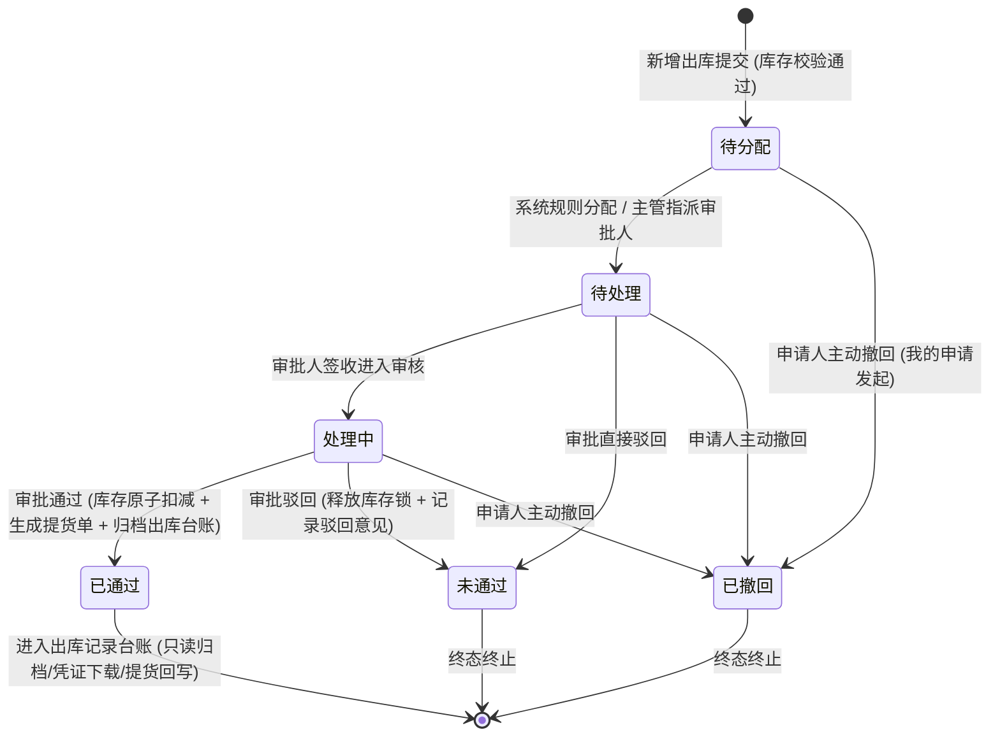

# 出库记录 业务规则规格

> **文档定位**：仓储 / 出库管理 / 出库记录模块状态机、动作约束、前置校验规则、库存扣减计算公式、关联单号带出、提货单联动、影像闭环、审批流转及并发控制的**唯一定义来源**。主 PRD、字段清单及端侧 ASCII 线框只引用本文件规则编号（O01~O15），不重复定义规则本体。
>
> **模块类型**：业务单据 / 流转执行与归档台账类（包含新增申请、库存选货/关联带出、审批流转、提货单生成及已生效归档查询）
>
> **参考文档**：[《出库记录主PRD》](./出库记录主PRD.md)、[《出库记录字段清单》](./出库记录字段清单.md)、[《出库记录_ASCII_列表页》](./出库记录_ASCII_列表页.md)、[《出库记录_ASCII_详情页》](./出库记录_ASCII_详情页.md)、[《出库记录_ASCII_新增页》](./出库记录_ASCII_新增页.md)、[《00-功能与数据权限清单》](../../00-功能与数据权限/功能与数据权限清单.csv)
>
> **版本**：V2.0 | **更新时间**：2026-09-04 | **责任人**：森云科技（Senyun Technology）

---

## 一、单据与能力定位

| 项目 | 内容 |
| :--- | :--- |
| **单据层级** | **【第2层-订单/执行控制层】**（仓储业务核心单据 —— 出库管理控制单据） |
| **核心职责** | 规范存货从监管库存扣减、货权释放、多货品库存位置选货或关联单号带出、提货信息采集、实物照片与 IoT 影像存证、审批通过后提货单生成，以及出库成功后的全生命周期归档台账追溯。 |
| **单据来源** | **三重来源机制**： 1. **PC 主动发起**：业务操作人员从 PC【工作台 → 仓储 → 出库管理 → 新增出库】发起普通出库、仓单/质押/抵押关联出库申请； 2. **移动端关联发起**：操作员从【业务办理 → 业务发起 → 出库发起】选择仓单/质押/抵押关联单号并带出货物； 3. **上游联动写入本台账**：移库单、转让单终审通过时，系统原子联动写入【移库出库】【转让出库】已通过出库记录（不生成提货单）； 4. **不进入本台账的上游业务**：质押/抵押加工完成等业务仅保留各自模块业务流水。 |
| **上游依赖** | **货主档案**：提供企业/个人货主统一社会信用代码、姓名与手机号； **库存中心**：提供可用库存、存货条码、库存位置及实时可用量； **业务关联单据**：仓单、质押单、抵押单（有效存续且允许出库）； **仓库档案**：提供仓库、库房及分区空间层级。 |
| **下游影响** | **库存中心**：出库生效后原子扣减 WMS 可用库存，更新存货条码状态； **提货单模块**：四类出库单审批通过后生成提货单，提货完成回写出库详情； **货权与风控**：仓单/抵质押出库联动更新货权清单； **后续业务**：作为盘点、风控监控与凭证导出的出库事实源头。 |
| **归档台账边界** | **【台账唯一展示已通过】**：出库记录主列表唯一定位为“已生效/已通过的出库单归档与查询台账”，审批中及已作废单据不在本列表呈现，本列表不设状态筛选和状态列。 |
| **入口分流** | PC 新增：工作台 → 仓储 → 出库管理 → 列表页【新增出库】；移动端发起：业务办理 → 业务发起 → 出库发起；PC 查询：工作台 → 仓储 → 出库管理。 |

---

## 二、数量与库存计算口径隔离表

| 口径名称 | 存在位置 | 业务含义与计算公式 | 约束与边界条件 |
| :--- | :--- | :--- | :--- |
| **可用数量** | 选货弹窗/关联明细行 | 读取时点的库存实时可用量 $Q_{\text{avail}}$ | 提交、审批、落库前必须再次实时校验；不得超过该值 |
| **出库数量** | 货品主行/库存位置行 | 本次从来源库存扣减的物理数量 $q$ | 数值 $> 0$，最多 4 位小数；关联出库须同时不超过关联单据剩余量 |
| **库存位置出库数量** | 普通出库二级明细 | 具体库存位置实际扣减数量 $q_i$ | 同一存货条码同一位置不得重复扣减；$\sum q_i$ 等于货品主行出库数量 |
| **货品总数量** | 统计汇总底栏 / 列表出库数量 | 单据内有效出库数量之和 | 关联出库只汇总已勾选且填写有效数量的行；不同物理单位不得直接相加 |
| **货品品类数** | 统计汇总底栏 | 普通出库按规格去重；关联出库按已勾选货品行计数 | 已勾选但数量为空的行仍计入品类数，提交时阻断 |
| **货物价值约** | 统计汇总底栏（关联出库） | $\text{价值} = \sum (\text{已勾选行出库数量} \times \text{单价})$ 换算为万元 | 缺少单价时不计算虚假价值；普通出库不展示 |
| **出库前/后数量** | 关联出库详情 | $\text{出库后} = \text{出库前} - \text{出库数量}$ | 审批通过/落库时固化为历史快照，详情页不得重新计算覆盖 |

---

## 三、单据状态机与流转定义

### 3.1 状态定义

| 状态名称 | 状态编码 (`Enum`) | 业务含义 | 是否终态 | 出库记录列表可见性 | 出现与流转说明 |
| :--- | :--- | :--- | :---: | :---: | :--- |
| **待分配** | `PENDING_ASSIGNMENT` | 单据已提交审核，等待系统分配或主管指派审批责任人 | 否 | 不可见 | 仅存在于工作中心/审批中心池 |
| **待处理** | `PENDING_PROCESS` | 已指派审批人，等待特定审批人审阅核验 | 否 | 不可见 | 仅在审批人待办列表展示 |
| **处理中** | `PROCESSING` | 审批人已打开单据，正在进行实物核验或补充调查 | 否 | 不可见 | 审批人审阅中状态 |
| **已通过** | `APPROVED` | 审批流程全节点核准通过，库存扣减事务完成，提货单已生成 | **是** | **唯一定位可见** | **【核心定位】出库记录列表展示且仅展示此状态单据** |
| **未通过** | `REJECTED` | 审批节点被驳回，出库单作废终止 | **是** | 不可见 | 终态留痕；释放库存锁；仅在我的申请中追溯 |
| **已撤回** | `WITHDRAWN` | 申请人在审批流转结束前主动撤回单据 | **是** | 不可见 | 终态留痕；释放库存锁；由制单人在我的申请中发起 |

### 3.2 状态流转图

---

## 四、动作能力与流转控制矩阵

| 触发动作 | 操作入口 | 适用角色 | 前置业务校验条件 | 结果状态 | 联动后置影响 | 失败阻断提示 (Toast / Alert) |
| :--- | :--- | :--- | :--- | :--- | :--- | :--- |
| **提交出库申请** | 新增页【提交审核】按钮 | 仓库操作员/制单人 (`R-WH-OUT-ADD`) | ① 出库日期 $\le$ 当前时间； ② 货主与出库类型必填； ③ 至少一条有效货品明细； ④ 出库数量 $\le$ 实时可用量（O06）； ⑤ 提货信息与现场照片完整（O11）。 | 待分配 / 待处理 | ① 建立库存锁； ② 异步调用摄像头触发出库前影像抓拍； ③ 发起出库审批流。 | 「提交失败：出库数量不得超过可用数量」 「提交失败：请上传出库现场照片」 |
| **新增关联出库** | 移动端【出库发起】或 PC 关联选择器 | 移动端/PC 操作员 (`R-WH-OUT-MOBILE-ADD`) | 关联单号有效且属于货主；满足解押/解抵押准入（O10）；关联货品不为空 | 待分配 / 待处理 | 确认填充关联货物，创建四类出库申请 | 「关联单号无效或已失效，请重新选择」 |
| **添加货品** | 普通出库【添加货品】 | 仓库操作员 | 已选择货主；库存属于权限范围且可用（O07） | — | 回填货品行与库存位置 | 「请输入货主名称」 「暂无可用库存」 |
| **审批分配** | 审批中心分配界面 | 库管主管 / 系统自动 | 具备分配权限；单据处于待分配 | 待处理 | 指派具体审批人并推送待办消息通知 | 「分配失败：单据已被分配或撤回」 |
| **审批通过** | 审批详情【通过】按钮 | 审批节点处理人 | 具备审批权限；非单据发起人（P06 自审禁止，O12）；库存锁仍有效 | 已通过 | ① 原子扣减库存，单据进入出库记录归档台账； ② 生成提货单（O11）； ③ 更新存货条码状态与货权。 | 「审批失败：自审禁止（不可审批本人发起的单据）」 「库存已不足；提货单生成失败」 |
| **审批驳回** | 审批详情【驳回】按钮 | 审批节点处理人 | 具备审批权限；填写驳回意见（必填 $\le 200$ 字） | 未通过 | ① 释放库存锁，单据终止； ② 记录驳回原因并通知申请人。 | 「驳回失败：请填写驳回原因」 |
| **申请人撤回** | 我的申请记录【撤回】 | 单据申请制单人本人 | 单据处于待分配、待处理或处理中；审批未终结 | 已撤回 | 释放库存锁；终止审批流并全流程归档留痕。 | 「撤回失败：单据已审批完成，无法撤回」 |
| **查看详情** | 列表行操作【查看详情】 | 具备查看权限 (`R-WH-OUT-VIEW`) | 单据处于已通过状态 | 已通过 | 进入只读详情；提货完成后展示【提货记录】板块 | — |
| **下载记录** | 列表行操作【下载记录】 | 具备下载权限 (`R-WH-OUT-DOWN-REC`) | 单据处于已通过状态 | 已通过 | 异步导出出库明细 Excel；记录审计日志 | 「导出失败：系统繁忙，请稍后重试」 |
| **单据下载** | 列表行操作【单据下载】 | 具备下载权限 (`R-WH-OUT-DOWN-DOC`) | 单据处于已通过状态 | 已通过 | 导出正式出库凭据 PDF；记录审计日志 | 「下载失败：凭证生成中，请稍后重试」 |

---

## 五、核心业务规则清单（O01 ~ O15）

### 1. 出库类型分流与生成边界

#### O01：普通出库 PC 选货
* 用户从 PC【工作台 → 仓储 → 出库管理】列表页右上角点击【新增出库】，选择货主和普通出库。
* 点击【添加货品】打开选货弹窗；未选货主时阻断并提示「请输入货主名称」。
* 弹窗只查询当前货主、当前账号仓库权限内的可用库存，结果先按货品分组展示。
* 展开货品分组后查看库存位置、入库时间、其他信息、状态和可用数量，可按入库时间、可用数量、生产日期排序，并分别填写本次出库数量。
* 普通新增页未添加货品时显示「暂无数据」；选货确认后主行展示货物名称、出库数量，展开后继续展示位置、具体位置、入库时间、其他信息、存货条码、状态和出库数量。
* 删除已选货品只允许在申请未提交时执行，并释放该行的前端占用标记。

#### O02：仓单/质押/抵押出库关联带出
* 仓单、质押、抵押出库从移动端【业务办理 → 业务发起 → 出库发起】选择有效关联单号；PC 端从列表页【新增出库】后，也提供按货主分页选择关联单号的控件。
* 关联单号必须属于当前货主且处于允许出库的业务状态；质押/抵押还必须满足解押/解抵押或业务授权条件（O10）。
* 选中关联单号后，系统提示「是否填充货物信息，便于快速填写？」；确认后按关联单号返回可出库货品和来源库存位置，自动展示到货品明细。
* PC 新增页不提供普通【添加货品】入口来替换关联来源；抵押/质押/仓单关联明细不展示货品行操作列，首列保留行选择复选框。
* 行选择与出库数量输入相互独立；货品品类数按勾选行计数，货品总数量和货物价值只汇总已勾选且填写有效数量的行。
* 关联单号改变时，清空旧货品、库存锁和汇总值，重新拉取新关联单号数据；禁止保留旧关联数据。

#### O03：出库单与提货单生成范围
* **手工/关联发起（4 类）**：普通出库、仓单出库、质押出库、抵押出库生成本模块出库单；审批通过后同一事务内生成提货单。
* **上游联动写入本台账（2 类）**：移库单、转让单终审通过时，系统原子联动写入【移库出库】【转让出库】已通过出库记录，关联同一移库/转让单号；**不生成提货单**（无实物离场交接场景）。
* **加工业务流水（2 类）**：质押加工出库、抵押加工出库仅在加工模块保留业务流水，**不进入**本模块台账。
* 四类需提货出库单审批流程通过后，服务端在同一业务事务中生成提货单；提货单生成必须使用业务幂等键，不能重复生成。
* 提货单生成失败时不得将出库单标记为已完成；应进入可重试/补偿状态并保留审计记录。

* **出库类型完整枚举（共 8 种展示，6 种进入本台账）**：

| 序号 | 出库类型 | 进入出库记录台账 | 生成提货单 | 业务来源入口 | 关联单号 |
| :---: | :--- | :---: | :---: | :--- | :--- |
| 1 | **普通出库** | **是** | 审批通过后生成 | PC 列表页【新增出库】 | 无（展示“—”） |
| 2 | **仓单出库** | **是** | 审批通过后生成 | 移动端【出库发起】；PC 关联选择 | 仓单号必填 |
| 3 | **质押出库** | **是** | 审批通过后生成 | 移动端【出库发起】；PC 关联选择 | 质押单号必填 |
| 4 | **抵押出库** | **是** | 审批通过后生成 | 移动端【出库发起】；PC 关联选择 | 抵押单号必填 |
| 5 | **移库出库** | **是（联动）** | 否 | 移库业务模块终审通过 | 移库单号（`YK...`） |
| 6 | **转让出库** | **是（联动）** | 否 | 转让业务模块终审通过 | 转让单号（`ZR...`） |
| 7 | **质押加工出库** | 否 | 否 | 加工业务模块 | 加工单号 |
| 8 | **抵押加工出库** | 否 | 否 | 加工业务模块 | 加工单号 |

---

### 2. 基础信息与主体校验规则

#### O04：业务时间合规性
* 出库日期精确到秒（`YYYY-MM-DD HH:mm:ss`），默认系统当前时刻。只能选择不晚于当前时间的日期时间，**严禁选择未来时间**；超前提交时系统前置阻断。
* 制单时间以服务端落库时间为准，不使用客户端时间覆盖。

#### O05：货主类型与字段隔离
* 支持 `企业` 与 `个人` 两大主体类型；
* 货主类型切换时，系统清空货主名称、标识、联系电话、身份证号、关联单号和已选货品，防止主体数据交叉污染；
* 货主名称必须来自货主档案或通过既有货主准入流程建档；不得用任意文本伪造已存在主体。

#### O06：必填与提交校验
* 提交普通出库必须同时满足：出库日期、货主、出库类型有效；至少一条货品明细且出库数量 $> 0$；每条货品绑定有效库存批次/存货条码；出库数量不超过读取时可用量；提货人信息完整；至少 1 张现场照片（最多 10 张，单张 $\le 5\text{M}$）；备注 $\le 140$ 字。
* 关联出库额外必须满足：关联单号有效、属于货主、处于允许出库状态；关联货品由系统按单号带出；出库数量同时不超过关联单据剩余量和库存实时可用量。

---

### 3. 选货弹窗与关联单号规则

#### O07：普通选货弹窗规则
* 未选择货主不可打开有效库存选择，点击时提示「请输入货主名称」。
* 只查询登录账号授权仓库的数据；后端不得仅依赖前端隐藏选项实现权限隔离。
* 仓库和货物筛选项旁提供【全选】复选框；全选只作用于当前筛选结果，不能突破租户、仓库和货主数据权限。
* 弹窗先按货品名称和汇总可用数量展示，展开后展示库存位置、入库时间、其他信息、状态、可用数量和出库数量；「全部/清空」只作用于当前货品下的库存明细。
* 货品分组行的出库数量仅在满足单仓出库条件时允许直接录入；不满足时显示「仅允许单个仓库出库」，由库存明细行按位置选择并校验。
* 支持按入库时间、可用数量、生产日期排序；同一库存批次同一位置重复选择必须合并或阻断，不得形成重复扣减行。

#### O08：关联单号与货品自动带出
* 选中单号后必须经用户确认是否填充货物信息；确认后按关联单据返回货品明细。
* 关联明细首列提供行选择复选框；未勾选行不进入页面汇总，出库数量编辑仍受双重可用量约束。
* 关联单号选择、关联货品加载和数量回填必须具备版本号；旧请求返回不得覆盖新选择。
* 关联单号清除或失效时，明细必须清空并提示重新选择，不能保留旧数据继续提交。

---

### 4. 库存扣减与货权准入

#### O09：库存扣减与防双花
* 提交或进入审批时可建立短时库存锁；锁定库存必须记录单据号、批次、位置、数量、失效时间和版本号。
* 审批通过时以行级排他锁或等价并发控制再次读取库存，校验通过后在同一事务内扣减可用库存、写入出库流水、更新存货条码状态和出库单状态。
* 任一环节失败必须整体回滚，不能出现「台账已通过但库存未扣减」或「库存已扣减但没有出库记录」。

#### O10：先解押/解抵押后出库
* 质押出库、抵押出库必须检查关联单据的货权和解押/解抵押授权状态。
* 关联单据未生效、已失效、已全部出库或未满足解押条件时禁止提交。
* 禁止通过普通出库绕过关联单据对抵押/质押货物进行扣减。

---

### 5. 提货单、影像与审批专网

#### O11：提货单生成与现场影像
* 新增页提货人信息和现场照片作为提货单生成依据；现场照片至少 1 张、最多 10 张，格式 jpg/png/jpeg。
* 设备抓拍为异步凭证。无摄像头或抓拍失败时写入异常审计，但不覆盖已有现场照片，也不得伪造图片。
* 四类出库单审批流程通过后生成提货单，提货操作人、提货时间、是否本人提货、提货现场照片、提货设备抓拍图和其他说明由提货单模块维护。
* 提货完成事件回写成功后，出库详情展示【提货记录】板块；提货未完成时不展示该板块。
* 提货单生成只允许在审批通过事件触发，重复回调必须幂等。

#### O12：审批专网与 P06 自审禁止
* 出库审核仅在审批中心或业务申请入口处理，出库记录列表不提供审核按钮。
* 审批人不能审批自己发起的出库申请；自审时只展示详情，不展示通过/驳回处理按钮（P06/R11）。
* 采用状态条件更新，状态不是预期值时拒绝写入并提示单据状态已变化。

---

### 6. 台账查询、敏感脱敏与防并发审计

#### O13：已通过台账专网过滤
* 出库记录列表接口强制硬编码 `status = 'APPROVED'` 过滤条件。
* 详情显示归档时快照；后续库存位置或关联单据变化不得反写已归档出库数量。
* 普通出库详情按货物主行展开库存位置明细；抵押、质押、仓单出库详情直接平铺展示，不提供展开操作。

#### O14：敏感数据脱敏规则
* 手机号展示为前后保留、隐藏中间四位；身份证号隐藏中间八位。
* 列表不展示身份证号；详情按角色授权脱敏；导出遵循同一规则。
* 任何日志不得记录验证码、明文身份证号和明文手机号。

#### O15：并发控制、幂等与全路径审计
* 创建、审批通过、提货单生成、提货完成、下载记录和下载凭证均使用业务幂等键或防抖 token。
* 审计记录操作人、角色、时间戳、客户端 IP、请求流水号、单据号、前后版本和结果。
* 下载任务不得重复扣库存或改变出库单状态；下载行为本身写入审计。

---

## 六、异常提示与权限索引

### 6.1 异常与提示口径

| 场景 | 提示 |
| :--- | :--- |
| 普通添加货品未选货主 | 请输入货主名称 |
| 关联单号未选货主 | 请先选择货主 |
| 没有可用库存 | 暂无可用库存 |
| 数量超过库存 | 出库数量不得大于可用数量 |
| 关联单号失效 | 关联单号无效或已失效，请重新选择 |
| 普通出库未上传照片 | 请上传出库现场照片 |
| 提交重复 | 请求正在处理中，请勿重复提交 |
| 审批状态变化 | 单据状态已发生变化，请刷新后重试 |
| 自审 | 不可审批本人发起的出库申请 |

### 6.2 权限与数据隔离

| 角色能力 | 最小权限 |
| :--- | :--- |
| 查看列表/详情 | R-WH-OUT-VIEW |
| 新增普通出库 | R-WH-OUT-ADD |
| 移动端关联出库 | R-WH-OUT-MOBILE-ADD |
| 审批 | R-WH-OUT-APPROVE |
| 下载明细 | R-WH-OUT-DOWN-REC |
| 下载凭证 | R-WH-OUT-DOWN-DOC |

* 所有列表、弹窗和详情接口均叠加租户隔离和仓库数据权限。
* 普通选货弹窗不得返回账号无权仓库的库存。
* 关联单号查询不得跨货主、跨租户、跨数据权限范围。

---

## 七、修订记录

| 日期 | 版本 | 变更内容说明 | 影响范围 | 修订人 |
| :--- | :--- | :--- | :--- | :--- |
| 2026-09-04 | V1.0 | **建立出库记录业务规则**：明确 PC 普通选货、移动端关联带出、库存强一致、提货单联动及审批专网规则。 | 出库记录全模块 | AI PM / 森云科技 |
| 2026-09-04 | V1.9 | **明确 PC/移动端入口分流**：补充三类入口职责边界与动作矩阵。 | 入口分流、核心规则 | AI PM / 森云科技 |
| 2026-09-04 | **V2.0** | **对齐入库记录与设备管理模块文档结构**： 1. 规范单据与能力定位、数量计算口径隔离表； 2. 重构六状态机与动作能力矩阵； 3. 按 O01~O15 分层整理核心规则清单； 4. 合并异常提示与权限索引章节。 | 出库记录新增、列表、详情、审核及库存联动 | AI PM / 森云科技 |
| 2026-09-04 | **V2.1** | **移库/转让出库台账口径统一**：O03 明确 6 类进入本台账、仅 4 类生成提货单；移库出库/转让出库联动写入不生成提货单。 | O03、单据来源 | AI PM / 森云科技 |
