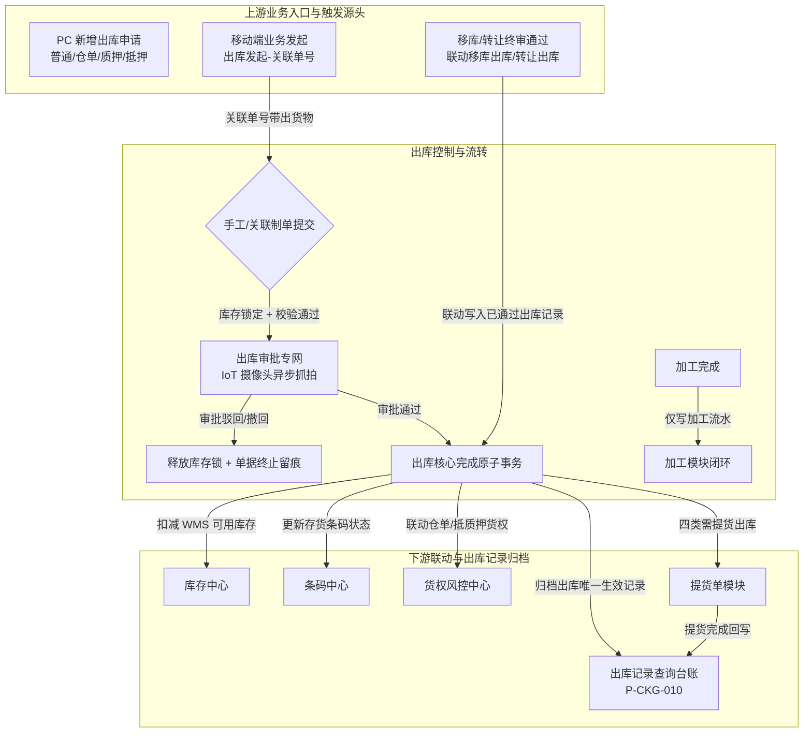

# 出库记录主PRD

> **模块定位**：仓储业务层核心流转单据与生效归档台账，规范存货从监管库存扣减、货权释放、多货品选货/关联带出、提货信息采集、现场照片与设备抓拍存证、审批通过后提货单生成及全生命周期台账追溯，打通“货-仓-金”出库闭环。  
> **版本**：V2.0 | **更新时间**：2026-09-04 | **责任人**：森云科技（Senyun Technology）  
> **编写依据**：[出库记录字段清单.md](./出库记录字段清单.md) 是本模块所有字段定义、枚举与页面展示的唯一基准；[出库记录业务规则规格.md](./出库记录业务规则规格.md) 是本模块状态机、校验算法、库存扣减、关联单号、审批流转、提货单联动及并发控制的唯一定义来源；[出库记录_ASCII_列表页.md](./出库记录_ASCII_列表页.md)、[出库记录_ASCII_详情页.md](./出库记录_ASCII_详情页.md) 与 [出库记录_ASCII_新增页.md](./出库记录_ASCII_新增页.md) 是界面交互与布局的基准来源。

---

## 1. 业务背景与业务痛点

### 1.1 业务背景
在供应链金融存货监管系统中，质押品或监管存货的物理出库是货权释放与库存扣减的关键事实节点。从业务人员发起出库申请、按库存位置精准选货或按仓单/抵质押单关联带出、填写提货信息与现场影像，到审批通过后原子扣减库存、生成提货单并完成提货回写，出库全流程数据的准确性、完整性与防篡改能力，直接决定了银行、保理商及核心企业对底层资产流转的信任度。

### 1.2 核心业务痛点
1. **选货与账面库存脱节**：普通出库若只录入货品名称而不绑定具体库存位置与存货条码，容易造成“账面扣减、库区难核”的账实不符风险；
2. **关联出库绕过货权准入**：仓单、质押、抵押出库若缺乏关联单号强校验与解押/解抵押前置条件，可能被普通出库路径绕过，引发货权违规释放；
3. **库存并发双花风险**：出库数量与库存可用量在提交、审批、落库多个时点存在并发变化，缺乏锁定与二次校验将导致超卖或重复扣减；
4. **提货与出库事实割裂**：四类出库单需提货信息作为审批通过后生成提货单的依据；若提货完成信息不能条件回写出库详情，现场提货过程与出库归档事实难以形成闭环；
5. **台账状态混杂与数据干扰**：审批中、未通过或已撤回的半成品单据若直接混入历史记录台账，容易对仓库统计、货权查验及资金方审计造成极大困扰；
6. **多业务类型边界不清**：移库/转让联动出库与加工出库流水边界需严格区分——移库出库、转让出库应写入出库台账但不生成提货单；加工出库仅保留模块内流水，避免台账重复与审计口径混乱。

---

## 2. 功能范围 (Scope)

| 包含功能 (In Scope) | 不包含功能 (Out of Scope) |
| :--- | :--- |
| - **出库类型纳管（6 类进入本台账，4 类生成提货单）**：   1. **普通出库**：PC 端【添加货品】弹窗按货主可用库存选货；   2. **仓单出库**：关联仓单号后系统带出关联货物；   3. **质押出库**：关联质押单号后系统带出关联货物；   4. **抵押出库**：关联抵押单号后系统带出关联货物；   5. **移库出库**：移库单终审联动写入本台账（不生成提货单）；   6. **转让出库**：转让单终审联动写入本台账（不生成提货单）； - **双端入口分流**：PC 工作台【仓储 → 出库管理】为已通过台账查询与 PC 新增入口；移动端【业务办理 → 业务发起 → 出库发起】为仓单/质押/抵押关联出库发起入口； - **关联出库明细**：行选择与出库数量输入相互独立；汇总只统计已勾选且填写有效数量的行； - **提货信息与影像闭环**：新增页采集提货人信息与出库现场照片；审批通过后生成提货单；提货完成后详情回显提货人信息并展示【提货记录】板块； - **库存锁定与原子扣减**：提交/审批期间库存锁定，审批通过同一事务内扣减可用库存并写入出库流水； - **审批专网与自审禁止**：审批流中执行 P06 自审禁止；列表不提供审核按钮； - **已生效归档台账检索**：列表仅展示已通过单据，提供单号、日期、货主、类型、仓库、货品、制单人等多维检索； - **双重凭证导出**：支持【下载记录】（出库明细 Excel）与【单据下载】（正式出库单据 PDF）。 | - **移库/转让出库提货单**：移库出库、转让出库虽进入本台账归档，**不生成**提货单； - **加工类出库流水**：质押/抵押加工出库仅在加工模块保留业务流水，不进入本台账； - **草稿与暂存**：系统设计不支持草稿箱机制； - **列表直接编辑/删除**：本台账不提供修改、编辑或物理删除按钮； - **单据内混合类型**：严禁一张出库单混合多种出库类型； - **已归档单据反悔作废**：已通过归档的单据为法律凭据，不支持线上反审批或冲正（需走后续入库/异动等逆向流程）； - **货主档案维护**：货主主体建档由货主档案模块承载； - **仓单/抵质押单开立与解押审批本身**：由对应金融业务模块承载。 |

---

## 3. 模块定位与系统链路

---

## 4. 业务场景与用户故事

| 场景编号 | 业务场景 | 触发角色 | 核心交互与风控约束 | 业务价值 |
| :--- | :--- | :--- | :--- | :--- |
| **S01** | 普通货物部分出库 | 仓库操作员 / 监管员 | PC 选择货主和普通出库，打开【添加货品】弹窗按货品分组展开库存位置，分别录入出库数量；填写提货信息与现场照片后提交审核。**出库数量不得超过读取时点可用量，服务端锁定后再次校验**。 | 规范自有存货精准选货扣减，防止账实不符与库存双花。 |
| **S02** | 仓单关联出库 | 移动端操作员 / 仓库监管员 | 移动端【出库发起】或 PC 关联选择器选择有效仓单号，确认填充后系统带出关联货物；明细展示来源位置、可用数量与出库数量。 | 确保仓单出库与仓单号强绑定、货权可追溯。 |
| **S03** | 质押/抵押关联出库 | 业务人员 / 监管员 | 选择质押/抵押单号，系统校验解押/解抵押准入后带出可出库货物；行选择与数量输入独立，汇总只计已勾选有效行。 | 货权准入、库存扣减和出库记录闭环，禁止绕过关联单据。 |
| **S04** | 移库/转让联动出库归档 | 仓库调度员 / 监管员 | 移库单、转让单终审通过时，系统原子联动写入【移库出库】【转让出库】已通过出库记录，关联移库/转让单号；**不生成提货单**。 | 跨模块账实对冲可在出库台账统一检索，避免与现场提货混淆。 |
| **S05** | 加工业务出库流水 | 现场监管员 | 质押/抵押加工完成后仅在加工模块保留投入/产出流水，不进入本出库台账。 | 保持加工台账口径独立。 |
| **S06** | 审批通过生成提货单 | 提货员 / 监管员 | 普通/仓单/质押/抵押四类出库单审批通过后，服务端在同一业务事务中生成提货单；提货完成后回写提货人信息与【提货记录】板块。 | 出库事实与现场提货过程形成完整闭环。 |
| **S07** | 审批流裁决 | 库管主管 / 风控人员 | 审批人审阅现场照片与申报数据；执行 P06 自审禁止；通过后原子扣减库存并归档。 | 保障金融级审批合规与库存强一致。 |
| **S08** | 已通过台账检索与凭证下载 | 货主 / 资金方 / 审计人员 | 进入「出库记录」页面，通过单号、日期、货主、类型、仓库等多维检索已生效台账；点击【查看详情】查阅完整明细；点击【单据下载】导出标准 PDF 凭证。 | 为多方协同提供公开、透明、不可抵赖的履约台账。 |

---

## 5. 状态机与动作能力矩阵

> 状态变迁严格由系统业务动作与审批驱动，禁止任何前台下拉直接改动状态。详细定义见 [出库记录业务规则规格.md §三/§四](./出库记录业务规则规格.md)。

| 动作名称 | 待分配 (`PENDING_ASSIGNMENT`) | 待处理 (`PENDING_PROCESS`) | 处理中 (`PROCESSING`) | 已通过 (`APPROVED`) ⭐台账唯一状态 | 未通过 (`REJECTED`) | 已撤回 (`WITHDRAWN`) |
| :--- | :---: | :---: | :---: | :---: | :---: | :---: |
| **新增出库提交** | ❌ (仅制单页发起) | ❌ | ❌ | ❌ | ❌ | ❌ |
| **出库记录列表展示** | ❌ | ❌ | ❌ | **✅ 唯一定位展示** | ❌ | ❌ |
| **查看详情** | ✅ (审批中心/申请中心) | ✅ | ✅ | **✅ (本菜单行操作)** | ✅ | ✅ |
| **审批分配** | ✅ (库管主管) | ❌ | ❌ | ❌ | ❌ | ❌ |
| **审批通过/驳回** | ❌ | ✅ (审批人) | ✅ (审批人) | ❌ | ❌ | ❌ |
| **申请人撤回** | ✅ (申请人本人) | ✅ (申请人本人) | ✅ (申请人本人) | ❌ (终态不可撤) | ❌ | ❌ |
| **下载记录 (Excel)** | ❌ | ❌ | ❌ | **✅ (本菜单行操作)** | ❌ | ❌ |
| **单据下载 (PDF)** | ❌ | ❌ | ❌ | **✅ (本菜单行操作)** | ❌ | ❌ |

---

## 6. 页面交互规格索引

本模块在 PC 端包含三个标准页面，高保真 ASCII 界面线框与微观交互规范已拆分为独立专页维护：

### 6.1 出库记录 — 列表页（`P-CKG-010`）
- **对应文档**：[出库记录_ASCII_列表页.md](./出库记录_ASCII_列表页.md)
- **核心规格**：
  - 两行筛选区：单号、日期范围、货主名称/标识（综合搜索）、出库类型、仓库名称、货品名称、制单人、制单时间、黄色【查询】与【重置】；
  - 内容表格（11 列）：`序号`、`出库单号`、`货主名称/标识`（双行）、`出库类型`、`出库日期`、`仓库名称`、`关联单号`、`货物名称`（Tooltip 气泡展示多货品）、`出库数量`（千分位）、`制单人`（双行）、`操作`；
  - 行操作列：【查看详情】、【下载记录】、【单据下载】；
  - 页面右上角提供【+ 新增出库】入口；
  - 台账接口固定过滤 `APPROVED`，不设状态筛选。

### 6.2 出库单详情页（`P-CKG-010-DETAIL`）
- **对应文档**：[出库记录_ASCII_详情页.md](./出库记录_ASCII_详情页.md)
- **核心规格**：
  - 顶部单据信息网格：出库单号（带一键复制）、右上角【返回】按钮、绿色圆形状态印章【已通过】；
  - 基础信息：制单人、制单时间、货主名称、货主标识（脱敏）、出库日期、出库类型、仓库名称、关联单号、备注信息；提货完成后额外回显提货人类型、姓名、身份证号、手机号、车牌号；
  - 底部双 Tab 联动：
    - **Tab 1【出库明细】**：普通出库一级表格展示货物主行，点击展开图标展开二级库存位置明细；抵押/质押/仓单出库使用平铺明细表，展示仓库、库房、分区、出库前后数量及存货条码；
    - **Tab 2【审核记录】**：以时间轴形式展示全流程审批节点、处理人、处理结果、时间与审批意见；
  - 提货完成后展示【提货记录】板块（操作人、提货时间、本人提货、其他说明、现场照片、设备抓拍图）；提货未完成时不展示该板块。

### 6.3 新增出库页（`P-CKG-010-ADD`）
- **对应文档**：[出库记录_ASCII_新增页.md](./出库记录_ASCII_新增页.md)
- **核心规格**：
  - 页头动作：【取消】与黄色主按钮【提交审核】；
  - 折叠面板 1【基础信息】：录入出库日期、选择货主类型（企业/个人）、选择货主名称自动带出标识、选择出库类型、条件展示关联单号、填写备注（140 字）；
  - 折叠面板 2【货品明细】：
    - **普通出库**：点击【+ 添加货品】打开选货弹窗，按货品分组展开库存位置，填写出库数量；回填后货品行可展开查看位置明细；
    - **关联出库**：选择关联单号并确认填充后带出货物；行选择与数量输入独立；抵押/质押/仓单不展示【添加货品】和操作列；
  - 折叠面板 3【提货信息】：提货人类型、姓名、身份证号、电话、车牌号及出库现场照片（必传，最多 10 张）；
  - 固定底栏统计栏：实时汇总展示货品品类数、货品总数量；关联出库额外展示货物价值约。

---

## 7. 核心业务规则索引

| 规则编码 | 规则名称 | 规则核心逻辑摘要 | 规则规格唯一定义章节 |
| :--- | :--- | :--- | :--- |
| **O01** | 普通出库 PC 选货 | 弹窗按货主与权限查询可用库存，货品分组展开，单仓条件提示 | [业务规则规格 §五.1](./出库记录业务规则规格.md#o01普通出库-pc-选货) |
| **O02** | 关联出库带出 | 仓单/质押/抵押按关联单号带出货物，确认填充，禁止替换来源 | [业务规则规格 §五.1](./出库记录业务规则规格.md#o02仓单质押抵押出库关联带出) |
| **O03** | 出库单与提货单生成范围 | 6 类进入本台账；仅 4 类生成提货单；移库/转让联动写入不生成提货单 | [业务规则规格 §五.1](./出库记录业务规则规格.md#o03出库单与提货单生成范围) |
| **O04~O06** | 业务时间、货主主体与提交校验 | 出库日期合规；货主切换清空明细；必填与双重库存校验 | [业务规则规格 §五.2](./出库记录业务规则规格.md#o04业务时间合规性) |
| **O07~O08** | 选货弹窗与关联单号 | 全选控件、单仓提示、关联单号版本号与清空联动 | [业务规则规格 §五.3](./出库记录业务规则规格.md#o07普通选货弹窗规则) |
| **O09~O10** | 库存扣减与货权准入 | 行锁防双花；质押/抵押须满足解押/解抵押条件 | [业务规则规格 §五.4](./出库记录业务规则规格.md#o09库存扣减与防双花) |
| **O11~O12** | 提货单、影像与审批专网 | 审批通过生成提货单；提货完成条件回写；P06 自审禁止 | [业务规则规格 §五.5](./出库记录业务规则规格.md#o11提货单生成与现场影像) |
| **O13~O15** | 台账过滤、脱敏与审计 | 列表仅 APPROVED；历史快照不可覆盖；幂等与全路径审计 | [业务规则规格 §五.6](./出库记录业务规则规格.md#o13已通过台账专网过滤) |

---

## 8. 非功能性需求

### 8.1 性能要求
- 列表检索响应时间：常规筛选（单号、日期、货主、仓库）在 10 万级单据数据量下，查询响应时间 $\le 1.0\text{s}$；
- 详情展开子表格：前端本地数据即时展开渲染，无白屏或二次卡顿；
- 凭证导出：单据 PDF 生成并下载响应时间 $\le 3.0\text{s}$。

### 8.2 安全性与合规性
- 敏感数据脱敏：个人手机号与统一信用代码展示脱敏中间 4 位，身份证号展示脱敏中间 8 位；
- 影像安全：私有 OSS 存储，详情页查看大图采用带有效期的动态防盗链临时签名 URL（有效时长 10 分钟）；
- 审计追溯：严格落实金融监管数据留痕标准，单据创建、审批、下载、提货回写及查看影像日志保留 5 年以上不可更改；
- 库存强一致：出库扣减、货权变化与出库状态在同一事务或具备可核对的补偿事务内完成。

---

## 修订记录

| 日期 | 版本 | 变更内容说明 | 影响范围 | 修订人 |
| :--- | :--- | :--- | :--- | :--- |
| 2026-09-04 | V1.0 | **建立出库记录主 PRD**：以入库记录为结构基准，明确普通 PC 选货、关联出库带出、提货单生成和双 Tab 详情。 | 出库记录列表、新增、详情 | AI PM / 森云科技 |
| 2026-09-04 | V1.9 | **明确 PC/移动端入口分流**：区分 PC 新增、移动端业务发起与 PC 工作台归档查询三类入口职责边界。 | 入口说明、流程图 | AI PM / 森云科技 |
| 2026-09-04 | **V2.0** | **对齐入库记录与设备管理模块文档结构**： 1. 规范业务背景、业务痛点与功能范围 In/Out of Scope 表格； 2. 重构 Mermaid 系统链路图与业务场景用户故事； 3. 确立六状态机与动作能力矩阵； 4. 索引三份 ASCII 线框与 O01~O15 核心规则矩阵； 5. 补充非功能性需求分层与非功能安全审计要求。 | 出库记录全模块（列表、详情、新增、审核及库存联动） | AI PM / 森云科技 |
| 2026-09-04 | **V2.1** | **移库/转让出库台账口径统一**： 1. 明确移库出库、转让出库终审联动写入本台账； 2. 区分「进入出库台账」与「生成提货单」边界（仅 4 类需提货业务生成提货单）； 3. 更新 O03 枚举矩阵与系统链路 Mermaid。 | 出库类型边界、O03、场景故事 | AI PM / 森云科技 |
