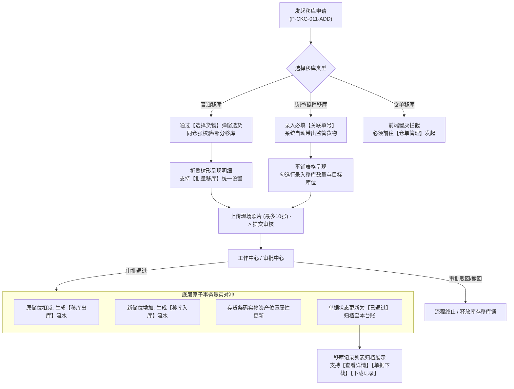

# 移库记录业务规则规格

> **文档定位**：仓储 / 移库管理 / 移库记录模块（单据流转、同仓强约束、分流新增、批量移库、账实对冲、下载审计、权限控制）所有业务逻辑与交互约束的唯一定义真源。
> 字段定义见 [移库记录字段清单.md](./移库记录字段清单.md)；业务场景见 [移库记录主PRD.md](./移库记录主PRD.md)。
>
> **业务真源与核心底线**：
> - 移库业务属于监管实体仓库内部的储位调拨，**严格限定在同一个仓库内进行**，系统底层绝对阻断跨仓库移库；
> - 涉及质押、抵押或仓单货物的移库，必须严格继承原有货权管控状态与监管规则，严禁通过移库逃避风控监管；
> - 审批通过生效时，系统原子执行“原储位扣减（移库出库） + 新储位增加（移库入库）”的对冲账务；
> - 严禁凭空臆造未在系统采集或核准截图中存在的规则。
>
> **版本**：V1.2 | **更新时间**：2026-09-16 | **责任人**：森云科技（Senyun Technology）

---

## 一、模块业务定位与单据流转

### 1.1 模块定位与业务流转

### 1.2 移库单生命周期状态说明

| 状态编码 | 状态名称 | 状态定义说明 | 业务表现 |
| :--- | :--- | :--- | :--- |
| `DRAFT` | **草稿 (不提供)** | 系统不提供独立草稿箱机制 | 退出新增页即丢弃未保存数据 |
| `PENDING` | **审批中** | 申请已提交，在审批中心流转中 | 在审批中心与“我的申请”展示；原库存处于移库占用锁定状态 |
| `APPROVED` | **已通过** | 审批流全节点通过，移库落库生效 | **进入本台账归档**；完成库存原子对冲，右上角展示绿色【已通过】印章 |
| `REJECTED` | **未通过** | 审批节点被驳回终止 | 原库存移库占用释放；可在审批中心查看驳回意见，不进入本台账 |
| `REVOKED` | **已撤回** | 发起人在审批完成前主动撤回 | 释放移库占用，在“我的申请”留痕，不进入本台账 |

---

## 二、列表操作按钮矩阵

移库记录列表操作列固定提供 3 个文字按钮：

| 操作按钮 | 对应权限点 | 按钮表现 | 触发行为说明 |
| :--- | :--- | :---: | :--- |
| **查看详情** | `详情` | 金色高亮 | 打开移库单详情页/弹窗，展示单据头部、现场/设备抓拍照片、移库明细与审核记录 |
| **下载记录** | `下载记录` | 金色高亮 | 弹出【下载记录】弹窗，查看该单据历史生成的文件名、操作人、时间及复用下载 |
| **单据下载** | `单据下载` | 金色高亮 | 触发后台异步生成当笔正式 PDF 移库单凭证，并在生成成功后沉淀至【下载记录】 |

---

## 三、核心业务规则与逻辑规格

### 【同仓移库物理边界强约束】(R01)
1. **物理监管边界**：移库业务仅支持同一实体监管仓库内部的储位调拨（如从库房 A 移至库房 B，或从分区 1 移至分区 2），严禁跨仓库调拨。
2. **跨仓移库前端强阻断**：
   - 在普通移库【选择货物】弹窗中，若某货品规格在多个仓库均有可用库存，该货品一级主行移库数量输入框**直接置灰锁定**，并常驻提示文字：**`仅允许单个仓库移库`**；
   - 禁止跨仓汇总调拨，必须展开二级明细，按具体单个仓库下的库存储位进行勾选和数量输入。
3. **单据仓库一致性**：单张移库申请单内添加的所有货物，其移出仓库与移入库房/分区所属的仓库必须保持 100% 绝对一致，后端接口强校验，校验失败直接拦截报错。

### 【移库类型来源与仓单移库置灰】(R02)
1. **类型矩阵**：
   - `普通移库`（存货移库）：自有无权利负担的普通存货移库；
   - `质押移库`：处于质押监管状态下的存货移库，必须关联有效质押单；
   - `抵押移库`：处于抵押监管状态下的存货移库，必须关联有效抵押单；
   - `仓单移库`：已签发数字仓单货物的移库。
2. **手工发起与跨模块联动边界**：
   - **普通/质押/抵押移库**：允许在 PC 端【新增移库】页面手工发起申请；
   - **仓单移库**：移库管理新增下拉选项中明确标注：**`仓单移库 (请到仓单管理操作移库)`**，该选项在新增页置灰禁用不可选。仓单移库必须由【仓单管理】模块发起仓单项下货物的移库变更，审批通过后由系统自动联动写入本台账，防止脱离仓单法律效力擅自移位。

### 【普通移库选货折叠与批量设置】(R03)
1. **选货弹窗规则**：
   - 普通移库新增页右上角提供【⊕ 添加货品】按钮，点击呼出【选择货物】弹窗；
   - 弹窗支持仓库筛选（带全选）、货物筛选（带全选）、入库时间正序/倒序（默认先进先出 FIFO）、可用数量排序、生产日期排序；
   - **部分移库支持**：二级明细输入框允许输入小于当前位置可用数量的任意正数值，系统支持库存拆分调拨；点击【全部】一键填满可用量，点击【清空】一键清零。
2. **折叠树形呈现**：
   - 确认选货后回填至新增页货品明细区，按“一级货品主行 + 二级展开库存位置明细”呈现；
   - 二级明细中，移出位置（仓库-库房-分区）、移出具体位置、入库时间、其他信息、存货条码为只读快照；
   - 现场操作员必须为每个位置逐行选择【移入库房/分区】（必选），并选填【移入具体位置】（0/140字）。
3. **【批量移库】一键覆盖机制**：
   - 一级主行操作列提供 **【批量移库】** 按钮；
   - 点击弹出批量移库弹窗，提示：`(i) 批量移库将所选货物全部移入相同位置`；
   - 操作员在弹窗中选择目标【批量移入库房/分区】并选填【具体位置】（0/140字），点击【确定】后，系统自动将当前货品主行下**所有二级明细行的目标储位批量覆盖回填**。

### 【抵押质押移库关联单号与货权继承】(R04)
1. **关联单号驱动**：
   - 切换为质押移库或抵押移库后，表头强制展示 **`* 关联单号`（必填）**；
   - 操作员输入或下拉选中对应质押/抵押单号后，系统自动校验该单据是否处于有效监管存续期。
2. **平铺表格勾选（禁止添加无关货物）**：
   - 页面不提供【添加货品】入口，表格直接平铺展示该关联单号项下所有受押货物明细；
   - 第一列为复选框（支持表头全选），勾选要移位的货物行，逐行输入移库数量（不得超过可用量）、选择目标移入库房/分区及输入移入具体位置；
   - 底部品类数与总数量仅对**已勾选且填写有效数量的行**进行动态累加。
3. **货权无缝继承**：
   - 抵押/质押货物完成移库后，其质押货权属性、质押单号绑定关系及司法监管标签无缝继承，存货条码保持唯一不变，不得因物理储位变更而解除或削弱质押效力。

### 【审批终审原子账实对冲】(R05)
1. **审批流转与库存锁定**：
   - 移库申请提交后进入审批流；在审批未完结前，对应移库库存施加“移库占用锁”，禁止被其他出库、转让或移库单据重复选择。
2. **终审通过原子账实对冲（核销出库 + 登记入库）**：
   - 审批终审通过时，底层数据库事务执行原子对冲：
     1. **原位置出库扣减**：在原移出储位扣减在库库存，联动生成 1 条 **`出库类型=移库出库`** 的已通过出库记录（写入【出库记录】台账，不生成提货单）；
     2. **新位置入库增加**：在目标移入储位增加在库库存，联动生成 1 条 **`入库类型=移库入库`** 的已通过入库记录，并自动关联移库单号；
     3. **存货条码与二维码资产继承**：存货资产实物条码与二维码图形保持原值不变，底层物理库位指针原子更新至新库房/分区；
   - 整个出入库对冲在单个数据库本地事务内完成，确保账账、账实 100% 吻合。

### 【凭证生成与下载记录审计】(R06)
1. **【单据下载】异步导出**：
   - 点击列表行操作【单据下载】，服务端调取当笔移库单历史快照，异步渲染为标准 PDF 移库凭单并存入对象存储（OSS）；
   - 单据生成成功后，向【下载记录】表追加 1 条成功记录。
2. **【下载记录】弹窗复用与司法审计**：
   - 点击列表行操作【下载记录】，弹出弹窗，展示该移库单历史所有生成记录（序号、文件名、操作人、生成时间、状态）；
   - 操作列提供【下载】金色按钮，点击直接从对象存储获取受控签名文件流完成下载，避免重复渲染消耗系统资源；
   - 全程记录操作账号与时间，提供法定司法存证追溯依据。

### 【台账终态归档与禁止反冲正】(R07)
1. **唯一定位**：本【移库记录】台账与入库记录、出库记录相同，**仅展示终态生效（审批通过）的单据**；审批中单据由“工作中心/审批中心”和“我的申请”承载。
2. **严禁线上反审批冲正**：
   - 移库单一旦审批通过并归档，系统不提供“撤销移库”或“反审核”功能；
   - 若现场发现移库错误或需回移，必须重新发起一笔逆向的新移库申请（由新位置移回原位置）并走完规范审批流程，确保全生命周期审计链路清晰留痕。

### 【现场照片必传与设备抓拍】(R08)
1. **现场照片必传**：新增移库时必须上传现场移库作业照片（支持 jpg/png/jpeg，单张 ≤ 5M，最多 10 张）；未上传照片提交时强阻断。
2. **物联网（IoT）设备自动联动抓拍**：移库单提交落库瞬间，系统自动调用移出库区与移入库区绑定的智能球机/枪机进行现场实时抓拍，抓拍图像固化于详情页【设备抓拍图】；若摄像头离线或抓拍超时，友好展示“抓图失败/无监控设备”，不阻断单据流转。

### 【货权档案同步与存证互通】(R09)
* **触发时机**：移库单审批终审通过（`APPROVED`）且底层原子对冲完成时；
* **【06-货权档案】互通行为**：
  1. **物理位置即时同步**：即时更新该货品物理存放库位（仓库-库房-分区）；仓单移库同步更新货权档案中的对应货品存放位置属性（对齐货权档案 R03/R04），彻底消除“仓单已移位而货权档案仍停留在原储位”的数据脱节；
  2. **货权属性与监管继承**：货物原有的所有权人、抵押权/质权单号绑定关系、公允货值与风控规则保持完全不变；
  3. **跨仓调拨（若有）**：扣减原仓库档案库存，并在移入仓库为该货品建立新的对应货权档案。
* **【07-货权公示】互通行为**：
  1. 货权牌制作表单中的【存放地点】自动联动更新为最新移库后库位路径；
  2. 抵质押货权公示记录保持有效存续，确保公示牌面库位信息真实可信。
* **【08-证据管理】互通行为**：
  1. 自动生成一条存证类型=【移库】流水；
  2. **现场抓拍物证强制归档**：**强制挂载现场抓拍移库作业照片原文件**（R08），未上传照片不可生成存证；
  3. **区块链存证上链**：触发中仓登第三方存管服务推送，生成唯一存证哈希并回写存证报告。

---

## 四、数据权限与角色控制矩阵（RBAC）

| 角色代码 | 角色名称 | 可视数据范围 | 允许的操作权限 |
| :--- | :--- | :--- | :--- |
| `R-SYS-ADMIN` | 系统超级管理员 | 全平台租户与全部仓库移库单 | 查看页面、详情、单据下载、下载记录 |
| `R-WMS-OPERATOR` | 仓库监管员 / 操作员 | 当前账号有权限的管辖仓库移库单 | 查看页面、新增移库、详情、单据下载、下载记录 |
| `R-WMS-MANAGER` | 仓储主管 | 负责仓库的全部移库单 | 查看页面、新增移库、详情、单据下载、下载记录、审批移库 |
| `R-FIN-AUDITOR` | 资方风控审核员 | 所属资金方在押/关联的移库单 | 查看页面、详情、单据下载、下载记录（只读审计） |

---

## 修订记录

| 日期 | 版本 | 变更内容说明 | 影响范围 | 修订人 |
| :--- | :--- | :--- | :--- | :--- |
| 2026-09-04 | **V1.0** | 建立移库记录最新基准版业务规则规格。 | 全模块 | AI PM / 森云科技 |
| 2026-09-16 | **V1.1** | 规范货权档案储位同步、公示地点联动与证据管理上链规范。 | 货权档案、货权公示、证据管理 | AI PM / 森云科技 |
| 2026-09-16 | **V1.2** | 规则编号全面语义自解释化升级：【规则名称】(Rxx) 格式，中英文规范化与语言精炼去冗余。 | 全文 | AI PM / 森云科技 |
