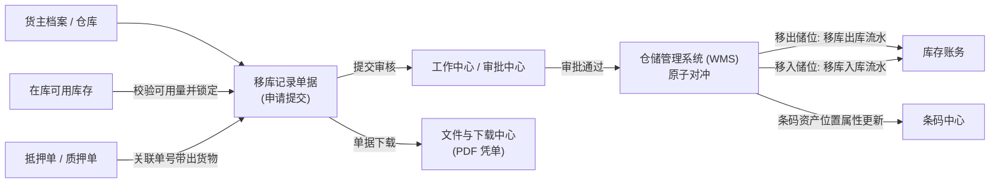

# 移库记录主PRD

> **模块定位**：库存业务层核心流转单据，规范存货在仓储监管期间的储位调拨行为（同仓普通移库、抵押移库、质押移库），实现计划移库锁定、审批流转、原子账实对冲（移库出库流水 + 移库入库流水）、条码资产位置更新与双重凭证审计的全链路闭环。
> **版本**：V1.2 | **更新时间**：2026-09-16 | **责任人**：森云科技（Senyun Technology）
> **编写依据**：[移库记录字段清单.md](./移库记录字段清单.md) 是本模块所有字段定义、枚举与页面展示的唯一基准；[移库记录业务规则规格.md](./移库记录业务规则规格.md) 是本模块状态机、原子事务、货权继承与并发控制的唯一定义来源；[移库记录_ASCII_列表页.md](./移库记录_ASCII_列表页.md) 是列表页交互线框的唯一定义来源。

---

## 1. 业务背景与业务痛点

### 1.1 业务背景
在供应链金融与大宗存货监管业务中，存货在监管仓库内部的物理存放位置并非一成不变。随着库容动态调整、温湿度要求变化、货物分级理货或库房维修，监管方与货主需要经常对存货执行储位调拨（即"移库"）。

### 1.2 核心业务痛点
1. **脱离监管甚至货权悬空**：在押货品若被私自移至无监控死角库房或未确权仓库，将导致资金方失去物理控制；
2. **账实脱节与数据分裂**：调拨过程中条码与库位未能原子联动，移出与移入未能对冲闭环，造成在库账目紊乱；
3. **批量调拨操作极其繁琐**：单笔大宗货物可能涉及数十个库位，传统系统需逐行配置目标储位，现场作业效率低下；
4. **历史追溯与存证凭据缺失**：移库缺乏正式生效凭单与下载审计，无法应对银行审计与司法举证。

---

## 2. 功能范围

| 包含功能范围 | 不包含功能范围 |
| :--- | :--- |
| - 列表多维检索（移库单号、日期范围、货主、移库类型、仓库、货品、制单人、制单时间）与 10 列紧凑展示； - 普通移库新增：选货弹窗（单仓强阻断）、部分拆分、**批量移库**一键覆盖目标储位； - 抵押 / 质押移库：必填关联单号、平铺勾选、目标库位录入； - 仓单移库引导至仓单管理（选项置灰禁用）； - 审批流转（审批通过 / 驳回 / 撤回）与原子账实对冲（移库出 + 移库入双向流水）； - 条码资产物理位置原子更新； - 移库详情分流展示（普通折叠树形 / 抵质押平铺表格）； - 双重凭证：【单据下载】异步 PDF + 【下载记录】弹窗历史复用。 | - 跨仓库调拨（必须走独立出库 + 入库流程）； - 草稿箱与暂存机制（未提交退出即丢弃）； - 已归档单据反冲正（回移须反向新发起移库）； - 筛选区重置按钮（遵循系统统一规范）。 |

---

## 3. 模块定位与系统链路

---

### 3.1 货权档案、货权公示与证据管理跨模块数据互通

依据全系统数据互通规范，移库单审批终审通过生效时，系统底层原子向货权三板块分发报文：

| 协同板块 | 接收事件与触发时机 | 具体数据更新行为与业务效力 |
| :--- | :--- | :--- |
| **【06-货权档案】** | 移库单终审通过且对冲完成 | 1. **储位即时同步**：更新货权档案物理存放库位（仓库-库房-分区），仓单移库同步更新货权位置（R03）； 2. **货权无缝继承**：保持原所有权、抵押权/质权关系与货值不变。 |
| **【07-货权公示】** | 移库单终审通过 | 货权牌制作与查验表单中【存放地点】自动联动读取移位后最新库位路径，确保证件与现场一致。 |
| **【08-证据管理】** | 移库单终审通过 | 1. 自动生成一条存证类型=【移库】流水； 2. **强制挂载现场抓拍移库作业照片原文件**； 3. 推送中仓登上链存证并生成区块链凭证哈希。 |

---

## 4. 业务规则索引速查

| 规则编码 | 规则名称 | 核心定义摘要 |
| :--- | :--- | :--- |
| `R01` | **【同仓移库物理边界强约束】** | 移库仅限同仓储位调拨；跨仓多储位商品主行输入框直接置灰锁定，提示`仅允许单个仓库移库` |
| `R02` | **【移库类型来源与仓单移库置灰】** | 普通/质押/抵押移库手工发起；仓单移库置灰提示去【仓单管理】发起调拨，审批通过联动归档 |
| `R03` | **【普通移库选货折叠与批量设置】** | 选货弹窗支持先进先出（FIFO）与部分拆分；折叠树形展示；支持【批量移库】一键覆盖目标储位 |
| `R04` | **【抵押质押移库关联单号与货权继承】** | 必填关联单号；平铺表格勾选入库货物；移库完成后原质押物权与监管属性无缝继承 |
| `R05` | **【审批终审原子账实对冲】** | 提交施加移库占用锁；终审通过原子执行“移库出库扣减 + 移库入库增加”，条码资产位置更新 |
| `R06` | **【凭证生成与下载记录审计】** | 【单据下载】异步生成标准 PDF 凭单并存入对象存储；【下载记录】弹窗历史复用与司法审计 |
| `R07` | **【台账终态归档与禁止反冲正】** | 本台账仅收录已通过终态单据；禁止线上反审核，回移须反向新发起移库申请 |
| `R08` | **【现场照片必传与设备抓拍】** | 新增移库必传现场照片（最多 10 张）；提交触发摄像头联动抓拍并固化存证 |
| `R09` | **【货权档案同步与存证互通】** | 终审通过同步货权档案储位、货权公示存放地点，并推送证据管理与中仓登上链存证 |

---

## 5. 典型业务场景故事（User Stories）

### 关键角色
- **仓库现场监管员 / 理货员**：发起移库申请，在选货弹窗中选择库存或按质押单带出，设置新储位，上传作业照片并提交审核；
- **仓储主管 / 运营审批人**：在审批中心审核移库合理性，核验目标库房容积与审核属性一致性；
- **资方风控审核员**：针对抵押、质押项下的移库申请进行风控合规终审，确保质押资产仍在受控监管库房内；
- **审计合规员**：调阅已归档移库单据，通过【下载记录】导出移库凭单进行账实审计。

### 场景 1【生鲜冷库同仓调拨与批量移库提效】(S01)
* **角色**：生鲜冷链仓库监管员老张
* **情境**：因冷库 1 号库房需进行制冷机组检修，老张需将该库房内存放的 30 批次宁夏西瓜全量迁移至 2 号库房统一番区。
* **行为**：老张进入新增普通移库页，选择货主，点击【添加货品】，直接在西瓜品类下点击【全部】选定所有库存并回填。老张在一级主行点击【批量移库】，在弹窗中统一选择“2号库房-统一番区”，输入具体位置“架位A”，点击确定。30 个明细行的目标储位瞬间全部回填完成。老张现场拍摄移机照片并提交审核。遵循【普通移库选货折叠与批量设置】(R03)。
* **结果**：原本需要逐行录入半小时的操作在 1 分钟内完成，大幅提升现场作业效率。

### 场景 2【大宗钢材质押移库与货权穿透继承】(S02)
* **角色**：某钢铁物流园监管员小李、银行质押风控员
* **情境**：某钢贸企业在招商银行在押的 100 吨热轧卷板，因堆场平整作业需要临时移至相邻高标堆位。
* **行为**：小李在移库类型中选择【质押移库】，填入招行质押单号。系统瞬间带出该质押单绑定的 3 批热卷平铺表格，小李勾选前两批（共 60 吨），指定目标移入堆位并提交审核。银行风控员在审批中心收到质押移库待办，核验移入库房同属在押合格监管区域后予以批准。遵循【抵押质押移库关联单号与货权继承】(R04)。
* **结果**：审批通过后，60 吨钢材物理储位更新，其质押条码资产、质押状态与招行绑定关系无缝存续，既满足现场作业又确保风控闭环。

### 场景 3【选货跨仓误操作前端强阻断】(S03)
* **角色**：新入职仓库操作员小陈
* **情境**：小陈试图将货主存放在“海霸王仓库”与“生鲜仓库”两处不同物理园区的同规格苹果一并移库至生鲜仓库。
* **行为**：小陈在普通移库点击【添加货品】，在苹果行试图在主行输入数量，但发现移库数量输入框置灰锁定，且明确显示红色提示 `仅允许单个仓库移库`。遵循【同仓移库物理边界强约束】(R01)。
* **结果**：系统阻断了小陈跨仓移库的企图，引导小陈展开二级明细单独勾选生鲜仓库项下的储位，确保物理监管边界不被突破。

### 场景 4【仓单货物移库引导至仓单管理】(S04)
* **角色**：大宗期货仓库管理员小赵
* **情境**：小赵接到仓单客户移库指令，试图在移库记录直接发起仓单移库。
* **行为**：小赵在新增移库类型下拉框中看到 `仓单移库 (请到仓单管理操作移库)` 选项呈置灰状态无法选中。小赵按照系统指引进入【仓单管理】模块发起仓单项下货物的调拨申请。遵循【移库类型来源与仓单移库置灰】(R02)。
* **结果**：确保了具备物权凭证属性的数字仓单在变更物理存放地时严格履行仓单背书与解挂流程。

### 场景 5【部分移库拆分与先进先出调优】(S05)
* **角色**：有色金属库房理货员老王
* **情境**：库房某一垛位存放有 100 吨电解铜，由于新批次货物入库需要腾挪 40 吨空间。
* **行为**：老王在选货弹窗中展开二级明细，在可用数量为 100 吨的明细行移库数量框中手工输入 `40`，确认回填至移库表单，指定目标分区并提交审核。遵循【普通移库选货折叠与批量设置】(R03)。
* **结果**：审批通过后，原储位扣减 40 吨剩余 60 吨，新储位增加 40 吨并生成对应移库出入库流水，实现精准拆分部分移库。

### 场景 6【司法审计调阅与下载记录复用】(S06)
* **角色**：资方外部审计师
* **情境**：审计师在年度监管审计中需调取半年前一笔 13.7 吨大米移库的原始单据。
* **行为**：审计师在移库记录列表检索出该单据，点击行操作【下载记录】。弹窗中展示该单据此前生成的正式 PDF 凭单，状态为“成功”。审计师点击【下载】按钮直接获取文件。遵循【凭证生成与下载记录审计】(R06)。
* **结果**：文件包含原始审批盖章、移出移入库位对比及生成人，免去重新调取服务渲染，提供完备司法存证。

---

## 6. 页面功能规格详细说明

### 6.1 列表页功能规格（P-CKG-011）
1. **检索区设计**：
   - 双行排布，共 8 项控件，右侧【查询】金色实心按钮，无【重置】；
   - 移库类型下拉支持：全部、质押移库、抵押移库、仓单移库、普通移库。
2. **列表数据呈现**：
   - 采用 10 列紧凑排版；
   - 移库单号带 19 位数字串；货主名称与标识双行展示；移库时间双行展示；
   - 移库类型第一行展示类型文本，第二行展示橙色关联单号（普通移库置空）；
   - 货物多行展示，超出 2 行尾部展示橙色【更多...】；
   - 制单人双行展示账号机构与时间戳；
   - 操作列提供【查看详情】、【下载记录】、【单据下载】。

### 6.2 普通移库新增表单规格
1. **基础信息**：移库日期（默认当前时间）、货主类型（企业/个人）、货主名称（模糊搜索）、货主标识/身份证（只读带出）、移库类型（普通移库）、备注（0/140字）；
2. **货品明细（折叠树形）**：
   - 右上角【⊕ 添加货品】按钮；
   - 一级主行：展开箭头、序号、货物名称、所属仓库、总移库数量、操作（【批量移库】、【移除】）；
   - 二级展开明细：原位置（仓库-库房-分区）、原具体位置、入库时间、其他信息、存货条码二维码、状态（存货中）、移库数量（可编辑）、移入库房/分区（必选）、移入具体位置（0/140字）、操作（【移除】）；
3. **合计栏**：实时汇总展示品类数与总数量；
4. **附件信息**：现场照片必传上传组件（最多 10 张）；
5. **右上角操作**：【取消】与【提交审核】。

### 6.3 抵押 / 质押移库新增表单规格
1. **基础信息**：在移库类型下方展示 **`* 关联单号`（必填）**；
2. **货品明细（平铺表格）**：
   - 无【添加货品】按钮；
   - 第一列为复选框（带表头全选）；
   - 字段列：序号、货物名称、位置信息、具体位置、存货条码、可用数量、移库数量（可编辑）、移入库房/分区（下拉）、具体位置（输入）；
   - 底部合计栏仅对已勾选有效行累加。

### 6.4 弹窗功能规格
1. **【选择货物】弹窗**：
   - 仓库筛选（全选）、货物筛选（全选）、入库时间正序/倒序、可用数量排序、生产日期排序；
   - 跨仓主行置灰提示 `仅允许单个仓库移库`；单仓主行提供数量输入及【全部】/【清空】；
   - 二级展开行提供数量输入及【全部】/【清空】；
   - 底栏左侧实时显示已选类型数与总数量，右侧【取消】与【确定】。
2. **【批量移库】弹窗**：
   - 提示横幅：`(i) 批量移库将所选货物全部移入相同位置`；
   - 必选【批量移入库房/分区】，选填【具体位置】（0/140字）；
   - 确认后覆盖当前货品主行下所有二级明细。
3. **【下载记录】弹窗**：
   - 表格 6 列：序号、文件名、操作人、时间、状态、操作（【下载】）；
   - 底栏分页控件。

---

## 7. 非功能性需求与风控安全

1. **分布式并发锁与防超移控制**：
   - 提交移库申请时，服务端对所选库存位置施加行级排他锁，校验 `SUM(移库数量) <= 可用数量`；
   - 审批中锁定库存，防止被出库单、转让单等并发占用。
2. **同仓强校验沙箱**：
   - 后端应用程序接口（API）在接收移库数据时，强制执行 `移出仓库ID == 移入仓库ID` 的强一致性沙箱校验，越权跨仓数据直接拦截并触发安全风控告警。
3. **敏感信息脱敏与权限隔离**：
   - 货主与经办人身份证号、手机号统一脱敏；
   - 严格遵循仓库数据权限隔离，仅能查看和操作管辖仓库数据。
4. **全路径不可变审计留痕**：
   - 审批通过产生的移库出库与移库入库双向流水在数据库层面打上唯一事务组号，全过程不可物理删除。

---

## 修订记录

| 日期 | 版本 | 变更内容说明 | 影响范围 | 修订人 |
| :--- | :--- | :--- | :--- | :--- |
| 2026-09-04 | **V1.0** | 建立移库记录最新基准版主 PRD 功能规格说明书。 | 全模块 | AI PM / 森云科技 |
| 2026-09-16 | **V1.1** | 补充货权档案、货权公示与证据管理跨模块数据互通说明。 | 跨模块协同与系统链路 | AI PM / 森云科技 |
| 2026-09-16 | **V1.2** | 场景自解释化 upgrade（场景 N【场景名称】(Sxx)）、补充业务规则索引速查表、汉化 In/Out of Scope 交互词汇。 | 全文 | AI PM / 森云科技 |
