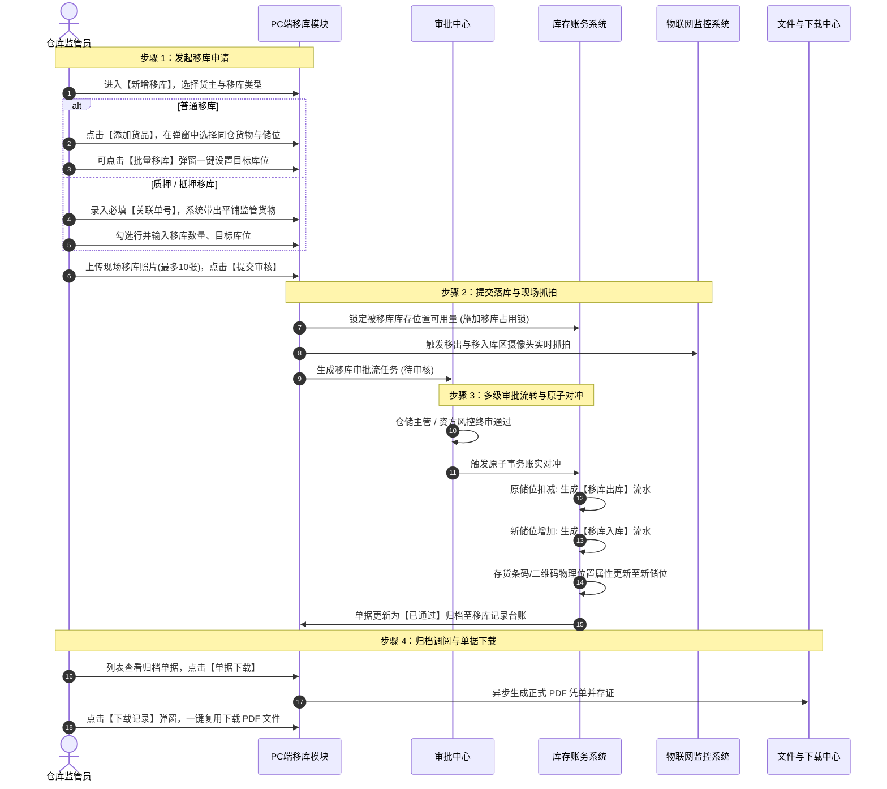

# 移库记录主 PRD 功能规格说明书

> **模块标识**：`P-CKG-011` | **所属子系统**：仓储监管系统 (WMS) / 移库管理  
> **所属迭代**：最新基准版 | **更新时间**：2026-09-04  
> **文档状态**：已核准 (Approved) | **负责人**：森云科技 AI PM 团队  
> **配套文档**：[移库记录字段清单.md](./移库记录字段清单.md) · [移库记录业务规则规格.md](./移库记录业务规则规格.md) · [移库记录_ASCII_列表页.md](./移库记录_ASCII_列表页.md)

---

## 1. 业务背景与设计目标

### 1.1 业务背景
在供应链金融与大宗存货监管业务中，存货在监管仓库内部的物理存放位置并非一成不变。随着库容动态调整、温湿度要求变化、货物分级理货或库房维修，监管方与货主需要经常对存货执行储位调拨（即“移库”）。
然而，在大宗质押监管场景下，传统仓储的移库作业面临极大风控隐患：
1. **脱离监管甚至货权悬空**：在押货品若被私自移至无监控死角库房或未确权仓库，将导致资金方失去物理控制；
2. **账实脱节与数据分裂**：调拨过程中条码与库位未能原子联动，移出与移入未能对冲闭环，造成在库账目紊乱；
3. **批量调拨操作极其繁琐**：单笔大宗货物可能涉及数十个库位，传统系统需逐行配置目标储位，现场作业效率低下；
4. **历史追溯与存证凭据缺失**：移库缺乏正式生效凭单与下载审计，无法应对银行审计与司法举证。

### 1.2 设计目标与核心价值
* **同仓物理边界强闭环**：严密约束移库仅限同一实体监管仓库内部储位调拨，选货弹窗遇跨仓库存主行强阻断提示“仅允许单个仓库移库”，彻底杜绝跨仓调拨风险；
* **双轨精细化分流**：
  - **普通移库**：支持多维选货、部分移库拆分、树形折叠展开与 **【批量移库】一键覆盖** 目标储位；
  - **抵押/质押移库**：必填【关联单号】直接锁定在押货物，平铺勾选调拨，质押货权无缝继承；
* **原子级库存账实对冲**：审批终审通过一瞬间，系统原子事务触发“原储位移库出库流水扣减 + 新储位移库入库流水增加”，条码资产位置属性实时更新；
* **双重凭证与司法存证**：提供【单据下载】异步生成标准 PDF 凭单，并通过【下载记录】弹窗实现历史任务复用与全过程审计留痕。

---

## 2. 需求范围 (Scope)

### 2.1 In of Scope (纳入本期需求)
1. **列表多维检索与展示**：
   - 8 项组合检索（移库单号、移库日期范围、货主名称/标识、移库类型下拉、仓库名称下拉、货品名称下拉、制单人下拉、制单时间范围）+【查询】按钮（无重置）；
   - 10 列标准列表展示（序号、移库单号、货主双行、移库时间双行、移库类型复合单号、仓库名称、货物多行折叠更多、移库数量、制单人双行、操作列）；
   - 分页与条数统计。
2. **普通移库新增与批量操作**：
   - 基础信息货主三要素联动与单仓锁定；
   - 【选择货物】弹窗（仓库/货物筛选全选、先进先出排序、部分移库拆分、跨仓单仓强阻断）；
   - 一级货品主行提供 **【批量移库】**（弹出弹窗统一回填所有明细的移入库房/分区与具体位置）及【移除】；
   - 二级明细行支持逐行选择目标库位；
   - 必传现场照片（最多10张）与 140 字备注。
3. **抵押 / 质押移库新增**：
   - 必填【关联单号】（质押单号或抵押单号）；
   - 自动带出平铺表格（无添加货品按钮），行级复选框勾选，录入移库数量与目标库位；
   - 仅对已勾选有效行进行动态试算汇总。
4. **仓单移库联动拦截**：
   - 移库新增下拉选项明确标注 `仓单移库 (请到仓单管理操作移库)` 并置灰禁用，必须前往仓单管理发起。
5. **移库详情分流展示**：
   - 普通移库：一级货品主行折叠展开二级明细，展示移出原位置 vs 移入新位置；
   - 抵押/质押移库：平铺表格展示移出位置、数量及移入库房分区；
   - 顶部提供移库单号一键复制、【返回】按钮及绿色【已通过】印章，展示现场照片与 IoT 抓拍图。
6. **双重凭证与下载记录审计**：
   - 【单据下载】触发异步生成标准 PDF 移库凭单；
   - 【下载记录】弹窗展示历史生成记录（文件名、操作人、时间、状态）并支持本地下载。

### 2.2 Out of Scope (明确排除范围)
1. **跨仓库调拨**：系统严格禁止在移库模块中实现跨实体仓库调拨（跨仓库流转必须走独立出库与入库流程）；
2. **草稿箱与暂存**：本模块不提供草稿机制，未提交退出即丢弃；
3. **已归档单据反冲正**：已生效归档的移库单禁止线上反审批，回移必须反向发起新移库；
4. **筛选区重置按钮**：遵循系统统一规范，不提供重置按钮。

---

## 3. 用户角色与业务流程

### 3.1 关键角色
* **仓库现场监管员 / 理货员**：发起移库申请，在选货弹窗中选择库存或按质押单带出，设置新储位，上传作业照片并提交审核；
* **仓储主管 / 运营审批人**：在审批中心审核移库合理性，核验目标库房容积与审核属性一致性；
* **资方风控审核员**：针对抵押、质押项下的移库申请进行风控合规终审，确保质押资产仍在受控监管库房内；
* **审计合规员**：调阅已归档移库单据，通过【下载记录】导出移库凭单进行账实审计。

### 3.2 端到端业务时序图

---

## 4. 典型大宗业务场景故事 (User Stories)

### S01：生鲜冷库同仓调拨与批量移库提效
* **角色**：生鲜冷链仓库监管员老张
* **情境**：因冷库 1 号库房需进行制冷机组检修，老张需将该库房内存放的 30 批次宁夏西瓜全量迁移至 2 号库房统一番区。
* **行为**：老张进入新增普通移库页，选择货主原原李，点击【添加货品】，直接在西瓜品类下点击【全部】选定所有库存并回填。老张在一级主行点击【批量移库】，在弹窗中统一选择“2号库房-统一番区”，输入具体位置“架位A”，点击确定。30 个明细行的目标储位瞬间全部回填完成。老张现场拍摄移机照片并提交审核。
* **结果**：原本需要逐行录入半小时的操作在 1 分钟内完成，大幅提升现场作业效率。

### S02：大宗钢材质押移库与货权穿透继承
* **角色**：某钢铁物流园监管员小李、银行质押风控员
* **情境**：某钢贸企业在招商银行在押的 100 吨热轧卷板，因堆场平整作业需要临时移至相邻高标堆位。
* **行为**：小李在移库类型中选择【质押移库】，填入招行质押单号 `1981237772635082753`。系统瞬间带出该质押单绑定的 3 批热卷平铺表格，小李勾选前两批（共 60 吨），指定目标移入堆位并提交审核。银行风控员在审批中心收到质押移库待办，核验移入库房同属在押合格监管区域后予以批准。
* **结果**：审批通过后，60 吨钢材物理储位更新，其质押条码资产、质押状态与招行绑定关系无缝存续，既满足现场作业又确保风控闭环。

### S03：选货跨仓误操作，前端强阻断防护
* **角色**：新入职仓库操作员小陈
* **情境**：小陈试图将货主存放在“海霸王仓库”与“生鲜仓库”两处不同物理园区的同规格苹果一并移库至生鲜仓库。
* **行为**：小陈在普通移库点击【添加货品】，在苹果行试图在主行输入数量，但发现移库数量输入框置灰锁定，且明确显示红色提示 `仅允许单个仓库移库`。
* **结果**：系统阻断了小陈跨仓移库的企图，引导小陈展开二级明细单独勾选生鲜仓库项下的储位，确保物理监管边界不被突破。

### S04：仓单货物移库规范引导至仓单管理
* **角色**：大宗期货仓库管理员小赵
* **情境**：小赵接到仓单客户移库指令，试图在移库记录直接发起仓单移库。
* **行为**：小赵在新增移库类型下拉框中看到 `仓单移库 (请到仓单管理操作移库)` 选项呈置灰状态无法选中。小赵按照系统指引进入【仓单管理】模块发起仓单项下货物的调拨申请。
* **结果**：确保了具备物权凭证属性的数字仓单在变更物理存放地时严格履行仓单背书与解挂流程。

### S05：部分移库拆分与先进先出调优
* **角色**：有色金属库房理货员老王
* **情境**：库房某一垛位存放有 100 吨电解铜，由于新批次货物入库需要腾挪 40 吨空间。
* **行为**：老王在选货弹窗中展开二级明细，在可用数量为 100 吨的明细行移库数量框中手工输入 `40`，确认回填至移库表单，指定目标分区并提交审核。
* **结果**：审批通过后，原储位扣减 40 吨剩余 60 吨，新储位增加 40 吨并生成对应移库出入库流水，实现精准拆分部分移库。

### S06：司法审计调阅与下载记录复用
* **角色**：资方外部审计师
* **情境**：审计师在年度监管审计中需调取半年前一笔 13.7 吨大米移库的原始单据。
* **行为**：审计师在移库记录列表检索出该单据，点击行操作【下载记录】。弹窗中展示该单据此前由操作员 `HK(卡皮银行)` 于 `2026-09-04 15:27:33` 生成的正式 PDF 凭单，状态为“成功”。审计师点击【下载】按钮直接获取文件。
* **结果**：文件包含原始审批盖章、移出移入库位对比及生成人，免去重新调取服务渲染，提供完备司法存证。

---

## 5. 页面功能规格详细说明

### 5.1 列表页功能规格（P-CKG-011）
1. **检索区设计**：
   - 双行排布，共 8 项控件，右侧【查询】金色实心按钮，无【重置】；
   - 移库类型下拉支持：全部、质押移库、抵押移库、仓单移库、普通移库。
2. **列表数据呈现**：
   - 采用 10 列紧凑排版；
   - 移库单号带 19 位数字串；货主名称与标识双行展示；移库时间双行展示；
   - 移库类型第一行展示类型文本，第二行展示橙色关联单号（普通移库置空）；
   - 货物多行展示，超出 2 行尾部展示橙色【更多...】；
   - 制单人双行展示账号机构与时间戳；
   - 操作列提供【查看详情】、【下载记录】、【单据下载】。

### 5.2 普通移库新增表单规格
1. **基础信息**：移库日期（默认当前时间）、货主类型（企业/个人）、货主名称（模糊搜索）、货主标识/身份证（只读带出）、移库类型（普通移库）、备注（0/140字）；
2. **货品明细（折叠树形）**：
   - 右上角【⊕ 添加货品】按钮；
   - 一级主行：展开箭头、序号、货物名称、所属仓库、总移库数量、操作（【批量移库】、【移除】）；
   - 二级展开明细：原位置（仓库-库房-分区）、原具体位置、入库时间、其他信息、存货条码二维码、状态（存货中）、移库数量（可编辑）、移入库房/分区（必选）、移入具体位置（0/140字）、操作（【移除】）；
3. **合计栏**：实时汇总展示品类数与总数量；
4. **附件信息**：现场照片必传上传组件（最多 10 张）；
5. **右上角操作**：【取消】与【提交审核】。

### 5.3 抵押 / 质押移库新增表单规格
1. **基础信息**：在移库类型下方展示 **`* 关联单号`（必填）**；
2. **货品明细（平铺表格）**：
   - 无【添加货品】按钮；
   - 第一列为复选框（带表头全选）；
   - 字段列：序号、货物名称、位置信息、具体位置、存货条码、可用数量、移库数量（可编辑）、移入库房/分区（下拉）、具体位置（输入）；
   - 底部合计栏仅对已勾选有效行累加。

### 5.4 弹窗功能规格
1. **【选择货物】弹窗**：
   - 仓库筛选（全选）、货物筛选（全选）、入库时间正序/倒序、可用数量排序、生产日期排序；
   - 跨仓主行置灰提示 `仅允许单个仓库移库`；单仓主行提供数量输入及【全部】/【清空】；
   - 二级展开行提供数量输入及【全部】/【清空】；
   - 底栏左侧实时显示已选类型数与总数量，右侧【取消】与【确定】。
2. **【批量移库】弹窗**：
   - 提示横幅：`(i) 批量移库将所选货物全部移入相同位置`；
   - 必选【批量移入库房/分区】，选填【具体位置】（0/140字）；
   - 确认后覆盖当前货品主行下所有二级明细。
3. **【下载记录】弹窗**：
   - 表格 6 列：序号、文件名、操作人、时间、状态、操作（【下载】）；
   - 底栏分页控件。

---

## 6. 非功能性需求与风控安全

1. **分布式并发锁与防超移控制**：
   - 提交移库申请时，服务端对所选库存位置施加行级排他锁，校验 `SUM(移库数量) <= 可用数量`；
   - 审批中锁定库存，防止被出库单、转让单等并发占用。
2. **同仓强校验沙箱**：
   - 后端 API 在接收移库数据时，强制执行 `移出仓库ID == 移入仓库ID` 的强一致性沙箱校验，越权跨仓数据直接拦截并触发安全风控告警。
3. **敏感信息脱敏与权限沙箱**：
   - 货主与提货人身份证号、手机号统一脱敏；
   - 严格遵循仓库数据权限隔离，仅能查看和操作管辖仓库数据。
4. **全路径不可变审计留痕**：
   - 审批通过产生的移库出库与移库入库双向流水在数据库层面打上唯一事务组号（`TX_GROUP_ID`），全过程不可物理删除。

---

## 修订记录

| 日期 | 版本 | 变更内容说明 | 影响范围 | 修订人 |
| :--- | :--- | :--- | :--- | :--- |
| 2026-09-04 | **V1.0** | **建立移库记录最新基准版主 PRD 功能规格说明书**： 1. 确立模块定位、In/Out of Scope 及同仓风控设计目标； 2. 绘制端到端移库业务时序图，覆盖普通/抵押/质押/仓单四类流转； 3. 输出 S01~S06 全业务故事与全量界面规格； 4. 固化批量移库、双重凭证与下载记录审计规范。 | 全模块 | AI PM / 森云科技 |
