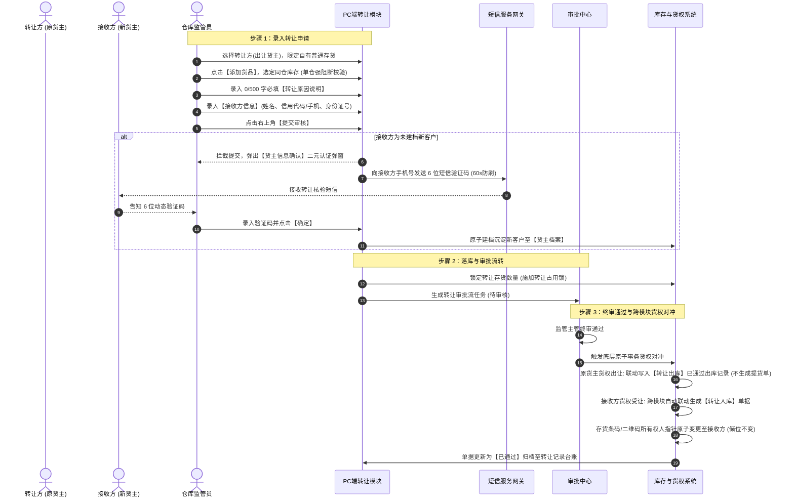

# 转让记录主 PRD 功能规格说明书

> **模块标识**：`P-CKG-012` | **所属子系统**：仓储监管系统 (WMS) / 货物转让  
> **所属迭代**：最新基准版 | **更新时间**：2026-09-04  
> **文档状态**：已核准 (Approved) | **负责人**：森云科技 AI PM 团队  
> **配套文档**：[转让记录字段清单.md](./转让记录字段清单.md) · [转让记录业务规则规格.md](./转让记录业务规则规格.md) · [转让记录_ASCII_列表页.md](./转让记录_ASCII_列表页.md)

---

## 1. 业务背景与设计目标

### 1.1 业务背景
大宗商品供应链金融生态中，货物在仓库物理静止存放的同时，其物权与所有权经常随着贸易合同执行、货权转卖或仓储资产重组而在不同货主主体之间频繁发生转移（即“在仓转让”）。
传统大宗仓储在货权转让过程中存在以下严重风控缺陷：
1. **暗箱操作与物权纠纷**：口头或线下协议转让，受让人身份未经二元有效核验，容易引发“一货多转”或虚假受让人纠纷；
2. **在押货物擅自流转**：质押中或抵押中的监管存货在未办结解押的情况下被擅自转让，导致资金方担保物权悬空并遭受坏账损失；
3. **跨仓混合转让失控**：多仓库货物打包转让导致监管仓库权属边界交叉紊乱；
4. **账实与入库脱节**：转让后新货主侧缺少合法的入库凭证，无法形成完整的货权生命周期闭环。

### 1.2 设计目标与核心价值
* **货权纯净性与单仓强阻断**：严格限定仅自有普通存货可转让，在押资产绝对阻断；选货弹窗遇跨仓库存强制提示“仅允许单个仓库转让”，严密锁定单仓物理监管边界；
* **新货主短信二元核验闭环**：当受让方为未在系统建档的新客户时，提交审核时系统强制弹出【货主信息确认】弹窗，向受让方手机号发送 6 位短信验证码，核验通过后原子建档沉淀至【货主档案】，严把法律准入关；
* **跨模块【转让入库】无缝联动**：转让单终审通过一瞬间，系统在受让方名下自动联动生成 `入库类型=转让入库` 的入库记录，条码资产归属原子变更，储位物理不动，货权法定转移；
* **司法级存证与责任追溯**：强制录入最多 500 字转让原因说明，记录完整审批流转履历，打造经得起司法举证的数字化货权过户流。

---

## 2. 需求范围 (Scope)

### 2.1 In of Scope (纳入本期需求)
1. **列表多维检索与展示**：
   - 7 项组合检索（转让单号、转让日期范围、货主名称/标识、仓库名称下拉、货品名称下拉、制单人下拉、制单时间范围）+【查询】按钮（无重置、无转让类型筛选）；
   - 10 列标准列表（序号、转让单号、转让人双行、转让时间双行、转让数量、接收人双行、仓库名称、货物名称、制单人双行、操作列仅【查看详情】）；
   - 分页与条数统计。
2. **新增普通存货转让申请**：
   - 基础信息：转让日期（默认当前时间）、转让方三要素联动（企业/个人）、**`* 转让原因说明`（必填，0/500字）**；
   - 货品明细：折叠树形结构（一级主行汇总及【移除】，二级展开明细展示位置、入库时间、条码、转让数量及【移除】）；
   - 底部合计栏（品类数与总数量实时汇总）；
   - **接收方信息**：接收方类型（企业/个人）、接收方姓名（模糊检索/新录入）、接收方标识（信用代码/手机号）、接收方身份证号（可清空修改）。
3. **【选择货物】弹窗规格**：
   - 仓库/货物筛选及全选，先进先出/可用量/生产日期排序；
   - 跨仓主行置灰提示 `仅允许单个仓库转让`，二级明细操作列标红提示；
   - 支持部分转让与快捷【全部】/【清空】。
4. **新接收方二元身份核验与自动建档**：
   - 未建档新主体在提交审核时强制呼出【货主信息确认】弹窗；
   - 6 位动态短信验证码（60秒防刷倒计时），通过后原子写入【货主档案】并提交审核。
5. **转让详情页规格**：
   - 顶部 19 位单号复制、【返回】按钮及绿色【已通过】印章；
   - 基础信息纯净两列网格（仅展示制单人、制单时间、接收人、转让人、转让时间、转让原因 6 项，无现场照片与设备抓拍）；
   - 底部双 Tab：【转让明细】（树形折叠展开）与【审核记录】。
6. **跨模块【转让入库】自动生成**：
   - 终审通过后受让人侧自动生成关联转让入库单据，实现货权原子对冲。

### 2.2 Out of Scope (明确排除范围)
1. **质押/抵押货物直接转让**：系统严禁在押在抵货物直接发起转让，必须解押转自有后方可发起；
2. **现场照片与设备抓拍**：转让为纯货权交易，货物物理不移动，不设附件图片上传；
3. **单据下载与下载记录**：转让记录列表操作列仅提供【查看详情】，不提供单据下载；
4. **草稿箱与线上反冲正**：不提供草稿暂存，已归档单据禁止反审批撤回。

---

## 3. 用户角色与业务流程

### 3.1 关键角色
* **原货主 / 出让经办人**：发起货物转让申请，选定拟出让的库存批次，录入受让新货主主体信息与 500 字转让合同说明；
* **新货主 / 受让经办人**：接收系统下发的 6 位二元核验短信验证码，向现场或平台确认受让意愿；
* **仓库监管主管 / 运营审批人**：核验转让双方资质、转让原因及仓库租户权属，执行转让审批；
* **资方风控合规员**：调阅转让详情，核验货权流转合规性与司法存证。

### 3.2 端到端业务时序图

---

## 4. 典型大宗业务场景故事 (User Stories)

### S01：大宗白糖贸易在仓过户与新买家二元核验
* **角色**：广西食糖物流园监管员小陈、白糖贸易商老李、新买家张总
* **情境**：老李将其存放在生鲜仓库的 10000 斤海南香蕉在仓转让给下游新采购商张总，张总此前从未在系统注册建档。
* **行为**：小陈进入新增转让页，选择出让人老李，选定香蕉库存。在接收方信息中输入张总姓名与手机号。小陈录入转让说明 `“根据白糖买卖合同XS2026032601，买方已全额支付货款，办理在仓货权过户”`。小陈点击提交，系统弹出二元认证弹窗并向张总发送验证码。张总核对无误报出验证码，小陈录入确认。
* **结果**：系统秒级完成张总新货主建档并提交审核，保障了新买家身份意愿真实性。

### S02：多园区库存混合转让前端强阻断
* **角色**：有色金属库区操作员小刘
* **情境**：小刘为客户办理电解铜转让，客户在“海霸王仓库”与“生鲜仓库”均有存货，小刘试图在一张单据内将两处的铜一并转给买方。
* **行为**：小刘在选货弹窗勾选了两个仓库的铜，但系统主行立即提示灰底文字 `仅允许单个仓库转让`，二级明细操作列标红阻断。
* **结果**：小刘根据系统提示，分两次分别发起各仓库的独立转让单，确保各实体监管仓库的仓储合同与账目独立清晰。

### S03：审批终审通过自动生成【转让入库】闭环
* **角色**：仓储主管老王、新买家财务人员
* **情境**：老李转让给张总的香蕉转让单经老王在审批中心终审通过。
* **行为**：系统通过底层原子事务，瞬间将老李名下库存扣减，同时自动在张总名下生成了一笔全新的 `入库类型=转让入库` 单据（关联该转让单号）。
* **结果**：货物在物理香蕉分区架位上无需挪动半步，张总登录系统在【入库记录】中即可查到该笔受让入库单，并拥有了合法的在仓货权数字凭据。

### S04：在押质押铜材转让被前置阻断保护
* **角色**：某钢贸企业业务员、监管员老周
* **情境**：企业试图将处于建设银行质押监管中的 50 吨热卷办理在仓转让给关联公司。
* **行为**：老周在新增转让页面选货时，系统可用库存列表仅展示自有非质押存货，该 50 吨在押热卷因处于“质押锁定”状态完全不可见；老周告知企业必须先向建行还款并办理质押解押手续，方可转入转让流程。
* **结果**：从系统源头彻底杜绝了企业私自转让在押抵质押品的重大道德风险与信贷危机。

### S05：部分转让库存拆分与先进先出
* **角色**：冷库理货员小宋
* **情境**：货主存放在某垛位的 100 吨冻品牛肉，本次仅需向采购商交付其中的 20 吨。
* **行为**：小宋在选货弹窗展开二级明细，在转让数量输入框输入 `20`，系统自动按先进先出（FIFO）批次将该位置扣减 20 吨生成转让申请。
* **结果**：审批通过后，原储位仍结存 80 吨自有货，新货主受让 20 吨，实现高精度拆分转让。

### S06：外部司法稽核与 500 字转让说明调阅
* **角色**：法院司法执行法官、仓储合规主管
* **情境**：法官到仓库调查一起买卖合同纠纷，要求调取半年前一笔 4 斤香蕉转让的真实背景。
* **行为**：主管在转让记录列表检索出转让单号 `2016718247379197964`，点击【查看详情】。详情页清晰回显了制单人、制单时间、接收人与转让人主体信息，以及详细的 500 字【转让原因】，Tab 2 完整呈现了审批流转时间戳与签署人。
* **结果**：无需翻找纸质档案，提供了完整不可篡改的电子物权证据链。

---

## 5. 页面功能规格详细说明

### 5.1 列表页功能规格（P-CKG-012）
1. **检索区设计**：
   - 双行排布，共 7 项控件（转让单号、日期范围、货主名称/标识、仓库名称、货品名称、制单人、制单时间范围），右侧【查询】按钮；
   - **无“转让类型”筛选**（仅普通存货转让），**无【重置】按钮**。
2. **列表数据展示**：
   - 10 列排版：序号、转让单号、转让人(货主名称)双行、转让时间双行、转让数量、接收人双行、仓库名称、货物名称、制单人双行、操作列；
   - 操作列**仅提供【查看详情】**按钮。

### 5.2 新增转让表单规格
1. **基础信息**：转让日期（默认当前时间）、货主类型（个人/企业）、货主名称（模糊检索）、货主标识与身份证号（只读带出）、**`* 转让原因说明`（必填，0/500字计数器）**；
2. **货品明细（树形折叠）**：
   - 右上角【⊕ 添加货品】按钮；
   - 一级主行：展开箭头、序号、货物名称、总转让数量、操作（【移除】）；
   - 二级展开明细：位置、具体位置、入库时间、其他信息、存货条码、状态（存货中）、转让数量、操作（【移除】）；
3. **合计栏**：实时计算货品品类数与转让总数量；
4. **接收方信息区块**：
   - 接收方类型（个人/企业单选）；
   - 接收方姓名（模糊检索/新录入）；
   - 接收方标识（带出/输入）；
   - 接收方身份证号（可清空修改）；
5. **无附件信息**（无现场照片上传组件）。

### 5.3 弹窗功能规格
1. **【选择货物】弹窗**：
   - 仓库筛选（全选）、货物筛选（全选）、排序下拉；
   - 跨仓主行置灰提示 `仅允许单个仓库转让`，明细操作列标红提示；
   - 支持部分转让输入，提供【全部】与【清空】；
   - 底栏左侧实时显示已选类型数与总数量，右侧【取消】与【确定】。
2. **新货主【货主信息确认】二元核验弹窗**：
   - 展示接收方主体名称、证件号与手机号；
   - 录入 6 位短信验证码（带 60s 倒计时重发机制）；
   - 确认后原子写入【货主档案】并提交审核。

### 5.4 转让详情页规格
1. **头部信息**：19 位单号带复制、【返回】按钮及绿色【已通过】印章；
2. **基础信息纯净网格**（仅 6 项）：制单人、制单时间、接收人（带脱敏标识）、转让人（带标识）、转让时间、转让原因；
3. **底部双 Tab**：【转让明细】（树形折叠展开明细）与【审核记录】。

---

## 6. 非功能性需求与风控安全

1. **强行级排他锁与防并发转让**：
   - 提交转让申请时服务端施加行级排他锁，校验 `SUM(转让数量) <= 可用数量`；
   - 审批流转中锁定库存，禁止同时被其他单据出库或移库。
2. **新货主短信防刷机制**：
   - 同一接收方手机号 60 秒内限制发送 1 条短信，1 小时内最多允许发送 5 次，防止短信接口被恶意刷取。
3. **敏感信息脱敏与权限隔离**：
   - 转让双方手机号、身份证号全链路脱敏；严格遵循仓库数据权限隔离。
4. **全路径不可变审计**：
   - 转让审批流、500 字原因及跨模块联动入库流水全程打上事务组索引，禁止物理删除或二次篡改。

---

## 修订记录

| 日期 | 版本 | 变更内容说明 | 影响范围 | 修订人 |
| :--- | :--- | :--- | :--- | :--- |
| 2026-09-04 | **V1.0** | **建立转让记录最新基准版主 PRD 功能规格说明书**： 1. 确立模块定位、In/Out of Scope 及纯普通存货转让风控目标； 2. 绘制端到端时序图，覆盖选货、新货主短信二元核验及跨模块【转让入库】原子联动； 3. 输出 S01~S06 全业务故事与全量界面详细规格； 4. 明确详情页无照片纯净性规范与并发防刷安全约束。 | 全模块 | AI PM / 森云科技 |
