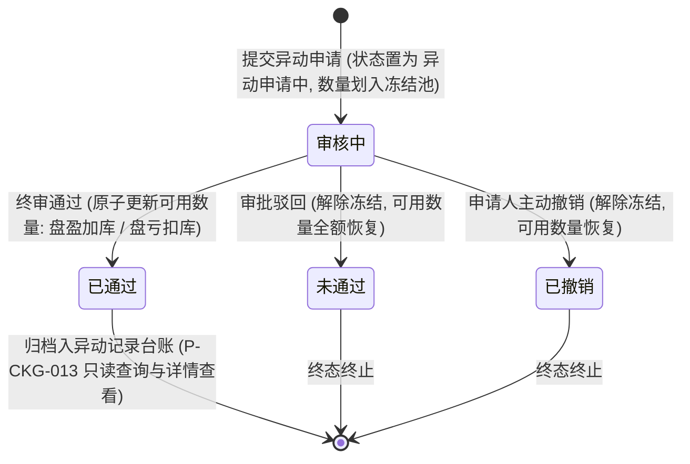

# 货物异动-异动记录 业务规则规格

> **文档定位**：仓储 / 货物异动 / 异动记录模块（`P-CKG-013`）差异调整业务定位、普通存货自主发起与抵质押风控红线隔离、多货物可见性穿透规则、异动后数量校验算法、红升绿降差额呈现、审批流转及多卡片详情弹窗的**唯一定义来源**。主 PRD、字段清单及端侧 ASCII 线框只引用本文件规则编号（R01~R18、C01~C05），不重复定义规则本体。
>
> **模块类型**：业务单据与调账台账类（包含微观存货选择、差异申报发起、审批流转及已生效异动归档追溯）
>
> **参考文档**：[《货物异动_异动记录主PRD》](./货物异动_异动记录主PRD.md)、[《货物异动_异动记录字段清单》](./货物异动_异动记录字段清单.md)、[《货物异动_异动记录_ASCII_列表页》](./货物异动_异动记录_ASCII_列表页.md)、[《货物异动_异动记录_ASCII_详情与新增页》](./货物异动_异动记录_ASCII_详情与新增页.md)、[《03-融资监管/06-抵质押业务-抵质押业务管理》](../../03-融资监管/06-抵质押业务-抵质押业务管理)
>
> **版本**：V1.0 | **更新时间**：2026-09-08 | **责任人**：森云科技（Senyun Technology）

---

## 一、单据与能力定位

| 项目 | 内容 |
| :--- | :--- |
| **单据层级** | **【第2层-订单/执行控制与调账层】**（仓储业务差异调整单据 —— 相当于 WMS/ERP 中的损溢调账控制中心） |
| **核心职责** | 规范物理库内货物因盘点差异（盘盈/盘亏）、自然挥发或物理破损（损耗）、形态转换或其他管理原因发生的实物数量调整。建立从前置实物精准定位、差异申报、审批核准到库存账面自动对冲的全链路闭环。 |
| **风控边界红线 (核心)** | **双轨发起机制与金融在押资产强隔离**： 1. **仓储模块发起权限（仅限普通自有存货）**：在【货物异动】模块点击【新增异动】，系统严格前置校验，**仅允许选择入库类型为【普通入库】且状态为【存货中】的普通自有货物**发起异动申报； 2. **金融在押资产风控红线（质押/抵押货物禁入）**：已处于质押或抵押状态的金融标的存货，涉及资方授信额度、平仓线及司法质押效力，**严禁在仓储模块单方面发起异动调整**！必须由资方与风控人员在 [03-融资监管/06-抵质押业务-抵质押业务管理](../../03-融资监管/06-抵质押业务-抵质押业务管理) 专属通道中，经多方会签审批后方可执行货权与数量变更； 3. **台账全量归集**：本列表唯一定位为“全平台已生效异动单据归档台账”，全量呈现来自 `存货单`、`质押单`、`抵押单` 的已通过异动结果。 |
| **单据来源** | **主动发起与跨模块联动双重机制**： 1. **普通存货主动发起**：仓库监管员在 PC 端通过库存明细选择器发起； 2. **金融在押异动联动写回**：融资监管抵质押管理中完成质押物核减/置换审批后，自动联动写入本台账； 3. **盘点单审批完成联动**：仓库货物盘点（`P-CKG-015`）产生盘盈/盘亏并审批通过后联动生成。 |
| **上游依赖** | **库存明细 (P-CKG-003)**：提供【存货中】且在库可用数量 $>0$ 的合法有效货位数据源头； **入库管理 (P-CKG-009)**：继承源头入库单号、填报时间、现场照片、补充资料及 IoT 设备抓拍凭证； **工作中心审批流**：挂载大数据流程或抵质押异动简总流程模板。 |
| **下游影响** | **库存中枢更新**：异动单终审通过后，系统在单一原子事务内自动调增（盘盈）或扣减（盘亏/损耗）该货位在库可用数量与总库存； **库存流水 (P-CKG-004)**：自动生成对应异动增减的出入库流水日志； **司法审计与存证**：固化变动前后数量差额与现场佐证照片，防篡改追溯。 |

---

## 二、数量核算口径隔离表

| 口径名称 | 存在位置 | 业务含义与计算公式 | 约束与边界条件 |
| :--- | :--- | :--- | :--- |
| **期初堆放数量** | 存货信息表格列 | 入库单初次分配至该垛位时填写的原始实物数量 $Q_{\text{init}}$ | 数值 $> 0$，4 位小数；继承货品单位；**终身不可篡改**，不随出库、移库或异动作业发生任何变动 |
| **异动前剩余可用数量** | 申请表单回显项 | 发生异动申请时刻，该货位当前的实时账面可用存量 $Q_{\text{before}}$ | 数值 $> 0$，4 位小数；只读回显靠右展示，不带编辑输入框；作为差额试算的基准被减数 |
| **异动后可用数量** | 申请表单输入项 | 现场盘点或调整后，该货位期望达到的目标实物可用数量 $Q_{\text{after}}$ | **强校验项**：必填，数值型，支持 4 位小数；**严禁输入 $\le 0$ 的数值**；必须输入真实有效的目标存量 |
| **差异数量 (增减量)** | 列表列 / 详情卡片 | 变动后数量与变动前剩余可用数量的差额绝对值与方向： $$\Delta Q = Q_{\text{after}} - Q_{\text{before}}$$ | 系统自动计算；$\Delta Q > 0$ 为盘盈（红色向上箭头 `⬆`）；$\Delta Q < 0$ 为盘亏/损耗（绿色向下箭头 `⬇`）；不允许为 0 |
| **异动后数量** | 列表表格列 / 详情卡片 | 列表与详情展示格式：`现存量 (+增量)` 或 `现存量 (-减量)` | 格式化呈现，如 `3斤 (+1斤)`、`14箱 (-1箱)`、`18公斤 (+8.05公斤)`；带法定计量单位 |

---

## 三、异动审批状态机与库存联动

### 3.1 状态定义与归档可见性
| 状态名称 | 状态编码 (`Enum`) | 业务含义 | 货位库存影响 | 异动记录列表可见性 |
| :--- | :--- | :--- | :--- | :---: |
| **审核中** | `AUDITING` | 经办人已提交异动申请，流转在审批中心等待审核 | 该货位可用数量被锁定，切入【异动申请中】冻结池 | 不可见（审批中心流转） |
| **已通过** | `APPROVED` | 审批节点全量核准通过，异动调账生效 | **执行库存对冲**：原子调增或扣减可用数量，解除冻结 | **【唯一可见状态】**（本列表台账唯一定位） |
| **未通过** | `REJECTED` | 审批人驳回异动申报，单据终止 | 解除审批冻结，全额退回原货位在库可用数量池 | 不可见（我的申请追溯） |
| **已撤销** | `WITHDRAWN` | 发起人在终审前主动撤销申请 | 解除审批冻结，恢复原货位在库可用数量 | 不可见（我的申请追溯） |

### 3.2 异动流转与库存对冲时序

---

## 四、动作能力与流转控制矩阵

| 触发动作 | 操作入口 | 适用角色 | 前置业务校验条件 | 结果状态 / 跳转目标 | 联动后置影响 | 失败阻断提示 (Toast / Alert) |
| :--- | :--- | :--- | :--- | :--- | :--- | :--- |
| **条件查询** | 筛选区【查询】按钮 | 具备查看权限角色 | 申请时间区间合法 | 刷新异动记录台账列表 | 服务端基于用户仓库管辖权限执行多货物可见性穿透检索 | 「查询失败：开始时间不得晚于结束时间」 |
| **重置筛选** | 筛选区【重置】按钮 | 具备查看权限角色 | 无 | 恢复默认筛选项 | 清空自定义条件，恢复默认倒序排布 | - |
| **唤起新增选货** | 列表右上角【新增异动】按钮 | 仓管员 / 核算员 (`P-CKG-013:CREATE`) | 无 | 居中呼出存货选择弹窗 (`P-CKG-013-SELECT`) | 强过滤仅展示【普通入库】且【存货中】有效货位，拦截金融在押物（R01~R02） | - |
| **发起异动申请** | 选择弹窗操作列【异动申请】链接 | 仓管员 / 核算员 | 货位可用量 $>0$ 且处于存货中 | 跳转至 `P-CKG-013-APPLY` 申请录入表单页 | 自动携带货位参数并带出源头入库单只读快照 | 「发起失败：该货位处于流转审批中或可用量不足」 |
| **提交异动申请** | 申请页底部【提交申请】按钮 | 仓管员 / 制单人 | ① 异动后数量 $>0$ 且产生变动； ② 异动类型必选； ③ 原因 $\le 500$ 字； ④ 现场照片 $\le 3$ 张且 $\le 5\text{MB}$。 | 货位状态切为【异动申请中】；生成 19 位异动单号 | 划入冻结池互斥锁定，单据推入工作中心审批池（`P07-05-04`） | 「提交失败：异动后数量必须大于0」 「提交失败：数量未发生变动」 |
| **异动审批核准** | 工作中心/审批中心【通过】按钮 | 仓库主管 / 风控经理 | 具备审核权限；非制单人（P06 自审禁止） | 异动单置为【已通过】 | 原子更新库存明细可用量，恢复【存货中】，生成库存流水并归档入异动记录 | 「审批失败：自审禁止（不可审批本人发起的单据）」 |
| **查看异动详情** | 列表操作列【查看详情】链接 | 具备详情查看权限 (`P-CKG-013:VIEW`) | 点击行单据处于终态已生效状态 | 居中呼出多卡片详情聚合弹窗 (`P-CKG-013-DETAIL-MODAL`) | 一单多物纵向多卡片排列，红升绿降高亮呈现，展示审批时间轴与任务链接 | 「打开失败：单据记录已归档或无权访问」 |
| **查看任务详情** | 详情弹窗审批节点【任务详情 >】| 具备工作中心权限 | 该审批节点存在详细审批快照 | 打开新窗口访问该节点处理详情快照 | 查阅审批意见与历史审核事实 | 「查看失败：任务快照已归档」 |

---

## 五、业务规则明细 (Rule 01 ~ 18)

### 4.1 权限与风控边界隔离规则 (R01 ~ R03)
* **R01【普通存货自主发起边界】**：
  * 在异动记录列表点击【新增异动】，系统呼出库存明细选择弹窗；
  * **强校验过滤准入**：列表仅拉取同时满足以下三项条件的存货货位：
    1. `货品状态` 严格等于 **`存货中`**；
    2. `入库类型` 严格等于 **`普通入库`**（排除质押/抵押/仓单等金融入库）；
    3. `可用数量` $> 0$。
  * 杜绝仓管人员擅自对金融在押品发起私自调账。
* **R02【金融在押存货异动禁入阻断】**：
  * 若用户试图对抵押或质押存货发起异动，系统强行阻断并引导：`“抵质押存货涉及资方权属管控，请前往【融资监管 - 抵质押业务管理】发起押品调整”`。
* **R03【多货物可见性穿透权限规则 (核心)】**：
  * 数据权限基于用户被分配的实体监管仓库权限；
  * **原子可见性保障**：**若一张异动单据包含多个货品（分布在不同仓库或库房），只要当前登录操作员对其中至少一个货品所在的实体仓库具有查看权限，则系统自动放行该单据，允许操作员查看该异动单据下的全量货品明细**，保障业务单据审计证据的完整性与不可割裂性。

### 4.2 申报校验与差额算法规则 (R04 ~ R07)
* **R04【异动后可用数量严格校验】**：
  * `异动后可用数量` 为必填项，数值型，允许保留最多 4 位小数；
  * **正数强约束**：系统强制校验输入值必须 **$> 0$**；若输入 0 或负数，表单失焦并提示：`异动后可用数量必须大于0`，禁止提交；
  * **零变动拦截**：若输入的 `异动后可用数量 == 异动前剩余可用数量`，前端拦截提交并提示：`数量未发生变动，无需发起异动申请`。
* **R05【差异数量自动试算与红升绿降规则】**：
  * 输入异动后数量时，系统自动试算：$$\Delta Q = Q_{\text{after}} - Q_{\text{before}}$$
  * 列表与详情展示规则：
    * 若 $\Delta Q > 0$：定义为盘盈，前台呈现为 **`现存量 (+增量)`**，增量部分采用 **红色字体 + 向上箭头 `⬆`** 醒目渲染；
    * 若 $\Delta Q < 0$：定义为盘亏/损耗，前台呈现为 **`现存量 (-减量)`**，减量部分采用 **绿色字体 + 向下箭头 `⬇`** 醒目渲染。
* **R06【异动类型四项白名单】**：
  * 异动类型下拉选择框仅提供 4 项合法枚举：**`盘盈`**、**`盘亏`**、**`损耗`**、**`其他`**；
  * 必选项，禁止为空。
* **R06b【多货物异动类型组合展示规则 (核心)】**：
  * **业务来源背景**：在融资监管【抵质押业务管理】发起押品异动申报时，支持针对同一笔抵质押单据下的**多个货物同时合并发起申请**；
  * **异构类型共存**：在同一笔申请中，各货物的异动属性允许不同（例如：货物A为 `盘盈`，货物B为 `盘亏`，货物C为 `损耗`）；
  * **列表列展示规范**：异动记录列表页的【异动类型】列以单据为聚合维度：
    * 若单据下所有货品为同一类型，直接展示该类型名称（如 `盘盈`）；
    * 若单据下包含不同类型，系统自动提取单据内所有货物的异动类型并去重，以竖线加空格形式组合展示，例如：**`盘盈 | 盘亏`**、**`盘亏 | 损耗`**；
  * **筛选联动**：顶部筛选区【异动类型】支持多选，若勾选了其中某一项（如勾选 `盘亏`），则包含 `盘盈 | 盘亏` 的复合单据均会被正确匹配检索出来。
* **R07【异动原因与附件规范】**：
  * `异动原因`：非必填，多行文本框，限制 **0/500 字**，输入超长时强行截断；
  * `附件上传`：非必填，支持图片格式 `jpg/jpeg/png/gif`，单文件大小 $\le 5\text{MB}$，最多允许上传 3 张现场盘点/破损实物照片。

### 4.3 列表呈现与超高控制规则 (R08 ~ R11)
* **R08【单据类型与关联单号映射规则】**：
  * 列表中的 `单据类型` 严格反显源头属性：
    * `抵押单`：关联单号展示抵押单号；
    * `质押单`：关联单号展示质押单号；
    * `存货单`：关联单号展示源头入库单号（19位）。
* **R09【多货物纵向对齐与超高折叠】**：
  * 当单据包含多个货品时，`货物`、`存放位置`、`异动类型` 与 `异动后数量` 必须行行对应、严格垂直居中对齐；
  * 单元格高度超过三行预设阈值时，自动折叠并展现文本链接 **`更多..`**；
  * 鼠标悬停（Hover）或点击 `更多..` 时，弹出轻量 Tooltip 气泡展示该单据下的全量货物清单。
* **R10【货主二元展示格式】**：
  * 列表货主列统一展示格式为：`货主名称 - 信用代码/脱敏手机号`；
  * 个人货主手机号强制隐藏中间 4 位（`1xx****xxxx`）。
* **R11【默认排序与精准检索】**：
  * 列表默认严格按 **【申请时间】倒序** 排列；
  * 筛选区【异动类型】支持多选，单据内包含任意一个选中类型即被检索命中。

### 4.4 异动详情多卡片聚合与审批追溯规则 (R12 ~ R15)
* **R12【异动详情居中弹窗形态】**：
  * 点击列表操作列的【查看详情】文字链接（采用系统主题色），在当前页居中呼出模态弹窗 `P-CKG-013-DETAIL-MODAL`；
  * 弹窗内容区支持原生纵向滚动，点击右上角 `[X]` 或按 `Esc` 键关闭。
* **R13【一单多物多卡片排布】**：
  * 若异动单涉及多个货位，弹窗内部为每个货品独立渲染一个标准卡片；
  * 卡片顶栏左侧展示异动单号，右侧展示醒目的单据类型徽标（`质押单` / `抵押单` 为浅橙色，`存货单` 为浅黄色）；
  * 卡片内部清晰呈现剩余数量条（含红升绿降箭头）、存放位置、变动前/后数量、变动类型、变动原因及附件缩略图。
* **R14【审批记录时间轴完整回显】**：
  * 弹窗底部展示【审批记录】时间轴区块；
  * 顶部标牌回显所匹配的流程模板名称（如 `流程名称：抵质押简总流程` 或 `流程名称：大数据流程`）；
  * 纵向时间轴节点清晰列出发起提交、系统分配、任务审核等各节点的处理人、时间戳与处理意见。
* **R15【入库单号查看穿透】**：异动申请页中基础信息区的入库单号，右侧提供【查看】文字链接，点击在新标签页穿透访问 `P-CKG-009-DETAIL`。

### 4.5 权限与系统审计规则 (R16 ~ R18)
* **R16【RBAC 权限码矩阵】**：
  * `P-CKG-013:VIEW`：异动记录列表与详情弹窗浏览权限；
  * `P-CKG-013:CREATE`：新增异动发起与提交权限；
  * `P-CKG-013:EXPORT`：异动台账导出权限（预留）；
  * `P-CKG-009:DETAIL_VIEW`：源头入库单穿透查看权限。
* **R17【幂等性与防重复提交】**：异动申请页点击【提交】后，按钮即时置入 Loading 状态并加锁 3 秒，防止连续点击生成重复异动单据。
* **R18【全生命周期版本快照审计】**：异动生效时刻，系统对变动前数量、变动后数量、经办人、审批链条镜像入库固化，禁止任何物理修改。

---

## 六、异常与边界处理 (C01 ~ C05)

| 异常编号 | 异常场景 | 系统判定与控制动作 | 前端反馈与提示 |
| :--- | :--- | :--- | :--- |
| **C01** | 申请时间起止倒置 | 筛选区选择 `开始日期 > 结束日期` | 失去焦点时自动修正结束日期为开始日期，Toast 提示：`开始时间不得晚于结束时间` |
| **C02** | 试图输入 0 或负数 | 在异动后可用数量框录入 `<=0` 的数字 | 输入框标红，失焦时提示：`异动后可用数量必须大于0`，阻止提交 |
| **C03** | 申报期间货物已被出库占用 | 提交申请时刻，该货位可用数量因并发审批减少并低于申报值 | 事务提交强校验拦截，Toast 提示：`抱歉，该货位存货数量已发生变动，请刷新后重试` |
| **C04** | 附件上传超限 | 单张图片大小 $>5\text{MB}$ 或上传张数 $>3$ 张 | 上传组件拦截并清除超限文件，Toast 提示：`最多上传3张图片，单张不可超过5MB` |
| **C05** | 异动原因字数超限 | 粘贴文本超过 500 个汉字 | 文本框自动截断前 500 字，计数器显示 `500/500`，阻止超长输入 |

---

## 七、修订记录

| 日期 | 版本 | 变更内容说明 | 影响范围 | 修订人 |
| :--- | :--- | :--- | :--- | :--- |
| 2026-09-08 | V1.0 | **建立最新基准版业务规则规格**： 1. 明确单据定位为差异调整与损溢核算中枢，归档仅呈现已通过生效单据； 2. 规范仓储端新增前置强过滤（仅普通存货）与抵质押风控红线拦截（R01~R02）； 3. 确立多货物可见性穿透权限规则（R03）与异动后数量校验（$>0$）； 4. 规范红升绿降试算公式、一单多物多卡片纵向聚合弹窗及全流程审批时间轴（R12~R14）。 | 货物异动列表、选货弹窗、申请页与详情弹窗 | AI PM / 森云科技 |
| 2026-09-08 | V1.1 | **多货物异动类型组合展示规则确立**： 1. 新增 R06b，确立在抵质押模块多货物合并申请异动时，列表列按去重组合展示（如 `盘盈 \| 盘亏`）； 2. 规范筛选区多选联动逻辑。 | 异动记录列表列展示与多选检索 | AI PM / 森云科技 |
| 2026-09-08 | V1.2 | **全面对齐入库/出库管理标杆文档体系**： 1. 新增《四、动作能力与流转控制矩阵》，补齐操作级前置校验与失败阻断规格； 2. 规范修订记录与各级文档引用闭环。 | 规则完整度与操作规格闭环 | AI PM / 森云科技 |
