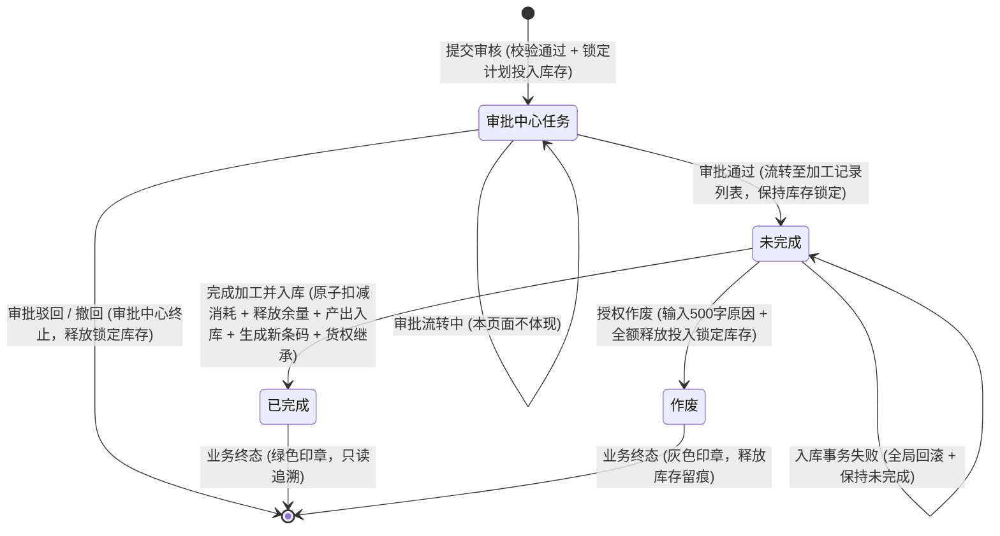
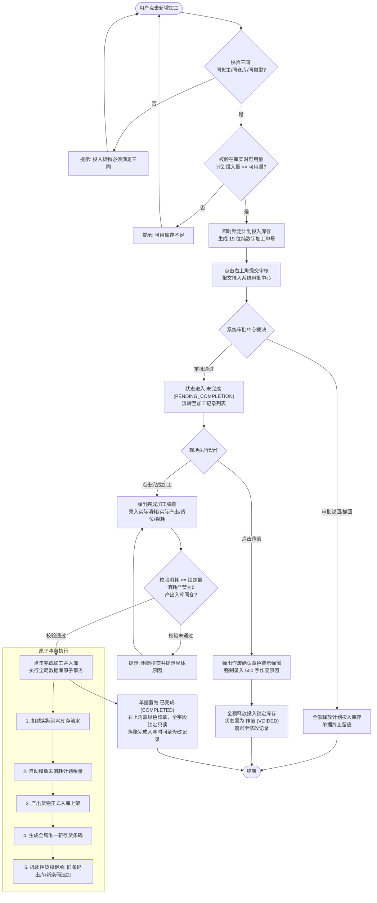
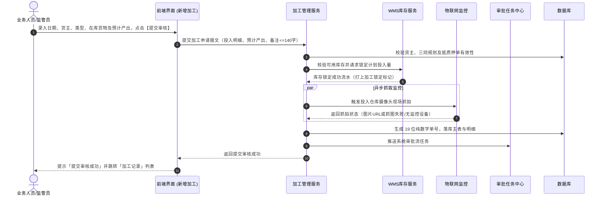
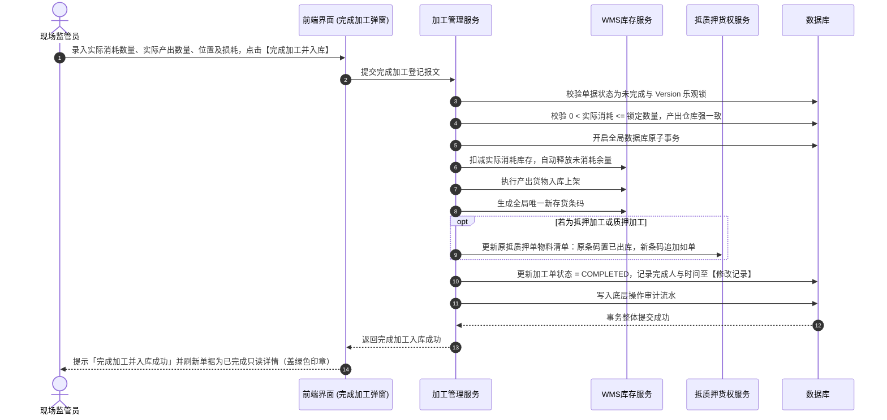

# 加工管理业务规则规格

> **文档定位**：加工管理/加工记录模块状态机、动作约束、前置校验规则、计算公式、货权继承算法、原子事务与并发防重规则的**唯一定义真源**。主 PRD、字段清单及端侧原型只引用本文件规则编号（R01~R36），不重复定义规则本体。
>
> **模块类型**：业务单据 / 流转执行类（审批流挂载通用审批任务，仓储现场执行入库核销）
>
> **参考文档**：[《加工管理主PRD》](./加工管理主PRD.md)、[《加工管理字段清单》](./加工管理字段清单.md)、[《14-货品管理字段清单》](../../08-配置管理/14-货品规格管理-货品管理/货品管理字段清单.md)
>
> **版本**：V3.3 | **更新时间**：2026-09-16 | **责任人**：森云科技（Senyun Technology）

---

## 一、单据与能力定位

| 项目 | 内容 |
| :--- | :--- |
| **单据层级** | **【第2层-订单/执行控制层】**（库存业务层——加工记录控制单据） |
| **核心职责** | 规范存货在仓储监管期间因切割、拆分、熔炼、组装等产生的加工业务，锁定投入库存，记录实际消耗与余量释放，入库产出存货并生成新存货条码，实现抵/质押货权的无缝继承与全路径追溯。 |
| **单据来源** | 业务操作人员或仓库监管人员在 PC 端或移动端（App/PDA）点击【新增加工】发起。 |
| **上游依赖** | **货主档案**：提供货主主体 ID、名称和数据权限； **可用库存明细**：提供库存批次/条码、仓库/库房/分区、可用数量和货权状态； **抵押单、质押单**：提供有效单据 ID、货权状态和物料清单，业务规则由下游融资单据维护； **货品基础信息**：读取大类、品类、规格、计量单位和参考单价（继承自货品管理基准）。 |
| **下游影响** | **库存锁定与扣减**：提交时锁定投入库存流水，完成入库时原子扣减实际消耗库存； **余量释放**：完成时自动释放未消耗余量，单据作废时全额释放投入锁定库存； **产出入库与条码**：生成产出库存并由系统生成全局唯一新存货条码； **货权继承**：更新原抵质押单物料清单（原条码置为已出库，新条码追加入单）； **全链路审计**：写入全生命周期操作与库存审计流水。 |
| **审核流** | **【走系统审批中心任务】**：创建单据点击【提交审核】后，进入系统通用审批任务流程，本页面不体现审批中过程态；审批通过后单据正式进入加工记录列表（状态为“未完成”），现场监管员可执行【完成加工并入库】或【作废】。 |

---

## 二、数量与金额口径隔离表

| 口径名称 | 存在位置 | 业务含义与计算公式 | 约束与边界条件 |
| :--- | :--- | :--- | :--- |
| **一级计划投入量** | 投入明细（头部汇总） | 同一规格（大类+品类+规格）下各货位计划投入量之和 | 必须等于同规格各货位计划量之和；公式：$\text{一级计划量} = \sum \text{二级计划量}$ |
| **计划投入数量** | 投入明细（货位行） | 针对特定库存批次/货位填写的计划投入数量 | $0 < \text{计划投入数量} \le \text{提交时实时可用库存}$ |
| **锁定数量** | 完成加工弹窗（实际投入） | 取自申请审批通过的计划投入量，作为现场消耗依据 | 系统自动带出只读显示，带计量单位 |
| **实际消耗数量** | 完成加工弹窗/详情投入 | 完成加工时填写的实际物理消耗数量 | $0 < \text{实际消耗数量} \le \text{锁定数量}$（严禁为 0；某条完全未使用需作废单据） |
| **自动释放数量** | 完成加工弹窗/详情投入 | 完成加工时系统自动释放的库存锁定量 | 公式：$\text{自动释放数量} = \text{锁定数量} - \text{实际消耗数量}$；详情表头为“释放数量” |
| **预计产出数量** | 产出明细（行级） | 申请时填写的预计产出数量 | $\text{预计产出数量} > 0$；提交审核后产出规格结构强行冻结 |
| **实际产出数量** | 完成加工弹窗/详情产出 | 完成加工时填写的实际产出入库物理数量 | $\text{实际产出数量} > 0$；允许大于或小于预计产出数量 |
| **投入货品品类数** | 新增页投入明细底部 | 新增页已添加的投入货品去重规格种数 | 系统自动汇总；格式：`投入货品品类数：{N}` |
| **投入货品总数量** | 新增页投入明细底部 | 新增页全部明细行计划投入数量算术累加之和 | 系统自动汇总；格式：`投入货品总数量：{M}` |
| **预计产出总金额** | 新增页产出明细底部 | $\sum (\text{预计产出数量} \times \text{行业参考单价})$ | 仅汇总有价行；展示格式：`¥{金额}`；缺价提示但不阻断提交 |
| **实际产出总金额** | 完成加工弹窗右下角 | $\sum (\text{实际产出数量} \times \text{行业参考单价})$ | 仅汇总有价行；未输入数量或缺价显示 `--`，不阻断完成入库 |
| **加工损耗** | 完成加工弹窗/已完成详情 | 手动录入的实际物理损耗百分比；范围 $0\% \sim 100\%$ | 仅做整单记录留痕，严禁参与库存扣减与货值/安全线计算 |

---

## 三、状态定义

> 本页面状态严格收敛为 3 态，审批流在系统通用审批中心流转，本页面不展示“审批中/已驳回/已撤回”等审批中间态。

| 状态名称 | 枚举值编码 | 业务含义 | 是否终态 | 进入条件 | 离开条件 |
| :--- | :--- | :--- | :---: | :--- | :--- |
| **未完成** | `PENDING_COMPLETION` | 申请已在审批中心审核通过，计划投入库存保持锁定，等待现场监管员登记实际加工结果 | 否 | 系统审批任务流“审批通过”节点执行成功 | 完成加工并入库成功 / 授权人员执行作废 |
| **已完成** | `COMPLETED` | 实际消耗扣减、余量释放、产出入库、新条码生成及货权继承事务执行成功，单据锁定 | **是** | 完成加工原子事务整体执行成功 | — （终态不可逆，不支持业务冲正或作废；详情右上角展示绿色圆形印章） |
| **作废** | `VOIDED` | 未完成状态下授权人员录入作废原因执行作废，计划投入库存全额解锁释放 | **是** | 授权人员在【作废确认】弹窗输入作废原因并确认 | — （终态留痕；详情右上角展示灰色圆形印章） |

---

## 四、状态流转图

---

## 五、状态流转表（核心规则矩阵）

| 当前状态 | 触发动作 | 前置校验条件 | 结果状态 | 弹窗与交互口径 | 后置级联影响 | 失败阻断提示 |
| :--- | :--- | :--- | :--- | :--- | :--- | :--- |
| 未提交 | 提交审核 | R01: 加工日期 $\le$ 当前时间 R02: 必选货主/类型 R03: 普通货仅选“存货中”可用库存 R04: 抵质押货关联有效单据且过滤仓单货 R05: 投入货物满足“三同” R06: $0 < \text{计划量} \le \text{实时可用量}$ R07: 预计产出量 $> 0$ R08: 备注 $\le 140$ 字 | 审批中心受理（通过后进入未完成） | 新增页右上角【提交审核】按钮，无二次确认弹窗 | ① 生成 19 位纯数字加工单号 ② 锁定投入库存数量（标记为“加工锁定”） ③ 异步抓取 IoT 现场/设备影像（失败记日志不阻断） ④ 推送系统审批任务流 | 浮窗提示：提交审核失败：{具体未满足项} |
| 未完成 | 完成加工并入库 | R21: 实际产出量 $> 0$ R22: 产出仓库必须与主表仓库强一致，货物位置/具体位置必填 R23: 实际消耗量 $> 0$ 且 $\le$ 锁定量（严禁为0） R25: 损耗比例($0\% \sim 100\%$)及损耗说明($\le 500$字)必填 | 已完成 | 唤起【完成加工】弹窗： - 灰色提示：`实际结果确认后不支持业务冲正` - 蓝色提示：`ⓘ 当前投入库存将被锁定，完成后全部产出将自动归类至 {关联单号}` - 点击【完成加工并入库】按钮 | 全局原子事务： ① 扣减实际消耗库存 ② 释放计划余量 ($\text{锁定数量} - \text{实际消耗数量}$) ③ 生成产出库存及全局唯一新存货条码 ④ 抵质押产出继承主单；原单旧条码置“已出库”，追加新条码 ⑤ 详情展示绿色“已完成”印章，回写【修改记录】 | 浮窗提示：完成加工失败：{具体错误} |
| 未完成 | 单据作废 | 操作人具备作废权限；录入必填作废原因 | 作废 | 唤起【作废确认】弹窗： - 黄色警示：`! 作废后释放全部锁定库存，请填写作废原因` - 录入作废原因（最多500字） - 点击【确定】 | ① 状态更新为“作废” ② 调用库存引擎全额释放计划投入锁定库存 ③ 详情展示灰色“作废”印章，作废人、时间、原因回写至【修改记录】标签页 | 浮窗提示：作废失败：单据已被完成处理 |
| 全状态 | 查看详情 | 任何授权人员可查看 | 不变 | 唤起单据详情页，展示主表及四大标签页 | 只读追溯展示，单号支持一键复制，关联单号支持跳转查看 | 无 |

---

## 六、核心业务规则

### 1. 申请与前置校验规则

#### 【业务时间合规性】(R01)
- 加工日期只能选择不晚于当前系统时间的日期时间，默认当前时间，精确到秒；禁止录入未来时间。

#### 【货主主体与明细联动】(R02)
- 支持企业货主与个人货主；货主变更时，前端清空已选的投入货物与关联单号，防止出现跨主体数据污染；个人货主展示脱敏手机号与身份证号。

#### 【加工类型与库存状态匹配】(R03)
- **普通加工**：仅允许选择状态为 `存货中` 且无任何锁定的在库可用库存；
- **抵押加工 / 质押加工**：必须关联对应的有效抵押单或质押单，且仅能选择该单据名下的抵质押在库货物。

#### 【抵质押关联与仓单强过滤】(R04)
- 抵押或质押加工仅允许关联处于正常在押状态的单据；
- **仓单强过滤**：若抵质押单中的货物已开具数字仓单，系统强行过滤并禁止选择，阻断提示「仓单货物不可发起加工，请先解单」。

#### 【投入货物三同校验与仓库锁定】(R05)
- 单张加工单内所有的投入明细，必须同时满足：**同一货主**、**同一实体仓库**、**同一加工类型**。
- 主表无独立仓库选择框，用户添加第一条投入货物后，系统自动确定并锁定主表仓库名称；清空投入明细后方可解锁。

#### 【计划投入量与即时锁库】(R06)
- 每条货位计划投入量必须满足 $0 < \text{计划量} \le \text{提交时实时可用量}$；
- 点击【提交审核】成功后，系统即时锁定对应库存数量，扣减可用量，打上“加工锁定”标记，防止其他业务并发争抢。

#### 【产出规格带出与结构冻结】(R07)
- 产出货物选择后，系统自动带出其 `规格型号`（如散装）与 `计量单位`（如颗）；
- 每条产出货物的预计产出数量必须 $> 0$；
- **无效操作拦截**：若整张加工单的投入与产出规格完全相同且数量完全相等，系统判定为无效操作并阻断提交；
- 提交审核成功后，产出货物的规格结构强行冻结，后续完成加工时不允许新增、删除或替换产出规格。

#### 【备注字数上限约束】(R08)
- 新增申请页备注输入框支持最多输入 **140 个字符**（`0/140`），超出字符长度禁止输入并拦截提交。

---

### 2. 审批中心与作废控制规则

#### 【审批中心通用任务流转】(R11)
- 加工申请点击【提交审核】后，直接推送到系统的通用审批任务中心；在加工记录业务页面中不体现审批中状态，亦不提供审批节点操作。

#### 【审批通过与未完成单据生成】(R12)
- 审批流所有节点通过后，加工单正式进入仓储执行层「加工记录」列表，状态为 `PENDING_COMPLETION`（未完成）；计划投入库存继续保持锁定状态。

#### 【审批终止与库存解锁】(R13)
- 审批流中若执行驳回或撤回，审批任务终止，系统在同一事务内全额解锁并释放该单据锁定的全部计划投入库存。

#### 【未完成单据作废与审计留痕】(R14)
- 单据处于 `未完成` 状态时，具备作废权限的人员可点击【作废】；
- 必须唤起【作废确认】弹窗，展示黄色警示条 `! 作废后释放全部锁定库存，请填写作废原因`；
- **作废原因必填且上限 500 字**（`0/500`）；确认作废后状态更新为 `作废`，全额释放锁定库存，并将作废人、作废时间及作废原因落账至详情页【修改记录】标签页。

---

### 3. 完成加工与产出入库原子事务

#### 【实际产出数量合规性】(R21)
- 完成加工登记时，每条产出货物的实际产出数量必须 $> 0$；允许大于或小于预计产出数量，但不得为 0 或负数。

#### 【产出入库位置与同仓强约束】(R22)
- 产出货物的入库仓库必须与单据主表仓库**强一致**（严禁跨仓产出）；允许在同仓下选择不同的库房、分区（`货物位置`）；
- 产出 `具体位置` 为必填项，缺失强行阻断完成登记。

#### 【实际消耗数量超额强拦截】(R23)
- 现场填写的每条实际消耗数量必须满足 $0 < \text{实际消耗} \le \text{锁定数量}$；
- **零消耗阻断**：每条实际消耗必须大于 0 且不得超过锁定数量；若某条投入货物完全未使用，不允许填 0，必须作废当前加工单后重新发起申请。

#### 【计划余量自动释放机制】(R24)
- 完成加工登记提交后，系统自动计算每条投入明细的释放数量：$\text{自动释放数量} = \text{锁定数量} - \text{实际消耗数量}$；
- 系统在完成加工原子事务内自动生成库存解锁流水，将余量无缝释放回可用库存。

#### 【加工损耗信息留痕规则】(R25)
- 完成加工必须录入加工损耗比例（$0\% \sim 100\%$）及损耗说明（上限 500 字，`0/500`）；无损耗填 `0%`；
- 损耗数据仅作为单据技术指标留痕（仅在已完成详情展示），严禁参与库存数量扣减、产出货值核算或抵质押安全线计算。

#### 【新条码生成与货权无缝继承】(R26)
- 产出货物入库成功后，系统自动为每条产出货物生成全局唯一的**新存货条码**；
- **抵质押货权继承**：若本次加工为抵押加工或质押加工：
  1. 系统将原抵押单/质押单物料清单中被消耗的原存货条码状态置为 `已出库(加工)`；
  2. 将新生成的产出存货条码、规格、数量追加写入原抵押单/质押单物料清单中，实现货权链路不中断；
  3. 并在完成加工弹窗中明确展示蓝色提示：`ⓘ 当前投入库存将被锁定，完成后全部产出将自动归类至 {关联单号}`。

---

### 4. 价格计算、影像抓拍与并发审计

#### 【缺价统一提示口径】(R31)
- 产出货物单价统一继承自货品管理中的行业参考单价；
- 若货品未设置单价，单价列展示 `--`，汇总区域提示「存在未定价货物」，系统不阻断加工申请提交或完成入库登记。

#### 【产出金额试算公式】(R32)
- $\text{预计产出总金额} = \sum (\text{预计产出数量} \times \text{行业参考单价})$（展示带货币符号 `¥`）；
- $\text{实际产出总金额} = \sum (\text{实际产出数量} \times \text{行业参考单价})$（仅汇总有价行）。

#### 【现场抓拍与降级容错】(R33)
- 提交申请时系统自动调用投入仓库摄像头与联网设备抓拍现场图像；
- 若现场无监控设备或调用超时/失败，系统在详情页展示文本 `抓图失败/无监控设备`，不阻断单据正常流转。

#### 【并发乐观锁与排他控制】(R34)
- 单据操作基于版本（Version）乐观锁；多用户并发操作同一单据或同一库存批次时，后提交者直接提示「数据已被修改，请刷新后重试」；
- 完成加工接口采用严格的分布式幂等防重锁，防止网络重发导致重复入库。

#### 【操作审计与详情四标签页】(R35)
- 详情页分为四大标准标签页展现：
  - **标签页 1 投入货物**：展示原投入货物快照、锁定数量、实际消耗与释放数量；
  - **标签页 2 产出货物**：展示产出货物、预计数量、实际数量、行业参考价、入库位置、其他信息与新存货条码；
  - **标签页 3 审核记录**：回显总流程名称、申请提交、分配、任务节点及【任务详情 >】超链；
  - **标签页 4 修改记录**：已完成单据展示完成人与完成时间；作废单据展示作废人、作废时间与作废原因。

#### 【货权档案互通与产证书证】(R36)
* **触发时机**：加工记录在现场监管员点击【完成加工并入库】原子事务执行成功时；
* **【06-货权档案】互通行为**：
  1. **消耗端库存扣减**：扣减原投入货品在货权档案中的实物在库库存与货值；
  2. **产出端入库建账**：产出新货品正式入库上架，增加对应货品当前库存与货值；
  3. **抵质押货权无缝继承**：若本次加工为抵押货或质押货，系统将原抵押单/质押单物料清单中被消耗的原条码标记为已出库，新条码**无缝继承原抵押/质权档案**、质押单号绑定关系与估值，担保物权效力不中断。
* **【07-货权公示】互通行为**：
  1. 若原质押单已完成中登网登记或中仓登公示，新产出的货品条码无缝继承原公示关联，支持后续重新生成系统货权牌或中仓登货权牌（版本号递增）；
  2. 若原单据为【未公示】，则新产出货品保持【未公示】状态。
* **【08-证据管理】互通行为**：
  1. 自动生成一条存证类型=【入库】（加工产出来源）流水；
  2. **数量与符号规范**：**变更数量强制为正数**（实际产出入库数量）；
  3. **物证与加工凭据挂载**：挂载加工单号、原抵质押单号、投入消耗明细与损耗说明，关联现场加工及入库抓拍影像。

---

## 七、权限与风控约束

| 角色 | 新增加工 / 提交审核 | 查看列表/详情 | 完成加工并入库 | 作废单据 | 审批中心流转 | 数据范围 |
| :--- | :---: | :---: | :---: | :---: | :---: | :--- |
| **仓库监管员 / 业务操作员** | ✅ | ✅ | ✅ | ❌ | ❌ (非审批节点) | 授权仓库范围内 |
| **仓储主管 / 作废授权人员** | ❌ | ✅ | ✅ | ✅ | ❌ | 授权仓库范围内 |
| **风控管理人员** | ❌ | ✅ | ❌ | ✅ (特权) | ❌ | 当前租户全量（只读+特权作废） |
| **审批中心人员** | ❌ | ✅ | ❌ | ❌ | ✅ (审批中心处理) | 授权审批流范围内 |
| **系统管理员** | ✅ | ✅ | ✅ | ✅ | ✅ | 当前租户全量 |

---

## 八、跨模块业务流程图

---

## 九、核心操作时序图

### 1. 加工申请提交与库存锁定时序

### 2. 完成加工原子事务与货权继承时序

---

## 十、修订记录

| 日期 | 版本 | 变更摘要 | 变更人 |
| :--- | :---: | :--- | :--- |
| 2026-08-14 | V1.0 | 初版加工管理业务规则规格 | 产品团队 |
| 2026-09-02 | V3.0 | 对齐 6.2 标杆架构基准版：规范 R01~R35 标准规则编码、口径隔离表、状态流转矩阵、跨模块流程图与双时序图 | AI PM / 森云科技 |
| 2026-09-09 | V3.1 | 真实系统全生命周期交互与规则闭环校准（单据 3 态收敛、19位单号、完成与作废闭环） | AI PM / 森云科技 |
| 2026-09-16 | V3.2 | 规范抵质押货权无缝继承、公示继承与产出存证跨模块数据互通（R36） | AI PM / 森云科技 |
| 2026-09-16 | **V3.3** | 清除文件历史重复冗余段落，规则编号全面语义自解释化升级：【规则名称】(Rxx) 格式，汉化 Tab 为标签页 | AI PM / 森云科技 |
