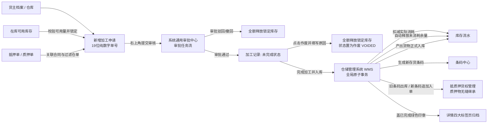

# 加工管理主PRD

> **模块定位**：库存业务层核心流转单据，规范存货在仓储监管期间的加工行为（切割、拆分、熔炼、组装等），实现计划投入库存锁定、实际消耗扣减、计划余量释放、产出入库、新存货条码生成及抵/质押货权无缝继承的全链路闭环。  
> **版本**：V3.3 | **更新时间**：2026-09-16 | **责任人**：森云科技（Senyun Technology）  
> **编写依据**：[加工管理字段清单.md](./加工管理字段清单.md) 是本模块所有字段定义、枚举与页面展示的唯一基准；[加工管理业务规则规格.md](./加工管理业务规则规格.md) 是本模块状态机、原子事务、货权继承与并发控制的唯一定义来源。

---

## 1. 业务背景与业务痛点

### 1.1 业务背景
存货在仓储监管期间可能发生切割、拆分、熔炼、组装等加工行为，导致投入货物和产出货物的货品规格编码（SKU）、数量、单位或物理形态发生变化。加工前后的库存、货权和监管状态必须在系统中形成可追溯的业务闭环。

### 1.2 核心业务痛点
1. **并发争抢与重复占用**：投入库存可能与出库、移库、解押或其他加工业务发生并发争抢与重复占用；
2. **血缘中断与货权脱节**：加工后的产出货物无法与原投入货物建立稳定的物理与货权血缘关系；
3. **质押货权链路断裂**：抵押货、质押货加工后可能脱离原抵质押单据，造成银行或资金方货权链路中断；
4. **账实脱节与数据孤岛**：实际消耗、余量释放和产出入库若非原子执行，易导致库存账实不符与数据孤岛；
5. **损耗与影像追溯缺失**：加工损耗、产出货值和加工前现场影像无法统一留痕与追溯。

---

## 2. 功能范围

| 包含功能范围 | 不包含功能范围 |
| :--- | :--- |
| - **加工记录列表**：9 项维度组合筛选（含货品、制单人、制单时间及货主复合搜索）与 14 列标准表格展示； - **新增加工申请**：三大折叠卡片（基础信息、两级树形投入明细、产出明细）、计划锁定与提交审核； - **审批流系统衔接**：提交审核后推送系统通用审批中心，审批通过流转至仓储未完成数据池； - **完成加工并入库**：现场监管员唤起弹窗登记实际消耗（带上限）、实际产出、货物位置与损耗信息，原子入库并生成新存货条码； - **作废确认与库存释放**：未完成单据授权人员唤起黄色警示弹窗，必填 500 字作废原因，全额释放投入锁定库存； - **四大标签页详情追溯**：投入货物、产出货物、审核记录（流程时间轴）与修改记录（完成/作废操作轨迹）； - **普通加工、抵押加工、质押加工**分类管控与货权自动继承（蓝色提示条）； - 全生命周期操作审计、库存流水与版本乐观锁。 | - 草稿和暂存（系统设计不支持草稿态）； - 审批流过程态在本业务列表页面展示（审批在通用审批中心执行，详情标签页 3 仅作记录回显）； - 已提交加工单属性直接编辑； - 已完成加工单业务修改、撤回、作废与业务冲正（已完成不可逆）； - 复杂工艺路线、物料清单（BOM）、配方管理及自动单位换算； - 加工成本核算、委外加工与加工费用结算； - 普通存货与抵质押货物混合加工； - 跨货主、跨仓库、多张抵押单或多张质押单共同投入； - 已作废单据的物理恢复。 |

---

## 3. 模块定位与系统链路

---

### 3.1 货权档案、货权公示与证据管理跨模块数据互通

依据全系统数据互通规范，加工记录点击【完成加工并入库】原子事务执行成功时，系统底层向货权三板块分发报文：

| 协同板块 | 接收事件与触发时机 | 具体数据更新行为与业务效力 |
| :--- | :--- | :--- |
| **【06-货权档案】** | 点击【完成加工并入库】成功 | 1. **消耗扣减与产出建账**：扣减原投入货物库存货值，新增产出货物库存货值； 2. **抵质押货权无缝继承**：新条码自动继承原抵押/质权档案、质押单号绑定与估值。 |
| **【07-货权公示】** | 点击【完成加工并入库】成功 | 继承原质押单公示关联；支持后续重新制作系统货权牌或中仓登货权牌（版本递增）。 |
| **【08-证据管理】** | 点击【完成加工并入库】成功 | 1. 自动生成一条存证类型=【入库】（加工产出）流水； 2. **变更数量强制为正数**； 3. 挂载加工单号、消耗明细、损耗说明及加工现场抓拍影像。 |

---

## 4. 业务场景

| 场景编号 | 场景名称 | 场景类型 | 业务说明与核心约束 |
| :--- | :--- | :--- | :--- |
| **场景 1 (S01)** | 【发起加工申请与提交审核】 | 主流程 | 录入加工日期、货主、类型、选择在库货物（两级树形展开），配置预计产出；系统自动带出规格型号与计量单位，校验通过即时锁定投入库存并推入审批流 |
| **场景 2 (S02)** | 【审批中心裁决与流转】 | 控制流程 | 审批人在系统通用审批任务中心裁决：审批通过后单据正式进入仓储执行层「加工记录」列表（状态置为“未完成”），库存保持锁定；审批驳回终止并全额释放库存 |
| **场景 3 (S03)** | 【授权人作废确认与库存释放】 | 控制流程 | 未完成状态下，具备权限人员点击【作废】，弹出黄色警示弹窗，必须录入作废原因（$\le 500$字）；系统全额释放投入锁定库存，单据进入“作废”，将作废人、时间、原因落账至【修改记录】标签页 |
| **场景 4 (S04)** | 【现场完成加工并入库】 | 主流程 | 现场监管员点击【完成加工】，弹出【完成加工】弹窗，录入实际消耗数量（$0 < 消耗 \le 锁定量$）、实际产出数量、货物位置、具体位置及 500 字损耗说明；点击【完成加工并入库】执行全局原子事务 |
| **场景 5 (S05)** | 【抵质押货权无缝继承】 | 联动流程 | 抵押加工或质押加工完成后，系统自动将原抵质押单内被消耗的旧条码标记为已出库，并将新生成的产出存货条码追加入原单据，弹窗中明确提示自动归类至原单号 |

---

## 5. 状态机与动作能力矩阵

> 状态流转详细规则、前置校验与阻断提示详见 [加工管理业务规则规格.md §五 状态流转表](./加工管理业务规则规格.md#五状态流转表核心规则矩阵)。

| 动作名称 | 未完成 (`PENDING_COMPLETION`) | 已完成 (`COMPLETED`) | 作废 (`VOIDED`) |
| :--- | :---: | :---: | :---: |
| **查看详情（四大标签页浏览）** | ✅ | ✅ | ✅ |
| **单号一键复制** | ✅ | ✅ | ✅ |
| **关联单号查看跳转** | ✅ | ✅ | ✅ |
| **完成加工并入库** | ✅（现场监管员） | ❌ | ❌ |
| **单据作废确认** | ✅（授权作废人员） | ❌ | ❌ |
| **导出加工记录** | ✅ | ✅ | ✅ |

---

## 6. 页面与字段规则

页面全量字段定义、取值范围、必填性与展示格式完全继承自 [加工管理字段清单.md](./加工管理字段清单.md)：
- **列表展示字段（严格 14 列）**：
  1. `序号`、2. `加工单号`、3. `货主名称/标识`（双行复合）、4. `加工类型`、5. `加工日期`（双行时间）、6. `仓库名称`、7. `关联单号`、8. `计划投入货物`、9. `实际投入货物`（未完成/作废显示 `--`）、10. `计划产出货物`、11. `实际产出货物`（未完成/作废显示 `--`）、12. `状态`（未完成、已完成、作废）、13. `制单人`（双行：姓名[企业] + 制单时间）、14. `操作`。
- **筛选条件（9 项筛选 + 查询按钮）**：
  - 第一行：`加工单号:`（单行文本输入框）、`加工日期:`（日期范围选择器）、`货主名称/标识:`（复合输入框）、`加工类型:`（下拉单选框）、`仓库名称:`（下拉单选框）；
  - 第二行：`货品名称:`（下拉单选框）、`单据状态:`（下拉单选框）、`制单人:`（下拉单选框）、`制单时间:`（日期范围选择器）、橙黄色 **【查询】** 按钮。
- **新增页交互（三大折叠卡片）**：
  - **基础信息**：录入加工日期、货主类型（企业/个人）、货主名称（联动带出货主标识和身份证号）、加工类型（普通/抵押/质押）、备注（严格限制 **140 个字符**，`0/140`）；主表无独立仓库下拉单选框，由首条投入货物所在仓库自动带出并锁定；
  - **投入货品明细**：右上角【+ 添加投入货品】；两级树形表格（一级货品汇总行可移除；展开二级货位明细行可编辑计划投入数量及移除）；底部展示 `合计：投入货品品类数：{N} ｜ 投入货品总数量：{M}`；
  - **预计产出明细**：右上角【+ 添加产出货品】；选择货品自动带出 `规格型号` 与 `计量单位`；录入预计产出数量，系统计算展示 `预计产出金额`；底部展示 `合计：预计产出总金额： ¥{金额}`；
  - **全局操作**：右上角提供 `[ 取消 ]` 与 `[ 提交审核 ]`（提交成功后推入系统通用审批中心）。
- **完成加工弹窗（完成加工并入库）**：
  - 头部展示灰色警示条：`实际结果确认后不支持业务冲正`；抵质押加工展示蓝色提示条：`ⓘ 当前投入库存将被锁定，完成后全部产出将自动归类至 {关联单号}`；
  - **实际投入表**：展示序号、投入货物、存货条码、锁定数量、实际消耗数量（单行文本输入框+单位）、自动释放数量；底部小字强提醒：`每条实际消耗必须大于0且不得超过锁定数量；某条完全未使用需作废后重新发起`；
  - **实际产出及入库表**：展示序号、产出货物、预计数量、实际产出数量（单行文本输入框+单位）、其他信息、入库收集信息、货物位置（下拉单选仓库/库房/分区）、具体位置（单行文本输入框）、行业参考单价、实际产出金额、存货条码；右下方汇总 `实际产出总金额`；
  - **加工损耗信息**：提示 `完成时记录，不参与库存、金额或抵质押率计算`；必填 `* 损耗比例:`（%）与 `* 损耗说明:`（限制 **500 个字符**，`0/500`）；
  - 右下角按钮：`[ 取消 ]` 与 `[ 完成加工并入库 ]`。
- **作废确认弹窗**：
  - 标题为【作废确认】；展示浅黄色警示条：`! 作废后释放全部锁定库存，请填写作废原因`；
  - 多行文本输入框输入作废原因（必填，限制 **500 个字符**，`0/500`）；提供 `[ 取消 ]` 与 `[ 确定 ]`。
- **详情页展示规范（四大标签页标准架构）**：
  - **头部主表**：加工单号（带复制图标）、右上角 `[ 返回 ]` 按钮、大圆形印章（绿色 **`已完成`** 或灰色 **`作废`**）；展示制单人/时间（双行复合）、货主标识、加工类型、关联单号（带橙色【查看】链接）、加工原因（未填显示 `--`）、设备抓拍图（无监控显示 `抓图失败/无监控设备`）、货主名称、加工日期、仓库名称；损耗信息（加工损耗、损耗原因）仅在已完成状态下展示；
  - **标签页 1 投入货物**：序号、货物名称、货物位置、具体位置、入库时间、其他信息、存货条码、计划投入、实际消耗、释放数量（作废态实际消耗与释放数量显示 `--`）；
  - **标签页 2 产出货物**：序号、产出货物、预计数量、实际数量、行业参考价、入库位置、其他信息、新存货条码（作废态实际数量、入库位置、其他信息与新条码显示 `--`）；
  - **标签页 3 审核记录**：回显总流程名称、申请提交、分配、任务节点及【任务详情 >】超链；
  - **标签页 4 修改记录**：已完成单据展示完成加工人与完成时间；作废单据展示作废人、作废时间与作废原因。

---

## 7. 核心业务规则索引

| 规则编码 | 规则名称 | 核心口径摘要 | 唯一定义来源 |
| :--- | :--- | :--- | :--- |
| **R01** | 【业务时间合规性】 | 加工日期 $\le$ 当前系统时间；精确到秒；严禁录入未来时间 | [业务规则规格 §六.1](./加工管理业务规则规格.md#业务时间合规性r01) |
| **R02** | 【货主主体与明细联动】 | 支持企业/个人货主；货主变更清空已选明细；个人货主信息脱敏展示 | [业务规则规格 §六.1](./加工管理业务规则规格.md#货主主体与明细联动r02) |
| **R03** | 【加工类型与库存状态匹配】 | 普通加工仅限可用库存；抵押/质押加工必须关联有效在押单据 | [业务规则规格 §六.1](./加工管理业务规则规格.md#加工类型与库存状态匹配r03) |
| **R04** | 【抵质押关联与仓单强过滤】 | 仅关联正常在押单据；若货物已开具数字仓单，强行阻断选择并提示解单 | [业务规则规格 §六.1](./加工管理业务规则规格.md#抵质押关联与仓单强过滤r04) |
| **R05** | 【投入货物三同校验与仓库锁定】 | 投入货物必须同货主、同仓库、同加工类型；首条自动锁定主表仓库名称 | [业务规则规格 §六.1](./加工管理业务规则规格.md#投入货物三同校验与仓库锁定r05) |
| **R06** | 【计划投入量与即时锁库】 | $0 < \text{计划量} \le \text{实时可用量}$；提交审核成功即时锁定投入库存 | [业务规则规格 §六.1](./加工管理业务规则规格.md#计划投入量与即时锁库r06) |
| **R07** | 【产出规格带出与结构冻结】 | 预计数量 $> 0$；带出规格与单位；阻断同SKU同量无效操作；提交后冻结规格 | [业务规则规格 §六.1](./加工管理业务规则规格.md#产出规格带出与结构冻结r07) |
| **R08** | 【备注字数上限约束】 | 申请页备注最多输入 140 字符（`0/140`），超出截断并阻断提交 | [业务规则规格 §六.1](./加工管理业务规则规格.md#备注字数上限约束r08) |
| **R11** | 【审批中心通用任务流转】 | 提交后推入通用审批中心任务流；加工记录列表不体现审批中间态 | [业务规则规格 §六.2](./加工管理业务规则规格.md#审批中心通用任务流转r11) |
| **R12** | 【审批通过与未完成单据生成】 | 审批通过进入加工记录列表，状态为“未完成”，计划投入库存保持锁定 | [业务规则规格 §六.2](./加工管理业务规则规格.md#审批通过与未完成单据生成r12) |
| **R13** | 【审批终止与库存解锁】 | 审批驳回或撤回终止流程，同一事务内全额释放计划投入锁定库存 | [业务规则规格 §六.2](./加工管理业务规则规格.md#审批终止与库存解锁r13) |
| **R14** | 【未完成单据作废与审计留痕】 | 未完成单据作废必填 500 字原因，全额释放锁定库存，落账至修改记录 | [业务规则规格 §六.2](./加工管理业务规则规格.md#未完成单据作废与审计留痕r14) |
| **R21** | 【实际产出数量合规性】 | 实际产出数量必须 $> 0$；允许大于或小于预计产出数量，不得为 0 或负数 | [业务规则规格 §六.3](./加工管理业务规则规格.md#实际产出数量合规性r21) |
| **R22** | 【产出入库位置与同仓强约束】 | 产出仓库必须与主表仓库强一致；货物位置与具体位置必填，缺失阻断提交 | [业务规则规格 §六.3](./加工管理业务规则规格.md#产出入库位置与同仓强约束r22) |
| **R23** | 【实际消耗数量超额强拦截】 | $0 < \text{实际消耗} \le \text{锁定数量}$；严禁为 0；某条完全未使用需作废重新发起 | [业务规则规格 §六.3](./加工管理业务规则规格.md#实际消耗数量超额强拦截r23) |
| **R24** | 【计划余量自动释放机制】 | 自动计算释放数量（$\text{锁定量} - \text{消耗量}$），事务内自动生成解锁流水释放余量 | [业务规则规格 §六.3](./加工管理业务规则规格.md#计划余量自动释放机制r24) |
| **R25** | 【加工损耗信息留痕规则】 | 损耗比例与损耗说明（$\le 500$字）必填；仅在已完成详情展示，不参与货值核算 | [业务规则规格 §六.3](./加工管理业务规则规格.md#加工损耗信息留痕规则r25) |
| **R26** | 【新条码生成与货权无缝继承】 | 产出生成全局唯一新存货条码；原抵质押单旧条码置已出库，新条码追加入单 | [业务规则规格 §六.3](./加工管理业务规则规格.md#新条码生成与货权无缝继承r26) |
| **R31** | 【缺价统一提示口径】 | 单价继承自货品管理行业参考价；缺价显示 `--` 并提示，不阻断提交与入库 | [业务规则规格 §六.4](./加工管理业务规则规格.md#缺价统一提示口径r31) |
| **R32** | 【产出金额试算公式】 | 预计/实际产出总金额公式计算；保留 2 位小数，缺价行不计入总额 | [业务规则规格 §六.4](./加工管理业务规则规格.md#产出金额试算公式r32) |
| **R33** | 【现场抓拍与降级容错】 | 申请提交时触发摄像头抓拍；无设备或抓拍失败记录异常并在详情提示，不阻断流转 | [业务规则规格 §六.4](./加工管理业务规则规格.md#现场抓拍与降级容错r33) |
| **R34** | 【并发乐观锁与排他控制】 | 基于 Version 乐观锁排他控制，防止多人并发冲突与重复入库 | [业务规则规格 §六.4](./加工管理业务规则规格.md#并发乐观锁与排他控制r34) |
| **R35** | 【操作审计与详情四标签页】 | 详情划分为投入货物、产出货物、审核记录、修改记录四大标准标签页 | [业务规则规格 §六.4](./加工管理业务规则规格.md#操作审计与详情四标签页r35) |
| **R36** | 【货权档案互通与产证书证】 | 完成入库时扣减消耗货值、产出建账、继承原抵质押单及公示、生成入库存证书证流水 | [业务规则规格 §六.4](./加工管理业务规则规格.md#货权档案互通与产证书证r36) |

---

## 8. 权限与风控约束

- **数据权限**：基于 `tenant_id` 与仓库数据权限范围强隔离；
- **RBAC 角色权限矩阵**：
  - **仓库监管员 / 业务操作员**：具备新增加工（提交审核）、查看列表/详情、登记【完成加工并入库】权限；
  - **仓储主管 / 作废授权人员**：具备查看列表/详情与未完成单据【作废】权限；
  - **风控管理人员 / 系统管理员**：具备全量只读审计与特权作废权限。
- **货权防抽逃控制**：抵质押货物加工全程具备“加工锁定”标记，严禁在加工期间被出库、移库或重复质押。

---

## 9. 边界与异常处理

- **物联网抓拍异常降级**：提交申请时现场摄像头或设备抓拍失败，记录异常状态并在详情页展示 `抓图失败/无监控设备`，不阻断单据流转；
- **库存并发冲突**：多人并发操作同一库存批次时，基于乐观锁排他控制，可用量不足直接阻断提交审核并提示刷新；
- **完成事务全局回滚**：完成加工入库登记中若任一子步骤（消耗扣减、余量释放、产出入库、条码生成、货权继承）发生异常，整单全局事务回滚，单据保持“未完成”状态。

---

## 10. 验收重点

| 编号 | 验收项 | 输入条件与操作步骤 | 预期结果 |
| :--- | :--- | :--- | :--- |
| **V-PRO-01** | 三同校验与仓库锁定 | 添加首条投入货物后，尝试添加不同仓库或不同货主的货物 | 首条货物自动锁定主表仓库名称，跨仓/跨货主货物无法添加，提示「投入货物必须属于同一货主与同一仓库」 |
| **V-PRO-02** | 仓单货物强过滤 | 加工类型为抵押/质押加工，尝试选择已被开具仓单的货物 | 货物选择列表过滤仓单货物，不可选择，提示「仓单货物不可发起加工」 |
| **V-PRO-03** | 备注字数校验 | 新增申请页备注录入超过 140 字符 | 单行文本输入框右下角 `0/140` 拦截截断，禁止超出输入 |
| **V-PRO-04** | 提交审核即时锁库 | 填写申请并点击右上角【提交审核】 | 生成 19 位纯数字单号，扣减可用量，标记为“加工锁定”，推送系统审批中心任务 |
| **V-PRO-05** | 审批通过流转未完成 | 审批中心审批任务全部通过 | 加工记录列表出现该单据，状态为“未完成”，操作列展示【查看详情】、【完成加工】、【作废】 |
| **V-PRO-06** | 作废确认与原因审计 | 对未完成单据点击【作废】，在黄色警示弹窗录入 500 字原因并确认 | 单据状态变更为“作废”，右上角盖灰色印章，全额释放锁定库存，作废人、时间及原因完整记入【修改记录】标签页 |
| **V-PRO-07** | 消耗数量上限与零消耗拦截 | 完成加工时实际消耗录入大于锁定数量，或尝试录入 0 | 阻断提交，提示「每条实际消耗必须大于0且不得超过锁定数量；某条完全未使用需作废后重新发起」 |
| **V-PRO-08** | 产出入库同仓校验 | 完成加工时尝试选择与主表不同仓库的入库库房/分区 | 货物位置下拉仅限当前仓库，跨仓强阻断提交 |
| **V-PRO-09** | 完成加工并入库原子事务 | 录入有效消耗、产出、位置及 500 字损耗说明，点击【完成加工并入库】 | 扣减消耗、释放余量、产出入库并生成新条码；单据状态变为“已完成”，盖绿色印章，记录完成人与时间至【修改记录】 |
| **V-PRO-10** | 抵质押货权自动继承 | 抵押或质押加工完成后检查原融资单据 | 弹窗展示归类提示条；原抵质押单旧条码置已出库，新条码追加入单，货权无缝继承 |

---

## 修订记录

| 日期 | 版本 | 变更摘要 | 变更人 |
| :--- | :---: | :--- | :--- |
| 2026-08-06 | V1.0 | 初版加工管理主 PRD | 产品团队 |
| 2026-09-02 | V3.0 | **对齐 6.2 标杆架构基准版**：规范 10 章结构，将字段唯一定义收拢至字段清单、业务逻辑与事务收拢至业务规则规格，补充标准 V-PRO-01~10 验收矩阵 | AI PM / 森云科技 |
| 2026-09-09 | V3.1 | **真实系统全生命周期交互与闭环对齐**： 1. 规范页面名为「加工记录」，单号为 19 位纯数字，详情页支持单号复制与关联单号超链跳转； 2. 对齐列表 9 筛选与 14 列表格规范（双列投入/产出，3 态状态枚举）； 3. 对齐新增页三大折叠面板、备注 140 字限制、品类/总数汇总、产出规格/单位带出； 4. 对齐【完成加工并入库】双表结构、货权继承提示条、锁定/自动释放机制及 500 字损耗说明； 5. 对齐【作废确认】黄色警示弹窗、500 字作废原因及详情页四大标签页（含【修改记录】作废审计回显）。 | AI PM / 森云科技 |
| 2026-09-16 | V3.2 | **补充货权档案、货权公示与证据管理跨模块数据互通说明**： 新增 §3.1 跨模块数据互通章节，明晰完成加工并入库后消耗扣减、产出入库、抵质押货权继承、公示继承与产出存证规格。 | 跨模块协同与系统链路 | AI PM / 森云科技 |
| 2026-09-16 | **V3.3** | **业务编号语义自解释与中英文规范化全面重构**： 1. 场景编号全面语义化改造为 `场景 N【业务场景名称】(Sxx)`； 2. 核心规则索引表补全为 R01~R36 完整映射，全量采用 `【规则名称】(Rxx)` 格式； 3. 日常交互词汇全面汉化（Tab $\rightarrow$ 标签页、Alert $\rightarrow$ 提示条、Input $\rightarrow$ 单行文本输入框、Select $\rightarrow$ 下拉单选框、In/Out of Scope $\rightarrow$ 包含/不包含功能范围）。 | AI PM / 森云科技 |
