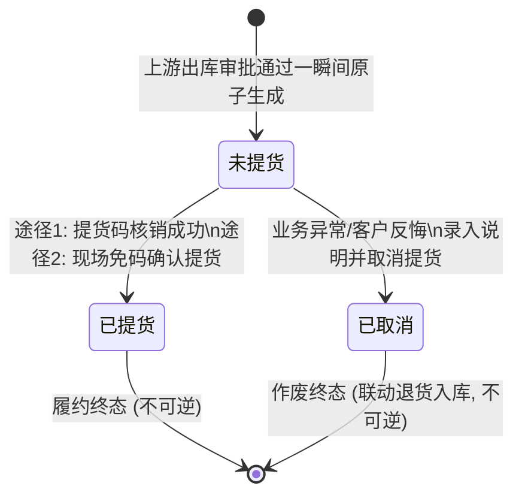

# 提货单业务规则规格

> **文档定位**：仓储 / 提货管理 / 提货单模块（单据生命周期、履约核销、逆向退货联动、操作记录审计、权限控制）所有业务逻辑与交互约束的唯一定义来源。字段定义与取值范围见 [提货单字段清单.md](./提货单字段清单.md)；业务场景见 [提货单主PRD.md](./提货单主PRD.md)。
>
> **业务真源与修改原则**：
> - 提货单是出库业务的最后履约与实物交付闭环，不提供任何手工新增或直接物理删除接口；
> - 涉及货权移交、凭证生成、动态码校验及退货库存回滚等核心逻辑，必须具备事务原子性与强审计留痕；
> - 严禁凭空臆造未在系统采集或核准截图中存在的规则。
>
> **版本**：V1.0 | 更新时间：2026-09-04

---

## 一、模块业务定位与单据状态机

### 1.1 模块业务边界与上下游关系

```mermaid
flowchart TD
    A[出库管理 / 出库申请\nP-CKG-010-ADD] -->|提交审批| B[审批中心 / 出库审核]
    B -->|审批驳回/撤回| C[出库流程终止 / 解锁库存]
    B -->|审批通过| D[原子事务处理]
    
    subgraph D [原子事务处理]
        D1[更新出库单状态为【已通过】]
        D2[扣减库存位置可用量与在库量]
        D3[生成全局唯一提货单流水]
    end

    D3 --> E[提货单处于【未提货】]
    
    E -->|通道 A: 4位提货码核销| F[输入核销码 + 现场拍照]
    E -->|通道 B: 免码确认提货| G[核对出库原图 + 现场拍照]
    
    F -->|核销成功| H[状态变为【已提货】\n原子回写出库单提货记录]
    G -->|确认成功| H

    E -->|异常终止: 取消提货| I[录入必填说明(0/50字)\n状态变为【已取消】]
    I -->|系统 Deep Link 携参跳转| J[退货入库申请页\n类型锁定【退货入库】]
    J -->|重新分配库位堆放清零| K[提交退货入库审批]
    K -->|终审通过| L[恢复原库存资产\n全流程逆向闭环]
```

### 1.2 提货单状态机（State Machine）

提货单系统内严格维护 3 种业务状态，状态转移严格单向，不可逆转：



| 状态编码 | 状态名称 | 状态定义说明 | 允许的操作 | 后续状态流转 |
| :--- | :--- | :--- | :--- | :--- |
| `UNPICKED` | **未提货** | 提货单已生成，货物已完成出库扣减，正等待提货人交接移交 | 查看详情、操作记录、核销提货码、确认提货、取消提货 | 可流转至 `PICKED` 或 `CANCELLED` |
| `PICKED` | **已提货** | 现场已完成实物移交，影像与履约凭证已回写出库详情 | 查看详情、操作记录；**核销/取消/确认提货置灰禁用** | 履约终态，禁止任何状态修改 |
| `CANCELLED` | **已取消** | 提货申请已被终止作废，已携参触发下游退货入库流程 | 查看详情、操作记录；**核销/取消/确认提货置灰禁用** | 作废终态，禁止二次激活提货 |

---

## 二、行操作与按钮状态矩阵（Button Matrix）

提货单列表行操作固定包含 5 个文字按钮，分三排或横向排列。根据当前单据状态及用户功能权限，按钮展示与禁用规则如下：

| 行操作按钮 | 对应权限点 | 【未提货】状态 | 【已提货】状态 | 【已取消】状态 | 点击触发行为 |
| :--- | :--- | :---: | :---: | :---: | :--- |
| **查看详情** | `详情` | **高亮可用** | **高亮可用** | **高亮可用** | 弹出【出库详情】模态弹窗（展示出库信息、出库明细、审核记录及提货记录） |
| **操作记录** | `操作记录` | **高亮可用** | **高亮可用** | **高亮可用** | 弹出【操作记录】时间轴弹窗（查看全生命周期事件审计流） |
| **核销提货码** | `提货码核销` | **高亮可用** | **置灰禁用 (不可点)** | **置灰禁用 (不可点)** | 进入 4 位动态核销码流转（未获取提示发送 / 已获取进入两步核销表单） |
| **确认提货** | `确认提货` | **高亮可用** | **置灰禁用 (不可点)** | **置灰禁用 (不可点)** | 弹出免码【确认提货】表单，核验出库现场照片，上传提货影像后直接完成 |
| **取消提货** | `取消提货` | **高亮可用** | **置灰禁用 (不可点)** | **置灰禁用 (不可点)** | 弹出【提示】二次确认弹窗，必填 0/50 字说明，确认后跳转【退货入库】 |

> **交互防护规则**：置灰按钮呈现浅灰色字体（`#C0C4CC`），鼠标悬浮展示禁止手势（`cursor: not-allowed`），点击不触发任何事件。

---

## 三、核心业务规则与逻辑规格（Rules Specification）

### R01：出库单终审原子生成提货单规则
1. **生成时机**：提货单**只能**在【普通出库】、【仓单出库】、【质押出库】、【抵押出库】四类出库单经审批中心终审通过的一瞬间由系统底层事务写入。
2. **幂等控制**：系统以 19 位出库单号作为幂等防重键。单笔出库单有且仅能生成 1 张提货单，严禁重复生成。
3. **数据继承**：货主类型、货主主体、出库类型、原关联单号、货物大类/品类/规格/数量、预留提货人（类型/姓名/手机号/身份证号）、出库现场照片等全量继承自出库申请，保证上下游账实严格一致。

### R02：列表【操作人】与【时间】字段固化规则
1. **【操作人】字段业务真源**：
   - 列表【操作人】列**始终展示上游出库申请的发起人（制单人）**，格式为 `姓名(所属公司全称)`；
   - 无论后续现场由谁执行了【核销提货码】、【确认提货】或【取消提货】，列表行上的【操作人】**绝不被覆盖改写**；实际执行提货的人员记录在【详情-提货记录】与【操作记录】中。
2. **【时间】字段业务真源**：
   - 列表【时间】列明确为**提货单生成时间戳**（即出库审批通过写入提货单表的服务端时刻，精确到秒 `YYYY-MM-DD HH:mm:ss`）；
   - 该时间不随后续提货动作变化，列表默认以此时间倒序排列。

### R03：提货人展示与企业 Hover 浮层规则
1. **个人提货人展示**：
   - 列表提货人列展示格式为：`提货人真实姓名(手机号脱敏)`，例如 `司观着(187****3888)`；
   - 个人提货人无【更多】按钮，不触发悬浮浮层。
2. **企业提货人展示与 Hover 规范**：
   - 当出库录入提货人类型为【企业】时，列表提货人列展示经办人信息：`经办人姓名(手机号脱敏)经办人`，并在下方展示橙色文字 **【更多】**；
   - 鼠标悬浮（Hover）在【更多】或该区域时，唤出 Popover 气泡浮层（定位在右上方或正下方，不得遮挡文字），浮层展示两行内容：
     - 第一行：`企业名称：{企业全称}`
     - 第二行：`企业标识：{18位统一社会信用代码}`
   - 鼠标移开后浮层平滑消失。

### R04：正向履约通道 A —— 4位提货码动态核销规则
1. **初次获取前置校验与懒加载机制**：
   - 提货单刚生成时，系统默认不自动向提货人发送短信，避免无效短信消耗；
   - 用户首次点击行操作【核销提货码】时，系统判定核销码状态为 `未获取`：
     - 弹出提示弹窗：标题 `提货码核销`，内容 `当前未获取提货码，确认发送提货核销码`；
     - 提示说明：`核销码发送后7日内有效，请在有效期及时核销，超过有效期请重置提货码。`；
     - 点击【确定】：调用短信网关向提货人手机号发送 4 位纯数字核销码，在【操作记录】增加 `获取提货码` 节点，单据核销码状态变迁为 `已获取`；
     - 点击【取消】：关闭弹窗，不产生任何动作。
2. **两步走核销流转（已获取状态）**：
   - 当单据核销码为 `已获取` 状态时，点击【核销提货码】直接进入第一步信息录入弹窗：
     - **第一步：履约信息录入**：
       - `*是否本人提货`：必选单选 Radio（`○ 是   ○ 否`）；
       - `*提货照片`：必传图片上传控件，支持 `jpg/png/jpeg`，单张 ≤ 5M；未上传照片阻断进入下一步；
       - `其他说明`：选填多行文本输入，限制 50 字符；
       - 左下角操作：提供 **【重置提货码】** 按钮；点击呼出二次确认弹窗，确认后重新生成 4 位动态码重置 7 天有效期，并记录 `重置提货码` 操作记录；
       - 右下角操作：点击 **【下一步】**，校验必填项通过后切换至第二步。
     - **第二步：4 位 PIN 码格输入与核销确认**：
       - 弹窗呈现 4 个独立的方框输入格；
       - 打开自动聚焦至第 1 格；键入数字后光标自动跳转至下一格；支持 Backspace 退格回退；
       - 点击【上一步】：返回第一步，保留已选单选、已传图片和说明；
       - 点击【确认核销】：
         - 系统校验输入的 4 位码是否与当前单据有效码一致；
         - 校验是否超过 7 天有效期；若过期提示 `核销码已过期，请重置提货码`；
         - 若匹配失败提示 `提货码错误，请重新输入`；
         - 校验通过后，提货单变迁为【已提货】，数据原子回写出库单详情，操作记录沉淀 `核销提货码` 节点。

### R05：正向履约通道 B —— 免码现场直接确认提货规则
1. **适用场景**：提货现场因手机信号不佳、老人机无法接收短信或现场监管员直接当面核验交付的免码业务场景。
2. **表单字段与只读约束**：
   - 弹窗标题：`确认提货`；
   - **提货时间**：展示当前系统时间（只读/带出）；
   - **是否本人提货**：单选 Radio（`⦿ 是   ○ 否`），默认选中【是】；
     - **核心防篡改约束**：无论切换为【是】还是【否】，下方的提货人类型、姓名、身份证号、电话**均保持灰底只读带出，严禁现场修改**；切换选项仅用于登记交接凭据；
   - **其他说明**：选填多行文本域，严格限制 **0/50** 字；
   - **`*` 提货照片（必填）**：支持上传最多 10 张实物交接照片；
   - **车牌号**：选填输入框，支持录入或修改；
   - **现场图片（原出库比对）**：系统只读回显原出库申请时上传的货物现场照片，供提货现场监管人员比对品相、包装、规格，防止出借或调包风险。
3. **提交与完成**：
   - 点击底部通栏按钮【确认提货】，校验必填照片与说明长度；
   - 提交成功后提货单置为【已提货】，操作记录新增 `确认提货` 节点，提货记录回显出库详情。

### R06：逆向作废与跨模块【退货入库】联动规则
1. **取消提货触发与前置校验**：
   - 仅【未提货】状态的提货单允许点击【取消提货】；
   - 点击弹出二次确认提示弹窗，加粗提示：`您正在操作取消货主{货主名称}的提货申请操作，取消后提货申请将无法操作提货且无法恢复，请慎重操作！`；
   - 强校验录入项：**`* 说明：`（必填，0/50字）**；未填写说明点击【前往退货入库】予以阻断。
2. **单据状态变迁与操作记录**：
   - 确认取消后，当前提货单状态立刻置为 **【已取消】**；
   - 操作记录沉淀 `取消提货` 节点，记录操作人及填写的取消说明。
3. **跨模块 Deep Link 携参跳转至退货入库**：
   - 点击【前往退货入库】后，系统自动携参跳转至入库管理模块新增入库页（`P-CKG-009-ADD`）；
   - **上下文自动带出并锁定**：
     - `入库日期`：自动填充当前操作时间；
     - `货主类型`、`货主名称`、`货主标识`、`身份证号`：原值带出并只读锁定；
     - `入库类型`：下拉框强行锁定为 **`退货入库`**，禁止手工改选；
     - `关联单号`：自动填入原出库单号（19 位），只读锁定；
     - `货品明细`：大类、品类、规格由原出库/提货单带出；**退货数量不得超过对应提货单明细数量**，超出强阻断；
   - **库位分配与未堆放清零（继承入库 R13 强阻断）**：
     - 初始标注红色文字：`未堆放数量: X.XXXX`（等于待退回总量）；
     - 现场人员必须选择入库仓库、库房、分区并【添加位置】分配堆放数量；
     - 各位置堆放量之和须等于退货总量且不超过提货单数量；未堆放数量未清零强行阻断提交审核；
   - **审批与库存恢复**：现场人员上传退货现场照片后点击【提交审核】，退货入库单流转至审批中心，终审通过后恢复在库可用库存。

### R07：出库详情弹窗复用与提货记录回写规则
1. **组件复用规范**：
   - 点击提货单行操作【查看详情】，系统直接调起上游【出库详情】弹窗，标题展示为 `出库详情`；
   - 顶部展示 19 位出库单号（带复制图标）与绿色【已通过】印章。
2. **【提货记录】动态展示规则**：
   - **未提货状态**：详情中间保留【提货记录】区块，内容居中展示为灰字空态：**`暂无提货记录`**；
   - **已提货状态**：区块内完整展示履约回写凭据：
     - 操作人：执行提货核销或免码确认的操作账号全称；
     - 提货时间：提货完成的服务端时间戳；
     - 本人提货：展示为 `是(提货人姓名:xxx)` 或 `否`；
     - 其他说明：提货时录入的说明内容（无值展示 `--`）；
     - 现场照片：提货现场上传的实物照片，支持缩略图预览与点击放大；
     - 设备抓拍图：IoT 摄像头抓拍结果，无设备或失败展示 `抓图失败/无监控设备`。
3. **明细分流结构**：
   - 普通出库：出库明细采用一级货品主行折叠展开二级库存位置（仓库-库房-分区-条码-数量）；
   - 抵押/质押/仓单出库：基础信息展示关联单号及【查看】链接，明细采用平铺表格展示出库前数量与出库后数量。

### R08：操作记录全生命周期审计规则
1. **弹窗规格**：点击【操作记录】弹出时间轴弹窗，时间轴按时间**从上到下倒序**排列（最新发生的动作在最顶部）。
2. **全事件类型字典表**：
   | 事件标识 | 节点标题 | 触发时机 | 记录字段内容 |
   | :--- | :--- | :--- | :--- |
   | `GENERATE` | **提货单生成** | 出库审批通过系统自动生成 | 时间戳（无操作人） |
   | `FETCH_CODE` | **获取提货码** | 首次点击核销并确认发送动态码 | 时间戳 + 操作人账号机构 |
   | `RESET_CODE` | **重置提货码** | 点击重置提货码并确认刷新 | 时间戳 + 操作人账号机构 |
   | `DIRECT_PICK` | **确认提货** | 免码模式直接完成提货 | 时间戳 + 操作人账号机构 |
   | `VERIFY_CODE` | **核销提货码** | 输入 4 位 PIN 码校验通过 | 时间戳 + 操作人账号机构 |
   | `CANCEL_PICK` | **取消提货** | 点击取消提货并提交说明 | 时间戳 + 操作人账号机构 + **说明内容** |
3. **法律效力约束**：所有操作记录在单据落库时写入独立审计表，禁止物理删除或二次改写。

---

## 四、数据权限与 RBAC 矩阵

| 角色代码 | 角色名称 | 可视数据范围 | 允许的操作权限 |
| :--- | :--- | :--- | :--- |
| `R-SYS-ADMIN` | 系统超级管理员 | 全平台租户与全部仓库提货单 | 查看页面、详情、操作记录 |
| `R-WMS-OPERATOR` | 仓库监管员 / 操作员 | 当前账号有权限的管辖仓库提货单 | 查看页面、详情、取消提货、重置提货码、提货码核销、操作记录、确认提货 |
| `R-WMS-MANAGER` | 仓储主管 | 负责仓库的全部提货单 | 查看页面、详情、取消提货、重置提货码、提货码核销、操作记录、确认提货 |
| `R-FIN-AUDITOR` | 资方风控审核员 | 所属资金方在押/关联的提货单 | 查看页面、详情、操作记录（只读审计） |

> **数据隔离规则**：列表仅拉取当前登录操作员被授权的监管仓库关联的提货单数据；越权单据在列表不可见，通过 URL 强行传参访问接口返回 `403 Forbidden`。

---

## 修订记录

| 日期 | 版本 | 变更内容说明 | 影响范围 | 修订人 |
| :--- | :--- | :--- | :--- | :--- |
| 2026-09-04 | **V1.0** | **建立提货单最新基准版业务规则规格**：<br/>1. 确立状态机（未提货/已提货/已取消）及操作置灰矩阵；<br/>2. 规范 R01 原子生成与 R02 操作人/时间字段固化业务真源；<br/>3. 固化 R04 两步 4 位 PIN 码核销与 7 天有效期规则；<br/>4. 固化 R05 免码提货本人提货只读继承与原出库实物比对规范；<br/>5. 闭环 R06 取消提货联动退货入库全链路逻辑；<br/>6. 固化 R08 六大事件操作记录倒序时间轴字典。 | 全模块 | AI PM / 森云科技 |
| 2026-09-04 | **V1.1** | **退货入库链路口径统一**：<br/>1. R06 明确取消提货为退货入库唯一入口，移除「请前往退货单」文案；<br/>2. 补充退货数量不得超过提货单数量的强校验；<br/>3. 关联单号统一为原出库单号，对齐入库 R04e。 | R06 逆向闭环 | AI PM / 森云科技 |
