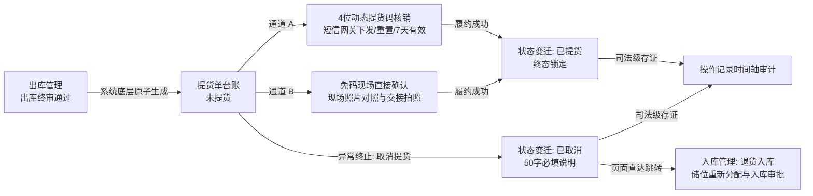

# 提货单主PRD

> **模块定位**：仓储业务层核心履约交付单据，规范存货出库终审通过后大宗商品实物离开监管仓库的交接核销流程，支持 4 位动态提货码核销与现场免码直接确认双通道履约、取消提货逆向跨模块联动【退货入库】及司法级全过程时间轴存证。  
> **版本**：V1.2 | 更新时间：2026-09-16 | 责任人：森云科技（Senyun Technology）  
> **编写依据**：[提货单字段清单.md](./提货单字段清单.md) 是本模块所有字段定义、枚举与页面展示的唯一基准；[提货单业务规则规格.md](./提货单业务规则规格.md) 是本模块状态机、核销时效、逆向退货与并发控制的唯一定义来源；[提货单_ASCII_列表页.md](./提货单_ASCII_列表页.md) 是列表页交互线框的唯一定义来源。

---

## 1. 业务背景与业务痛点

### 1.1 业务背景
在供应链金融与仓储监管业务中，“出库”代表货权在财务和风控层面的解押与审批核准，而“提货”则是**大宗商品实物离开监管仓库、真正转移至客户或承运人手中的法律交接环节**。

### 1.2 核心业务痛点
1. **防冒领与身份穿透难**：仅凭一张纸质提货单容易被伪造，司机或提货人身份无法实时比对，存在冒领与货权被盗风险；
2. **缺乏动态交付凭据**：传统固定密码容易泄露，缺乏有效期的动态提货凭证；
3. **退货流转脱节**：现场由于车辆装载超载、货物外观破损或客户临时反悔等原因放弃提货时，出库单已扣减库存，缺少规范的“取消提货联动退货入库”闭环，导致现场账实不符与库存资产悬空；
4. **全过程审计缺失**：提货交接时的现场照片、是否本人提货、核销码下发与重置记录未实现司法级不可变存证。

---

## 2. 功能范围

| 包含功能范围 | 不包含功能范围 |
| :--- | :--- |
| - 列表多维检索（货主、提货人、状态）与 9 列展示； - 上游出库终审通过后系统底层原子自动生成提货单（初始为未提货）； - 履约通道 A：4 位动态提货码核销（短信下发、7 天时效、重置提货码、本人确认、照片必传、4 位独立个人识别密码 PIN 码格）； - 履约通道 B：免码现场直接确认提货（当前提货时间、本人确认、车牌号、原出库照片只读对照、现场拍照必传）； - 逆向取消提货与跨模块联动退货入库（必填 50 字说明、终态作废、页面直达跳转携参跳转【退货入库】）； - 提货详情回显与全过程 6 大事件时间轴操作记录审计。 | - 手工新建提货单（严禁手工新增，由出库终审自动生成）； - 物理删除与反作废（已提货与已取消单据为不可逆终态）； - 筛选区重置按钮（遵循系统统一规范）； - 转让/移库/加工类出库生成提货单（转让、移库与加工出库在各自模块闭环，不进入提货单台账）。 |

---

## 3. 模块定位与系统链路

---

## 4. 业务场景

### 场景 1【大宗货权出库终审自动生成提货单】(S01)
* **业务主体**：资方风控经理、仓库监管员
* **业务情境**：某电解铜质押订单由借款企业完成还款解押，业务经理在出库管理发起质押出库申请并经风控审批通过。
* **业务行为**：审批通过一瞬间，系统底层原子更新出库单为【已通过】并扣减可用库存，同时系统自动生成 1 张提货单，状态初始为【未提货】。
* **业务结果**：提货单列表中立即展示该单据，操作人显示为出库制单人，时间显示为生成时间，为现场交接做好准备。

### 场景 2【司机现场出示短信4位码核销提货】(S02)
* **业务主体**：提货司机、仓库监管员
* **业务情境**：司机开货车到达生鲜冷库提货，监管员在系统列表找到对应提货单，点击【核销提货码】。
* **业务行为**：系统检测到未下发过提货码，弹出提示确认框；监管员点击确定，司机手机立即收到 4 位核销码短信。监管员在第一步勾选“是本人提货”，现场拍摄司机与货车、交接单的照片并上传，点击下一步。司机报出 4 位数字，监管员在 4 个方框格中依次输入并点击【确认核销】。
* **业务结果**：系统秒级核验通过，提示提货成功，提货单变迁为【已提货】，行操作按钮自动置灰锁定。

### 场景 3【提货码超过7天失效现场一键重置】(S03)
* **业务主体**：提货人、仓库监管员
* **业务情境**：提货人因车辆调配延误，在出库单通过后第 8 天才到现场提货，之前的核销码已超过 7 天时效。
* **业务行为**：监管员点击【核销提货码】进入第一步录入页，点击左下角【重置提货码】，在二次确认弹窗中点击确定。系统立即重新生成 4 位有效码并重发短信给提货人，时效重新倒计时 7 天。
* **业务结果**：监管员与提货人使用新码顺利完成提货核销，操作记录中清晰记录了“重置提货码”的经办人与时间。

### 场景 4【冷库偏远无信号采用免码通道确认提货】(S04)
* **业务主体**：偏远仓库监管员、承运司机
* **业务情境**：由于冷库库区地下网络信号屏蔽，司机手机无法接收短信。
* **业务行为**：监管员直接在列表点击【确认提货】。弹窗中显示出库时拍摄的实物外观原图，监管员核对货物包装与数量无误；监管员勾选“是本人提货”（提货人姓名与身份证号系统锁定灰显无法篡改），填入司机车牌号，拍摄现场装车照片（最多传10张），点击底部【确认提货】按钮。
* **业务结果**：单据顺利完成提货闭环，避免了因短信通道故障导致现场压车停摆。

### 场景 5【货物受损客户拒提取消提货并全自动退货入库】(S05)
* **业务主体**：货主经办人、仓库现场监管员
* **业务情境**：提货人在现场验货时，发现其中一批西瓜在存放过程中发生挤压破损，拒绝提货，要求全量撤销出库退回库存。
* **业务行为**：监管员在列表行点击【取消提货】，在弹窗中录入取消说明 `“西瓜外包装挤压破损严重，货主现场拒提申请退回”`（限制50字以内），点击【前往退货入库】。
* **业务结果**：提货单作废变为【已取消】；系统自动携带原货主、原业务单号、货物规格与数量跳转至退货入库发起页，入库类型锁定为退货入库；监管员现场重新指定堆放库位，清零未堆放数量并上传现场照片后提交退货入库审批，审批通过后原库存自动加回。

### 场景 6【企业提货人多层级身份穿透审计】(S06)
* **业务主体**：银行外派监库风控员
* **业务情境**：银行审计员调阅一笔大宗钢材提货单，需确认现场提货人是否具备法人授权资质。
* **业务行为**：审计员在提货单列表查看【提货人】列，展示为 `经办人姓名(手机号脱敏)经办人`；审计员将鼠标悬浮在下方的橙色【更多】上，系统平滑弹出气泡浮层，清晰展示其所属企业全称与企业统一社会信用代码。
* **业务结果**：审计员点击【操作记录】，查阅自提货单生成、短信获取到现场核销的全流程时间轴，完成风控穿透审计。

---

## 5. 功能模块详细规格

### 5.1 提货单列表查询页（P-CKG-015）
1. **页面布局**：
   - 顶部提供 3 项筛选条件（货主名称/标识、提货人、状态）与【查询】按钮，单行水平排列；
   - 筛选区不设【重置】按钮；
   - 列表主体采用 9 列紧凑排版，支持多行货物自适应展示；
   - 底栏固定展示 `共 xxx 条`、`10条/页` 下拉、翻页按钮及 `前往 x 页` 跳转框。
2. **列表行操作状态受控逻辑**：
   - 【未提货】：查看详情、操作记录、核销提货码、取消提货、确认提货全部可操作；
   - 【已提货】：查看详情、操作记录可用；核销提货码、取消提货、确认提货置灰禁用；
   - 【已取消】：查看详情、操作记录可用；核销提货码、取消提货、确认提货置灰禁用。

### 5.2 出库详情弹窗（P-CKG-010-DETAIL）
1. **弹窗结构**：
   - 标题：`出库详情`，右上角 `×` 关闭；
   - 顶部展示出库单号、复制图标及绿色【已通过】印章；
   - 上部为单据基础信息（含出库录入的提货人预期信息及出库现场照片）；
   - 中部为【提货记录】板块：
     - 未提货单据居中显示灰字 `暂无提货记录`；
     - 已提货单据展示提货操作人、提货时间、本人提货凭证、说明、提货照片、设备抓拍图；
   - 下部双标签页：【出库明细】与【审核记录】。

### 5.3 4 位动态码核销两步弹窗
1. **第一步（履约信息录入）**：
   - 是否本人提货（单选框，必填）；
   - 提货照片（`+ 上传` 虚线框，必填，限制 ≤ 5M）；
   - 其他说明（多行文本输入框，选填，限制 50 字符）；
   - 左下角【重置提货码】按钮，右下角【下一步】按钮。
2. **第二步（4 位 PIN 码输入格）**：
   - 4 个等距排列的方框数字输入格；
   - 聚焦高亮光标，输入自动跳转，退格回退；
   - 左下角【上一步】按钮，右下角【确认核销】金色按钮。

### 5.4 免码确认提货弹窗
1. **字段排布**：
   - 提货时间（系统当前时间带时钟图标，只读）；
   - 是否本人提货（单选框：是/否，默认是；选否时下方提货人信息依然锁定只读，不可修改）；
   - 其他说明（0/50 字限制计数器）；
   - 提货照片（必填上传，最多 10 张，jpg/png/jpeg，≤ 5M）；
   - 提货人类型、姓名、身份证号、电话（灰底只读带出）；
   - 车牌号（选填单行文本输入框）；
   - 原出库现场照片（只读展示，对照参考）；
   - 底部通栏金色实心按钮【确认提货】。

### 5.5 取消提货提示与退货入库跳转
1. **提示弹窗**：
   - 弹窗标题：`提示`；
   - 警示文案：`您正在操作取消货主{货主名称}的提货申请操作，取消后提货申请将无法操作提货且无法恢复，请慎重操作！`；
   - 必填项：`* 说明：`（多行文本输入框，带 `0/50` 字数统计）；
   - 底部按钮：【取消】与【前往退货入库】。
2. **退货入库页承接**：
   - 锁定类型为 `退货入库`；
   - 自动回填货主、原出库单号（关联单号）、货品规格与数量上限；
   - 现场【添加位置】分配库位，堆放量不得超过提货单数量，未堆放数量清零后提交审批。

### 5.6 操作记录时间轴弹窗
1. **展示规范**：
   - 弹窗标题：`操作记录`，底栏居中【关闭】按钮；
   - 从上到下按时间倒序排列；
   - 涵盖 6 大事件节点，最新事件位于顶部。

---

## 6. 核心业务规则索引

| 规则编码 | 规则名称 | 核心口径摘要 | 唯一定义来源 |
| :--- | :--- | :--- | :--- |
| **R01** | 【出库单终审原子生成提货单】 | 上游出库终审通过时底层原子写入提货单流水，出库单号为唯一幂等键 | [业务规则规格 §三](./提货单业务规则规格.md#出库单终审原子生成提货单r01) |
| **R02** | 【列表操作人与时间字段固化】 | 操作人列固化出库制单人，时间列固化单据生成时刻，不被提货操作覆盖 | [业务规则规格 §三](./提货单业务规则规格.md#列表操作人与时间字段固化r02) |
| **R03** | 【提货人展示与企业悬停浮层】 | 个人提货人脱敏展示；企业提货人展示经办人及【更多】，悬停气泡浮层展示企业信息 | [业务规则规格 §三](./提货单业务规则规格.md#提货人展示与企业悬停浮层r03) |
| **R04** | 【正向履约通道A-4位提货码动态核销】 | 首次点击发送短信，7天有效；支持一键重置；录入本人提货及照片后输入4位PIN格核销 | [业务规则规格 §三](./提货单业务规则规格.md#正向履约通道a-4位提货码动态核销r04) |
| **R05** | 【正向履约通道B-免码现场直接确认提货】 | 弱网免码兜底；本人提货字段只读防篡改；现场拍照必填，支持比对出库实物原图 | [业务规则规格 §三](./提货单业务规则规格.md#正向履约通道b-免码现场直接确认提货r05) |
| **R06** | 【逆向作废与跨模块退货入库联动】 | 必填50字说明，状态置为已取消；页面直达跳转入库页锁定退货入库，清零未堆放数量 | [业务规则规格 §三](./提货单业务规则规格.md#逆向作废与跨模块退货入库联动r06) |
| **R07** | 【出库详情弹窗复用与提货记录回写】 | 复用出库详情模态弹窗；未提货展示暂无记录，已提货展示核销人、时间、照片凭据 | [业务规则规格 §三](./提货单业务规则规格.md#出库详情弹窗复用与提货记录回写r07) |
| **R08** | 【操作记录全生命周期审计】 | 倒序时间轴弹窗展示生成、获取码、重置码、核销、免码确认、取消等6大事件不可变存证 | [业务规则规格 §三](./提货单业务规则规格.md#操作记录全生命周期审计r08) |

---

## 7. 非功能性需求与风控安全

1. **强事务一致性与防并发控制**：
   - 同一笔提货单在现场核销或确认提货时，服务端施加分布式行级排他锁（Redis Lock），防止多位监管员同时点击造成重复核销；
   - 提货完成与出库详情提货记录回写必须处于同一本地数据库事务。
2. **短信网关安全与防刷机制**：
   - 4 位动态提货码由加密随机数生成器产生；
   - 同一手机号在 1 分钟内限制发送 1 条，同一提货单 24 小时内最多允许重置 5 次提货码，防止短信被恶意刷取。
3. **敏感信息全链路安全合规**：
   - 提货人身份证号、手机号在列表及传输层强制实施脱敏；
   - 现场上传的照片通过私有云对象存储（OSS）存储，下载与预览必须通过临时鉴权签名 URL（有效期 ≤ 10 分钟）。
4. **全审计日志不可篡改**：
   - 取消提货理由、核销操作人账号、操作 IP 及终端环境全量计入日志服务，作为供应链金融业务的法定审计依据。

---

## 修订记录

| 日期 | 版本 | 变更内容说明 | 影响范围 | 修订人 |
| :--- | :--- | :--- | :--- | :--- |
| 2026-09-04 | V1.0 | **建立提货单最新基准版主 PRD 功能规格说明书**： 1. 规范模块定位、包含/不包含范围及风控设计目标； 2. 构建包含出库生成、动态码核销、免码直接确认及退货入库逆向闭环的端到端时序架构； 3. 输出 S01~S06 全量业务故事与六大界面功能规格； 4. 明确防并发锁、短信防刷及敏感信息脱敏等风控安全约束。 | 全模块 | AI PM / 森云科技 |
| 2026-09-16 | **V1.2** | **场景编号语义自解释化、规则索引表补齐与交互术语汉化升级**： 1. 场景编号改造为 `场景 N【业务场景名称】(Sxx)`； 2. 补齐 §6 核心业务规则索引表（R01~R08）； 3. 日常交互词汇全面汉化（Deep Link $\rightarrow$ 页面直达跳转、Radio $\rightarrow$ 单选框、Textarea $\rightarrow$ 多行文本输入框、Tab $\rightarrow$ 标签页、In/Out of Scope $\rightarrow$ 包含/不包含功能范围）。 | 全文规格与索引 | AI PM / 森云科技 |
