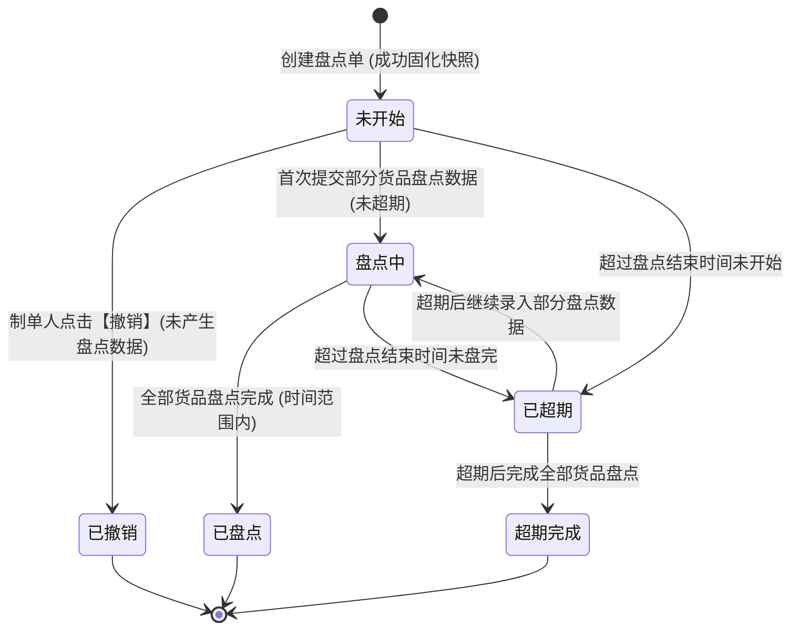

# 货物盘点 业务规则规格

> **文档定位**：仓储 / 货物盘点模块状态机、数据权限控制、双盘点模式流转、双颗粒度类型规则、货品锁定与快照机制、异常判别算法、异常解除闭环及报告存证导出的**唯一定义来源**。主 PRD、字段清单及端侧 ASCII 线框只引用本文件规则编号（R01~R25、C01~C04），不重复定义规则本体。
>
> **模块类型**：仓储执行与风控核查核心单据（包含盘点任务创建、盘点录入执行、实物异常闭环核销及存证审计台账）
>
> **参考文档**：[《货物盘点字段清单》](./货物盘点字段清单.md)、[《货物盘点主PRD》](./货物盘点主PRD.md)、[《01-库存查询-存货管理》](../01-库存查询-存货管理/)、[《03-库存查询-库存明细》](../03-库存查询-库存明细/)、[《09-入库管理-入库记录》](../09-入库管理-入库记录/)
>
> **版本**：V1.0 | **更新时间**：2026-09-10 | **责任人**：森云科技（Senyun Technology）

---

## 一、单据与能力定位

| 项目 | 内容 |
| :--- | :--- |
| **单据层级** | **【第2层-订单/执行控制层】**（仓储核心监管核验单据 —— 货物盘点管理单据） |
| **核心职责** | 针对监管仓库内的实物存货实施定期或动态核查，支持宏观“账面汇总盘点”与微观“库存明细盘点”，验证“货在、货好、位对、数准”，发现并核销盘点异常，生成不可篡改的盘点报告（PDF）与明细台账，保障资金方、监管方与货主对底层实物资产真实性的强穿透。 |
| **盘点组织形式** | **双模式组合**： 1. **单人独立盘点**：仅限指派 1 名系统启用账号独立承接并录入盘点数据； 2. **多人协作盘点**：可指派多名系统启用账号协同盘点，各自录入分量数据；若对同一货物存在重复核验，系统**以最后一次提交的盘点结果为准**。 |
| **核查颗粒度** | **双类型组合**： 1. **账面汇总盘点**：按货物名称维度全仓聚合计算总数量，忽略货主主体与质押货权状态，适用于财务对账与宏观核验； 2. **库存明细盘点**：逐件穿透到每一笔存货条码、货主、库房、分区及货品状态，适用于现场巡库、抵质押物核对与安全审计。 |
| **数据源与前置依赖** | **仓库档案**：实体监管仓库、库房及分区档案； **存货中心**：在库实物存货主档、批次库存、可用数量与冻结数量； **条码中心**：存货唯一条码与二维码； **系统用户**：当前租户下启用的操作员账号。 |
| **下游业务影响** | **盘点快照与业务锁**：盘点中的货物受到业务锁保护，若在盘点执行期发生出入库等异动，系统在提交时触发数量一致性保护校验； **异常联动**：盘点产生的 4 大异常项作为预警中心及风险公示的底层事实输入； **司法存证**：提供原样快照的《货物盘点报告》（PDF）与历史记录时间轴留痕。 |

---

## 二、数据权限控制规则（取并集机制）

### R01: 盘点任务可见与可操作权限判定（并集模型）
系统针对货物盘点单（包含列表查看、详情查看、盘点执行、单据撤销、异常解除等）的数据权限，严格采用**取并集（Union）**逻辑进行判定。用户只要满足以下三项条件之一，即可视为拥有该盘点任务的数据权限：

$$
\text{HasAccess}(U, T) \iff \Big( U \in \text{PermittedWarehouseUsers}(T.\text{warehouse\_id}) \Big) \lor \Big( U \in T.\text{assigned\_users} \Big) \lor \Big( U = T.\text{creator\_id} \Big)
$$

1. **条件一（仓库管辖权）**：当前登录用户 $U$ 基于其组织架构角色与权限分配，对该盘点单所在的实体监管仓库拥有合法的数据查看/管辖权限；
2. **条件二（任务指派人员）**：在创建该盘点任务时，$U$ 被勾选列入了“计划盘点人员”名单中（即使该用户没有该仓库全局权限，一旦被指派参与此项任务，即穿透赋予该盘点任务的查看与执行盘点权限）；
3. **条件三（制单人/创建人）**：$U$ 是该盘点任务的创建发起人（制单人），必然拥有查看自己所创盘点任务的完整权限。

---

## 三、单据状态机与流转规则

### 3.1 状态定义

| 状态名称 | 状态编码 (`Enum`) | 业务含义 | 是否终态 | 列表操作权限 | 状态流转触发条件 |
| :--- | :--- | :--- | :---: | :--- | :--- |
| **未开始** | `PENDING_START` | 盘点单已创建成功，但尚未有任何盘点数据被提交产生 | 否 | 【详情】、**【盘点】**、**【撤销】**（仅创建人可见） | 任务创建成功初始状态 |
| **盘点中** | `IN_PROGRESS` | 用户已在 PC 或移动端录入并提交了部分货品盘点数据，但尚未完成全部货品的盘点 | 否 | 【详情】、**【盘点】**（不可撤销） | 首次提交任意货品盘点数据时自动切入 |
| **已盘点** | `COMPLETED` | 在任务指定的盘点时间范围内（$\text{实际完成时间} \le \text{盘点结束时间}$），单据内全部货品均完成盘点 | **是** | 【详情】 | 任务范围结束前，全部货品盘点完成 |
| **已超期** | `EXPIRED` | 超过了任务指定的盘点结束时间（$\text{当前时间} > \text{盘点结束时间}$），且单据仍处于“未开始”或“盘点中” | 否 | 【详情】、**【盘点】**（允许超期盘点） | 定时调度系统检测超期自动打标 |
| **已撤销** | `REVOKED` | 盘点任务在“未开始”状态下，由制单人（创建人）主动撤销终止 | **是** | 【详情】 | 制单人在操作列或待盘点页点击【撤销】并二次确认 |
| **超期完成** | `EXPIRED_COMPLETED` | 任务在“已超期”状态下，用户继续执行超期盘点并将所有货品全部盘点完成 | **是** | 【详情】 | 已超期任务完成最后一条货品盘点提交 |

### 3.2 状态流转状态机

### 3.3 动作与按钮权限矩阵 (R02)

| 页面 / 区域 | 按钮/动作 | 前置条件与拦截约束 | 权限控制 |
| :--- | :--- | :--- | :--- |
| **列表页** | 【详情】 | 无前置条件，任何状态均可点击 | 具备任务数据权限的用户（取并集） |
| **列表页 / 详情页** | **【盘点】** | 盘点状态必须为 **【未开始】**、**【盘点中】** 或 **【已超期】**（**明确允许超期盘点**） | 操作人必须在“计划盘点人员”名单中，或具备仓库监管员执行权限 |
| **列表页 / 待盘点页** | **【撤销】** | 1. 状态必须为 **【未开始】**（一旦产生盘点数据或进入盘点中，直接不展示【撤销】）； 2. 弹出二次确认弹窗：“确定要撤销盘点单？” | **严格限定仅制单人（创建人）本人**可见并可操作 |
| **新增成功弹窗** | **【去盘点】** | 提交创建后系统实时校验：当前操作人是否具备可盘点权限（即当前用户是否包含在计划盘点人员名单内）。若有则展示【去盘点】，点击直接进入待盘点页；若无则隐藏，仅展示【返回盘点单列表】 | 计划盘点人员鉴权 |
| **详情页** | **【解除异常】** | 1. 该货品明细行盘点异常状态为 **【待处理】**； 2. 弹出解除异常弹窗，**处理说明为必填项**（1~200 字） | 仓库监管主管 / 风控管理员角色 |
| **库存明细详情页** | **【生成报告】** | 仅库存明细盘点类型详情页提供；将当前单据所有概况、看板率及明细生成为 PDF 报告 | 具备该单据详情权限的所有用户 |
| **库存明细详情页** | **【导出记录】** | 打开【下载记录】弹窗，支持下载已生成的盘点报告或清单文件 | 具备该单据详情权限的所有用户 |

---

## 四、新增盘点任务业务规则

### R03: 基础信息录入与校验
1. **盘点单号自增规范**：格式固定为 `PD + YYYYMMDD + 6位流水号`（例如 `PD20260403000001`），系统后台自动发号，全局唯一且不可修改；
2. **任务名称默认生成与编辑**：默认格式为“`YYYY-MM-DD HH:mm:ss-创建人-创建的盘点单`”，文本输入框最大长度 40 字符，支持用户自定义覆盖；
3. **盘点时间范围逻辑校验**：
   - 盘点开始时间与盘点结束时间必填；
   - **时间顺序约束**：若盘点开始时间晚于盘点结束时间，前端即时红字提示并强阻断提交；
   - 系统保存时将开始时间补齐为当日 `00:00:00`，结束时间补齐为当日 `23:59:59`；
4. **盘点模式与计划人员约束**：
   - 选择【单人独立盘点】时，计划盘点人员选择器**仅允许选择 1 人**；
   - 选择【多人协作盘点】时，计划盘点人员选择器支持多选多人；
   - 人员选择器仅能列出当前企业下账号状态为“启用”的用户；
5. **附件与备注**：
   - 附件非必填，仅支持 `jpg, png, jpeg` 格式，最多上传 20 张；
   - 备注信息非必填，最大限制 500 个汉字/字符（`0/500` 计数器动态校验）。

### R04: 盘点仓库锁定与级联数据隔离
1. **单一仓库强约束**：一次盘点任务仅允许选择 1 个监管仓库，禁止跨仓库混合制单；
2. **切换仓库二次确认与数据清空**：
   - 当用户在已添加货品明细的情况下修改已选的“盘点仓库”时，系统强制弹出二次确认弹窗：
     > “更改仓库将清空下方已选货品明细，是否确认修改？”
   - 用户确认修改后，自动清空下方“货品明细”表格中已添加的全部数据；若用户取消，则恢复原仓库选项；
3. **添加弹窗数据源仓库硬绑定**：在点击【添加货品】呼出的弹窗中，无论账面汇总还是库存明细，数据源默认且强制锁定在主表所选仓库下。

### R05: 添加货品弹窗与两类模式差异处理
1. **账面汇总模式（宏观合并维度）**：
   - 弹窗不展示“库房”与“分区”筛选（全仓按货品规格聚合）；
   - 搜索条件：`货品名称` 下拉选择 +【查询】；
   - 列表展示：`序号`、`货物名称`（大类-品类-规格）、`单位`、`本批次数量`（全仓总数）；
   - 勾选机制：支持翻页记忆勾选、全选；点击【确定】后追加至主表明细，主表按所选货品规格汇总。
2. **库存明细模式（微观条码/库位维度）**：
   - 弹窗支持细化到库位与状态的组合检索；
   - 搜索条件：`货品名称`（下拉单选）、`货主名称/标识`（文本输入）、`货品状态`（下拉单选）、`仓库名称`（级联下拉：`库房+分区`，仓库已被主表锁定）；
   - 列表展示：`序号`、`货主`、`货物名称`、`库存总数`（计算公式：`库存总数 = 可用数量 + 冻结数量`）、`仓库`、`库房`、`分区`、`货品状态`、`存货条码`；
   - 点击【确定】后，弹窗中的 `库存总数` 映射写入主表“货品明细”表格的 `本次数量` 列。
3. **空状态与至少一条约束**：
   - 初始进入新增页，货品明细区域为空，展示占位引导文案：“请点击右上方添加按钮选择盘点货品”；
   - 点击【提交】时，若货品明细为空（0 条数据），系统阻断提交并提示：“货品明细至少需包含一条数据”。

### R06: 提交盘点锁定与并发冲突阻断
1. **盘点在库快照固化**：提交创建成功瞬间，系统对所选货品/存货记录在库物理数量生成不可篡改的基准快照（固化为 `本次数量`）；
2. **盘点业务锁与互斥排他校验**：
   - **已被其他盘点单锁定拦截**：若所选货品中存在正处于其他未结束盘点单（未开始、盘点中、已超期）内的货品，系统拦截提交并弹出错误弹窗：
     > “创建失败：货品已被其他盘点单锁定，请移除货品或处理上一张盘点单后再进行盘点”
   - **并发数量变动拦截**：若在制单选货期间，所选货品已发生出库、移库、加工等变动导致在库数量不一致，系统拦截提交并弹出错误弹窗：
     > “创建失败：货品已被其他单据操作，数量有变动，请移除货品重新添加后再进行盘点”
   - 错误弹窗点击【知道了】关闭，主表被锁定的货品在明细中高亮或标记❗️图标提示操作人移除。

---

## 五、待盘点页 / PC端盘点录入业务规则

### R07: 盘点数据录入与必填核验
1. **进入方式**：
   - 从盘点列表页点击操作列【盘点】；
   - 新建成功弹窗点击【去盘点】（校验通过后）。
2. **明细录入交互控制**：
   - **盘点数量录入**：
     - 用户可在“盘点数量”输入框中输入实盘数值（支持小数，最大 4 位小数，必须 $\ge 0$）；
     - 勾选输入框右侧的【无需盘点】复选框，输入框自动清空并置灰禁用，系统将该行实盘值记录为字符标记 `无需盘点`；
   - **三项核验下拉必选**：
     - `是否存在`：必选【是】或【否】；
     - `是否完好`：必选【是】或【否】；
     - `位置一致`：必选【是】或【否】；
   - **附件照片（非必填）**：点击操作列【上传附件】支持上传现场照片凭证，支持预览和删除。
3. **提交保存校验**：
   - 点击右上角【提交】时，系统逐行扫描检查：
     - 必须满足所有货品行的 `盘点数量`（或勾选“无需盘点”）、`是否存在`、`是否完好`、`位置一致` 均已录入；
     - 若存在未填项，系统定位到未填行并红框报错：“请完善所有货品的盘点数据后再提交”。

### R08: 多人协作盘点“最后覆盖原则”
在【多人协作盘点】模式下：
1. 多个被指派的盘点人员可分别在 PC 端或移动端同时录入；
2. 当不同盘点人员针对同一条货物/存货记录提交了多次盘点结果时，系统记录每一次盘点事件写入【盘点历史记录】，但**当前盘点单主明细及统计看板，严格以时间戳最新（最后一次）提交的盘点结果为准进行覆盖展示与统计**。

---

## 六、异常判别算法与解除闭环

### R09: 4 大核心异常判别公式与规则
对任意一条已录入盘点结果的货物明细行 $i$，系统自动应用以下 4 项原子异常判别规则：

| 异常指标 | 判别规则公式 | 业务含义说明 | 界面表现 |
| :--- | :--- | :--- | :--- |
| **货物不存在** | $\text{Record}_i.\text{is\_exist} = \text{“否”}$ | 账面存在该货品记录，但现场未找到实物 | “是否存在”列标红显示【否】；看板“货物不存在”计数 $+1$ |
| **货物损坏** | $\text{Record}_i.\text{is\_intact} = \text{“否”}$ | 现场发现货物包装破损、变质、水渍、残损等 | “是否完好”列标红显示【否】；看板“货物损坏”计数 $+1$ |
| **位置不符** | $\text{Record}_i.\text{is\_location\_match} = \text{“否”}$ | 货物实际存放物理库房/分区与账面登记库位不符 | “位置一致”列标红显示【否】；看板“位置不符”计数 $+1$ |
| **数量不符** | $(\text{Record}_i.\text{count\_qty} \neq \text{Record}_i.\text{snapshot\_qty}) \land (\text{Record}_i.\text{count\_qty} \neq \text{“无需盘点”})$ | 现场清点数量与建单时的快照数量存在差异（盘盈或盘亏） | “盘点数量”标红/高亮显示，并标注单位与不一致标签；看板“数量不符”计数 $+1$ |

### R10: 综合异常状态与行状态计算
1. **货品行是否异常**：
   $$
   \text{IsRowAbnormal}(i) \iff (\text{is\_exist}=\text{“否”}) \lor (\text{is\_intact}=\text{“否”}) \lor (\text{is\_loc\_match}=\text{“否”}) \lor (\text{is\_qty\_mismatch})
   $$
2. **异常状态流转**：
   - 若 $\text{IsRowAbnormal}(i) = \text{true}$：初始异常状态为 **【待处理】**；
   - 当针对该行成功执行【解除异常】后，异常状态流转为 **【已处理】**；
   - 若 $\text{IsRowAbnormal}(i) = \text{false}$：异常状态展示占位符“`——`”。
3. **单据级盘点结果与异常处理状态**：
   - **盘点结果**：只要明细中任意 1 条货品判定为异常，整单盘点结果为 **【异常】**；全部正常为 **【正常】**；未完成盘点时为“`——`”；
   - **异常处理**：当盘点结果为异常时，若仍存在待处理项，整单异常处理为 **【未处理】**；所有异常项均被解除后，变为 **【已处理】**；正常单据显示“`——`”。

### R11: 解除异常闭环与强制审计留痕
1. **操作触发**：在详情页货品明细操作列，当货品异常状态为【待处理】时，提供黄色文字链接【解除异常】；
2. **弹窗输入与校验**：
   - 弹出【解除异常】弹窗，包含字段：`处理说明`（多行文本框）；
   - **必填强校验**：处理说明不能为空且长度为 1~200 字（右下角展示 `0/200` 计数器），未录入禁止提交；
3. **不可篡改流水入库**：
   - 提交成功后，系统即时将该行的异常状态变更为【已处理】；
   - 系统原子写入一条解除异常历史记录（包含：`解除异常时间`、`解除异常人员`、`处理说明`）；
   - 在行操作【查看】打开的“盘点历史记录”弹窗中，该流水记录在对应历史节点下方永久存证，并支持折叠/展开。

---

## 七、库存明细看板与报告存证导出规则

### R12: 统计看板与四项完成率计算公式
在【库存明细盘点】详情页中，顶部看板实时计算以下四项核心风控指标：

1. **货物条码已盘点率**：
   $$
   \text{Rate}_{\text{barcode}} = \frac{N_{\text{counted\_barcodes}}}{N_{\text{total\_barcodes}}} \times 100\%
   $$
2. **分区盘点完成率**：
   $$
   \text{Rate}_{\text{partition}} = \frac{N_{\text{fully\_counted\_partitions}}}{N_{\text{total\_partitions}}} \times 100\%
   $$
   *注：当某一分区下的所有存货条码均完成盘点录入时，该分区计入已盘完成数。*
3. **库房盘点完成率**：
   $$
   \text{Rate}_{\text{room}} = \frac{N_{\text{fully\_counted\_rooms}}}{N_{\text{total\_rooms}}} \times 100\%
   $$
4. **异常货物数汇总**：
   $$
   N_{\text{abnormal\_goods}} = \sum_{i=1}^{M} \mathbb{I}(\text{IsRowAbnormal}(i))
   $$

### R13: 【生成报告】与【下载记录】导出逻辑
1. **生成 PDF 报告**：
   - 点击详情页右上角【生成报告】按钮，系统在后台异步将当前盘点单全部基本信息、审核快照、4 大看板卡片、货品明细列表、盘点照片存证及解除异常流水排版渲染为正式的 PDF 文件；
   - 生成成功后，向用户的【下载记录】任务中心写入一条记录，命名规范：`盘点报告YYYY-MM-DD.pdf`；
2. **下载记录弹窗**：
   - 点击右上角【导出记录】（打开【下载记录】弹窗）；
   - 弹窗展示该单据关联的所有历史导出文件列表（序号、文件名、操作人、时间、状态、操作【下载】）；
   - 用户可直接点击【下载】将 PDF 报告保存至本地。

---

## 八、后续待优化项目 (Roadmap / Nice-to-have)

根据业务发展与用户交互反馈，以下特性已完成逻辑规划，列为后续优化事项：
1. **列表表头多维排序**：列表表头增加“盘点结束时间”与“制单时间”的点击升降序切换功能；
2. **库存明细盘点表格单位显性化**：在库存明细盘点表格与添加弹窗中，将纯数值后的“计量单位”拆分为独立列或统一前置标注，提升多单位混放库区的可读性；
3. **盘点任务催办与消息通知**：针对接近盘点结束时间（如剩余 2 小时）仍未开始或未完成的任务，向计划盘点人员自动推送系统工作通知及短信提醒。
