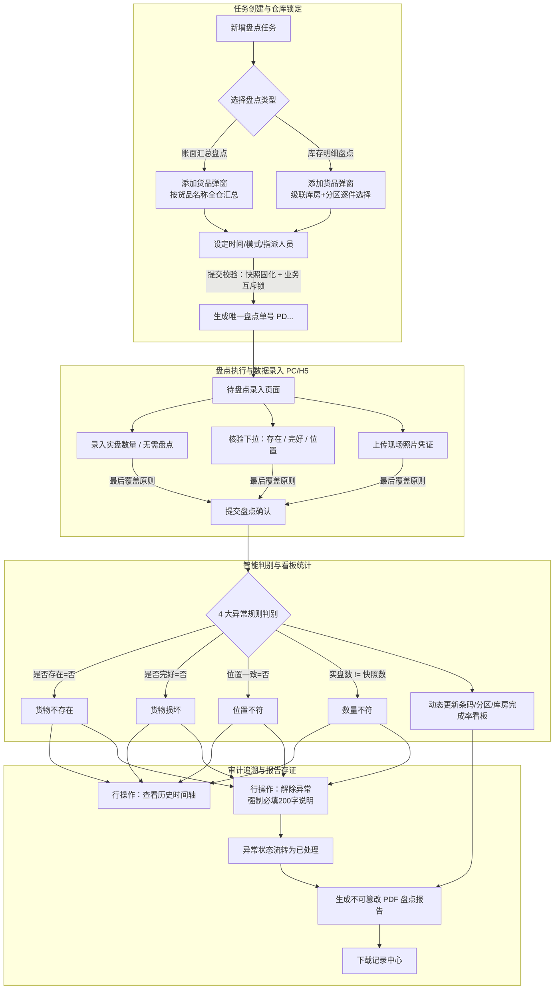

# 货物盘点主PRD

> **模块定位**：仓储业务层核心监管核验单据与动态风控台账，打通供应链金融存货质押体系中的“定期盘点、动态巡库、实物核验与异常闭环”。支持单人/多人协作，支持宏观“账面汇总盘点”与微观“库存明细盘点”，通过四项实物核验指标（是否存在、是否完好、位置一致、盘点数量）严密排查盘亏、移位、破损与虚假库存风险，提供原样存证的 PDF 盘点报告生成与下载能力。  
> **版本**：V1.2 | **更新时间**：2026-09-16 | **责任人**：森云科技（Senyun Technology）
> **编写依据**：[货物盘点字段清单.md](./货物盘点字段清单.md) 是本模块所有字段定义、枚举与页面展示的唯一基准；[货物盘点业务规则规格.md](./货物盘点业务规则规格.md) 是本模块状态机、取并集权限、两类模式、异常判别算法及报告导出的唯一定义真源；[货物盘点_ASCII_列表页.md](./货物盘点_ASCII_列表页.md)、[货物盘点_ASCII_新增页.md](./货物盘点_ASCII_新增页.md)、[货物盘点_ASCII_待盘点页.md](./货物盘点_ASCII_待盘点页.md) 与 [货物盘点_ASCII_详情页.md](./货物盘点_ASCII_详情页.md) 是界面交互与布局的基准来源。

---

## 1. 业务背景与业务痛点

### 1.1 业务背景
在大宗商品供应链金融与动产质押业务中，存货具有货值高、存放周期长、库内流转频繁等特点。由于银行与金融机构无法派驻大量人员进行常态化现场盯库，存货盘点成为了验证“底层抵质押物是否真实存在、完好无损、位置准确”的最重要风控手段。

### 1.2 核心业务痛点
1. **盘点维度单一与场景脱节**：财务审计要求宏观汇总对账，而质押风控要求穿透至具体存货批次与条码，传统系统往往无法兼顾“账面宏观核算”与“库位微观核验”；
2. **缺乏协作与重复盘点冲突处理机制**：大型仓库占地广，多名监管员同时盘点时缺乏分工协作与重复核验的明确规则（最后覆盖原则）；
3. **现场异常发现与核销脱节**：现场发现“缺货、移位、破损、数量不符”等风险时，往往依靠口头或纸质反馈，系统内缺乏清晰的 4 大异常判别指标和严格的解除异常审计留痕；
4. **盘点数据与动态出入库并发冲突**：在盘点任务进行中，存货若被其他业务单据私自出库或移库，容易造成数据混乱与假盘盈盘亏，缺乏在库快照与并发锁定保护；
5. **合规审计缺乏不可篡改凭证**：向资金方报送核验材料时，难以一键生成包含现场照片、核对事实与责任人签名的正式权威盘点报告。

---

## 2. 功能范围

| 包含功能范围 | 不包含功能范围 |
| :--- | :--- |
| - **两两组合的模式与类型架构**：   1. **盘点模式**：单人独立盘点（限 1 人）、多人协作盘点（可选多人，支持多次复盘且以最后结果为准）；   2. **盘点类型**：账面汇总盘点（按货品合并汇总数量）、库存明细盘点（逐件核对条码、货主、库房、分区及货品状态）； - **取并集的数据权限机制**：仓库管辖权 $\cup$ 任务指派人员 $\cup$ 制单人本人； - **单一仓库锁定与联动**：新增时强制单选 1 个仓库，切换仓库二次确认清空明细，添加货品弹窗自动锁定该仓库数据源； - **在库快照与业务互斥锁**：建单成功固化在库快照；提交时排他校验“货品被其他盘点单锁定”及“并发数量变动”； - **PC 端与移动端全渠道盘点录入**：支持录入实盘数量（或勾选【无需盘点】）、核验三项下拉（是否存在、完好、位置一致）及上传现场照片； - **4 大原子异常自动判定与指标看板**：自动识别货物不存在、货物损坏、位置不符、数量不符；库存明细详情页提供 4 张完成率看板卡片； - **解除异常闭环与历史时间轴**：行操作【查看】展开多节点时间轴；行操作【解除异常】强制必填 1~200 字处理说明并全量留痕； - **合规存证报告与清单下载**：一键【生成报告】（PDF 格式，全内容排版存证），通过【导出记录】（下载记录弹窗）进行文件下载。 | - **自动生成损益调账单**：本模块侧重于风控核验与审计，盘盈盘亏不直接在盘点模块冲减物理库存，需走后续审批异动流程； - **跨仓库混合盘点**：严禁一张盘点单跨多个物理监管仓库； - **已产生数据任务的撤销**：单据一旦进入【盘点中】或产生过盘点数据，严禁撤销； - **非创建人撤销单据**：撤销动作仅制单人本人在“未开始”状态下可见并可操作； - **无留痕直接覆盖历史异常**：解除异常必须录入处理说明并固化操作人时间轴，不可无痕删除或修改。 |

---

## 3. 模块定位与系统链路

---

### 3.1 货权档案、货权公示与证据管理跨模块数据互通

依据全系统数据互通规范，货物盘点单审核通过/完成时，系统底层向货权三板块分发报文：

| 协同板块 | 接收事件与触发时机 | 具体数据更新行为与业务效力 |
| :--- | :--- | :--- |
| **【06-货权档案】** | 盘点审核通过/完成 | 1. **账实调整**：平盘不改库存，盘盈/盘亏按审核结果调整库存与货值； 2. **现场物证挂载**：抵质押盘点强制采集的**经纬度与时间戳水印定位打卡照片原文件**，自动挂载至货权档案【记录管理】原文件信息。 |
| **【07-货权公示】** | 盘点审核通过/完成 | 保持当前公示状态不变；重大盘亏异常联动风险公示与预警平台。 |
| **【08-证据管理】** | 盘点审核通过/完成 | 1. 自动生成一条存证类型=【盘点】流水； 2. **平盘变动量为0，盘盈为正，盘亏为负**； 3. **强制挂载现场定位打卡水印照片原文件**； 4. 推送中仓登上链存证并生成区块链哈希。 |

---

## 4. 业务规则索引速查

| 规则编码 | 规则名称 | 核心定义摘要 |
| :--- | :--- | :--- |
| `R01` | **【盘点任务权限判定并集模型】** | 仓库管辖权 $\cup$ 计划盘点人员 $\cup$ 制单人本人，三者满足其一即享有单据权限 |
| `R02` | **【操作动作与按钮权限矩阵】** | 未开始/盘点中/已超期均可执行盘点；【撤销】仅未开始状态由制单人本人操作 |
| `R03` | **【基础信息录入与校验】** | 单号自动发号；时间顺序严格校验；单人模式限 1 人，多人模式多选；500字备注 |
| `R04` | **【单仓锁定与级联数据隔离】** | 任务强制锁定单仓库；切换仓库二次确认清空明细；弹窗严格锁定该仓库数据源 |
| `R05` | **【选货弹窗双模式差异化】** | 账面汇总按商品规格聚合全仓数量；库存明细细化至库房/分区/条码逐件勾选 |
| `R06` | **【提交盘点锁定与并发冲突阻断】** | 提交固化在库快照；排他校验“货品被其他盘点单锁定”及“并发数量变动”拦截报错 |
| `R07` | **【盘点录入与必填项核验】** | 实盘数（或无需盘点）+ 存在/完好/位置三项核验下拉必填，支持上传附件照片 |
| `R08` | **【多人协作最后覆盖原则】** | 多人录入记录完整事件流水，当前主明细与看板以最新时间戳提交结果为准覆盖 |
| `R09` | **【四大核心异常判别算法】** | 自动判定货物不存在、货物损坏、位置不符、数量不符（盘盈盘亏）4 类原子异常 |
| `R10` | **【综合异常状态流转计算】** | 任一指标异常即判行异常（待处理）；全单任意行异常整单异常，解除后转已处理 |
| `R11` | **【解除异常闭环与审计留痕】** | 详情行操作【解除异常】强制录入 1~200 字处理说明，不可逆归档至历史时间轴 |
| `R12` | **【统计看板与完成率计算】** | 实时计算货物条码已盘点率、分区盘点完成率、库房盘点完成率及异常货物数 |
| `R13` | **【报告生成与下载记录导出】** | 异步生成不可篡改 PDF 盘点报告存入对象存储，通过【下载记录】弹窗审计导出 |
| `R14` | **【货权档案互通与存证上链】** | 盘点完成调整货权档案库存货值，挂载经纬度水印打卡照，推送中仓登上链存证 |

---

## 5. 典型业务场景故事（User Stories）

### 关键角色
- **仓库监管主管 / 调度员**：创建盘点任务，划分宏观汇总或库存明细核验，指派单人或多人协作；
- **现场监管员 / 理货员**：在库房现场对照条码与垛位，逐件录入实盘数量、完好与位置状态，拍摄现场照片；
- **资方风控审核员**：调阅盘点详情与完成率看板，核对抵质押物现场存续状况；
- **仓储合规员 / 审计师**：针对盘点异常核查解除并录入说明，导出官方 PDF 盘点报告作为司法审计依据。

### 场景 1【大型冷库多人协作分区快速盘点】(S01)
* **角色**：冷链园区主管老张、监管员小李与小王
* **情境**：月末对生鲜冷链仓库的 2000 箱进口冻品牛肉进行全面巡库盘点。
* **行为**：老张创建【多人协作盘点】任务，选择【库存明细盘点】，指派小李和小王共同参与。小李手持移动设备在 1 号库房盘点，小王在 2 号库房盘点，两人各自录入实盘数据并拍照提交。
* **结果**：看板实时动态更新条码已盘点率与分区完成率，系统遵循【多人协作最后覆盖原则】(R08) 自动汇总二人提交的数据，盘点效率提升 50% 以上。

### 场景 2【实物包装破损现场标记与异常解除闭环】(S02)
* **角色**：现场监管员小刘、仓储风控主管老赵
* **情境**：小刘在核对热轧卷板时，发现 2 卷钢卷外包装带断裂且有雨水锈蚀迹象。
* **行为**：小刘在待盘点录入表格中，“是否存在”选【是】，“是否完好”选【否】，“位置一致”选【是】，拍摄锈蚀照片并提交。系统触发【四大核心异常判别算法】(R09)，自动判定为“货物损坏”，看板与行状态标红为【待处理】。次日钢贸商完成除锈并重新缠包，老赵现场复核后，点击【解除异常】，输入处理说明 `“钢厂已派技术人员除锈复验合格，并完成高阻隔防水包装更换”`。
* **结果**：异常状态流转为【已处理】，解除过程与说明在历史时间轴永久归档，遵循【解除异常闭环与审计留痕】(R11)。

### 场景 3【出库作业并发冲突业务互斥锁定拦截】(S03)
* **角色**：监管员小孙、出库操作员小钱
* **情境**：小孙正在对 100 吨电解铜创建盘点任务，同时出库员小钱正在对其中 20 吨办理出库手续。
* **行为**：小钱在小孙制单期间完成出库扣减，在库数量由 100 吨变为 80 吨。小孙点击新增页【提交】时，系统后端触发【提交盘点锁定与并发冲突阻断】(R06)，拦截提交并弹出提示：`“创建失败：货品已被其他单据操作，数量有变动，请移除货品重新添加后再进行盘点”`。
* **结果**：有效阻断了并发账实脱节，促使小孙重新核对并按最新 80 吨在库事实生成基准盘点快照。

### 场景 4【月度财务审计账面汇总快速平盘】(S04)
* **角色**：财务对账员小林
* **情境**：月末小林需要对整个园区内橡胶、铜排等大宗品类进行宏观在库总量核验。
* **行为**：小林选择【账面汇总盘点】与【单人独立盘点】，在选货弹窗中按货品规格全仓聚合添加。现场快速清点总垛数后，小林在待盘点页录入各品类汇总数量并提交。遵循【选货弹窗双模式差异化】(R05)。
* **结果**：系统秒级完成平盘比对，无需穿透每一根条码，满足了财务快速宏观核算需求。

### 场景 5【超期任务补盘与超期完成归档】(S05)
* **角色**：库管员老周
* **情境**：因突降暴雨库房停电，原定于 18:00 结束的盘点任务被延误，状态变为【已超期】。
* **行为**：次日早晨电力恢复，老周进入系统发现任务虽已超期，但行操作【盘点】依然高亮可用。老周点击【盘点】进入待盘点页，补录完成剩余 10 条货物实盘数据并提交。遵循【操作动作与按钮权限矩阵】(R02)。
* **结果**：任务状态成功由【已超期】变更为【超期完成】，合规记录了超期事实与补录数据。

### 场景 6【司法诉讼举证一键生成原样存证报告】(S06)
* **角色**：资方代理律师、平台合规官
* **情境**：某借款企业涉诉，法院要求资方出具最近一次存货盘点现场确权事实证据。
* **行为**：合规官进入盘点详情页，点击右上角【生成报告】。系统自动调取当时固化的在库快照、实盘数量、4 张率值看板、现场水印打卡照片及异常闭环记录，渲染生成官方 PDF 盘点凭单。合规官在【下载记录】弹窗中一键导出。遵循【报告生成与下载记录导出】(R13)。
* **结果**：报告具有完备的时间戳、数字水印与不可篡改法律效力，成功被法院采纳为有效物权证据。

---

## 6. 核心页面功能规划

### 6.1 盘点任务列表页 (`P-CKG-016-LIST`)
* **检索过滤区**：
  - `盘点单号`（单行文本输入框；精准匹配）
  - `任务名称`（单行文本输入框；模糊匹配）
  - `盘点日期`（起止年月日时间段选择）
  - `盘点类型`（下拉单选框：全部 / 账面汇总盘点 / 库存明细盘点）
  - `仓库名称`（下拉单选框：用户管辖仓库）
  - `盘点状态`（下拉单选框：全部 / 未开始 / 盘点中 / 已盘点 / 已超期 / 已撤销 / 超期完成）
  - `盘点结果`（下拉单选框：全部 / 正常 / 异常）
  - `实际盘点人`（下拉多选：可选多个人）
  - `制单人`（下拉单选框：可选择所有用户）
  - `制单时间`（起止年月日时间段选择）
  - 金色【查询】按钮，无【重置】按钮。
* **数据表格主列**：
  `序号`、`盘点单号`、`任务名称`、`盘点开始时间`、`盘点结束时间`、`盘点类型`、`盘点仓库`、`盘点状态`、`盘点结果`、`异常处理`、`实际盘点人员`、`制单人`、`制单时间`、`操作`。
* **行操作交互规则**：
  - 【详情】：任何状态均可点击进入；
  - 【盘点】：状态为“未开始”、“盘点中”、“已超期”时展示，点击进入待盘点页；
  - 【撤销】：**仅在“未开始”状态且当前登录人为制单人本人时展示**；点击弹出二次确认弹窗：“确定要撤销盘点单？”，确认后单据终止并流转为【已撤销】。

### 6.2 新增盘点页面 (`P-CKG-016-ADD`)
* **表单基础信息**：
  - `盘点任务名称`（必填，默认规则，可修改，最大 40 字）；
  - `盘点开始时间` / `盘点结束时间`（必填，时间顺序严格校验）；
  - `盘点模式`（必填，单人独立盘点 / 多人协作盘点）；
  - `计划盘点人员`（必填，单人模式限 1 人，多人模式可多选；启用账号）；
  - `附件`（选填，支持 jpg, png, jpeg，最多上传 20 张）；
  - `备注`（选填，多行文本框，最大 500 字，带 `0/500` 计数器）。
* **盘点类型与仓库**：
  - `盘点类型`（必填，账面汇总盘点 / 库存明细盘点）；
  - `盘点仓库`（必填，单选 1 个仓库；更改已选仓库弹出清空已选明细确认）。
* **货品明细录入与添加弹窗**：
  - 表格右上角提供【添加货品】按钮；
  - 空状态占位提示：“请点击右上方添加按钮选择盘点货品”；
  - **账面汇总弹窗**：按货品名称下拉筛选，多选勾选带出货物名称、单位、本批次数量；
  - **库存明细弹窗**：支持货品名称、货主、货品状态、库房+分区筛选，多选勾选带出存货编号、货主、货物名称、库存总数（可用+冻结）、仓库、库房、分区、货品状态、存货条码；
  - 勾选存货条码支持鼠标悬停（Hover）放大预览二维码；
  - 底部实时动态汇总：货品类型数、库存总数量等。
* **提交校验与结果反馈**：
  - 校验必填项与货品明细至少 1 条；
  - 触发业务锁检测（货品被锁、数量变动拦截）；
  - 创建成功弹窗：提示“已成功创建{{盘点模式}}+{{盘点任务名称}}”，底部提供【返回盘点单列表】与【去盘点】（根据当前用户是否在计划盘点人员中智能显隐）。

### 6.3 待盘点页 / PC 端盘点录入 (`P-CKG-016-INPUT`)
* **单据概览**：展示盘点单号、状态大印章、制单人、制单时间、任务名称、开始时间、结束时间、模式、人员、仓库、备注；
* **右上角操作**：提供【返回】、红色【撤销】（未开始且制单人可用）、金色【提交】主操作；
* **明细核验录入表格**：
  - `盘点数量`：支持输入实盘数值，或勾选右侧【无需盘点】复选框（勾选后输入框禁用，值固化为“无需盘点”）；
  - `是否存在`：下拉单选【是】/【否】（必选）；
  - `是否完好`：下拉单选【是】/【否】（必选）；
  - `位置一致`：下拉单选【是】/【否】（必选）；
  - `附件`：点击【上传附件】上传现场核验照片；
  - 点击右上角【提交】时逐行校验，全部填写无误后写入盘点结果。

### 6.4 详情页 (`P-CKG-016-DETAIL`)
* **头部单据信息**：
  - 单号 + 复制图标、返回按钮；
  - 右上角大圆形印章：`未开始`、`盘点中`、`已盘点`、`已超期`、`已撤销`、`超期完成`；
  - 双列展示元数据；附件支持缩略图放大预览；
* **账面汇总详情表现**：
  - 表格右上角展示丰富合计：货品类型及已盘点、库存数量及已盘点、盘点异常总数、货物不存在、位置不符、货物损坏、数量不符；
  - 货品明细表格展示核验结果，异常项文字标红；操作列提供【查看】与【解除异常】；
* **库存明细详情表现**：
  - 右上角新增【生成报告】与【导出记录】按钮；
  - 独立二次检索栏：盘点时间段、库房/分区下拉、重置与查询；
  - 4 张统计率看板卡片：货物条码已盘点率、分区盘点完成率、库房盘点完成率、异常货物数及明细；
  - 盘点记录表格提供模糊检索与盘点时间倒序排序；
* **配套弹窗**：
  - **盘点历史记录弹窗**：时间轴形式倒序展示多节点盘点操作人、核验四项指标、实盘与快照比对、不一致标签、现场照片，以及异常解除流水子表（解除时间、人员、处理说明）；
  - **解除异常弹窗**：多行文本框强制必填 1~200 字处理说明；
  - **下载记录弹窗**：列表展示已生成的盘点报告文件名、操作人、生成时间、状态及【下载】操作。

---

## 7. 修订记录

| 日期 | 版本 | 变更内容说明 | 影响范围 | 修订人 |
| :--- | :--- | :--- | :--- | :--- |
| 2026-09-10 | V1.0 | 建立货物盘点最新基准版主 PRD 功能规格说明书：规范单据定位、账面汇总/库存明细双模式、4 大异常判定及报告存证导出。 | 货物盘点全模块 | AI PM / 森云科技 |
| 2026-09-16 | **V1.1** | 补充货权档案、货权公示与证据管理跨模块数据互通说明。 | 跨模块协同与系统链路 | AI PM / 森云科技 |
| 2026-09-16 | **V1.2** | 场景编号语义自解释化升级（场景 N【场景名称】(Sxx)）、补充业务规则速查表、全面汉化交互术语。 | 全文 | AI PM / 森云科技 |
