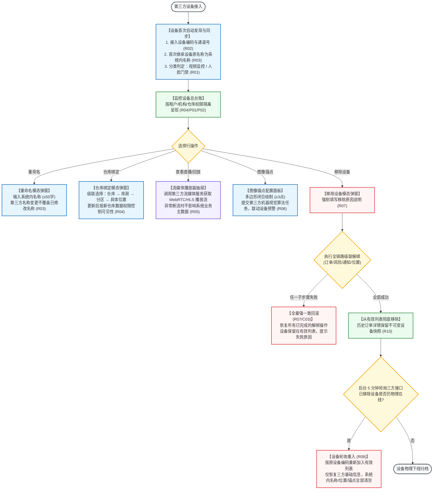

# 监控设备业务规则规格

> **文档定位**：仓储 / 设备管理 / 监控设备模块设备分类、命名保护、仓库位置绑定、视频流媒体调阅、图像锚点算法任务联动、移除设备全链路强一致解绑、轮询重入及审计防篡改的**唯一定义真源**。主 PRD、字段清单及端侧原型仅引用本文件规则编号（R01~R10, C01~C03, P01~P02），不重复定义规则本体。  
> **模块类型**：物联网与安防监控设备基础数据与控制总台账类（包含视频监控与人脸门禁双分类融合、直播/回放第三方调用、图像算法锚点配置、移除设备级联解绑回滚）  
> **参考文档**：[《监控设备主PRD》](./监控设备主PRD.md)、[《监控设备字段清单》](./监控设备字段清单.md)、[《监控设备操作字段清单索引》](./操作字段清单/操作字段清单索引.md)  
> **版本**：V1.2 | **更新时间**：2026-09-16 | **责任人**：森云科技（Senyun Technology）

---

## 一、对象定位与架构属性

| 项目 | 规格内容 |
| :--- | :--- |
| **单据层级** | **【设备基础数据与物联感知层】**（连接仓储物理安防监控与金融风控智能预警的基础底座） |
| **核心职责** | 统一纳管监管仓库现场视频监控摄像头及具备摄像头能力的人脸门禁终端；维护设备在系统内的别名与三级物理库位绑定；提供低延迟实时视频直播与历史回放调阅；支持绘制图像锚点并与第三方机器视觉算法任务联动；支撑设备故障或报废时的全链路业务解绑。 |
| **数据来源** | **多源融合接入**： 1. **第三方流媒体/设备接入平台**：设备原始名称、设备物理编码、在线状态及视频流地址； 2. **系统内部配置与用户维护**：系统内别名、仓库/库房/分区绑定关系、图像锚点区域坐标。 |
| **上游依赖** | **第三方安防视频平台**：海康威视、大华等流媒体网关及算法服务； **仓储物理空间档案**：监管仓库、库房、分区及货位基础信息； **组织与数据权限中枢**：租户标识、机构归属与仓库管辖权限。 |
| **下游引用** | **实物作业现场抓拍**：入库验收、出库复核、移库调拨、动态盘点等业务抓拍关联； **动产质押与风控监管**：抵质押订单绑定的视频巡检通道； **风控预警引擎**：设备离线预警、遮挡预警、图像锚点区域非法移动预警、越界告警。 |
| **状态机特性** | **不设人工单据审批状态机**：设备为客观主数据对象，设备自身不生成独立审批流；重命名、仓库绑定、图像锚点及移除设备属于原子事务操作。 |
| **入口分流** | PC 端导航：工作台 → 仓储 → 设备管理 → 监控设备；各操作通过行操作按钮分别呼出对应模态弹窗或流媒体播放器抽屉。 |

---

## 二、设备操作能力与影响隔离表

| 操作名称 | 适用设备分类 | 前置业务校验条件 | 后置业务影响 | 失败阻断与处理逻辑 |
| :--- | :--- | :--- | :--- | :--- |
| **重命名** | 视频监控、人脸门禁 | 名称非空且字符数 $\le 50$ 字；符合命名合法性校验 | 更新系统内名称、最后修改人账号及更新时间戳 | 阻断提交并保留原名称，不产生部分更新快照 |
| **仓库绑定** | 视频监控、人脸门禁 | 拥有目标仓库管辖权限；位置层级（仓库-库房-分区）归属合法且有效 | 更新设备绑定的仓库、库房、分区及具体位置 | 校验未通过时阻断提交，保持原绑定状态不变 |
| **查看直播** | 视频监控、人脸门禁 | 具备查看权限；设备处于有效接入状态 | 调起流媒体网关生成临时播放会话，不修改设备主数据 | 流媒体超时或断流时展示友好异常提示，不阻断页面交互 |
| **查看回放** | 视频监控、人脸门禁 | 具备查看权限；选择有效历史时间区间 | 调起第三方视频录像回放流，联动查询该时段安防预警标记 | 录像缺失或服务不可用时提示“该时段暂无录像回放” |
| **图像锚点** | 视频监控、人脸门禁 | 监控类型不重复；锚点绘制闭合且至少包含 3 个顶点坐标 | 创建或更新算法分析任务，并在风控侧激活对应设备预警规则 | 第三方算法接口返回失败时，本地配置强一致回滚 |
| **移除设备** | 视频监控、人脸门禁 | 具备移除权限；必须强制录入移除原因说明 | 触发全链路强一致级联解绑：订单解绑、预警失效、通知解绑、仓库解绑 | 任一联动子步骤失败执行全量回滚，保持原有效状态不变 |

---

## 三、全景业务时序与流转架构

### 3.1 监控设备生命周期与全链路联动流程图

---

## 四、核心业务规则清单 (R01 ~ R10)

### 1. 设备分类与标识规则

### 【监控设备分类与人脸门禁融合规则】(R01)
* 监控设备菜单纳管两大类物理设备：
  1. **视频监控**：常规安防枪机、球机及半球摄像头；
  2. **人脸门禁**：具备摄像头能力的人脸识别门禁一体机终端；
* 人脸门禁因具备光学摄像头与视频流传输能力，属于监控设备纳管范畴。系统内同一物理设备在“监控设备”与“人脸门禁”菜单呈现统一的设备主数据，在监控设备菜单享有查看直播、回放及图像锚点能力。

### 【设备唯一标识与业务主键规则】(R02)
* 系统以第三方平台接入的**物理设备编码（或设备唯一标识）**作为设备关联、权限鉴权、幂等控制及司法审计的唯一业务主键；
* 界面展示的列表行序号仅为前端分页视图展示标识，严禁在后端业务逻辑中作为持久化关联键。

### 2. 命名保护与位置层级规则

### 【设备命名继承与重命名保护规则】(R03)
* **首次接入继承**：设备接入系统初始化时，系统内名称默认继承第三方平台的设备原名称（优先拼接“设备名称+通道名称”）；
* **人工重命名保护**：用户在系统内对设备执行【重命名】保存后，后续第三方平台同步更新设备名称时，**绝对禁止自动覆盖**用户已维护的系统内名称；
* **命名格式校验**：系统内名称长度限制在 1~50 个字符之间，禁止全空格，支持中文、英文、数字及常用标点符号。

### 【仓库位置层级绑定与数据权限隔离规则】(R04)
* **三级位置层级绑定**：设备支持与实体监管仓库的组织架构进行四级级联绑定（仓库名称 → 库房名称 → 分区名称 → 具体安装位置描述）；
* **绑定状态动态判定**：设备绑定仓库、库房或分区任一位置时，系统判定为【已绑定】；三者均为空时判定为【未绑定】；
* **数据权限动态切换**：
  - **已绑定设备**：严格遵循仓库数据权限隔离，仅拥有该设备所属仓库管辖权限的用户方可查看与操作；
  - **未绑定设备**：面向当前租户内拥有监控设备菜单查看权限的全员可见，仓库与位置信息字段展示为空。

### 3. 流媒体与视觉算法联动规则

### 【视频直播与回放第三方调用控制规则】(R05)
* 用户点击【查看直播】或【查看回放】时，系统实时请求第三方流媒体网关签发具备有效期的安全流媒体播放令牌（Token）；
* 第三方视频流服务发生网络超时、黑屏或断流时，前端播放器友好呈现“视频加载失败”或“当前设备已离线”状态，不影响系统本地业务单据与主数据的正常运行。

### 【图像锚点算法任务配置与设备预警联动规则】(R06)
* 用户在视频监控画面中绘制电子围栏与图像锚点区域时，必须满足**多边形闭合且至少包含 3 个顶点坐标**；
* 同一摄像头下，同一监控类型（如“货物位移监测”、“禁入区域告警”）禁止重复配置；
* 图像锚点在本地提交后，系统同步向第三方机器视觉算法平台下发分析任务，算法任务返回成功确认后方可激活对应的设备安防预警规则；第三方返回失败时，本地配置强一致回滚。

### 4. 移除设备级联解绑与重入规则

### 【移除设备全链路解绑与强一致回滚规则】(R07)
* 用户执行【移除设备】操作时，必须强制录入不少于 5 个字、不超过 200 字的移除原因说明；
* 确认移除后，系统在分布式事务控制下执行**全链路级联解绑**：
  1. **订单解绑**：解除与所有在押监管订单的巡检通道绑定；
  2. **风控预警失效**：注销该设备关联的所有设备预警规则与未结案告警流水；
  3. **事务通知解绑**：注销该设备的离线与异常通知推送配置；
  4. **物理位置解绑**：清空与实体仓库、库房、分区的绑定关系；
* **强一致回滚原则**：上述任一联动子步骤执行失败时，系统触发全量事务回滚，恢复所有已修改的数据镜像，设备保留在监控设备有效列表中，并向用户弹出明确的失败原因提示，严禁部分成功。

### 【移除设备轮询重入与配置清空规则】(R08)
* 移除设备成功后，该设备从监控设备有效列表中立即剔除；
* 后台作业以 5 分钟为周期轮询第三方设备网关接口，若发现已被移除的物理设备仍在线且接入中，系统按原物理设备编码重新将其纳入系统设备主数据；
* **重入配置彻底清空**：重新接入的设备仅恢复第三方基础识别信息（物理编码、设备分类、原始名称），系统内名称、仓库位置绑定、图像锚点区域及设备预警配置**彻底清空**，必须由管理员重新配置。

### 5. 并发控制与不可变审计

### 【设备并发控制与操作幂等性规则】(R09)
* 重命名、仓库绑定、图像锚点及移除设备操作，服务端必须引入版本号（Version）或分布式悲观锁控制；
* 当检测到设备数据版本落后时，系统强校验拦截并提示“当前设备信息已被其他用户更新，请刷新列表后重试”；
* 重复提交的请求基于请求流水号实现幂等防护，防范重复解绑与重复建任务。

### 【不可变历史审计快照规则】(R10)
* 设备被移除或位置变更后，历史仓储入库/出库凭证、盘点记录及抵质押订单详情中已记录的设备信息作为不可变司法快照永久固化保存，不受后续设备移除或重入影响；
* 系统全路径记录设备操作审计日志（操作人、角色、客户端 IP、操作时间、变更前后镜像快照、操作结果）。

---

## 五、异常与阻断控制规则 (C01 ~ C03)

### 【设备版本并发冲突】(C01)
$$\text{提交更新时: } \text{Request.Version} \ne \text{DB.CurrentVersion} \implies \text{阻断提交，弹出警告弹窗提示刷新}$$

### 【第三方流媒体调用异常】(C02)
* 调用第三方流媒体或算法接口发生超时（$\ge 5.0\text{ 秒}$）或网络错误时，前端捕获异常并展示重试指引，严禁直接向用户抛出底层技术代码堆栈。

### 【移除设备跨模块联动回滚】(C03)
* 移除设备过程中，若订单解绑或风险预警注销失败，系统触发回滚动作，并在审计日志中记录 `CASCADE_ROLLBACK` 事件。

---

## 六、数据权限与机构隔离规则 (P01 ~ P02)

### 【租户与机构数据物理隔离】(P01)
* 用户登录系统后，监控设备列表仅展示当前登录租户及其所属分支机构下的设备，跨租户数据物理阻断。

### 【仓库与位置分级权限控制】(P02)
* 已完成位置绑定的监控设备，用户必须拥有该设备所在实体仓库的数据授权方可查看；若用户权限发生变更失去该仓库授权，系统自动过滤该设备。

---

## 七、修订记录

| 日期 | 版本 | 变更内容说明 | 影响范围 | 修订人 |
| :--- | :--- | :--- | :--- | :--- |
| 2026-08-14 | V1.0 | 建立监控设备业务规则规格初稿：规范设备分类、重命名、仓库绑定及移除设备流程。 | 监控设备全模块 | 产品研发组 |
| 2026-08-20 | V1.1 | 合并原业务流程说明，补充全量回滚机制与轮询重入规则。 | 异常与联动处理 | 产品研发组 |
| 2026-09-16 | **V1.2** | **编号语义自解释与交互术语汉化重构**： 1. 规则、异常与权限全量升级为 `【规则名称】(Rxx/Cxx/Pxx)` 格式； 2. 规范提炼 10 大核心业务规则（R01~R10），明确人脸门禁融合、流媒体调用控制、图像锚点联动与移除强一致回滚； 3. 全面汉化交互术语（模态弹窗、警告弹窗、浮窗提示等），专业技术词汇规范标注 `中文（English）`。 | 全文表述规范性与测试追溯力提升 | AI PM / 森云科技 |
