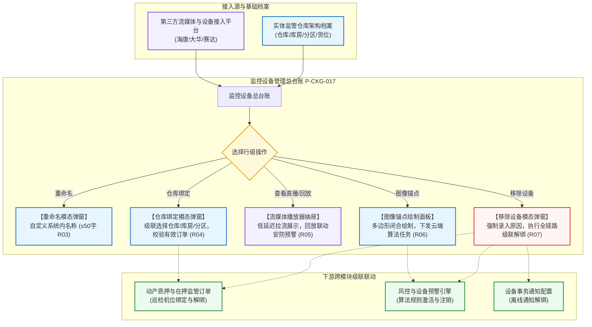

# 监控设备主PRD

> **模块定位**：仓储 / 设备管理 / 监控设备模块是供应链金融存货质押监管体系中物联感知、视频监控与机器视觉预警的统一管理总中枢。本模块集中纳管视频监控摄像头与具备摄像头能力的人脸门禁终端，维护设备在系统内部的别名与实体仓库、库房及分区的空间位置绑定，提供低延迟实时直播与历史回放，支持在视频画面中绘制图像锚点并联动机器视觉算法，并在设备报废或故障时执行全链路强一致级联解绑。  
> **版本**：V1.9 | **更新时间**：2026-09-16 | **责任人**：森云科技（Senyun Technology）  
> **编写依据**：[《监控设备字段清单》](./监控设备字段清单.md) 是设备主数据和系统字段的唯一基准；行操作子清单由 [《监控设备操作字段清单索引》](./操作字段清单/操作字段清单索引.md) 维护；[《监控设备业务规则规格》](./监控设备业务规则规格.md) 是设备分类、位置绑定、流媒体调阅、图像算法及移除解绑的唯一定义来源。

---

## 1. 业务背景与核心痛点

### 1.1 业务背景
在动产质押与第三方仓储监管业务中，视频监控是资金方（商业银行/商业保理）穿透监管现场、防范质押物被非法挪动、盗抢或擅自调拨的最核心抓手。系统必须对监管库区部署的海量摄像头进行统一纳管，并与监管仓库、库房、分区空间层级建立精准绑定，实现“看得到货、辨得出位、查得到人”。

同时，随着 AI 机器视觉技术的应用，系统通过在监控画面上配置“图像锚点”区域，将安防摄像头升级为具备“行人入侵”、“车辆越界”、“物品形态变化”等智能感知能力的边缘节点，一旦发生异常位移即刻触发设备与押品预警。

### 1.2 核心业务痛点
1. **多厂商设备分散，命名与维护混乱**：传统仓库现场安装海康威视、大华等多厂商摄像头，设备原名称往往为串号或通道号，现场人员难以辨识；
2. **监控与物理库区脱节**：摄像头若未与具体监管仓库、库房、分区绑定，风控人员在查验特定在押货品时无法一键联动调起对应监控机位；
3. **设备报废与解绑存在断链风险**：摄像头拆除或故障移除时，若未能联动注销关联的在押订单巡检通道与风控预警规则，极易引发误报或监管真空；
4. **视频流媒体稳定性与数据一致性冲突**：第三方流媒体服务器网络抖动易导致前台卡死，必须确立流媒体故障与本地业务数据解耦的容错机制。

---

## 2. 功能范围 (Scope)

| 包含功能（已纳入范围） | 不包含功能（超出范围） |
| :--- | :--- |
| - **监控设备总台账与组合检索**：支持按设备名称（系统内名称）、设备分类、仓库、绑定状态 4 大核心维度组合检索； - **双设备分类融合展示**：视频监控与人脸门禁双分类纳管，人脸门禁在监控菜单下开放全部摄像头能力； - **空间位置层级绑定**：支持设备绑定仓库、库房、分区及具体位置，支持有效订单校验与阻断； - **设备系统内重命名**：支持自定义设备别名，防止第三方平台名称同步覆盖； - **第三方流媒体直播与回放**：调用第三方视频平台接口获取播放流，回放界面联动展示关联设备安防预警； - **图像锚点与机器视觉算法配置**：在监控画面上绘制闭合多边形（$\ge 3$ 点），配置时间模板并向云端下发算法任务； - **移除设备全链路级联解绑**：强制录入移除原因，级联注销订单绑定、预警规则、通知规则及位置绑定，任一失败全量强一致回滚； - **第三方设备轮询重入**：每 5 分钟轮询三方接口，重入设备仅恢复基础识别信息，系统配置清空。 | - **设备底层网络接入与协议注册**：第三方设备的 ONVIF/GB28181 物理组网与推流配置由底层网络服务托管； - **人脸门禁权限下发与临时密码**：人脸下发、通行记录及开锁审核由「人脸配置」及「开锁审核」专网专道处理； - **设备预警处置闭环**：预警确认与解除在「设备预警信息」模块处理，本模块仅只读调阅预警快照； - **第三方流媒体编解码算法**：视频转码、推拉流服务由第三方流媒体网关执行。 |

---

## 3. 模块架构与系统链路

---

## 4. 业务场景与用户故事

| 场景编号 | 业务场景 | 触发角色 | 核心交互与风控约束 | 业务价值 |
| :--- | :--- | :--- | :--- | :--- |
| **场景 1【库区监控实时视频调阅与轮巡】(S01)** | 库区监控实时视频调阅与轮巡 | 资方风控员 / 现场监管专员 | 风控员需在线核查生鲜冷库电解铜垛位实况。在列表筛选仓库“生鲜冷库”，点击操作列【查看直播】。系统调出低延迟视频播放抽屉展示库区实况。遵循【视频直播与回放第三方调用控制规则】(R05)。 | 实现非现场穿透式监管，秒级核验在库货品安全状态。 |
| **场景 2【监管库房摄像头位置绑定与换绑】(S02)** | 监管库房摄像头位置绑定与换绑 | 仓储设备管理员 | 仓库新装一台球机，管理员在列表找到未绑定设备，点击【仓库绑定】。选择仓库“海霸王仓库”、库房“1号钢材库”、分区“A区”，输入具体安装位置“东南角立柱高4米”。系统校验该设备无冲突在押订单后保存。遵循【仓库位置层级绑定与数据权限隔离规则】(R04)。 | 建立设备与物理库位空间映射，为单据抓拍提供精准机位源。 |
| **场景 3【存货堆垛图像锚点安防预警绘制】(S03)** | 存货堆垛图像锚点安防预警绘制 | 安全运营主管 / 风控算法岗 | 针对重点质押铜锭垛位，点击【图像锚点】。在静态背景帧上绘制 4 边形封闭区域，选择“物品形态监控”与“全天模板”。点击保存，系统将算法任务推送至赛达平台并激活对应设备预警。遵循【图像锚点算法任务配置与设备预警联动规则】(R06)。 | 将安防监控转化为主动风控探针，防范实物被盗挪与调包。 |
| **场景 4【故障摄像头移除与跨模块解绑】(S04)** | 故障摄像头移除与跨模块解绑 | 仓储管理员 / 系统运维 | 某摄像头发生硬件损坏需拆除更换。管理员点击【移除设备】，录入说明“设备芯片烧毁拆机报废”。点击确认后，系统在事务控制下联动解绑在押订单、注销预警规则、清空仓库绑定，从有效列表彻底移除。遵循【移除设备全链路解绑与强一致回滚规则】(R07)。 | 消除因设备物理下线带来的系统孤儿规则与误报风险。 |

---

## 5. 页面交互与操作规格

### 5.1 监控设备主列表页（`P-CKG-017`）
* **顶部区域**：标题展示为 `监控设备`；
* **筛选查询区排布**：
  - 横向排布 4 项筛选控件：
    1. 设备名称（单行文本输入框，提示“请输入设备名称”，实际查询系统内名称）；
    2. 设备分类（下拉单选框，默认全部，选项：`视频监控`、`人脸门禁`）；
    3. 仓库（下拉单选框，根据登录用户仓库数据权限返回可选列表）；
    4. 绑定状态（下拉单选框，默认全部，选项：`已绑定`、`未绑定`）；
  - 右侧配置橙黄色实心【查询】按钮与白底【重置】按钮。
* **数据表格呈现（9 列）**：
  - 序号、设备原名称、系统内名称、设备编码、设备分类、绑定仓库、具体位置、修改人员、更新时间、操作；
  - 绑定状态仅作为筛选项，不作为表格数据列；
  - 操作列陈列文字操作链接：【重命名】、【仓库绑定】、【查看直播】、【查看回放】、【图像锚点】、【移除设备】。

---

### 5.2 【重命名】模态弹窗交互规格
* **触发方式**：点击操作列【重命名】文字链接呼出居中模态弹窗；
* **表单控件**：
  - `设备原名称`：只读单行文本框展示；
  - `* 系统内名称`：单行文本输入框，必填，占位符“请输入系统内名称”，字符数限制 $\le 50$ 字符；
* **提交与保存**：
  - 点击【确认】提交后端，校验通过后保存并更新修改人员与更新时间；保存后的系统内名称永久保护，不被第三方平台覆盖，遵循【设备命名继承与重命名保护规则】(R03)。

---

### 5.3 【仓库绑定】模态弹窗交互规格
* **触发方式**：点击操作列【仓库绑定】文字链接呼出模态弹窗；
* **表单控件**：
  - `绑定仓库`：下拉单选框，仅展示用户有管辖权限的监管仓库；
  - `库房与分区`：级联多选下拉框，选定仓库后动态加载其下属库房与分区；支持多选；
  - `具体位置`：单行文本输入框，选填，最多 50 字符，占位符“请输入具体安装位置（如东南角）”；
* **有效订单阻断与保存**：
  - 点击【确认】提交，系统在后端强校验该设备是否绑定了处理中或在押中的有效质押订单，若存在有效订单则阻断提交并弹出警告弹窗提示：“*该设备已绑定有效订单，请先解绑后再修改*”，遵循【仓库位置层级绑定与数据权限隔离规则】(R04)。

---

### 5.4 【查看直播】与【查看回放】交互规格
* **触发方式**：点击【查看直播】或【查看回放】调出右侧视频抽屉面板；
* **直播调阅**：
  - 调起第三方流媒体网关低延迟播放流（WebRTC/HLS），提供全屏、截图及清晰度切换控件；
* **回放与预警联动**：
  - 回放界面支持选择历史日期时间范围与时间轴拖拽；
  - 抽屉底部以表格形式同步展示该设备在选定时段内触发的安防图像识别预警流水（预警时间、预警类型、预警描述、处理人、现场抓拍照片等），预警数据为只读展示，遵循【视频直播与回放第三方调用控制规则】(R05)。

---

### 5.5 【图像锚点】绘制面板交互规格
* **触发方式**：点击操作列【图像锚点】打开专属配置页面；
* **画布与绘制**：
  - 画布背景截取当前摄像头画面的一帧静态高清图作为基准背景；
  - 用户使用鼠标在画布上点击锚定顶点，连线绘制封闭区域，**顶点数量必须 $\ge 3$ 个点且完全闭合**；
  - 支持配置组管理（最多支持 3 组，对应行人入侵、车辆入侵、物品形态 3 大监控类型，监控类型禁止重复）；
* **下发与保存**：
  - 单组保存成功后向第三方平台下发算法任务，接口成功后激活风控设备预警规则；第三方接口失败时本地配置强一致回滚，遵循【图像锚点算法任务配置与设备预警联动规则】(R06)。

---

### 5.6 【移除设备】模态弹窗与全链路回滚规格
* **触发方式**：点击操作列【移除设备】文字链接呼出二次确认模态弹窗；
* **确认表单**：
  - 弹窗显著标红展示风险提示：“*移除设备后该设备产生的所有未处理风险状态会失效，所绑定的订单会解绑，所涉及的预警规则、通知规则会解除该设备绑定。*”；
  - `* 移除说明`：多行文本输入框，必填，要求录入 5~200 字的原因说明；
* **执行全链路级联解绑与强一致回滚**：
  - 点击【确认】后，系统在分布式事务控制下级联解除订单、规则、通知及仓库绑定；
  - **任一联动子步骤失败执行全量回滚**，设备保留在有效列表中，并向用户提示：“*移除设备失败，请联系管理员*”，严禁产生部分更新，遵循【移除设备全链路解绑与强一致回滚规则】(R07) 与【移除设备跨模块联动回滚】(C03)。

---

## 6. 核心业务规则索引

| 规则大类 | 规则编码与自解释名称 | 核心逻辑摘要 | 详细真源指向 |
| :--- | :--- | :--- | :--- |
| **设备分类** | 【监控设备分类与人脸门禁融合规则】(R01) | 纳管视频监控与人脸门禁，人脸门禁享有全部摄像头能力 | [业务规则规格 §4.1](./监控设备业务规则规格.md#1-设备分类与标识规则) |
| **设备主键** | 【设备唯一标识与业务主键规则】(R02) | 以物理设备编码为全局唯一业务键，列表序号不作为主键 | [业务规则规格 §4.1](./监控设备业务规则规格.md#1-设备分类与标识规则) |
| **命名保护** | 【设备命名继承与重命名保护规则】(R03) | 首次继承原名称；人工重命名后第三方同步不覆盖；限制 $\le 50$ 字 | [业务规则规格 §4.2](./监控设备业务规则规格.md#2-命名保护与位置层级规则) |
| **位置绑定** | 【仓库位置层级绑定与数据权限隔离规则】(R04) | 级联绑定仓库-库房-分区；已绑定按仓库权限控制，未绑定全员可见 | [业务规则规格 §4.2](./监控设备业务规则规格.md#2-命名保护与位置层级规则) |
| **流媒体调用** | 【视频直播与回放第三方调用控制规则】(R05) | 调用第三方获取安全播放流；断流不影响业务；回放联动安防预警 | [业务规则规格 §4.3](./监控设备业务规则规格.md#3-流媒体与视觉算法联动规则) |
| **视觉算法** | 【图像锚点算法任务配置与设备预警联动规则】(R06) | 锚点多边形闭合且 $\ge 3$ 点；监控类型不重；第三方失败强一致回滚 | [业务规则规格 §4.3](./监控设备业务规则规格.md#3-流媒体与视觉算法联动规则) |
| **全链路解绑** | 【移除设备全链路解绑与强一致回滚规则】(R07) | 强制必填说明；级联解绑订单/预警/通知/仓库；任一失败全量回滚 | [业务规则规格 §4.4](./监控设备业务规则规格.md#4-移除设备级联解绑与重入规则) |
| **轮询重入** | 【移除设备轮询重入与配置清空规则】(R08) | 移除后 5 分钟轮询三方接口发现重入；配置彻底清空仅保留基础信息 | [业务规则规格 §4.4](./监控设备业务规则规格.md#4-移除设备级联解绑与重入规则) |
| **并发与幂等** | 【设备并发控制与操作幂等性规则】(R09) | 服务端版本号控制防并发覆盖；请求流水号防重复提交 | [业务规则规格 §4.5](./监控设备业务规则规格.md#5-并发控制与不可变审计) |
| **不可变审计** | 【不可变历史审计快照规则】(R10) | 历史订单详情保留设备不可变快照；全路径操作记录审计日志 | [业务规则规格 §4.5](./监控设备业务规则规格.md#5-并发控制与不可变审计) |
| **异常控制** | 【设备版本并发冲突】(C01) | 请求版本与数据库版本不一致阻断提交，提示刷新列表 | [业务规则规格 §5](./监控设备业务规则规格.md#五异常与阻断控制规则-c01--c03) |
| **异常控制** | 【第三方流媒体调用异常】(C02) | 第三方服务超时（$\ge 5$秒）友好报错，禁止抛出技术堆栈 | [业务规则规格 §5](./监控设备业务规则规格.md#五异常与阻断控制规则-c01--c03) |
| **异常控制** | 【移除设备跨模块联动回滚】(C03) | 移除设备任一联动失败触发全量回滚并记录回滚审计事件 | [业务规则规格 §5](./监控设备业务规则规格.md#五异常与阻断控制规则-c01--c03) |
| **数据权限** | 【租户与机构数据物理隔离】(P01) | 严格按登录租户隔离数据，跨租户物理阻断 | [业务规则规格 §6](./监控设备业务规则规格.md#六数据权限与机构隔离规则-p01--p02) |
| **数据权限** | 【仓库与位置分级权限控制】(P02) | 已绑定设备需具备对应实体仓库管辖权限方可查看 | [业务规则规格 §6](./监控设备业务规则规格.md#六数据权限与机构隔离规则-p01--p02) |

---

## 7. 权限矩阵（RBAC）

| 角色类型 | 查看未绑定设备 | 查看已绑定设备 | 重命名 | 仓库绑定 | 查看直播/回放 | 图像锚点配置 | 移除设备 |
| :--- | :---: | :---: | :---: | :---: | :---: | :---: | :---: |
| **系统超级管理员** | ✅ | ✅ | ✅ | ✅ | ✅ | ✅ | ✅ |
| **仓储设备主管** | ✅ | 需仓库授权 | ✅ | ✅ | ✅ | ✅ | ✅ |
| **现场安全监控员** | ✅ | 需仓库授权 | ❌ | ❌ | ✅ | ❌ | ❌ |
| **资方风控审核员** | ✅ (只读) | 需仓库授权 | ❌ | ❌ | ✅ (只读) | 仅查验 | ❌ |

---

## 8. 非功能性需求 (NFR)

1. **响应与播放延迟**：
   - 监控设备主列表组合查询响应时间 $\le 1.0$ 秒（覆盖百万级设备索引）；
   - 实时视频直播推拉流首帧打开延迟 $\le 1.5$ 秒（局域网/专用网环境下）；
   - 图像锚点算法任务向云端下发及结果返回响应时间 $\le 3.0$ 秒。
2. **高可靠性与事务一致性**：
   - 移除设备涉及的跨模块（订单、风控、通知、仓库）级联调用严格依托分布式事务中间件保障，回滚成功率 $100\%$；
   - 支持每 5 分钟周期的后台三方设备自动轮询同步任务，单批次处理能力 $\ge 500\text{ 台}$。
3. **全链路审计与安全防护**：
   - 重命名、位置变更、图像锚点提交及移除操作 $100\%$ 记录全息审计日志（操作人、角色、IP、时间戳、操作前后快照）；
   - 视频播放 Token 引入防盗链机制，最长有效期限制为 60 分钟，过期自动阻断播放流。

---

## 9. 验收标准与交付清单

1. **分类与列表检索**：
   - 列表准确呈现 9 列标准结构，绑定状态仅作为筛选项有效工作；
   - 人脸门禁设备可同时在监控设备菜单呈现并正常使用所有摄像头操作能力；
2. **两态命名与重命名保护**：
   - 设备首次接入继承原名称；人工重命名保存后，第三方接口名称更新不覆盖系统内名称；
3. **仓库绑定与订单阻断**：
   - 级联绑定仓库-库房-分区正确生效；已绑定有效订单的设备修改绑定时准确阻断并友好弹窗提示；
4. **视频调阅与锚点算法闭环**：
   - 查看直播流媒体正常播放，断流时不影响系统页面其他功能；
   - 图像锚点闭合绘制 $\ge 3$ 点有效校验，保存后算法任务与设备预警联动生效；
5. **移除设备强一致回滚**：
   - 移除说明必填校验生效；确认移除后全链路级联解绑完成；模拟解绑异常时系统准确全量回滚，设备保留在有效列表中。

---

## 10. 修订记录

| 日期 | 版本 | 变更内容说明 | 影响范围 | 修订人 |
| :--- | :--- | :--- | :--- | :--- |
| 2026-08-06 | V1.0 | 首次形成监控设备主需求文档，确定设备分类、重命名与位置绑定。 | 监控设备全模块 | 产品研发组 |
| 2026-08-14 | V1.8 | 明确移除设备采用全量强一致回滚，补充未绑定设备空值规则与移动端支持范围。 | 异常与跨模块联动 | 产品研发组 |
| 2026-09-16 | **V1.9** | **编号语义自解释与交互术语汉化重构**： 1. 规范构建业务场景体系 `场景 N【业务场景名称】(Sxx)`； 2. 建立第 6 节核心业务规则索引与第 8 节非功能性需求，全量对齐自解释编号（R01~R10, C01~C03, P01~P02）； 3. 全面汉化交互术语（单行文本输入框、下拉单选框、模态弹窗、警告弹窗等），专业技术词汇规范保留 `中文（English）`。 | 监控设备标准规格化与研发测试对齐 | AI PM / 森云科技 |
