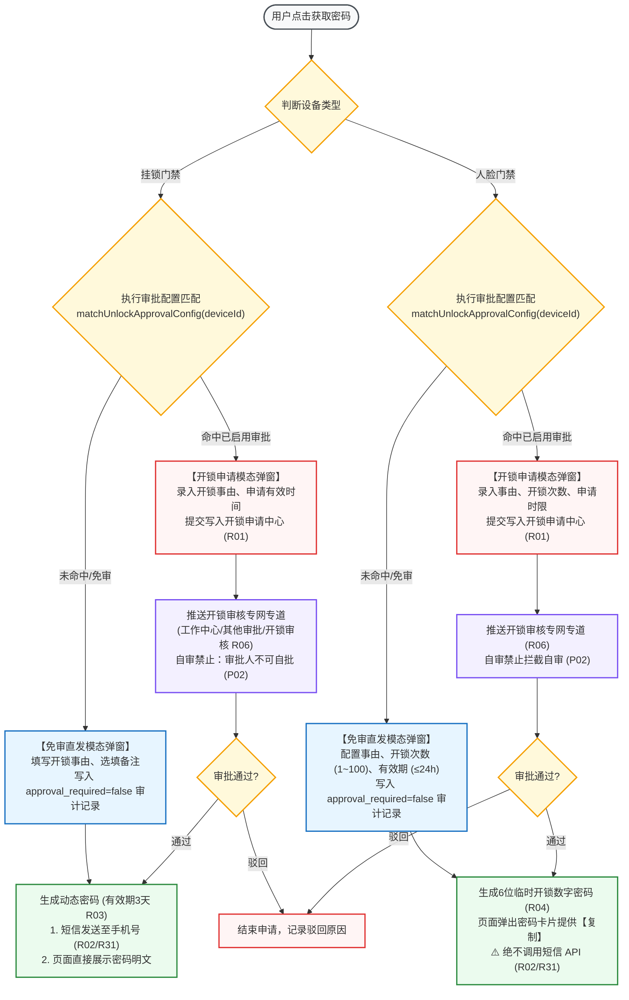

# 门禁设备业务规则规格

> **文档定位**：仓储 / 设备管理 / 门禁设备模块设备分类、双路径密码获取（免审直发 vs 审批申请）、短信发送边界（R31 挂锁支持短信 / 人脸门禁绝不调用短信 API）、人脸授权分配、设备数据调阅、移除级联解绑及不可变审计的**唯一定义真源**。主 PRD、字段清单及端侧原型仅引用本文件规则编号（R01~R10, C01~C03, P01~P02），不重复定义规则本体。  
> **模块类型**：物联网与安防门禁设备出入控制与密码核发总台账类（包含挂锁门禁与人脸门禁双形态管控、双路径开锁密码分流、开锁审核专网专道、移除全量强一致回滚）  
> **参考规范**：[《AGENTS.md §3.1 门禁设备与开锁审批专网专道》](../../../../../AGENTS.md#31-门禁设备与开锁审批专网专道)、[《门禁设备主PRD》](./门禁设备主PRD.md)、[《门禁设备字段清单》](./门禁设备字段清单.md)、[《门禁设备操作字段清单索引》](./操作字段清单/操作字段清单索引.md)  
> **版本**：V1.2 | **更新时间**：2026-09-16 | **责任人**：森云科技（Senyun Technology）

---

## 一、设备形态与操作能力矩阵

| 设备类型 | 物理形态与核心能力 | 设备数据 | 获取门锁密码 | 获取门禁密码 | 人脸配置 | 移除设备 |
| :--- | :--- | :---: | :---: | :---: | :---: | :---: |
| **挂锁门禁** | 实体挂锁/电子挂锁，控制库房大门或货柜 | ✅ | ✅ | ❌ | ❌ | ✅ |
| **人脸门禁** | 人脸识别一体机，兼具门禁与摄像头能力 | ✅ | ❌ | ✅ | ✅ | ✅ |

*服务端拦截：服务端在执行任何行操作时，必须首先强校验设备类型与操作的合法性匹配，严禁仅依赖前端隐藏按钮。*

---

## 二、双路径开锁密码获取与短信边界规则表

| 核心维度 | 挂锁门禁【获取门锁密码】 | 人脸门禁【获取门禁密码】 | 权威依据 |
| :--- | :--- | :--- | :--- |
| **统一入口** | 列表行操作【获取门锁密码】 | 列表行操作【获取门禁密码】 | AGENTS.md §3.1 规则 1 |
| **双路径判定** | 执行 `matchUnlockApprovalConfig(deviceId)`： • 命中启用审批配置 $\rightarrow$ 弹出开锁申请模态弹窗； • 未命中/免审 $\rightarrow$ 弹出免审直发模态弹窗 | 执行 `matchUnlockApprovalConfig(deviceId)`： • 命中启用审批配置 $\rightarrow$ 弹出开锁申请模态弹窗； • 未命中/免审 $\rightarrow$ 弹出免审直发模态弹窗 | AGENTS.md §3.1 规则 1 |
| **密码凭证形态** | 动态数字密码，**固定有效期 3 天** | 6 位系统唯一数字密码，可配开锁次数（1~100次）与有效期（最长 24 小时） | 【挂锁门锁密码时效与事由规则】(R03) 与 【人脸门禁开锁密码次数与有效期规则】(R04) |
| **短信发送边界** | **支持【短信发送密码】+【页面直接展示密码】** | **仅在前端页面展示临时密码卡片，绝不调用短信 API** | **AGENTS.md §3.1 规则 2 (R31)** |
| **审批流专网专道** | 挂载于「工作中心 → 审批中心 → 其他审批 → 开锁审核」，不进通用待处理池；**自审禁止（P06/R11）** | 挂载于「工作中心 → 审批中心 → 其他审批 → 开锁审核」，不进通用待处理池；**自审禁止（P06/R11）** | AGENTS.md §3.1 规则 3 |

---

## 三、全景业务时序与流转架构

### 3.1 门禁密码双路径获取与开锁闭环流程图

---

## 四、核心业务规则清单 (R01 ~ R10)

### 1. 密码获取与安全边界规则

### 【双路径开锁密码获取与免审/审批分流规则】(R01)
* 用户点击行操作【获取门锁密码】（挂锁）或【获取门禁密码】（人脸）为统一密码获取入口；
* 系统执行 `matchUnlockApprovalConfig(deviceId)` 进行规则命中判定：
  1. **命中已启用审批配置**：居中弹出 `UnlockApplySubmitDialog` 发起申请模态弹窗，用户录入开锁事由及相关参数后提交，单据写入“我的开锁申请”并在详情提供 Deep link，状态流转为“待审批”；
  2. **未命中审批配置 / 免审**：居中弹出免审直发模态弹窗，录入必要事由后直接生成临时密码，写入 `approval_required=false` 开锁记录供事后审计。

### 【短信发送边界与挂锁/人脸设备隔离规则】(R02)
* 严格遵循 **R31 短信下发边界规范**：
  1. **挂锁门禁**：免审直发或审批通过后，系统**同时支持【短信发送密码】与【页面直接展示密码】**，短信下发至登录用户绑定的手机号码；
  2. **人脸门禁**：无论是免审直发还是审批通过，生成的 6 位临时开锁密码**仅在前端页面展示密码卡片**供用户一键复制，**绝不调用短信 API**。

### 【挂锁门锁密码时效与事由规则】(R03)
* 挂锁门禁获取门锁密码时，开锁事由为强制必填项，选填备注说明；
* 挂锁生成的动态密码固定有效期为 **3 天（72 小时）**，超期后密码自动物理作废；
* 密码明文仅在弹窗内短暂展示，弹窗关闭后页面不留存明文，日志中严禁明文打印。

### 【人脸门禁开锁密码次数与有效期规则】(R04)
* 人脸门禁获取临时开锁密码时，必须配置以下三项核心参数：
  1. `开锁事由`：单行文本输入框，必填；
  2. `开锁次数`：正整数数值输入框，取值范围为 **1 ~ 100 次**，默认值为 1 次；
  3. `有效期`：下拉单选框，最长不得超过 **24 小时**（可选：1小时、2小时、6小时、12小时、24小时）；
* 校验通过后生成 6 位系统唯一数字密码，在页面弹出专属卡片，提供【复制】按钮并支持点击眼睛图标查看明文。

### 2. 人脸授权与审批专网专道规则

### 【人脸配置平铺授权与凭证准入规则】(R05)
* 仅人脸门禁行展示【人脸配置】操作；点击后在当前页面平铺展开人脸管理视图（不发生跨页面路由跳转）；
* **授权准入白名单**：人员必须已完成“人脸状态”已录入或“开锁密码”已录入至少一项凭证采集，且系统账号处于“启用”状态，方可出现在该设备授权分配列表中；
* **终端下发强一致性**：切换授权 Switch 开关时二次弹窗确认，确认后向门禁硬件下发凭证；**下发失败即最终失败**，系统不进行离线挂起或自动重试，Switch 状态即刻回滚并提示“授权下发失败，请检查门禁设备网络”。

### 【开锁审批专网专道与自审禁止规则】(R06)
* **专网专道**：开锁审批单据挂载于「工作中心 → 审批中心 → 其他审批 → 开锁审核」，**不接入系统常规流程引擎**，不进入通用待处理任务池，专网专道保障高频开锁实时响应；
* **自审禁止（P06/R11）**：审批人不可审批自己发起的开锁申请单；本人发起的单据底部仅展示【详情】，不提供【去处理】或【去审批】按钮。

### 3. 设备数据与关联穿透规则

### 【设备数据只读穿透与无权修改规则】(R07)
* 点击【设备数据】弹窗包含两个标签页（Tab）：【事务记录】与【预警记录】；
* 弹窗内数据为当前设备只读客观流水，不提供人工编辑、删除或作废入口；
* 预警记录的处理与解除必须跳转至「风险-设备预警信息」模块按标准闭环处置。

### 4. 级联移除与重入清空规则

### 【移除设备全链路解绑与强一致回滚规则】(R08)
* 用户执行【移除设备】时必须强制录入不少于 5 字的原因说明；
* 确认移除后，系统在分布式事务控制下级联执行全链路解绑：
  1. **人脸授权解绑**：同步删除该设备在【人脸配置】模块中的所有授权关系，下发撤销凭证指令；
  2. **订单设备解绑**：解除该设备与所有在押抵质押/监管订单的绑定；
  3. **风险预警规则失效**：注销设备预警规则并使未结案风险记录失效；
  4. **事务通知解绑**：注销设备离线与开门通知配置；
  5. **仓库物理位置解绑**：清空与仓库、库房、分区的绑定；
* **全量回滚语义**：任一联动子步骤失败执行全量回滚，设备保留在有效列表中，严禁产生部分成功。

### 【设备防重复提交与并发控制规则】(R09)
* 获取门锁密码与门禁密码操作，基于 `设备编码 + 操作人账号 + 请求时间戳` 实施防重控制，**同一操作人在 60 秒内禁止对同一门禁设备重复发起密码获取请求**；
* 设备重命名、仓库绑定及移除设备引入数据版本号控制，并发冲突时阻断提交。

### 【不可变安全审计快照规则】(R10)
* 审计日志必须完整记录：操作人、角色、所属机构、操作时间、设备编码、设备类型、开锁事由、参数摘要、短信发送结果及操作结果；
* **密码安全红线**：开锁密码明文及人脸照片二进制原文**绝对禁止写入系统审计日志与运行日志**。

---

## 五、异常控制与阻断规则 (C01 ~ C03)

### 【审批驳回或未通过】(C01)
* 开锁申请被审批人驳回时，申请状态更新为“已驳回”，向申请人发送审批结果通知，系统不生成任何开锁密码。

### 【第三方门禁离线或下发失败】(C02)
* 门禁设备处于离线状态时，授权下发或开锁指令下发直接返回失败，提示“设备处于离线状态，指令下发失败”，Switch 状态自动回滚。

### 【跨模块级联回滚异常】(C03)
* 移除设备过程中，若外部服务网络超时导致事务异常，触发全量回滚并向技术支撑团队发送告警。

---

## 六、数据权限与风控约束规则 (P01 ~ P02)

### 【租户与机构物理隔离】(P01)
* 门禁设备台账严格按登录租户与所属机构数据权限隔离，跨租户设备物理阻断。

### 【自审禁止风控约束】(P02)
* 严格执行 P06 自审禁止原则：审批人账号与申请人账号相同时，系统强制屏蔽审批操作按钮，确保内控双人原则落实。

---

## 七、修订记录

| 日期 | 版本 | 变更内容说明 | 影响范围 | 修订人 |
| :--- | :--- | :--- | :--- | :--- |
| 2026-08-14 | V1.0 | 建立门禁设备业务规则规格初稿：规范挂锁与人脸门禁差异、密码获取及设备数据。 | 门禁设备全模块 | 产品研发组 |
| 2026-08-20 | V1.1 | 合并原业务流程说明，补充全量回滚与人脸平铺授权规则。 | 异常与联动处理 | 产品研发组 |
| 2026-09-16 | **V1.2** | **业务真源重构与编号自解释汉化**： 1. 严格落实 AGENTS.md §3.1 规范：建立双路径密码获取机制（免审直发 vs 审批申请）与专网专道； 2. 确立 R31 短信发送边界铁律：挂锁门禁支持短信+页面展示，**人脸门禁绝不调用短信 API**； 3. 提炼自解释业务规则（R01~R10, C01~C03, P01~P02）； 4. 全面汉化交互术语（单行文本输入框、模态弹窗、警告弹窗等），英文专有名词规范标注 `中文（English）`。 | 全文表述规范性与业务真源对齐 | AI PM / 森云科技 |
