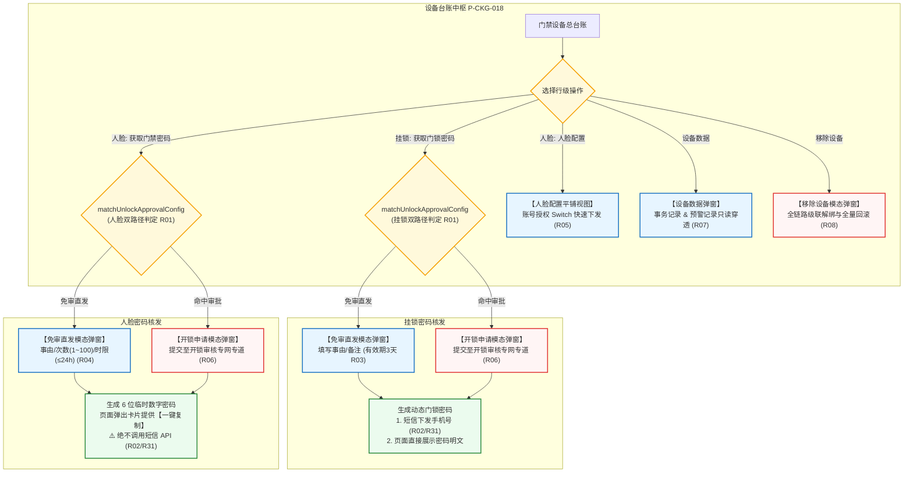

# 门禁设备主PRD

> **模块定位**：仓储 / 设备管理 / 门禁设备模块是供应链金融动产质押与第三方监管体系中出入防线控制、物理门禁与身份识别开锁的统一调度总中枢。本模块集中纳管实体挂锁门禁与人脸门禁一体机两大物理形态设备，维护空间层级绑定，提供双路径开锁密码获取机制（命中审批 vs 免审直发）、严格执行 R31 短信下发边界（挂锁支持短信 / 人脸门禁绝不调用短信 API）、支持人脸授权现场快速分配与设备数据穿透，并在设备故障移除时执行全链路强一致级联解绑。  
> **版本**：V1.9 | **更新时间**：2026-09-16 | **责任人**：森云科技（Senyun Technology）  
> **编写依据**：[《AGENTS.md §3.1 门禁设备与开锁审批专网专道》](../../../../../AGENTS.md#31-门禁设备与开锁审批专网专道) 是本模块开锁双路径与短信边界的最高业务真源；[《门禁设备字段清单》](./门禁设备字段清单.md) 是主数据与系统字段的唯一基准；行操作由 [《门禁设备操作字段清单索引》](./操作字段清单/操作字段清单索引.md) 维护；[《门禁设备业务规则规格》](./门禁设备业务规则规格.md) 是核心业务规则与状态控制的唯一来源。

---

## 1. 业务背景与核心痛点

### 1.1 业务背景
在动产质押与仓储监管业务中，实体库房、冷库大门及特定质押标的物理存放区域必须设置严密的出入管控屏障。系统根据硬件形态纳管**挂锁门禁**（电子挂锁，用于大门、柜门）与**人脸门禁**（人脸识别终端，兼具开锁与视频监控摄像头能力）两大类别。

为保障货权在库绝对安全，系统必须实现严格的开锁权限分流：高风险库区命中审批规则时必须经过专网专道审批授权，常规合规作业支持免审直发，同时所有开关锁行为均全路径留存不可变客观事务流水，确保司法审计防篡改。

### 1.2 核心业务痛点
1. **开锁审批缺乏专网专道，响应迟缓**：若开锁申请混入常规业务审批池，现场提货与巡检人员常常因漫长审批等待导致仓储作业严重滞后；
2. **短信发送边界不清晰，引发安全隐患**：人脸门禁由于其硬件与现场使用特性，若通过短信外发密码极易引发泄密与越权代打卡风险，必须严格确立短信物理边界；
3. **现场人脸授权配置链路过长**：监管员在现场为临时作业人员开通人脸权限时，跨模块跳转导致效率低下，亟需当前设备上下文下的平铺快速授权能力；
4. **设备下线解绑不彻底**：门禁拆除或更换后，遗留的人脸授权或在押订单关联极易引发非法出入或系统误报。

---

## 2. 功能范围 (Scope)

| 包含功能（已纳入范围） | 不包含功能（超出范围） |
| :--- | :--- |
| - **门禁设备总台账与组合检索**：支持按设备名称（系统内名称）、设备类型（挂锁门禁/人脸门禁）、设备状态（在线/离线）、仓库、绑定状态 5 大核心维度组合查询； - **挂锁与人脸形态差异化操作控制**： &nbsp;&nbsp;1. 挂锁门禁：开放【获取门锁密码】（固定有效期 3 天，支持短信发送与页面展示）； &nbsp;&nbsp;2. 人脸门禁：开放【获取门禁密码】（6位数字密码卡片，最大100次与24小时有效期，**绝不调用短信 API**）及【人脸配置】（平铺视图快捷授权）； - **双路径开锁密码获取机制**：系统自动执行 `matchUnlockApprovalConfig(deviceId)`，智能分流“免审直发”与“审批申请”，无缝对接开锁审核专网专道； - **设备数据只读穿透调阅**：弹窗内切换【事务记录】（开关锁日志）与【预警记录】Tab，只读客观呈现； - **移除设备全链路级联解绑**：强制录入移除原因，级联注销人脸授权、在押订单绑定、预警规则及仓库绑定，任一失败全量强一致回滚； - **轮询重入与配置清空**：每 5 分钟轮询三方接口，重入仅恢复基础硬件识别信息，系统配置与授权凭证清空。 | - **门禁设备底层固件通信与网络注册**：硬件底层协议解析由第三方门禁网关处理； - **人脸生物特征底库原始文件存储**：底层人脸特征向量提取与对齐由独立算法服务托管； - **门禁预警人工处置与解除**：预警处置归属于「设备预警信息」模块； - **通用流程引擎与审批流配置**：开锁审批专网专道运行，不接入通用待处理任务池。 |

---

## 3. 模块架构与业务链路

---

## 4. 业务场景与用户故事

| 场景编号 | 业务场景 | 触发角色 | 核心交互与风控约束 | 业务价值 |
| :--- | :--- | :--- | :--- | :--- |
| **场景 1【现场挂锁开锁密码获取（免审直发/审批申请）】(S01)** | 现场挂锁开锁密码获取（免审直发/审批申请） | 现场监管员 / 仓储作业员 | 监管员需进入 1 号仓库进行日常巡检，点击挂锁门禁【获取门锁密码】。系统匹配审批规则：若未命中审批则直接弹出免审直发窗口，录入事由“日常巡检”，系统生成动态密码并短信下发至手机，页面同步展示密码（有效期 3 天）；若命中审批则唤起申请弹窗提交审核。遵循【双路径开锁密码获取与免审/审批分流规则】(R01) 与【短信发送边界与挂锁/人脸设备隔离规则】(R02)。 | 兼顾作业高频流转效率与敏感库区严格内控。 |
| **场景 2【人脸门禁临时开锁密码获取与复制】(S02)** | 人脸门禁临时开锁密码获取与复制 | 外部质检员 / 现场监管专员 | 外部质检员需进入冷库抽样，现场监管员在人脸门禁行点击【获取门禁密码】。录入事由“质检验收”、开锁次数“2次”、有效期“2小时”。确认后，系统生成 6 位临时数字密码并在前端弹出卡片，监管员点击【复制】并口头告知质检员。系统坚决不向外部人员调用短信 API。遵循【人脸门禁开锁密码次数与有效期规则】(R04) 与 R31 铁律。 | 杜绝短信密码扩散泄密风险，实现受限开锁时空精准控制。 |
| **场景 3【人脸门禁开门权限快速授权分配】(S03)** | 人脸门禁开门权限快速授权分配 | 仓储安全管理员 | 仓库新调入两名装卸工，管理员点击该人脸门禁的【人脸配置】操作。系统直接在当前页面展开平铺视图展示可分配账号列表，管理员找到对应装卸工（已录入人脸凭证），开启授权 Switch 开关。终端下发成功后即刻生效通行。遵循【人脸配置平铺授权与凭证准入规则】(R05)。 | 免去跨页面跳转换屏成本，现场即时完成授权分发。 |
| **场景 4【门禁开关锁事务与预警数据穿透查验】(S04)** | 门禁开关锁事务与预警数据穿透查验 | 资方风控稽核专员 / 仓储总监 | 针对发生非工作时段门锁开启告警的库房，稽核专员点击【设备数据】。在弹窗内切换【事务记录】查验当时刷卡或密码开锁记录，切换【预警记录】查验告警流水快照。数据均为客观只读。遵循【设备数据只读穿透与无权修改规则】(R07)。 | 穿透现场物理安全作业流水，为异常出入提供不可辩驳的审计证据。 |
| **场景 5【报废门禁设备移除与跨模块强一致解绑】(S05)** | 报废门禁设备移除与跨模块强一致解绑 | 设备运维人员 / 仓储主管 | 某门禁损坏报废，运维人员点击【移除设备】，录入必填说明“主板损坏拆机更换”。确认后，系统在分布式事务控制下级联解除人脸授权、解绑在押订单、注销预警规则并清空仓库绑定。任一失败全量回滚。遵循【移除设备全链路解绑与强一致回滚规则】(R08)。 | 彻底消除孤儿授权与废弃硬件带来的系统安全漏洞。 |

---

## 5. 页面交互规格说明

### 5.1 门禁设备主列表页（`P-CKG-018`）
* **页面路径**：`工作台 → 仓储 → 设备管理 → 门禁设备`
* **筛选查询区排布**：
  - 横向排布 5 项筛选控件：
    1. 设备名称（单行文本输入框，提示“请输入设备名称”，实际查询系统内名称）；
    2. 设备类型（下拉单选框，默认全部，枚举：`挂锁门禁`、`人脸门禁`）；
    3. 设备状态（下拉单选框，默认全部，枚举：`在线`、`离线`）；
    4. 仓库（下拉单选框，根据登录用户仓库数据权限返回）；
    5. 绑定状态（下拉单选框，默认全部，枚举：`已绑定`、`未绑定`）；
  - 右侧配置橙黄色实心【查询】按钮与【重置】按钮。
* **数据表格呈现（10 列）**：
  - 序号、设备原名称、系统内名称、设备编码、设备类型、绑定仓库、具体位置、修改人员、更新时间、操作；
  - 绑定状态仅作为筛选项，不参与列表展示排序；
  - 操作列严格根据设备类型差异化呈现：
    - **挂锁门禁行**：【重命名】、【仓库绑定】、【设备数据】、【获取门锁密码】、【移除设备】；
    - **人脸门禁行**：【重命名】、【仓库绑定】、【设备数据】、【获取门禁密码】、【人脸配置】、【移除设备】。

---

### 5.2 密码获取双路径与弹窗交互规格

#### 5.2.1 挂锁门禁【获取门锁密码】
1. 点击操作列【获取门锁密码】，系统执行 `matchUnlockApprovalConfig(deviceId)`：
   - **命中已启用审批配置**：居中弹出开锁申请模态弹窗，录入事由后提交写入开锁审核专网专道；
   - **未命中 / 免审**：居中弹出“获取门锁密码提示”免审弹窗；
2. **表单控件**：
   - `* 开锁事由`：下拉单选框，必填，枚举：`出库`、`入库`、`移库`、`参观`、`其他`；
   - `备注`：多行文本输入框，选填，最多 50 字符；
3. **提交与短信下发**：
   - 点击确认后，系统向登录账号绑定的手机号码发送密码短信，并在页面弹窗中展示动态密码明文及“有效期 3 天”提示，遵循【挂锁门锁密码时效与事由规则】(R03) 与【短信发送边界与挂锁/人脸设备隔离规则】(R02)。

#### 5.2.2 人脸门禁【获取门禁密码】
1. 点击操作列【获取门禁密码】，系统执行 `matchUnlockApprovalConfig(deviceId)` 智能分流；
2. **免审配置表单控件**：
   - `* 开锁事由`：单行文本输入框，必填，最多 50 字符；
   - `* 开锁次数`：正整数数字输入框，必填，取值范围 `1 ~ 100` 次，默认 `1` 次；
   - `* 有效期`：下拉单选框，必填，最长 `24 小时`（枚举：1小时、2小时、6小时、12小时、24小时）；
   - `备注`：多行文本输入框，选填，最多 50 字符；
3. **卡片展示与短信红线**：
   - 点击确认后，系统在页面中央弹出“临时开锁密码”卡片，展示 6 位系统唯一数字密码、开锁次数及有效时限，并提供【复制】主按钮；
   - **绝不调用短信发送 API**，完全遵循 R31 短信边界铁律与【人脸门禁开锁密码次数与有效期规则】(R04)。

---

### 5.3 【人脸配置】平铺授权交互规格
* **触发方式**：点击人脸门禁行【人脸配置】操作，**当前页面不发生跳转**，直接在当前页面平铺展开人脸授权管理视图；
* **平铺视图布局**：
  - 顶部标题为 `人脸管理`；左侧展示当前设备名称与编码；
  - 右侧提供“人员名称”模糊搜索单行文本输入框与【查询】按钮；
  - 若无分配人员，展示空态提示：“*❓ 未找到可分配的用户 前往管理页面 ❯*”，点击跳转至独立人脸配置模块；
* **人员列表与开关授权**：
  - 仅展示已录入人脸或开锁密码且账号启用的合规人员，已授权人员排在最前；
  - 切换操作列的开门权限 Switch 开关时，居中弹出二次确认提示框；
  - 确认后向硬件终端下发指令，终端离线或下发失败直接判定为失败，Switch 状态即刻回滚并提示报错，遵循【人脸配置平铺授权与凭证准入规则】(R05)。

---

### 5.4 【设备数据】弹窗交互规格
* **触发方式**：点击操作列【设备数据】链接，居中呼出模态弹窗；
* **双 Tab 结构**：
  - **事务记录 Tab**：以表格呈现当前门禁设备的开关锁流水（操作时间、操作人员、验证方式、开锁状态等），纯只读展示；
  - **预警记录 Tab**：以表格呈现当前门禁设备触发的安防预警流水（预警时间、预警类型、预警描述、处理状态等），只读展示，不提供修改状态入口，遵循【设备数据只读穿透与无权修改规则】(R07)。

---

### 5.5 【移除设备】模态弹窗与全链路回滚规格
* **触发方式**：点击操作列【移除设备】链接呼出模态弹窗；
* **表单内容**：
  - 显著标红展示风险提示文案；
  - `* 移除说明`：多行文本输入框，必填，录入 5~200 字说明；
* **全链路强一致解绑**：
  - 点击确认后，系统级联解绑人脸授权、在押订单、预警规则及仓库位置；
  - **任一子联动失败执行全量回滚**，设备保留在有效列表中，严禁产生部分成功，遵循【移除设备全链路解绑与强一致回滚规则】(R08) 与【跨模块级联回滚异常】(C03)。

---

## 6. 核心业务规则索引

| 规则大类 | 规则编码与自解释名称 | 核心逻辑摘要 | 详细真源指向 |
| :--- | :--- | :--- | :--- |
| **密码分流** | 【双路径开锁密码获取与免审/审批分流规则】(R01) | 点击获取密码智能匹配审批规则，分流免审直发与申请弹窗 | [业务规则规格 §4.1](./门禁设备业务规则规格.md#1-密码获取与安全边界规则) |
| **短信边界** | 【短信发送边界与挂锁/人脸设备隔离规则】(R02) | 挂锁支持短信+页面；人脸门禁仅页面展示卡片，绝不调短信 API (R31) | [业务规则规格 §4.1](./门禁设备业务规则规格.md#1-密码获取与安全边界规则) |
| **密码时效** | 【挂锁门锁密码时效与事由规则】(R03) | 必选事由，选填备注，动态密码固定有效期 3 天，日志不存明文 | [业务规则规格 §4.1](./门禁设备业务规则规格.md#1-密码获取与安全边界规则) |
| **密码参数** | 【人脸门禁开锁密码次数与有效期规则】(R04) | 必选事由，次数 1~100，有效期 $\le 24$h，生成 6 位唯一数字密码并支持复制 | [业务规则规格 §4.1](./门禁设备业务规则规格.md#1-密码获取与安全边界规则) |
| **人脸授权** | 【人脸配置平铺授权与凭证准入规则】(R05) | 当前页平铺展开；仅限有凭证且启用账号；下发失败即最终失败回滚 | [业务规则规格 §4.2](./门禁设备业务规则规格.md#2-人脸授权与审批专网专道规则) |
| **审批专道** | 【开锁审批专网专道与自审禁止规则】(R06) | 挂载于审批中心其他审批，不进通用池；P06/R11 拦截本人自审 | [业务规则规格 §4.2](./门禁设备业务规则规格.md#2-人脸授权与审批专网专道规则) |
| **数据穿透** | 【设备数据只读穿透与无权修改规则】(R07) | 事务记录与预警记录客观呈现，无编辑删除入口，预警处置归属风险模块 | [业务规则规格 §4.3](./门禁设备业务规则规格.md#3-设备数据与关联穿透规则) |
| **级联解绑** | 【移除设备全链路解绑与强一致回滚规则】(R08) | 必填说明；级联解除人脸授权/订单/预警/仓库；任一失败全量回滚 | [业务规则规格 §4.4](./门禁设备业务规则规格.md#4-级联移除与重入清空规则) |
| **防重控制** | 【设备防重复提交与并发控制规则】(R09) | 60 秒内同一人同设备防重复提交；数据版本控制防并发冲突 | [业务规则规格 §4.4](./门禁设备业务规则规格.md#4-级联移除与重入清空规则) |
| **安全审计** | 【不可变安全审计快照规则】(R10) | 全息记录参数与前后快照；密码明文与人脸原文绝对禁止入日志 | [业务规则规格 §4.4](./门禁设备业务规则规格.md#4-级联移除与重入清空规则) |
| **异常控制** | 【审批驳回或未通过】(C01) | 开锁申请驳回时更新状态并通知申请人，系统不生成开锁密码 | [业务规则规格 §5](./门禁设备业务规则规格.md#五异常控制与阻断规则-c01--c03) |
| **异常控制** | 【第三方门禁离线或下发失败】(C02) | 设备离线时指令下发失败，Switch 状态即刻回滚 | [业务规则规格 §5](./门禁设备业务规则规格.md#五异常控制与阻断规则-c01--c03) |
| **异常控制** | 【跨模块级联回滚异常】(C03) | 移除设备级联失败触发全量回滚并产生告警留痕 | [业务规则规格 §5](./门禁设备业务规则规格.md#五异常控制与阻断规则-c01--c03) |
| **数据隔离** | 【租户与机构物理隔离】(P01) | 严格按登录租户与机构数据隔离，跨租户物理阻断 | [业务规则规格 §6](./门禁设备业务规则规格.md#六数据权限与风控约束规则-p01--p02) |
| **风控约束** | 【自审禁止风控约束】(P02) | 严格执行 P06 自审禁止，申请人不可自批自己发起的开锁申请 | [业务规则规格 §6](./门禁设备业务规则规格.md#六数据权限与风控约束规则-p01--p02) |

---

## 7. 权限矩阵（RBAC）

| 角色类型 | 查看列表 | 获取门锁密码 (挂锁) | 获取门禁密码 (人脸) | 人脸配置授权 | 设备数据调阅 | 移除设备 |
| :--- | :---: | :---: | :---: | :---: | :---: | :---: |
| **系统超级管理员** | ✅ | ✅ | ✅ | ✅ | ✅ | ✅ |
| **仓储设备安全主管** | ✅ | ✅ | ✅ | ✅ | ✅ | ✅ |
| **现场监管/巡检专员** | ✅ | 仅本人/免审 | 仅本人/免审 | ❌ | ✅ (只读) | ❌ |
| **资方合规风控员** | ✅ (只读) | ❌ | ❌ | ❌ | ✅ (只读) | ❌ |

---

## 8. 非功能性需求 (NFR)

1. **核发与下发时效**：
   - 门锁/门禁免审直发生成密码响应时间 $\le 1.0$ 秒；
   - 挂锁短信网关发送响应时间 $\le 3.0$ 秒（外部短信服务商正常 SLA 下）；
   - 人脸授权下发至门禁硬件响应确认时间 $\le 2.0$ 秒。
2. **高可用与事务一致性**：
   - 开锁审批专网专道独立部署，服务可用性不低于 $99.95\%$，保障现场开锁高频畅通；
   - 移除设备涉及跨模块调用的强一致回滚成功率 $100\%$。
3. **敏感信息与安全合规**：
   - 密码生成基于加密安全的伪随机数生成器（CSPRNG），人脸临时密码 6 位全系统唯一；
   - 密码明文与人脸原始图像绝对禁止持久化保存于日志系统或明文传输；
   - 实施严格的 60 秒防刷频控，防范短信轰炸与密码爆破。

---

## 9. 验收标准与交付清单

1. **设备分类与行操作精准分流**：
   - 挂锁门禁行展示【获取门锁密码】，绝不展示【获取门禁密码】与【人脸配置】；
   - 人脸门禁行展示【获取门禁密码】与【人脸配置】，绝不展示【获取门锁密码】；
2. **双路径开锁与短信边界验收**：
   - 挂锁门禁获取密码支持短信发送与页面展示（有效期 3 天）；
   - 人脸门禁获取密码弹出临时卡片支持一键复制，**网络请求与日志中绝无短信 API 调用**；
   - 命中审批配置时准确弹出开锁申请窗口，提交后进入开锁审核专网专道，自审禁止正常拦截；
3. **人脸配置平铺授权**：
   - 点击人脸配置在当前页面平铺展示，Switch 开关操作二次确认；终端离线时准确回滚开关；
4. **移除设备强一致回滚**：
   - 必填说明校验有效；全链路解绑成功后移出有效列表；模拟任一子服务异常时全量回滚成功。

---

## 10. 修订记录

| 日期 | 版本 | 变更内容说明 | 影响范围 | 修订人 |
| :--- | :--- | :--- | :--- | :--- |
| 2026-08-07 | V1.0 | 新增门禁设备主需求文档，定义挂锁与人脸门禁差异、密码获取及设备数据。 | 门禁设备全模块 | 产品研发组 |
| 2026-08-14 | V1.8 | 统一移除设备全量回滚口径；明确未绑定设备仓库字段返回空值；确认移动端支持范围。 | 异常与联动处理 | 产品研发组 |
| 2026-09-16 | **V1.9** | **业务真源重构与编号自解释汉化**： 1. 严格落实 AGENTS.md §3.1 规范：建立双路径密码获取机制（免审直发 vs 审批申请）与专网专道； 2. 严格确立 R31 短信发送边界铁律：挂锁门禁支持短信+页面展示，**人脸门禁绝不调用短信 API**； 3. 规范建立业务场景 `场景 N【业务场景名称】(Sxx)` 体系； 4. 补充第 6 节核心业务规则索引与第 8 节非功能性需求，全量对齐自解释编号（R01~R10, C01~C03, P01~P02）； 5. 全面汉化交互术语（单行文本输入框、下拉单选框、模态弹窗、警告弹窗等），英文专有名词规范标注 `中文（English）`。 | 门禁设备全模块规格标准化与业务真源对齐 | AI PM / 森云科技 |
