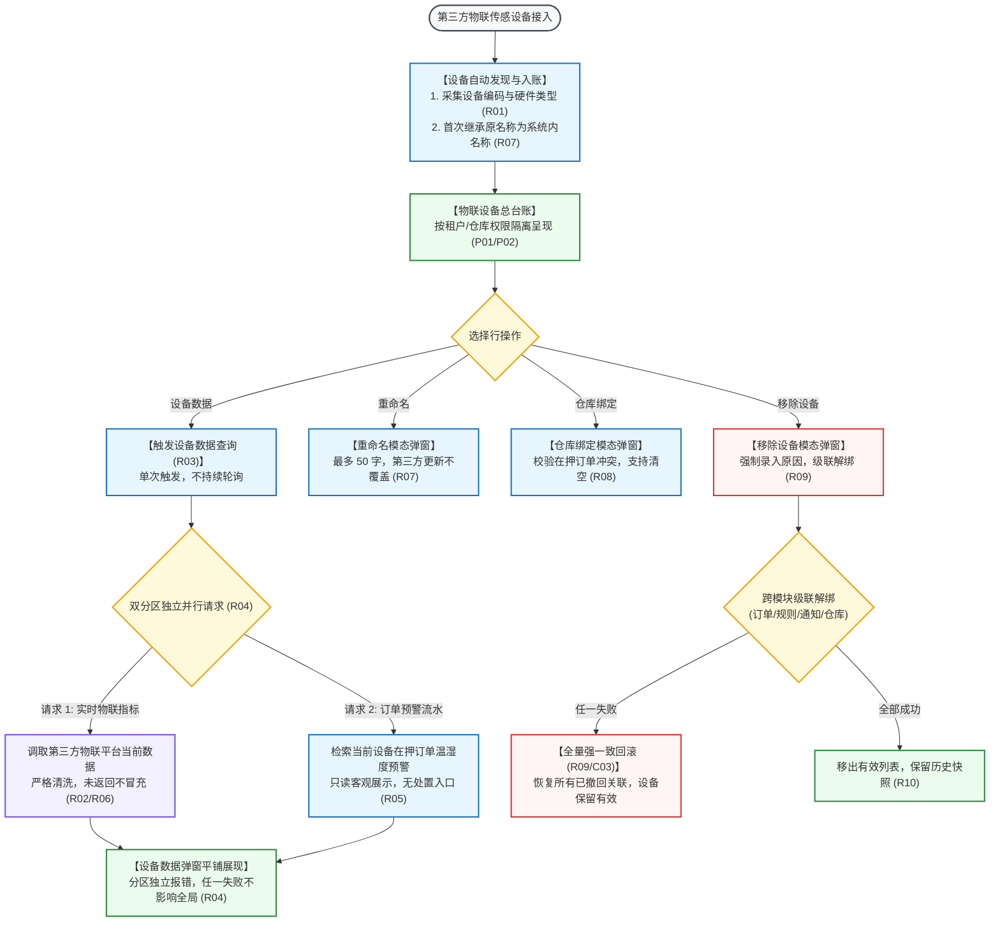

# 物联设备业务规则规格

> **文档定位**：仓储 / 设备管理 / 物联设备模块设备类型判定、多维环境指标采集、实时数据防伪冒充、订单温湿度预警穿透、空间层级绑定、级联移除与强一致回滚的**唯一定义真源**。主 PRD、字段清单及端侧原型仅引用本文件规则编号（R01~R10, C01~C03, P01~P02），不重复定义规则本体。  
> **模块类型**：物联网环境传感设备基础数据与环境监测总台账类（包含温湿度/气体/烟感多品类设备纳管、单次实时拉流无轮询、分区独立加载容错、移除全量强一致回滚）  
> **参考文档**：[《物联设备主PRD》](./物联设备主PRD.md)、[《物联设备字段清单》](./物联设备字段清单.md)、[《物联设备操作字段清单索引》](./操作字段清单/操作字段清单索引.md)  
> **版本**：V1.2 | **更新时间**：2026-09-16 | **责任人**：森云科技（Senyun Technology）

---

## 一、设备类型与采集指标能力矩阵

| 设备类型 | 适用物理场景 | 实时采集指标范围 | 预警生成规则归属 | 页面展现逻辑 |
| :--- | :--- | :--- | :--- | :--- |
| **温度设备** | 冷藏库、恒温库、冻肉库 | 温度（℃） | 订单温湿度预警规则 | 仅展示温度数值卡片 |
| **湿度设备** | 粮食仓、中药材库、橡胶仓 | 湿度（%RH） | 订单温湿度预警规则 | 仅展示湿度数值卡片 |
| **二氧化碳设备** | 气调保鲜仓、果蔬储藏室 | 二氧化碳浓度（ppm） | 当前只展示指标，暂不生成预警 | 仅展示二氧化碳数值卡片 |
| **氧气设备** | 充氮降氧保鲜仓 | 氧气含量（%） | 当前只展示指标，暂不生成预警 | 仅展示氧气数值卡片 |
| **烟感设备** | 仓库防火安全监测 | 烟雾报警状态（正常/报警） | 当前只展示状态，暂不生成预警 | 展示烟雾感知状态 |
| **多功能设备** | 复合型高精尖传感节点 | 包含上述两种及以上指标 | 按指标分流处理 | 组合平铺展示实际返回的全部有效指标 |

*多功能判定：多功能设备只展示第三方平台本次实际返回的指标项；未返回的指标项必须显式展示为“暂无数据”，严禁使用历史缓存值冒充当前实时数据。*

---

## 二、指标口径、精度与数据清洗表

| 监测指标 | 计量单位 | 显示精度 | 数据有效区间 | 异常值处理策略 |
| :--- | :---: | :---: | :---: | :--- |
| **环境温度** | ℃ | 保留 1 位小数（如 `-18.5℃`） | $-50.0\text{℃} \sim +80.0\text{℃}$ | 越界、空值或非数字标记为【数据异常】，不参与风控计算 |
| **环境湿度** | %RH | 保留 1 位小数（如 `65.2%RH`） | $0.0\% \sim 100.0\%$ | 越界或传感器故障时标记为【数据异常】 |
| **二氧化碳** | ppm | 整数（如 `450 ppm`） | $0 \sim 10000\text{ ppm}$ | 超量程展示上限标记，不伪造数据 |
| **氧气浓度** | % | 保留 1 位小数（如 `20.9%`） | $0.0\% \sim 30.0\%$ | 超出理论空气范围标记为【数据异常】 |
| **烟雾感应** | 状态枚举 | 枚举标签 | `正常`、`报警`、`故障` | 收到报警或故障状态时醒目高亮展示 |

---

## 三、全景业务时序与流转架构

---

## 四、核心业务规则清单 (R01 ~ R10)

### 1. 设备类型与采集指标规则

### 【物联设备类型与多指标采集规则】(R01)
* 物联设备涵盖温度、湿度、二氧化碳、氧气、烟感及多功能设备 6 大分类；
* 系统的界面卡片排布严格依据当前硬件返回的真实指标项动态展开，不同物理指标执行独立的单位、量程与精度格式化展示。

### 【实时数据实际返回与不冒充历史值规则】(R02)
* 点击【设备数据】调阅时，系统必须展示第三方物联平台本次网络请求实际返回的实时数值；
* 若第三方接口未返回某项指标，界面该指标卡片必须明确展示为“*暂无数据*”，**严禁使用上一次的历史缓存数据或旧值冒充当前实时结果**，防范虚假读数引发合规风险。

### 【设备数据单次请求与不轮询规则】(R03)
* 用户进入【设备数据】弹窗时，系统向服务端发起单次数据请求；
* 本期系统**不建立前台后台持续轮询机制，页面不自动刷新**；用户需获取最新指标时，需关闭弹窗重新进入或点击页面手动刷新按钮。

### 2. 容错加载与预警穿透规则

### 【当前指标与预警分区独立加载容错规则】(R04)
* 【设备数据】页面划分为“当前物联数据”与“订单温湿度预警记录”两个完全独立的展示分区；
* 两个分区在服务端与前端采用独立异步加载与错误边界隔离：
  - 若第三方物联平台接口超时或报错，当前数据区展示“获取数据失败”，预警记录区正常展示在押订单预警流水；
  - 若预警服务不可用，不影响当前实时指标卡片的正常渲染，**任一分区失败不影响另一分区的正常呈现**。

### 【订单温湿度预警只读穿透规则】(R05)
* 设备数据弹窗中列出的温湿度预警记录，为当前设备绑定至抵质押订单期间产生的客观告警流水（包含预警时间、预警类型、监测数值、设限阈值、处理状态、处理人及处理机构）；
* 本页面定位为纯只读穿透查验，**不设预警确认、解除结案或情况说明录入入口**；处置动作严格归属于「设备预警信息」或「押品预警信息」模块。

### 【物联指标异常值与数据清洗规则】(R06)
* 接收第三方物联平台推送的数据时，系统执行有效区间校验：
  - 遇到数值为 `null`、`NaN`、格式非法、物理超量程或时间戳无效的数据时，系统统一清洗标记为【数据异常】；
  - 异常数据不进入风控预警引擎的超温超湿判定模型，避免因传感器硬件故障引发虚假告警。

### 3. 设备维护与级联移除规则

### 【物联设备命名继承与重命名保护规则】(R07)
* 首次接入时系统内名称默认继承第三方平台的设备原名称；
* 用户在系统内对物联设备执行【重命名】保存后，第三方平台后续同步的名称更新不得覆盖人工维护的系统内名称；名称长度限制 $\le 50$ 字符。

### 【仓库位置绑定与有效订单阻断规则】(R08)
* 设备支持绑定至实体仓库、库房及分区；
* 保存绑定关系前，服务端必须强校验该设备是否关联在押生效中的抵质押或监管订单；若关联有效订单，系统硬性拦截并提示：“*该设备已绑定有效订单，请先解绑后再修改*”。

### 【移除设备全链路解绑与强一致回滚规则】(R09)
* 用户执行【移除设备】必须强制录入 5~200 字的原因说明；
* 确认移除后，系统在分布式事务控制下级联解除该设备绑定的在押订单、设备预警规则、异常通知规则及仓库物理位置；
* **全量回滚原则**：任一子服务调用失败时触发全量回滚，设备保留在监控有效列表中，并向用户提示：“*移除设备失败，请联系管理员*”，严禁产生部分更新。

### 【设备并发控制与不可变审计快照规则】(R10)
* 所有请求严格使用设备物理编码作为全局业务主键；
* 重命名、位置绑定与移除设备引入数据版本号控制，并发冲突时阻断提交；
* 历史订单详情中引用的物联监测记录固化为不可变司法快照，不受后续设备移除或位置更迭影响。

---

## 五、异常控制与阻断规则 (C01 ~ C03)

### 【物联采集数据异常】(C01)
* 传感器损坏或返回非法报文时，指标数值展示为破折号“*--*”，并悬浮提示“传感器读数异常”。

### 【第三方接口超时或失联】(C02)
* 调用第三方物联平台超时（$\ge 5.0\text{ 秒}$）时，当前数据区展示“三方物联平台连接超时，请检查网关状态”。

### 【跨模块级联解绑回滚】(C03)
* 移除设备过程中若解除订单或预警规则失败，系统触发强一致回滚，并在审计日志中记录回滚事件。

---

## 六、数据权限与机构隔离规则 (P01 ~ P02)

### 【租户与机构物理隔离】(P01)
* 物联设备台账严格按登录租户隔离，跨租户设备物理阻断。

### 【仓库管辖权限控制】(P02)
* 已绑定仓库的物联设备，用户必须具备该仓库管辖数据权限方可调阅数据；未绑定设备面向租户全员可见。

---

## 七、修订记录

| 日期 | 版本 | 变更内容说明 | 影响范围 | 修订人 |
| :--- | :--- | :--- | :--- | :--- |
| 2026-08-14 | V1.0 | 建立物联设备业务规则规格初稿：规范设备类型、实时数据获取及温湿度预警展示。 | 物联设备全模块 | 产品研发组 |
| 2026-08-20 | V1.1 | 合并原业务流程说明，补充双分区独立加载容错机制与全量回滚规则。 | 异常与联动处理 | 产品研发组 |
| 2026-09-16 | **V1.2** | **编号语义自解释与交互术语汉化重构**： 1. 规范提炼 10 大核心自解释业务规则（R01~R10），明确不冒充历史值、单次拉取不轮询、双分区独立容错与全链路回滚； 2. 梳理异常控制（C01~C03）与权限隔离（P01~P02）； 3. 全面汉化交互术语（单行文本输入框、模态弹窗、警告弹窗等），专业技术词汇规范标注 `中文（English）`。 | 物联设备规格标准化与测试对齐 | AI PM / 森云科技 |
