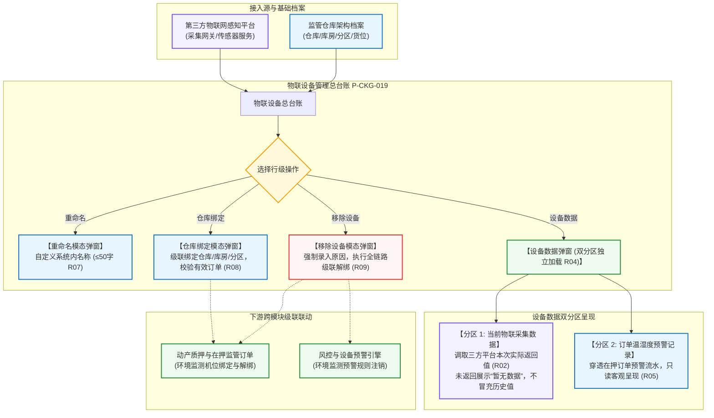

# 物联设备主PRD

> **模块定位**：仓储 / 设备管理 / 物联设备模块是供应链金融动产质押与仓储监管业务中环境感知、环境风控与物联网多维传感数据纳管的总中枢。本模块集中纳管温度、湿度、二氧化碳、氧气、烟感及复合多功能环境传感设备，维护设备与实体仓储库房的空间绑定，提供单次低延迟实时环境指标调阅，深度穿透展示在押订单历史温湿度预警记录，并在设备报废或移位时执行全链路强一致级联解绑。  
> **版本**：V1.4 | **更新时间**：2026-09-16 | **责任人**：森云科技（Senyun Technology）  
> **编写依据**：[《物联设备字段清单》](./物联设备字段清单.md) 是主数据和系统字段的唯一基准；行操作由 [《物联设备操作字段清单索引》](./操作字段清单/操作字段清单索引.md) 维护；[《物联设备业务规则规格》](./物联设备业务规则规格.md) 是设备分类、指标采集、分区容错及级联解绑的唯一定义真源。

---

## 1. 业务背景与核心痛点

### 1.1 业务背景
农产品、冷冻冷藏肉类、中药材及高端化工品等大宗质押存货，对存储环境的温度、湿度、氧气及有害气体浓度有着严苛的物理要求。环境温湿度失控往往直接导致质押物发生腐烂变质、受潮结块或氧化变性，给抵质押权人带来毁灭性的资产跌价或灭失风险。

系统通过建设**物联设备**中枢，将监管库区布设的物联网环境传感器进行数字化纳管，与监管仓库、库房及分区进行物理空间精准绑定，实时拉取当前环境指标并与风控规则引擎联动，一旦出现超温、超湿立即预警，实现对存货内在质量安全的主动守护。

### 1.2 核心业务痛点
1. **多指标传感器数据孤岛，指标读数混乱**：现场温湿度计、气体探头型号各异，缺乏统一的清洗与标准化展示标准；
2. **使用旧缓存冒充实时读数引发误判**：网络偶发故障时若系统调用历史旧值冒充当前实时数据，极易掩盖冷库断电或失温事故；
3. **环境预警与仓储作业脱节**：风控人员无法清晰追溯特定在押订单历史上的超温告警全记录；
4. **传感器移除不彻底导致系统误报**：传感器损坏拆除后，若未能同步解除订单绑定，系统频繁触发离线失联告警。

---

## 2. 功能范围 (Scope)

| 包含功能（已纳入范围） | 不包含功能（超出范围） |
| :--- | :--- |
| - **物联设备总台账与多维组合检索**：支持按设备名称（系统内名称）、设备类型（温度/湿度/烟感/氧气/CO2/多功能）、仓库、绑定状态 4 大核心维度组合查询； - **空间物理位置绑定**：支持设备绑定仓库、库房、分区及具体布设位置，支持有效在押订单校验与阻断； - **设备系统内重命名**：支持自定义设备别名，防止第三方平台名称同步覆盖； - **单次触发式实时物联指标调阅**：进入“设备数据”时单次拉取本次网络实际返回的有效指标数值，未返回指标展示“暂无数据”，不冒充历史值； - **双分区独立容错展示**：当前环境指标与订单温湿度预警记录分区异步加载，任一分区接口报错不影响另一分区呈现； - **订单温湿度预警只读穿透**：展示当前设备关联订单在库期间产生的全部温湿度预警流水与处置快照； - **移除设备全链路级联解绑**：强制录入移除原因，级联注销订单关联、预警规则、通知规则及仓库绑定，任一失败全量强一致回滚。 | - **底层物联传感器固件网络通信与协议转换**：MQTT/CoAP/Modbus 等工业协议解析由物联网网关处理； - **温湿度历史趋势图表与连续大数据流绘制**：物联大数据分析与多维曲线在独立报表模块承载； - **温湿度预警在线处置与工单闭环**：预警处置与核销归属于「设备预警信息」或「押品预警信息」模块； - **物联设备独立审批业务状态机**：物联设备为主数据对象，不建立独立审批流。 |

---

## 3. 模块架构与系统链路

---

## 4. 业务场景与用户故事

| 场景编号 | 业务场景 | 触发角色 | 核心交互与风控约束 | 业务价值 |
| :--- | :--- | :--- | :--- | :--- |
| **场景 1【冷库物联温湿度环境实时监控】(S01)** | 冷库物联温湿度环境实时监控 | 资方风控稽核员 / 现场监管专员 | 稽核员需查看生鲜肉类冷库当前环境质量。在列表筛选仓库“生鲜冷库”，点击操作列【设备数据】。系统实时向物联平台拉取本次采集的温度（`-18.2℃`）与湿度（`85.4%RH`），清晰卡片呈现。遵循【实时数据实际返回与不冒充历史值规则】(R02) 与【设备数据单次请求与不轮询规则】(R03)。 | 杜绝旧数据掩盖冷库失温风险，实现关键在库环境物理穿透。 |
| **场景 2【监管仓房气体与烟感设备位置绑定】(S02)** | 监管仓房气体与烟感设备位置绑定 | 仓储安全管理员 | 仓库新部署一台多功能气体传感探头，管理员在物联设备列表点击【仓库绑定】。选择仓库“海霸王仓库”、库房“气调储藏库”、分区“苹果保鲜区”，输入具体位置“货架顶端吊装”。系统校验无冲突订单后成功绑定。遵循【仓库位置绑定与有效订单阻断规则】(R08)。 | 建立传感器与物理存储单元映射，为在押货品提供环境绑定基准。 |
| **场景 3【存货订单超温预警只读穿透溯源】(S03)** | 存货订单超温预警只读穿透溯源 | 商业银行风控经理 | 某抵质押冻肉订单提示曾经发生超温。风控经理进入对应温湿度计的【设备数据】弹窗，在“订单温湿度预警记录”分区逐条核查历史预警时间、监测超温值（`-12.0℃`）、阈值（`-18.0℃`）及现场处置情况说明。数据只读展示。遵循【订单温湿度预警只读穿透规则】(R05)。 | 穿透存货全周期历史环境风险，为质权保值提供客观审计凭据。 |
| **场景 4【损坏物联传感设备移除与订单解绑】(S04)** | 损坏物联传感设备移除与订单解绑 | 仓储运维人员 | 某湿度传感器故障报废，运维人员点击【移除设备】，录入必填说明“传感探头老化读数失真拆除”。确认后，系统级联解绑在押订单、注销环境预警规则并清空仓库绑定，移出有效列表。遵循【移除设备全链路解绑与强一致回滚规则】(R09)。 | 消除故障硬件持续报警干扰，维护风控预警链条的严肃性。 |

---

## 5. 页面交互规格说明

### 5.1 物联设备主列表页（`P-CKG-019`）
* **页面路径**：`工作台 → 仓储 → 设备管理 → 物联设备`
* **筛选查询区排布**：
  - 横向排布 4 项筛选控件：
    1. 设备名称（单行文本输入框，提示“请输入设备名称”，实际模糊查询系统内名称）；
    2. 设备类型（下拉单选框，默认全部，选项：`温度设备`、`湿度设备`、`烟感设备`、`氧气设备`、`二氧化碳设备`、`多功能设备`）；
    3. 仓库（下拉单选框，根据登录用户仓库数据权限返回）；
    4. 绑定状态（下拉单选框，默认全部，选项：`已绑定`、`未绑定`）；
  - 右侧配置橙黄色实心【查询】按钮与白底【重置】按钮。
* **数据表格呈现（9 列）**：
  - 序号、设备原名称、系统内名称、设备编码、设备类型、绑定仓库、具体位置、修改人员、更新时间、操作；
  - 绑定状态仅作为筛选项，不参与列表展示排布；
  - 操作列陈列 4 个文字操作链接：【重命名】、【仓库绑定】、【设备数据】、【移除设备】。

---

### 5.2 【设备数据】双分区弹窗交互规格
* **触发方式**：点击操作列【设备数据】文字链接，居中呼出大尺寸模态弹窗；
* **双分区平铺布局**：
  - **当前物联数据分区（顶部）**：
    - 标题展示为 `当前物联数据`，右侧带最后采集时间戳；
    - 系统根据设备类型平铺展示对应的实时指标数值卡片（如温度卡片展示数值与单位 `℃`，湿度展示 `%RH`，烟感展示状态徽标）；
    - **不冒充历史值**：仅展示本次请求实际返回的指标；未返回指标展示浅灰色“*暂无数据*”；若第三方接口超时，当前分区居中展示“*获取实时数据失败，请检查设备在线状态*”，遵循【实时数据实际返回与不冒充历史值规则】(R02) 与【当前指标与预警分区独立加载容错规则】(R04)；
    - **无轮询**：本期不建立自动轮询刷新，仅在进入弹窗时请求一次，遵循【设备数据单次请求与不轮询规则】(R03)；
  - **订单温湿度预警记录分区（底部）**：
    - 标题展示为 `订单温湿度预警记录`；
    - 以表格呈现该设备关联的所有在押订单温湿度告警流水：序号、订单编号、预警类型、监测值、设限阈值、预警时间、处理状态、处理人、解除时间；
    - 纯只读展示，不提供处理、解除或修改状态的入口，遵循【订单温湿度预警只读穿透规则】(R05)。

---

### 5.3 【重命名】与【仓库绑定】交互规格
* **重命名**：
  - 呼出居中模态弹窗，展示原名称（只读），输入新“系统内名称”（必填，$\le 50$ 字符）；保存后第三方平台名称更新不覆盖人工维护值，遵循【物联设备命名继承与重命名保护规则】(R07)；
* **仓库绑定**：
  - 级联下拉单选仓库、级联多选库房与分区，输入具体布设位置；
  - 提交前服务端强校验有效在押订单，若存在有效订单则阻断提交并弹出警告弹窗提示：“*该设备已绑定有效订单，请先解绑后再修改*”，遵循【仓库位置绑定与有效订单阻断规则】(R08)。

---

### 5.4 【移除设备】模态弹窗与全链路回滚规格
* **触发方式**：点击操作列【移除设备】链接呼出模态弹窗；
* **表单控件**：
  - 醒目标红展示风险提示：“*移除设备后该设备绑定的订单会解绑，所涉及的预警规则会注销。*”；
  - `* 移除说明`：多行文本输入框，必填，要求录入 5~200 字说明；
* **全链路强一致回滚**：
  - 确认后系统级联解绑订单、预警规则及仓库位置；任一子步骤失败触发全量回滚，设备保留在有效列表中，严禁产生部分成功，遵循【移除设备全链路解绑与强一致回滚规则】(R09) 与【跨模块级联解绑回滚】(C03)。

---

## 6. 核心业务规则索引

| 规则大类 | 规则编码与自解释名称 | 核心逻辑摘要 | 详细真源指向 |
| :--- | :--- | :--- | :--- |
| **设备类型** | 【物联设备类型与多指标采集规则】(R01) | 纳管温湿度/烟感/氧气/CO2/多功能，按硬件返回指标动态展开卡片 | [业务规则规格 §4.1](./物联设备业务规则规格.md#1-设备类型与采集指标规则) |
| **真实采集** | 【实时数据实际返回与不冒充历史值规则】(R02) | 仅展示本次请求实际返回值，未返回展示暂无数据，严禁用历史值冒充 | [业务规则规格 §4.1](./物联设备业务规则规格.md#1-设备类型与采集指标规则) |
| **单次拉取** | 【设备数据单次请求与不轮询规则】(R03) | 进入页面单次请求，系统不持续自动轮询，保障系统轻量稳定 | [业务规则规格 §4.1](./物联设备业务规则规格.md#1-设备类型与采集指标规则) |
| **独立容错** | 【当前指标与预警分区独立加载容错规则】(R04) | 实时数据与预警记录分区异步请求与报错，任一失败不影响另一分区 | [业务规则规格 §4.2](./物联设备业务规则规格.md#2-容错加载与预警穿透规则) |
| **预警穿透** | 【订单温湿度预警只读穿透规则】(R05) | 穿透展示关联订单温湿度告警流水，只读客观呈现，无处置修改入口 | [业务规则规格 §4.2](./物联设备业务规则规格.md#2-容错加载与预警穿透规则) |
| **数据清洗** | 【物联指标异常值与数据清洗规则】(R06) | 空值/NaN/越界值标记为数据异常，不进入风控预警计算模型 | [业务规则规格 §4.2](./物联设备业务规则规格.md#2-容错加载与预警穿透规则) |
| **命名保护** | 【物联设备命名继承与重命名保护规则】(R07) | 首次继承原名；人工重命名后第三方不覆盖；限制 $\le 50$ 字 | [业务规则规格 §4.3](./物联设备业务规则规格.md#3-设备维护与级联移除规则) |
| **位置绑定** | 【仓库位置绑定与有效订单阻断规则】(R08) | 级联绑定仓房分区；存在生效中在押订单时阻断变更并提示 | [业务规则规格 §4.3](./物联设备业务规则规格.md#3-设备维护与级联移除规则) |
| **级联解绑** | 【移除设备全链路解绑与强一致回滚规则】(R09) | 必填说明；级联解绑订单/预警/仓库；任一失败全量回滚 | [业务规则规格 §4.3](./物联设备业务规则规格.md#3-设备维护与级联移除规则) |
| **并发审计** | 【设备并发控制与不可变审计快照规则】(R10) | 设备编码唯一键；数据版本控制防并发冲突；操作全路径审计留痕 | [业务规则规格 §4.3](./物联设备业务规则规格.md#3-设备维护与级联移除规则) |
| **异常控制** | 【物联采集数据异常】(C01) | 传感器损坏或报文非法展示破折号占位，提示读数异常 | [业务规则规格 §5](./物联设备业务规则规格.md#五异常控制与阻断规则-c01--c03) |
| **异常控制** | 【第三方接口超时或失联】(C02) | 接口超时（$\ge 5$秒）友好提示检查网关，不抛出技术堆栈 | [业务规则规格 §5](./物联设备业务规则规格.md#五异常控制与阻断规则-c01--c03) |
| **异常控制** | 【跨模块级联解绑回滚】(C03) | 移除设备任一联动失败触发强一致全量回滚 | [业务规则规格 §5](./物联设备业务规则规格.md#五异常控制与阻断规则-c01--c03) |
| **数据隔离** | 【租户与机构物理隔离】(P01) | 严格按登录租户隔离数据，跨租户物理阻断 | [业务规则规格 §6](./物联设备业务规则规格.md#六数据权限与机构隔离规则-p01--p02) |
| **权限控制** | 【仓库管辖权限控制】(P02) | 已绑定设备需具备对应实体仓库管辖权限方可查看与操作 | [业务规则规格 §6](./物联设备业务规则规格.md#六数据权限与机构隔离规则-p01--p02) |

---

## 7. 权限矩阵（RBAC）

| 角色类型 | 查看未绑定设备 | 查看已绑定设备 | 重命名 | 仓库绑定 | 设备数据调阅 | 移除设备 |
| :--- | :---: | :---: | :---: | :---: | :---: | :---: |
| **系统超级管理员** | ✅ | ✅ | ✅ | ✅ | ✅ | ✅ |
| **仓储设备安全主管** | ✅ | 需仓库授权 | ✅ | ✅ | ✅ | ✅ |
| **现场监管/巡检专员** | ✅ | 需仓库授权 | ❌ | ❌ | ✅ (只读) | ❌ |
| **资方合规风控员** | ✅ (只读) | 需仓库授权 | ❌ | ❌ | ✅ (只读) | ❌ |

---

## 8. 非功能性需求 (NFR)

1. **响应性能**：
   - 物联设备主列表组合查询响应时间 $\le 1.0$ 秒（覆盖海量设备索引）；
   - 打开设备数据弹窗，当前实时环境指标调阅响应时间 $\le 1.5$ 秒；
   - 订单温湿度预警记录分页列表响应时间 $\le 800$ 毫秒。
2. **高可靠性与独立容错**：
   - 设备数据弹窗双分区接口采用异步并行请求与错误边界降级隔离，任一分区故障不影响全局；
   - 移除设备涉及订单与预警规则级联调用的全量强一致回滚成功率 $100\%$。
3. **数据清洗与安全合规**：
   - 采集数据入库前强制执行量程与格式校验，自动清洗过滤异常值；
   - 重命名、位置绑定、设备数据调阅及移除设备 $100\%$ 记录全息审计日志。

---

## 9. 验收标准与交付清单

1. **多分类列表与筛选**：
   - 列表准确呈现 9 列标准结构，覆盖 6 大设备分类单选筛选；
   - 绑定状态仅作为筛选项工作，未绑定设备按租户权限全员可见；
2. **实时数据真实性与无轮询**：
   - 设备数据弹窗仅展示本次请求实际返回的指标数值，未返回指标展示“暂无数据”，不使用历史旧值冒充；
   - 弹窗不发生自动轮询刷新；
3. **双分区独立加载容错**：
   - 模拟物联平台接口超时，当前数据区展示获取失败，预警记录区正常展示数据；
4. **仓库绑定与在押订单阻断**：
   - 已绑定有效订单的物联设备在尝试修改位置绑定时，系统准确拦截并弹出警告弹窗提示；
5. **移除设备全量回滚**：
   - 移除说明必填校验生效；确认后全链路解绑成功；模拟解绑异常时系统准确全量回滚，设备保留在有效列表中。

---

## 10. 修订记录

| 日期 | 版本 | 变更内容说明 | 影响范围 | 修订人 |
| :--- | :--- | :--- | :--- | :--- |
| 2026-08-06 | V1.0 | 新建物联设备主需求文档，定义设备数据展示、温湿度预警及操作规则。 | 物联设备全模块 | 产品研发组 |
| 2026-08-14 | V1.3 | 补充指标单位、精度、更新时间及异常值边界；确认移动端支持范围。 | 指标口径与移动端 | 产品研发组 |
| 2026-09-16 | **V1.4** | **编号语义自解释与交互术语汉化重构**： 1. 规范构建业务场景体系 `场景 N【业务场景名称】(Sxx)`； 2. 新增第 6 节核心业务规则索引与第 8 节非功能性需求，全量对齐自解释编号（R01~R10, C01~C03, P01~P02）； 3. 全面汉化交互术语（单行文本输入框、下拉单选框、模态弹窗、警告弹窗等），专业技术词汇规范标注 `中文（English）`。 | 物联设备规格标准化与研发测试对齐 | AI PM / 森云科技 |
