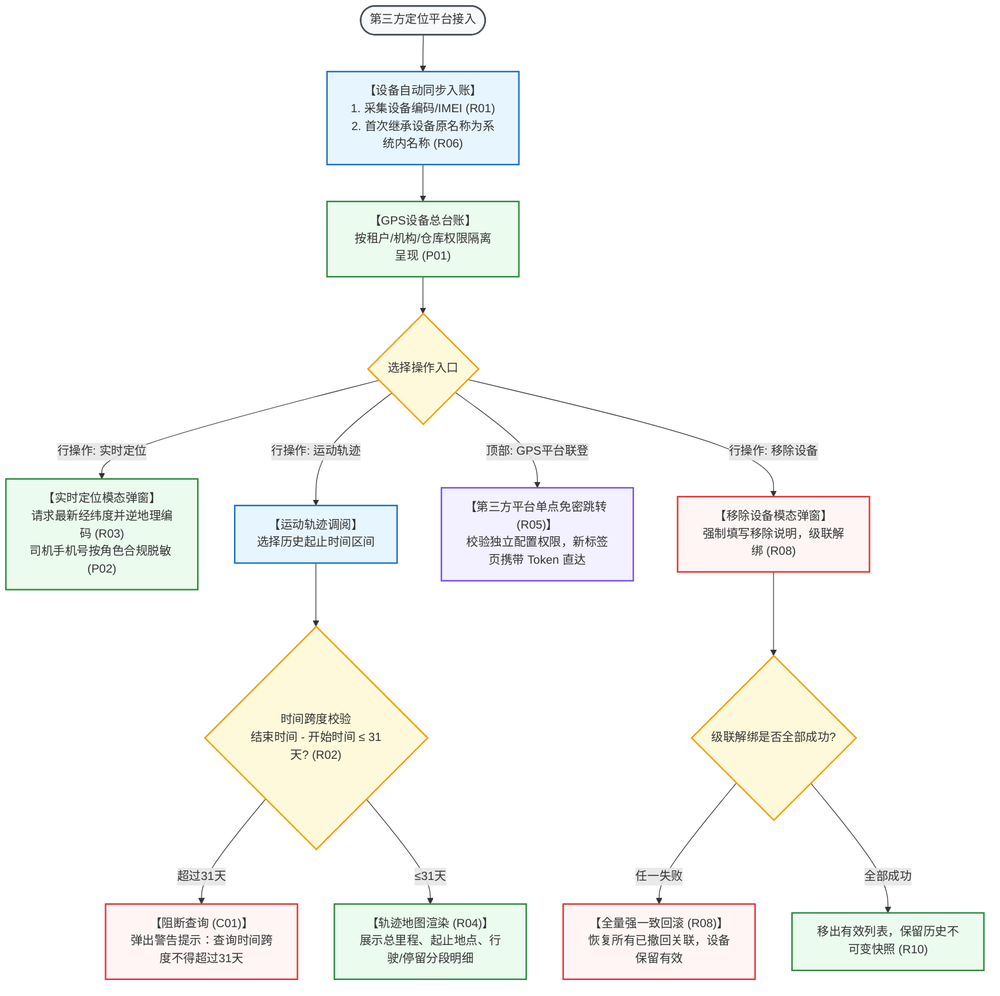

# GPS设备业务规则规格

> **文档定位**：仓储 / 设备管理 / GPS设备模块车辆与货柜移动定位、实时地图点位标记、历史轨迹调阅（$\le 31$天）、司机隐私脱敏、第三方定位平台免密联登、空间层级绑定与级联移除回滚的**唯一定义真源**。主 PRD、字段清单及端侧原型仅引用本文件规则编号（R01~R10, C01~C03, P01~P02），不重复定义规则本体。  
> **模块类型**：在途动产监控与移动定位终端总台账类（包含实时位置呈现、历史运动轨迹、多源地图坐标解析、第三方GPS平台联登跳转、级联强一致解绑）  
> **参考文档**：[《GPS设备主PRD》](./GPS设备主PRD.md)、[《GPS设备字段清单》](./GPS设备字段清单.md)、[《GPS设备操作字段清单索引》](./操作字段清单/操作字段清单索引.md)  
> **版本**：V1.2 | **更新时间**：2026-09-16 | **责任人**：森云科技（Senyun Technology）

---

## 一、对象定位与能力矩阵

| 项目 | 规格内容 |
| :--- | :--- |
| **单据层级** | **【在途移动物联感知层】**（连接大宗动产在途运输、移库调拨与地理空间围栏监控的动态底座） |
| **核心职责** | 集中纳管车载 GPS 终端、电子货盘追踪器及便携定位探头；提供高精度经纬度解析与地图点位标记；支持长达 31 天的历史运动轨迹回放与里程统计；提供司机与车辆绑定信息安全脱敏展示；支持一键免密跳转至第三方专业 GPS 车队管理平台。 |
| **数据来源** | **多源融合**： 1. **第三方车联网/定位平台**：高频 GPS 经纬度原始报文、速度、方位角、卫星数、在线状态； 2. **运力与车辆档案**：车牌号、司机姓名、脱敏联系电话； 3. **仓储与订单系统**：绑定监管仓库、在途运输单据、质押订单编号。 |
| **状态机特性** | **不设人工单据审批状态机**：GPS 设备为主数据对象，不产生审批流；定位与轨迹为客观实时数据流。 |
| **入口分流** | PC 列表操作列分别呼出：【实时定位】模态弹窗、【运动轨迹】新开页/全屏抽屉、【重命名】、【仓库绑定】、【移除设备】及顶部平台联登按钮。 |

---

## 二、定位与轨迹交互能力矩阵

| 操作名称 | 触发入口 | 适用场景 | 核心参数与时空限制 | 页面展现逻辑 |
| :--- | :--- | :--- | :--- | :--- |
| **实时定位** | 列表行操作【实时定位】 | 监管在途车辆当前物理位置 | 设备有效在线；调取最新有效定位帧 | 居中弹出地图弹窗，标记当前点位，展示车辆/司机/位置/时间卡片 |
| **运动轨迹** | 列表行操作【运动轨迹】 | 审计特定时段运输路线 | 开始时间至结束时间**跨度 $\le 31$ 天** | 展开轨迹地图面板，绘制平滑运动路径，分段展示行驶/停留里程与时长 |
| **GPS平台联登** | 顶部操作按钮 | 进阶配置电子围栏与车队 | 具备独立运维配置角色权限 | **新标签页（`_blank`）**免密单点登录（SSO）跳转至第三方专业平台 |
| **重命名/绑定** | 列表行操作 | 设备别名维护与仓库关联 | 名称 $\le 50$ 字符；校验有效在途订单 | 弹出模态表单，保存后更新修改人与时间戳 |
| **移除设备** | 列表行操作【移除设备】 | 设备报废或拆机解绑 | 强制录入 5~200 字说明 | 级联解绑订单、规则、位置；任一失败全量强一致回滚 |

---

## 三、全景业务时序与流转架构

---

## 四、核心业务规则清单 (R01 ~ R10)

### 1. 定位与时空查询规则

### 【GPS设备定位与空间权限隔离规则】(R01)
* GPS 设备列表、实时定位与历史轨迹查询，严格按照当前登录账号的租户权限、机构权限及所管辖实体仓库/在途订单数据权限执行动态过滤；
* 设备编码（或硬件 IMEI）是定位调用与全链路审计的唯一业务主键，严禁仅以列表行序号作为请求参数。

### 【运动轨迹31天时限强校验规则】(R02)
* 用户查询历史运动轨迹时，必须选定开始日期时间与结束日期时间；
* **31天硬性限制**：$$\text{结束时间} - \text{开始时间} \le 31\text{ 天}$$
* 若用户选择的时间跨度超过 31 天，前端即时红字校验拦截，服务端拒绝受理并提示：“*查询时间跨度不得超过 31 天，请重新选择*”。

### 【实时定位展示与司机手机号脱敏规则】(R03)
* 点击【实时定位】调起居中地图弹窗，系统实时请求第三方定位网关获取当前最新有效定位数据（经纬度、地理物理逆解析地址、更新时间、车牌号、司机姓名）；
* **隐私安全脱敏**：司机手机号码严格按合规安全规范执行脱敏展示（前 3 后 4 中间 4 位掩码，如 `138****1234`），未授权角色严禁查看完整明文。

### 【轨迹详情结构化展现与里程核算规则】(R04)
* 运动轨迹页面以时间轴与地图联动方式，结构化展现轨迹摘要：起始地址、终点地址、总行驶里程（km）、行驶总时长、静止停留总时长及平均速度；
* 地图上清晰用不同颜色高亮区分行驶路段与停留停车点；无轨迹数据时展示友好空态，严禁拼接生成虚假路径。

### 2. 第三方联登与设备维护规则

### 【第三方GPS平台单点免密联登规则】(R05)
* 顶部部署【GPS平台规则配置】与【GPS平台基础数据】独立操作按钮；
* 用户点击时系统校验其独立的高级配置权限；鉴权通过后通过单点登录（SSO）协议动态生成有时效性的访问令牌，以 **`target="_blank"`（新标签页）** 方式调起第三方专业平台，避免当前系统上下文丢失。

### 【GPS设备命名继承与重命名保护规则】(R06)
* 设备接入时系统内名称默认继承第三方设备原名称；
* 用户在系统内对设备执行【重命名】保存后，后续第三方平台名称同步不得覆盖已维护的系统内名称；名称长度限制 $\le 50$ 字符。

### 【仓库位置绑定与在押运输订单阻断规则】(R07)
* 设备支持绑定至实体监管仓库、库房或分区；
* 保存绑定关系前，服务端必须强校验该设备是否关联在押或处于在途监管状态的抵质押订单；若存在有效订单则阻断更新并弹出警告弹窗提示：“*该设备已绑定有效订单，请先解绑后再修改*”。

### 3. 级联移除与审计快照规则

### 【移除设备全链路解绑与强一致回滚规则】(R08)
* 用户执行【移除设备】必须强制录入 5~200 字的原因说明；
* 确认移除后，系统级联解除该设备与在押运输订单、设备预警规则、异常通知规则及仓库位置的绑定；
* **强一致回滚语义**：任一子联动失败触发全量回滚，设备保留在有效列表中，严禁产生部分更新。

### 【设备并发控制与操作幂等性规则】(R09)
* 重命名、位置绑定、轨迹查询及移除设备操作，服务端引入版本号与请求流水号防重复提交；并发修改冲突时阻断提交并提示刷新。

### 【不可变历史轨迹与审计快照规则】(R10)
* 历史已发生的在途运输轨迹点与定位抓拍，作为抵质押业务的司法存证数据在系统中永久固化快照，不受后续设备移除或拆机影响；
* 全链路记录定位调阅与维护操作审计日志。

---

## 五、异常控制与阻断规则 (C01 ~ C03)

### 【轨迹时间跨度超限】(C01)
$$\text{Query.EndTime} - \text{Query.StartTime} > 31\text{ Days} \implies \text{阻断请求，弹出警告弹窗提示超限}$$

### 【第三方定位服务超时】(C02)
* 调用第三方定位或地图逆解析服务发生超时（$\ge 5.0\text{ 秒}$）时，前端播放友好空态：“*定位数据获取超时，请稍后重试*”，不影响主页面功能。

### 【第三方联登授权失效】(C03)
* 单点登录令牌过期或第三方服务端鉴权失败时，提示“*跳转第三方平台授权失败，请重新登录*”。

---

## 六、数据权限与隐私合规规则 (P01 ~ P02)

### 【租户与机构物理隔离】(P01)
* GPS 设备台账严格按登录租户与所属机构隔离，跨租户设备物理阻断。

### 【敏感隐私数据脱敏控制】(P02)
* 司机联系电话、身份证号等公民个人敏感信息强制执行脱敏屏蔽，仅具备超级安全审计权限的角色方可申请查看明文。

---

## 七、修订记录

| 日期 | 版本 | 变更内容说明 | 影响范围 | 修订人 |
| :--- | :--- | :--- | :--- | :--- |
| 2026-08-14 | V1.0 | 建立GPS设备业务规则规格初稿：规范实时定位、运动轨迹时限、第三方联登及设备维护。 | GPS设备全模块 | 产品研发组 |
| 2026-08-20 | V1.1 | 合并原业务流程说明，补充全量回滚与司机隐私脱敏规则。 | 异常与联动处理 | 产品研发组 |
| 2026-09-16 | **V1.2** | **编号语义自解释与交互术语汉化重构**： 1. 规范构建 10 大核心自解释业务规则（R01~R10），明确 31 天轨迹时限、司机隐私脱敏、单点免密联登与强一致回滚； 2. 规范提炼异常阻断（C01~C03）与权限隔离（P01~P02）； 3. 全面汉化交互术语（单行文本输入框、模态弹窗、警告弹窗等），专业技术词汇规范标注 `中文（English）`。 | GPS设备规格标准化与测试对齐 | AI PM / 森云科技 |
