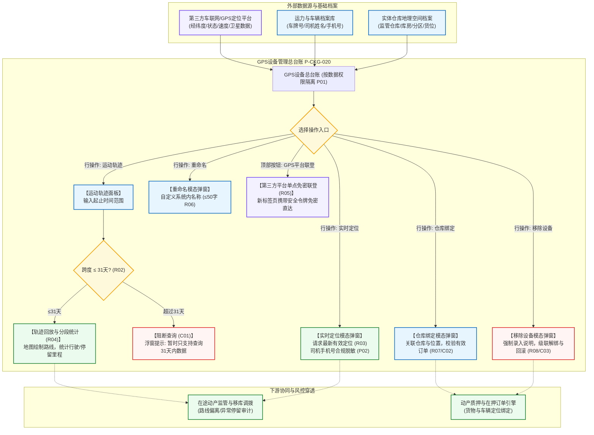

# GPS设备主PRD

> **模块定位**：仓储 / 设备管理 / GPS设备模块是供应链金融存货监管与动产质押业务中在途运输、移库调拨、车辆轨迹审计与地理空间监控的总台账中枢。本模块集中纳管车载 GPS 终端、电子货盘追踪器及便携定位探头，维护设备与实体仓储库房的空间绑定，提供低延迟实时车辆定位点位呈现，支持最长 31 天的历史运动轨迹平滑回放与里程核算，提供司机联系方式安全合规脱敏，并支持单点免密跳转至第三方专业 GPS 车队管理平台。  
> **版本**：V1.4 | **更新时间**：2026-09-16 | **责任人**：森云科技（Senyun Technology）  
> **编写依据**：[《GPS设备字段清单》](./GPS设备字段清单.md) 是主数据和系统字段的唯一基准；行操作由 [《GPS设备操作字段清单索引》](./操作字段清单/操作字段清单索引.md) 维护；[《GPS设备业务规则规格》](./GPS设备业务规则规格.md) 是定位权限、31天轨迹时限、脱敏规范、第三方联登及级联解绑的唯一定义真源。

---

## 1. 业务背景与核心痛点

### 1.1 业务背景
在供应链金融动产质押与仓储监管业务中，大宗商品（如电解铜、热轧卷板、铝锭、天然橡胶等）往往伴随着跨库调拨、干线移库、在途抵质押以及厂区与仓库之间的短驳运输。货权质押期间，“货在途中、人车失联、路径偏离、非法卸货”是出资银行与风控监管方极为关注的重大违约风险敞口。

系统通过建设**GPS设备**管理台账，纳管承运车辆与在途货品搭载的 GPS 移动定位终端，实时拉取车辆经纬度并逆解析物理地址，提供直观的地图点位展示；支持调阅长达 31 天的高精度历史运动轨迹与停留明细，打通“在途货权-运输车辆-监管仓库”的时空数据链，实现对质押动产在途生命周期的可信穿透与可视化监管。

### 1.2 核心业务痛点
1. **在途运输盲区，车辆脱轨脱线难察觉**：运输途中无法实时获知真实物理位置与行驶状态，存在中途掉包、私自卸货或虚假运单风险；
2. **海量点位查询无限制导致系统雪崩**：轨迹查询无时间跨度约束易引发第三方高频接口超时或前端渲染崩溃；
3. **司机与承运隐私泄露合规风险**：车辆运力与司机联系方式缺乏安全脱敏机制，存在个人信息安全与数据泄露隐患；
4. **多系统割裂，车队规则配置繁琐**：监管方在主系统与第三方专业车队 GPS 平台间来回切换、重复登录，缺乏一体化单点免密联登通道。

---

## 2. 功能范围 (Scope)

| 包含功能（已纳入范围） | 不包含功能（超出范围） |
| :--- | :--- |
| - **GPS设备总台账与多维组合检索**：支持按设备名称（系统内名称）、车辆信息（车牌号模糊匹配）、设备状态（离线/停车/行驶/静止）、仓库（绑定仓库下拉）、具体位置 5 大核心维度组合查询； - **设备系统内重命名**：支持自定义设备别名（$\le 50$ 字符），防止第三方平台设备原名称自动同步覆盖； - **空间物理位置绑定**：支持设备绑定仓库、库房、分区及具体布设位置，支持有效在押订单校验与阻断； - **实时定位弹窗展示**：调起居中地图弹窗，标记车辆当前物理点位，卡片化展示车辆状态、车牌号、司机姓名、脱敏手机号及定位时间； - **运动轨迹历史回放**：支持时间跨度 $\le 31$ 天的轨迹查询，平滑绘制行驶路线，按状态分段展示行驶/停留里程与时长详情； - **第三方平台单点免密联登**：顶部操作栏提供【GPS平台规则配置】与【GPS平台基础数据】按钮，新标签页携带安全凭据单点登录（SSO）跳转； - **移除设备全链路级联解绑**：强制录入移除说明，级联解绑在押订单、预警规则、通知规则及仓库位置，任一失败全量强一致回滚。 | - **底层车载定位硬件通信与卫星报文解析**：北斗/GPS 原始 NMEA 报文接收由第三方车联网网关完成； - **地图底图 GIS 引擎与逆地理编码底层算法**：由高德/天地图/百度地图地理信息服务提供； - **第三方车队内部规则与基础档案配置**：第三方平台内部围栏设置与车辆档案在外部平台处理； - **GPS设备独立审批业务状态机**：GPS 设备为主数据对象，不建立人工单据审批流。 |

---

## 3. 模块架构与系统链路

---

## 4. 业务场景与用户故事

| 场景编号 | 业务场景 | 触发角色 | 核心交互与风控约束 | 业务价值 |
| :--- | :--- | :--- | :--- | :--- |
| **场景 1【在途运输车辆实时定位监控】(S01)** | 在途运输车辆实时定位监控 | 动产监管员 / 资方风控稽核员 | 监管员需查看承运电解铜的货运车辆当前所处位置。在列表输入车牌号查询，点击操作列【实时定位】。系统弹出居中地图弹窗，展示最新定位标记，卡片展示车牌号、车辆状态（行驶中）、当前地址及司机脱敏联系方式（`138****8888`）。遵循【实时定位展示与司机手机号脱敏规则】(R03) 与【敏感隐私合规脱敏】(P02)。 | 实时掌控在途货品空间动态，杜绝中途失联与脱轨风险。 |
| **场景 2【大宗质押货物调拨历史轨迹回放】(S02)** | 大宗质押货物调拨历史轨迹回放 | 仓储审计员 / 业务风控经理 | 审计员需对上周跨库移库的货运轨迹进行合规回溯。点击【运动轨迹】进入轨迹面板，选择起止时间（跨度 5 天，$\le 31$ 天）。系统调取历史轨迹并完成地图平滑绘制，结构化展示总里程（`428.5km`）、行驶时长及中途停留明细。若用户选择超过 31 天则即时红字阻断。遵循【运动轨迹31天时限强校验规则】(R02) 与【轨迹详情结构化展现与里程核算规则】(R04)。 | 提供不可辩驳的时空运动凭证，满足风控贷后合规审计要求。 |
| **场景 3【专业车队管理第三方平台免密联登】(S03)** | 专业车队管理第三方平台免密联登 | 车辆运维管理员 / 系统安全主管 | 管理员需前往第三方车联网平台进阶配置电子围栏。在 GPS 设备列表顶部点击【GPS平台规则配置】按钮。系统校验其独立配置权限，生成一次性安全访问令牌，并在新浏览器标签页打开外部平台对应页面。遵循【第三方GPS平台单点免密联登规则】(R05)。 | 免去多套系统重复登录认证之苦，保障平台跳转上下文独立安全。 |
| **场景 4【车载GPS设备仓库绑定与报废移除】(S04)** | 车载GPS设备仓库绑定与报废移除 | 仓储设备管理员 | 新采购的电子货盘追踪器分配至“无锡不锈钢加工仓”，管理员点击【仓库绑定】完成空间关联。后续设备损坏报废时，管理员点击【移除设备】，录入必填说明“终端天线进水短路彻底报废”，系统级联注销关联并移出列表。遵循【仓库位置绑定与有效订单阻断规则】(R07) 与【移除设备全链路解绑与强一致回滚规则】(R08)。 | 建立设备与物理库区精准映射，保障报废资产数据链路干净解耦。 |

---

## 5. 页面功能与交互说明

### 5.1 GPS设备主列表页（`P-CKG-020`）
* **页面路径**：`工作台 → 仓储 → 设备管理 → GPS设备`
* **顶部页面级操作栏**：
  - 左侧展示模块标题与说明；
  - 右侧配置两个次级操作按钮（新标签页免密跳转）：
    1. 【GPS平台规则配置】（白底浅色边框按钮，配置权限受控）；
    2. 【GPS平台基础数据】（白底浅色边框按钮，配置权限受控）。
* **筛选查询区排布（5 项横向排列）**：
  1. **设备名称**（单行文本输入框，占位提示“请输入设备名称”，实际模糊匹配系统内名称）；
  2. **车辆信息**（单行文本输入框，占位提示“请输入车牌号等车辆信息”，模糊匹配车牌号）；
  3. **设备状态**（下拉单选框，默认全部，选项：`离线`、`停车`、`行驶`、`静止`）；
  4. **仓库**（下拉单选框，默认全部，依据登录账号所属仓库数据权限动态返回）；
  5. **具体位置**（单行文本输入框，占位提示“请输入具体位置”，模糊匹配位置描述）；
  - 右侧横向排布橙黄色实心【查询】按钮与白底【重置】按钮。
* **数据表格呈现（11 列）**：
  - 序号、设备原名称、系统内名称、设备编码、车辆信息、绑定仓库、具体位置、设备状态（状态标签徽章展示）、修改人员、更新时间、操作；
  - **操作列动作陈列（5 项文字链接）**：
    1. 【重命名】（调起重命名模态弹窗）；
    2. 【仓库绑定】（调起仓库绑定模态弹窗）；
    3. 【实时定位】（调起实时定位地图模态弹窗）；
    4. 【运动轨迹】（进入运动轨迹全屏抽屉/新页面）；
    5. 【移除设备】（标红文字，调起二次确认与原因输入模态弹窗）。

### 5.2 实时定位交互弹窗
* **弹窗形式**：居中大尺寸模态弹窗（宽度 880px，高度 620px），支持右上角关闭与遮罩点击关闭；
* **地图渲染区**：占据弹窗主要区域，缩放至适宜比例尺，正中标记车辆当前所在经纬度定位图标；
* **定位信息卡片浮层**：覆盖于地图左上方或底部半透明卡片：
  - 车牌号（粗体展示，如 `苏B·88998`）；
  - 车辆状态（行驶中/静止等彩色标签）及当前状态持续时长（如 `2小时15分钟`，换算格式严格遵循规范）；
  - 当前地理物理地址（高精度逆解析结果）；
  - 司机姓名及脱敏手机号码（如 `张*强 138****8888`，严格掩码）；
  - 定位上报时间戳与设备编码。

### 5.3 运动轨迹交互面板
* **交互形式**：支持由列表点击【运动轨迹】进入全屏轨迹面板或新标签页；
* **顶部设备信息与时空检索条**：
  - 设备及车辆基本信息回显（设备名称、车牌号，固定不可修改）；
  - 开始时间（日期时间选择器，格式 `YYYY-MM-DD HH:mm:ss`）；
  - 结束时间（日期时间选择器，格式 `YYYY-MM-DD HH:mm:ss`）；
  - 【查询轨迹】按钮（操作防抖与防重复点击锁定）；
* **时限强校验拦截 (C01)**：
  - 前端与服务端强校验：$$\text{结束时间} - \text{开始时间} \le 31\text{ 天}$$
  - 若跨度超过 31 天，立即阻断请求并弹出警告浮窗提示：“*暂时只支持查询31天内的数据*”；
* **轨迹地图与详情分段联动**：
  - 地图区域：平滑绘制车辆运动折线，起点标注绿色“起”，终点标注红色“止”；
  - 轨迹总览卡片：展示总行驶里程（`km`，保留一位小数）、总时长、平均时速；
  - 状态分段列表：列表化展示各区间行驶与停留分段，支持点击单条分段高亮地图对应路段。

---

## 6. 核心业务规则索引与追溯

> 规则规格全文见唯一真源：[《GPS设备业务规则规格》](./GPS设备业务规则规格.md)

| 规则编号 | 规则业务名称 | 规则类型 | 规则核心摘要与风控边界 | 真源章节引用 |
| :--- | :--- | :---: | :--- | :--- |
| **R01** | 【GPS设备定位与空间权限隔离规则】 | 数据隔离 | 列表与时空数据严格按租户、机构与仓库权限过滤；唯一设备编码为审计业务主键 | 《业务规则规格》§四.1 |
| **R02** | 【运动轨迹31天时限强校验规则】 | 业务时限 | 查询时间跨度严格满足 $\le 31$ 天，超限即时阻断查询并浮窗提示报错 | 《业务规则规格》§四.1 |
| **R03** | 【实时定位展示与司机手机号脱敏规则】 | 隐私安全 | 调取最新有效点位；司机手机号码前3后4中间掩码脱敏，未授权严禁明文呈现 | 《业务规则规格》§四.1 |
| **R04** | 【轨迹详情结构化展现与里程核算规则】 | 展现核算 | 结构化呈现起止点、总里程与分段时长；无轨迹展示空态，严禁虚构路径 | 《业务规则规格》§四.1 |
| **R05** | 【第三方GPS平台单点免密联登规则】 | 系统集成 | 校验独立高级配置权限，新标签页（`_blank`）携带有时效令牌免密安全跳转 | 《业务规则规格》§四.2 |
| **R06** | 【GPS设备命名继承与重命名保护规则】 | 主数据保护 | 首次继承原名称；人工重命名（$\le 50$字）后持久固化，三方同步不覆盖 | 《业务规则规格》§四.2 |
| **R07** | 【仓库位置绑定与有效订单阻断规则】 | 业务互斥 | 级联绑定仓储空间；设备存在在押质押或监管订单时强校验拦截解绑与换绑 | 《业务规则规格》§四.2 |
| **R08** | 【移除设备全链路解绑与强一致回滚规则】 | 级联一致性 | 强制录入移除说明；级联解绑订单、规则、通知及仓库，任一失败全量强一致回滚 | 《业务规则规格》§四.2 |
| **R09** | 【设备状态客观展示与不设业务状态机规则】 | 状态规范 | 车辆状态仅为定位客观流呈现，不设审批单据状态机，不提供状态流转操作 | 《业务规则规格》§四.3 |
| **R10** | 【移除设备不可变历史快照审计规则】 | 司法存证 | 移除后移出有效列表；历史轨迹、绑车记录与操作流水永久保留司法存证快照 | 《业务规则规格》§四.3 |
| **C01** | 【轨迹跨度超限阻断】 | 异常拦截 | 跨度超过 31 天或开始时间晚于结束时间，即时阻断查询并提示规范文案 | 《业务规则规格》§五.1 |
| **C02** | 【有效订单绑定冲突阻断】 | 业务阻断 | 存在申请中、在押或监管中有效订单，禁止解绑或修改设备空间位置 | 《业务规则规格》§五.1 |
| **C03** | 【移除设备并发冲突阻断】 | 并发防护 | 设备已被并发移除或不存在时，阻断重复解绑并提示已被移除 | 《业务规则规格》§五.1 |
| **P01** | 【数据权限与租户隔离】 | 安全合规 | 严格执行租户与所管辖仓库范围数据过滤，严禁越权渗透 | 《业务规则规格》§五.2 |
| **P02** | 【敏感隐私合规脱敏】 | 隐私合规 | 司机手机号合规脱敏展示，审计日志严禁明文落地手机号码 | 《业务规则规格》§五.2 |

---

## 7. 权限控制与安全隔离

### 7.1 功能与操作权限矩阵

| 功能项 | 对应权限编码 | 适用角色 | 权限校验逻辑与约束 |
| :--- | :--- | :--- | :--- |
| **GPS设备列表查询** | `P-CKG-020:VIEW` | 仓储管理员、监管员、风控经理 | 校验租户隔离与有效账号权限；按管辖仓库过滤 |
| **设备重命名** | `P-CKG-020:RENAME` | 仓储设备管理员 | 校验操作权限与设备所属仓库管辖权 |
| **绑定仓库** | `P-CKG-020:BIND` | 仓储设备管理员 | 校验目标仓库数据权限与在押有效订单阻断 (C02) |
| **实时定位查询** | `P-CKG-020:LOCATE` | 现场监管专员、风控审计员 | 校验对应设备数据可见权限，服务端过滤后返回 |
| **运动轨迹调阅** | `P-CKG-020:TRACK` | 风控总监、业务稽核员 | 校验对应设备数据权限与 31 天时限规则 (R02) |
| **GPS平台外部联登** | `P-CKG-020:SSO_CONFIG` | 系统运维配置专员 | 独立高级配置权限校验，不与设备列表权限混用 |
| **移除设备** | `P-CKG-020:REMOVE` | 仓储安全总监、设备管理员 | 需二次确认并强制填写原因，全链路解绑 |

---

## 8. 非功能性需求（NFR）与审计存证

### 8.1 性能与稳定性
* **实时定位查询响应**：从点击【实时定位】到地图点位及卡片完整渲染呈现，95% 以上请求耗时 $\le 1.5\text{s}$；
* **历史轨迹平滑加载**：31 天以内历史轨迹数据（约 20,000 个采样点内），后端抽稀与聚合处理后，前端完成轨迹绘制加载时间 $\le 2.5\text{s}$；
* **地图渲染并发与降级**：当第三方地图底图或逆地理编码接口超时不可用时，系统自动执行优雅降级，展示原始经纬度坐标与基础设备状态卡片，明确提示“*地图服务暂时受阻，已为您呈现基础定位数据*”，绝不允许白屏崩溃。

### 8.2 隐私安全与审计存证
* **敏感信息隐私保护**：司机手机号码按照《个人信息保护法》要求，列表与弹窗统一执行脱敏呈现；任何无权限导出或后台调试接口严禁泄露明文；
* **全生命周期不可变审计日志**：
  - 用户执行设备重命名、仓库绑定/解绑、移除设备、第三方平台免密跳转等关键敏感操作，系统自动记录审计事件；
  - 审计日志要素包括：操作人账号、姓名、所属机构、租户唯一标识、操作客户端 IP 地址、设备编码（IMEI）、操作前后完整数据快照、操作结果状态及失败原因。

---

## 9. 验收标准与测试重点

| 验收编号 | 验收项与测试用例 | 预期结果与合格标准 | 对应规则 |
| :--- | :--- | :--- | :--- |
| **AC-01** | 设备列表与多维筛选验证 | 筛选设备名称、车牌号、状态、仓库及具体位置，精准返回匹配记录；未授权仓库设备被严格阻断过滤 | R01, P01 |
| **AC-02** | 实时定位地图与脱敏验证 | 点击【实时定位】弹出地图，准确标注经纬度点位；卡片展示车牌号、行驶状态及司机脱敏号码（如 `138****8888`） | R03, P02 |
| **AC-03** | 运动轨迹 $\le 31$ 天合规查询 | 选择跨度 $\le 31$ 天时段，系统平滑绘制路径，起止点标注明确，里程与停留分段统计准确 | R02, R04 |
| **AC-04** | 运动轨迹超 31 天阻断拦截 | 选择跨度为 32 天或开始时间晚于结束时间，前端即时红字阻断，服务端拒绝并浮窗提示指定文案 | R02, C01 |
| **AC-05** | 第三方平台免密联登跳转 | 点击顶部联登按钮，系统校验独立权限后新标签页打开外部平台，当前页面状态完整保留 | R05 |
| **AC-06** | 空间绑定与在押订单阻断 | 对存在在押或监管订单的 GPS 设备尝试解绑或更改仓库，系统精准拦截并提示冲突订单编号 | R07, C02 |
| **AC-07** | 移除设备级联解绑与快照 | 执行移除设备必须录入 $\ge 5$ 字原因；级联解绑订单与规则，移出有效台账但历史轨迹存证可追溯 | R08, R10 |

---

## 修订记录

| 日期 | 版本 | 变更内容 | 影响范围 |
| :--- | :--- | :--- | :--- |
| 2026-09-16 | V1.4 | 全量规范化重构：规则与场景统一自解释命名（R01~R10、C01~C03、P01~P02、S01~S04），全面汉化 UI 交互控件术语，补充核心规则索引表、NFR 及验收标准 | 全文档 |
| 2026-08-20 | V1.3.1 | 合并原功能清单内容，收口移动端边界 | 功能清单 |
| 2026-08-14 | V1.3 | 梳理第三方接口对接责任人与确认时点，归口操作字段 | 实时定位、运动轨迹 |
