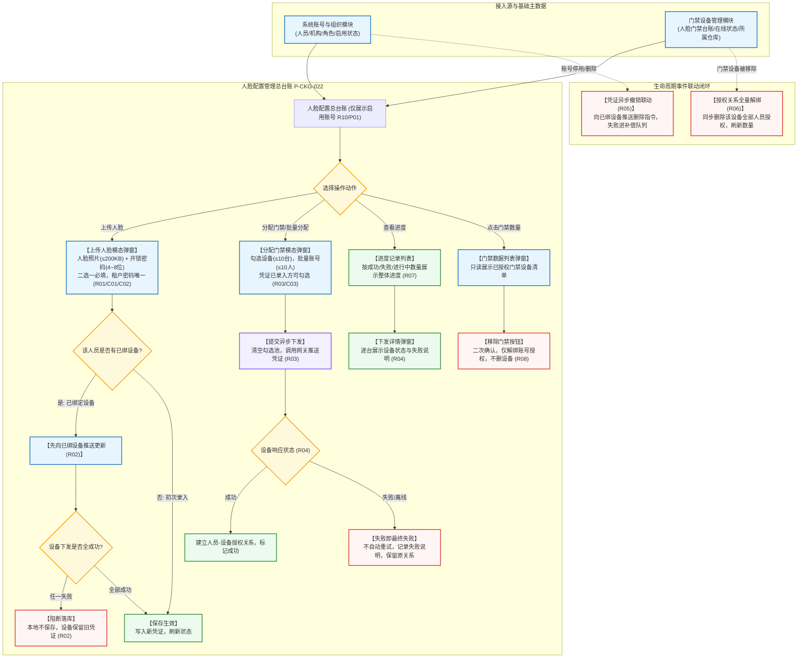

# 人脸配置主PRD

> **模块定位**：仓储 / 设备管理 / 人脸配置模块是供应链金融动产质押与仓储物理监管中人员生物识别凭证采集、开锁数字密码纳管、门禁硬件授权批量下发及生命周期安全闭环的总控制中枢。本模块维护监管员、巡检员与仓管员的人脸照片与开锁密码，支持单用户与批量异步下发授权至指定人脸门禁设备；严格遵循“先下发后更新”、“失败即最终失败”及“账号停用自动撤销凭证”的核心安全铁律，确保监管仓库物理出入控制的人锁合一与责任穿透。  
> **版本**：V1.6 | **更新时间**：2026-09-16 | **责任人**：森云科技（Senyun Technology）  
> **编写依据**：[《人脸配置字段清单》](./人脸配置字段清单.md) 是凭证、授权、下发及门禁数据字段的唯一基准；[《人脸配置业务规则规格》](./人脸配置业务规则规格.md) 是凭证二选一、先下发后落库、失败即最终失败及生命周期撤销联动的唯一定义真源。

---

## 1. 业务背景与核心痛点

### 1.1 业务背景
在供应链金融动产质押与仓储监管业务中，监管仓库的大门与出入口是防止质押押品被擅自移库、调换或侵占的物理核心屏障。人脸门禁机具作为物理防线的“智能守门人”，其内部存储的人员人脸特征向量与开锁密码直接决定了谁有权限推开库门。

系统通过建设**人脸配置**模块，打通“系统人员账号 - 生物人脸/开锁密码凭证 - 门禁机具硬件 - 操作审计存证”的数据闭环，不仅保障现场合法作业人员顺畅通行，更在人员离职、调岗或账号停用时，实现线上线下权限的秒级同步销毁，为抵质押权人提供牢不可破的物理安全防线。

### 1.2 核心业务痛点
1. **密码共用导致现场责任人无法锁定**：若多个人员使用相同开锁密码，门禁开锁流水无法确认实际开门人；
2. **设备离线导致虚假成功与物理开锁脱节**：若系统在设备未实际收到凭证时就保存成功，现场人员到库却刷不开门；
3. **人员离职后物理门禁凭证残留**：账号在后台被停用或删除，但门禁机具上未同步销毁人脸，形成重大安全盗运漏洞；
4. **批量下发缺乏明细排查能力**：多台设备批量下发若部分失败，运维人员无法精准知晓究竟是哪台设备离线报错。

---

## 2. 功能范围 (Scope)

| 包含功能（已纳入范围） | 不包含功能（超出范围） |
| :--- | :--- |
| - **人脸配置总台账与多维检索**：仅展示账号状态为“启用”的账号，支持按账号名称（模糊查询系统内名称）、人脸状态（未录入/已录入）、开锁密码（未录入/已录入）组合检索； - **单人凭证采集维护（上传人脸）**：支持采集上传人脸照片（JPG/JPEG/PNG，$\le 200\text{KB}$）与维护 4~8 位数字开锁密码（同一租户内唯一性强校验），两者二选一必填； - **凭证更新先下发后落库机制**：修改已绑定设备人员的凭证时，先向所有已绑定设备下发更新，全部成功才保存新凭证；任一失败本地不保存，设备保留旧凭证； - **单用户与批量门禁分配**： &nbsp;&nbsp;* 单用户分配：单次提交最多勾选 10 台门禁设备； &nbsp;&nbsp;* 批量分配：最多勾选 10 个账号（跨页保留勾选），所选设备最多 10 台，提交成功后自动清空勾选池； - **普通下发失败即最终失败机制**：设备离线或下发超时直接标记设备级“失败”，不离线死等也不自动重试，由管理员重新发起增量覆盖； - **查看下发进度与明细弹窗**：通过“成功数量”、“失败数量”、“进行中数量”三态展示整体进度，可下钻弹窗逐台查看设备下发状态与失败原因说明； - **门禁数据列表调阅与逐条移除**：弹窗展示已授权门禁列表，支持逐条【移除门禁】解除授权，不影响设备主数据； - **生命周期被动联动闭环**： &nbsp;&nbsp;* 账号停用/删除自动触发向所有已绑定门禁下发“删除凭证”指令，失败进入后台补偿重试队列； &nbsp;&nbsp;* 门禁设备被移除时，同步清空该设备与所有人员的授权关系并核减数量。 | - **系统账号、组织机构及角色的主数据维护**：由系统用户与组织中心统一管理； - **门禁设备档案新增、重命名与仓库空间绑定**：由 [门禁设备主 PRD](../18-设备管理-门禁设备/门禁设备主PRD.md) 承载； - **门禁实时出入流水与监控抓拍追溯**：由 [门禁事务主 PRD](../21-设备管理-门禁事务记录/门禁事务主PRD.md) 承载； - **人脸特征向量底层提取算法与机具固件协议**：由第三方设备网关 SDK 实现； - **人脸门禁临时密码申请与开锁审批流**：由开锁审核专网专道承载。 |

---

## 3. 模块架构与系统链路

---

## 4. 业务场景与用户故事

| 场景编号 | 业务场景 | 触发角色 | 核心交互与风控约束 | 业务价值 |
| :--- | :--- | :--- | :--- | :--- |
| **场景 1【仓储监管人员人脸与密码凭证录入】(S01)** | 仓储监管人员人脸与密码凭证录入 | 仓储人事管理员 / 现场安全员 | 新入职监管员需配置门禁权限。管理员在列表点击【上传人脸】，上传免冠正脸照片（`145KB`），并设置 6 位开锁密码（`654321`）。系统自动校验该密码在租户内未被他人使用，保存成功。遵循【凭证二选一与格式合规规则】(R01) 与【租户内开锁密码重复阻断】(C02)。 | 建立人脸与密码双重防伪基准，确保开锁日志精准锁定具体责任人。 |
| **场景 2【监管仓区关键人脸门禁单人与批量授权】(S02)** | 监管仓区关键人脸门禁单人与批量授权 | 动产质押风控经理 | 针对新启用的铜锭质押库，风控经理需为 3 名现场巡检员分配 2 台人脸门禁机具。在列表跨页勾选 3 名巡检员，点击【批量分配门禁】，勾选目标库房的两台门禁，确认提交。系统提示下发已提交，并清空已选勾选池。遵循【门禁分配数量限制与增量覆盖规则】(R03)。 | 杜绝未经录入凭证的人员非法授权，支持跨人员快速下发。 |
| **场景 3【设备下发进度调阅与失败重试覆盖】(S03)** | 设备下发进度调阅与失败重试覆盖 | 现场设备运维专员 | 运维员点击全局【查看进度】按钮打开进度记录弹窗。某条提交记录显示“成功 1，失败 1”。点击【查看】打开设备详情，发现“2号库门禁”下发状态为“失败”，原因为“*设备处于离线状态*”。系统不进行离线等待。待现场网络恢复后，运维员重新在列表为该人员发起【分配门禁】实现覆盖重试。遵循【普通分配下发失败即最终失败规则】(R04) 与【下发进度按三态数量展示规则】(R07)。 | 失败原因透明可视，不因后台自动轮询产生僵尸下发任务。 |
| **场景 4【人员离职或设备报废权限安全注销】(S04)** | 人员离职或设备报废权限安全注销 | 集团安全总监 / 资方风控合规官 | 某监管员离职，人事在用户中心停用其账号。人脸配置模块立即接收到停用事件，自动将其从人脸配置列表中移出，并向其关联的所有门禁设备发送“删除凭证”指令，若设备离线则进入后台补偿队列直至成功。遵循【账号状态变更与凭证异步撤销联动】(R05)。 | 线上账号注销与线下物理门禁鉴权秒级联动，彻底杜绝离职人员擅自开锁盗货。 |

---

## 5. 页面功能与交互说明

### 5.1 人脸配置主列表页（`P-CKG-022`）
* **页面路径**：`工作台 → 仓储 → 设备管理 → 人脸配置`
* **顶部页面级操作栏**：
  - 左侧展示模块标题与业务说明；
  - 右侧配置两个全局操作按钮：
    1. 【批量分配门禁】（白底浅色边框按钮，前置需在列表中勾选 $\ge 1$ 名凭证已录入人员）；
    2. 【查看进度】（白底浅色边框按钮，调起下发进度记录弹窗）。
* **筛选查询区排布（3 项横向排列）**：
  1. **账号名称**（单行文本输入框，占位提示“请输入账号名称”，实际模糊匹配系统内名称）；
  2. **人脸状态**（下拉单选框，默认全部，选项：`已录入`、`未录入`）；
  3. **开锁密码**（下拉单选框，默认全部，选项：`已录入`、`未录入`）；
  - 右侧横向排布橙黄色实心【查询】按钮与白底【重置】按钮。
* **数据表格呈现（10 列，仅展示启用状态账号）**：
  - 多选框（首列，未录入人脸且未录入密码的人员置灰禁止勾选）；
  - 序号、账号名称、账号（手机号前3后4掩码展示）、所属机构、角色（支持多角色标签展示）；
  - **人脸状态**（标签展示：绿底`已录入`、灰底`未录入`）；
  - **开锁密码**（标签展示：绿底`已录入`、灰底`未录入`）；
  - **门禁数据**（可点击的下划线文字，展示已分配设备数量，如 `3个门禁`，点击调出门禁数据详情弹窗）；
  - **操作**（陈列文字操作链接）：
    1. 【上传人脸】（调起凭证上传与密码维护模态弹窗）；
    2. 【分配门禁】（调起单用户设备分配模态弹窗，凭证未录入时置灰并浮窗提示原因）。

### 5.2 上传人脸交互模态弹窗
* **弹窗布局**：标准模态弹窗（宽度 680px），分区陈列：
  1. **基础信息区（只读）**：账号名称、脱敏账号、角色、所属机构；
  2. **人脸图片采集区**：
     - 上传控件支持拖拽或点击，限制 `JPG`、`JPEG`、`PNG`，文件大小 $\le 200\text{KB}$；
     - 上传后呈现预览图，支持重新上传与调阅大图（需权限与审计）；
  3. **开锁密码维护区**：
     - 单行文本输入框，限制 4~8 位纯数字；
     - 默认以黑色掩码点（`••••••`）展示，右侧配置“眼睛”图标切换明文（点击需记录审计）；
* **提交校验与控制**：
  - 点击【确定】提交，校验二选一约束 (C01) 与密码租户全局唯一性 (C02)；
  - 若该人员此前已绑定门禁设备，系统触发【凭证更新先下发后落库原则】(R02)，先向已绑定设备下发更新，全部成功后才落账本地凭证；任一失败保留旧凭证并报错。

### 5.3 分配门禁交互模态弹窗
* **单用户与批量分配复用弹窗**：
  - 顶部展示分配目标人员摘要；
  - 中间陈列门禁设备筛选区（设备名称单行文本输入框、设备状态在线/离线下拉单选框）；
  - 下方陈列门禁设备表格（支持表头全选与单选复选框，单次提交勾选上限为 10 台）；
* **提交交互**：点击【确定】后提交后台异步下发，成功后弹出提示：“*信息已成功下发，将在几分钟内完成信息同步...*”，提供【返回主页】与【查看进度】快捷按钮，并清空勾选池。

### 5.4 查看进度与下发详情弹窗
* **进度记录弹窗**：列表展示历史提交批次（序号、提交时间、操作人、目标人数、目标设备数、成功数量、失败数量、进行中数量、操作列【查看】）；
* **下发详情弹窗**：点击【查看】展开二级弹窗，逐台列出目标门禁设备：设备名称、设备编码、所属仓库、下发状态（成功/失败/进行中）、失败说明（如“*设备处于离线状态*”）。

### 5.5 门禁数据详情弹窗与移除交互
* 点击列表“门禁数据”列数量唤起弹窗，展示当前人员已授权门禁清单；
* 操作列配置【移除门禁】文字链接，点击弹出二次确认弹窗（“*请确认是否移除当前门禁设备*”）；
* 确认后仅解除当前人员与该设备的授权映射，不删除设备主数据档案，成功后列表门禁数量动态核减。

---

## 6. 核心业务规则索引与追溯

> 规则规格全文见唯一真源：[《人脸配置业务规则规格》](./人脸配置业务规则规格.md)

| 规则编号 | 规则业务名称 | 规则类型 | 规则核心摘要与风控边界 | 真源章节引用 |
| :--- | :--- | :---: | :--- | :--- |
| **R01** | 【凭证二选一与格式合规规则】 | 凭证规范 | 照片(≤200KB)与密码(4~8位)二选一必填；同一租户内密码强校验全局唯一 | 《业务规则规格》§三.1 |
| **R02** | 【凭证更新先下发后落库原则】 | 一致性原则 | 已绑设备人员修改凭证，先向硬件下发更新，全成功才落库；任一失败保留旧凭证 | 《业务规则规格》§三.1 |
| **R03** | 【门禁分配数量限制与增量覆盖规则】 | 授权约束 | 凭证已录入方可分配；单次设备≤10台，批量账号≤10人；提交成功清空选人池 | 《业务规则规格》§三.2 |
| **R04** | 【普通分配下发失败即最终失败规则】 | 状态收敛 | 设备离线/超时直接判定为失败，不离线死等与自动重试；由管理员重新发起覆盖 | 《业务规则规格》§三.2 |
| **R05** | 【账号状态变更与凭证异步撤销联动】 | 生命周期联动 | 账号停用/删除自动触发撤销门禁凭证指令，离线失败进入后台补偿重试队列 | 《业务规则规格》§三.3 |
| **R06** | 【门禁设备移除全量解绑授权联动】 | 设备级联 | 门禁设备在台账中被移除时，同步删除该设备与所有账号的授权关系并核减数量 | 《业务规则规格》§三.3 |
| **R07** | 【下发进度按三态数量展示规则】 | 展现规范 | 不设独立任务编号与整体状态，按成功/失败/进行中数量卡片呈现并支持下钻设备 | 《业务规则规格》§三.4 |
| **R08** | 【移除门禁仅解绑不删设备规则】 | 权限解绑 | 门禁数据弹窗逐条移除，仅解除人员授权关联，绝对不影响门禁设备主数据 | 《业务规则规格》§三.4 |
| **R09** | 【敏感凭证明文保护与脱敏规则】 | 隐私安全 | 密码默认掩码，明文查看需鉴权审计；密码明文与照片二进制严禁写入系统日志 | 《业务规则规格》§三.4 |
| **R10** | 【双维数据权限校验与隔离规则】 | 权限隔离 | 人员按机构权限过滤，设备按仓库数据权限过滤，服务端双重强校验防止越权 | 《业务规则规格》§三.4 |
| **C01** | 【凭证二选一缺失阻断】 | 异常拦截 | 人脸照片与开锁密码均为空时，前端拦截提示补充凭证，服务端拒绝受理 | 《业务规则规格》§四 |
| **C02** | 【租户内开锁密码重复阻断】 | 业务互斥 | 提交密码若在当前租户下已被其他人员使用，强校验拦截并提示重新设置 | 《业务规则规格》§四 |
| **C03** | 【分配设备超限与未录入凭证阻断】 | 逻辑拦截 | 凭证未录入人员置灰禁止勾选；设备超过 10 台或选人超 10 人阻断提交 | 《业务规则规格》§四 |
| **P01** | 【租户与机构/仓库双维数据权限】 | 数据合规 | 服务端强校验账号机构管辖权与设备仓库数据管辖权，双维隔离越权行为 | 《业务规则规格》§五 |
| **P02** | 【敏感凭证查看审计管控】 | 敏感审计 | 点击眼睛查看明文密码与查看人脸大图需满足专属权限，全路径审计留痕 | 《业务规则规格》§五 |

---

## 7. 权限控制与安全隔离

### 7.1 功能与操作权限矩阵

| 权限编码 | 权限名称 | 适用角色 | 权限校验逻辑与约束 |
| :--- | :--- | :--- | :--- |
| **`P-CKG-022:VIEW`** | 人脸配置列表查看 | 仓储人事主管、设备安全管理员 | 校验租户隔离；仅返回其所管辖机构范围内启用状态的人员账号 |
| **`P-CKG-022:UPLOAD`** | 人脸与密码凭证录入 | 设备管理员、人事安全专员 | 允许调起上传人脸弹窗并提交保存凭证；执行密码租户唯一性校验 |
| **`P-CKG-022:ALLOCATE`** | 门禁设备授权分配 | 仓储调度专员、风控主管 | 允许单用户及批量分配门禁；必须同时具备人员机构与设备仓库数据权限 |
| **`P-CKG-022:VIEW_SENSITIVE`**| 查看密码明文与大图 | 安全总监、司法审计员 | 允许点击眼睛图标查看密码明文、点击查看人脸大图；强制记录审计日志 |
| **`P-CKG-022:REMOVE_BIND`** | 移除门禁授权绑定 | 仓储人事管理员、设备管理员 | 允许在门禁数据详情中二次确认解除当前账号与设备的绑定关系 |

---

## 8. 非功能性需求（NFR）与审计存证

### 8.1 性能与稳定性
* **凭证异步下发响应**：前端点击提交分配后，接口受理并在 $\le 800\text{ms}$ 内返回受理结果与进度查看入口；
* **下发结果三态归集**：第三方硬件回调网关处理单批次 10 台设备的状态刷新耗时 $\le 1.5\text{s}$；
* **高并发锁控制**：同一人员并发修改凭证采用乐观锁版本号（Optimistic Locking）校验，后提交者明确提示“*数据已被更新，请刷新重试*”。

### 8.2 隐私安全与数据保护
* **生物识别与密码安全红线**：
  - 人脸照片文件存储于具备防盗链与私有读取鉴权的对象存储（OSS）中；
  - 开锁密码数据库存储采用加盐哈希或专用硬件加密机保护；
  - **严禁日志打印**：开锁密码明文、短信验证码及照片二进制字节流，严禁出现在应用日志、网关日志、运行日志与调试终端中；
* **全生命周期审计追踪**：全路径记录凭证维护、密码明文查看、分配下发、门禁移除及账号停用撤销事件，审计要素完备。

---

## 9. 验收标准与测试重点

| 验收编号 | 验收项与测试用例 | 预期结果与合格标准 | 对应规则 |
| :--- | :--- | :--- | :--- |
| **AC-01** | 启用状态账号过滤与脱敏 | 人脸配置列表仅呈现启用状态人员；已停用/注销账号不展示；手机号前3后4脱敏 | R10, P01 |
| **AC-02** | 凭证二选一与密码查重 | 人脸照片与密码二选一校验；在同一租户内输入已存在的密码，系统拦截报错 | R01, C01, C02 |
| **AC-03** | 凭证更新先下发后落库验证 | 修改已绑定设备人员凭证，模拟部分设备下发超时失败，验证本地凭证未被更新且保留旧凭证 | R02 |
| **AC-04** | 分配门禁数量限制与勾选池 | 单用户勾选设备超 10 台拦截；批量选人超 10 人拦截；提交成功后选人池清空 | R03, C03 |
| **AC-05** | 普通分配失败即最终失败 | 模拟门禁离线，分配提交后查看进度详情，状态直接为“失败”并展示离线原因，不持续死等 | R04, R07 |
| **AC-06** | 门禁数据查看与逐条解绑 | 点击门禁数量打开列表，点击【移除门禁】二次确认后成功解除关联，不影响设备档案 | R08 |
| **AC-07** | 账号停用自动撤销闭环 | 在用户管理中停用账号，人脸配置列表移出该人员，系统自动向已绑设备推送凭证删除指令 | R05 |
| **AC-08** | 设备移除全量解绑闭环 | 在设备管理中移除某人脸门禁，人脸配置中所有人员与该设备的授权映射自动同步解除 | R06 |
| **AC-09** | 敏感密码明文与大图审计 | 点击眼睛查看明文密码需校验专属权限；日志文件中严禁包含密码明文和照片二进制 | R09, P02 |

---

## 修订记录

| 日期 | 版本 | 变更内容 | 影响范围 |
| :--- | :--- | :--- | :--- |
| 2026-09-16 | V1.6 | 全量规范化重构：建立 R01~R10、C01~C03、P01~P02、S01~S04 自解释业务规则索引表，落实先下发后更新、失败即最终失败与闭环联动，全面汉化交互控件术语，补充 NFR 与验收标准 | 全文档 |
| 2026-08-20 | V1.5.1 | 合并原功能清单内容，收口移动端范围 | 功能清单 |
| 2026-08-14 | V1.5 | 优化进度记录通过成功/失败/进行中数量卡片呈现，收口字段体系 | 进度展示 |
| 2026-08-07 | V1.0 | 初始建立人脸配置主需求文档 | 全文档 |
