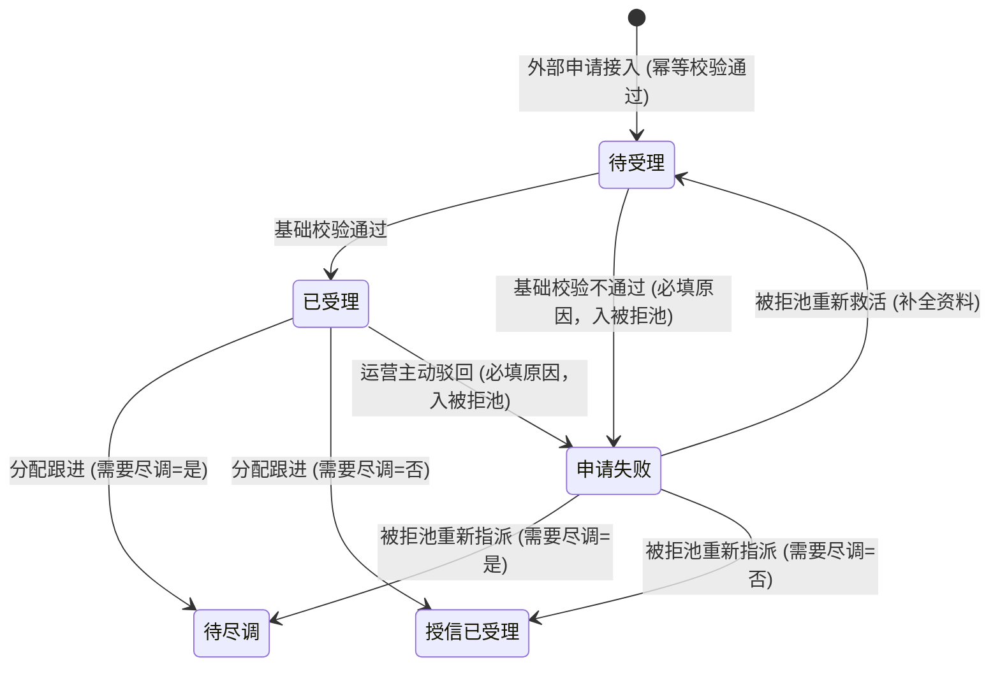
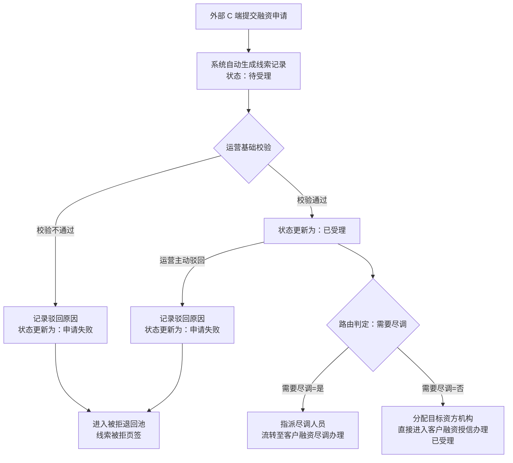

# 客户融资需求线索 业务规则规格

> **文档定位**：客户融资需求线索状态机、动作约束、前置校验规则、计算公式、权限与风控规则的唯一定义来源。
> **参考文档**：[客户融资需求线索主PRD.md](./客户融资需求线索主PRD.md)、[客户融资需求线索字段清单.md](./客户融资需求线索字段清单.md)、[02-融资管理-客户融资尽调办理](../02-融资管理-客户融资尽调办理/)、[03-融资管理-客户融资授信办理](../03-融资管理-客户融资授信办理/)、[05-融资管理-被拒退回池](../05-融资管理-被拒退回池/)
> **移动端对应**：[B端H5/03-业务办理/03-客户需求审批/03-客户融资需求线索](../../../../B端H5/03-业务办理/03-客户需求审批/03-客户融资需求线索/README.md)
> **版本**：V1.1 | **更新时间**：2026-09-02 | **责任人**：森云科技（Senyun Technology）

---

## 一、单据定位

| 项目 | 内容 |
| :--- | :--- |
| **单据层级** | **【第1层-计划/线索接入层】**（融资业务前置接入单据） |
| **核心职责** | 统一承接外部 C 端用户提交的融资申请，固化申请信息与“需要尽调”路由快照，支持运营人员完成基础校验、受理、分配跟进（分流转入尽调或直接转入授信）及驳回入池。 |
| **单据来源** | 外部 C 端移动门户/业务系统通过标准 API 接口自动提交生成。 |
| **上游单据** | **C 端用户融资申请单**：通过标准 API 以申请唯一标识 1:1 创建线索，至少带申请主体、融资金额/期数、抵/质押物类型、需要尽调标识和存货/仓单快照。 |
| **下游影响** | 1. 需要尽调=是：生成【客户融资尽调办理】待尽调任务，指派尽调专员； 2. 需要尽调=否：生成【客户融资授信办理】授信已受理任务，锁定合作资方机构； 3. 驳回：生成【被拒退回池 -> 线索被拒页签】异常归集记录。 |
| **审核流** | **【基础校验 + 受理 + 路由分配】**（运营人员先完成基础校验，受理后再执行分配跟进或驳回）。 |

### 数量/金额/期数口径隔离表

| 口径名称 | 存在于 | 业务含义与公式 | 约束条件 |
| :--- | :--- | :--- | :--- |
| **意向融资金额（元）** | 线索主表 | 客户在申请时填写的期望融资金额 | 系统自动带出，`意向融资金额 > 0`，保留 4 位小数，不可手工修改 |
| **意向融资期数** | 线索主表 | 客户期望融资期限（月/期） | 系统自动带出，必须为正整数（`期数 ≥ 1`），不可手工修改 |
| **授信金额（元）** | 列表/详情回写 | 资方机构最终审批确认并授信的额度 | 本节点初始为空，下游授信成功后异步回写；`0 < 授信金额` |
| **授信期数** | 列表/详情回写 | 资方机构最终批准的授信期限 | 本节点初始为空，下游授信成功后异步回写；正整数 |
| **贷款金额（元）** | 列表/详情回写 | 线上抵质押订单实际发放的贷款金额 | 本节点初始为空，下游放款后异步回写；`贷款金额 ≤ 授信金额` |
| **贷款期数** | 列表/详情回写 | 贷款合同约定的实际还款期限 | 本节点初始为空，下游放款后异步回写；正整数 |

---

## 二、状态定义

| 状态名称 | 枚举值 (`Enum`) | 业务含义 | 是否终态 | 进入条件 | 离开条件 |
| :--- | :--- | :--- | :---: | :--- | :--- |
| **待受理** | `PENDING_ACCEPT` | 外部申请成功接入后的初始状态，等待运营人员分配跟进或驳回 | 否 | 上游接口成功推送申请并创建线索记录 | 分配跟进成功（流转下游） / 驳回成功（入被拒池） |
| **已受理** | `ACCEPTED` | 运营基础校验通过，已固化受理信息，等待路由分配 | 否 | 运营基础校验通过 | 分配跟进成功（流转下游） / 主动驳回成功（入被拒池） |
| **申请失败** | `APPLY_FAILED` | 运营审核不准入或资料不合规执行驳回后的状态 | 否（入池待调度） | 运营人员执行“驳回”动作确认成功 | 在被拒池执行“重新救活”或“按路由重新指派” |

---

## 三、状态流转图

---

## 四、状态流转表（核心规则矩阵）

| 当前状态 | 触发动作 | 前置校验条件 | 结果状态 | 二次确认弹窗 | 后置级联影响 | 失败阻断提示 (Toast) |
| :--- | :--- | :--- | :--- | :--- | :--- | :--- |
| 未入库 | 接入融资申请 | R01: 申请必填要素完整 R02: 申请标识唯一幂等 | 待受理 | 无 | ① 保存申请主体及存货/仓单快照 ② 继承产品配置带入“需要尽调”快照 ③ 记录生成时间戳 | 接口返回错误码：“重复申请或数据不完整” |
| 待受理 | 基础校验通过并受理 | R01: 申请资料完整合规 | 已受理 | 无 | 固化受理人、受理时间，开放路由分配 | Toast: 「受理失败：请检查申请资料」 |
| 待受理 | 驳回 | R04: 驳回原因必填（≤200字） | 申请失败 | 「确认驳回该融资需求？驳回后将进入被拒记录池」 | ① 状态变更为“申请失败” ② 记录驳回原因、处理人与处理时间 ③ 通过可靠投递写入【被拒退回池 -> 线索被拒页签】 | Toast: 「驳回失败：请填写驳回原因」 |
| 已受理 | 分配跟进（路由流转） | R03: 需要尽调=是且已选同机构尽调专员；或需要尽调=否且已选有效资方机构 | 下游流转态 | 无 | ① 需要尽调=是：向【客户融资尽调办理】写入待尽调任务 ② 需要尽调=否：向【客户融资授信办理】写入授信已受理任务 ③ 回写线索最近处理人与处理时间 | Toast: 「分配失败：{缺少有效路由配置 / 请选择有效尽调专员 / 请选择有效资方}」 |
| 已受理 | 运营主动驳回 | R04: 驳回原因必填（≤200字） | 申请失败 | 「确认驳回该融资需求？驳回后将进入被拒记录池」 | ① 状态变更为“申请失败” ② 记录驳回原因、处理人与处理时间 ③ 通过可靠投递写入【被拒退回池 -> 线索被拒页签】 | Toast: 「驳回失败：请填写驳回原因」 |

---

## 五、动作能力矩阵

| 操作动作 | 待受理 (`PENDING_ACCEPT`) | 已受理 (`ACCEPTED`) | 申请失败 (`APPLY_FAILED`) |
| :--- | :---: | :---: | :---: |
| **查看详情** | ✅ | ✅ | ✅ |
| **基础校验通过并受理** | ✅ | ❌ | ❌ |
| **分配跟进（路由流转）** | ❌ | ✅（按需要尽调分流） | ❌（需在被拒池操作重新指派） |
| **驳回并填写原因** | ✅ | ✅ | ❌ |
| **列表组合筛选与导出** | ✅ | ✅ | ✅ |

---

## 六、前置业务校验规则（R01~R04）

### R01：申请要素必填与格式校验
- **企业货主**：企业名称、统一社会信用代码、经办人姓名、经办人手机号（11 位合规格式）必填；
- **个人货主**：申请人姓名、申请人身份证号（18 位合规校验）、联系电话必填；
- **融资意向**：意向融资金额 $>0$；意向融资期数 $\ge 1$ 且必须为正整数；抵/质押物类型必须属于 `['存货', '仓单']`。

### R02：接口幂等与防重复接入
- 上游推送请求必须携带 `apply_request_no`（外部申请唯一流水号）；
- 5 分钟内同一 `apply_request_no` 或相同主体在同产品的未终结申请重复提交，系统直接阻断并返回既有线索编号，防止重复生成单据。

### R03：路由规则与快照锁定
- 线索生成时，系统读取对应融资产品的“需要尽调”配置（`YES` / `NO`）并固化至线索单据快照；
- 分配跟进时强依赖该快照：
  - 快照为 `YES` 时，分配弹窗仅允许选择尽调专员下拉列表，禁止选择资方机构；
  - 快照为 `NO` 时，分配弹窗仅允许选择已启用的合作资方机构下拉列表，禁止指派尽调人员。

### R04：异常驳回与数据入池
- 运营驳回必须在弹窗中录入结构化驳回原因及详细说明；
- 驳回提交成功后，主单据状态更新与被拒池入池事件必须在同一事务中写入 Outbox，由可靠投递最终生成入池记录；入池记录状态置为 `申请失败`，不可物理删除。

---

## 七、权限、风控与安全控制（P01~P03 / W01~W02）

### P01：RBAC 操作权限控制
- `[线索·查看]`：拥有融资管理模块权限的所有内部账号可查看本机构范围线索；
- `[线索·分配跟进]`：仅限平台运营专员、风控主管角色可用；
- `[线索·驳回]`：仅限平台运营专员、风控主管角色可用。

### P02：数据查看范围隔离
- 平台运营与风控主管：可查看全平台所有接入线索；
- 资方机构账号：在本节点不可见未分配至本机构的线索（仅在下游授信节点可见已分配至本机构的任务）。

### P03：操作审计日志留痕
- 记录分配人、分配目标（人员 ID / 机构 ID）、分配时间、原状态与目标状态；
- 记录驳回人、驳回原因、时间戳及客户端 IP。

### W01：分布式防并发锁
- 运营在列表或详情点击“分配跟进”或“驳回”时，后端对 `clue_id` 加 Redis 分布式乐观锁（超时时间 5s），防止两名运营人员同时分配导致重复派单。

---

## 八、业务流程与联动

---

## 九、修订记录

| 日期 | 版本 | 变更说明 | 责任人 |
| :--- | :---: | :--- | :--- |
| 2026-08-14 | V1.0 | 初始定义客户融资需求线索业务规则 | 森云科技 |
| 2026-09-02 | V1.1 | 归入最新基准版 PC 端融资监管模块，规范跨文档引用 | 森云科技 |
